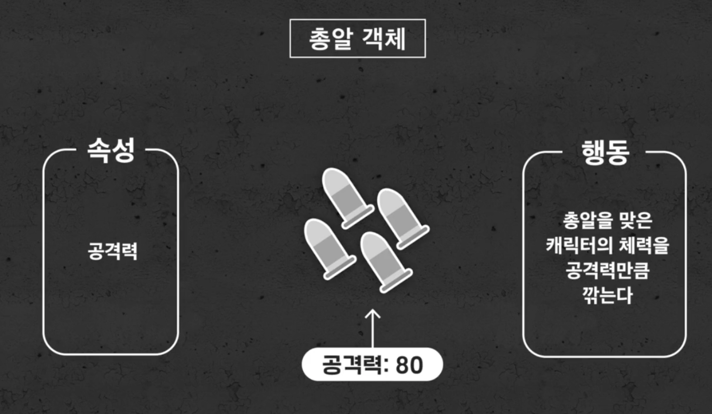
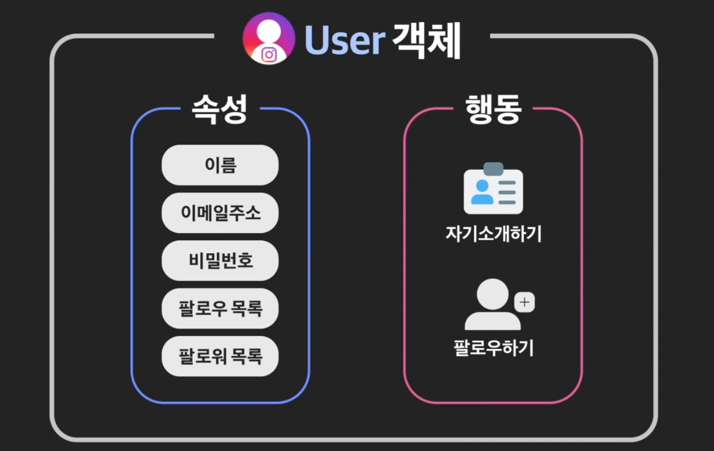

# OOP_1

- #### 수강 가이드

  "객체 지향 프로그래밍" 수업은 크게 세 개의 토픽으로 이루어져 있습니다. 각 토픽은 몇 개의 챕터로 이루어져 있고, 각 챕터는 여러 개의 레슨(영상, 노트, 과제, 퀴즈)으로 구성되어 있습니다.

  "객체 지향 프로그래밍" 수업의 목차를 간단하게 살펴봅시다.

  **Unit 1: 객체 지향 프로그래밍이란?**

  > 객체 지향 프로그래밍을 위한 준비!

  객체 지향 프로그래밍이 무엇이고 왜 중요한지를 알아가는 시간입니다. 객체와 클래스의 개념을 이해하고 파이썬에서 클래스를 어떻게 정의하고 사용하는지 공부합니다.

  - Chapter 1: 객체 지향 프로그래밍 시작하기
  - Chapter 2: 객체를 만드는 법
  - Chapter 3: 미리 알고가야 할 것들
  - Chapter 4: 객체 만들기 연습
  - Chapter 5: 객체 지향 프로그래밍 직접 해보기

  **Unit 2: 객체 지향 프로그래밍의 4가지 기둥**

  > 객체 지향 프로그래밍을 하기 위한 필수 개념 익히기!

  객체 지향 프로그래밍을 하기 위해 꼭 알아야할 4가지 개념을 배우고 실습합니다.

  - Chapter 1: 추상화(Abstraction)
  - Chapter 2: 캡슐화(Encapsulation)
  - Chapter 3: 상속(Inheritance)
  - Chapter 4: 다형성(Polymorphism)

  **Unit 3: 견고한 객체 지향 프로그래밍: SOLID 원칙**

  > 유지보수하기 쉬운 코드를 만들자!

  이제 객체 지향 프로그래밍을 어떻게 하는지는 배웠습니다. 하지만 단순히 할 줄 아는 것만으로는 부족합니다. 객체 지향 프로그래밍을 할 때 어떻게 유지보수하기 쉬운 코드를 만들 수 있는지를 알아야 합니다. 이를 위한 대표적인 객체 설계의 원칙 5가지를 설명합니다.

  - Chapter 1: 단일 책임 원칙 (Single Responsibility Principle)

  - Chapter 2: 개방 폐쇄 원칙 (Open-closed Principle)

  - Chapter 3: 리스코프 치환 원칙 (Liskov Substitution Principle)

  - Chapter 4: 인터페이스 분리 원칙 (Interface Segregation Principle)

  - Chapter 5: 의존 관계 역전 원칙 (Dependency Inversion Principle)

    

- #### 객체란?

  객체란 속성과 행동으로 이루어져 있음. 우리가 살아가면서 보는 모든 존재랑 객체라고 생각하면 됨. 

  

  자동차를 보더라도, 속성과 행동을 가지고 있음. 객체임. 

  

  

  또 다른 예시로는?

  

  **즉, 현실에 존재하든, 가상에 존재하든 속성과 행동을 떠올릴 수만 있다면, 그것은 객체라고 할 수 있음.**

  


- #### 객체 지향 프로그래밍 이란?

  **객체지향 프로그래밍** 이란? 프로그램을 여러 개의 독립된 개체들과 그 객체들 간의 상호작용으로 파악하는 프로그래밍 접근법을 의미한다. 즉, 객체지향 프로그래밍은 **프로그램을 객체들과 객체들 간의 소통으로 바라보겠다는 것.**

   

  총게임을 만든다고 해보자. 

  

  

  

  

  **각 객체의 속성과 행동을 정리했다면, 이제 각 객체들이 서로 어떻게 소통할지를 정해야 한다.**

  1. 게임 캐릭터 객체가 총 객체에게 발사하라고 신호를 보낸다. 

  2. 총 객체는 장전된 총알 중 하나를 발사한다(그러면서 자신의 속성 중, 장전된 총알 갯수 -= 1).

  3. 총알 다른 캐릭터 객체에 닿으면 캐릭터 객체에게 신호를 보낸다. 

  4. 신호를 받은 총알맞은 캐릭터 객체는, 그 공격력만큼 해당 자신의 체력을 깎는다(이때 깎고 난 후의 체력이 0 이하라면 죽어야 한다, 만약 죽으면 목숨 수 -1을 해야 한다). 

  

  

  객체 지향 프로그램을 만든다는 것은. 

  1. **프로그램에 어떤 객체가 필요한지를 정한다.** 
  2. **객체들의 속성과 행동을 정한다.** 
  3. **객체들이 서로 어떻게 소통할지 정한다.** 

  


## 객체 만드는 법

- #### 클래스와 인스턴스

  인스타 그램 같은 SNS를 만들려고 한다. 이 중에 User객체를 만들려고 한다. 일단 User객체가 어떤 모습일지 상상을 해봐야지. 

  속성과 행동을 상상해보기. 

  

  이걸 정한 것은 모든 users가 가지고 있어야 하는 틀을 정한 것. 

  앞으로 user를 만들 때는 이 틀을 기반으로 만들게 되는 것.

  

  

  **비유를 해보자면, 붕어빵 틀을 만든 것.**

  더 주문을 하면, 같은 틀로 계속 붕어을 만들어 줄 수 있음.  

  

  파이썬에선 이런 틀을 **클래스** 라고 하고, 이 틀을 가지고 만든 결과물을 **객체**라고 부른다. 

  클래스로 객체를 만든다. 혹은 클래스로 인스턴스를 만든다. 라고 말함. 

  **객체와 인스턴스는 일단은 같은 의미로 이해하자.** 

  

  파이썬 코드로 직접 클래스를 만들어 보자. 

  ```python
  class User:
      pass
  
  user1 = User()
  user2 = User()
  user3 = User()
  ```

  위의 3가지 user1, user2, user3는 모두 User인스턴스 이기는 하지만, 서로 다른 존재. 


- #### 인스턴스 변수

  인스턴스 변수 추가하는 방법은 굉장히 간단함. 

  

  인스턴스가 개별적으로 가지고 있는 변수를 **인스턴스 변수** 라고 말한다. 

  ```sql
  class User:
      pass
  
  user1 = User()
  user2 = User()
  user3 = User()
  
  user1.name = "김대위"
  print(user1.__dir__())
  user1.email = "captain@gmail.com"
  user1.password = "12345"
  
  user2.name = "손상혁"
  user2.email = "captain2@gmail.com"
  user2.password = "6493"
  
  user1.name = "이미영"
  user1.email = "myoung@gmail.com"
  user1.password = "115215"
  ```

  인스턴스 변수를 사용해 보자. 

  ```sql
  print(user1.email)
  print(user2.password)
  print(user3.name)
  ```


- #### 인스턴스 메소드

  앞에서 했던 속성이 변수였다면, 행동은 함수로 정의된다. 그 중에서 객체의 행동을 나타내는 함수를 특별히 **메소드** 라고 부른다. 

  

  메소드에는 크게 **3가지** 종류가 있다. 이번에는 그 중 인스턴스 메소드 먼저. 

  

  

  ```python
  class User:
      def say_hello(some_user):
          # 인사 메세지 출력 메소드
          print("안녕하세요 저는 {} 입니다.".format(some_user.name))
  ```

  some_user에는 user instance를 넣어주면 된다. 

  ```python
  #Instance Method
  User.say_hello(user1)
  User.say_hello(user2)
  User.say_hello(user3)
  ```

  ```python
  user1.say_hello() # 이렇게 출력도 가능하다. 	
  ```

- #### 인스턴스 메소드의 특별한 규칙

  인스턴스 메소드를 사용하는 방법은 2가지가 있음. 

  ```python
  User.say_hello(user1)
  ```

  ```python
  user1.say_hello()
  ```

  근데 생각해보면, 

  ```python
  class User:
      def say_hello(some_user):
          # 인사 메세지 출력 메소드
          print("안녕하세요 저는 {} 입니다.".format(some_user.name))
  
  ```

  파라미터를 넘겨준 적이 없는데 왜 되는거지?

  **이게 바로 인스턴스 메소드의 특별한 규칙**

  `User.say_hello(user1)` : 클래스의 메소드를 호출

  `user1.say_hello()` : 인스턴스의 메소드를 호출. **아래처럼 인스턴스의 메소드를 호출하면, user1인스턴스가 say_hello의 첫번째 파라미터로 자동으로 들어가게 되는 것.** 파라미터를 따로 써줄 필요가 없는 것.

  그럼 여기에 파라미터를 넣으면 어떻게 될까?

  ```sql
  user1.say_hello(user1)
  ```

  

  즉, 내가 넣은 파라미터는 두번째 파라미터로 들어간 것. 그런데, 애초에 함수 정의 자체가 파라미터 하나만 받게 되있음. 그래서 에러가 나는 것. 

  즉, `User.say_hello(user1, user1)` 이렇게 쓴거랑 같은 것. 

  *인스턴스 메소드 하나 추가해 보자.*

  ```python
  class User:
      def say_hello(some_user):
          # 인사 메세지 출력 메소드
          print("안녕하세요 저는 {} 입니다.".format(some_user.name))
  
      def login(some_user, my_email, my_password):
          # 로그인 메소드
          if (some_user.email == my_email and some_user.password == my_password):
              print("로그인 성공, 환영합니다. ")
          else:
              print("로그인 실패, 없는 아이디 이거나 잘못된 비밀번호입니다.")
  
  ```

   아래가 중요함. 

  인스턴스 메소드에서는 user1.login()으로 쓰는 경우에 맨 앞에 객체를 넣으면 안됨. 그럼 총 4개의 파라미터를 넣은 형태가되버림. 

  ```python
  user1.login(user1, "captain@gmail.com", "12345") # 총 4개의 파라미터를 보낸 것. *ERROR*
  user1.login("captain@gmail.com", "12345")
  ```

  


- #### self를 사용합시다

  클래스 내부에서 인스턴스 메소드를 정의할 때는, 첫번째 파라미터로 항상 받을 객체를 넣어줘야 함. 위에서는 `some_user`라고 했던 것. 

  중요한 규칙이 있음. 파이썬에서는 인스턴스 메서드의 첫번째 파라미터를 **self**로 쓸 것을 권장함. 

  위처럼 self 대신 다른 파라미터를 써도 아무 문제가 없음. 그러나, 자기 자신을 지칭하는 self를 쓰기로 약속하자. 

  ```sql
  class User:
      def say_hello(self):
          # 인사 메세지 출력 메소드
          print("안녕하세요 저는 {} 입니다.".format(self.name))
  
      def login(self, my_email, my_password):
          # 로그인 메소드
          if (self.email == my_email and self.password == my_password):
              print("로그인 성공, 환영합니다. ")
          else:
              print("로그인 실패, 없는 아이디 이거나 잘못된 비밀번호입니다.")
  
  ```

  


- #### 인스턴스 변수와 같은 이름을 갖는 파라미터

  *check_name 메소드 추가*

  ```sql
  class User:
      def say_hello(self):
          # 인사 메세지 출력 메소드
          print("안녕하세요 저는 {} 입니다.".format(self.name))
  
      def check_name(self, name):
          # 파라미터로 받는 Name이 유저의 이름과 같은지 불린으로 리턴해 주는 메소드
          return self.name == name
  ```

  이 코드에서 보면, 

  `self.name == name` 둘다 이름이 Name이야. 코드는 아무 문제가 없어. 인스턴스가 가진 값의 이름과 함수 내부에서 사용하는 파라미터 이름일 뿐. **심지어 이렇게 하는게 꽤나 일반적이기도 함.** 

  ```python
  print(user1.check_name("김대위"))
  
  ## TRUE로 리턴
  ```

  ```python
  print(user1.check_name("손상혁"))
  
  ## FALSE 리턴
  ```


- #### __init__ 메소드

  새 인스턴스를 만들 때 마다, 코드 두 줄만 쓰면 됨. 과제에서는 `initialize`메소드를 따로 정의했음. 

  

  나쁘지 않긴 한데, 아예 한줄로 줄이는 방법도 있음. 

  **init으로 바꿔 주면 됨**

  이렇게 앞뒤로 언더바가 두개씩 있는 메소드를 **Magic Method** 혹은 **Special Method**라고 부른다. 

  한국어로는 **특수메소드**라고 말함. 특수메소드란 "**특정 상황에서 자동으로 호출되는 메소드를 의미함**"

  이 이닛메소드 또한 **매직메소드**임. 

  

  지금까지는 인스턴스가 생성될 때, 

  `User = User()` 

  괄호 안이 비어있었음. 

  ```python
  class User:
      # initialize 메소드를 여기 쓰세요
      def __init__(self, name, email, password):
          self.name = name
          self.email = email
          self.password = password
  
  
  user1 = User("Young", "young@codeit.kr", "123456")
  user2 = User("Yoonsoo", "yoonsoo@codeit.kr", "abcdef")
  user3 = User("Taeho", "taeho@codeit.kr", "123abc")
  user4 = User("Lisa", "lisa@codeit.kr", "abc123")
  ```

  왜 될까?

  

  

- #### Str 메소드

  ```python
  class User:
      # initialize 메소드를 여기 쓰세요
      def __init__(self, name, email, password):
          self.name = name
          self.email = email
          self.password = password
  
  
  user1 = User("Young", "young@codeit.kr", "123456")
  user2 = User("Yoonsoo", "yoonsoo@codeit.kr", "abcdef")
  user3 = User("Taeho", "taeho@codeit.kr", "123abc")
  user4 = User("Lisa", "lisa@codeit.kr", "abc123")
  
  print(user1)
  print(user2)
  print(user3)
  ```

  현재는 객체 자체를 프린트 하면, **객체 위치 정보만 출력됨.** 

  

  어떤 클래스 인지와 메모리 주소가 출력된 것. 근데 이런식으로 나오면 큰 의미가 없지. 

  ```python
  class User:
      # initialize 메소드를 여기 쓰세요
      def __init__(self, name, email, password):
          self.name = name
          self.email = email
          self.password = password
  
      def __str__(self):
          return "사용자 : {}, 이메일 : {}, 비밀번호 : ******".format(self.name, self.email)
  
  ```

  str도 **magic mathod**. 특수 메소드는 양쪽에 under score가 두개씩 있으니깐, **dou**ble un**der**score. **dunder** 메소드라고 부른다. *str이면 던더str 이라고 부른다.* 

  특수 메소드는 특정 상황에서 자동으로 실행되는 메소드라고 했음. dunder str메소드는 프린트함수로 호출할 때 자동으로 불러짐. 

  


- #### Class 변수

  지금까지는 인스턴스 자신의 속성을 나타내는 인스턴스 변수를 배웠음. 그런데, 여러 인스턴스들이 공유하는 속성이 있을 수 있음. 예를 들어, user class로 만들어진 인스턴스의 총 갯수를 나타내는 속성을 만들고 싶다면?

  이 속성은 인스턴스가 가지고 있는 값들이 아니고, 다같이 공유하는 값들. 어떤 유저 인스턴스여도 똑같은 값들을 가지고 있어야 한다. 

  

  매우 간단함

  ```python
  class User:
      count = 0
      
      def __init__(self, name, email, password):
          self.name = name
          self.email = email
          self.password = password
  ```

  쓰는 것은 더 간단함. 

  ```python
  User.count = 1
  print(User.count)
  ```

  **만약 클래스 변수 count가 유저 인스턴스 갯수를 정확히 나타내도록 하려면?**

  ```python
  class User:
      count = 0
  
      def __init__(self, name, email, password):
          self.name = name
          self.email = email
          self.password = password
          User.count += 1
  
  user1 = User("Young", "young@codeit.kr", "123456")
  user2 = User("Yoonsoo", "yoonsoo@codeit.kr", "abcdef")
  user3 = User("Taeho", "taeho@codeit.kr", "123abc")
  user4 = User("Lisa", "lisa@codeit.kr", "abc123")
  
  print(User.count)
  ```

  그런데 클래스 변수에 접근할 때, 인스턴스 변수로도 접근이 가능함. 

  ```python
  print(User.count)
  print(user1.count)
  print(user2.count)
  print(user3.count)
  ```

  그런데 설정도 이렇게 할 수 있을까?

  **여기서 엄청 신기한 부분이 있음.**

  ```python
  user1.count = 5
  
  print(User.count)
  print(user1.count)
  print(user2.count)
  print(user3.count)
  ```

  

  user1.count만 5로 출력이 되고, 나머지는 그대로 됨. 

  왜 그런지 알지?

  일단, user2.count를 쓸 때는, user2 객체 메모리를 먼저 찾아보고 없으니깐, 클래스 변수를 찾으러 간거야. 그런데 user1같은 경우는 `user1.count`를 써서, user1 메모리 내부에 count가 있으니깐 그걸 먼저 찾아봤고 있으니깐 출력을 한거지. 

  같은 이름의 클래스 변수와, 같은 이름의 인스턴스 변수가 있으면 **인스턴스 변수가 읽어짐**. 

  애초에 이런 상황을 방지하는게 좋지. 클래스 변수에 값을 설정할때는 꼭 클래스 이름으로만 쓰자. 

  클래스 변수 count를 고치고 싶으면 아래처럼 고쳐야지. 

  ```python
  User.count = 5
  
  print(User.count)
  print(user1.count)
  print(user2.count)
  print(user3.count)
  ```

  

  

  


- #### 데코레이터

  데코레이터란 뭘까?

  

  ```python
  
  def print_hello():
      print("hello")
  
  def add_print_to(original):
      def wrapper():
          print("함수 시작")
          original()
          print("함수 끝")
      return wrapper
  ```

  **`add_prin_to` 는 파라미터로 어떤 함수를 받아서, 또 다른 함수를 리턴하는**

   ```python
   add_print_to(print_hello)
   ```

  앞 뒤로 다른 부가기능을 추가한 것. 

  

  add_print_to는 정의내렸던 wrapper함수를 **return**만 해줌. 실행시켜 주는 것이 아님. 

  ```python
  add_print_to(print_hello)()
  ```

  ```python
  
  def print_hello():
      print("hello")
  
  def add_print_to(original):
      def wrapper():
          print("함수 시작")
          original()
          print("함수 끝")
      return wrapper
  
  print_hello = add_print_to(print_hello)
  print_hello()
  ```

  정리 하자면, add_print_to함수가 하는 일은 파라미터로 어떤 함수를 받아서 데코레이팅 한 다음 넘겨주는 것. 그리고 그 함수를 리턴시켜 주는 것이 역할이였음. 

  그래서 이 함수는 **add_print_to** 함수는 다른 함수를 꾸며주는 함수이기 때문에, 이를 데코레이터 함수라고 부른다. 

- #### 데코레이터 2

  사실 `print_hello = add_print_to(print_hello)` 이 줄을 쓰지 않고도, print_hello함수를 꾸미는 방법이 있음. 

  ```python
  # 데코레이터 쉽게 활용하는 방법
  def add_print_to(original):
      def wrapper():
          print("함수 시작")
          original()
          print("함수 끝")
      return wrapper
  
  @add_print_to
  def print_hello():
      print("hello")
  
  
  print_hello = add_print_to(print_hello)
  print_hello()
  ```

  ***@ add_print_to* 를 *print_hello*위에 쓴다는 것은. print_hello함수를 add_print_to로 꾸며주라는 의미**

  즉, decorator의 의미는, `print_hello = add_print_to(print_hello` 이거야. 

  add_print_to의 인자로, 아래의 함수를 넣고, 그 리턴된 함수를 다시 원래 함수에 할당하는 것. 

  그래서 그 아래서 

  ```python
  print_hello()
  ```

  그냥 이렇게 함수 실행만 시켜도 알아서, 이렇게 나옴. 

  

  데코레이터는 어떤 쓸모가 있을까?

  비슷한 함수에 일일이 같은 기능을 추가하려는 경우가 많음. 

  

  이럴때 중복되는 부분을 모두 데코레이터에 넣고, 위에 @만 붙여주면 됨. 

  

  **매우 간단해짐. 데코레이터 객체지향에서 자주 보게 됨.**

  데코레이터를 보면, 함수를 다른 함수로 꾸며서 기능을 추가해줬구나 라고만 생각하면 됨. 


- #### 클래스 메소드(Class Method)

  

  나는 User의 Count를 출력하는 메소드를 만들고 싶음. 

  

  class method는 @classmethod 데코레이터를 써서 파이썬에게 이게 클래스 메소드임을 알려준다. 

  다른 뭔가 기능을 추가한거겠지. 

  **클래스 메소드에서는, 첫번째 파라미터로 클래스가 자동전달됨.** 

  그니깐 파이썬의 구조 자체가, 클래스 내부에서 def가 보이면, 디폴트로 self라는 자기자신 객체를 리턴하되, @classmethod라는 데코레이터가 보이면 첫번째 인자로 class를 전달하게 해 놓은 것. 즉, 이 데코레이터 자체가 꾸며주면서 추가한 기능이 "*class를 첫번째 인자로 리턴하라*" 이것이였던 것. 

  **첫번째 파라미터 이름 cls로 하는 것은 파이썬 사용자들의 약속**

  

  ```python
  
  class User:
      count = 0
  
      def __init__(self, name, email, password):
          self.name = name
          self.email = email
          self.password = password
  
      def say_hello(self):
          print("안녕하세요! 저는 {} 입니다.".format(self.name))
  
      def __str__(self):
          return "사용자 : {}, 이메일 : {}, 비밀번호 : ******".format(self.name, self.email)
  
      @classmethod
      def number_of_users(cls):
          print("총 유저 수는 : {} 입니다.".format(cls.count))
  
  
  user1 = User("Young", "young@codeit.kr", "123456")
  user2 = User("Yoonsoo", "yoonsoo@codeit.kr", "abcdef")
  user3 = User("Taeho", "taeho@codeit.kr", "123abc")
  
  User.number_of_users()
  user1.number_of_users()
  ```

  여기서도 마찬가지로

  ```python
  User.number_of_users()
  user1.number_of_users()
  ```

  인스턴스와 클래스로 동시에 호출 가능. 여기서도 똑같겠지. user1이라는 객체 내부에서 찾다가 없으니깐 클래스 범위로 가서 함수를 찾는 거겠지. 

  **차이를 한번 다시 짚고 가자면,**

  

  *위의 두가지 호출에서 2번째 케이스에는 인스턴스로 자기 자신을 자동으로 전달하게 됨.*

  하지만 클래스 메소드에서는 두 가지 방법 모두 첫번째 파라미터로 자기 자신이 직접 전달됨. 

   

  **class가 자동 전달되는 이유는 데코레이터에서 해주고 있는 것.** 

  근데 사실 class method로 작성했던, **number_of_users**메소드는 그냥 **instance method**로 작성해도 됨. 

  ```python
  class User:
      count = 0
  
      def __init__(self, name, email, password):
          self.name = name
          self.email = email
          self.password = password
  
  
      # @classmethod
      # def number_of_users(cls):
      #     print("총 유저 수는 : {} 입니다.".format(cls.count))
  
      def number_of_users(self):
          print(self.count)
          print(User.count)
  ```

  ```python
  User.number_of_users(user1)
  user1.number_of_users()
  ```

  결과 실행 시키는 것에 아무 문제가 없음. 

  **그러면 애초에 왜 클래스 메소드로 만들었을까?**

  그거는 number_of_users가 인스턴스 변수를 사용하지 않기 때문. 

  **이처럼 인스턴스 변수는 사용 안하고, 클래스 변수만 사용하는 메소드라면 클래스 메소드로 작성하자.** 

  

  

  아예 현재 인스턴스 자체가 없는데 클래스에 함수가 필요하면, 당연히 클래스 메소드를 사용해야지. 

  

  인스턴스 아예 없이 그냥 아래처럼 해도 실행이 됨. 

  이렇게 인스턴스가 하나도 없어도 실행할 가능성이 있으면 클래스 메소드로 사용해야 함. 

  ```python
  class User:
      count = 0
  
      def __init__(self, name, email, password):
          self.name = name
          self.email = email
          self.password = password
          User.count += 1
  
      def say_hello(self):
          print("안녕하세요! 저는 {} 입니다.".format(self.name))
  
      def __str__(self):
          return "사용자 : {}, 이메일 : {}, 비밀번호 : ******".format(self.name, self.email)
  
      @classmethod
      def number_of_users(cls):
          print("총 유저 수는 : {} 입니다.".format(cls.count))
  
  
  User.number_of_users()
  ```

  


- #### 정적 메소드

  이때까지

  - **인스턴스 메소드**
  - **클래스 메소드**

  를 배웠습니다. 메소드의 종류는 총 3가지라고 했죠? 아직 하나가 더 남았습니다.

  바로 **정적 메소드**(static method)입니다. **정적 메소드는 인스턴스 변수, 클래스 변수를 전혀 다루지 않는 메소드입니다.**  아래 코드를 볼까요?

  ```python
  class User:
      count = 0
      
      def __init__(self, name, email, pw):
          self.name = name
          self.email = email
          self.pw = pw
      
          User.count += 1
      
      def say_hello(self):
          print("안녕하세요! 저는 {}입니다!".format(self.name))
      
      def __str__(self):
          return "사용자: {}, 이메일: {}, 비밀번호: ******".format(self.name, self.email)
      
      @classmethod
      def number_of_users(cls):
          print("총 유저 수는: {}입니다".format(cls.count))
      
      @staticmethod
      def is_valid_email(email_address):
          return "@" in email_address
  ```

  지금 `User` 클래스에서 `is_valid_email` 메소드가 정적 메소드입니다. 정적 메소드는 메소드 정의 위에  **`@staticmethod`** 데코레이터를 표시해야 합니다. `is_valid_email` 메소드는 파라미터 `email_address`로 받은 문자열에  `@`가 들어있는지 체크합니다.

  정적 메소드는

  - 인스턴스 메소드의 `self`
  - 클래스 메소드의 `cls`

  같은 자동 전달되는 파라미터가 없습니다.

  그리고 정적 메소드는 아래 코드처럼 **인스턴스, 클래스 두 가지 모두를 통해 사용 가능합니다.**

  ```python
  print(User.is_valid_email("taehosung"))
  print(User.is_valid_email("taehosung@codeit.kr"))
      
  print(user1.is_valid_email("taehosung"))
  print(user1.is_valid_email("taehosung@codeit.kr"))
  False
  True
  False
  True
  ```

  **정적 메소드는 언제 사용할까요?**

  ```python
  # 인스턴스 메소드
  def __str__(self):
      return "사용자: {}, 이메일: {}, 비밀번호: ******".format(self.name, self.email)
  
  # 클래스 메소드    
  @classmethod
  def number_of_users(cls):
      print("총 유저 수는: {}입니다".format(cls.count))
  
  # 정적 메소드    
  @staticmethod
  def is_valid_email(email_address):
      return "@" in email_address
  ```

  `User` 클래스에는 인스턴스 메소드, 클래스 메소드, 정적 메소드가 있습니다.

  1. 인스턴스 메소드 `__str__`는 인스턴스 변수인 `self.name`, `self.email`을 사용하고,
  2. 클래스 메소드 `number_of_user`는 클래스 변수인 `cls.count`를 사용합니다.
  3. 하지만 `is_valid_email` 메소드에선 아무 변수도 사용하고 있지 않네요.

  **인스턴스 변수나 클래스 변수 중 아무것도 사용하지 않을 메소드라면 정적 메소드로 만들면 됩니다.** 그러니까 어떤 속성을 다루지 않고, 단지 기능(행동)적인 역할만 하는 메소드를 정의할 때 정적 메소드로 정의하면 됩니다. 이제 여러분은 메소드의 종류에는

  - 인스턴스 메소드
  - 클래스 메소드
  - 정적 메소드

  이 3가지가 있다는 것을 기억해주세요.

- 