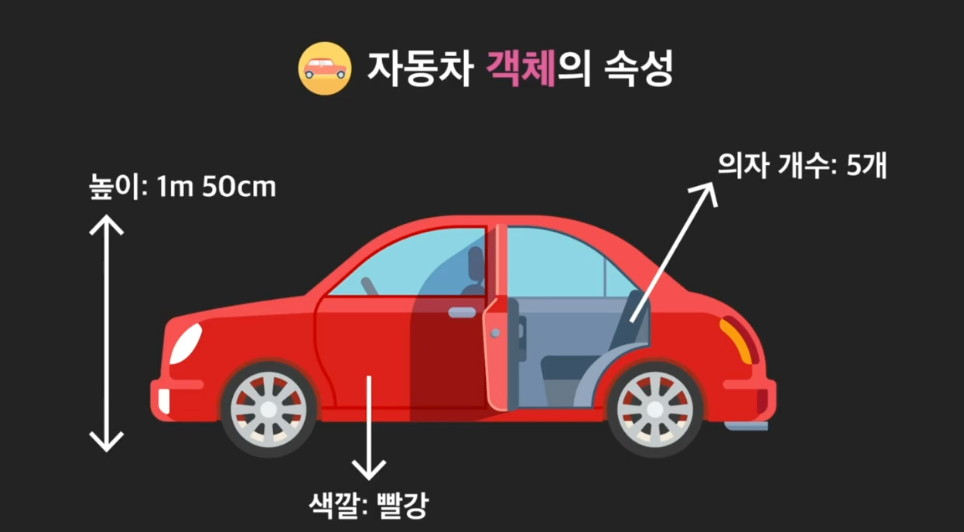
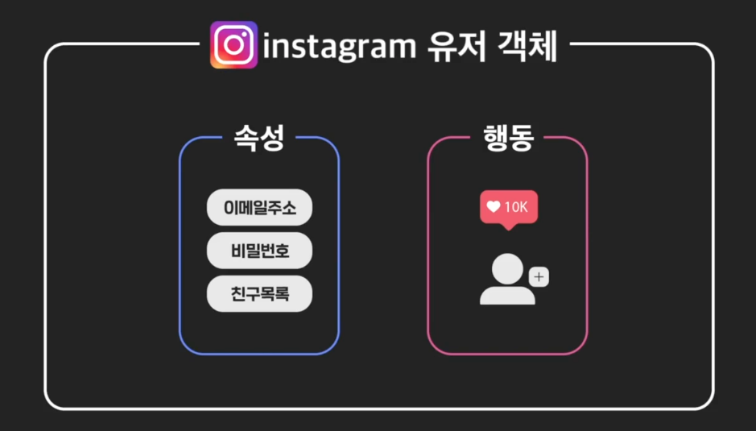
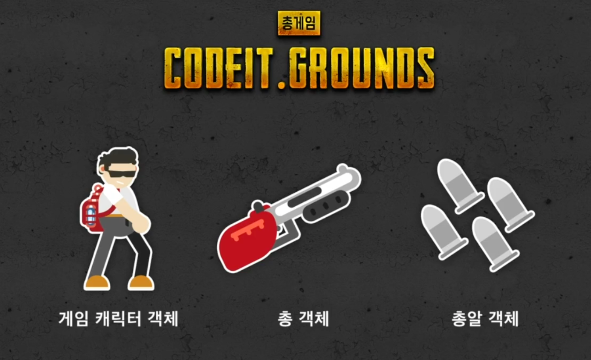
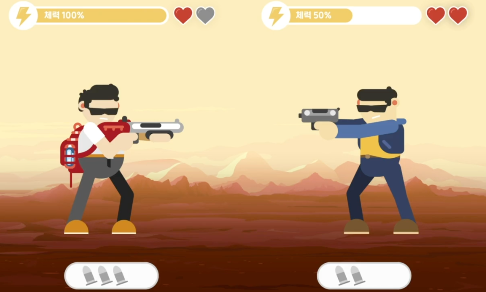

# OOP_1

- #### 수강 가이드

  "객체 지향 프로그래밍" 수업은 크게 세 개의 토픽으로 이루어져 있습니다. 각 토픽은 몇 개의 챕터로 이루어져 있고, 각 챕터는 여러 개의 레슨(영상, 노트, 과제, 퀴즈)으로 구성되어 있습니다.

  "객체 지향 프로그래밍" 수업의 목차를 간단하게 살펴봅시다.

  **Unit 1: 객체 지향 프로그래밍이란?**

  > 객체 지향 프로그래밍을 위한 준비!

  객체 지향 프로그래밍이 무엇이고 왜 중요한지를 알아가는 시간입니다. 객체와 클래스의 개념을 이해하고 파이썬에서 클래스를 어떻게 정의하고 사용하는지 공부합니다.

  - Chapter 1: 객체 지향 프로그래밍 시작하기
  - Chapter 2: 객체를 만드는 법
  - Chapter 3: 미리 알고가야 할 것들
  - Chapter 4: 객체 만들기 연습
  - Chapter 5: 객체 지향 프로그래밍 직접 해보기

  **Unit 2: 객체 지향 프로그래밍의 4가지 기둥**

  > 객체 지향 프로그래밍을 하기 위한 필수 개념 익히기!

  객체 지향 프로그래밍을 하기 위해 꼭 알아야할 4가지 개념을 배우고 실습합니다.

  - Chapter 1: 추상화(Abstraction)
  - Chapter 2: 캡슐화(Encapsulation)
  - Chapter 3: 상속(Inheritance)
  - Chapter 4: 다형성(Polymorphism)

  **Unit 3: 견고한 객체 지향 프로그래밍: SOLID 원칙**

  > 유지보수하기 쉬운 코드를 만들자!

  이제 객체 지향 프로그래밍을 어떻게 하는지는 배웠습니다. 하지만 단순히 할 줄 아는 것만으로는 부족합니다. 객체 지향 프로그래밍을 할 때 어떻게 유지보수하기 쉬운 코드를 만들 수 있는지를 알아야 합니다. 이를 위한 대표적인 객체 설계의 원칙 5가지를 설명합니다.

  - Chapter 1: 단일 책임 원칙 (Single Responsibility Principle)

  - Chapter 2: 개방 폐쇄 원칙 (Open-closed Principle)

  - Chapter 3: 리스코프 치환 원칙 (Liskov Substitution Principle)

  - Chapter 4: 인터페이스 분리 원칙 (Interface Segregation Principle)

  - Chapter 5: 의존 관계 역전 원칙 (Dependency Inversion Principle)

    

- #### 객체란?

  객체란 속성과 행동으로 이루어져 있음. 우리가 살아가면서 보는 모든 존재랑 객체라고 생각하면 됨. 

  

  자동차를 보더라도, 속성과 행동을 가지고 있음. 객체임. 

  

  

  또 다른 예시로는?

  

  **즉, 현실에 존재하든, 가상에 존재하든 속성과 행동을 떠올릴 수만 있다면, 그것은 객체라고 할 수 있음.**

  

- #### 객체 지향 프로그래밍 이란?

  **객체지향 프로그래밍** 이란? 프로그램을 여러 개의 독립된 개체들과 그 객체들 간의 상호작용으로 파악하는 프로그래밍 접근법을 의미한다. 즉, 객체지향 프로그래밍은 **프로그램을 객체들과 객체들 간의 소통으로 바라보겠다는 것.**

   

  총게임을 만든다고 해보자. 

  

  

  

  

  **각 객체의 속성과 행동을 정리했다면, 이제 각 객체들이 서로 어떻게 소통할지를 정해야 한다.**

  1. 게임 캐릭터 객체가 총 객체에게 발사하라고 신호를 보낸다. 

  2. 총 객체는 장전된 총알 중 하나를 발사한다(그러면서 자신의 속성 중, 장전된 총알 갯수 -= 1).

  3. 총알 다른 캐릭터 객체에 닿으면 캐릭터 객체에게 신호를 보낸다. 

  4. 신호를 받은 총알맞은 캐릭터 객체는, 그 공격력만큼 해당 자신의 체력을 깎는다(이때 깎고 난 후의 체력이 0 이하라면 죽어야 한다, 만약 죽으면 목숨 수 -1을 해야 한다). 

  

  

  객체 지향 프로그램을 만든다는 것은. 

  1. **프로그램에 어떤 객체가 필요한지를 정한다.** 
  2. **객체들의 속성과 행동을 정한다.** 
  3. **객체들이 서로 어떻게 소통할지 정한다.** 

  