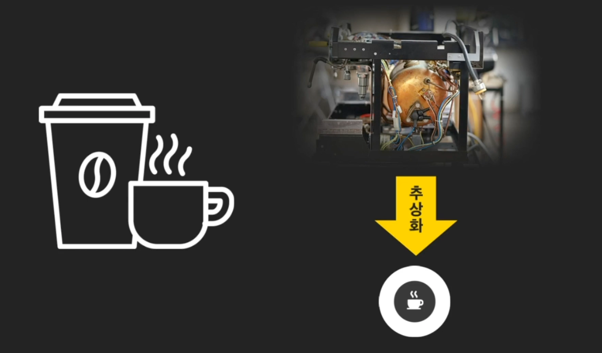
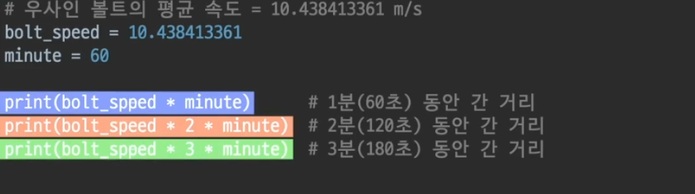
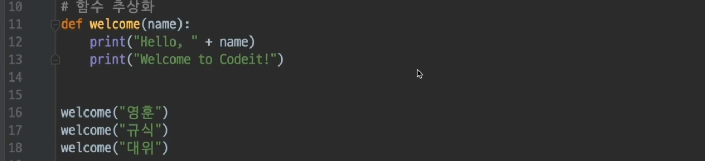
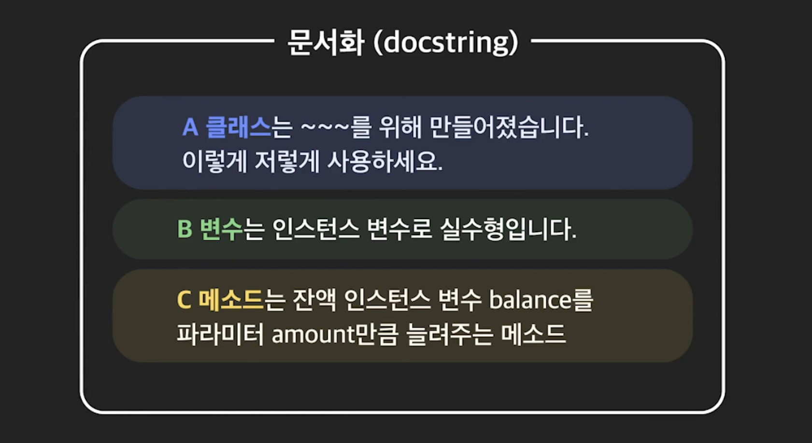
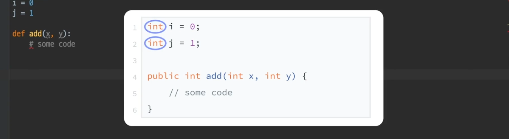
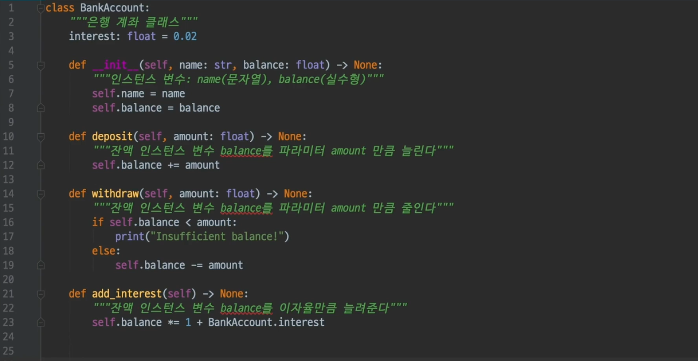

# 객체 지향 프로그래밍의 4개의 기둥

## 추상화

- #### 객체 지향 프로그래밍의 4가지 기둥이란

  이제부터는 객체 지향 프로그래밍을 하기 위해 알아야할 **4가지 기본 개념**들을 배워볼게요.  “객체 지향 프로그래밍의 4가지 기둥” 이라고도 부르는 이 4가지 개념을 제대로 알아야 객체 지향 프로그래밍을 잘 할 수 있습니다. 이 4가지는

  - 추상화(Abstraction)
  - 캡슐화(Encapsulation)
  - 상속(Inheritance)
  - 다형성(Polymorphism)

  입니다. 처음에는 단어가 어렵게 들려도 설명을 들으면 어려운 개념이 아닙니다. 두근거리는 마음을 안고 다음 레슨으로 넘어가볼까요?

  


- #### 추상화란?

  추상화란 무엇일까? 커피머신을 생각해 보자. 내부가 어떻게 되있는지는 몰라도, 커피 머신에 원두랑 물을 넣고 버튼을 누르면 커피가 나온다는 사실은 알고 있음. 

  

  그런데 사실 엄청 복잡한 기계임. 버튼을 누르는 순간부터 내부적으로는 엄청 복잡한 작업들을 함. 매우 과학적이고 세밀한  것들이 일어나고 있겠지. 그러나, 이렇게 자세한 내용을 몰라도 우리는 커피를 마실 수 있음. 이렇게 어떤 것을 사용할 때, **몰라도 되는 정보는 감추고, 꼭 알아야 하는 것만 드러내는 것을 추상화 라고 한다.**

   

  커피 한잔 마실려고, 커피 머신에 사용된 기술을 모두 다 알 필요는 없지. 최소한의 정보만 알아도 커피를 마실 수 있어야 함. 이렇게 어떤 것에서 사용에 꼭 필요한 부분만 드러내고, 사용자는 이렇게 드러난 부분만 알면 되도록 하는 것을 추상화 라고 함. 

  


- #### 추상화는 이때까지 쓰고 있었다. 

  그 동안 코드에서 변수/함수 작성했던 것도 다 추상화임. 

  변수에 값을 설정하면, 그 이후에는 값을 몰라도 변수 **이름만** 알면 됨. 어려운 숫자 몰라도, bolt_speed라고만 치면 돼. 

  

  함수도 마찬가지. 함수 이름과 파라미터, 그리고 함수가 뭘 하는지만 대충 알아도 함수를 사용하는것에 문제가 없음. 

  

  클래스도 추상화야. 클래스 코드 전체 다 안봐도, 클래스 안에 꼭 필요한 정보만 알면 돼. **클래스 내부 정보를 몰라도, 사용하기 위한 최소의 정보만 알면 사용하는데 문제가 없음.** 

  리스트 클래스를 보자. Append가 새로운거 추가해 준다는 정보만 알아도 리스트에 뭔가 추가할 수 있음. [0] [1] [2]이렇게 쓰면 리스트의 각 원소를 받아와서 출력 할 수도 있음. 모든게 다 추상화였네. 

  


- #### 추상화 잘하기. 이름 잘 짓기

  추상화를 잘하려면, 일단 변수/메소드/클래스의 이름을 잘 지어야 함. 그래야 파악을 바로 하지. 

  아래 코드는 본인도 시간 지나서 보면 뭔지 보기 어려움. 

  

  멀쩡히 지은 예씨. 

  

  **클래스, 함수, 변수를 의미가 잘 담기도록 네이밍 하라는 것이 결론**

  

- #### 추상화 잘하기: 문서화하기

  이름을 잘 지어도 이름에 모든 의미를 담을 순 없음. 부족하지. 그 외에도 정보를 조금 더 줄 수 있지. 이런 정보들을 코드 속에 기록하는 것을 문서화(**docstring; documentation string**)라고 한다.

  

  ```python
  ​```
  이것이 docstring 입니다. 
  여러줄을 써도 하나의 docsring 입니다. 
  ​```
  ```

  


- #### 추상화 잘 쓰기 : 문서화 결과

  코드 까보면서, docstring읽는 것보다 더 좋은 방법이 있음. 

  `help(classs 이름)`

  

  다음은 `help(list)`결과 docstring 잘 적어뒀네. 

  


- #### 문서화 스타일

  문서화의 형식에 관해 꼭 지켜야할 규칙은 없습니다. 하지만 흔히 사용하는 포맷은 있습니다. 유저를 위한 추천 영상을 찾는 `find_suggestion_videos` 메소드의 **docstring**을 작성한다고 해봅시다. 널리 쓰이는 포맷 3가지로 각각 문서화를 해볼게요.

  ```python
  def find_suggestion_videos(self, number_of_suggestions=5):
  ```

  **Google docstring:**

  ```
  """유저에게 추천할 영상을 찾아준다
  Parameters:
    number_of_suggestions (int): 추천하고 싶은 영상 수
      (기본값은 5)
      
  Returns:
    list: 추천할 영상 주소가 담긴 리스트
  """
  ```

  **reStructuredText (파이썬 공식 문서화 기준):**

  ```
  """유저에게 추천할 영상을 찾아준다
      
  :param number_of_suggestions: 추천하고 싶은 영상 수
    (기본값은 5)
  :type number_of_suggestions: int
  :returns: 추천할 영상 주소가 담긴 리스트
  :rtype: list
  """
  ```

  **NumPy/SciPy (통계, 과학 분야에서 쓰이는 Python 라이브러리):**

  ```
  """유저에게 추천할 영상을 찾아준다
      
  Parameters
  ----------
  number_of_suggestions: int
    추천하고 싶은 영상 수 (기본값은 5)
      
  Returns
  -------
  list 
    추천할 영상 주소가 담긴 리스트
  """
  ```

  한 가지 메소드의 정보를 3가지 포맷으로 문서화한 것을 보았습니다. 문서화에서 가장 중요한 것은 프로그램을 함께 만드는 팀원들과 이러한 문서화 포맷에 관해 미리 약속을 하고 이를 잘 지키는 것입니다. 혼자서 만드는 프로그램이라도 자신만의 포맷을 일관성있게 사용한다면 나중에 프로그램을 수정할 때 도움이 되겠죠?


- #### 파이썬의 type hinting

  파이썬은 동적타입 언어. 즉, 변수의 타입을 따로 정하지 않아도 된다는 것. 정적 타입 언어에서는 변수의 타입을 표시해야 한다. 자바 같은거 보면 `a= int 10`이렇게 함. 

  

  동적타의 문제는 해당 변수에 어떤 타입을 넣어야 되는지 표시가 없어서, 개발자들이 혼란을 느낄 수 있음. 

  ```python
  def add(x, y):
      # some code
  ```

  그냥 이렇게 있으면, x, y에 뭘 넣어야 하는지 알 수가 없음. 그래서 동적타입 언어 좋아하지 않는 개발자들도 있음. 

  그래서 추가한게 **Type hinting**

  type hinting하려면, 변수 뒤에 : 쓰고 타입을 쓰면 됨. 

  메소드의 리턴하는 값은 **->** 이 표시를 쓰면 됨.  

  

  *type hinting한 다음에 다른것을 넣으면 실행 자체는 문제가 없는데, ide들에서는 경고창이 뜨긴 함.* 왠만하면 Type hinting 해주자. 

   

  

