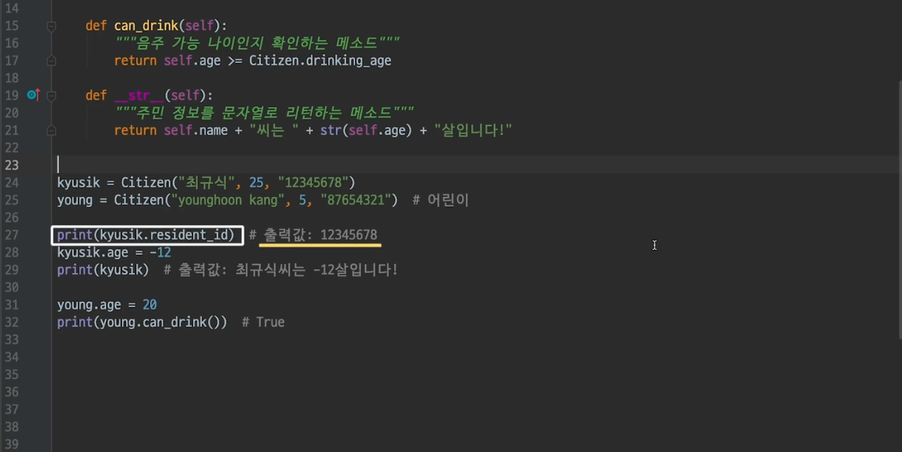
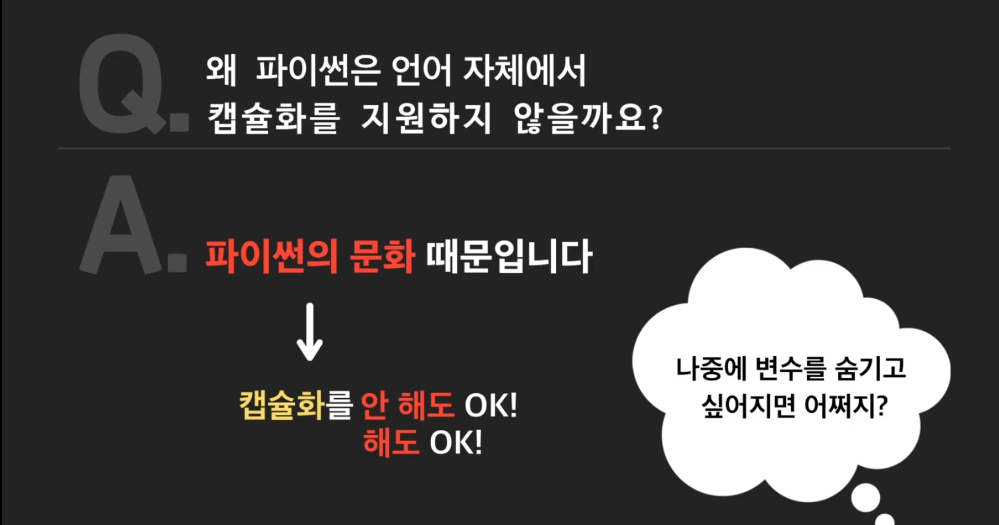
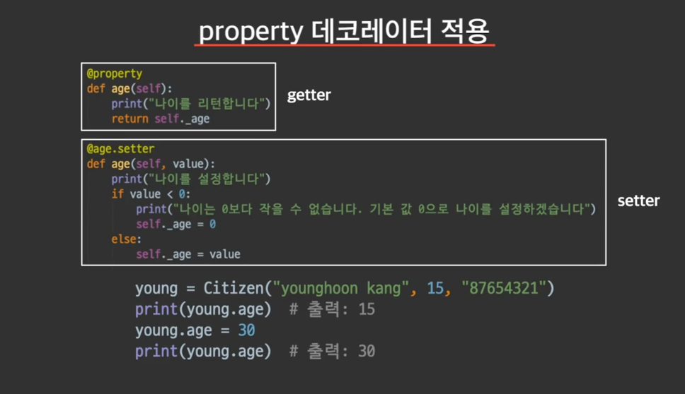
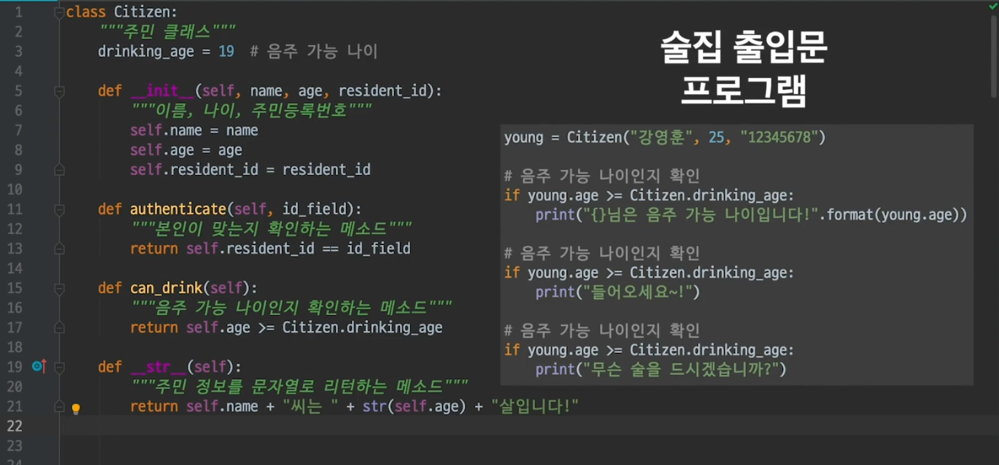

# 객체 지향 프로그래밍의 4개의 기둥

## 추상화

- #### 객체 지향 프로그래밍의 4가지 기둥이란

  이제부터는 객체 지향 프로그래밍을 하기 위해 알아야할 **4가지 기본 개념**들을 배워볼게요.  “객체 지향 프로그래밍의 4가지 기둥” 이라고도 부르는 이 4가지 개념을 제대로 알아야 객체 지향 프로그래밍을 잘 할 수 있습니다. 이 4가지는

  - 추상화(Abstraction)
  - 캡슐화(Encapsulation)
  - 상속(Inheritance)
  - 다형성(Polymorphism)

  입니다. 처음에는 단어가 어렵게 들려도 설명을 들으면 어려운 개념이 아닙니다. 두근거리는 마음을 안고 다음 레슨으로 넘어가볼까요?

  


- #### 추상화란?

  추상화란 무엇일까? 커피머신을 생각해 보자. 내부가 어떻게 되있는지는 몰라도, 커피 머신에 원두랑 물을 넣고 버튼을 누르면 커피가 나온다는 사실은 알고 있음. 

  

  그런데 사실 엄청 복잡한 기계임. 버튼을 누르는 순간부터 내부적으로는 엄청 복잡한 작업들을 함. 매우 과학적이고 세밀한  것들이 일어나고 있겠지. 그러나, 이렇게 자세한 내용을 몰라도 우리는 커피를 마실 수 있음. 이렇게 어떤 것을 사용할 때, **몰라도 되는 정보는 감추고, 꼭 알아야 하는 것만 드러내는 것을 추상화 라고 한다.**

   

  커피 한잔 마실려고, 커피 머신에 사용된 기술을 모두 다 알 필요는 없지. 최소한의 정보만 알아도 커피를 마실 수 있어야 함. 이렇게 어떤 것에서 사용에 꼭 필요한 부분만 드러내고, 사용자는 이렇게 드러난 부분만 알면 되도록 하는 것을 추상화 라고 함. 

  


- #### 추상화는 이때까지 쓰고 있었다. 

  그 동안 코드에서 변수/함수 작성했던 것도 다 추상화임. 

  변수에 값을 설정하면, 그 이후에는 값을 몰라도 변수 **이름만** 알면 됨. 어려운 숫자 몰라도, bolt_speed라고만 치면 돼. 

  

  함수도 마찬가지. 함수 이름과 파라미터, 그리고 함수가 뭘 하는지만 대충 알아도 함수를 사용하는것에 문제가 없음. 

  

  클래스도 추상화야. 클래스 코드 전체 다 안봐도, 클래스 안에 꼭 필요한 정보만 알면 돼. **클래스 내부 정보를 몰라도, 사용하기 위한 최소의 정보만 알면 사용하는데 문제가 없음.** 

  리스트 클래스를 보자. Append가 새로운거 추가해 준다는 정보만 알아도 리스트에 뭔가 추가할 수 있음. [0] [1] [2]이렇게 쓰면 리스트의 각 원소를 받아와서 출력 할 수도 있음. 모든게 다 추상화였네. 

  


- #### 추상화 잘하기. 이름 잘 짓기

  추상화를 잘하려면, 일단 변수/메소드/클래스의 이름을 잘 지어야 함. 그래야 파악을 바로 하지. 

  아래 코드는 본인도 시간 지나서 보면 뭔지 보기 어려움. 

  

  멀쩡히 지은 예씨. 

  

  **클래스, 함수, 변수를 의미가 잘 담기도록 네이밍 하라는 것이 결론**

  

- #### 추상화 잘하기: 문서화하기

  이름을 잘 지어도 이름에 모든 의미를 담을 순 없음. 부족하지. 그 외에도 정보를 조금 더 줄 수 있지. 이런 정보들을 코드 속에 기록하는 것을 문서화(**docstring; documentation string**)라고 한다.

  

  ```python
  ​```
  이것이 docstring 입니다. 
  여러줄을 써도 하나의 docsring 입니다. 
  ​```
  ```

  


- #### 추상화 잘 쓰기 : 문서화 결과

  코드 까보면서, docstring읽는 것보다 더 좋은 방법이 있음. 

  `help(classs 이름)`

  

  다음은 `help(list)`결과 docstring 잘 적어뒀네. 

  


- #### 문서화 스타일

  문서화의 형식에 관해 꼭 지켜야할 규칙은 없습니다. 하지만 흔히 사용하는 포맷은 있습니다. 유저를 위한 추천 영상을 찾는 `find_suggestion_videos` 메소드의 **docstring**을 작성한다고 해봅시다. 널리 쓰이는 포맷 3가지로 각각 문서화를 해볼게요.

  ```python
  def find_suggestion_videos(self, number_of_suggestions=5):
  ```

  **Google docstring:**

  ```
  """유저에게 추천할 영상을 찾아준다
  Parameters:
    number_of_suggestions (int): 추천하고 싶은 영상 수
      (기본값은 5)
      
  Returns:
    list: 추천할 영상 주소가 담긴 리스트
  """
  ```

  **reStructuredText (파이썬 공식 문서화 기준):**

  ```
  """유저에게 추천할 영상을 찾아준다
      
  :param number_of_suggestions: 추천하고 싶은 영상 수
    (기본값은 5)
  :type number_of_suggestions: int
  :returns: 추천할 영상 주소가 담긴 리스트
  :rtype: list
  """
  ```

  **NumPy/SciPy (통계, 과학 분야에서 쓰이는 Python 라이브러리):**

  ```
  """유저에게 추천할 영상을 찾아준다
      
  Parameters
  ----------
  number_of_suggestions: int
    추천하고 싶은 영상 수 (기본값은 5)
      
  Returns
  -------
  list 
    추천할 영상 주소가 담긴 리스트
  """
  ```

  한 가지 메소드의 정보를 3가지 포맷으로 문서화한 것을 보았습니다. 문서화에서 가장 중요한 것은 프로그램을 함께 만드는 팀원들과 이러한 문서화 포맷에 관해 미리 약속을 하고 이를 잘 지키는 것입니다. 혼자서 만드는 프로그램이라도 자신만의 포맷을 일관성있게 사용한다면 나중에 프로그램을 수정할 때 도움이 되겠죠?


- #### 파이썬의 type hinting

  파이썬은 동적타입 언어. 즉, 변수의 타입을 따로 정하지 않아도 된다는 것. 정적 타입 언어에서는 변수의 타입을 표시해야 한다. 자바 같은거 보면 `a= int 10`이렇게 함. 

  

  동적타의 문제는 해당 변수에 어떤 타입을 넣어야 되는지 표시가 없어서, 개발자들이 혼란을 느낄 수 있음. 

  ```python
  def add(x, y):
      # some code
  ```

  그냥 이렇게 있으면, x, y에 뭘 넣어야 하는지 알 수가 없음. 그래서 동적타입 언어 좋아하지 않는 개발자들도 있음. 

  그래서 추가한게 **Type hinting**

  type hinting하려면, 변수 뒤에 : 쓰고 타입을 쓰면 됨. 

  메소드의 리턴하는 값은 **->** 이 표시를 쓰면 됨.  

  

  *type hinting한 다음에 다른것을 넣으면 실행 자체는 문제가 없는데, ide들에서는 경고창이 뜨긴 함.* 왠만하면 Type hinting 해주자. 

  

## 캡슐화

- #### 캡슐화의 필요성

  Citizen Class를 예로 들어 설명한다. 

  

  *여기서 문제는, 아래처럼 치면, 주민등록번호가 그대로 유출되버림.* 

  그리고 그 아랫줄 보면, age도 마음대로 설정할 수 있음. 여기서는 -12로 설정해버림. 

  그리고, young 지금 어린이 하고 있는데 20살로 음주 가능 나이로 만들어버렸음. 

  

  이런문제를 해결하면, Citizen Class에 캡슐화를 적용해야 함. 

  


- #### 객체 내부를 숨기는 법

  첫번째 정의부터 보자면, 클래스 외부에서 클래스 내부의 변수 등으로 직접접근하는 것을 막는다는 뜻. 

  

  기존 코드

  ```python
  
  class Citizen:
      drinking_age = 19
  
      def __init__(self, name, age, resident_id):
          self.name = name
          self.age = age
          self.resident_id = resident_id
  
      def authenticate(self, id_field):
          return self.resident_id == id_field
  
      def can_drink(self):
          return self.age >= Citizen.drinking_age
  
      def __str__(self):
          return self.name + "씨는" + str(self.age) + "살 입니다"
  ```

  이제 여기서 변수 앞에 언더바 두개를 붙여보자. age, resident_id 두개에 앞에 언더바를 붙였음. 

  ```python
  
  class Citizen:
      drinking_age = 19
  
      def __init__(self, name, age, resident_id):
          self.name = name
          self.__age = age
          self.__resident_id = resident_id
  
      def authenticate(self, id_field):
          return self.resident_id == id_field
  
      def can_drink(self):
          return self.__age >= Citizen.drinking_age
  
      def __str__(self):
          return self.name + "씨는" + str(self.__age) + "살 입니다"
  
  
  ```

  이제 이 두 변수는 시티즌 클래스 밖에서 접근할 수 없음. 해당 변수를 가지고 있지 않다고 말함. 

  ```python
  sanghyuk = Citizen("손상혁", '29', '123456')
  print(sanghyuk.__resident_id)
  print(sanghyuk.__age)
  ```

  

  이번에는 method앞에 붙여보자. 

  ```python
      def __authenticate(self, id_field):
          return self.resident_id == id_field
  ```

  그리고, 이번에 authenticate도 클래스 밖에서 호출이 안됨. 

  

  **어쨋든 변수나 메소드 앞에 언더바 두개를 붙이면 클래스 외부에서 정의가 불가능해짐.**

   

- #### 밑줄 두 개와 특수 메소드

  이전 영상에서 혹시 이상한 점을 느끼셨나요? 변수 `age`, `resident_id`나 메소드 `authenticate` 의 이름 앞에 밑줄 두 개(`__`)를 추가하니 클래스 외부에서 접근할 수 없었습니다. 그런데 비슷한 모양의 `__init__` 메소드와 `__str__` 메소드는 잘 사용할 수 있습니다. 코드로 살펴봅시다.

  ```python
  class Citizen:
      """주민 클래스"""
      drinking_age = 19 # 음주 가능 나이
  
      def __init__(self, name, age, resident_id):
          """이름, 나이, 주민등록번호"""
          self.name = name
          self.__age = age
          self.__resident_id = resident_id
  
      def authenticate(self, id_field):
          """본인이 맞는지 확인하는 메소드"""
          return self.__resident_id == id_field
  
      def can_drink(self):
          """음주 가능 나이인지 확인하는 메소드"""
          return self.__age >= Citizen.drinking_age
  
      def __str__(self):
          """주민 정보를 문자열로 리턴하는 메소드"""
          return self.name + "씨는 " + str(self.__age) + "살입니다!"
  
  
  # 주민 인스턴스 생성
  young = Citizen("younghoon kang", 18, "87654321")
  
  print(young.__str__()) # 출력: younghoon kang씨는 18살입니다!
  print(young.__authenticate("87654321")) # 에러가 난다!!!
  ```

  이 코드 마지막 부분에서 `__str__` 메소드는 잘 실행되지만, `__authenticate` 메소드는 에러가 납니다. 무슨 차이가 있는 걸까요?

  **파이썬에서는 변수나 메소드 이름 앞에 밑줄 2개(`__`)가 있더라도 이름 뒤에도 밑줄 2개(`__`)가 있으면 일반 변수나 메소드처럼 클래스 밖에서도 접근할 수 있습니다.** 메소드 이름 앞 뒤에 밑줄 2개가 있으면 파이썬이 정한 특수한 상황에서 자동으로 실행되는 "특수 메소드"를 나타낸다고 배웠습니다. 이렇게 특수 메소드를 나타내기 위한 표식인데 앞에 밑줄 2개(`__`)가 있다는 이유로 접근할 수 없다면 문제가 되겠죠?

  정리하자면

  1. `__str__` 메소드는 이름 **앞 뒤에 모두** 밑줄 2개(`__`)가 있기 때문에 일반 메소드와 동일하게 사용할 수 있고,
  2. 인스턴스 변수 `__resident_id`는 **앞에만** 밑줄 2개(`__`)가 있어서 외부에서 접근할 수 없는 겁니다. `__resident_id__`로 바꿔주면 일반 변수처럼 사용할 수 있습니다.

  ```python
  class Citizen:
      """주민 클래스"""
      drinking_age = 19 # 음주 가능 나이
  
      def __init__(self, name, age, resident_id):
          """이름, 나이, 주민등록번호"""
          self.name = name
          self.__age = age
          self.__resident_id__ = resident_id
  
      def authenticate(self, id_field):
          """본인이 맞는지 확인하는 메소드"""
          return self.__resident_id__ == id_field
  
      def can_drink(self):
          """음주 가능 나이인지 확인하는 메소드"""
          return self.__age >= Citizen.drinking_age
  
      def __str__(self):
          """주민 정보를 문자열로 리턴하는 메소드"""
          return self.name + "씨는 " + str(self.__age) + "살입니다!"
  
  # 주민 인스턴스 생성
  young = Citizen("younghoon kang", 18, "87654321")
  
  print(young.__str__()) # 출력: younghoon kang씨는 18살입니다!
  print(young.__resident_id__)) # 출력: "87654321"
  print(young.__authenticate("87654321")) # 에러가 난다!!!
  ```

  앞으로 클래스에서 숨기고 싶은 변수나 메소드는 이름의 앞에만 밑줄 2개(`__`)를 붙여야겠죠?


- #### 객체의 메소드를 통해 변수 접근하기1

  클래스 밖에서 값을 읽을 수도, 쓸 수도 없음. 그럼 어떻게 사용해야 할까?

  

  클래스 밖에서 값을 읽을 수도, 쓸 수도 없음. 그럼 어떻게 사용해야 할까?

  

  그래서 변수를 무조건 숨기기만 하면 안되지. 

  **그 해결책은 바로, 변수에 접근할 수 있는 메소드를 따로 만드는 것.**

  잘 보면, 여기에 힌트가 있음. can_drink메소드는 __를 사용하고 있음. 

  

  **숨겨진 변수에 접근가능한 메소드를 만들면 된다는 것.**

  

  위와 같은방식으로 묶는 것이 캡슐화의 2번째 정의. 속성과 그것을 사용하는 행동을 하나로 묶음. 

  지금 보면, __age는 can_drink, get_age, set_age를 통해서만 사용 가능함. **이렇게 변수에 접근하는 통로를 메소드로 제한하는 것을 속성과 행동을 하나로 묶는다고 하는 것.**

   


- #### 객체의 메소드를 통해 변수 접근하기 2

  지금 보면, get_age로 값을 불러오고, set_age로 값을 설정할 수 있음. 

  

  **그런데, 왜 __resident_id는 getter와 setter를 만들지 않았을까?**

  지금 residence_id는 주민등록번호임. 이거는 한부로 읽거나 바꾸면 안되는 **매우 민감한 정보**. 

  

  authenticate처럼 사용하고 있음. 이거는 읽거나 사용하고 있음. 맞는지만 확인시켜 주는 메소드. 

  

  **이처럼 getter/setter를 꼭 만들어야 하는 것은 아니다.** 어떤 변수냐에 따라서, 다른 식으로 사용하는 방식으로만 만들어도 괜찮음. 

  

- #### 객체의 메소드를 통한 변수 접근하기 3

  set_age를 수정해보자. set_age에 음수를 넘기면 주민의 나이가 음수가 됨. set_age자체에서 이런 일을 막아야 함. 

  

  ```python
      def get_age(self):
          return self.__age
  
      def set_age(self, value):
          if value<0:
              print("나이는 0보다 작을 수 없습니다. 기본 값으로 0으로 나이를 설정하겠습니다.")
              self.__age = 0
          else:
              self.__age = value
  ```

  근데 잘 생각해보면, __init__에서도 나이가 설정됨. 

  

  이렇게 하면 되잖아.

  ```python
      def __init__(self, name, age, resident_id):
          self.name = name
          self.set_age(age)
          self.__resident_id = resident_id
  
  ```

  ```python
  young = Citizen("younghoon kang", -12, "2345667")
  print(young.get_age())
  ```

  > 나이는 0보다 작을 수 없습니다. 기본 값으로 0으로 나이를 설정하겠습니다.
  >
  > 0

  

  

  

- #### 여기서 잠깐! 파이썬 캡슐화

  파이썬에서 **캡슐화**를 하기 위해 변수나 메소드를 숨기려면 이름 앞에 밑줄 2개(`__`)를 붙여야 한다고 배웠습니다. 그런데 사실 여기에는 특별한 원리가 숨어있습니다.

  ```python
  class Citizen:
      """주민 클래스"""
      drinking_age = 19 # 음주 가능 나이
  
      def __init__(self, name, age, resident_id):
          """이름, 나이, 주민등록번호"""
          self.name = name
          self.set_age(age)                   
          self.__resident_id = resident_id
      
      def authenticate(self, id_field):
          """본인이 맞는지 확인하는 메소드"""
          return self.__resident_id == id_field
  
      def can_drink(self):
          """음주 가능 나이인지 확인하는 메소드"""
          return self.__age >= Citizen.drinking_age      
  
      def __str__(self):
          """주민 정보를 문자열로 리턴하는 메소드"""
          return self.name + "씨는 " + str(self.__age) + "살입니다!"
  
      def get_age(self):
          """숨겨 놓은 인스턴스 변수 __age의 값을 받아오는 메소드"""
          return self.__age
  
      def set_age(self, value):
          """숨겨 놓은 인스턴스 변수 __age의 값을 설정하는 메소드"""
          if value < 0:
              print("나이는 0보다 작을 수 없습니다. 기본 값 0으로 나이를 설정하겠습니다")
              self.__age = 0
          else:
              self.__age = value
  ```

  지금 `Citizen` 클래스의 변수

  - `__age`
  - `__resident_id`

  는 클래스 밖에서 접근할 수 없는데요.

  여기서 잠깐, `Citizen` 클래스의 내부를 들여다봅시다. 다음 코드를 보세요.

  ```python
  # 시민 인스턴스 생성
  young = Citizen("younghoon kang", 15, "87654321") # (1)
  print(dir(young))                                 # (2)
  ```

  (1) `Citizen` 클래스로 `young`이라는 인스턴스를 하나 생성할게요. (2) `dir` 라는 함수를 사용하면 인스턴스가 갖고 있는 모든 변수와 메소드를 볼 수 있는데요.

  `young` 인스턴스의 모든 변수 및 메소드 이름을 확인해봅시다. 위 코드를 실행하면 아래와 같이 출력됩니다.

  ```python
  ['_Citizen__age', '_Citizen__resident_id', '__class__', '__delattr__', '__dict__', '__dir__', '__doc__', '__eq__', '__format__', '__ge__', '__getattribute__', '__gt__', '__hash__', '__init__', '__init_subclass__', '__le__', '__lt__', '__module__', '__ne__', '__new__', '__reduce__', '__reduce_ex__', '__repr__', '__setattr__', '__sizeof__', '__str__', '__subclasshook__', '__weakref__', 'authenticate', 'can_drink', 'drinking_age', 'get_age', 'name', 'set_age']
  ```

  가장 앞에 있는 `_Citizen__age`, `_Citizen__resident_id` 가 보이시나요? 이것이 바로 저희가 이름 앞에 밑줄 2개(`__`)를 붙였던 변수 `__age`, `__resident_id` 입니다. 이게 무슨 말일까요?

  사실 변수나 메소드 이름 앞에 밑줄 두 개(`__`)를 쓰면, 파이썬은 그 앞에 추가적으로 "`_클래스 이름`" 을 덧붙여서 이름을 바꿔버립니다. 이걸 파이썬에서는 **네임 맹글링(name mangling)**이라고 합니다. 맹글링(mangling)의 동사형인 맹글(mangle)은 영어로 "마구 썰다", "엉망진창으로 만들다"라는 뜻입니다. 여기서는 이름을 새로운 형태로 변환하는 것을 맹글링이라고 하는 겁니다. 그러니까 방금 보신 것처럼

  - `__age`는 `_Citizen__age`로,
  - `__resident_id`는 `_Citizen__resident_id`로

  바뀌는 겁니다. 

  **중요한 것은 Manling이 되어도 클래스 내부에서는 원래 언더바 이름 2개로 그대로 접근이 가능하다는 것.** 

  그럼 이 바뀐 이름으로는 클래스 밖에서도 접근할 수 있지 않을까요? 아래 코드는 바뀐 이름으로 변수에 접근하는 코드입니다.
  
  ```python
  # 시민 인스턴스 생성
  young = Citizen("younghoon kang", 15, "87654321")
  
  print(young._Citizen__age) # 출력: 15
  print(young._Citizen__resident_id) # 출력: 87654321
  
  young._Citizen__age = -10
  print(young) # 출력: younghoon kang씨는 -10살입니다!
  ```

  실행해보면
  
  ```python
  15
  87654321
  younghoon kang씨는 -10살입니다!
  ```

  출력 결과를 보니 바뀐 이름으로는 클래스 밖에서도 접근이 가능하네요.

  정리하면 클래스 안에서 이름 앞에 밑줄 2개(`__`)를 붙인 변수나 메소드는 **네임 맹글링**되어 아예 새로운 이름을 갖게 됩니다. 그리고 새 이름으로는 클래스 밖에서 접근이 가능합니다. 그럼 결국 클래스 밖에서 접근할 수 있는 방법이 있으니까 캡슐화가 안 된 거 아닐까요? 네, 맞습니다. 캡슐화가 안 된 겁니다. 아까는 밑줄 2개(`__`)만 붙이면 된다더니 무슨 말이냐구요?

  **사실 파이썬은 언어 차원에서 캡슐화를 지원하지 않습니다.** 캡슐화처럼 보이긴 하지만 알고보면 완벽한 캡슐화는 아닙니다. 다른 객체 지향 언어인 Java에서는 `private`이라는 키워드를 변수 이름 앞에 붙이면, 외부로부터의 접근이 완벽히 차단됩니다. 파이썬처럼 바뀐 새 이름으로 접근할 수 있다거나 하는 방법도 없습니다. Java에서는 캡슐화가 완벽하게 되는 것이죠.
  
  하지만 파이썬이 캡슐화를 지원하지 않는다고 해서 캡슐화를 아예 무시하는 것은 아닙니다. 파이썬 세계의 개발자들은 조금 다른 방식으로 캡슐화를 하는데요. 다음 영상에서 설명할게요.


- #### 캡슐화와 파이썬 문화

  바로 위에서, 파이썬은 언어 자체에서 캡슐화를 지원하지 않는다고 했음. 맹글링일 뿐. 

  언어에서는 지원하지 않지만, 파이썬 개발자들은 캡슐화에 관한 자기들만의 문화를 가지고 있음. "**변수나 메소드에 함부로 접근하지 말라는 표시를 해 놓는 것**"

  그 표시는 변수나 메소드 앞에 언더바를 하나 쓰는 것. 

  **언더바 한개를 보면, 이것을 클래스 밖에서 직접 접근해서 사용하지 말라는 경고 표시.**

  서로간에 이것을 약속처럼 생각하고 지킴.

  

  ```python
  class Citizen:
      drinking_age = 19
  
      def __init__(self, name, age, resident_id):
          self.name = name
          self.set_age(age)
          self._resident_id = resident_id
  
      def authenticate(self, id_field):
          return self._resident_id == id_field
  
      def can_drink(self):
          return self._age >= Citizen.drinking_age
  
      def get_age(self):
          return self._age
  
      def set_age(self, value):
          if value < 0:
              print("나이는 0보다 작을 수 없습니다. 기본 값으로 0으로 나이를 설정하겠습니다.")
              self._age = 0
          else:
              self._age = value
  
      def __str__(self):
          return self.name + "씨는" + str(self._age) + "살 입니다"
  ```

  언더바 두개였던 애들을 하나로 바꿨음.

  근데 언더바 하나 있어도 불가능한 것은 아님. 당연히 접근 됨. 

  언더바 두개는 그래도 직접 접근 못하게 맹글링으로 이름이라도 뒤죽박죽하게 만들어 주는데, 언더바 하나는 아무 기능도 없음. 그냥 다른 개발자들에게 보내는 경고의 표시일 뿐. 

  

  **서로 간에 잘 지킬 것이라는 믿음으로 개발을 하는 것.**

  이걸 무시하면, 나중에 코드가 꼬이고 이런 것들이 생기겠지. 

  **앞으로 코딩할때는 변수나 메소드 앞에 언더바 두개 대신, 한개를 붙이면 됨.** 

  

  그리고 언더바를 붙인 변수나 메소드에 대해서는, getter/setter/다른 용도의 메소드 등을 이용해서 같이 활용하면 됨. 

  

  


- #### 데코레이터를 사용한 캡슐화

  사실 파이썬에서는 캡슐화를 꼭 지켜야 한다는 인식이 약한 편. 그래서 해도 안해도 그냥 넘어가기도 함. 그런데, 나중에 어떤 변수를 숨기고 싶으면 어떻게 하지?

  

  지금까지 하던 방식이 언더바 하나랑, getter/setter였잖아. 그런데, 만약에 이렇게 할 부분이 엄청 많으면?

  ```python
  
  class Citizen:
      drinking_age = 19
      def __init__(self, name, age, resident_id):
          self.name = name
          self.set_age(age)
          self._resident_id = resident_id
  
      def authenticate(self, id_field):
          return self._resident_id == id_field
  
      def can_drink(self):
          return self._age >= Citizen.drinking_age
  
      def get_age(self):
          return self._age
  
      def set_age(self, value):
          if value < 0:
              print("나이는 0보다 작을 수 없습니다. 기본 값으로 0으로 나이를 설정하겠습니다.")
              self._age = 0
          else:
              self._age = value
  
      def __str__(self):
          return self.name + "씨는" + str(self._age) + "살 입니다"
  
  # sanghyuk = Citizen("손상혁", '29', '123456')
  # print(sanghyuk.__resident_id)
  # print(sanghyuk.authenticate("123456"))
  
  young = Citizen("younghoon kang", 12, "2345667")
  print(young.get_age())
  young.set_age(30)
  print(young.get_age())
  ```

  이런 부분 많으면 이걸 언제 다해? **이때 이런걸 하나하나 안해도 되는 파이썬만의 방법이 있음.**

  ```python
  
      @property
      def age(self):
          print("나이를 리턴합니다")
          return self.age
  
      @age.setter
      def age(self, value):
          print("나이를 설정합니다")
          if value < 0:
              print("나이는 0보다 작을 수 없습니다. 기본 값으로 0으로 나이를 설정하겠습니다.")
              self.age = 0
          else:
              self.age = value
  ```

  **@property**가 **getter**.  **@age.setter**가 **setter** 

  

  왜 그럴까?

  데코레이터 쓰고 나면, **young.age**처럼 쓸때, getter가 자동실행 됨. 근데 **young.age**는 그냥 **age**라는 변수 가져오는 거잖아. 원래는 맞지만, **decorator**를 쓰면 그 구문의 의미가 변함. 

  decorator를 쓰는 순간,  young.age는 young class의 age메소드를 실행하라는 뜻이 됨.  

  young.age를 쓰면, getter method가 자동실행 되는 것. 

  

  그리고 young.age = 30 이렇게 쓰는 순간,  age라는 setter메소드를 실행하라는 뜻으로 구문의 의미/명령이 변함. 그리고, value파라미터로 30이 전달되는 것. 

  

  데코레이터가 있으면, 우리가 그동안 썻던 클래스명.변수명 이런 구문이 아예 다른 의미로 실행됨. 

  

  

  **그러면 property를 사용하는게 뭐가 더 좋은 걸까?**

  캡슐화 안하고 사용하던 코드에 그대로 데코레이터만 붙여서 사용하면 된다는 것이 좋은 점. 

  만약 getter/setter를 직접 다 정의하고 사용하고 있었다면, 

  

  캡슐화 하려고 하면, 싹다 수정 해야 함. 변수 불러오면서 사용하던 코드를 싹다 getter/setter메소드 불러오는 것으로 수정 해야 함. 

  

  데코레이터를 사용하여 캡슐화 하고 싶으면, 변수명을 가진 함수만 2개 만들고 데코레이터 위에 써 준 후에, 그 메소드 내부에서 _변수를 다뤄주면 됨. 

  

  사실은 **_age**라는 변수가 있는 거지만, **age**라는 변수가 있는 것처럼 사용할 수 있음. 

  > 정리해보자면 
  >
  > 원래대로 하려면, 조회나 수정에 무슨 제약이라도 걸려면, set_age에 조건을 걸어 놓고, 바꿀때도 set_age를 입력해서 고칠 때만 그 제약이 먹혀 들어갔다. 상대방이 와서 그대로 class.age라고 하면 나는 딱히 방법이 없다. 그러나, 원래 변수는 _age로 해놓고 def age로 데코레이터를 씌워 놓으면 class.age에 변수를 설정하거나, 조회할 때 내가 원하는 대로 조회나 수정이 가능하다. 

**참고** 아래 처럼 쓰는 것도 가능하다.  

```python
class User:
    def __init__(self, first_name, last_name):
        self.first_name = first_name
        self.last_name = last_name
       
    def disp(self):
        print(self.first_name, self.last_name)

    def getter(self):
        print("getter")
        return self.first_name
        
    def setter(self, first_name):
        print("setter")
        self.first_name = first_name
   
        
    name = prorty(getter, setter)
```


- #### 객체를 사용할 땐 최대한 메소드로

  아무리 파이썬에서 캡슐화가 가능하고, 변수를 직접 사용하는게 가능하다고 해도 그렇게 하는 것이 좋지 않을 때가 있음. 술집 출입문 프로그램을 만든다고 해보자. 술집 출입문 프로그램은 손님이 술을 마셔도 되는 나이인지 확인한다. 확인하는 코드를 써보자면 아래와 같이 쓸 수 있음. 

  

  그런데 만약, 출생기준 나이가 0세부터 시작하던 것이 1세로 바뀐다면? 그러면, age를 사용하는 모든 수에 +1을 해줘야 함. 

  

  만약 나이로 직접 접근하는 것이 아니라, 그냥 can_drink로 썼다면, can_drink라는 함수만 수정했으면 돼. 

  

  굳이 직접 가져다 쓰는게 이래서 좋은게 아니야. 유지보수 하기 안좋아. 

  클래스 만들고 사용하는 개발자가 모두 신경써야 함. 

  

  **애초에 변수를 직접 사용하는 것을 최소화 할 수록, 유지보수하는 것을 쉽게 만들 수 있음.** 캡슐화고 뭐고 항상 유념해야 함.  

  