# OOP_3

- #### 중복되는 코드

  내가 지금 햄버거 가게를 하고 있고, 직원관리 프로그램이 필요하다. 각각의 직원을 클래스로 정의한다고 해보자. 

  

  일단 casher 클래스 

  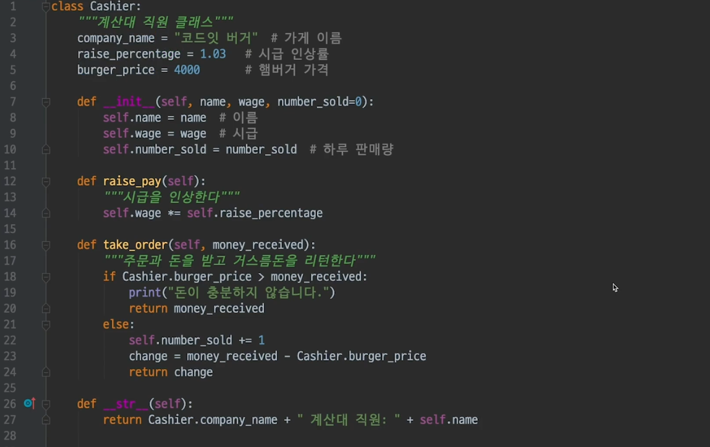

  이번엔 배달원 클래스 

  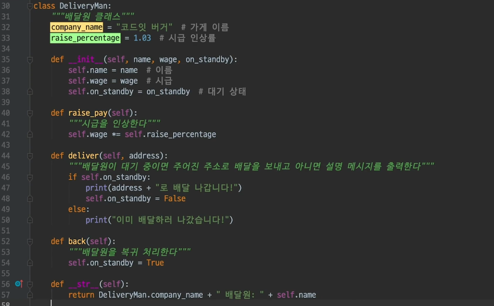

  지금 이 두 코드만 봐도 겹치는 부분이 엄청 많음. 

  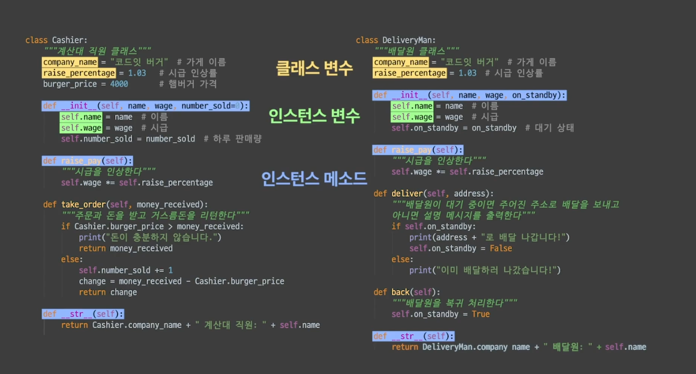

  

- #### 상속이란?

  상속이란 두 클래스 사이에 부모-자식 관계를 설정하는 것. 

  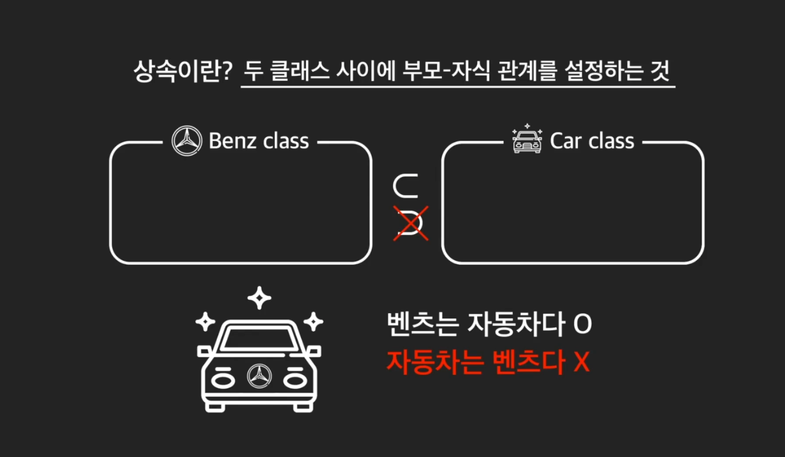

  두 클래스 사이에 A는 B다 라는 관계가 성립할 때, 우리는 상속 관계를 설정할 수 있음. 

  

  A클래스가 B클래스에 상속될 때, **A클래스는 B클래스의 모든 변수와 메소드를 상속하게 된다.** 

  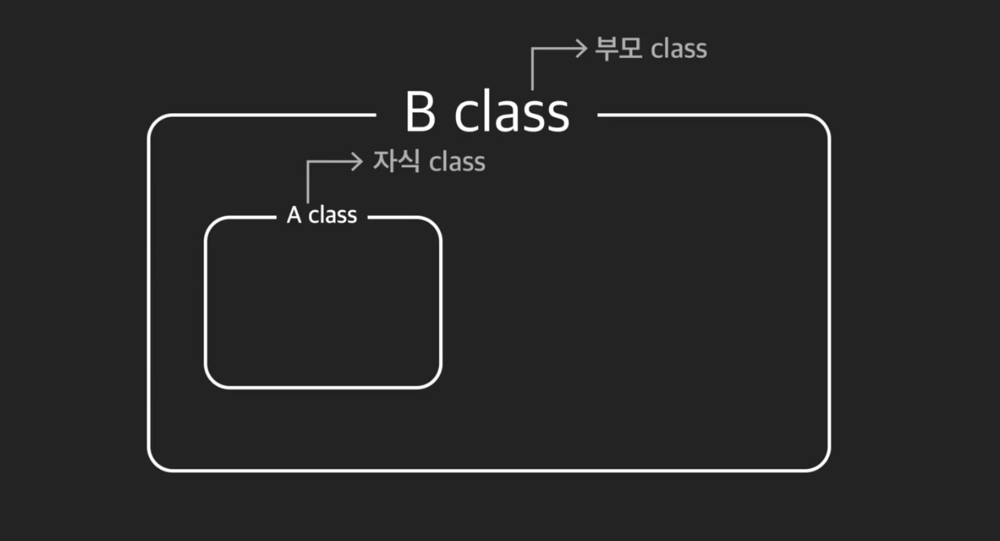

  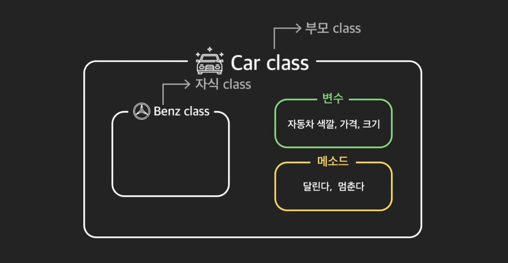

  

- #### 부모 클래스 정의하기

  상속을 이용하면, 여러 클래스의 중복되는 부분을 한번만 써도 된다고 했음.

  Casher클래스와 DeliveryMan클래스는 다음과 같음. 상속을 하려면, 일단 두 부분의 공통 클래스를 먼저 생각해야 함. 

  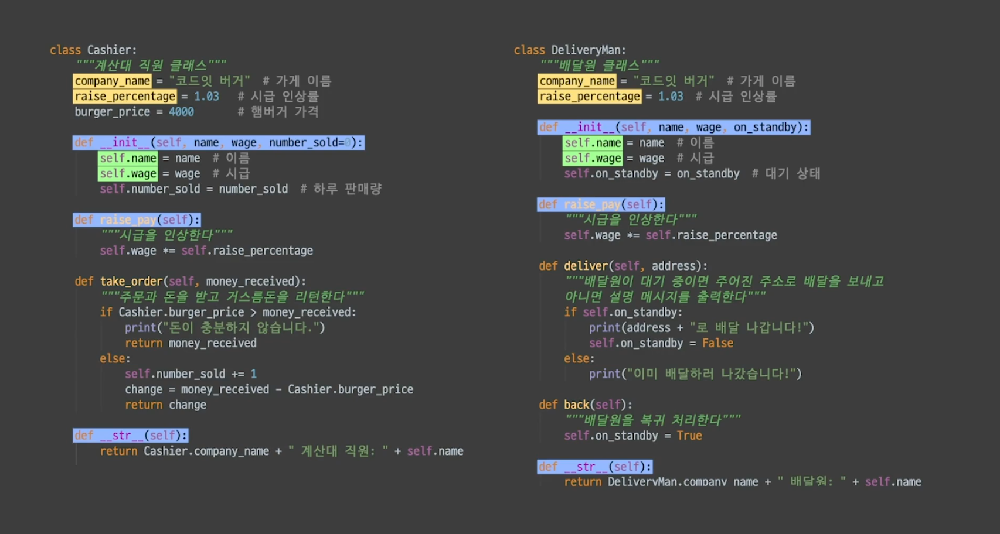

  공통부분들로, Employee를 만들어 보자. 

  

  그리고 상속 관계를 설정해 보자. 

  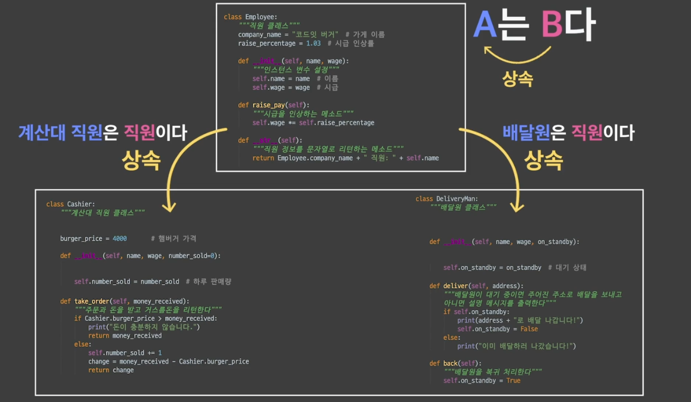

  **캐셔는 직원이다**. **배달원은 직원이다**. 라는 관계가 성립하기 떄문에 상속관계를 설정할 수 있음. 

  

- #### 상속 1 (부모로부터 물려받기)

  일단 부모클래스 **Employee**

  ```python
  class Employee:
      """직원클래스"""
      company_name = "코드잇 버거"
      raise_percentage = 1.03
  
      def __init__(self, name, wage):
          """인스턴스 변수 설정"""
          self.name = name
          self.wage = wage
  
      def raise_pay(self):
          """시급을 인상하는 메소드"""
          self.wage *= self.raise_percentage
  
      def __str__(self):
          """직원 정보를 문자열로 리턴하는 메소드"""
          return Employee.company_name + "직원: " + self.name
  ```

  ```python
  class Cashier(Employee):
      pass
  ```

  이렇게 해 놓으면 변수와 메소드를 다 가져오지. 

  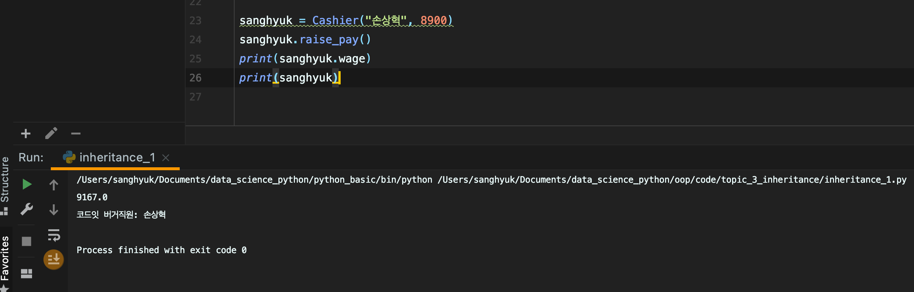

  **help함수로 Casher클래스를 살펴보자.**

  *Employee의 변수와 메소드들이 보인다.* 그리고, Employeed 클래스로부터 물려받았다는 내용도 있음. 그 중 builtin.object class는 뭘까? 파이썬에서 모든 클래스는 자동으로 builtin.ojbect를 상속받는다. 그러므로 파이썬에서 모든 클래스는 builtin.object class의 자식클래스. 

  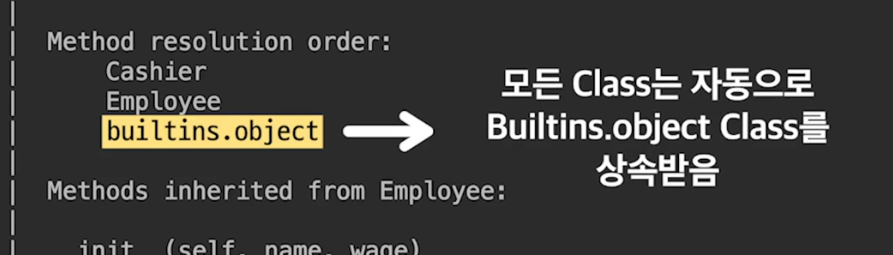
  
  ```python
	help(Cashier)
  ```
  여기서 Method Resolution Order라는 부분은 Cashier클래스의 상속관계를 보여준다. 
  
   >class Cashier(Employee)
   > |  Cashier(name, wage)
   > |  
   > |  Method resolution order:
   > |      Cashier
   > |      Employee
   > |      builtins.object
   > |  
   > |  Methods inherited from Employee:
   > |  
   > |  __init__(self, name, wage)
   > |      인스턴스 변수 설정
   > |  
   > |  __str__(self)
   > |      직원 정보를 문자열로 리턴하는 메소드
   > |  
   > |  raise_pay(self)
   > |      시급을 인상하는 메소드
   > |  
   > |  ----------------------------------------------------------------------
   > |  Data descriptors inherited from Employee:
   > |  
   > |  __dict__
   > |      dictionary for instance variables (if defined)
   > |  
   > |  __weakref__
   > |      list of weak references to the object (if defined)
   > |  
   > |  ----------------------------------------------------------------------
   > |  Data and other attributes inherited from Employee:
   > |  
   > |  company_name = '코드잇 버거'
   > |  
   > |  raise_percentage = 1.03


- #### 상속과 관련된 메소드와 함수들

  상속과 관련해서 꼭 알아두어야 할 메소드나 파이썬 함수들이 있습니다. 앞으로 자주 사용하게될 것이니 잘 기억하세요.

  **`mro` 메소드**

  이전 영상에서 `help` 함수의 실행 결과 중 `Method resolution order:`라는 부분을 보았습니다. 이 부분에 있던 결과는 해당 인스턴스의 클래스가 어떤 부모 클래스를 가지는지 보여주는데요. 이 결과를 다른 방법으로도 볼 수 있습니다. 바로 모든 클래스가 갖고 있는 `mro`라는 메소드를 호출하면 됩니다. 아래 코드에서 `Cashier` 클래스로 `mro` 메소드를 호출해보면

  ```python
  class Employee:
      """직원 클래스"""
      raise_percentage = 1.03
      company_name = "코드잇 버거"
  
      
      def __init__(self, name, wage):
          """인스턴스 변수 설정"""
          self.name = name
          self.wage = wage
  
  
      def raise_pay(self):
          """직원 시급을 인상하는 메소드"""
          self.wage *= Employee.raise_percentage
  
  
      def __str__(self):
          """직원 정보를 문자열로 리턴하는 메소드"""
          return Employee.company_name + " 직원: " + self.name
  
  
  class Cashier(Employee):
      pass
  
  
  class Manager(Employee):
      pass
  
  print(Cashier.mro())
  ```

  이렇게 출력됩니다.

  **실행 결과**

  ```
  [<class '__main__.Cashier'>, <class '__main__.Employee'>, <class 'object'>]
  ```

  이렇게 하면 `Cashier` 클래스가 상속하는 부모 클래스를 볼 수 있습니다. 이 경우에 `object` 클래스는 `Cashier` 클래스의 입장에서 부모 클래스의 부모 클래스입니다.

  우리가 자주 쓰는 파이썬의 기본 클래스 중 하나인 `list` 클래스의 `mro` 메소드의 실행 결과를 살펴볼까요?

  ```python
  print(list.mro())
  ```

  **실행 결과**

  ```
  [<class 'list'>, <class 'object'>]
  ```

  결과를 보니 상속받는 클래스가 최상위 클래스 `object` 하나밖에 없네요.  
   이번에는 파이썬에서 들여쓰기를 잘못했을 때 나오는 에러를 나타내는 `IndentationError` 클래스를 보겠습니다.

  ```python
  print(IndentationError.mro())
  ```

  **실행 결과**

  ```
  [<class 'IndentationError'>, <class 'SyntaxError'>, <class 'Exception'>, <class 'BaseException'>, <class 'object'>]
  ```

  IndentationError 클래스는 부모, 부모의 부모, 부모의 부모의 부모, 부모의 부모의 부모의 부모도 있군요. 최상위 클래스인 `object` 클래스부터, 파이썬 문법 위반 시 발생하는 `SyntaxError` 클래스까지 `IndentationError` 클래스의 집안 내력(?)을 순서대로 한 번에 파악할 수 있습니다.

  

  **`isinstance` 함수**

  `isinstance` 함수는 어떤 인스턴스가 주어진 클래스의 인스턴스인지를 알려줍니다. `isinstance` 함수의

  1. 첫 번째 파라미터에는 **검사할 인스턴스**의 이름
  2. 두 번째 파라미터에는 **기준 클래스**의 이름

  을 넣고 실행하면 되는데요. 이렇게 하면 그 인스턴스가 해당 클래스의 인스턴스인지를 불린 값(`True` 또는 `False`)으로 리턴합니다. 아래 코드를 봅시다.

  ```python
  # 인스턴스를 생성한다
  young = Cashier("강영훈", 8900)
  
  print(isinstance(young, Cashier)) # 출력: True
  print(isinstance(young, DeliveryMan)) # 출력: False
  print(isinstance(young, Employee)) # 출력: True
  ```

  `young` 인스턴스는 `Cashier` 클래스의 인스턴스니까 `True`를 리턴했네요. 하지만 `DeliveryMan` 클래스의 인스턴스는 아니기 때문에 `False`를 리턴했습니다.

  *여기서 중요한 것은 마지막 줄에서 `isinstance(young, Employee)` 가 `True` 를 리턴한다는 사실입니다.*  **`Cashier` 클래스는 `Employee` 클래스를 상속받는 자식 클래스**입니다.

  이 점이 아주아주 중요한데요.  즉, 상속 관계에 있는 두 클래스가 있을 때, **자식 클래스로 만든 인스턴스는 부모 클래스의 인스턴스이기도 하다는 점**을 뜻합니다.  이 점은 나중에 **‘다형성’**이라는 것을 설명할 때 핵심이 되는 원리입니다. 잊지 말고 꼭 기억해주세요!

  

  **`issubclass` 함수**

  `issubclass` 함수는 한 클래스가 다른 클래스의 자식 클래스인지를 알려주는 함수입니다.

  1. 첫 번째 파라미터로 **검사할 클래스**의 이름
  2. 두 번째 파라미터에는 **기준이 되는 부모 클래스**의 이름

  를 넣고 실행하면 됩니다. 아래 코드를 봅시다.

  ```python
  print(issubclass(Cashier, Employee)) # 출력: True
  print(issubclass(Cashier, object)) # 출력: True
  print(issubclass(Manager, Employee)) # 출력: True
  print(issubclass(Employee, list)) # 출력: False
  ```

  상속 관계가 있는 경우에는 모두 `True`를 리턴했네요. 마지막 줄에서 `Employee` 클래스는 `list` 클래스와 아무런 관련이 없으니까 `False`를 리턴했습니다.


- #### 상속2 오버라이딩

  이전 영상에서 Cashier Class와 DeliveryMan Class가 Employee클래스를 상속받도록 만들어 놓음. 그런데 현재는 자식 클래스들은 부모클래스의 메소드와 변수를 물려받기만 함. 

  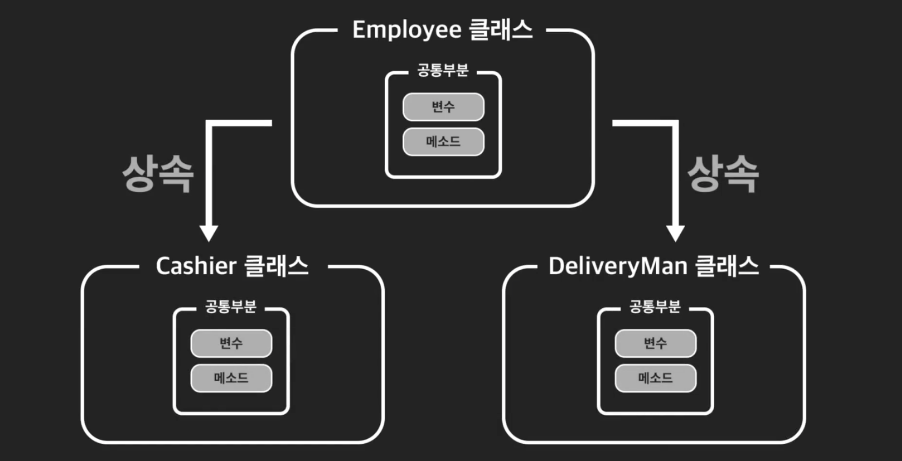

  **이렇게만 되면 Cashier와 DeliveryMan 클래스를 제대로 사용할 수가 없음.** 둘다 똑같은것을 물려받아서 아무 차이가 없음. 부모클래스에서 물려받은 것을 자식에서 알맞게 변형하는 것을 **Overriding**이라고 부른다. 

  현재 Employee Class의 __init__메소드는 이름과 시급만 설정하고 있음. 캐셔 클래스에는 number_sold라는 변수도 필요함. 이럴 때 오버라이딩을 하면 됨. 오버라이딩은 자식클래스에서 물려받은 메소드에 대해서 "**같은 이름의 메소드를 내용을 바꿔서 정의하면 됨**"

  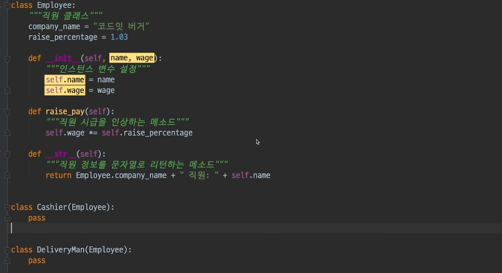

  이렇게 아래처럼 적어주기만 하면 됨. 

  ```python
  class Cashier(Employee):
      def __init__(self, name, wage, number_sold):
          """인스턴스 변수 설정"""
          self.name = name
          self.wage = wage
          self.number_sold = number_sold
  ```

  이렇게 해놓으면, Cashier 클래스로 init method 실행 할 때, Employee의 init이 아니라, Cashier 자신의 init이 실행된다. 

  그런데 이렇게 보면, 두 메소드 사이에 겹치는 부분이 있음. 이걸 조금 줄여서 쓸 수도 있음. 

  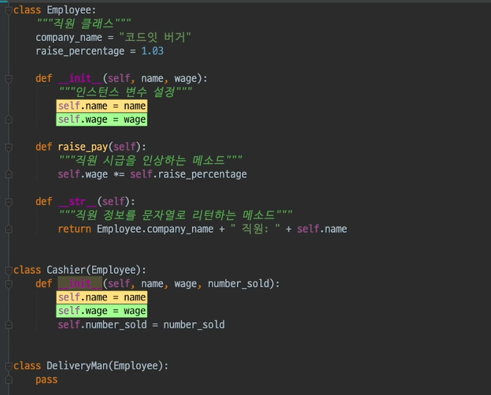

  이렇게 부모 클래스의 init을 호출해 주면 됨. 

  ```python
  class Cashier(Employee):
      def __init__(self, name, wage, number_sold):
          """인스턴스 변수 설정"""
          Employee.__init__(self, name, wage)
          self.number_sold = number_sold
  ```

  그런데 이것을 더 간단하게 만들 수 있음. **Super**는 자식 클래스에서 부모 클래스의 메소드를 사용하고 싶을 때 사용하는 것. Super로 부모클래스의 메소드를 호출할 때는 **self를 넘겨줄 필요가 없음**. 

  ```python
  class Cashier(Employee):
      def __init__(self, name, wage, number_sold):
          """인스턴스 변수 설정"""
          super().__init__(name, wage)
          self.number_sold = number_sold
  ```

  이번에는 dunder str을 오버라이딩 해보자. 

  ```python
  
  class Cashier(Employee):
      def __init__(self, name, wage, number_sold):
          """인스턴스 변수 설정"""
          super().__init__(name, wage)
          self.number_sold = number_sold
  
      def __str__(self):
          return Cashier.company_name + "계산대 직원: " + self.name
  ```

  **이번에는 변수를 오버라이딩 해보자.**

  그냥 자식 클래스에도 똑같은 변수 이름을 놓고, 다른 값을 넣으면 끝. 

  ```python
  class Cashier(Employee):
      raise_percentage = 1.05
      def __init__(self, name, wage, number_sold):
          """인스턴스 변수 설정"""
          super().__init__(name, wage)
          self.number_sold = number_sold
  
      def __str__(self):
          return Cashier.company_name + "계산대 직원: " + self.name
  ```

   

- #### 상속3 mro

  mro함수는 클래스가 상속받는 부모 클래스들이 순서대로 담긴 리스트를 리턴. 

  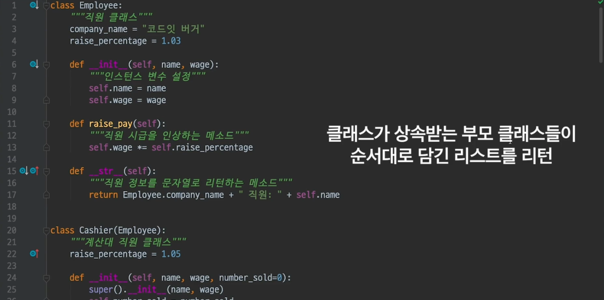

  실제로 생각해보면, 자식 클래스에는 오버라이딩된 변수/메소드와 물려받은 변수/메소드를 둘 다 가지고 있음. 그러면 오버랑이딩 메소드를 호출하면 어떻게 자식클래스를 먼저 호출하게 될까? **파이썬에서 mro메소드에 담긴 순서대로 탐색하고 호출하게 되는 것.** 자식클래스 부터 순서대로 찾아가기 시작 하는 것. 

  ```python
  print(Cashier.mro())
  ```

  > [<class '__main__.Cashier'>, <class '__main__.Employee'>, <class 'object'>]

  이 순서가 바로 메소드를 찾아가는 순서. 

  MRO라는 말 자체가 Method Resolution Order의 약자. 우리말로 하면, **메소드 검색 순서** 라는 뜻. 

  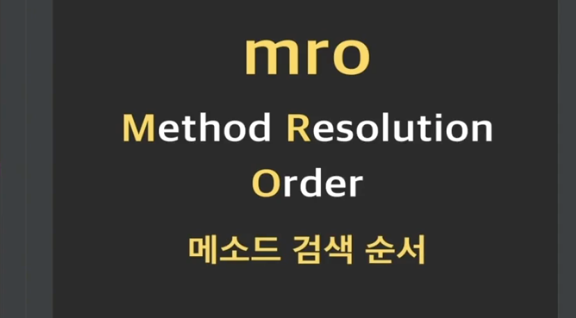

  이 순서에 따라 자식 클래스는 자식-> 부모 순으로 탐색을 하게 됨. **이거 때문에 메소드 오버라이딩이 가능한 것**. 


- #### 상속 4 기능 추가하기

  원래 Cashier에서 가지고 있던 주문받기 메소드 추가

  ```python
  class Cashier(Employee):
      raise_percentage = 1.05
      burger_price = 4000
      def __init__(self, name, wage, number_sold):
          """인스턴스 변수 설정"""
          super().__init__(name, wage)
          self.number_sold = number_sold
  
      def take_order(self, money_received):
          """주문과 돈을 받고 거스름돈을 리턴한다"""
          if Cashier.burger_price > money_received:
              print("돈이 충분하지 않습니다. 돈을 다시 계산해 주세요")
              return money_received
          else:
              self.number_sold += 1
              change = money_received - Cashier.burger_price
              return change
  ```

  


- #### 상속 정리

  두 클래스가 있고, 거기에 겹치는 공통 부분이 있었음. 이 공통 부분을 가지고, 부모클래스 Employee를 만들었음. 그리고,  Cashier와 DeliveryMan클래스가 Employee 클래스를 상속받도록 했음. 

  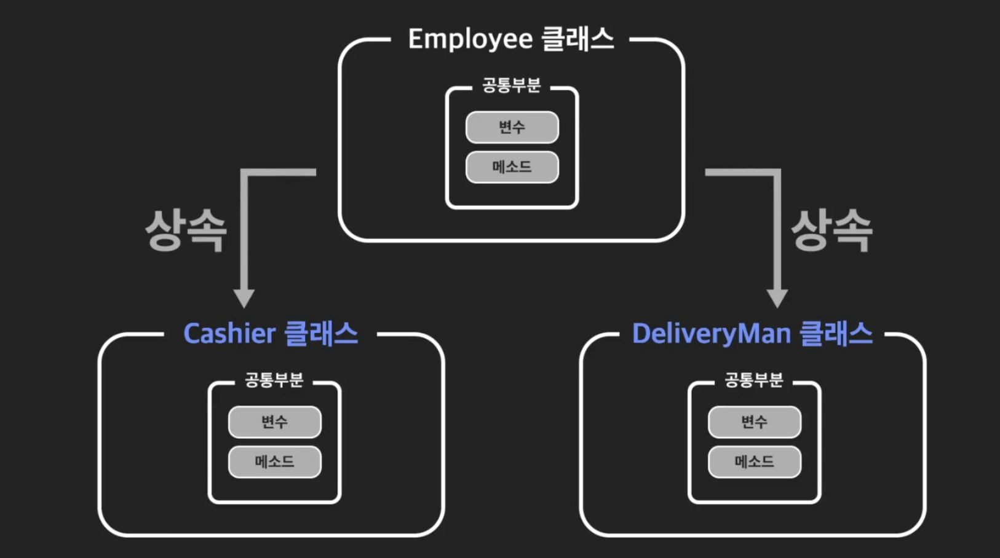

  그리고  Cashier/DeliverMan에 맞게 오버라이딩 해줄건 해주고, 중복되지 않았던 자신만의 변수와 메소드를 추가해줬음. 

  그런데 상속을 사용하면 뭐가 좋을까? 추가적으로 요리사 같은 새로운 직원 종류를 만들 때 이럴 때가 좋은 것. 햄버거 가게 직원이라면 누구나 받는 부분을 매번 코드로 적을 필요가 없음. 상속 받고 고유한 부분 추가/오버라이딩만 해주면 되는 것. 

  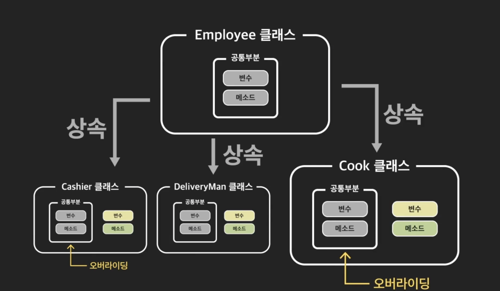


- #### 다중 상속 Multiple inheritance

  파이썬에서는 하나의 자식 클래스가 여러 부모 클래스를 상속받는 것도 가능함. 이것을 **다중상속** 이라고 말함. 아래의 코드가 있다고 해보자. 

  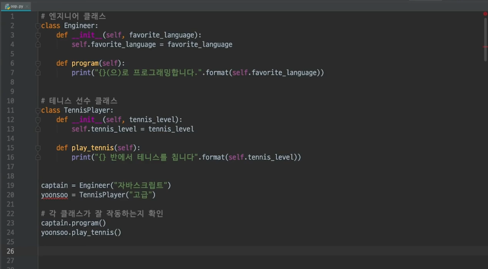

  그런데, 엔지어이면서 동시에 테니스선수인 사람이 있다면? 이 사람을 나타내려면 어떻게 해야 할까? 둘다 상속 받는 자식클래스가 필요하다.

  EngineerTeniisPlayer라는 둘다 상속 받는 클래스를 만들어 보자.  

  

  ```python
  # 엔지니어 클래스
  class Engineer:
      def __init__(self, favorite_language):
          self.favorite_language = favorite_language
      def program(self):
          print("{}(으)로 프로그래밍 합니다".format())
  
  # 테니스 선수 클래스
  class TennisPlayer:
      def __init__(self, tennis_level):
          self.tennis_level = tennis_level
  
      def play_tennis(self):
          print("{} 반에서 테니스를 칩니다.".format(self.tennis_level))
  
  ```

  **다중 상속을 하면, 상속받은 전부로부터 메소드와 변수 전부를 물려받게 됨.**

  그런데 여기서 만들다 보니깐 문제가

  ```python
  class EngineerTennis(Engineer, TennisPlayer):
      def __init__(self, favorite_language, tennis_level):
          super().__init__()
  ```

   super는 Engineer, TennisPlayer 중에 누구를 말하는 걸까? 이게 다중상속의 단점. 

  일단 두 클래스 이름으로 직접 init을 호출해 보자. 

  ```python
  class EngineerTennis(Engineer, TennisPlayer):
      def __init__(self, favorite_language, tennis_level):
          Engineer.__init__(self, favorite_language)
          TennisPlayer.__init__(self, tennis_level)
  
  
  # 다중 상속을 받는 클래스의 인스턴스 생성
  sanghyuk = EngineerTennis("파이썬", "초급")
  
  # 두 부모 클래스의 메소드를 잘 물려받았는지 확인
  sanghyuk.program()
  sanghyuk.play_tennis()
  ```

  > 파이썬(으)로 프로그래밍 합니다
  > 초급 반에서 테니스를 칩니다.

  일단 위처럼 하니싼 문제는 없음. 다중상속 상태로 만든 것은 맞음. 

  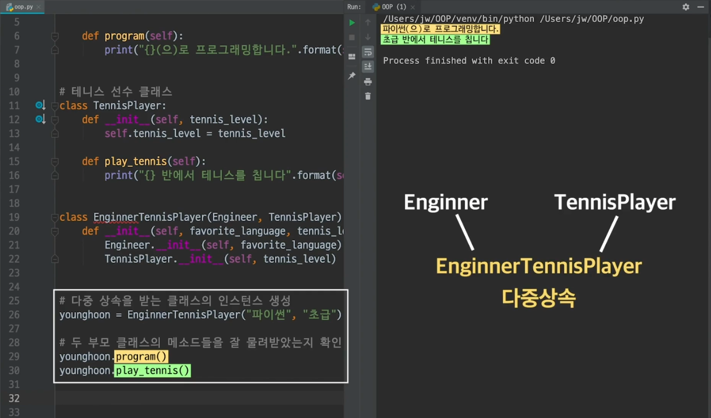


- #### 다중상속의 위험성

  이번에는 캐셔 클래스와 딜리버리 맨 클래스를 다중상속 해보자. 

  계산대 직원과 배달원을 동시에 하는 CashierDeliveryMan을 만들어 보자. 

  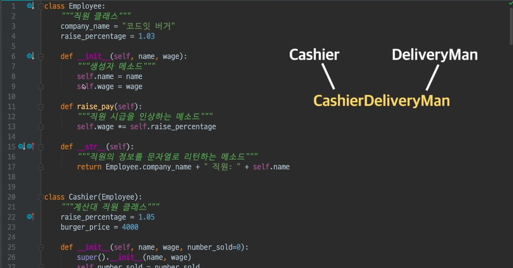

  ```python
  class CashierDeliveryMan(DeliveryMan, Cashier):
    def __init__(self, name, wage, on_standby, number_sold = 0):
      Employee.__init__(self, name, wage)
      self.on_standby = on_standby
      self.number_sold = number_sold
  ```

  상속 관계를 보면 다음과 같음. 

  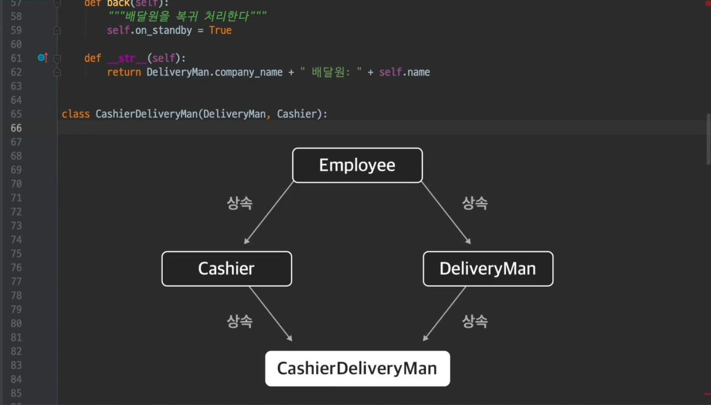

  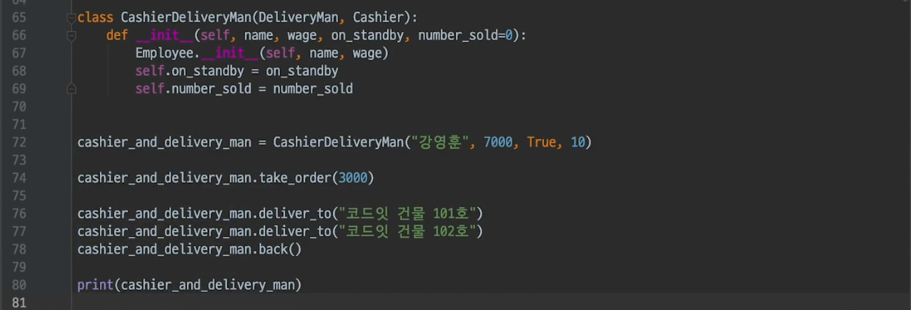

  바로 위 코드 실행하면 정상적으로 실행 자체는 문제가 없음. 

  근데 여기서 문제가 있음. 마지막에 `print(cashier_and_delivery_man)` 아래 부분의 실행 결과가 "코드잇 버서 배달원: 강영훈"으로 나옴. 즉, 인스턴스 호출하니깐 deliveryman 클래스의 **Dunder str Method**가 출력됨.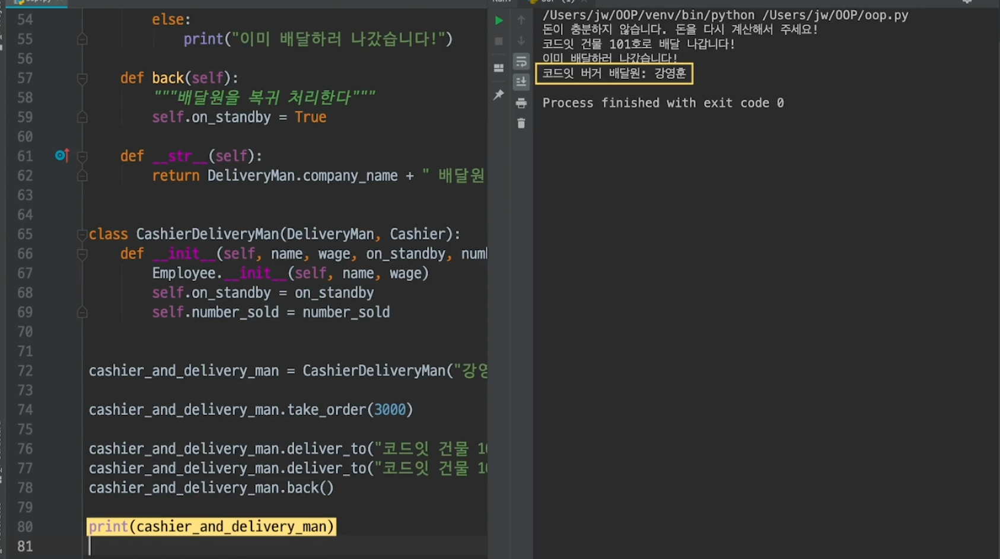

  사실 당연하긴 한게, 그 부모 클래스인 Cashier와 DeliveryMan클래스에 Dunder Str 함수가 있으니깐. 

  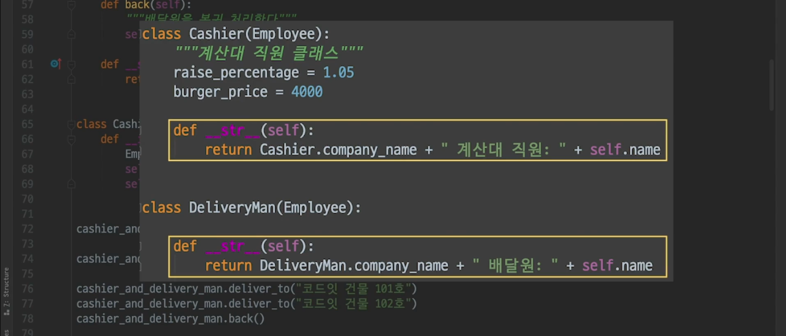

  그 중에 DeliveryMan꺼가 실행된 것. 근데 왜 둘중에 DeliveryMan 클래스의  str이 실행된 걸까? 

  mro메소드를 사용하면 알 수 있음. 찾는 순서에 DeliveryMan이 앞에 있잖아. 

  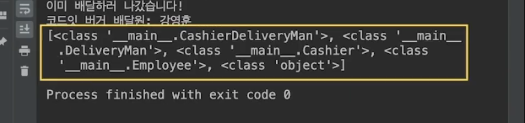

  `class CashierDeliveryMan(Cashier, DeliveryMan )`이라고 치면 이번에는 또 상속 순서가 바뀜. 클래스 여러개 상속받으면, 상속받는 순서에 따라서 Mro가 바뀜. 이럴 때 마다 mro를 신경써야 하면 어려워. 그래서 많은 언어들이 이런 문제들을 애초에 방지하려고 다중상속 자체를 지원하지 않음. 특히 Java도 지원하지 않음. 

  다중상속 문제를 해결하려면, 무조건 부모 클래스의 메소드들을 오버라이딩 하면 됨. 근데 그렇게 다 해야되면 애초에 상속을 왜하냐?

  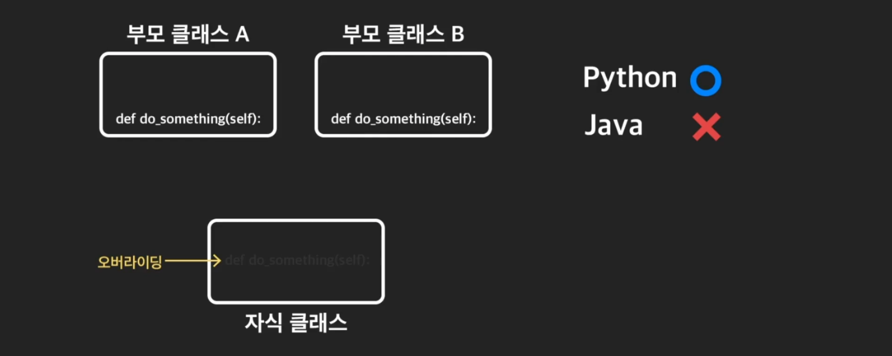

  어쨋든 파이썬에서 다중상속을 하려면, 애초에 부모클래스들 끼리 같은 이름의 메소드를 갖지 않게 하거나, 애초에 같은 이름의 메소드는 자식클래스에서 오버라이딩 해 두거나 하면 됨. 

  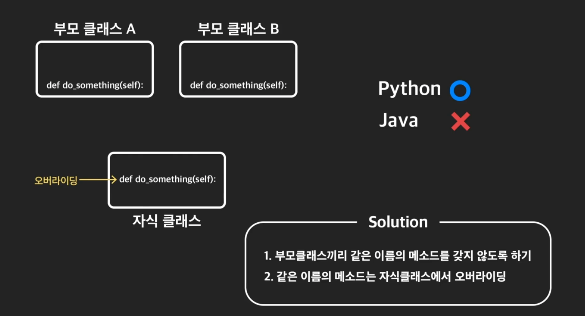