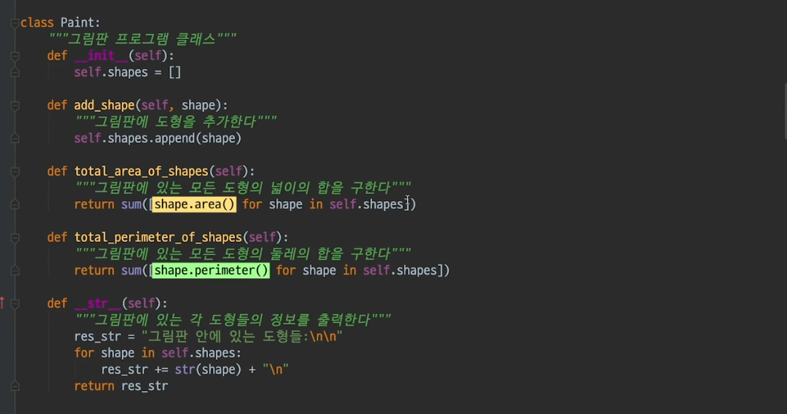
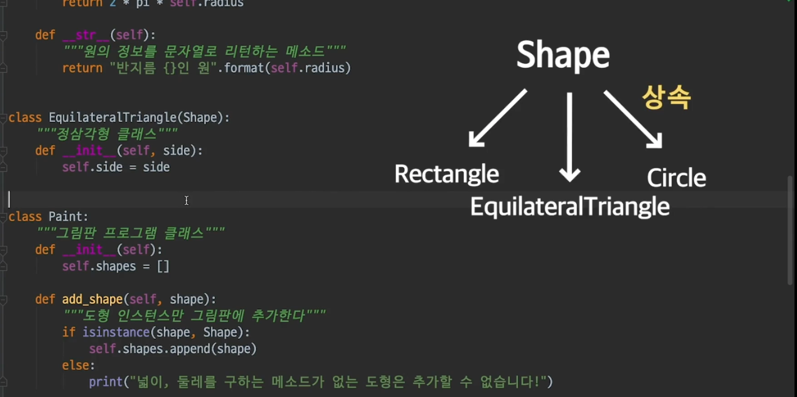
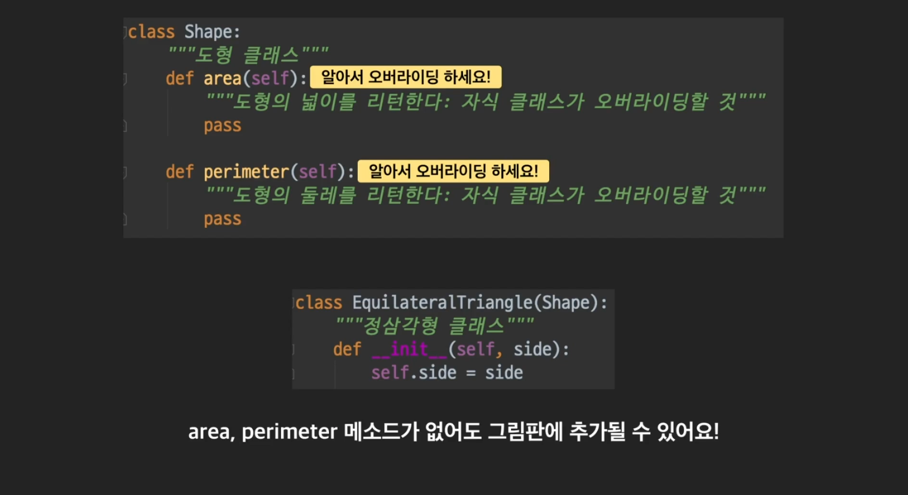
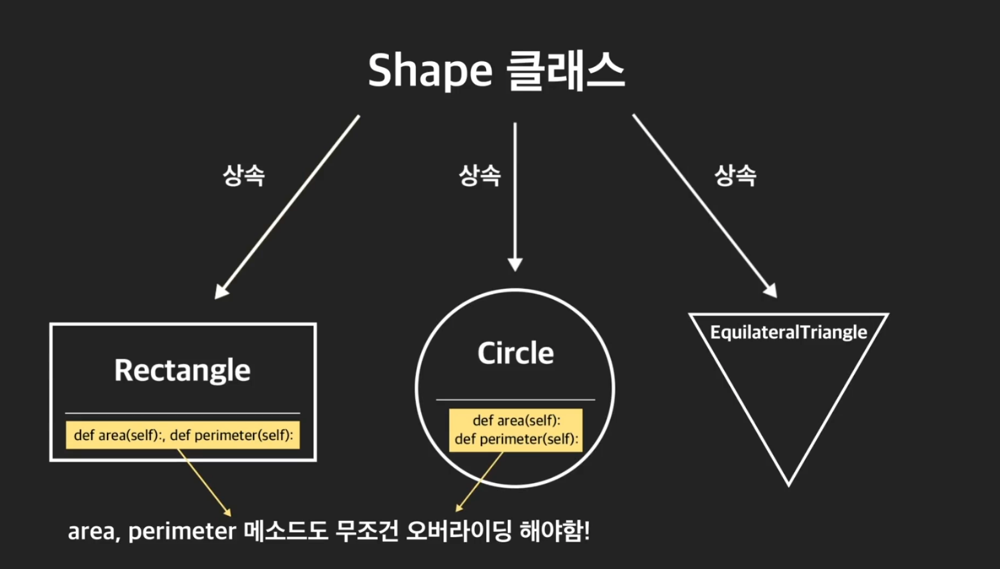
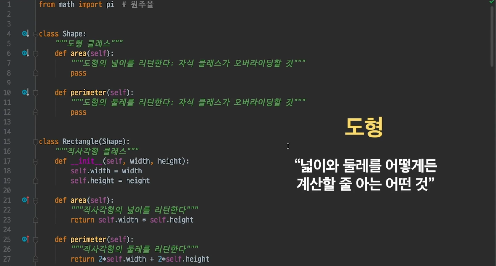
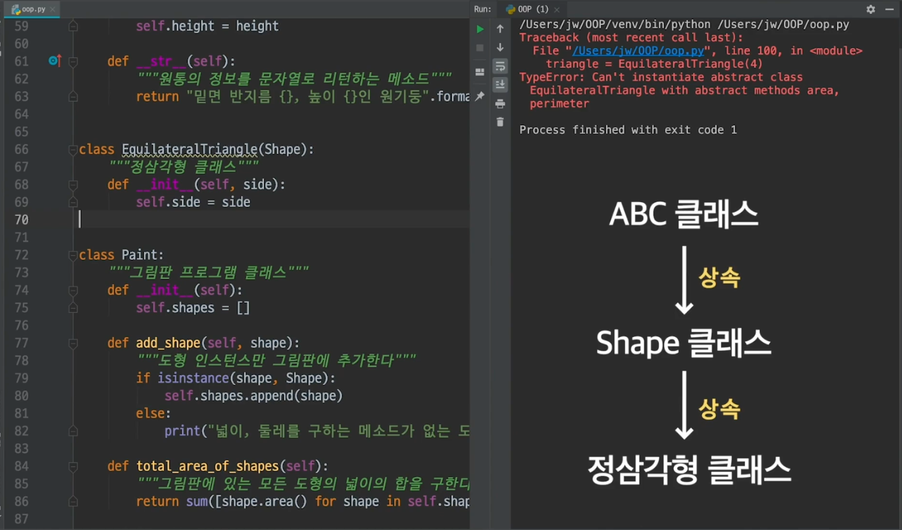

# OOP 4

## 다형성(**polymorphism**)

- #### 클래서 다형성 1

  그림판 프로그램을 만든다고 해보자. 

  그림판에 추가할 수 있는 도형들을 나타내 보자. 

  ```python
  class Rectangle:
      """직사각형 클래스"""
      def __init__(self, width, height):
          self.width = width
          self.height = height
  
      def area(self):
          """직사각형의 넓이를 리턴한다"""
          return self.width * self.height
  
      def perimeter(self):
          """직사각형의 둘레를 리턴한다"""
          return 2*self.width + 2.self.height
  
      def __str__(self):
          """직사각형의 정보를 문자열로 리턴한다"""
          return "밑변 {}, 높이 {}인 직사각형".format(self.width, self.height)
  ```

  원도 만들어 보자. 

  ```python
  from math import pi
  
  class Circle:
      """원 클래스"""
      def __init__(self, radius):
          self.radius = radius
  
      def area(self):
          """원의 너비를 나타낸다"""
          return pi*self.radius * self.radius
  
      def perimeter(self):
          """원의 둘레를 리턴한다"""
          return 2*pi*self.radius
  
      def __str__(self):
          """원의 정보를 문자열로 리턴한다"""
          return "반지름 {}인 원".format(self.radius)
  ```

  그림판 클래스 

  ```python
  class Paint:
      """그림판 프로그램 클래스"""
      def __init__(self):
          self.shapes = []
      def add_shape(self, shape):
          """그림판에 도형을 추가한다"""
          self.shapes.append(shape)
      def total_area_of_shapes(self):
          """그림판에 있는 모든 도형의 넓이의 합을 구한다"""
          return sum([shape.area() for shape in self.shapes])
      def total_perimeter_of_shapes(self):
          """그림판에 있는 모든 도형의 둘레의 합ㅇ을 구한다"""
          return sum([shape.perimeter() for shape in self.shapes])
  
      def __str__(self):
          """그림판에 있는 각 도형들의 정보를 출력한다"""
          res_str = "그림판에 안에 있는 도형들: \n\n"
          for shepe in self.shapes:
              res_str+= str(shape)+"\n"
          return res_str
  ```

  

- #### 클래스 다형성 2

  이제 사용해보자. 아래처럼 사용하면 됨. 

  ```python
  
  rectangle = Rectangle(3, 7)
  circle = Circle(4)
  
  paint_program = Paint()
  paint_program.add_shape(rectangle)
  paint_program.add_shape(circle)
  
  
  print(paint_program.total_area_of_shapes())
  print(paint_program.total_perimeter_of_shapes())
  ```

  >71.26548245743669
  >45.132741228718345

  현재 Paint class의 shapes에는 circle instance 1개와 rectangle instance 1개가 들어 있음. Paint에서는 shape이 어떤 인스턴스인지 확인하지 않고, shape.area() 혹은 shape.perimeter()로 사용하고 있음. 에러 없이 사용될 수 있는 이유는 rectangle과 circle 둘다 area와 perimeter이라는 메소드를 가지고 있기 때문. 

  

  이렇게 shape이 rectangle, circle 처럼 여러개 가리킬 수 있는 것을 **다형성이 있다** 라고 말함. 

  

  즉, 하나의 변수가 **서로 다른 인스턴스를 가리킬 수 있는 성질을 다형성** 이라고 부른다. 

  

  원래 다형성이란 것은 "여러 가지 형태를 갖는 성질"을 의미함. 이렇게 shape이 어떨땐 원이 되고, 어떨땐 직사각형이 되는 카멜레온 같은 성질을 다형성이 있다고 말하는 것. 

  다시 얘기하지만, 이게 가능한 이유는 shape에 들어가게 되는 rectangle/circle 클래스가 둘다 area와 perimeter을 가지고 있기 때문. 

  


- #### 상속 없는 다형성의 한계

  **원통(`Cylinder`) 클래스**

  이번에는 입체 도형 중 하나인 원통을 나타내는 클래스를 지난 영상에서 작성한 코드에 추가해봅시다. 원통은 입체 도형이라서 `Rectangle` 클래스, `Circle` 클래스와 달리 넓이, 둘레를 구하는 메소드를 두지 않겠습니다.

  ```python
  class Rectangle:
      """직사각형 클래스"""
      def __init__(self, width, height):
          self.width = width
          self.height = height
  
      def area(self):
          """직사각형의 넓이를 리턴한다"""
          return self.width * self.height
  
      def perimeter(self):
          """직사각형의 둘레를 리턴한다"""
          return 2 * self.width + 2 * self.height
  
      def __str__(self):
          """직사각형의 정보를 문자열로 리턴한다"""
          return "밑변 {}, 높이 {}인 직사각형".format(self.width, self.height)
  
  
  class Circle:
      """원 클래스"""
      def __init__(self, radius):
          self.radius = radius
  
      def area(self):
          """원의 넓이를 리턴한다"""
          return pi * self.radius * self.radius
  
      def perimeter(self):
          """원의 둘레를 리턴한다"""
          return 2 * pi * self.radius
  
      def __str__(self):
          """원의 정보를 문자열로 리턴한다"""
          return "반지름 {}인 원".format(self.radius)
  
  
  class Cylinder:
      """원통 클래스"""
      def __init__(self, radius, height):
          self.radius = radius
          self.height = height
  
      def __str__(self):
      """원통의 정보를 문자열로 리턴하는 메소드"""
          return "밑면 반지름 {}, 높이 {}인 원기둥".format(self.radius, self.height)
  
  
  class Paint:
      """그림판 프로그램 클래스"""
      def __init__(self):
          self.shapes = []
      
      def add_shape(self, shape):
          """그림판에 도형을 추가한다"""
          self.shapes.append(shape)
      
      def total_area_of_shapes(self):
          """그림판에 있는 모든 도형의 넓이의 합을 구한다"""
          return sum([shape.area() for shape in self.shapes])
      
      def total_perimeter_of_shapes(self):
          """그림판에 있는 모든 도형의 둘레의 합을 구한다"""
          return sum([shape.perimeter() for shape in self.shapes])
      
      def __str__(self):
          """그림판에 있는 각 도형들의 정보를 출력한다."""
          res_str = "그림판 안에 있는 도형들:\n\n"
          for shape in self.shapes:
              res_str += str(shape) + "\n"
          return res_str    
  ```

  이번에는 그림판 프로그램에 원통 인스턴스도 추가해볼까요?

  ```python
  paint_program = Paint()
  cylinder = Cylinder(7, 4)
  rectangle = Rectangle(3, 7)
  circle = Circle(4)
  
  paint_program.add_shape(cylinder)
  paint_program.add_shape(circle)
  paint_program.add_shape(rectangle)
  
  print(paint_program.total_perimeter_of_shapes()) # 에러가 난다!
  print(paint_program.total_area_of_shapes())
  ```

  위 코드를 실행하니 에러가 나는군요. 그 이유는 `Cylinder` 클래스에는 `perimeter` 메소드가 없기 때문입니다. 너무나도 당연한 결과입니다. `Rectangle` 클래스, `Circle` 클래스에는 있는 함수를 아까 `Cylinder` 클래스에는 두지 않았으니까요!

  이 문제를 한번 해결해봅시다. 상속에서 배웠던 `isinstance` 함수가 혹시 기억나시나요? 이 함수를 사용해봅시다.  리스트 `shapes`에 도형을 추가하기 전에 그 인스턴스가 `Rectangle` 클래스의 인스턴스 혹은 `Circle` 클래스의 인스턴스가 맞는지 확인하고, 맞는 경우에만 추가하면 어떨까요? 이렇게 하면 `shapes`에 추가되는 모든 인스턴스가 `area`와 `perimeter` 메소드를 갖고 있을 테니 에러가 생기는 일은 없겠죠?

  ```python
  class Paint:
      """그림판 프로그램 클래스"""
      def __init__(self):
          self.shapes = []
  
      def add_shape(self, shape):
          """그림판에 도형을 추가한다"""
          if isinstance(shape, Circle) or isinstance(shape, Rectangle):
              self.shapes.append(shape)
          else:
              print("넓이, 둘레를 구하는 메소드가 없는 도형은 추가할 수 없습니다!")
  
      def total_area_of_shapes(self):
          """그림판에 있는 모든 도형의 넓이의 합을 구한다"""
          return sum([shape.area() for shape in self.shapes])
  
      def total_perimeter_of_shapes(self):
          """그림판에 있는 모든 도형의 둘레의 합을 구한다"""
          return sum([shape.perimeter() for shape in self.shapes])
  ```

  다행히 이런 방식으로 문제는 해결됐지만 앞으로 그림판 프로그램이 발전하면서 삼각형, 별 모양 등과 같은 새 도형이 추가된다면 문제가 생깁니다. 즉, 새로운 도형 클래스를 만들 때마다 `add_shape` 메소드에 방금과 같이 `area` 메소드와 `perimeter` 메소드를 가진 클래스인지를 확인하는 코드, 그러니까 `isinstance` 함수를 추가해야 합니다. 그리고 지금이야 도형 클래스 종류가 적지만 도형 종류가 100개 이상으로 넘어간다면 실수로 어떤 클래스에 대한 `isinstance` 함수는 빠뜨릴 수도 있는데요.

  좀 더 효율적이고 안전하게 다형성을 적용할 방법이 없을까요? 다음 영상을 보시죠.


- #### 상속을 활용한 다형성1

  지금 보면, Rectangle, Circle 클래스에는 area/perimeter을 구할 수 있지만, Cylinder는 그런것을 구할 메소드가 없음. 그래서 에러가 발생했던 것. 이런 경우 상속을 사용하면 문제를 해결할 수 있음. 

  Rectangle/Circle이 둘다 상속받는 공통 부모 클래스를 만든다. Shape클래스를 만들어 보자. 

  ```python
  class Shape:
      """도형 클래스"""
      def area(self):
          """도형의 넓이를 리턴한다 : 자식 클래스가 오버라이딩 할 것"""
          pass
      def perimeter(self):
          """도형의 둘레를 리턴한다 : 자식 클래스가 오버라이딩 할 것"""
          pass
     
  ```

  Shape을 추가할 일은 없음. Shape은 단지 추상적인 개념일 뿐이고, 그림판에 추가할 것들은 원이나 직사각형 같은 것. Shape클래스를 만들어서, 활용.

  ```python
  from math import pi
  
  class Shape:
      """도형 클래스"""
      def area(self):
          """도형의 넓이를 리턴한다 : 자식 클래스가 오버라이딩 할 것"""
          pass
      def perimeter(self):
          """도형의 둘레를 리턴한다 : 자식 클래스가 오버라이딩 할 것"""
          pass
  
  class Rectangle(Shape):
      """직사각형 클래스"""
      def __init__(self, width, height):
          self.width = width
          self.height = height
  
      def area(self):
          """직사각형의 넓이를 리턴한다"""
          return self.width * self.height
  
      def perimeter(self):
          """직사각형의 둘레를 리턴한다"""
          return 2*self.width +2*self.height
  
      def __str__(self):
          """직사각형의 정보를 문자열로 리턴한다"""
          return "밑변 {}, 높이 {}인 직사각형".format(self.width, self.height)
  
  class Circle(Shape):
      """원 클래스"""
      def __init__(self, radius):
          self.radius = radius
  
      def area(self):
          """원의 너비를 나타낸다"""
          return pi*self.radius * self.radius
  
      def perimeter(self):
          """원의 둘레를 리턴한다"""
          return 2*pi*self.radius
  
      def __str__(self):
          """원의 정보를 문자열로 리턴한다"""
          return "반지름 {}인 원".format(self.radius)
  
  class Cylinder:
      """원통 클래스"""
      def __init__(self, radius, height):
          self.radius = radius
          self.height = height
  
      def __str__(self):
          """원통의 정보를 문자열로 리턴하는 메소드"""
          return "밑면 반지름 {}, 높이 {}인 원기둥".format(self.radius, self.height)
  
  
  
  class Paint:
      """그림판 프로그램 클래스"""
      def __init__(self):
          self.shapes = []
      def add_shape(self, shape):
          """그림판에 도형을 추가한다"""
          if isinstance(shape, Shape):
              self.shapes.append(shape)
          else:
              print("넓이, 둘레를 구하는 메소드가 없는 도형은 추가할 수 없습니다. ")
  
      def total_area_of_shapes(self):
          """그림판에 있는 모든 도형의 넓이의 합을 구한다"""
          return sum([shape.area() for shape in self.shapes])
      def total_perimeter_of_shapes(self):
          """그림판에 있는 모든 도형의 둘레의 합ㅇ을 구한다"""
          return sum([shape.perimeter() for shape in self.shapes])
  
      def __str__(self):
          """그림판에 있는 각 도형들의 정보를 출력한다"""
          res_str = "그림판에 안에 있는 도형들: \n\n"
          for shape in self.shapes:
              res_str+= str(shape)+"\n"
          return res_str
  
  cylinder = Cylinder(7, 4)
  rectangle = Rectangle(3, 7)
  circle = Circle(4)
  
  paint_program = Paint()
  paint_program.add_shape(rectangle)
  paint_program.add_shape(circle)
  paint_program.add_shape(cylinder)
  
  print(paint_program.total_area_of_shapes())
  print(paint_program.total_perimeter_of_shapes())
  ```

  > 넓이, 둘레를 구하는 메소드가 없는 도형은 추가할 수 없습니다. 
  > 71.26548245743669
  > 45.132741228718345

  정리하자면, 어떤 변수가 여러 종류의 인스턴스를 가리키게 해서 다형성을 가지게 할 수 있음. 하지만, 그 인스턴스의 어떤 메소드를 호출했을 때, 인스턴스가 그 메소드를 가지고 있어야만 다형성이 성립된다. 그 메소드가 없으면 에러가 발생하지. 이 에러를 발생하려면 호출 전에 미리 isinstance같은 것을 사용해서 미리 확인하는 절차가 필요함. 이때, 클래스 갯수가 많아지면 isinstance가 엄청 많아지겠지. 그런 경우 이번 영상처럼 상속을 사용하면, isinstance를 딱 한번만 써도 됨. 

  


- #### 상속을 활용한 다형성 2 일반상속의 문제점

  상속과 다형성을 배웠지만, 아직 남아있는 문제가 있음. 새로운 도형 하나를 만들어 보자. 

  

  상속을 받고 있긴 한데, 문제는 area랑 perimeter메소드를 오버라이딩을 안했음. 

  ```python
  class EquilateralTriangle(Shape):
      """정삼각형 클래스"""
      def __init__(self, side):
          self.side = side
  ```

  근데 그래도, 상속 자체는 받기 떄문에 아래부분에서  True가 리턴되서, 그림판 클래스에 추가 될 수는 있음. 

  

  실제로 넣어보면, 

  ```python
  triangle = EquilateralTriangle(4)
  paint_program = Paint()
  paint_program.add_shape(triangle)
  print(paint_program.total_area_of_shapes())
  print(paint_program.total_perimeter_of_shapes())
  ```

  

  왜일까? 정삼각형 클래스에서는 현재 area/perimeter가 없음. 그러면 부모 클래스로부터 물려받은 area/perimeter를 사용한다는 뜻. 근데 부모클래스의 area/perimeter는 그냥 pass만 써 있는 상태. 근데, 어떤 값이 있는것처럼 sum함수로 이걸 더 하려고 하니깐 에러가 나는 거야. 

  자식 클래스가 오버랑이딩 하라고 pass로 비워놨더니 자식클래스가 오버라이딩을 안했어. 그러면 뭐 어떻게 해?

  

  즉 그림판에 추가될 객체들은, shape클래스를 상속받아야 할 뿐만이 아니라, area/perimeter 메소드도 꼭 오버라이딩 해야 함. 

  

  **그러면, shape클래스의 자식 클래스가 area/perimeter 클래스를 무조건 오버라이딩 하도록 만들려면?**

  

- #### 상속을 활용한 다형성 3 추상 클래스 개념

  메소드를 강제로 오버라이딩 하려면 어떻게 해야 할까?

  추상클래스를 사용하면 됨. 추상클래스란 "**여러 클래스들의 공통점을 추상화해서 모아놓은 클래스**"

  

  파이썬에서 추상클래스를 정의하기 위해서는 몇가지 문법을 추가해 줘야 함. 

  ABC는 **Abstract Base Class의 줄임말**

  ```python
  from abc import ABC, abstractmethod
  ```

  그리고, 추상메소드란 자식 클래스가 반드시 오버라이딩 해야 되는 메소드. -

  **shape을 상속받는 클래스는 이제부터는 반드시 @abstractmethod가 있는 메소드를 오버라이딩 해야 한다. ABC를 상속받고, 적어도 하나 이상의 @abstractmethod가 있는 것을 추상클래스라고 한다.** 

  ```python
  from abc import ABC, abstractmethod
  
  class Shape(ABC):
      """도형 클래스"""
      @abstractmethod
      def area(self):
          """도형의 넓이를 리턴한다 : 자식 클래스가 오버라이딩 할 것"""
          pass
  
      @abstractmethod
      def perimeter(self):
          """도형의 둘레를 리턴한다 : 자식 클래스가 오버라이딩 할 것"""
          pass
  ```

  **중요한 것은 추상클래스로는 인스턴스를 만들 수 없다.**

  `shape=Shape()` 하면 에러가 남.  

  추상클래스는 여러 클래스들의 공통점을 모아두고, 다른 클래스들이 상속받는 부모 클래스가 될 목적으로 존재한다. 

  


- #### 상속을 활용한 다형성 4 (추상 클래스 활용)

  이제부터 추상 클래스를 상속받는 애들은 반드시, area/perimeter를 반드시 오버라이딩 해야 한다. 오버라이딩 하지 않으면, 

  

  정삼각형 클래스는 현재,  ABC를 상속하고 있고, 추상메소드를 하나 이상 가지고 있기 때문에 **추상클래스**. 

  하지만, 물려받은 클래스를 오버라이딩 하면 일반 클래스로 만들 수 있음. 

  ```python
  class EquilateralTriangle(Shape):
      """정삼각형 클래스"""
      def __init__(self, side):
          self.side = side
  
      def area(self):
          """정삼각형의 넓이를 리턴한다"""
          return sqrt(3) * self.side * self.side / 4
  
      def perimeter(self):
          """정삼각형의 둘레를 리턴한다"""
          return 3*self.side
  ```

  팁으로 추상 클래스 사용할때는, type hinting을 사용하면 좋지. 그래도 어떻게 오버라이딩하는지 알려줄 수 있잖아. 

  ```python
  
  class Shape(ABC):
      """도형 클래스"""
      @abstractmethod
      def area(self) -> float:
          """도형의 넓이를 리턴한다 : 자식 클래스가 오버라이딩 할 것"""
          pass
  
      @abstractmethod
      def perimeter(self) -> float:
          """도형의 둘레를 리턴한다 : 자식 클래스가 오버라이딩 할 것"""
          pass
  ```

  

