# OOP 4

## 다형성(**polymorphism**)

- #### 클래스 다형성 1

  그림판 프로그램을 만든다고 해보자. 

  그림판에 추가할 수 있는 도형들을 나타내 보자. 

  ```python
  class Rectangle:
      """직사각형 클래스"""
      def __init__(self, width, height):
          self.width = width
          self.height = height
  
      def area(self):
          """직사각형의 넓이를 리턴한다"""
          return self.width * self.height
  
      def perimeter(self):
          """직사각형의 둘레를 리턴한다"""
          return 2*self.width + 2.self.height
  
      def __str__(self):
          """직사각형의 정보를 문자열로 리턴한다"""
          return "밑변 {}, 높이 {}인 직사각형".format(self.width, self.height)
  ```

  원도 만들어 보자. 

  ```python
  from math import pi
  
  class Circle:
      """원 클래스"""
      def __init__(self, radius):
          self.radius = radius
  
      def area(self):
          """원의 너비를 나타낸다"""
          return pi*self.radius * self.radius
  
      def perimeter(self):
          """원의 둘레를 리턴한다"""
          return 2*pi*self.radius
  
      def __str__(self):
          """원의 정보를 문자열로 리턴한다"""
          return "반지름 {}인 원".format(self.radius)
  ```

  그림판 클래스 

  ```python
  class Paint:
      """그림판 프로그램 클래스"""
      def __init__(self):
          self.shapes = []
      def add_shape(self, shape):
          """그림판에 도형을 추가한다"""
          self.shapes.append(shape)
      def total_area_of_shapes(self):
          """그림판에 있는 모든 도형의 넓이의 합을 구한다"""
          return sum([shape.area() for shape in self.shapes])
      def total_perimeter_of_shapes(self):
          """그림판에 있는 모든 도형의 둘레의 합ㅇ을 구한다"""
          return sum([shape.perimeter() for shape in self.shapes])
  
      def __str__(self):
          """그림판에 있는 각 도형들의 정보를 출력한다"""
          res_str = "그림판에 안에 있는 도형들: \n\n"
          for shepe in self.shapes:
              res_str+= str(shape)+"\n"
          return res_str
  ```

  

- #### 클래스 다형성 2

  이제 사용해보자. 아래처럼 사용하면 됨. 

  ```python
  
  rectangle = Rectangle(3, 7)
  circle = Circle(4)
  
  paint_program = Paint()
  paint_program.add_shape(rectangle)
  paint_program.add_shape(circle)
  
  
  print(paint_program.total_area_of_shapes())
  print(paint_program.total_perimeter_of_shapes())
  ```

  >71.26548245743669
  >45.132741228718345

  현재 Paint class의 shapes에는 circle instance 1개와 rectangle instance 1개가 들어 있음. Paint에서는 shape이 어떤 인스턴스인지 확인하지 않고, shape.area() 혹은 shape.perimeter()로 사용하고 있음. 에러 없이 사용될 수 있는 이유는 rectangle과 circle 둘다 area와 perimeter이라는 메소드를 가지고 있기 때문. 

  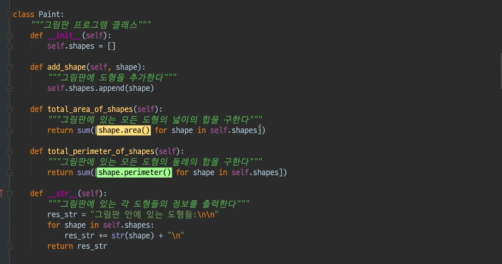

  이렇게 shape이 rectangle, circle 처럼 여러개 가리킬 수 있는 것을 **다형성이 있다** 라고 말함. 

  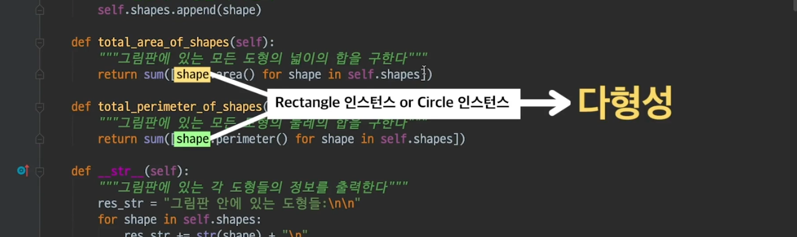

  즉, 하나의 변수가 **서로 다른 인스턴스를 가리킬 수 있는 성질을 다형성** 이라고 부른다. 

  

  원래 다형성이란 것은 "여러 가지 형태를 갖는 성질"을 의미함. 이렇게 shape이 어떨땐 원이 되고, 어떨땐 직사각형이 되는 카멜레온 같은 성질을 다형성이 있다고 말하는 것. 

  다시 얘기하지만, 이게 가능한 이유는 shape에 들어가게 되는 rectangle/circle 클래스가 둘다 area와 perimeter을 가지고 있기 때문. 

  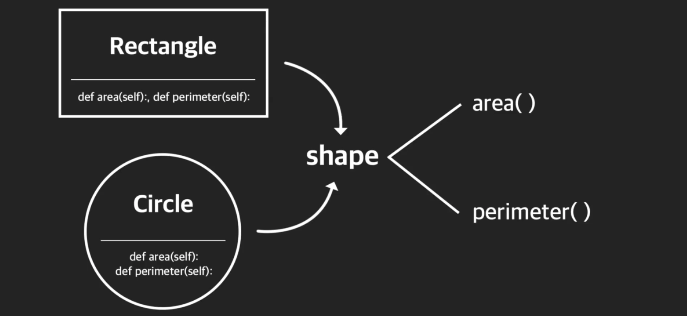


- #### 상속 없는 다형성의 한계

  **원통(`Cylinder`) 클래스**

  이번에는 입체 도형 중 하나인 원통을 나타내는 클래스를 지난 영상에서 작성한 코드에 추가해봅시다. 원통은 입체 도형이라서 `Rectangle` 클래스, `Circle` 클래스와 달리 넓이, 둘레를 구하는 메소드를 두지 않겠습니다.

  ```python
  class Rectangle:
      """직사각형 클래스"""
      def __init__(self, width, height):
          self.width = width
          self.height = height
  
      def area(self):
          """직사각형의 넓이를 리턴한다"""
          return self.width * self.height
  
      def perimeter(self):
          """직사각형의 둘레를 리턴한다"""
          return 2 * self.width + 2 * self.height
  
      def __str__(self):
          """직사각형의 정보를 문자열로 리턴한다"""
          return "밑변 {}, 높이 {}인 직사각형".format(self.width, self.height)
  
  
  class Circle:
      """원 클래스"""
      def __init__(self, radius):
          self.radius = radius
  
      def area(self):
          """원의 넓이를 리턴한다"""
          return pi * self.radius * self.radius
  
      def perimeter(self):
          """원의 둘레를 리턴한다"""
          return 2 * pi * self.radius
  
      def __str__(self):
          """원의 정보를 문자열로 리턴한다"""
          return "반지름 {}인 원".format(self.radius)
  
  
  class Cylinder:
      """원통 클래스"""
      def __init__(self, radius, height):
          self.radius = radius
          self.height = height
  
      def __str__(self):
      """원통의 정보를 문자열로 리턴하는 메소드"""
          return "밑면 반지름 {}, 높이 {}인 원기둥".format(self.radius, self.height)
  
  
  class Paint:
      """그림판 프로그램 클래스"""
      def __init__(self):
          self.shapes = []
      
      def add_shape(self, shape):
          """그림판에 도형을 추가한다"""
          self.shapes.append(shape)
      
      def total_area_of_shapes(self):
          """그림판에 있는 모든 도형의 넓이의 합을 구한다"""
          return sum([shape.area() for shape in self.shapes])
      
      def total_perimeter_of_shapes(self):
          """그림판에 있는 모든 도형의 둘레의 합을 구한다"""
          return sum([shape.perimeter() for shape in self.shapes])
      
      def __str__(self):
          """그림판에 있는 각 도형들의 정보를 출력한다."""
          res_str = "그림판 안에 있는 도형들:\n\n"
          for shape in self.shapes:
              res_str += str(shape) + "\n"
          return res_str    
  ```

  이번에는 그림판 프로그램에 원통 인스턴스도 추가해볼까요?

  ```python
  paint_program = Paint()
  cylinder = Cylinder(7, 4)
  rectangle = Rectangle(3, 7)
  circle = Circle(4)
  
  paint_program.add_shape(cylinder)
  paint_program.add_shape(circle)
  paint_program.add_shape(rectangle)
  
  print(paint_program.total_perimeter_of_shapes()) # 에러가 난다!
  print(paint_program.total_area_of_shapes())
  ```

  위 코드를 실행하니 에러가 나는군요. 그 이유는 `Cylinder` 클래스에는 `perimeter` 메소드가 없기 때문입니다. 너무나도 당연한 결과입니다. `Rectangle` 클래스, `Circle` 클래스에는 있는 함수를 아까 `Cylinder` 클래스에는 두지 않았으니까요!

  이 문제를 한번 해결해봅시다. 상속에서 배웠던 `isinstance` 함수가 혹시 기억나시나요? 이 함수를 사용해봅시다.  리스트 `shapes`에 도형을 추가하기 전에 그 인스턴스가 `Rectangle` 클래스의 인스턴스 혹은 `Circle` 클래스의 인스턴스가 맞는지 확인하고, 맞는 경우에만 추가하면 어떨까요? 이렇게 하면 `shapes`에 추가되는 모든 인스턴스가 `area`와 `perimeter` 메소드를 갖고 있을 테니 에러가 생기는 일은 없겠죠?

  ```python
  class Paint:
      """그림판 프로그램 클래스"""
      def __init__(self):
          self.shapes = []
  
      def add_shape(self, shape):
          """그림판에 도형을 추가한다"""
          if isinstance(shape, Circle) or isinstance(shape, Rectangle):
              self.shapes.append(shape)
          else:
              print("넓이, 둘레를 구하는 메소드가 없는 도형은 추가할 수 없습니다!")
  
      def total_area_of_shapes(self):
          """그림판에 있는 모든 도형의 넓이의 합을 구한다"""
          return sum([shape.area() for shape in self.shapes])
  
      def total_perimeter_of_shapes(self):
          """그림판에 있는 모든 도형의 둘레의 합을 구한다"""
          return sum([shape.perimeter() for shape in self.shapes])
  ```

  다행히 이런 방식으로 문제는 해결됐지만 앞으로 그림판 프로그램이 발전하면서 삼각형, 별 모양 등과 같은 새 도형이 추가된다면 문제가 생깁니다. 즉, 새로운 도형 클래스를 만들 때마다 `add_shape` 메소드에 방금과 같이 `area` 메소드와 `perimeter` 메소드를 가진 클래스인지를 확인하는 코드, 그러니까 `isinstance` 함수를 추가해야 합니다. 그리고 지금이야 도형 클래스 종류가 적지만 도형 종류가 100개 이상으로 넘어간다면 실수로 어떤 클래스에 대한 `isinstance` 함수는 빠뜨릴 수도 있는데요.

  좀 더 효율적이고 안전하게 다형성을 적용할 방법이 없을까요? 다음 영상을 보시죠.


- #### 상속을 활용한 다형성1

  지금 보면, Rectangle, Circle 클래스에는 area/perimeter을 구할 수 있지만, Cylinder는 그런것을 구할 메소드가 없음. 그래서 에러가 발생했던 것. 이런 경우 상속을 사용하면 문제를 해결할 수 있음. 

  Rectangle/Circle이 둘다 상속받는 공통 부모 클래스를 만든다. Shape클래스를 만들어 보자. 

  ```python
  class Shape:
      """도형 클래스"""
      def area(self):
          """도형의 넓이를 리턴한다 : 자식 클래스가 오버라이딩 할 것"""
          pass
      def perimeter(self):
          """도형의 둘레를 리턴한다 : 자식 클래스가 오버라이딩 할 것"""
          pass
     
  ```

  Shape을 추가할 일은 없음. Shape은 단지 추상적인 개념일 뿐이고, 그림판에 추가할 것들은 원이나 직사각형 같은 것. Shape클래스를 만들어서, 활용.

  ```python
  from math import pi
  
  class Shape:
      """도형 클래스"""
      def area(self):
          """도형의 넓이를 리턴한다 : 자식 클래스가 오버라이딩 할 것"""
          pass
      def perimeter(self):
          """도형의 둘레를 리턴한다 : 자식 클래스가 오버라이딩 할 것"""
          pass
  
  class Rectangle(Shape):
      """직사각형 클래스"""
      def __init__(self, width, height):
          self.width = width
          self.height = height
  
      def area(self):
          """직사각형의 넓이를 리턴한다"""
          return self.width * self.height
  
      def perimeter(self):
          """직사각형의 둘레를 리턴한다"""
          return 2*self.width +2*self.height
  
      def __str__(self):
          """직사각형의 정보를 문자열로 리턴한다"""
          return "밑변 {}, 높이 {}인 직사각형".format(self.width, self.height)
  
  class Circle(Shape):
      """원 클래스"""
      def __init__(self, radius):
          self.radius = radius
  
      def area(self):
          """원의 너비를 나타낸다"""
          return pi*self.radius * self.radius
  
      def perimeter(self):
          """원의 둘레를 리턴한다"""
          return 2*pi*self.radius
  
      def __str__(self):
          """원의 정보를 문자열로 리턴한다"""
          return "반지름 {}인 원".format(self.radius)
  
  class Cylinder:
      """원통 클래스"""
      def __init__(self, radius, height):
          self.radius = radius
          self.height = height
  
      def __str__(self):
          """원통의 정보를 문자열로 리턴하는 메소드"""
          return "밑면 반지름 {}, 높이 {}인 원기둥".format(self.radius, self.height)
  
  
  
  class Paint:
      """그림판 프로그램 클래스"""
      def __init__(self):
          self.shapes = []
      def add_shape(self, shape):
          """그림판에 도형을 추가한다"""
          if isinstance(shape, Shape):
              self.shapes.append(shape)
          else:
              print("넓이, 둘레를 구하는 메소드가 없는 도형은 추가할 수 없습니다. ")
  
      def total_area_of_shapes(self):
          """그림판에 있는 모든 도형의 넓이의 합을 구한다"""
          return sum([shape.area() for shape in self.shapes])
      def total_perimeter_of_shapes(self):
          """그림판에 있는 모든 도형의 둘레의 합ㅇ을 구한다"""
          return sum([shape.perimeter() for shape in self.shapes])
  
      def __str__(self):
          """그림판에 있는 각 도형들의 정보를 출력한다"""
          res_str = "그림판에 안에 있는 도형들: \n\n"
          for shape in self.shapes:
              res_str+= str(shape)+"\n"
          return res_str
  
  cylinder = Cylinder(7, 4)
  rectangle = Rectangle(3, 7)
  circle = Circle(4)
  
  paint_program = Paint()
  paint_program.add_shape(rectangle)
  paint_program.add_shape(circle)
  paint_program.add_shape(cylinder)
  
  print(paint_program.total_area_of_shapes())
  print(paint_program.total_perimeter_of_shapes())
  ```

  > 넓이, 둘레를 구하는 메소드가 없는 도형은 추가할 수 없습니다. 
  > 71.26548245743669
  > 45.132741228718345

  정리하자면, 어떤 변수가 여러 종류의 인스턴스를 가리키게 해서 다형성을 가지게 할 수 있음. 하지만, 그 인스턴스의 어떤 메소드를 호출했을 때, 인스턴스가 그 메소드를 가지고 있어야만 다형성이 성립된다. 그 메소드가 없으면 에러가 발생하지. 이 에러를 발생하려면 호출 전에 미리 isinstance같은 것을 사용해서 미리 확인하는 절차가 필요함. 이때, 클래스 갯수가 많아지면 isinstance가 엄청 많아지겠지. 그런 경우 이번 영상처럼 상속을 사용하면, isinstance를 딱 한번만 써도 됨. 

  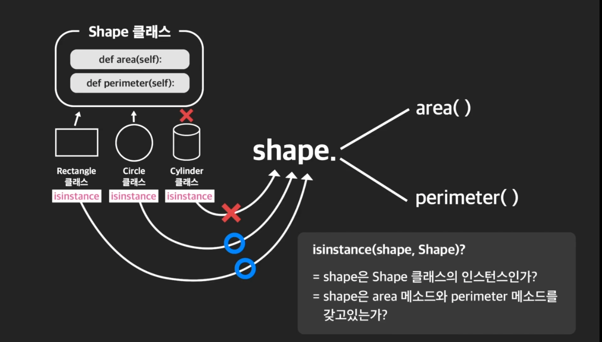


- #### 상속을 활용한 다형성 2 일반상속의 문제점

  상속과 다형성을 배웠지만, 아직 남아있는 문제가 있음. 새로운 도형 하나를 만들어 보자. 

  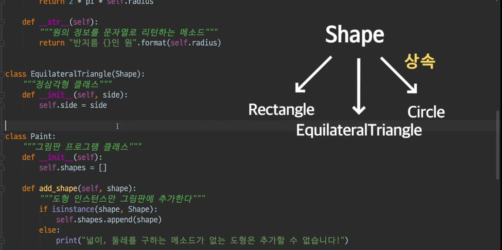

  상속을 받고 있긴 한데, 문제는 area랑 perimeter메소드를 오버라이딩을 안했음. 

  ```python
  class EquilateralTriangle(Shape):
      """정삼각형 클래스"""
      def __init__(self, side):
          self.side = side
  ```

  근데 그래도, 상속 자체는 받기 떄문에 아래부분에서  True가 리턴되서, 그림판 클래스에 추가 될 수는 있음. 

  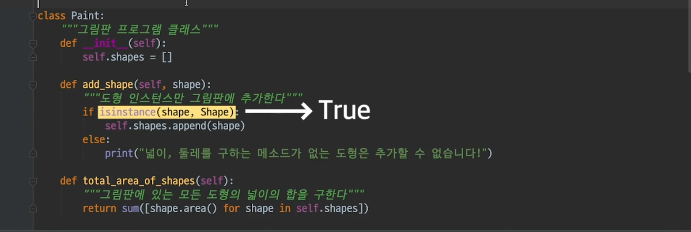

  실제로 넣어보면, 

  ```python
  triangle = EquilateralTriangle(4)
  paint_program = Paint()
  paint_program.add_shape(triangle)
  print(paint_program.total_area_of_shapes())
  print(paint_program.total_perimeter_of_shapes())
  ```

  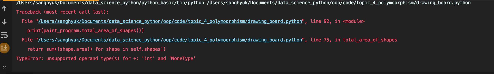

  왜일까? 정삼각형 클래스에서는 현재 area/perimeter가 없음. 그러면 부모 클래스로부터 물려받은 area/perimeter를 사용한다는 뜻. 근데 부모클래스의 area/perimeter는 그냥 pass만 써 있는 상태. 근데, 어떤 값이 있는것처럼 sum함수로 이걸 더 하려고 하니깐 에러가 나는 거야. 

  자식 클래스가 오버랑이딩 하라고 pass로 비워놨더니 자식클래스가 오버라이딩을 안했어. 그러면 뭐 어떻게 해?

  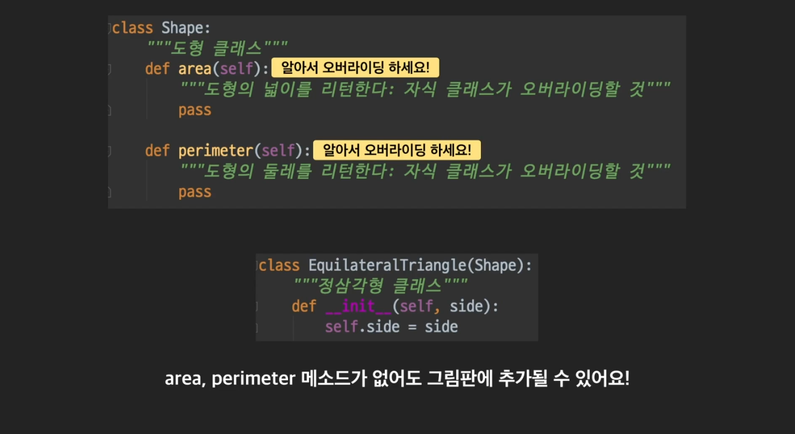

  즉 그림판에 추가될 객체들은, shape클래스를 상속받아야 할 뿐만이 아니라, area/perimeter 메소드도 꼭 오버라이딩 해야 함. 

  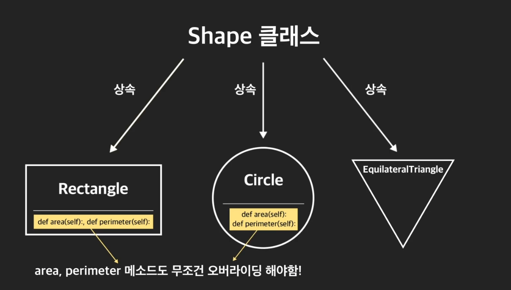

  **그러면, shape클래스의 자식 클래스가 area/perimeter 클래스를 무조건 오버라이딩 하도록 만들려면?**

  

- #### 상속을 활용한 다형성 3 추상 클래스 개념

  메소드를 강제로 오버라이딩 하려면 어떻게 해야 할까?

  추상클래스를 사용하면 됨. 추상클래스란 "**여러 클래스들의 공통점을 추상화해서 모아놓은 클래스**"

  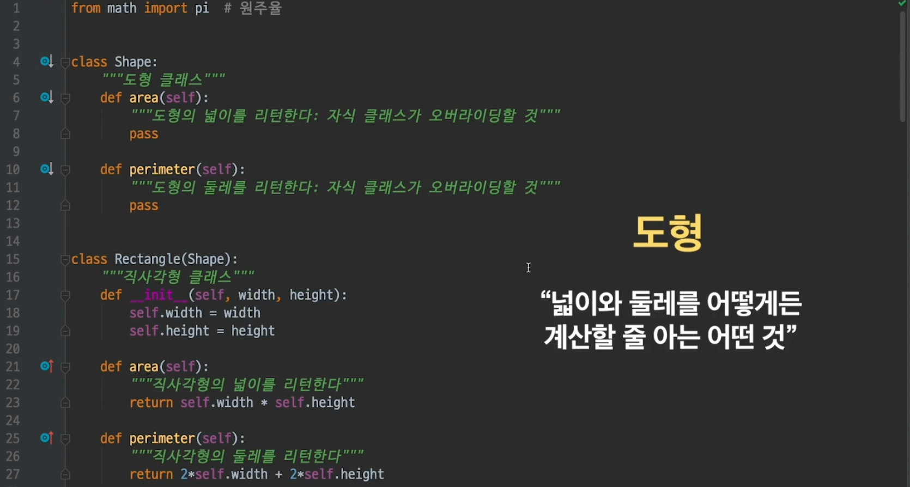

  파이썬에서 추상클래스를 정의하기 위해서는 몇가지 문법을 추가해 줘야 함. 

  ABC는 **Abstract Base Class의 줄임말**

  ```python
  from abc import ABC, abstractmethod
  ```

  그리고, 추상메소드란 자식 클래스가 반드시 오버라이딩 해야 되는 메소드. -

  **shape을 상속받는 클래스는 이제부터는 반드시 @abstractmethod가 있는 메소드를 오버라이딩 해야 한다. ABC를 상속받고, 적어도 하나 이상의 @abstractmethod가 있는 것을 추상클래스라고 한다.** 

  ```python
  from abc import ABC, abstractmethod
  
  class Shape(ABC):
      """도형 클래스"""
      @abstractmethod
      def area(self):
          """도형의 넓이를 리턴한다 : 자식 클래스가 오버라이딩 할 것"""
          pass
  
      @abstractmethod
      def perimeter(self):
          """도형의 둘레를 리턴한다 : 자식 클래스가 오버라이딩 할 것"""
          pass
  ```

  **중요한 것은 추상클래스로는 인스턴스를 만들 수 없다.**

  `shape=Shape()` 하면 에러가 남.  

  추상클래스는 여러 클래스들의 공통점을 모아두고, 다른 클래스들이 상속받는 부모 클래스가 될 목적으로 존재한다. 

  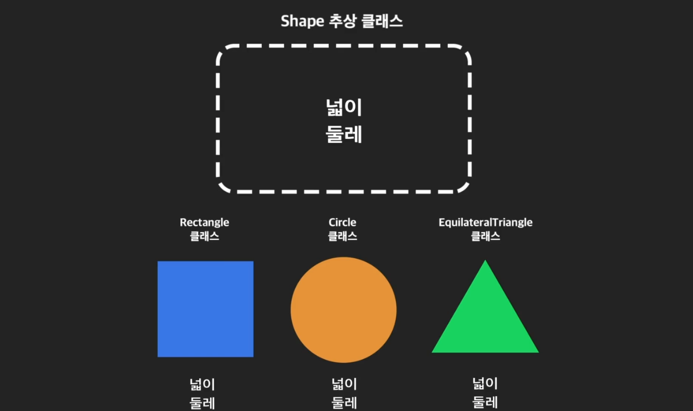


- #### 상속을 활용한 다형성 4 (추상 클래스 활용)

  이제부터 추상 클래스를 상속받는 애들은 반드시, area/perimeter를 반드시 오버라이딩 해야 한다. 오버라이딩 하지 않으면, 

  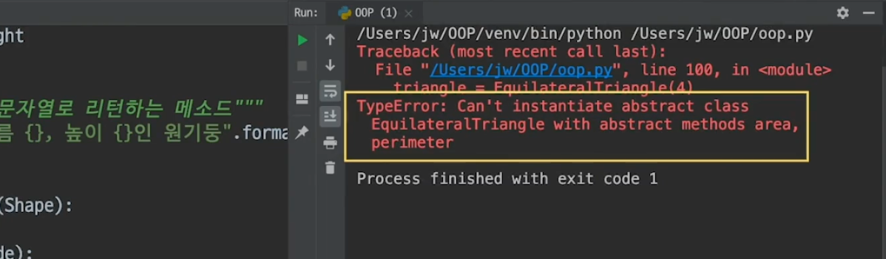

  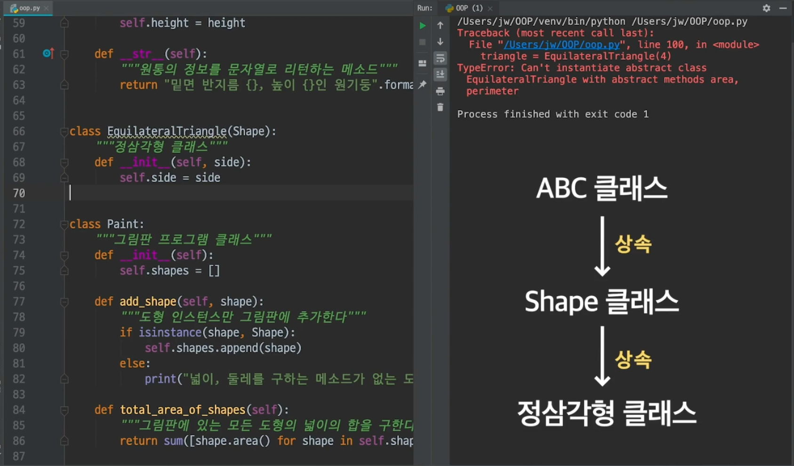

  정삼각형 클래스는 현재,  ABC를 상속하고 있고, 추상메소드를 하나 이상 가지고 있기 때문에 **추상클래스**. 

  하지만, 물려받은 클래스를 오버라이딩 하면 일반 클래스로 만들 수 있음. 

  ```python
  class EquilateralTriangle(Shape):
      """정삼각형 클래스"""
      def __init__(self, side):
          self.side = side
  
      def area(self):
          """정삼각형의 넓이를 리턴한다"""
          return sqrt(3) * self.side * self.side / 4
  
      def perimeter(self):
          """정삼각형의 둘레를 리턴한다"""
          return 3*self.side
  ```

  팁으로 추상 클래스 사용할때는, type hinting을 사용하면 좋지. 그래도 어떻게 오버라이딩하는지 알려줄 수 있잖아. 

  ```python
  
  class Shape(ABC):
      """도형 클래스"""
      @abstractmethod
      def area(self) -> float:
          """도형의 넓이를 리턴한다 : 자식 클래스가 오버라이딩 할 것"""
          pass
  
      @abstractmethod
      def perimeter(self) -> float:
          """도형의 둘레를 리턴한다 : 자식 클래스가 오버라이딩 할 것"""
          pass
  ```


- #### 추상클래스 더 알아보기

  이전 영상에서 추상 클래스가 무엇인지 알아봤는데요. 파이썬에서 쓰는 추상 클래스에 관해서 알아야할 내용 4가지가 있습니다. 하나씩 알아봅시다. 

  **1. 추상 클래스와 추상화!**

  우리는 지금 “객체 지향 프로그래밍의 4가지 기둥” 중 마지막에 해당하는 “다형성”을 배우고 있습니다. 혹시 첫 번째로 배웠던 “추상화” 기억나시나요? 추상화는 변수, 함수, 클래스를 사용해 사용자가 꼭 알아야만 하는 부분만 겉으로 드러내는 것이라고 배웠습니다. 이번에 배운 추상 클래스도 이러한 추상화의 한 예시입니다.

  추상 클래스는 서로 관련있는 **클래스들의 공통 부분을 묶어서** 추상화합니다. 무슨 말인지 예시를 통해 차근차근 이해해보죠. 다음 코드는 이전 영상의 그림판 프로그램 클래스입니다.

  ```python
  class Paint:
      """그림판 프로그램 클래스"""
      def __init__(self):
          self.shapes = []
  
      def add_shape(self, shape):
          """도형 인스턴스만 그림판에 추가한다"""
          if isinstance(shape, Shape):
              self.shapes.append(shape)
          else:
              print("도형 클래스가 아닌 인스턴스는 추가할 수 없습니다!")
  
      def total_area_of_shapes(self):
          """그림판에 있는 모든 도형의 넓이의 합을 구한다"""
          return sum([shape.area() for shape in self.shapes])
  
      def total_perimeter_of_shapes(self):
          """그림판에 있는 모든 도형의 둘레의 합을 구한다"""
          return sum([shape.perimeter() for shape in self.shapes])
  
      def __str__(self):
          """그림판에 있는 각 도형들의 정보를 문자열로 리턴한다"""
          res_str = "그림판 안에 있는 도형들:\n\n"
          for shape in self.shapes:
              res_str += str(shape) + "\n"
          return res_str
  ```

  1. `Paint` 클래스를 사용하는 개발자는 `add_shape` 메소드에서 파라미터 `shape`으로 들어오는 인스턴스의 타입이 `Shape` 클래스일 때만 그 인스턴스를 추가합니다. 이는 해당 인스턴스가 구체적으로 무슨 도형의 인스턴스인지는 관심이 없고 `Shape` 클래스의 인스턴스에만 해당하면 된다는 뜻입니다.
  2. 여기서 `Shape` 클래스는 추상 클래스입니다. 따라서 `Shape` 클래스의 인스턴스라는 것은 그 인스턴스의 클래스가 `Shape` 클래스를 상속받은 자식 클래스로, 추상 메소드 `area`와 `perimeter`를 오버라이딩한 클래스여야한다는 뜻이죠.
  3. 정리하자면 도형을 나타내는 클래스라면 가질 수 밖에 없는 공통점을 `Shape` 클래스로 추상화한 것입니다.

  이렇게 하면 `Paint` 클래스의 코드를 작성하는 개발자는 추상 클래스로 추상화된 수준(`Shape` 클래스)까지만 고려하고 개발을 진행할 수 있습니다. 그러니까 개발자는 추가된 각 도형 인스턴스가 구체적으로 무슨 클래스의 인스턴스인지 확인할 필요없이, 일단 `area`, `perimeter` 메소드를 가지는 인스턴스라고 생각하고 개발할 수 있는 것이죠.

  이 상황에서 좀더 추가하자면  `add_shape` 메소드에 `Shape` 타입을 가지는 인스턴스가 `shape` 파라미터로 들어와야 한다는 것을 알려주기 위해 다음과 같이 파이썬의 **type hinting** 기능을 사용할 수 있습니다.

  ```python
  def add_shape(self, shape: Shape):
  ```

  이런 type hinting 자체만으로 Shape 클래스의 인스턴스만 들어오도록 강제할 수는 없지만, 이런 정보를 둬야 개발자가 `Paint` 클래스를 제대로 사용할 수 있겠죠?

  **2. 추상 클래스에도 일반 메소드를 추가할 수 있어요!**

  추상 클래스에 꼭 추상 메소드만 있어야하는 것은 아닙니다. `@abstractmethod` 데코레이터가 없는 일반적인 메소드가 있어도 상관없습니다. 이 메소드들 또한 자식 클래스가 물려받아 그대로 사용하거나 오버라이딩하여 사용할 수 있습니다. 다음 예시를 봅시다.

  ```python
  class Shape(ABC):
      """도형 클래스"""
      @abstractmethod
      def area(self) -> float:
          """도형의 넓이를 리턴한다: 자식 클래스가 오버라이딩할 것"""
          pass
  
      @abstractmethod
      def perimeter(self) -> float:
          """도형의 둘레를 리턴한다: 자식 클래스가 오버라이딩할 것"""
          pass
    
      def larger_than(self, shape):
          """해당 인스턴스의 넓이가 파라미터 인스턴스의 넓이보다 큰지를 불린으로 나타낸다"""
          return self.area() > shape.area()
  ```

  `Shape` 클래스 중 `larger_than` 메소드가 일반 메소드입니다. 이 메소드는 파라미터로 전달된 다른 도형 인스턴스의 넓이와 자신의 넓이를 비교합니다.

  `Shape` 클래스를 상속받는 원(`Circle`) 클래스를 만들고 원 인스턴스로 일반 메소드 `larger_than`을 호출해보면

  ```python
  class Circle(Shape):
      """원 클래스"""
      def __init__(self, radius):
          self.radius = radius
  
      def area(self):
          """원의 넓이를 리턴한다"""
          return pi * self.radius * self.radius
  
      def perimeter(self):
          """원의 둘레를 리턴한다"""
          return 2 * pi * self.radius
  
  circle = Circle(6)
  rectangle = Rectangle(3, 4)
  print(circle.larger_than(rectangle)) # 출력: True
  ```

  제대로 작동합니다.  즉, 추상 클래스에는 꼭 추상 메소드뿐만 아니라 일반 메소드도 정의할 수 있고 이것도 똑같이 자식 클래스가 물려받습니다. 하지만 차이점이 있다면

  1. 반드시 오버라이딩해야하는 추상 메소드와 달리

  2. 일반 메소드는 물려받은 그대로 사용할지, 오버라이딩할지를 자식 클래스에서 결정하는 것이구요.

     

  **3. 추상 메소드에도 내용을 채울 수 있습니다!**

  ```python
  from abc import ABC, abstractmethod
  
  class Shape(ABC):
      """도형 클래스"""
      @abstractmethod
      def area(self) -> float:
          """도형의 넓이를 리턴한다: 자식 클래스가 오버라이딩할 것"""
          pass
  
      @abstractmethod
      def perimeter(self) -> float:
          """도형의 둘레를 리턴한다: 자식 클래스가 오버라이딩할 것"""
          pass
  ```

  지금까지는 추상 메소드의 내용으로 그냥 `pass`만 써줬습니다. 하지만 사실 추상 메소드 안에는 다른 내용을 써도 됩니다. 아래 코드처럼요!

  ```python
  from abc import ABC, abstractmethod
  
  class Shape(ABC):
      """도형 클래스"""
      @abstractmethod
      def area(self) -> float:
          """도형의 넓이를 리턴한다: 자식 클래스가 오버라이딩할 것"""
          print("도형의 넓이 계산 중!")   # ---------------- 추가된 코드
  
      @abstractmethod
      def perimeter(self) -> float:
          """도형의 둘레를 리턴한다: 자식 클래스가 오버라이딩할 것"""
          pass
  ```

  그런데 좀 이상하죠? 어차피 추상 클래스를 상속받는 자식 클래스에서 이 추상 메소드들은 반드시 오버라이딩해야 합니다. 그래서 이렇게 어차피 무시될 추상 메소드의 내용이 왜 필요한지 모르겠군요.

  하지만 사실 이 내용은 경우에 따라 유용할 때가 있습니다. 보통 추상 메소드에 내용을 쓸 때는 모든 자식 클래스에 해당하는 공통 내용을 써줍니다. 그리고 자식 클래스에서 추상 메소드를 오버라이딩하더라도 이렇게 미리 채워진 내용을 가져와서 재활용할 수 있습니다. 이는 `super` 함수를 사용하면 가능합니다.

  ```python
  class Rectangle(Shape):
      """직사각형 클래스"""
      def __init__(self, width, height):
          self.width = width
          self.height = height
  
      def area(self):
          """직사각형의 넓이를 리턴한다"""
          super().area() # ---------------- 부모의 메소드를 가져다 씀
          return self.width * self.height
  
      def perimeter(self):
          """직사각형의 둘레를 리턴한다"""
          return 2*self.width + 2*self.height
  
  
  rectangle = Rectangle(3, 4)
  print(rectangle.area())# 출력: 도형의 넓이 계산 중! 12
  ```

  예전에 부모 클래스의 `__init__` 메소드를 사용할 때 자식 클래스에서 `super` 함수로 부모 클래스의 내용에 접근할 수 있다고 설명한 적이 있는데 혹시 기억하시나요? `super` 함수를 사용하면 부모 클래스에 접근할 수 있습니다. 이 코드 중 `area` 메소드를 보세요. 부모 클래스인 `Shape` 클래스의 `area` 메소드를 실행하는 부분이 있습니다.

  즉, 물려받은 추상 메소드를 오버라이딩하는데

  1. `super` 함수를 통해 추상 메소드의 기존 내용(`print("도형 넓이 계산 중!")`)을 포함함과 동시에
  2. 이와 별도로 자신만의 내용을 또 추가한거죠.(`return self.width * self.height`)

  이렇게 모든 자식 클래스에서 공통적으로 사용할 부분을 추상 메소드의 내용으로 써주고 자식 클래스에서 이를 `super` 함수로 접근하는 방법은 꽤 자주 쓰는 방법입니다. 이번 기회에 꼭 기억하세요!

  

  **4. 자식 클래스가 특정 변수를 갖도록 유도할 수 있어요!**

  추상 클래스를 사용하면 자식 클래스가 추상 클래스의 추상 메소드를 오버라이딩하도록 즉, 해당 메소드를 갖도록 강제할 수 있습니다. 하지만 이밖에도 추상 클래스로 자식 클래스가 특정 변수를 갖도록 유도할 수 있는 방법이 있습니다. 예시를 통해 알아볼까요? 이 부분이 이 노트의 4가지 내용 중 가장 어려운데요, 하나씩 살펴봅시다.

  그림판에서 사용할 모든 도형 클래스는 좌표를 나타내는 인스턴스 변수 `x`와 `y`를 반드시 가져야한다고 가정합시다. 어떻게 하면 추상 클래스를 사용해 각 자식 클래스가 이 변수를 갖도록 유도할 수 있을까요?

  ```python
  class Shape(ABC):
      """도형 클래스"""
      @abstractmethod
      def area(self) -> float:
          """도형의 넓이를 리턴한다: 자식 클래스가 오버라이딩할 것"""
          print("도형 넓이 계산 중!")
  
      @abstractmethod
      def perimeter(self) -> float:
          """도형의 둘레를 리턴한다: 자식 클래스가 오버라이딩할 것"""
          pass
  
      def __str__(self):
          return "추상 클래스라고 해서 모든 메소드가 추상 메소드일 필요는 없습니다!"
  
      @property
      @abstractmethod
      def x(self):
          """도형의 x 좌표 getter 메소드"""
          pass
  
      @property
      @abstractmethod
      def y(self):
          """도형의 y 좌표 getter 메소드"""
          pass
  ```

  위 코드를 보세요.  이 `Shape` 클래스는 지금 `x` 메소드와 `y` 메소드를 getter 메소드이자 추상 메소드로 갖고 있습니다. `@property`는 파이썬스럽게 getter/setter 메소드를 정의하는 방법에서 배웠던 데코레이터입니다. 기억나시죠?

  이렇게 `@property` 와 `@abstractmethod` 데코레이터를 메소드 이름 위에 연달아 적어주면 이 메소드 는 **getter 메소드이자 추상 메소드**가 됩니다. 즉, 어떤 변수에 대한 getter 메소드를 뜻하지만 아직 내용이 비어있어 어떤 변수를 리턴하는지는 결정되지 않은 것이죠. 이때 `Shape` 클래스를 상속받는 자식 클래스에서 어떤 변수를 리턴하는지 즉, 이 getter 메소드가 어떤 변수에 대한 것인지를 나타내도록 오버라이딩해야하는 것입니다.

  일단 `Shape` 클래스를 상속받는 정삼각형 클래스인 `EquilateralTriangle` 클래스를 정의했습니다. getter 메소드들을 오버라이딩하지 않으면 다음과 같은 에러가 뜹니다.

  ```python
  class EquilateralTriangle(Shape):
      """정삼각형을 나타내는 클래스"""
      def __init__(self, side):
          self.side = side
  
      def area(self):
          """정삼각형의 넓이를 리턴한다"""
          return sqrt(3) * self.side * self.side / 4
  
      def perimeter(self):
          """정삼각형의 둘레를 리턴한다"""
          return 3 * self.side
  
  equilateral_triangle = EquilateralTriangle(4) # 에러 발생: TypeError: Can't instantiate abstract class EquilateralTriangle with abstract methods x, y
  ```

  추상 메소드 x, y를 오버라이딩하지 않아서 생긴 에러입니다. 그렇다면 각 getter 메소드는 어떻게 오버라이딩하면 될까요?  보통

  1. 인스턴스 변수의 이름은 예를 들어 `_apple` 처럼 캡슐화를 적용한 것으로 나타내고
  2. getter 메소드의 이름은 `apple` 처럼 캡슐화된 변수 이름 앞에서 밑줄을 뺀 이름

  으로 한다고 배웠습니다. 이 경우에 적용한다면 `x`는 인스턴스 변수 `_x`의 getter 메소드로, `y`는 인스턴스 변수  `_y`의 getter 메소드로 해주면 좋을 것 같네요.

  ```python
  @property
      def x(self):
          """_x getter 메소드"""
          return self._x
  
  @x.setter
      def x(self, value):
          """_x setter 메소드"""
          self._x = value
  ```

  혹시 `@property` 데코레이터의 기능이 잘 생각나지 않는 분을 위해 설명하자면  이 코드의 의미는 이 클래스의 인스턴스에 대해 `self.x` , `인스턴스 이름.x` 와 같은 부분을 실행할 때, getter 메소드 `x`를 실행한다는 의미입니다. 즉, `@property`가 붙으면 이런 구문들이 인스턴스 변수 x의 값을 직접 읽는다는 원래의 뜻이 아니라 **getter 메소드 `x`를 실행한다는 의미**로 바뀌는 거죠.

  그 아래의 `@x.setter` 가 붙은 메소드는 이 클래스의 인스턴스에 대해 `self.x = 3` , `인스턴스 이름.x = 3` 과 같은 부분을 실행할 때 setter 메소드 `x`를 실행한다는 의미입니다. 즉, `@x.setter`가 붙으면 이런 구문들이 인스턴스 변수 x에 어떤 값을 설정한다는 원래의 뜻이 아니라 **setter 메소드 x를 실행한다는 의미**로 바뀌는 것이구요.

  그럼 이때까지 설명한 조건에 부합하는 `EquilateralTriangle` 클래스를 완성한 결과를 봅시다.

  ```python
  class EquilateralTriangle(Shape):
       """정삼각형 클래스"""
      def __init__(self, x, y, side):
          self._x = x
          self._y = y
          self.side = side
  
      def area(self):
          """정삼각형의 넓이를 리턴한다"""
          return sqrt(3) * self.side * self.side / 4
  
      def perimeter(self):
          """정삼각형의 둘레를 리턴한다"""
          return 3 * self.side
  
      @property
      def x(self):
          """_x getter 메소드"""
          return self._x
  
      @x.setter
      def x(self, value):
          """_x setter 메소드"""
          self._x = value
  
      @property
      def y(self):
          """_y getter 메소드"""
          return self._y
  
      @y.setter
      def y(self, value):
          """_y setter 메소드"""
          self._y = value
  
  equilateral_triangle = EquilateralTriangle(5, 6, 4) # 에러가 나지 않는다
  equilateral_triangle.x = 10
  print(equilateral_triangle.x) # 출력: 10
  
  equilateral_triangle.y = 5
  print(equilateral_triangle.y) # 출력: 5
  ```

  이 코드는 잘 실행됩니다.  물론 `Shape` 클래스에서 자식 클래스에 getter 메소드를 오버라이딩하도록 강제한다고 해도 자식 클래스에서 이 메소드를 변수의 내용을 가져오는 getter 메소드로서의 내용이 아닌 아예 엉뚱한 내용으로 오버라이딩할 수도 있습니다. 하지만 파이썬의 문화를 잘 따르는 개발자라면 getter/setter 메소드의 내용이 되도록 오버라이딩할 것입니다. 이처럼 부모 클래스에서 추상 메소드인 getter 메소드를 만들어서 자식 클래스가 그 getter 메소드의 대상이 되는 인스턴스 변수를 갖도록 유도할 수 있는 것입니다!


- #### 추상클래스 다중상속받기

  이전에 **다중 상속**이 무엇인지 배웠습니다. 다중 상속은 되도록 하지 않거나 하더라도 주의해서 해야한다고 말씀드렸죠? 하지만 이러한 주의사항은 추상 클래스가 아닌 일반 클래스에 해당되는 내용입니다.  추상 클래스 여러 개를 다중 상속받는 것은 일반적으로 많이 쓰입니다. 아래의 코드를 볼까요?

  **추상 클래스 다중 상속 예시**

  ```python
  from abc import ABC, abstractmethod
  
  class Message(ABC):
      @abstractmethod
      def print_message(self) -> None:
          pass
  
  class Sendable(ABC):
      @abstractmethod
      def send(self, destination: str) -> None:
          pass
  
  class Email(Message, Sendable):
      def __init__(self, content, user_email):
          self.content = content
          self.user_email = user_email
  
      def print_message(self):
          print("이메일 내용입니다:\n{}".format(self.content))
  
      def send(self, destination):
          print("이메일을 주소 {}에서 {}로 보냅니다!".format(self.user_email, destination))
  ```

  추상 클래스 `Message`와 `Sendable`을 다중 상속받는 `Email` 클래스를 정의했습니다. 그리고 각 추상 클래스의 추상 메소드들인 `print_message`와 `send` 메소드를 잘 오버라이딩했군요.

  `Email` 클래스를 사용해보면,

  ```python
  # 이메일 인스턴스를 생성한다.
  email = Email("안녕? 오랜만이야 잘 지내니?", "young@codeit.kr")
  
  # 메시지 내용 출력
  email.print_message()
  # 메시지 전송
  email.send("captain@codeit.kr")
  ```

  **실행 결과**

  ```
  이메일 내용입니다:
  안녕? 오랜만이야 잘 지내니?
  이메일을 주소 young@codeit.kr에서 captain@codeit.kr로 보냅니다!
  ```

  잘 동작합니다!

  

  **추상 클래스 다중 상속: 추상 메소드가 겹칠 때**

  그렇다면 왜 추상 클래스를 다중 상속받는 것은 일반 클래스 다중 상속보다 좀더 괜찮은 것일까요? 일단 아래 코드처럼 `Message` 추상 클래스도 `Sendable` 추상 클래스의 추상 메소드와 같은 이름의 메소드로 `send` 메소드를 갖도록 합시다.

  ```python
  class Message(ABC):
      @abstractmethod
      def print_message(self) -> None:
          pass
  
      @abstractmethod
      def send(self, destination: str) -> None:  # ----- 중복되는 추상 메소드
          pass
  
  class Sendable(ABC):
      @abstractmethod
      def send(self, destination: str) -> None: # ----- 중복되는 추상 메소드
          pass
  ```

  이렇게 두 추상 클래스 사이에 중복되는 메소드(`send` 메소드)가 있어도 방금 전 코드는 다음과 같이 잘 동작합니다.

  ```python
  # 이메일 인스턴스를 생성한다.
  email = Email("안녕? 오랜만이야 잘 지내니?", "young@codeit.kr")
  
  # 메시지 내용 출력
  email.print_message()
  # 메시지 전송
  email.send("captain@codeit.kr")
  ```

  

  **실행 결과**

  ```
  이메일 내용입니다:
  안녕? 오랜만이야 잘 지내니?
  이메일을 주소 young@codeit.kr에서 captain@codeit.kr로 보냅니다!
  ```

  사실 생각해보면 딱히 결과가 바뀔 이유가 없습니다. 자식 클래스는 어차피 상속받는 추상 클래스들의 모든 추상 메소드를 오버라이딩해야 합니다. 아무리 부모 추상 클래스들에 같은 이름의 추상 메소드들이 있다해도 어차피 자신이 오버라이딩한 내용이 반영됩니다. 따라서 만약 부모 추상 클래스들 사이에 겹치는 메소드가 추상 메소드라면 문제없이 다중 상속을 할 수 있습니다.  하지만 일반 메소드가 겹친다면 문제가 발생합니다.

  

  **추상 클래스 내 일반 메소드**

  ```python
  class Message(ABC):
      @abstractmethod
      def print_message(self) -> None:
          pass
  
      def __str__(self): # ----- 중복되는 일반 메소드
          return "Message 클래스의 인스턴스"
  
  class Sendable(ABC):
      @abstractmethod
      def send(self, destination: str) -> None:
          pass
  
      def __str__(self): # ----- 중복되는 일반 메소드
          return "Sendable 클래스의 인스턴스"
  ```

  위 코드와 같이 부모 추상 클래스 간에 추상 메소드가 아닌 일반 메소드가 겹친다면 일반 클래스를 다중 상속할 때와 마찬가지로 주의해야합니다. 자식 클래스에서 일반 메소드를 오버라이딩하지 않으면 어느 추상 클래스의 일반 메소드를 실행해야하는지 애매모호하기 때문입니다. 물론 이전에 배운대로 파이썬에서는 `mro`라는 나름의 규칙이 있었지만요.

  

  **기억할 것**

  정리하자면 이 세 가지를 기억하셔야 합니다:

  1. 추상 클래스 다중 상속은 일반적으로 많이 사용한다.
  2. 다중 상속받는 부모 추상 클래스들이 추상 메소드로만 이뤄져 있으면 아무 문제 없이 다중 상속받을 수 있다.
  3. 다중 상속받는 부모 추상 클래스들 간에 이름이 겹치는 일반 메소드가 있으면 일반 클래스를 다중 상속받을 때와 동일한 문제가 생길 수 있다.


- #### 함수/메소드 다형성

  객체지향 프로그램에서 다형성이란 주로 클래스의 다형성(**변수하나가 여러개의 인스턴스를 의미할 수 있는 것**)을 의미하지만, 메소드와 함수의 다형성을 의미할 때도 있음. 

  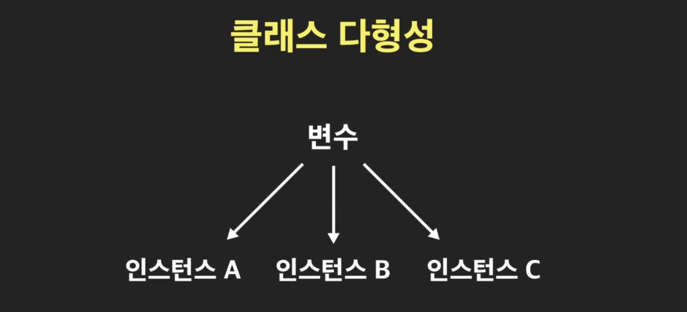

  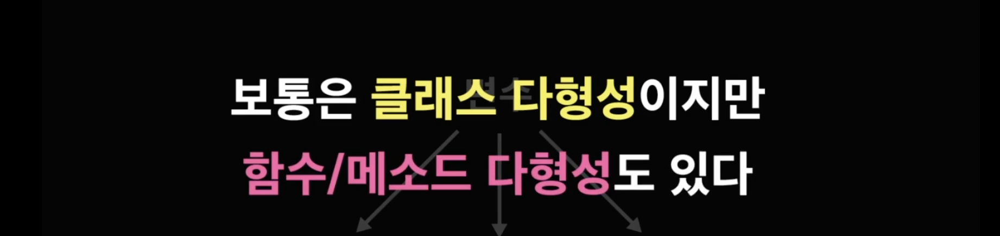

  아래 예시를 보면, 프린트라는 함수를 여러가지 형태로 호출 하고 있음. 

  ```python
  print("this")
  print(0.5678)
  print("this", "that")
  print("this", "that", 3)
  print("this", "that", sep=",")
  ```

  이렇게 여러가지 형태로 함수나 메소드를 호출하는 것을 함수/메소드의 다형성 이라고 부름. 예시를 통해 살펴보자면, 

  1. **옵셔널 파라미터 : 기본값을 미리 지정해준 파라미터.** 

     이렇게 하면, 두번째/세번째 파라미터에 어떤 값을 전달하지 않아도, 저절로 None이 된다. 

     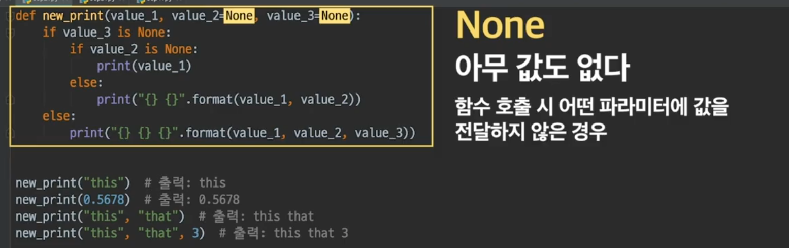

     **여기서 중요한 것은 항상  Optional Parameter는 파라미터 중 가장 뒤에 정의해야 한다는 것**. 

     즉, 아래같은 경우가 안된다는 뜻. 

     ```python
     def new_print(value_1 = None, value_2, value_3= None)
     ```

  2. **함수를 호출할 때 파라미터 이름을 표시하는 것.** 

     아예 파라미터 이름을 적고, 등호와 값을 적어주고 있음. 심지어 3번째 호출 처럼, 함수 정의에 있는 파라미터 순서를 지키지 않아도 됨. 

     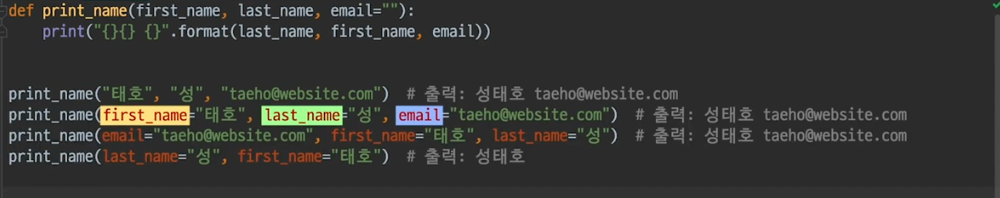
	   
  3. **갯수가 확정되지 않은 파라미터**
    
    아래처럼 하면, 첫번째 파라미터는 message에 담겨서 전달되고, 나머지는 numbers라는 **튜플**에 담겨서 전달됨. 
    
    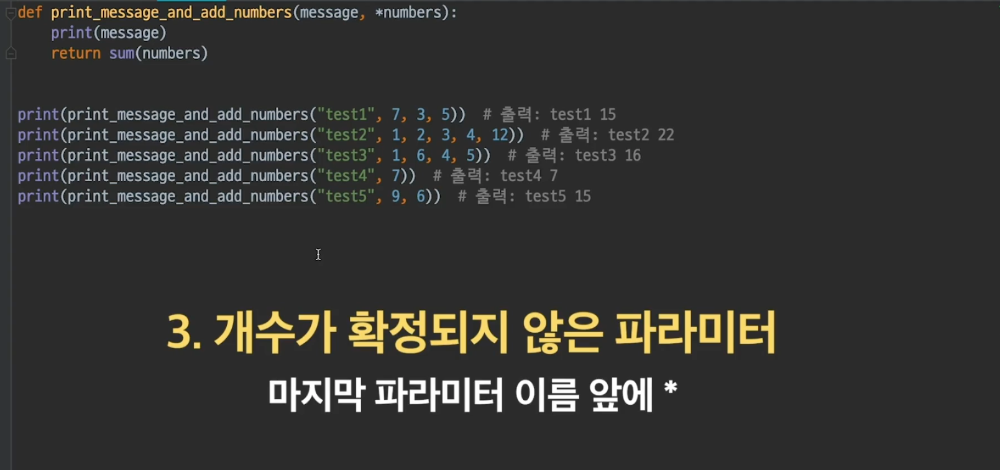
    
    여기서도 ***numbers**가 **message**보다 더 앞에 나오면, 에러가 남. 만약, 별표 파라미터가 앞에 있으면 이렇게 호출할때는 뒤에 파라미터는 반드시 그 이름을 명시하면서 호출해야함. 아래처럼
    
    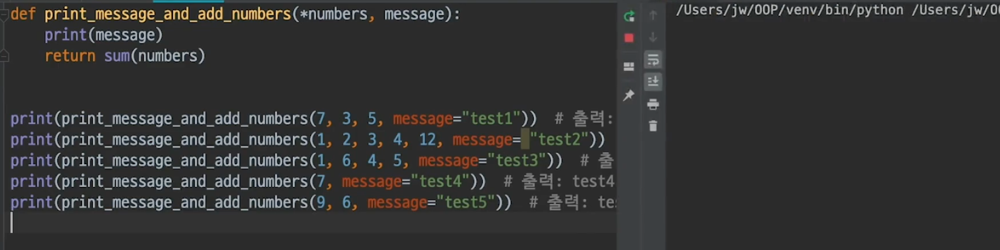
    
    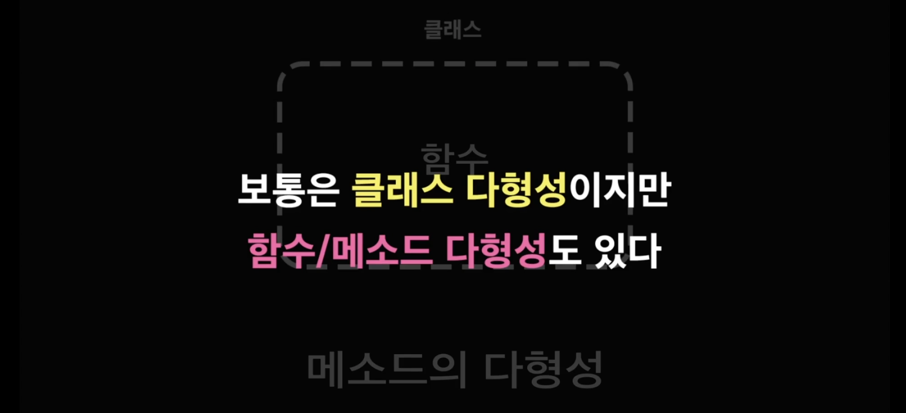


- #### 간단한 주행 시뮬레이터 설명

  요즘은 가상으로 현실과 최대한 비슷한 환경에서 실험할 수 있게 해주는 시뮬레이터 프로그램이 많습니다. 이번 과제에서는 자동차를 마치 실제 도로에서 운전하는 것 같은 체험을 하게 해주는 **주행 시뮬레이터**를 만들어 볼게요. 본격적으로 주행 시뮬레이터를 만들기 전에 아래의 조건들을 만족하는 프로그램을 어떻게 객체 지향적으로 작성할 수 있을지 한번 고민해보세요!

  주행 시뮬레이터는:

  1. 여러 가지 교통 수단들(일반 자동차, 스포츠카, 자전거 등)을 가질 수 있습니다.
  2. 갖고 있는 교통 수단들의 주행을 동시에 시작/정지시킬 수 있습니다.
  3. 갖고 있는 교통 수단들의 현재 속도를 문자열 메시지로 볼 수 있습니다.

  주행 시뮬레이터가 완성되면 어떻게 사용할 수 있을지 미리 테스트 코드를 보여드리겠습니다.

  **테스트 코드**

  ```python
  # 일반 자동차 인스턴스들
  car_1 = NormalCar(0, 100)
  car_2 = NormalCar(0, 120)
  
  # 스포츠카 인스턴스들
  sports_car_1 = SportsCar(0, 200)
  sports_car_2 = SportsCar(0, 190)
  
  # 자전거 인스턴스
  bicycle = Bicycle(0)
  
  # 주행 시뮬레이터 인스턴스
  driving_simulator = DrivingSimulator()
  
  # 주행 가능 인스턴스들을 주행 시뮬레이터에 추가한다
  driving_simulator.add_vehicle(car_1)
  driving_simulator.add_vehicle(car_2)
  driving_simulator.add_vehicle(sports_car_1)
  driving_simulator.add_vehicle(sports_car_2)
  driving_simulator.add_vehicle(bicycle)
  driving_simulator.add_vehicle(1)
  
  # 시뮬레이터 내 모든 인스턴스들을 주행 시작시킨다
  driving_simulator.start_all_vehicles()
  print(driving_simulator)
  
  # 시뮬레이터 내 모든 인스턴스들의 주행 정지시킨다
  driving_simulator.stop_all_vehicles()
  print(driving_simulator)
  ```

  **실행 결과**

  ```
  1은 교통 수단이 아니기 때문에 추가할 수 없습니다
  모든 교통 수단을 주행 시작시킵니다!
  
  일반 차량 시동겁니다.
  일반 차량 시동겁니다.
  스포츠카 시동겁니다.
  스포츠카 시동겁니다.
  자전거 페달 돌리기 시작합니다.
  이 일반 차량은 현재 50.0km/h로 주행 중입니다.
  이 일반 차량은 현재 60.0km/h로 주행 중입니다.
  이 스포츠카는 현재 200km/h로 주행 중입니다.
  이 스포츠카는 현재 190km/h로 주행 중입니다.
  이 자전거는 현재 5.0km/h로 주행 중입니다.
  
  모든 교통 수단을 주행 정지시킵니다!
  
  이 일반 차량은 현재 0km/h로 주행 중입니다.
  이 일반 차량은 현재 0km/h로 주행 중입니다.
  이 스포츠카는 현재 0km/h로 주행 중입니다.
  이 스포츠카는 현재 0km/h로 주행 중입니다.
  이 자전거는 현재 0km/h로 주행 중입니다.
  ```

  주행 시뮬레이터는 이런 식으로 여러 교통 수단들을 제어하는 수단으로 사용될 텐데요. 이 점을 기억하고 다음으로 넘어갑시다.


- #### 파이썬 EAPF 코딩 스타일과 다형성

  예전에 작성했던 코드를 다시 봐보자

  add_shape은 Shape클래스의 인스턴스만 shapes리스트에 추가함. 확인작업을 하지. 

  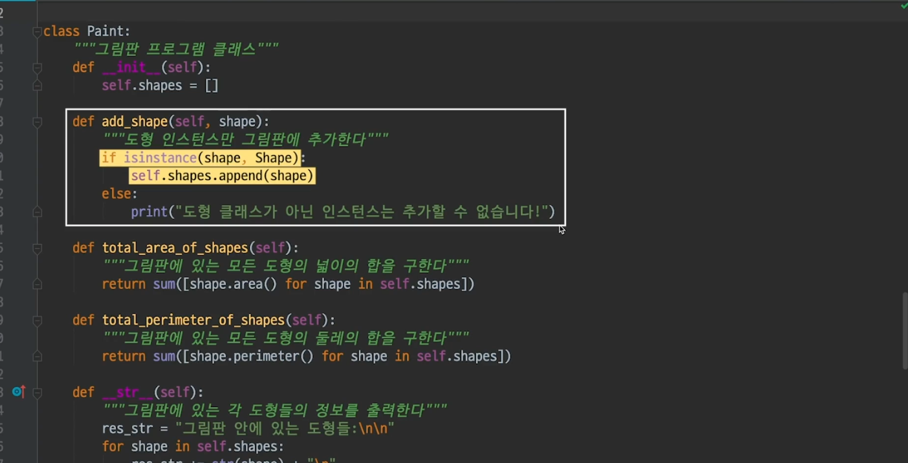

  이렇게 어떤 작업 전에 확인을 거치는 코딩스타일을 **LBYL**이라고 함. 

  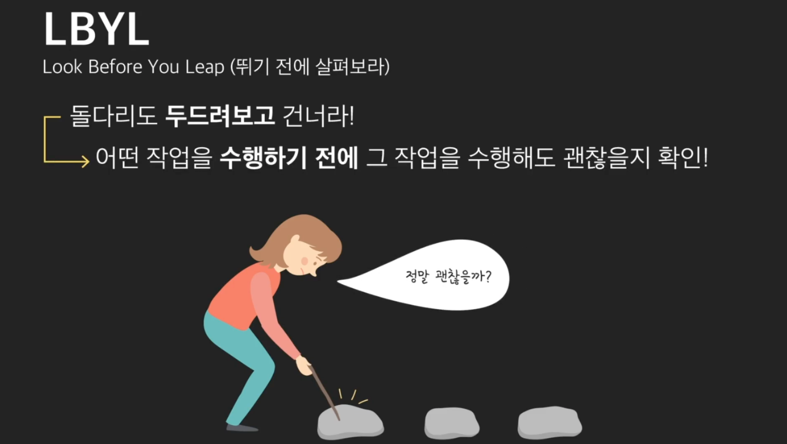

  그리고 파이썬에서는  이 LBYL과 정 반대로 일단 실행하고 보는 EAFP라는 코딩 스타일도 있음. 일단 빨리 실행을 해보고 문제가 생기면 그때 처리하자는 식의 코딩 스타일. 

  

  현재 LBYL스타일로 작성된 코딩스타일을 EAFP스타일로 바꿔보자. 
  타입 힌팅 추가하고, 바로 그냥 Shape확인거치지 않고 append해버림. 주석도 바꿔줌. 

  코드 자체는 깔끔해진 대신, area/perimeter가 없는 객체가 들어올 위험성도 생김. 

  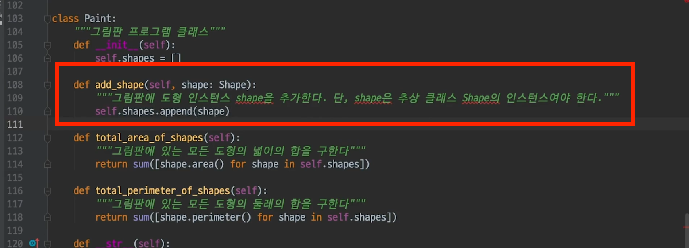

  이런 위험성을 조금 막아주기 위해, `total_area_of_shapes`메소드도 수정 해본다. 돌면서 try, catch 도는거지. 

  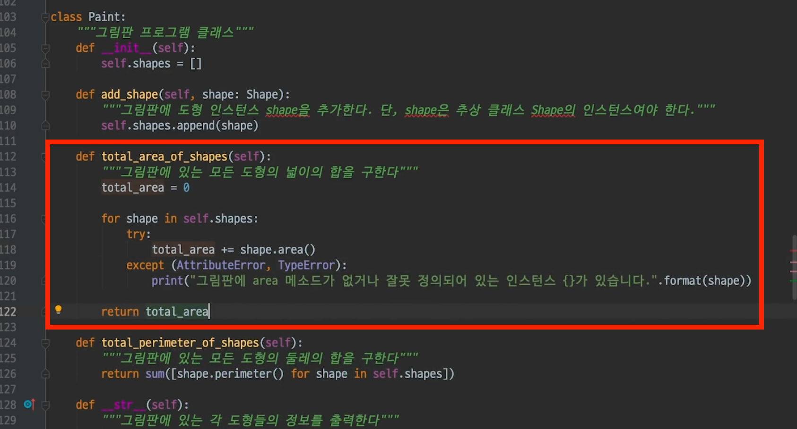

  그리고 `total_perimeter_of_shapes`도 바꿔줘야지 . 

  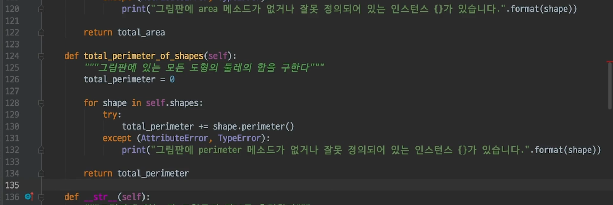

  사실 이런 EAFP스타일이 더 파이썬스러운 스타일. 

  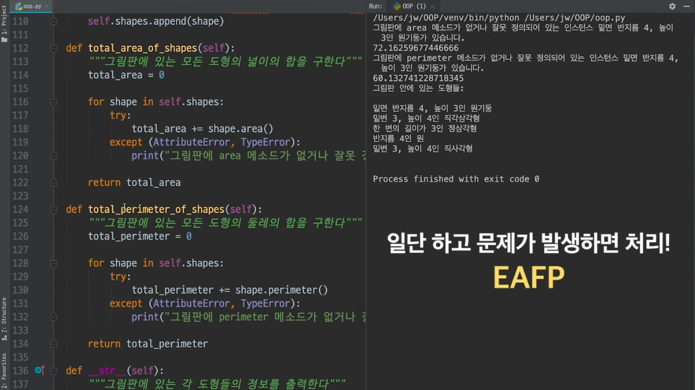