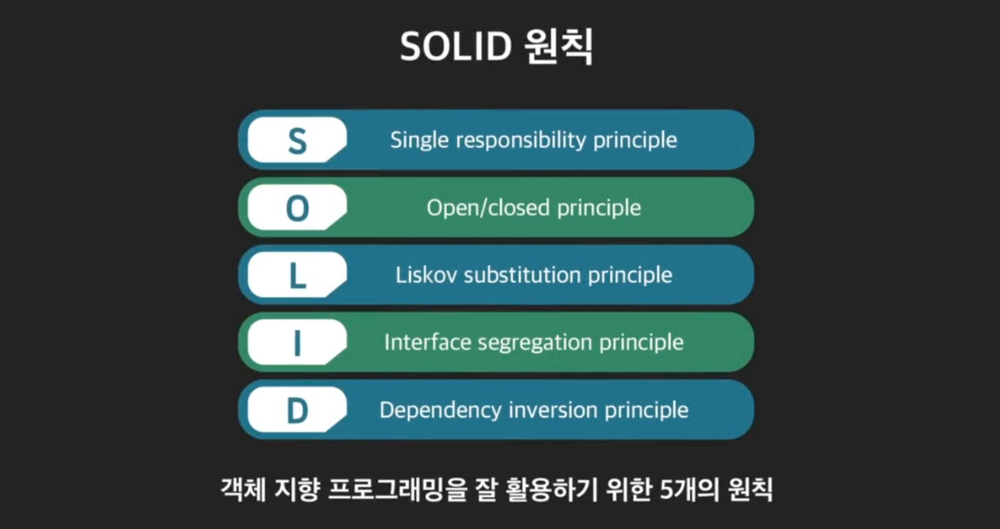
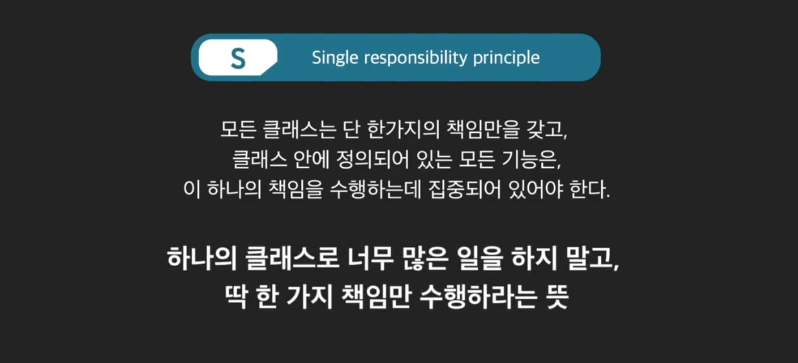
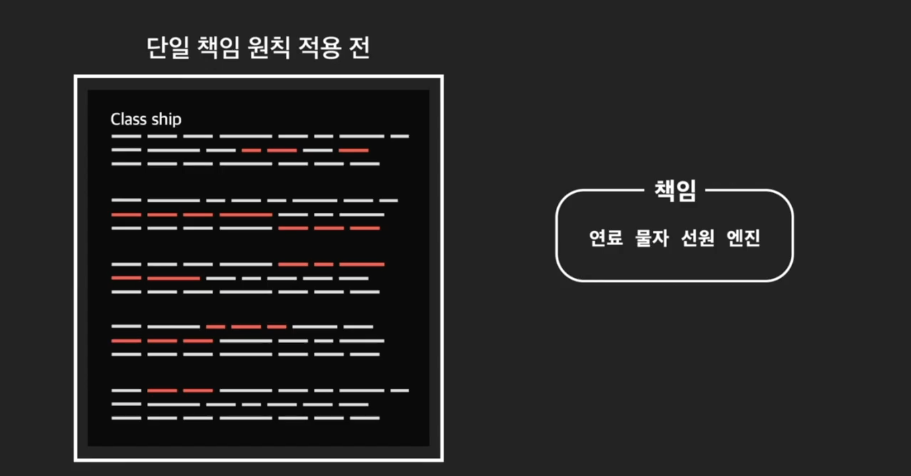
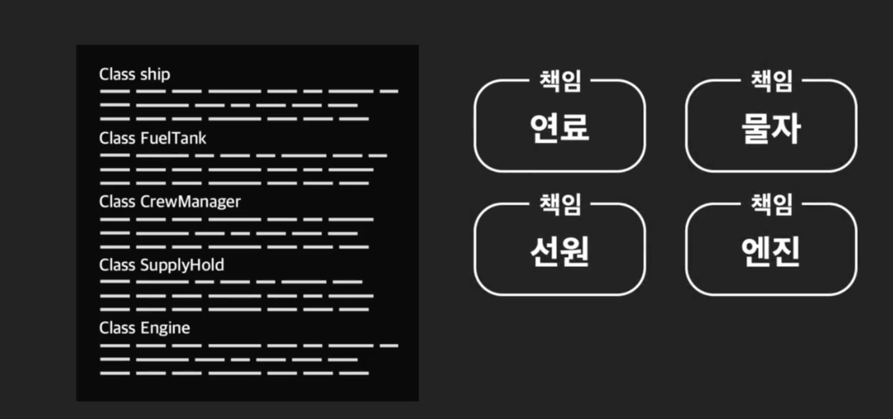
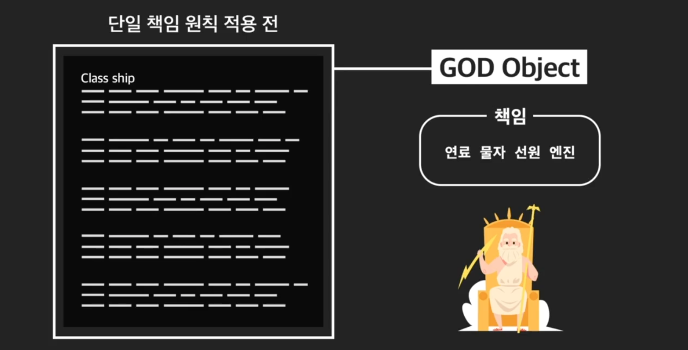
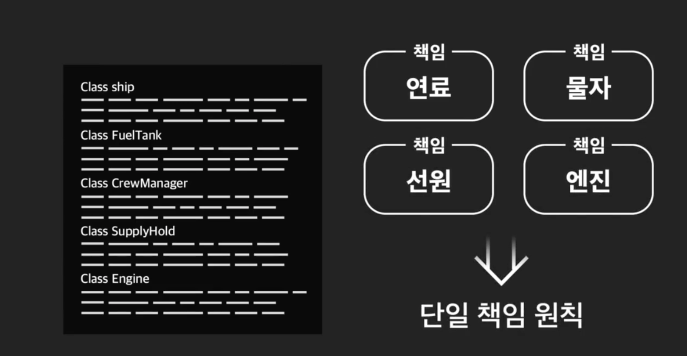
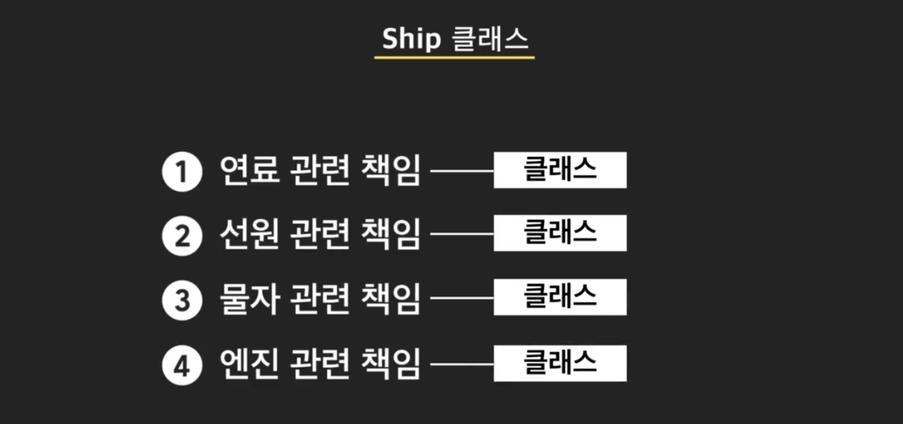
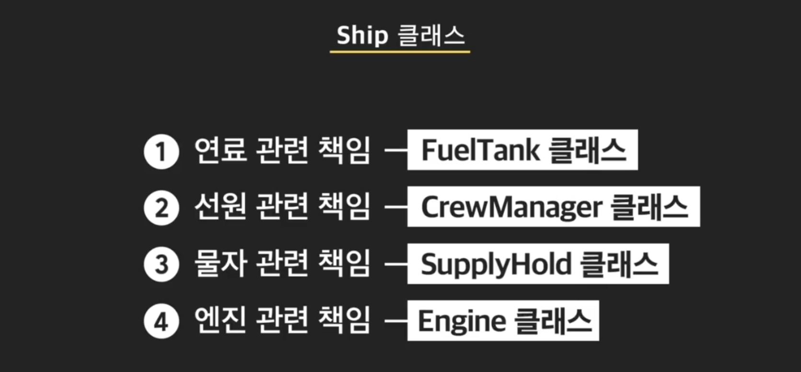
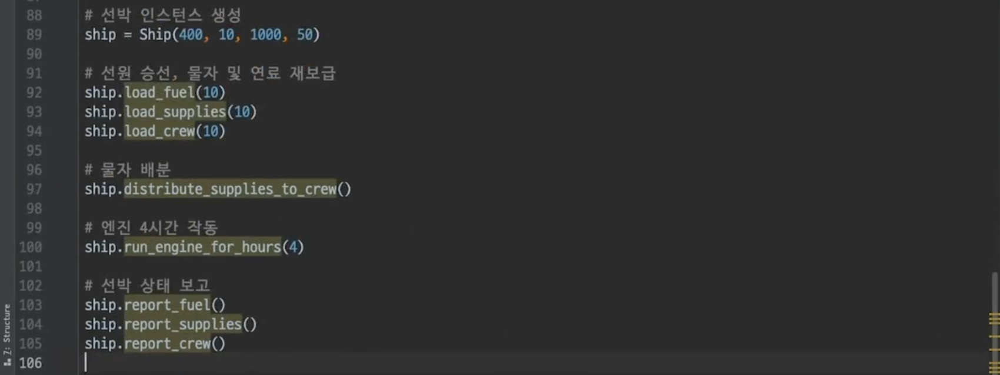
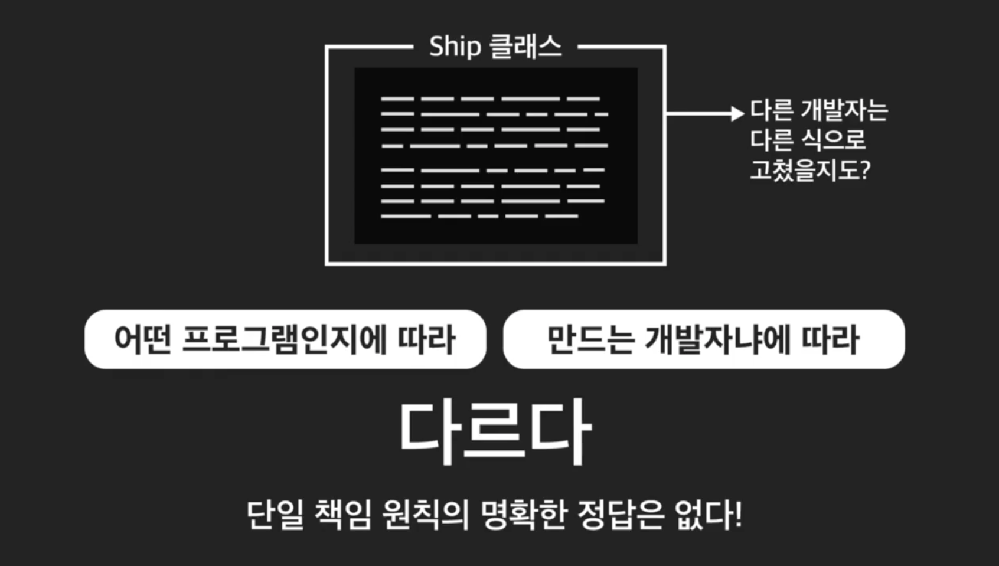

# OOP_5

- #### 견고한 객체지향 프로그래밍을 위한 OOP 원칙 

  객체 지향 프로그래밍을 어떻게 하면 잘할 수 있을지를 배워봅시다. 객체 지향 프로그래밍은 단순히 “객체를 만든다”에서 끝나는 것이 아닙니다. 이를 뛰어넘어 프로그램의 목적에 맞게 객체들을 “어떻게” 디자인(설계)하느냐의 단계까지 고민해야하고 이것을 잘하는 것이 객체 지향 프로그래밍을 잘하는 것입니다. 사실 객체 지향 프로그래밍을 잘하려면 많은 프로그래밍 경험과 고민이 필요합니다. 하지만 일단은 객체 설계의 원칙을 확실히 알아야 합니다.

  우리는 바로 그 원칙인 **SOLID 원칙**들을 공부할 것입니다. 이는 Robert C. Martin이라는 유명 개발자가 2000년도에 처음 소개한 객체 설계의 기본 원칙으로 객체 지향 프로그래밍에서 사실상 표준 규칙처럼 알려져 있습니다. SOLID라는 명칭은 5가지 객체 설계의 원칙의 각 앞글자를 따서 만든 줄임말입니다. 각 원칙을 하나씩 배워가면서 좋은 객체 설계가 무엇인지 생각해봅시다.

  SOLID의 각 원칙

    SOLID는 ‘견고한’이라는 뜻을 갖습니다. SOLID의 모든 원칙들을 지키면 유연하고 유지보수하기 쉬운 ‘견고’한 코드를 쓸 수 있다는 것을 나타냅니다. SOLID라는 단어는 사실 각 원칙의 맨 앞글자를 따서 만들어진 단어입니다. 원칙은 모두 5가지인데요. 하나씩 말씀드리자면

    1. **단일 책임 원칙** (Single Responsibility Principle)

    2. **개방 폐쇄 원칙** (Open-Closed Principle)

    3. **리스코프 치환 원칙** (Liskov Substitution Principle)

    4. **인터페이스 분리 원칙** (Interface Segregation Principle)

    5. **의존 관계 역전 원칙** (Dependency Inversion Principle)

    이 5가지입니다.

  이름이 어려워보인다고 기죽지 마세요, 원칙 하나씩 설명을 들으면 쉽게 이해하실 수 있으니까요.

  **언제나 완벽하게 SOLID를 지키는 코드를 써야 할까?**

  객체 지향 프로그래밍으로 만드는 프로그램의 크기가 커질수록 SOLID 원칙을 잘 지키는 것이 중요해집니다. 아무리 코드가 많은 프로그램이라도 SOLID 원칙을 잘 지키면서 코드를 작성한다면 코드의 복잡성을 최소화하고 코드를 유지보수하기 쉬운 상태로 유지할 수 있습니다. 하지만 작고 간단한 프로그램을 만드는 데 이 원칙을 모두 지키면서 코드를 작성하는 것은 오히려 시간 낭비가 될 수도 있습니다.

  결국 중요한 것은 SOLID 원칙을 따르는 코드, 위반하는 코드가 무엇인지를 알고 각 원칙을 적용했을 때 얻게되는 이점을 깨닫는 것입니다. 즉, 각 원칙이 유도하는 “견고”하고 “좋은” 프로그램의 모습을 인지하는 것이죠. 시간 문제상 모든 원칙을 완벽하게 적용하지는 못하더라도 코드에서 개선해야할 점, 개선하지 않으면 생길 문제들을 파악하고는 있어야 한다는 것입니다.

  **SOLID 유닛 학습 권장법**

  SOLID의 각 원칙을 설명하는 앞으로의 수업에서는 그 내용 특성상 긴 코드들이 자주 등장합니다. 이때문에 영상만 보고 넘어가면 이해가 잘 되지 않는 부분이 생길 수 있어요. 따라서 아래와 같은 방법으로 학습하면 좋을 것 같습니다.

  1. 영상에서 사용하는 코드를 미리 다운받을 수 있도록 해놨습니다. 코드가 첨부되어 있는 경우 이를 미리 다운받아서 읽은 후에 영상을 보시면 이해하는데 훨씬 더 도움이 됩니다.
  2. 영상에서 배운 각 원칙의 내용을 매번 노트로 정리해두었습니다. 영상에서 배운 내용을 노트로 깔끔하게 정리해서 기억할 수 있습니다.

  


- #### 단일 책임 원칙과 God Object

  모든 클래스는 단 한가지의 책임만을 갖고, 클래스 안에 정의되어 있는 모든 기능은, 이 하나의 책임을 수행하는데 집중되어 있어야 한다는 원칙. 즉, 하나의 클래스로 너무 많은 일을 하지 말고 **딱, 하나의 책임만 수행하라는 뜻.** 

  

  그럼 클래스가 하는 일 중 어디까지가 한가지 책임일까?

  

  해당 SOLID 원칙의 창시자의 말을 통해 들어보면, 단일책임원칙은 **같이 수정해야 할 것들은 묶고, 따로 수정해야 하는 것을 분리하는 것** 이라고 했음. 

  프로그램 커졌을때, 뭐 하나 수정하려고 하면 여기 고치고, 저기 고치고 하게 됨. 그러다 보면 누락되기도 하고 실수하기도 함. 

  

  이런 것들을 단일 책임 원칙을 활용해서 막아보자는 것. 하나의 클래스가 하나의 책임만을 수행하면, 나중에 기능을 수정할 때 나오는 여러 문제를 막을 수 있음. 

  

  한번 코드를 봐보자. 

  ```python
  class Ship:
      """배 클래스"""
      def __init__(self, fuel, fuel_per_hour, supplies, num_crew):
          """연료량, 시간당 연료 소비량, 물자량, 선원 수를 인스턴스 변수로 갖는다"""
          self.fuel = fuel
          self.fuel_per_hour = fuel_per_hour
          self.supplies = supplies
          self.num_crew = num_crew
  
      def report_fuel(self):
          """연료량 보고 메소드"""
          print("현재 연료는 {}l 남아 있습니다".format(self.fuel))
  
      def load_fuel(self, amount):
          """연료 충전 메소드"""
          self.fuel += amount
  
      def report_supplies(self):
          """물자량 보고 메소드"""
          print("현재 물자는 {}명분이 남아 있습니다".format(self.supplies))
  
      def load_supplies(self, amount):
          """물자 보급 메소드"""
          self.supplies += amount
  
      def distribute_supplies_to_crew(self):
          """물자 배분 메소드"""
          if self.supplies >= self.num_crew:
              self.supplies -= self.num_crew
              return True
          print("물자가 부족하기 때문에 배분할 수 없습니다")
          return False
  
      def report_crew(self):
          """선원 수 보고 메소드"""
          print("현재 선원 {}명이 있습니다".format(self.num_crew))
  
      def load_crew(self, number):
          """선원 승선 메소드"""
          self.num_crew += number
  
      def run_engine_for_hours(self, hours):
          """엔진 작동 메소드"""
          if self.fuel > self.fuel_per_hour * hours:
              self.fuel -= self.fuel_per_hour * hours
              print("엔진을 {}시간 동안 돌립니다!".format(hours))
          else:
              print("연료가 부족하기 때문에 엔진 작동을 시작할 수 없습니다")
  ```

  Ship클래스를 사용해보자. 

  ```python
  ship = Ship(400, 10, 1000, 50)
  ship.load_fuel(10)
  ship.load_supplies(10)
  ship.load_crew(10)
  ship.distribute_supplies_to_crew()
  ship.run_engine_for_hours(4)
  
  ship.report_crew()
  ship.report_supplies()
  ship.report_crew()
  ```

  그런데 지금 Ship클래스가 너무 커. 변동사항 생길 때 마다, 많은 책임이 들어있는 거대한 배 클래스를 하나 하나 수정해야 함. 코드가 거대하니, 모두 찾기도 힘듬. 

  

  책임 하나하나가 조금 더 작은 클래스에 나뉘어 있었다면 어땠을까?

  

  만약 이랬으면, 연료에 바꾸고 싶은 내용이 있었으면 연료 클래스만 보면 되고. 이렇게 가능하지. 

  현재 Ship 객체처럼, 여러개의 책임을 자신의 속성과 행동으로 직접 수행하는 객체를 God Object라고 한다. 하나의 클래스가 많은 책임을 직접 다 수행하는 것을 비유적으로 신 객체라고 부르는 것. 

  

  **이제 더 쉽게 유지보수 하려면, 클래스를 단일 책임 원칙에 맞게 고쳐가야 겠지.**


- #### 단일 책임 원칙 적용

  현재 Ship클래스는 총 4개의 책임을 가지고 있음. 이 각각에 맞게 책임을 만들면, 단일 책임원칙에 맞게 만들 수 있음. 

  

  

  코드 엄청 신기하네

  ```python
  class Ship:
      """배 클래스"""
      def __init__(self, fuel, fuel_per_hour, supplies, num_crew):
          self.fuel_tank = FuelTank(fuel)
          self.crew_manager = CrewManager(num_crew)
          self.supply_hold = SupplyHold(supplies, self.crew_manager)
          self.engine = Engine(self.fuel_tank, fuel_per_hour)
  
  
  class FuelTank:
      """연료 탱크 클래스"""
      def __init__(self, fuel):
          """연료 탱크에 저장된 연료량을 인스턴스 변수로 갖는다"""
          self.fuel = fuel
  
      def load_fuel(self, amount):
          """연료 충전 메소드"""
          self.fuel += amount
  
      def use_fuel(self, amount):
          """연료 사용 메소드"""
          if self.fuel - amount >= 0:
              self.fuel -= amount
              return True
          print("연료가 부족합니다!")
          return False
  
      def report_fuel(self):
          """연료량 보고 메소드"""
          print("현재 연료는 {}l 남아 있습니다".format(self.fuel))
  
  
  class Engine:
      """엔진 클래스"""
      def __init__(self, fuel_tank, fuel_per_hour):
          """연료 탱크 인스턴스와 시간당 연료 소비량을 인스턴스 변수로 갖는다"""
          self.fuel_tank = fuel_tank
          self.fuel_per_hour = fuel_per_hour
  
      def run_for_hours(self, hours):
          """엔진 작동 메소드, 연료 탱크 인스턴스를 사용한다"""
          if self.fuel_tank.use_fuel(self.fuel_per_hour * hours):
              print("엔진을 {}시간 동안 돌립니다!".format(hours))
              return True
          print("연료가 부족하기 때문에 엔진 작동을 시작할 수 없습니다")
          return False
  
  
  class CrewManager:
      """선원 관리 클래스"""
      def __init__(self, num_crew):
          """승선한 선원 수를 인스턴스 변수로 갖는다"""
          self.num_crew = num_crew
  
      def load_crew(self, number):
          """선원 승선 메소드"""
          self.num_crew += number
  
      def report_crew(self):
          """선원 수 보고 메소드"""
          print("현재 선원 {}명이 있습니다".format(self.num_crew))
  
  
  class SupplyHold:
      """물자 창고 클래스"""
      def __init__(self, supplies, crew_manager):
          """물자량과 선원 관리 인스턴스를 인스턴스 변수로 갖는다"""
          self.supplies = supplies
          self.crew_manager = crew_manager
  
      def load_supplies(self, amount):
          """물자 충전 메소드"""
          self.supplies += amount
  
      def distribute_supplies_to_crew(self):
          """물자 배분 메소드, 각 선원들에게 동일한 양의 물자를 배분한다"""
          if self.supplies >= self.crew_manager.num_crew:
              self.supplies -= self.crew_manager.num_crew
              return True
          print("물자가 부족하기 때문에 배분할 수 없습니다")
          return False
  
      def report_supplies(self):
          """물자량 보고 메소드"""
          print("현재 물자는 {}명분이 남아 있습니다".format(self.supplies))
  ```

  각 책임마다 새로운 클래스를 만들었음. 

- #### 단일 책임 원칙 적용 2

  아래는 책임이 분리되기전, Ship 클래스를 사용하던 방식. 

  

  ```python
  ship = Ship(400, 10, 1000, 50)
  ship.fuel_tank.load_fuel(10)
  ship.supply_hold.load_supplies(10)
  ship.crew_manager.load_crew(10)
  ship.supply_hold.distribute_supplies_to_crew()
  ship.engine.run_engine_for_hours(4)
  
  ship.fuel_tank.report_crew()
  ship.supply_hold.report_supplies()
  ship.crew_manager.report_crew()
  ```

  분리된 후에는 Ship 클래스가 동작을 직접 하지 않음. 관련된 다른 동작을 통해 하게 됨. 


- #### 단일 책임 원칙 적용 3

  실제로 Ship에서 단일책임원칙 적용 전은 50줄, 적용 후는 80줄 정도임. 총 코드의 길이는 더 길어졌지만, 클래스 하나의 길이는 평균적으로 짧아짐. 전체 코드 양은 늘어나더라도, 클래스 하나의 길이는 짧은게 좋음. 그래야 클래스의 의미를 파악하고 이해하기가 쉽고, 고치기도 쉬움. 

  어떤 클래스만 딱 보고, 이게 단일 책임 원칙을 적용한건지 판단하는것은 매우 어려움. 개발자에 따라 생각이 다르기 때문. 

  

  위 코드도 다른 개발자였으면 다른 방식으로 고쳤을 수도 있음. 정답은 없음. 

  

  **중요한것은 내가 코드를 작성하면서, 단일책임원칙을 지키고 있는지 신경쓰는 것.** 항상 의심해 보고 더 좋은 코드는 없는지 고민해 봐야 함.  

  단일 책임 원칙을 지키지 않아도, 처음에는 별 문제가 없을 수 있음. 그러나, 프로그램이 커질수록 그 때문에 코드 수정이 점점 엄청 어려워짐. **나중에 가서도 수정하기 편한 코드를 만드는 것이 개발자의 실력**. 

  

- #### 단일 책임 원칙 정리 노트

  이번 챕터에서 배운 **단일 책임 원칙**(Single Responsibility Principle)을 정리해볼게요.

  단일 책임 원칙의 정의는,

  "모든 클래스는 **단 한 가지의 책임**만을 갖고, 클래스 안에 정의되어 있는 모든 기능은, 이 하나의 책임을 수행하는데 집중되어 있어야 한다."

  입니다. 간단히 말해서, 하나의 클래스로 너무 많은 일을 하지 말고, 딱 한 가지 책임만 수행하라는 뜻입니다.

  물론 어디까지가 한 가지 책임이라고 할 수 있는지는, 사람들마다 생각이 다르고, 상황에 따라서도 다릅니다.

  SOLID 원칙을 만든 개발자, Robert C. Martin은  “단일 책임 원칙은 같이 수정해야될 것들은 **묶고**, 따로 수정해야될 것들은 **분리**하는 것”이라고 했습니다.

  그러니까 서로 관련있는 내용들을 적절한 크기의 한 클래스로 만들라는 뜻입니다. 프로그램의 유지 보수 차원에서 말하자면 **한 클래스**는 **한가지 책임에 관한 변경사항이 생겼을 때**만 코드를 수정하게 되는 구조가 좋은 구조라는 뜻이구요.

  사실 어떤 클래스를 보고, 그 클래스가 단일 책임 원칙을 지켰는지를 판단하는 건 쉽지 않습니다. 어떤 프로그램을 만들고 있는지에 따라, 개발자에 따라 그 생각은 다르기 때문입니다. 중요한 것은 코드를 작성할 때, 내가 단일 책임 원칙을 지키고 있는지 신경쓰는 것입니다.  클래스를 작성할 때마다, 이 클래스가 너무 많은 책임을 갖고 있는 건 아닌지 항상 의심해야 합니다.   하나의 클래스 안에 여러 클래스로 분리할 수 있을 것 같은 변수와 메소드들이 많다면, 그 클래스는 지금 단일 책임 원칙을 어기고 있을 가능성이 높습니다.

  단일 책임 원칙을 지키지 않아도 처음에는 별 문제가 없을 수 있습니다. 하지만 프로그램의 크기가 커질수록 단일 책임 원칙을 지키지 않은 것 때문에 코드를 수정하기가 점점 힘들어지는 걸 발견하게 되실 겁니다. 그러니까 항상 수정하기 편한 상태의 코드를 유지하고 싶다면, 이번 챕터에서 배운 ‘단일 책임 원칙’을 늘 기억하세요.