# SQL로 하는 데이터분석

## 데이터베이스 기본 개념


- #### 데이터베이스와 테이블

  **데이터베이스란** 일정한 체계 속에 저장된 데이터의 집합을 의미함. 데이터는 보통 데이터베이스 안에서 테이블이라는 단위로 저장됨. 테이블은 **표**. 아래처럼 표 형태로 저장된 데이터의 집합을 테이블 이라고 말함. 

  

  보통 하나의 데이터베이스에는 여러개의 테이블이 존재할 수 있음. 아래처럼 관련있는 정보들을 하나의 테이블에 저장하고, 여러 테이블들을 두고 관리하게 되면 많은 데이터를 체계적으로 저장할 수 있음. 

  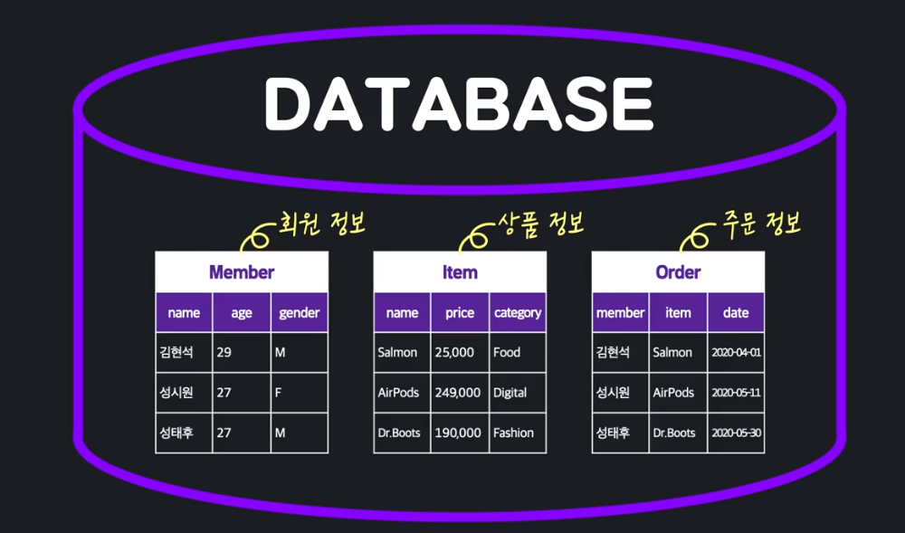

  데이터베이스 자체도 여러개를 만들게 된다면, 이 또한 아무리 방대한 데이터여도 체계적으로 저장이 가능함. 

  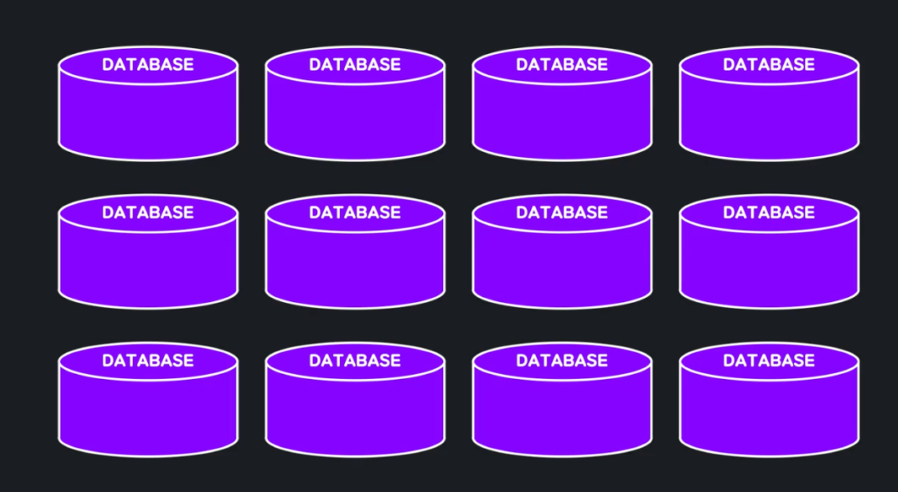

- #### **테이블의 row와 column**

  데이터베이스 안에서 데이터가 저장되는 기본 단위가 **테이블**. 테이블이란 *표 형식로 저장된 데이터의 집합*. 

  아래는 테이블의 예시. 그런데 테이블에 대해서 꼭 알아야 하는 용어가 있음. 

  아래 테이블을 보면, 각 한줄이 학생 한명을 나타냄. 이렇게 각각의 개체를 나타내는 단위를 row라고 함. 

  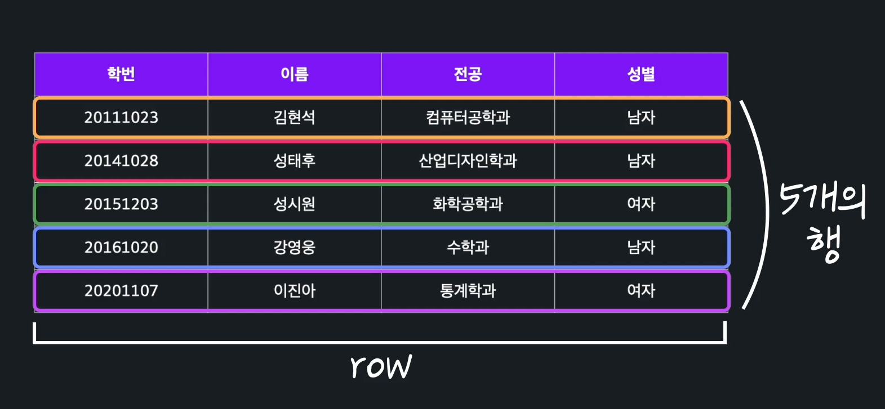

  그리고, 학번/이름/전공/성별 처럼 학생이 갖는 속성 하나하나를 column이라고 함. 

  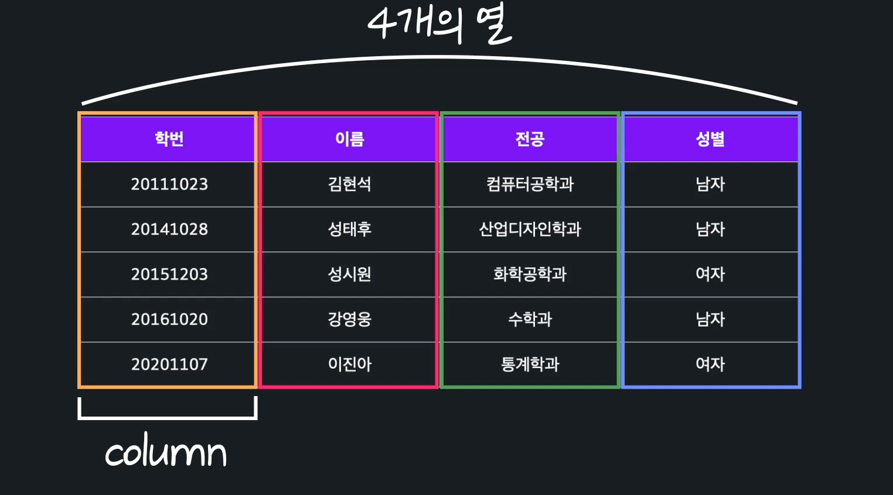


- #### DBMS와 SQL

  데이터베이스는 어떻게 사용할 수 있을까? 데이터베이스를 사용하려면 **DBMS**라는 프로그램이 필요하다. 

  

  사용자는 아래와 같은 방식으로 DBMS를 사용해서 데이터베이스를 관리할 수 있음. 사용자의 명령을 받아서 DBMS는 그 명령에 따라 데이터베이스를 새로 만들기도 하고, 삭제하거나 수정하기도 함. 

  우리가 데이터베이스에서 데이터를 조회한다, 삭제한다 이런 얘기를 할 때는 다 DBMS를 사용해서 하겠다는 것을 의미함. 

  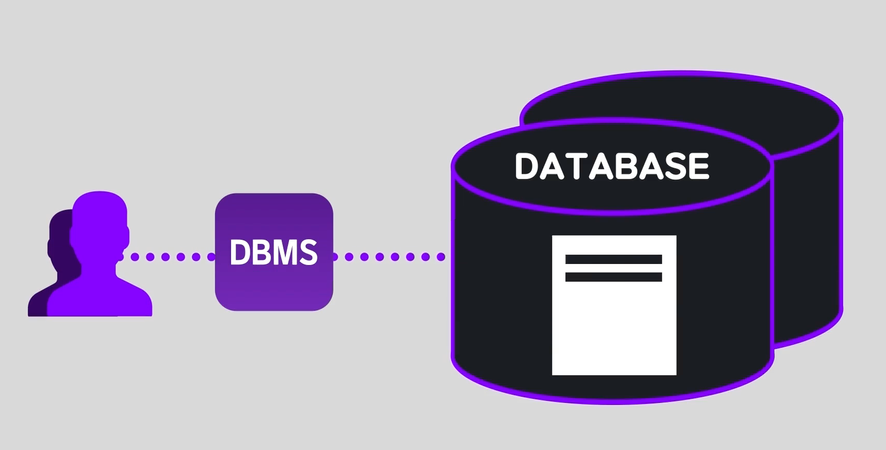

  DBMS에도 다양한 종류가 있다. 각 DBMS 마다 각각 특징을 가지고 있기 때문에, 사용자는 각자의 상황에 따라 알맞은 DBMS를 사용하면 됨. 데이터베이스를 구축한다는 것도, 무슨 데이터베이스를 사용할지 선택하는 것 부터 시작함. 

  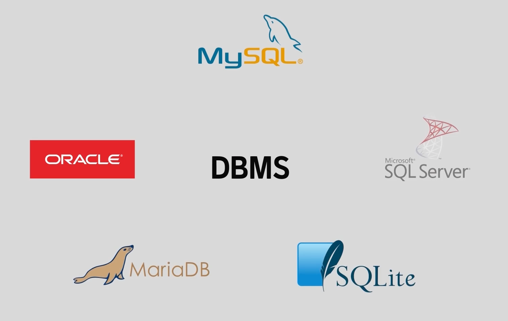

  그런데 종류가 이렇게 많은데 새로운 것 사용할때마다 새로운 것을 배워야 하는가? 사실 모든 DBMS는 SQL이라는 것으로 명령을 내림. SQL은 "***DBMS**에 명령을 내리기 위해 사용하는 언어*". 

  SQL은 국제 표준이 있어서, 그것만 배우면 어떤 DBMS도 다 사용할 수 있음. 다만, 모든 DBMS가 이 표준을 완벽하게 지키는 것은 아니겠지. DBMS마다 표준과 살짝 다른 방식으로 명령어를 써야 하거나, 표준에 아예 없는 SQL문들을 쓰는 경우도 있음. 하지만, 대부분의 주요 구문들은 다 DBMS마다 차이가 없음. 

- #### SQL 국제 표준과 MySQL

  이전 영상에서 데이터베이스를 다루기 위해서는

  (1) **DBMS**라는 프로그램을 사용해야하고,

  (2) **DBMS**는 결국 **SQL**이라고 하는 언어로 조작해야 한다고 했습니다.

  이 SQL이 무엇인지 좀더 자세히 알아보겠습니다.

  **1. SQL의 역사**

  1970년대 초, IBM이라고 하는 컴퓨터 회사는 System/R이라는 DBMS와, 이것을 사용하기 위해 필요한 언어인 SEQUEL을 만들었습니다. SEQUEL은 Structured English Query Language의 줄임말이었는데요. SEQUEL은 '씨퀄'이라고 발음되었습니다. 그런데 SEQUEL은 그 단어가 이미 다른 곳에서 사용되고 있다는 문제(상표권 문제) 때문에 그 이름이 SQL(Structured Query Language)로 변경되었습니다. 이런 역사 때문에 아직도 SQL을 보고 ‘씨퀄’이라고 발음하는 분들도 있는데요. 그것보다는 ‘에스큐엘’이라고 정확하게 발음하는 것이 좋습니다. 

  SQL은 그 뒤로 IBM, 오라클이라고 하는 회사 등에 의해 제각각 발전하기 시작했습니다. 그러다가 1987년, 국제 표준화 기구(ISO)에서 [SQL에 관한 국제 표준(](https://www.iso.org/standard/16661.html)[ISO 9075:1987)](https://www.iso.org/standard/16661.html)이 제정되었습니다. 그 뒤로 해당 표준은 기존 내용이 개정되고, 새로운 내용들이 추가됨으로써 발전해갔고, 2020년 6월 기준으로 현재는 2019년 개정안이 최신입니다.

  정리하면 현재 SQL은 공인된 국제 표준이 있습니다. 하지만 우리가 실제로 사용하는 SQL은 이 국제 표준에 완벽히 부합하지는 않습니다. 이게 무슨 말일까요? *그것은 바로 Oracle, Microsoft SQL Server, MySQL 등의 DBMS에서 지원되는 SQL이 표준을 완벽히 준수하지는 않는다는 뜻입니다.*

  각 DBMS의 SQL들은 SQL 국제 표준을 일부 준수하기는 하지만, 그 준수 정도가 각각 다릅니다.

  예를 들어, 각 DBMS들은

  (1) 표준에 있는 기능을 지원하지 않거나

  (2) 표준에 있는 기능이더라도 다른 표현법을 사용하거나

  (3) 표준에는 없는 기능을 지원하는

  등의 방식으로 표준을 조금씩 어기고 있고, 그 모습도 DBMS마다 다른데요.

  사람의 언어에 비유하자면, SQL 국제 표준이라는 '**표준어**'가 존재한다면 실제로 각 DBMS가 지원하는 SQL은 '**사투리**'처럼 조금씩 차이가 있는 것이죠.

  왜 이런 현상이 발생한 걸까요?

  그 이유는 다양하지만 *일단 많은 DBMS 회사들이 '성능 향상'과 '더 다양한 기능 제공'을 위해서, 차라리 표준을 일부 벗어나는 것을 택하는 경우가 많기 때문입니다.* 그리고 DBMS에 관한 모든 사안에 대해서 표준에 기재되어 있는 것도 아니기 때문에, 그런 부분들에 있어서 DBMS마다 차이가 발생하기도 하구요.

  그래서 SQL을 배울 때는 본인이 사용할 DBMS의 SQL을 바로 공부하는 것이 가장 정확하고 빠른 길입니다.

  하지만 너무 실망하지 마세요. SQL마다 조금씩 차이가 있더라도 서로 비슷한 부분이 훨씬 더 많기 때문에, 일단 한 DBMS의 SQL만 제대로 배워두면, 다른 DBMS의 SQL을 배우는 것은 어렵지 않습니다.

  저희는 이번 토픽에서 MySQL이라는 DBMS의 SQL을 배울 겁니다. 만약 여러분이 사용하는 DBMS가 MySQL이 아니라고 해도, 이 토픽의 내용을 열심히 듣고 나면 다른 DBMS도 금방 사용할 수 있을 겁니다.

  이번에 배우는 SQL문 중 대부분은 다른 DBMS에서도 수정 없이 바로 사용할 수 있을 뿐만 아니라,

  혹시라도 이 토픽의 내용대로 SQL 문을 썼는데 원하는 결과가 나오지 않더라도, 해당 DBMS에서 같은 기능을 구현하는 다른 표현법을 검색하면 되기 때문입니다. 중요한 건 SQL을 쓸 때 필요한 개념과 원리를 이해하는 것입니다.

  자, 다음으로는 우리가 사용할 DBMS인 **MySQL**에 대해서 간단히 살펴볼게요.

  **2. MySQL이란?**

  MySQL이라는 DBMS에 대해 알아보겠습니다.

  MySQL은 현재 페이스북, 유튜브 등을 비롯한 유명한 서비스에서도 활발히 사용되고 있는 DBMS입니다. 

  MySQL은 가장 처음 MySQL AB라고 하는 스웨덴 회사에서 개발되었습니다. 그 뒤로 MySQL AB는 2008년, Sun Microsystems라는 회사에 인수되었는데요.

  Sun Microsystems는 지금 IT 분야에서 아주 중요한 프로그래밍 언어인 자바(Java)를 개발한 회사입니다. 그리고 유닉스 계열의 솔라리스(Solaris)라고 하는 운영 체제를 만들기도 한 회사입니다. 

  2010년에 Sun Microsystems는 Oracle이라는 회사에 인수되었고, 이에 따라 자연스럽게 MySQL 또한 Oracle의 소유가 되었습니다. 

  그럼 Oracle은 어떤 회사일까요? IT 분야에서 일하는 사람이라면 이 회사의 이름을 한번쯤은 들어봤을 텐데요. Oracle은 회사명과 같은, 오라클이라는 DBMS를 서비스하고 있는 회사로, 오라클은 현재 기업용 데이터베이스 시장에서 압도적인 영향력을 발휘하고 있는 DBMS입니다.

  Oracle은 저작권을 매우 중요시하고, 기술을 상업화해서 이윤을 창출하는 능력으로도 유명한 회사입니다. Oracle은 구글이 자사의 자바 API를 무단으로 베껴서 안드로이드를 만들었고 이것은 '저작권 위반'이라고 주장하며 소송을 제기하기도 했죠. 사실 Sun Microsystems가 Oracle에 인수될 때, 많은 사람들이 Oracle이 자사의 DBMS인 오라클의 영향력을 더 넓히기 위해 MySQL을 시장에서 퇴출시키지 않을까하는 걱정을 하기도 했습니다. 그래서 MySQL을 만들었던 초기 개발자들은 회사에서 나와 MariaDB라고 하는 오픈소스 프로젝트를 시작하기도 했죠. 이 MariaDB 또한 오늘날 인기가 많은 DBMS 중 하나입니다.

  다행히도 MySQL은 아직 오픈 소스 소프트웨어로 누구나 자유롭게 사용할 수 있습니다. 그리고 [그 소스코드를 살펴볼 수도 있죠.](https://github.com/mysql) 그런데 MySQL의 특이한 점은 Oracle의 상업용 라이센스로도 제공된다는 점입니다. 보통의 경우에는 MySQL을 오픈 소스 소프트웨어로 생각하고 별다른 제한 없이 사용해도 되지만, 만약 오라클에서 제공하는 MySQL에 관한 추가 서비스, 상시 기술 지원 등을 원한다면 상업용 라이센스를 사야합니다. 이 뿐만 아니라

  - 만약 MySQL의 소스 코드를 가져다가 일부를 수정하고 
  - 자신의 제품의 일부로 만들어서 재배포하는 상황에서
  - 그 소스코드를 공개하지 않으려는 기업이 있다면 

  이 경우에도 상업용 라이센스가 필요하구요. 관련 내용이 궁금하신 분은 [이 링크](https://www.mysql.com/about/legal/licensing/oem/)를 참조하세요.

  Oracle은 자사의 기존 DBMS인 오라클과 기업 인수를 통해 얻게 된 MySQL을 둘다 잘 서비스하고 있습니다. 알려진 바에 따르면, 오라클과 MySQL 둘다 기술적으로 장단점이 다르고, 어떤 면에서는 상호보완적인 관계의 DBMS이기 때문에 Oracle에서 둘다 잘 관리해나갈 것으로 보인다는 이야기가 많습니다. 

  실제로 두 DBMS의 시장에서의 쓰임새를 보면 약간의 차이가 있습니다. 은행, 거래소 등과 같이 데이터 처리의 정확성, 운영의 안정성 등이 엄격하게 요구되는 분야에서는 오라클이 주로 사용되고 있고, 우리가 흔히 쓰는 앱, 웹 사이트 같은 서비스를 만들 때는 MySQL을 쓰는 경우가 많습니다. 이는 아무래도 오라클이 애초에 신뢰도가 중요한 비즈니스 분야에 적합하게 설계되어 있고, 해당 영역에서의 역사도 길기 때문입니다. 대신 MySQL은 무료로 사용할 수 있고 좀더 가볍다는 점이 장점이죠. 

  MySQL은 여러 DBMS 중에서도 특히 일반 사용자가 사용하기 편하다는 평가를 받습니다. 그리고 간단히 사용해볼 때 요구하는 컴퓨터 성능도 작은 편이라 부담이 덜하구요. 게다가 IT 세계에서는 LAMP(Linux + Apache + MySQL + PHP/Perl/Python)라고 하는 개발 플랫폼의 조합이 이미 관용어가 됐을 정도로, 많은 개발자들이 보편적으로 쓰는 DBMS이기도 합니다.

  이런 이유때문에 이번 토픽에서 사용할 DBMS로 MySQL을 선정했습니다. 위에서 말한 것처럼 이 MySQL에서 쓰이는 SQL과 그것을 사용하기 위해 필요한 개념들을 잘 익혀두면, 나중에 다른 DBMS에서 쓰일 SQL도 쉽게 배울 수 있습니다. 

  그럼 이제 마음을 가다듬고 SQL 공부를 시작해봅시다!

- ####  DBMS와 서버-클라이언트 구조

  자, 이제 DBMS가 뭔지, SQL이 뭔지 감이 오시나요?

  이전 노트에서 말한대로 우리는 MySQL이라는 DBMS를 사용할 건데요. 우리는 곧 MySQL을 직접 설치해볼 겁니다. 

  그런데 그 전에 알아야할 한 가지 사실이 있습니다.

  우리는 데이터베이스를 관리할 때 DBMS가 필요하다는 사실을 배웠습니다. 아래 화면 기억나시죠? 

  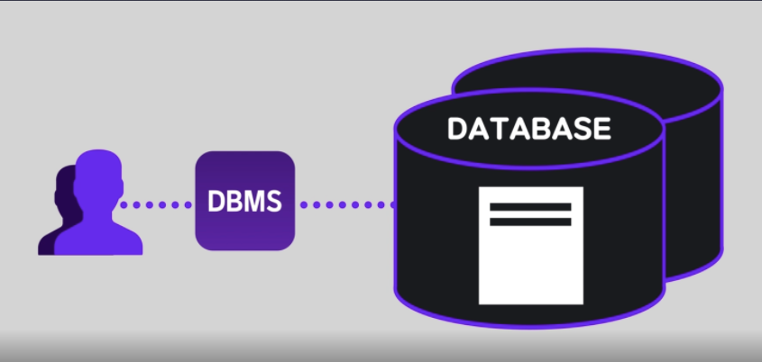

  그런데 **DBMS에는 주요 구성 요소인 두 종류의 프로그램**이 있습니다. DBMS 내부를 좀더 자세히 들여다볼까요?

  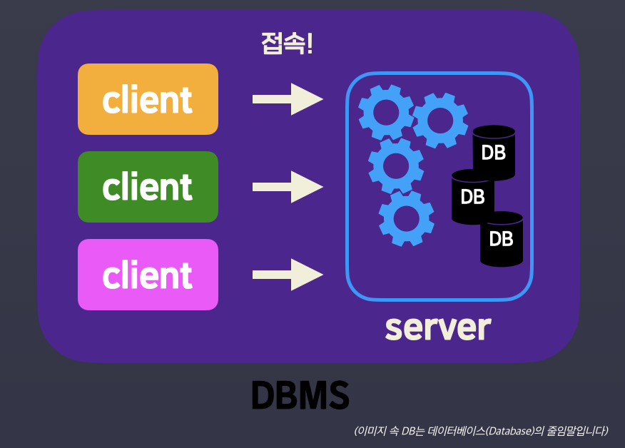

  위 그림에서 왼쪽에 **client**라고 쓰인 부분 보이죠? 그리고 오른쪽에는 **server**라고 쓰인 부분이 보이네요. client와 server의 의미는 다음과 같습니다. 

  **(1) client(클라이언트 프로그램)** : 사용자가 server에 접속해서 원하는 데이터베이스 관련 작업을 할 수 있도록, SQL을 입력할 수 있는 화면 등을 제공하는 프로그램

  **(2) server(서버 프로그램)** : client로부터 SQL 문 등을 전달받아 데이터베이스 관련 작업을 직접 처리하는 프로그램

  (DBMS라고 할 때, 좁은 의미로 이 server 부분만을 가리키는 경우도 있습니다)

  위 그림에는 여러 client들이 server에 접속하는 모습이 보이는데요. **대부분의 DBMS가 이런 식으로 client를 통해 server에 접속하는 구조로 되어 있습니다.**

  그리고 자세히 보면 ***server 안에 DB(데이터베이스)가 포함돼있죠?*** 이전 영상에서 말했듯이 사실 데이터베이스는 DBMS와 분리된 것이 아니라, 이렇게 server가 직접 저장하고 관리하는 데이터의 집합인 겁니다. 

  이 그림에 나타난 DBMS의 전체적인 구조를 알고 있어야, 이후에 DBMS를 설치할 때, DBMS를 사용할 때 불필요한 혼란을 줄일 수 있는데요.

  결국 **DBMS를 사용한다는 것은,** 

  **실행되고 있는 server에 client를 이용해서 접속한 후, 원하는 명령을 내린다는 뜻**입니다. 

  우리가 사용할 DBMS인 MySQL의 서버 - 클라이언트 구조를 간단히 설명해볼게요. 

  MySQL에서 서버 프로그램의 이름은 ‘**mysqld**’입니다. 이 프로그램이 실행되고 있을 때 사용자가 클라이언트 프로그램을 사용해서 접속하면 되는 건데요. 

  MySQL의 클라이언트 프로그램 이름은 ‘**mysql**’입니다. 서버 프로그램과 이름이 비슷하죠?

  mysql은 보통 CLI 환경에서 사용하는데요.

  (혹시 CLI 환경이라는 단어를 처음 들어보신 분들은 꼭 [이 영상](https://www.codeit.kr/learn/courses/unix-command-line/2669)을 다 보고 넘어가세요.)

  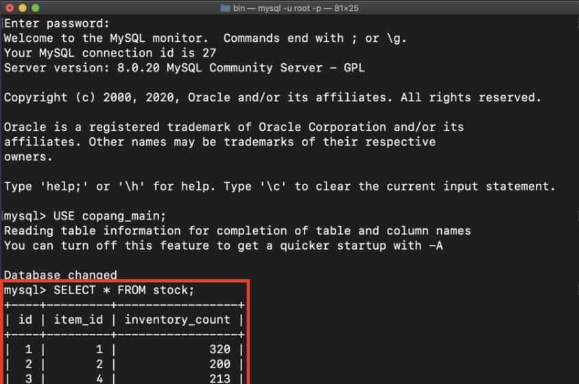

  위 이미지는 CLI 환경에서 mysql(client)을 사용해서 server에 접속한 후, 데이터베이스 관련 작업을 하는 모습입니다.

  그런데 mysql을 이렇게 CLI 환경에서 사용하는 것은 아무래도 좀 불편하기도 하고, 개발자가 될 사람이 아니면 굳이 몰라도 되는 부분입니다. 

  CLI 환경이 아니라 GUI 환경에서 mysql을 사용하는 것도 가능한데요. mysql을 GUI 환경에서 사용할 수 있도록 해주는 프로그램을 사용하면 됩니다. 그런 프로그램에는 여러가지가 있는데요. 그 중에서도 Oracle이 공식적으로 제공하는 **MySQL Workbench**라는 좋은 프로그램이 있습니다. 아래 이미지를 보세요.

  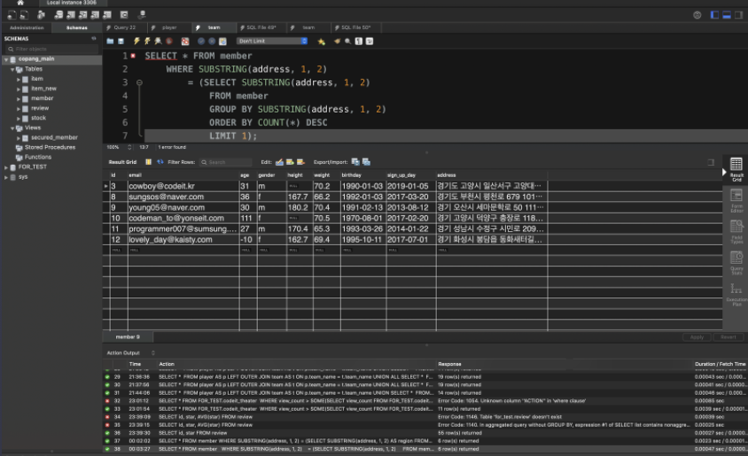

  위 이미지는 **MySQL Workbench**를 사용해서 server에 접속한 후, 원하는 데이터베이스 관련 작업을 하는 모습입니다.

  **이번 토픽에서 우리가 사용할 것도 바로 이 MySQL Workbench입니다.** 방금 전에 말했듯이, MySQL Workbench를 사용하면 CLI 환경이 아닌 GUI 환경에서 server에 접속해서 데이터베이스 관련 작업을 할 수 있습니다.

  자, 이제 DBMS 내부가 정확히 어떤 구조로 이루어져있는지, DBMS를 사용할 때 ‘접속’이라는 개념이 왜 필요한지 감이 오시나요? 

  다음 노트들에서는

  - MySQL 설치
  - MySQL Workbench 설치

  를 하고, 

  - MySQL Workbench로 서버 프로그램(mysqld)에 접속하는 방법까지 배워보겠습니다. 

  DBMS의 구조는 여러분이 앞으로 어떤 DBMS를 다루든 꼭 숙지하고 있어야 하는 내용이니까 잊지마세요! 


- MySQL과  MySQL WorkBench설치하기

  [MqSQL설치]: https://dev.mysql.com/downloads/mysql/
  [MqSQL WorkBench]: https://dev.mysql.com/downloads/workbench/

- MySQL 서버 접속

  1> 먼저 MySQL 서버를 실행해볼게요. 맥의 시스템 환경 설정을 실행하세요. 

  

  

  2> MySQL을 제대로 설치했다면, 환경설정 창 가장 하단에 MySQL이라는 아이콘을 볼 수 있을 겁니다. MySQL 아이콘을 더블 클릭하세요. 

  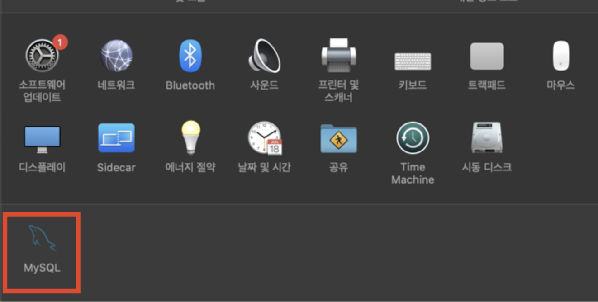

   

  3> 그럼 MySQL 서버를 관리할 수 있는 창이 뜹니다. 지금 보면 **Start MySQL Server**라고 써있는 버튼이 보이죠? 이 버튼으로 MySQL 서버를 실행할 수 있습니다. 만약 맥을 켤 때마다 항상 자동으로 MySQL 서버를 실행하고 싶다면 그 아래의 체크를 그대로 두세요. 반대로 매번 지금처럼 수동으로 MySQL 서버를 실행하고 싶으면 체크를 해제하면 됩니다.

   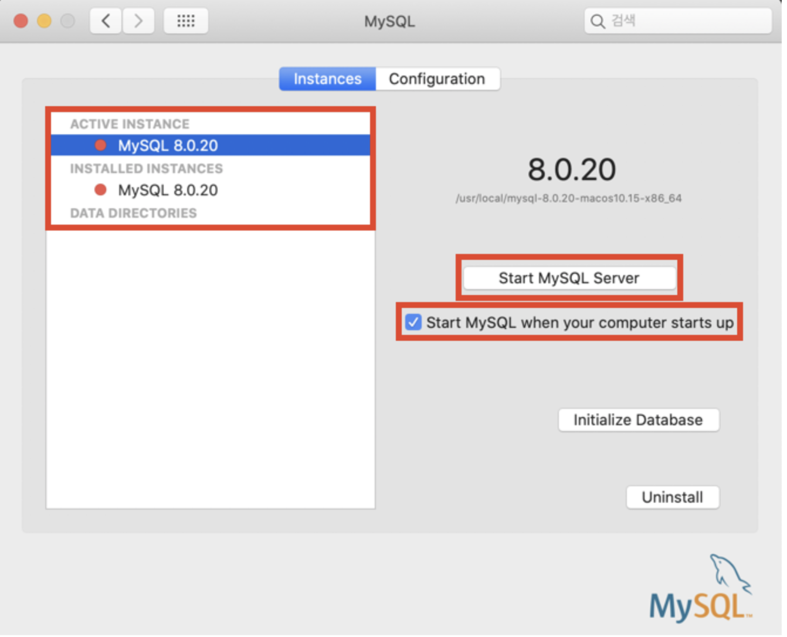

  

  **Start MySQL Server** 버튼을 눌러서 MySQL 서버를 실행하세요. 

  4> 그 다음 암호 입력 또는 지문 인식을 통해 MySQL 서버 실행을 승인해주세요. 

  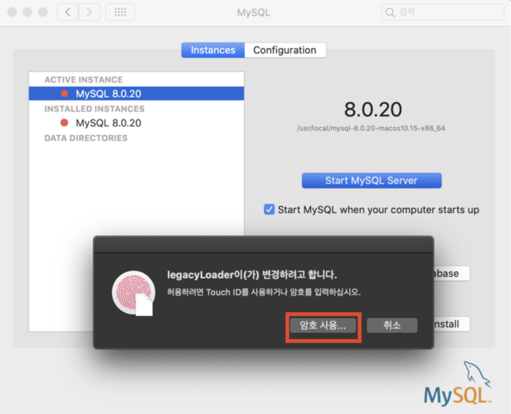

  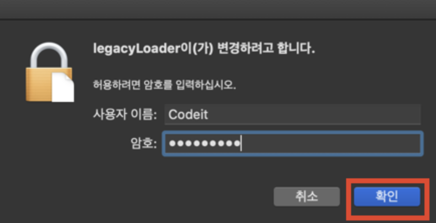

  5> 다시 창을 확인해보면 이제 MySQL 8.0.20 왼쪽에 있던 빨간불이 초록불로 바뀌어 있습니다. 이 초록불은 MySQL 서버가 실행 중이라는 뜻입니다. 

  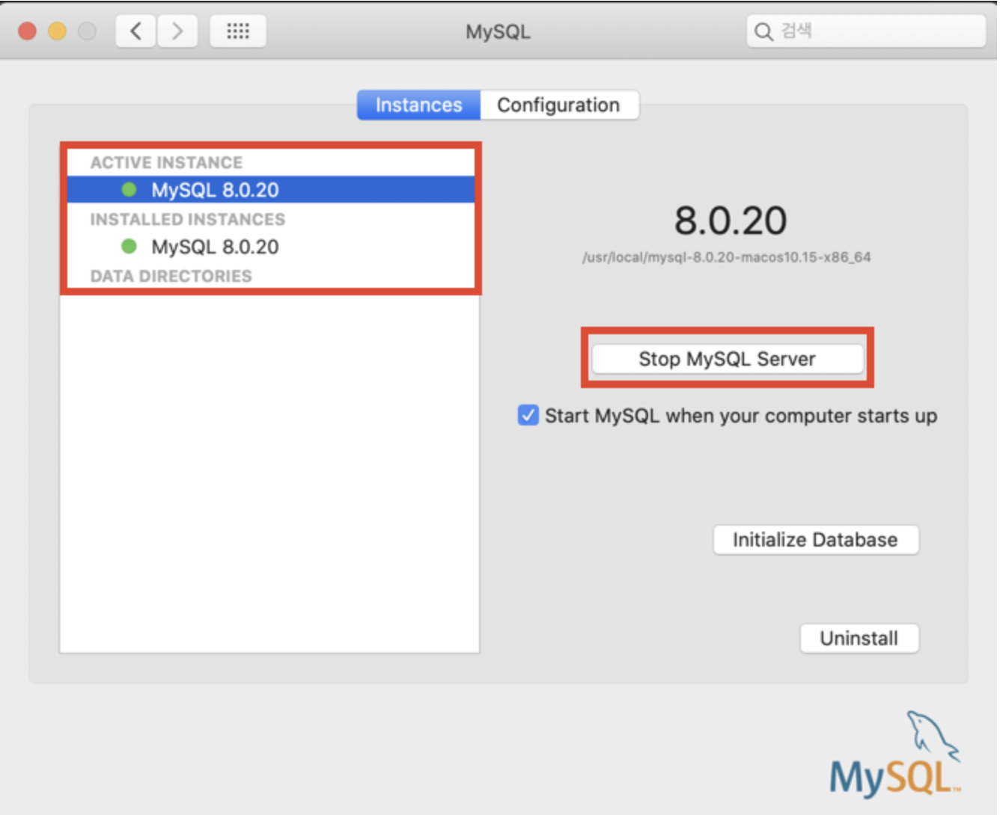

  

  혹시 MySQL 서버를 종료하고 싶다면 **Stop MySQL Server** 버튼을 누르면 됩니다. 

  **2. Workbench로 MySQL 서버에 접속** 

  1> 이전 노트에서는 MySQL 서버가 실행되지 않은 상태에서 접속을 시도했다가 실패했었죠? 그때 서버 상태를 보여주는 아래와 같은 화면이 떴었는데요.

  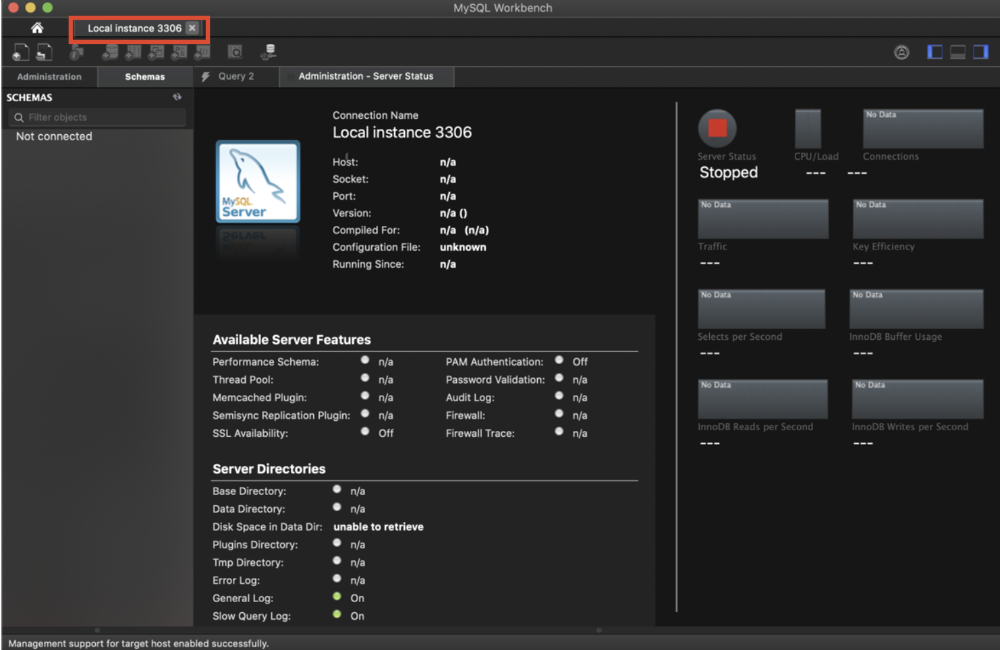

  

  이 화면의 좌측 상단을 보시면 해당 접속(connection) 시도를 나타내는 탭이 보일 겁니다. 이 탭의 엑스 버튼을 눌러서 닫으세요. 

  2> 그러고 나면 Workbench의 메인 화면이 다시 보입니다. 자, 접속을 다시 시도해봅시다. 회색 박스를 클릭하세요. 

  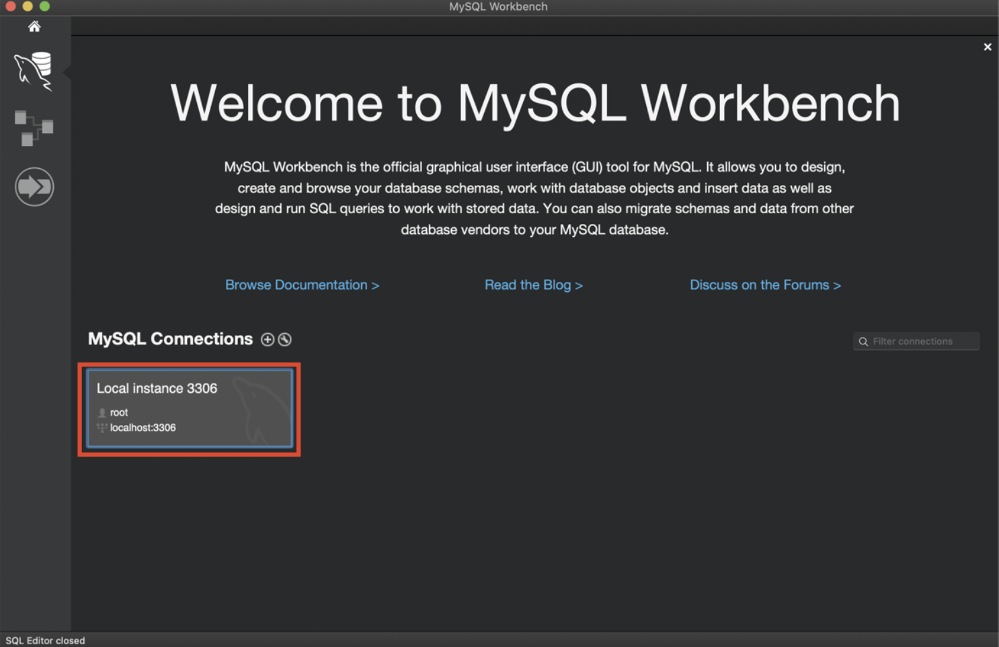

  3> 그럼 아까와 달리 까만 창 하나가 뜨게 됩니다. 지금 과연 MySQL 서버에 잘 접속한 걸까요? 

  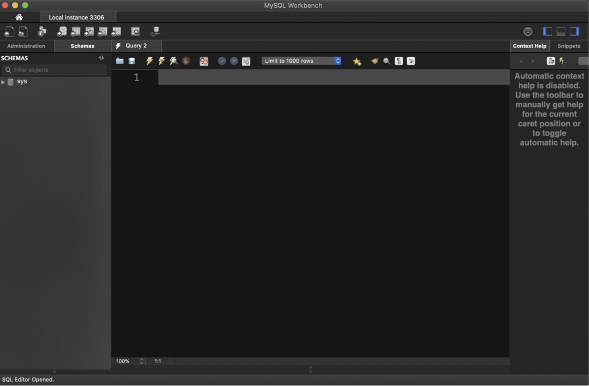

  

  4> 화면 좌측의 Administration 탭을 클릭하고, 그 밑에 있는 Server_status 탭을 클릭해보세요.

  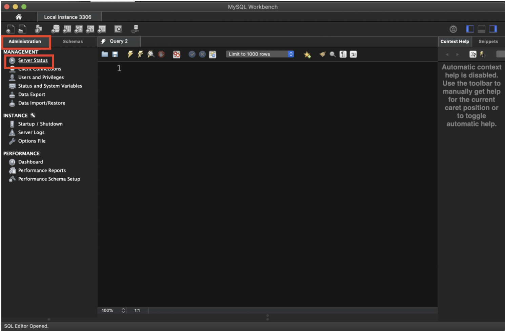

  

  5> 그럼 다시 서버 상태를 보여주는 화면이 뜹니다. 그런데 이번에는 그 결과가 좀 다르네요. 화면 오른쪽의 **Server status** 부분을 보면 이전과 달리 Stopped가 아닌 **Running**이라고 써있는 것을 확인할 수 있습니다. 이건 MySQL 서버가 잘 실행되고 있다는 뜻입니다. 

  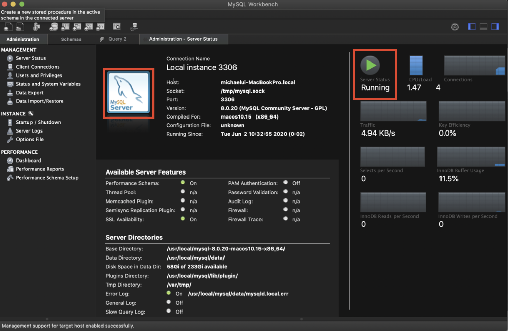

  

  MySQL 서버를 실행하고, Workbench로 접속하는 것을 성공했네요!

  6> 자, 이제 이 상태에서는 SQL 문을 MySQL 서버에 전달해서 원하는 작업을 할 수 있습니다. 왼쪽의 **Query~**라고 써진 탭을 클릭하세요. 까만 화면이 보이죠? 이 화면을 **SQL Editor**라고 하는데요. 저는 편하게 **쿼리 창**이라고 하겠습니다. 여기에 SQL을 입력하고 실행하면 원하는 결과를 얻을 수 있게 됩니다. 쿼리 창은 화면 좌측 상단의 빨간 박스 안의 아이콘을 클릭해서 새로 생성할 수도 있습니다.(다음 챕터에서 곧 배울 내용들입니다)

  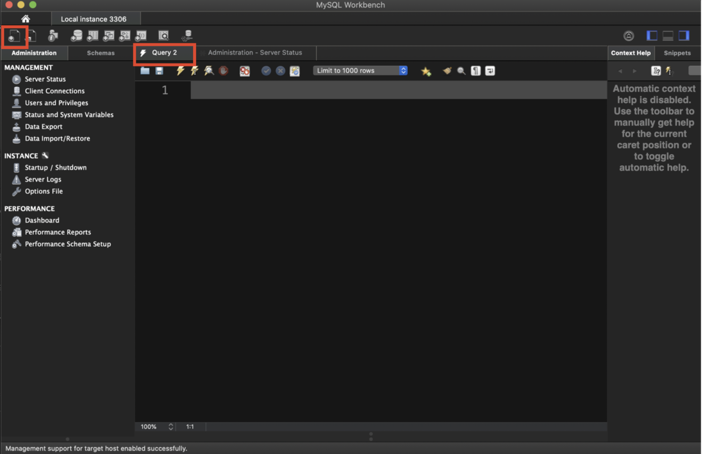

  

  이제 서버 상태를 보던 탭은 엑스 버튼을 눌러서 닫아주세요. 

  

  

  7> 그리고 이제 Administartion 탭이 아니라 **Schemas 탭**을 클릭하세요.

  

  

  이 상태에서 다음 영상을 들으시면 됩니다. 


- #### 데이터베이스 생성하기

  MySQL에서는 데이터베이스를 **Schema**라고도 함. 

  이제부터 MySQL에 있는 모든 데이터는 왼쪽 바 영역에 보이게 될 것. Sys라는 데이터베이스가 하나 보임. 이 것은 MySQL을 설치하면 원래부터 기본으로 있는 데이터베이스. 

  

  일단, 나만의 데이터베이스를 하나 만들어보자. 쇼핑몰 이름은 **copang**.

  copang_main이라는 데이터베이스 생성

   ```sql
   CREATE DATABASE copang_main
   ```

  번개 모양을 클릭하면, 적용이 됨. 

  그런데 그냥 번개 모양 클릭만 해서 실행만 시키면 화면에는 변화가 없음. 

  WorkBench에서 작업한 내용을 보이게 하려면, 아래의 새로고침 버튼을 클릭 해야 함. 

  

  **새로고침 하면, copang_main이라는 데이터베이스가 새로 생김.** 

  


- #### sys 데이터베이스

  이전 영상의 내용대로 **copang_main**이라는 데이터베이스를 잘 생성하셨나요? 그런데 이전 영상에서 우리가 맨 처음 Workbench를 실행했을 때

  

  이 그림과 같이 우리가 생성하지도 않았던 **sys**라는 데이터베이스가 이미 존재했는데요. 이건 뭘까요? 

  sys 데이터베이스는 **MySQL 서버의 성능** 관련 정보들을 갖고있는 데이터베이스입니다. 

  사실 DBMS는 그것을 사용하는 사람에 따라 사용 용도가 크게 달라집니다. 직무별로 간단하게 구별해보자면 

  (1) 기획자/마케터 : 데이터베이스에 저장된 데이터를 잘 분석해서 시장 및 고객을 분석

  (2) 백엔드 개발자 또는 데이터베이스 관리자 : 데이터가 빠르고 안정적으로, 조회 및 저장될 수 있도록 개발 및 관리

  정도가 될 텐데요. 

  특히 (2) 백엔드 개발자 또는 데이터베이스 관리자의 입장에서는 DBMS가 성능 저하 없이 효율적으로 작업을 처리하고 있는지를 체크하는 것이 중요합니다. 그리고 MySQL에서 이러한 정보를 확인할 수 있는 기본 데이터베이스 중 하나가 이 sys 데이터베이스인 거죠. 그래서 데이터 분석을 하는 직군에서는 사실 굳이 자세히 알 필요는 없습니다. 물론 MySQL 데이터베이스 쪽으로 전문화된 개발자가 되고 싶다면, 안에 어떤 내용이 있는지 간단히 살펴보는 것도 좋겠죠? 


### 테이블 생성하기

- #### CSV 파일로 테이블 생성하기

  이전 챕터에서 우리는 코드잇에서 ‘코팡’이라는 의류 쇼핑몰을 운영한다고 가정했습니다. 그리고 ‘코팡’을 위한 **copang_main**이라는 데이터베이스를 생성했는데요. 이제 **copang_main** 데이터베이스 안에 테이블을 하나 생성해보겠습니다.

  테이블을 생성하는 방법에는 크게 2가지가 있습니다. 

  첫 번째는 SQL 문으로 생성하는 방법입니다. 그런데 이번 토픽에서는 테이블을 생성하는 SQL 문은 배우지 않습니다. 이번 토픽은

  '데이터베이스와 테이블이 **이미 존재**하고, 그 안에 데이터도 **이미 저장**된 상황을' 가정하고 **데이터를 분석하는 것에 집중**해서 진행됩니다.

  일단 이번 토픽에서 기존 데이터를 분석하는 방법을 최대한 자세하게 배우고, 나중 토픽에서 테이블을 생성하는 SQL 문도 배울 거니까 걱정하지 마세요. 

  테이블을 만드는 두 번째 방법은 **CSV 파일**을 임포트(import)해서 테이블로 만드는 것입니다.

  우리는 이 방법을 사용할 건데요. 

  일단 [이 노트에 첨부된 **member-data.csv** 파일](https://bakey-api.codeit.kr/files/3150/SMozJR?name=member-data.csv)을 일단 다운로드받으세요. 지금 확장자가 **.csv**로 끝나죠? 이런 파일을 **CSV 파일**이라고 하는데요. **CSV**는 **C**omma **S**eparated **V**alues의 약자로, 모든 값들이 콤마(,)로 구분된 형식의 내용을 가진 파일을 말합니다. 아마 엑셀을 자주 사용하는 분이라면 익숙한 형식의 파일일 겁니다. 실제로 member-data.csv 파일을 열어보면 

  

  이렇게 모든 값이 콤마로 구분된 것을 볼 수 있습니다. 지금 **member-data.csv 파일에는 코팡의 회원 정보**가 담겨있는데요. 지금 가장 첫 번째 줄을 보면 id, email, age, … 와 같은 컬럼 이름들이 보입니다. CSV 파일에는 보통 이렇게 가장 첫 번째 줄에 컬럼 이름들이 적혀있습니다. 

  **Workbench에는 CSV 파일을 그대로 테이블로 만들어주는 기능이 있는데요.** 이 기능을 사용해셔 **member-data.csv 파일로 member라는 이름의 테이블을 생성**해보겠습니다. 다음 내용을 순서대로 따라해보세요. 

  1> **copang_main** 데이터베이스 이름에 커서를 대고 마우스 오른쪽 버튼을 누르세요. 그 다음 뜨는 팝업에서 ‘**Table Data Import Wizard**’를 클릭하세요.

  

  2> 그럼 아래와 같은 창이 뜹니다. 빨간 박스 속 문장을 해석하면 CSV 파일을 임포트해서 바로 테이블로 만들 수 있다는 뜻인데요. 일단 Browse 버튼을 클릭하세요.

  

  3> 그 다음 방금 전에 다운로드 받은 member-data.csv 파일을 선택하고, Open 버튼을 클릭하세요. 

  

  4> 파일 경로가 설정된 걸 확인하고 Next 버튼을 누르세요. 

  

  

  5> 그럼 이제 이 CSV 파일로 생성할 테이블의 이름을 설정하는 창이 뜹니다. 테이블 이름은 member라고 할 건데요. 지금 파일 이름인 member-data가 기본 세팅되어 있네요.

  

  

  이걸 member로 수정하고 Next 버튼을 클릭하세요. 

  

  

  6> 그 다음 뜨는 창에서 아래와 같은 스패너 모양 아이콘을 클릭하고,

  

  

  

  **Field Separator(컬럼 구분자) 부분의 기호를 ,(콤마) 표시로 바꿔주시고** Next 버튼을 눌러주세요

  7> 그럼 CSV 파일에 있던 각 컬럼명이 잘 인식되는 것을 확인할 수 있습니다. **창의 크기를 우측 하단 방향으로 크게 늘리면** 아랫부분에 어떤 모양의 테이블이 생길지 간단하게 살펴볼 수 있는 부분이 보입니다.

  

  

  지금 각각의 컬럼 오른쪽에 int, text 같은 것들이 써있는데요. 이런 것들은 각 컬럼에 어떤 형식(숫자, 문자열)의 값이 들어갈 수 있는지를 나타냅니다. 이걸 Field Type 또는 **Data Type**이라고 합니다. 이 부분은 다음 영상에서 자세하게 설명할 건데요. 일단 int는 정수형, text는 문자열형을 나타낸다는 것만 알아두세요.

  8> 그런데 지금 각 컬럼들을 자세히 보면, height(키) 컬럼의 데이터 타입은 text인데 weight(몸무게) 컬럼의 타입은 double로 되어있습니다. **double은 실수형 데이터 타입**으로 소수점이 필요한 숫자를 담을 수 있는 데이터 타입입니다. 예를 들어 키는 182.3, 몸무게는 72.4 이런 식으로 소수점이 필요한 값들도 존재하기 때문에 그 데이터 타입이 double이어야 합니다. 지금 weight 컬럼은 데이터 타입이 double로 되어있는데, height 컬럼은 데이터 타입이 text죠? height 컬럼의 데이터 타입을 Workbench가 잘못 추론한 것 같습니다. height 컬럼도 weight 컬럼처럼 그 데이터 타입을 double로 바꾸겠습니다.

  

  

  height 컬럼의 데이터 타입 부분을 클릭하고 

  

  

  double을 클릭하세요. 

  

  

  그리고 Next 버튼을 눌러서 넘어가면 됩니다.

  9> 그 다음 화면에서도 Next 버튼을 누르세요.

  

  

  10> 작업이 완료되면 또 Next를 누르세요. 

  

  

   11> **member 테이블 생성이 완료되었습니다!** 아래 그림에 보이는 **copang_main.member**는

  (1) copang_main 데이터베이스의

  (2) member 테이블이라는 뜻이라는 거

  이전에 설명했죠? Finish 버튼을 누르세요. 

  

  

  12> 그 다음 SCHEMAS 탭의 새로고침 버튼을 클릭하면, 

  

  Tables 왼쪽에 화살표가 생깁니다. Tables를 더블클릭하면 생성된 member 테이블이 보입니다. 

  

  

  여기까지 하신 분은 이 상태에서 다음 영상을 들으시면 됩니다. 

  자, 이번 노트에서는 **CSV 파일로 테이블을 생성하는 방법**을 배웠는데요. 이 과정은 곧 나중 챕터에서 또 반복해야할 과정이기 때문에 잘 기억해두시는 게 좋습니다. 그 때는 별도의 설명없이 이 노트의 주소를 링크로 두고 진행할 예정입니다.

  CSV 파일은 데이터 분석 분야에서 아주 흔하게 사용되는 파일의 형식입니다. 그리고 현재 많은 회사들이 사용하는 엑셀(Excel)에는 저장된 데이터를 CSV 파일로 추출할 수 있는 기능이 있는데요.

  이 말은 곧

  - **엑셀 파일** -> **CSV 파일** -> **테이블**

  이런 식의 변환을 통해 엑셀 파일로 존재하던 데이터를 SQL로 분석할 수 있다는 뜻이기도 합니다. 이번 토픽의 내용을 잘 듣고나서, 나중에 엑셀 파일을 SQL로 분석해보는 것도 좋겠죠?

  *혹시 이렇게 해도 프로그램 에러 발생 등으로 인해 작업을 수행할 수 없는 경우에는, 아래 보이는 SQL 문들을 그대로 Workbench에 복사-붙여넣기해서 실행해주세요. 그럼 똑같은 테이블이 생성됩니다.

   

  ```sql
  USE copang_main;
  
  CREATE TABLE `member` (
    `id` int,
    `email` text,
    `age` int,
    `gender` text,
    `height` double,
    `weight` double,
    `birthday` date,
    `sign_up_day` date,
    `address` text,
    PRIMARY KEY (`id`)
  ) ENGINE=InnoDB DEFAULT CHARSET=utf8mb4 COLLATE=utf8mb4_0900_ai_ci;
  
  INSERT INTO `member` (`id`, `email`, `age`, `gender`, `height`, `weight`, `birthday`, `sign_up_day`, `address`) VALUES 
  (1,'codeit@naver.com',28,'m',178.2,70,'1992-01-03','2019-03-26','서울특별시 중구 삼일대로 343 103호'),
  (2,'korin02@google.com',29,'m',165.7,67.3,'1992-08-13','2019-02-27','서울특별시 중구 세종대로 110 502호'),
  (3,'cowboy@codeit.kr',31,'m',NULL,70.2,'1990-01-03','2019-01-05','경기도 고양시 일산서구 고양대로 633 204동 203호'),
  (4,'get_flower@naver.com',-10,'f',183.5,72,'1975-03-12','2018-11-29',NULL),
  (5,'taehos@hanmail.net',27,'m',181.3,70,'1992-09-02','2017-03-14','제주 제주시 문연로 6 102동 1105호'),(6,'iamstylish@naver.com',300,'f',172.2,NULL,'1989-01-03','2012-11-15','안드로메다 128행성'),(7,'captainGoGo03@koreauniv.com',28,'m',195.2,66,'1992-03-13','2014-03-18','전라남도 순천시 왕지3길 60 112동 107호'),(8,'sungsos@naver.com',36,'f',167.7,66.2,'1992-01-03','2017-03-20','경기도 부천시 평천로 679 101동 101호'),(9,'young05@naver.com',30,'m',180.2,70.4,'1991-02-13','2013-08-12','경기 오산시 세마문학로 50 111동 109호'),(10,'codeman_to@yonseit.com',111,'f',NULL,70.5,'1970-08-01','2017-02-20','경기 고양시 덕양구 충장로 118 112동 1103호'),(11,'programmer007@sumsung.com',27,'m',170.4,65.3,'1993-03-26','2014-01-22','경기 성남시 수정구 시민로 209 101동 1201호'),(12,'lovely_day@kaisty.com',-10,'f',162.7,69.4,'1995-10-11','2017-07-01','경기 화성시 봉담읍 동화새터길 55-39 203동 205호'),(13,'teddy@kakaot.com',41,'f',177.3,77.2,'1980-11-12','2016-08-03','인천 부평구 아트센터로 118 302동 602호'),(14,'pooh_man@naver.com',28,'m',182,NULL,'1993-12-21','2018-09-02','인천 미추홀구 송림로 194 602동 303호'),(15,'bicycle_go123@yahoot.com',24,'m',180,60.3,'1997-03-03','2019-12-01','서울 송파구 올림픽로 435 103동 501호'),(16,'all_round321@naver.com',26,'m',182.4,NULL,'1995-01-03','2019-11-23',NULL),(17,'nice_man@google.com',200,'m',180.8,NULL,'2003-01-03','2015-10-25','강원도 원주시 가곡로 50 101동 810호'),(18,'jw101@hanmail.net',0,'m',160.3,70,'1992-08-03','2017-09-23','강원도 춘천시 지석로 29 402동 321호'),(19,'cat_movie@lotte.com',-5,'f',180.2,NULL,'1989-01-03','2018-11-25','서울 양천구 오목로 354 110동 402호'),(20,'gogo_shopping@naver.com',32,'m',180.2,80.3,'1989-11-02','2015-01-23','서울 송파구 올림픽로35길 10 파크리오 301동 703호'),(21,'hello_hat@unista.com',26,'f',165.3,48.2,'1995-11-13','2018-12-23',NULL),(22,'new_coder@naver.com',-2,'f',180.7,70,'1976-08-03','2018-12-12','부산 연제구 양연로27번길 26 301동 701호'),(23,'zerotohundred@naver.com',20,'m',162,56,'2001-02-17','2015-07-20',NULL),(24,'xMan_series@naver.com',29,'m',173,65,'1992-01-03','2011-12-20','어린왕자에 나오는 B612');
  
  ```


- #### 생성된 테이블 살펴보기

  위에서 멤버 테이블 임포트 했음. 이 테이블에 어떤 컬럼들이 있는지를 살펴보고 싶으면, 아래 사진 부분을 선택하면 됨. 

  

  그럼 컬럼들을 한눈에 볼 수 있음. 

  c

  각각의 DataType도 보임. 

  | 데이터타입 | 설명                                                      |
  | ---------- | --------------------------------------------------------- |
  | int        | integer,  정수타입                                        |
  | double     | 소수점 이하의 숫자까지 나타낼 수 있는 실수형 데이터 타입. |
  | text       | 문자열을 담을 수 있는 데이터타입.                         |
  
  


- #### Primary Key 설정하기

  컬럼들 중에서 csv import 할때, 없었던 컬럼이 하나 보임. 그것은 바로 id컬럼

  

  당연하지만, 회원의 id가 아님. id컬럼은 회원이 실제로 가지고 있는 속성과는 다른 종류의 속성. 테이블에서 각각의 row 즉, 회원을 식별하기 위해 인위적으로 추가한 컬럼. 

  1부터 24까지의 숫자가 쭉 적혀있음. 각 row마다 겹치지 않음. 그래서 id컬럼의 값만 알면 특정 row를 항상 식별이 가능함. 그래서 여기서는 *멤버 테이블의 primary key가 바로, id컬럼이 되는 것.* 

  

  이제 확실하게 primary key를 체크 해 줄 수 있음. 

  아래처럼 체크를 하면, mysql에 내가 이것을 pk로 쓰겠다는 것을 확실히 말해주는 것. 

  

  체크를 하면 아래처럼 열쇠모양으로 바뀜. 이 열쇠모양이 이 컬럼이  pk라는 것을 나타냄. 

  

  그리고 나서 설정을 적용하려면 우측 하단의 apply버튼을 눌러야 적용이 됨. 

  

  클릭을 하면 id컬럼을 pk로 쓰겠다는 sql문이 나옴. 다시 apply를 클릭하면 이제 적용이 된 것.

  **사실 실무에서 볼 테이블들은 이미 테이블을 만들 때 부터 pk가 생성이 되어 있음.**

  한국어로는 ***기본키***라고도 많이 부름. 


- #### Primary Key의 종류

  이전 영상에서 저는 member 테이블의 id 컬럼을 'member 테이블의 **Primary Key**'로 지정했습니다. 아마 여러분이 실무 현장에서 만나게 될 각 테이블에는 대부분 이런 Primary Key가 이미 설정되어 있을 겁니다.(꼭 모든 테이블에 Primary Key가 있어야 하는 것은 아니지만, 특별한 경우가 아닌 이상 일반적으로 테이블에는 Primary Key가 존재하는 것이 바람직합니다.)

  이전 영상에서 말한 대로 이런 **Primary Key는 테이블에서 특정 row 하나를 식별하는 역할**을 합니다. 특정 컬럼을 Primary Key로 설정하면 Primary Key에 같은 값이 있는 row가 추가되는 것을 DBMS가 자동으로 막아주기 때문에 중복된 row가 생길 위험성이 사라집니다. 

  이런 Primary Key는 당연히 특정 row를 고유하게 나타낼 수 있는 값을 가진 컬럼으로 설정해야겠죠?

  Primary Key의 종류에는 크게 두 가지가 있습니다. 바로 *Natural Key*와 *Surrogate Key*인데요. 각각 무엇인지 살펴봅시다. 

  **1. Natural Key**

  *실제로 어떤 개체가 갖고 있는 속성을 나타내는 컬럼이 Primary Key가 됐을 때 이를 Natural Key라고 합니다.* 사람은 주민등록번호로 특정 인물을 식별할 수 있습니다. 우리가 읽는 책은 [ISBN](https://en.wikipedia.org/wiki/International_Standard_Book_Number)이라고 하는 번호로 특정할 수 있구요. 바로 이런 속성을 나타내는 컬럼이 Primary Key가 되면 Natural Key라고 합니다.

  현재 우리의 member 테이블에서는 email 컬럼이 각 회원을 식별할 수 있는 실제 속성입니다. 만약 제가 id 컬럼 말고 email 컬럼을 Primary Key로 설정했다면 Primary Key가 Natural Key인 겁니다. 하지만 저는 email 컬럼말고 id 컬럼을 Primary Key로 설정했는데요. 이에 대한 설명을 바로 이어서 할게요.

  **2. Surrogate Key**

  이건 제가 설정했던 id 컬럼같은 Primary Key를 의미합니다. 사실 **id 컬럼은 어떤 회원의 속성을 직접적으로 나타내는 컬럼은 아닙니다.** 단지 제가 Primary Key로 사용하기 위해 **인위적으로 생성한** 컬럼이죠. *이렇게 어떤 개체의 실제 속성은 아니지만 Primary Key로 쓰기 위해 추가한 컬럼을 Surrogate Key라고 합니다.* 이런 Surrogate Key에는 주로 1부터 순차적으로 증가하는 숫자가 들어가게 됩니다. 잠깐 다시 member 테이블의 id 컬럼을 볼까요?

  

  이렇게 id 컬럼에 1부터 시작해서 순차적으로 증가하는 값이 적혀있죠? 이 상태에서는 id 컬럼의 값으로 특정 row를 식별할 수 있으니 당연히 Primary Key의 역할을 할 수 있습니다.

  그럼 Natural Key와 Surrogate Key 중에 어느 것이 더 좋을까요? 정답은 없습니다. 각 상황마다 적절한 키가 달라지는데 이것은 데이터베이스에 관해 깊게 공부하고 나서야 이해할 수 있는 부분이기 때문에 생략하겠습니다. 하지만 **Natural Key는 그 값이 나중에 변경되면 모든 row의 값을 다시 수정해줘야 한다는 문제 등**(가능성은 낮지만 사람의 주민등록번호가 변경되는 경우가 생길 수도 있겠죠?)이 있기 때문에 **보통은 Surrogate Key를 선택하는 경우가 더 많습니다.**

  일단은 Primary Key의 종류에 크게 2가지가 있다는 것을 기억하고, 실무에서 만나게 될 테이블의 Primary Key가 이 2가지 중 어디에 해당하는지만 구분할 수 있으면 충분합니다.

  

- #### Not Null의 의미

  앞에서 pk를 선택할때, 옆에 있던 nn도 같이 선택이 자동으로 되었음. 

  

  **NN은 Not NULL의 줄인말. NULL이 아니라는 소리.**  

  **Null은 특정 값이 존재하지 않을 때, 그 존재하지 않는 상태를 일컫음.** 

  지금 보면, height/weight/adress 컬럼에 null이 존재함. 

  

  주의해야 할 것은 **null**은 **0**이랑 완전히 다른 것. 0이 있었다면, 숫자 0이라는 값이 있는 것. 그리고 비어있는 문자열과도 완전히 다른 개념. 값이 아예 존재하지 않는 것. 빈 문자열이 있었다면, 그 빈 문자열이 값인 것. 

  

  다시 돌아가서 **Not NULL**은 이 컬럼에 Null이 있으면 안된다는 것. 즉, 어떤 컬럼에 not null속성이 되어 있다면, 그 컬럼에는 반드시 어떤 값이 들어가 있어야 함을 의미한다. 

  이렇게 not null이 설정된 컬럼에 null이 들어간 row를 추가하려고 하면 데이터베이스에서 당연히 에러를 뱉음. 

  *그럼 왜 pk를 체크했을 때, nn을 자동으로 체크했을까?*

  pk이라는 컬럼 자체가 특정 row를 식별하기 위한 columns. null이 있는 경우가 있으면, 식별하는 것 자체가 불가능하잖아. 그래서 pk이면, 반드시 nn이여야 함. 

  


- #### Primary Key와 Auto Increment 속성

  이전 노트에서 저는 회원이 가진 속성을 나타내는 컬럼 대신, 인위적으로 추가한 id라는 컬럼을 member 테이블의 Primary Key로 설정했고, 이런 Primary Key를 Surrogate Key라고 한다고 했습니다. 그리고 Surrogate Key는 보통 1부터 시작해서 1씩 증가하는 정수값을 갖는다고 했는데요. 

  그렇다면 매번 새롭게 추가되는 row의 id 컬럼의 값은 이전 row의 id 컬럼의 값보다 1이 더 큰 정수가 되어야겠죠? 그런데 대부분의 DBMS에는 **매번 새로운 row가 추가될 때마다 id 컬럼에 이전보다 1이 더 큰 정수를 자동으로 넣어주는 기능이 존재합니다.** 

  MySQL에 있는 기능을 보여드릴게요.

  지금 Workbench에서 member 테이블의 컬럼 구조를 보면, 

  

  AI라고 써있는 부분이 보입니다. 여기서 AI는 **Auto Increment**의 약자로 ‘자동 증가’라는 뜻입니다. 이게 무슨 말일까요? 

  자, 그림으로 설명해드릴게요. 맨 처음 생성된 직후의 member 테이블은 이런 모습일 겁니다. 

  

  그 후에 각 회원을 나타내는 새로운 row들이 추가되면서, 점점 이런 모습을 갖추게 되겠죠? 

  

  그리고 각 row를 추가할 때마다 id 컬럼의 값, 회원의 이메일 주소, 나이, 성별 등을 모두 지정해서 추가해야할 겁니다. 

  하지만 이미 설명했듯이 Surrogate Key인 id 컬럼은 사실 회원이 실제로 갖는 속성을 나타내지는 않습니다. 그래서 우리가 id 컬럼에 값을 실제로 넣고 row를 추가하기보다는,

  **id 컬럼에 항상 유일한 값이 들어간다는 보장만 있으면, 누군가가 대신 id 컬럼의 값을 넣어주는 게 더 편리할 겁니다.** 방금 본 **Auto Increment 속성을 컬럼에 설정하면, 해당 컬럼에 관해서는 DBMS가 '자동으로 증가'하는 값을 넣어줍니다.**

   

  그럼 한번 id 컬럼에 Auto Increment 속성을 설정해볼게요.

   

   1> AI 밑에 체크표시를 하고

  

  

  2> 우측 하단의 Apply 버튼을 클릭하세요. 

  

  

  3> 그리고 뜨는 창에서 Apply 버튼을 누르세요. 

  

  

  4> 그리고 Close 버튼을 누르세요. 

  

  

  이제 id 컬럼에 Auto Increment 속성이 지정되었습니다. Auto Increment 속성을 설정하기 이전에는 id 컬럼의 값도 사용자가 직접 지정해서 row를 추가해야했다면 이제는 그럴 필요가 없습니다. email 컬럼부터 address 컬럼까지만 값을 넣고 row를 추가하면, MySQL이 이전 row의 값들과 겹치지 않는 새로운 값(보통 이전 값에서 +1 한 값)을 자동으로 넣고 그 row를 추가해주기 때문입니다. 

  그러니까 이 상태에서

  

  

  새로운 row 하나를 추가한다고 할게요.

  

  

  지금 id 컬럼에서 빨간색 별표가 붙은 6은 MySQL이 자동으로 삽입한 값입니다. 이제는 row를 삽입할 때 회원의 실제 속성을 나타내는 컬럼의 값만 직접 작성하고 id 컬럼에는 신경쓸 필요가 없습니다. 

  이제 Auto Increment 속성이 무엇인지 아시겠죠? Primary Key가 Surrogate Key인 경우에는 보통 이런 식으로 Auto Increment 속성이 설정되어 있을 때가 많습니다. 혹시 테이블에서 Auto Increment, AI 이런 표시를 보게 된다면 이번 노트에서 배운대로 그것이 Surrogate Key이고 MySQL에 의해 자동으로 관리되고 있는 컬럼이구나라고 생각하시면 됩니다. 


- #### 날짜 관련된 컬럼은 Date 타입으로

  birthday, sign_up_day 컬럼이 둘다 text로 설정되어 있음. 날짜 값을 위해, date type이라는 것이 있음. 

  

  

  이렇게 date타입으로 해 놓으면, 나중에 이 컬럼의 값을 가지고 1년 후의 날짜를 구한다거나 하는 작업들을 편하게 할 수 있음. 


- #### member 테이블과 WorkBench 간단히 살펴보기

  테이블 전체를 살펴보자. 아래 아이콘을 클릭하면 테이블 전체를 볼 수 있음. 

  

  사실 뭐 클릭하면 뭐 보이고 하는 것은, 다 이 SQL문을 WorkBench에서 실행시켜 주고 있기 때문. 아이콘 클릭이 곧, 이 SQL문의 실행을 의미했던 것. 

  

  SQL문은 항상 실행될때마다 아래서 실행 결과를 나타내줌. 초록색과 빨간색으로 보여주고, time은 실행된 시간, action은 실행문, response에는 실행결과 duration에는 실행에 걸린 시간이 나타남. ***특히 뭔가 오류가 있는 것 실행하면, response텝에 에러가 출력됨.*** 

  

- #### **꼭 기억해야 할 WorkBench 사용법**

  앞으로 배울 영상의 내용을 이해하기 위해서는 Workbench의 기본적인 사용법들을 알고 있어야 합니다. Workbench 화면의 각 영역에 번호를 붙여서 설명해두었으니 꼼꼼하게 읽어보세요. 

  **1. Workbench 사용법**

  

  1) 쿼리 창 생성 아이콘

  1번 아이콘을 클릭하면 3번과 같이 SQL 문을 쓸 수 있는 SQL 에디터(우리는 '쿼리 창'이라고 부릅시다) 탭을 새롭게 열 수 있습니다. 그때마다 2번 영역에서 탭의 개수가 늘어나게 될 겁니다.

  2) 쿼리 창 탭 

  쿼리 창 생성 아이콘을 누를 때마다 이 영역에 존재하는 탭의 개수가 늘어나게 됩니다. 

  3) 쿼리 창

  SQL 문을 입력할 수 있는 공간입니다. 

  4) SQL 문 실행 아이콘 

  쿼리창에 입력한 SQL 문을 실행해줍니다. 저는 영상에서 매번 SQL 문을 실행할 때마다 직접 이 아이콘을 클릭해줄 건데요. 혹시 단축키를 사용하고 싶으신 분은 '**시프트 + 커맨드(윈도우는 컨트롤) + 엔터**'를 치셔도 됩니다.

  5) 새로고침 아이콘 

  데이터베이스를 새로 생성하거나, 데이터베이스에 테이블을 새로 추가했을 때 새로고침 버튼을 눌러야 그것을 확인할 수 있습니다. 

  6) 테이블 조회 아이콘

  6번 영역을 자세히 보면 지금 다음과 같이 2개의 아이콘이 있습니다. 

  

  이 중에서

  (1) 왼쪽의 스패너 모양 아이콘은 해당 테이블의 컬럼과 각 컬럼의 데이터 타입 등을 볼 수 있게 해주는 아이콘이고,

  (2) 오른쪽의 표 모양의 아이콘은 테이블의 전체 row를 조회할 수 있게 해주는 아이콘입니다.

  지금 위에 보이는 Workbench 화면의 이미지는 (2) 오른쪽의 표 모양의 아이콘을 클릭했을 때의 결과입니다. 

  7) SQL 문으로 테이블의 데이터를 조회했을 때 그 조회 결과가 출력되는 영역입니다. 

  8) SQL 문을 실행했을 때, 실행이 잘 되었는지 등에 관한 정보를 보여주는 영역입니다. 지금 보면 가장 왼쪽에 초록불이 떠있는데요. 이는 SQL 문이 정상 실행되었다는 뜻입니다. 만약 여기에 빨간 불이 떠있다면 SQL 문 실행이 실패했다는 뜻입니다. 그리고 그 이유(에러 메시지)도 이 영역의 Response 탭에서 확인할 수 있는데요. 어떻게 확인할 수 있는지는 나중 영상에서 보여드릴게요. 

  **2. Workbench 글자 크기 조정**

  Workbench를 맨 처음 실행해보면 그 글자 크기가 작어서 불편할 수도 있습니다. 그래서 글자 크기를 키우고 쓰는 게 좋은데요. 아래 방법을 따라해서 원하는 글자 크기로 조정해보세요. 

  1> 화면 상단의 MySQL Workbench - Preferences를 클릭합니다. 

  

  2> 그리고 나서 뜨는 창의 좌측 패널에서 **Fonts**를 선택합니다. 그럼 오른쪽에 글자 크기를 설정할 수 있는 부분들이 보이게 되는데요. 저는 지금 이렇게 설정한 상태입니다. 저와 같은 값을 설정하셔도 되고, 원하는 크기만큼 숫자를 더 크게 또는 더 작게 바꾸셔도 됩니다. 바꾸신 후에 OK 버튼을 클릭하세요.

  

  3> 글자 설정을 반영하려면 MySQL 서버와의 현재 접속을 끊고, MySQL 서버에 다시 접속해야 합니다. 화면 좌측 상단에서 현재 접속을 나타내는 탭을 엑스 버튼을 눌러서 닫으세요. 

  

  4> 그 다음 아래 빨간색 박스 부분을 클릭해서, 다시 연결을 시도하면

  

  5> 변화된 글자 크기를 보실 수 있을 겁니다. 저는 원래 이 설정이었기 때문에 변화가 없습니다. 

  

