# Basic Concept 2

- #### 데이터조회의 핵심, SELECT와 WHERE

  SELECT는 테이블의 데이터를 조회할때 사용하는 구문. 

  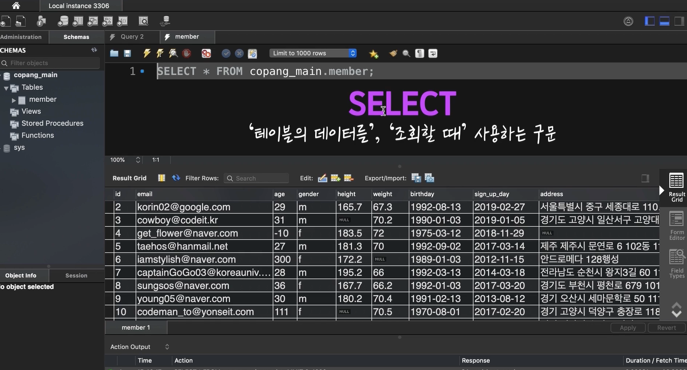

  ```sql
  SELECT * FROM copang_main.member;
  ```

  *****: asterisk 각 row의 모든 컬럼 값을 보여달라는 뜻. Member table의 모든 컬럼이 보이게 되는 것. *대신, 특정 컬럼을 적어도 됨. 

  ```sql
  SELECT email, age, address FROM copang_main.member;
  ```

   즉 이 *가 있던 부분은, 보고싶은 컬럼들의 이름을 적어주는 부분인 것. 

  **FROM** : ~로 부터 라는 뜻. 어느 테이블에서 데이터를 조회할 것인지를 나타냄. from 다음에는 데이터를 조회하고 싶은 테이블의 이름을 써주면 됨. coping_main이라는 데이터베이스의 member라는 테이블을 나타냄. 사실 그냥 member라고 적어줘도 되긴 함. 그런데, 가끔 서로 다른 데이터베이스들에 같은 이름의 테이블이 있는 경우가 있어서, 명시해 주는게 더 나음.  **테이블의 전체 row가 아닌, 특정 조건으로 검색하는 방법은?** taohos@hanmail.net만 조회해 보자. 
  
  ```sql
  SELECT * FROM copang_main.member WHERE email = 'taehos@hanmail.net';
  ```
  
  **WHERE**문은 특정 조건을 만족하는 row들만 찾으려고 할 때, 그 특정 조건을 설정하는 부분. 
  
  ​	
  
- #### SQL작성 형식에 관한 이야기

  이번에는 SQL 문 작성 형식에 관한 이야기 몇 가지를 해보겠습니다. 크게 4가지를 설명하겠습니다.

  **1. SQL 문 끝에는 항상 세미콜론을 써줘야합니다.** 

  하나의 SQL 문 끝에는 세미콜론을 써줘야합니다. SQL 문법 상 세미콜론이 **하나의 SQL 문을 종결하는 단위**이기 때문에 그런 건데요. 간혹 이 세미콜론을 쓰는 것을 잊고 '왜 이 SQL 문이 실행되지 않지?'라고 고민하시는 분들이 있습니다. SQL 문의 끝에는 세미콜론! 절대 잊지마세요.

  (Workbench에서는 하나의 SQL 문인 경우 세미콜론을 입력하지 않아도 알아서 인식하고 잘 실행해줍니다. 하지만 Workbench에서도 하나 이상의 SQL 문들이 있는데 세미콜론이 없으면 그 SQL 문들은 실행되지 않습니다)

  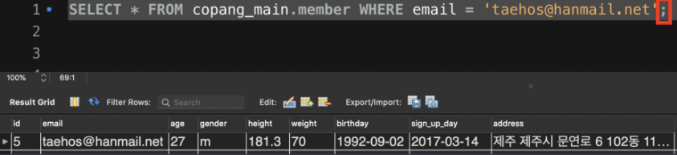

  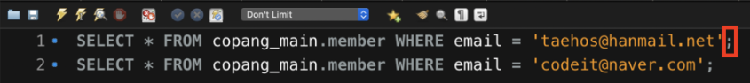

  **2. SQL 문 안에는 공백이나 개행 등을 자유롭게 넣을 수 있습니다.** 

  예를 들어 이런 식으로 엄청 많은 공백을 주거나,

  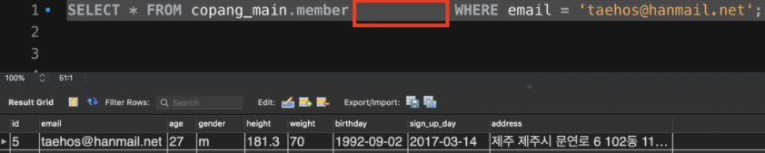

  SQL 문의 일부분을 한 줄 내리고, 탭을 입력한 후에 쓰는 것도 가능합니다. 

  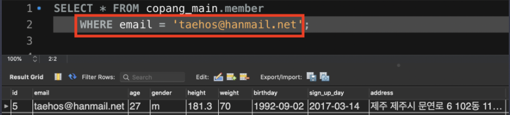

  어떤 방식으로 쓰든, 구분되어야할 키워드들이 최소한 하나 이상의 공백으로 구분되어 있고, *세미콜론으로 마무리되어 있으면 실행에는 문제가 없습니다.* 이런 점을 이용해서 길이가 긴 SQL 문을 쓸 때는 개행(줄바꿈), 탭 등을 적절하게 활용해서 가독성을 높이는 것이 좋습니다. 

  **3. SQL 문의 대소문자 구분 문자**

  이전 영상에서 마지막에 썼던 SQL 문을 보면, MySQL에 **기본으로 내장된 키워드들(이런 것들을 보통 ‘예약어’라고 합니다.)은 대문자로 써주고, 나머지 부분은 소문자로** 써줬습니다. 

  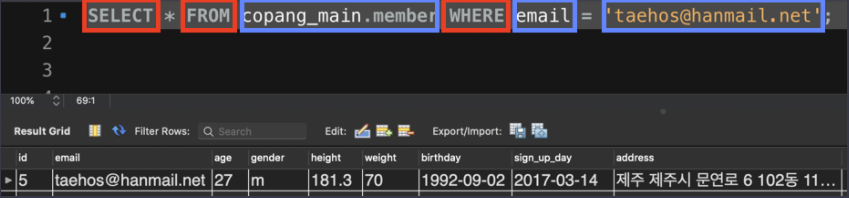

  지금 빨간색 박스가 MySQL에 원래부터 존재하는 예약어, 파란색 박스가 사용자가 지정한 부분입니다.

  일단 빨간색 박스에서 보이는 것처럼 **MySQL의 예약어는 대문자로 적는 것이 관례**이고, 보기에도 좋습니다.

  그리고 파란색 부분에 등장하는 데이터베이스 이름, 테이블 이름, 컬럼 이름 등은 대소문자를 가리지 않고, 실제로 존재하는 것의 이름을 적어주면 됩니다. 

  데이터베이스, 테이블, 컬럼 등의 이름을 짓는 것도 회사마다 일종의 규약(convention)들이 있을 텐데요. 실무에서는 그런 규약에 맞게 지어진 이름들을 자주 작성하게 되겠죠?

  빨간색 박스로 표시된 ‘예약어’들은 꼭 이렇게 대문자로만 써야할까요? 그건 아닙니다. ‘예약어’들을 모두 소문자로 바꾸고 실행해도

  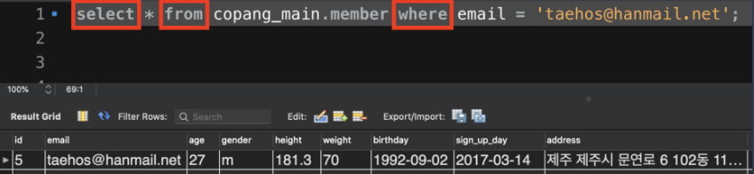

  위 그림과 같이 실행은 잘 됩니다. 하지만 가독성을 위해 ‘예약어’만큼은 꼭 대문자로 쓰는 습관을 들이도록 하세요. 

  **4. 데이터베이스 이름과 테이블 이름**

  이전 영상에서는 데이터베이스 이름 뒤에 점(.)을 붙이고 그 다음에 테이블 이름을 썼습니다. 이렇게 쓰면 해당 데이터베이스 안의 테이블을 가리키는 거라고 했죠? 실무에서는 서로 다른 데이터베이스에, 같은 이름의 테이블이 존재할 수도 있기 때문에 이렇게 써주는 게 좋다고 했는데요. 

  

  하지만 항상 그럴 필요는 없습니다. 아래 그림을 보세요. 

  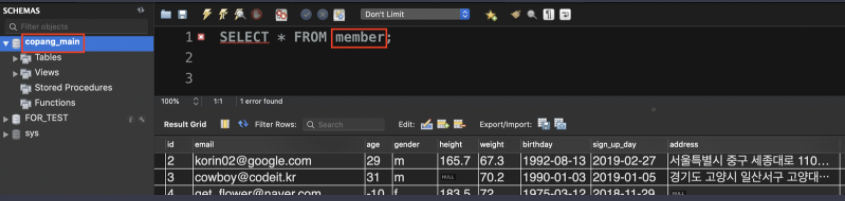

  지금 왼쪽 **SCHEMAS** 패널 부분의 **copang_main**을 클릭해서, 활성화해두었습니다. *이건 지금 **copang_main 데이터베이스**를 사용할 거라고 지정한 것과 같은데요.* 이런 상태에서는 그냥 member 라고 테이블 이름만 적어줘도 됩니다. 

  또는 아예 SQL 문으로 어떤 데이터베이스를 쓰겠다고 확실하게 정하는 것도 가능합니다. 

  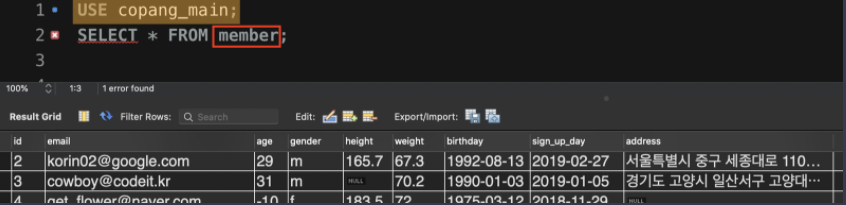

  위 그림의 **USE copang_main;** 은 copang_main이라는 데이터베이스를 사용하겠다고 확실히 선언하는 것입니다. 그리고 그 뒤로는 그냥 테이블 이름만 써도 괜찮습니다. 

  앞으로 여러분이 배울 영상, 노트, 퀴즈, 과제에서는 상황에 따라 데이터베이스 이름을 테이블 이름 앞에 붙이기도 하고, 붙이지 않기도 할 건데요. 그때그때 상황에 맞게 혼용해서 쓸 거니까 당황하실 필요없이, 어떤 테이블을 가리키는지에만 집중하시면 됩니다. 


- #### 조건을 나타내는 다양한 방법

  age가 27 이상

  ```sql
  SELECT * FROM copang_main.member WHERE age>27;
  ```

  30대인 회원들만 조회

  ```sql
  SELECT * FROM copang_main.member WHERE age BETWEEN 30 AND 39;
  ```

  30대만 제외하고 조회

  ```sql
  SELECT * FROM copang_main.member WHERE age NOT BETWEEN 30 AND 39;
  ```

  2019년 1월 1일 이후로 가입한 회원들을 조회하고 싶음. 날짜를 나타내는 컬럼에서는 이렇게 가능함. 

  ```sql
  SELECT * FROM copang_main.member WHERE sign_up_day > '2019-01-01';
  ```

  DATE에서도 BETWEEN가능함. 2018년 가입한 회원 찾기

  ```sql
  SELECT * FROM copang_main.member WHERE sign_up_day BETWEEN  '2018-01-01' AND '2018-12-31';
  ```

  ​	

- #### 문자열 패턴 매칭 조건

  회원들 중에서 서울이 주소인 회원들만 조회하고 싶다면?

  address컬럼값이 '~'**처럼** 생긴 값만 조회하라는 것. 이 표현식의 의미는 문자열의 첫 부분이 서울이라는 단어로 시작되는  뜻. %는 모든 문자열을 나타냄. %는 임의의 길이를 나타냄. 아예 문자열이 없어도 되고, 10자, 100자여도 된다는 것. 

  ```sql
  SELECT * FROM copang_main.member WHERE address LIKE '서울%';
  ```

  그렇다면, 다음은 무슨 뜻일까? 고양시라는 것 앞뒤로 **임의의 길이의 문자열**을 갖는 값을 찾아오라는 것. 

  ```sql
  SELECT * FROM copang_main.member WHERE address LIKE '서울%';
  ```

- #### 조건 표현식

  SELECT 문에서 WHERE 절에 적절한 조건을 설정하는 것은 SQL을 잘 사용하기 위한 첫 걸음입니다. 이전 영상에서 배우지 않은 또다른 조건 표현식들을 배워볼까요?

  **1. 같지 않음 (!=, <>)**

  이전 영상에서는 '같음'을 나타내는 등호(=)를 배웠습니다. 그렇다면 '같지 않음'를 표현하려면 어떻게 해야할까요? **'!='** 기호나 **'<>'** 기호를 사용하면 됩니다. member 테이블의 회원들 중 남자가 '아닌' 회원들만 조회해보겠습니다. 일단 != 을 써볼게요.

  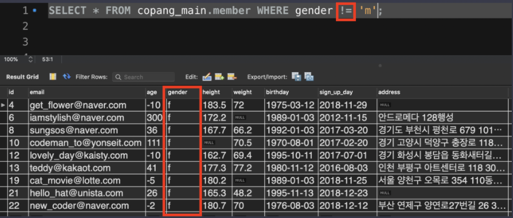

  남성이 아닌, 그러니까 여성 회원들만 잘 조회되었죠? 이번에는 <>를 써보겠습니다.

  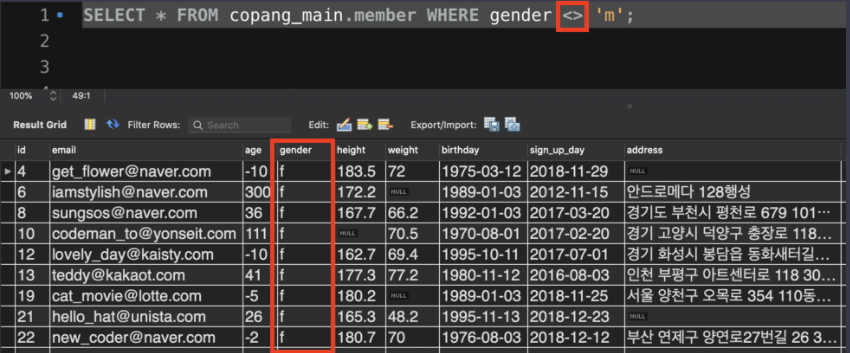

  마찬가지로 ‘여성’ 회원들만 잘 조회되었습니다. 

  **2. 이 중에 있는~ (IN)**

  이전 영상에서 우리는 어떤 범위를 나타내기 위해 사용하는 **BETWEEN a AND b(a부터 b까지)** 구문을 배웠습니다. 그런데 만약 이렇게 연속된 범위 말고, 여러 값들 중에서 해당하는 값이 있는 row들만 추려야할 때도 있는데요. 예를 들어, 현재 회원 중에서 나이가 딱 20살, 또는 딱 30살인 회원들만 조회하려면 어떻게 해야 할까요? 이렇게 써주면 됩니다. 

  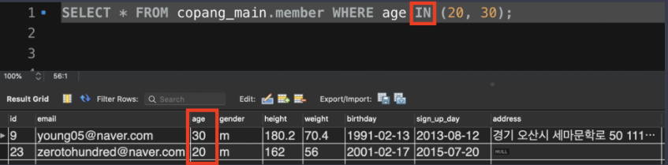

  지금 **WHERE age IN (20, 30)**은 age 컬럼의 값이 20이거나, 30이어야 한다는 조건을 의미합니다. 결과를 보니 잘 조회되었죠? 이 IN은 상당히 유용하게 사용되는 조건 표현식이니까 잘 기억해두세요. 

  **3. 한 글자를 나타내는 _** 

  이전 영상에서 문자열 패턴 매칭 조건을 배울 때 **LIKE 뒤의 ‘%’**는 임의의 길이를 가진 문자열(0자도 포함)을 나타낸다고 했습니다. 그런데 %말고 언더바(_) 하나 기호도 있는데요. LIKE 뒤의 언더바 하나는 문자 하나를 나타냅니다. 

  잠깐 member 테이블에서 이메일 주소가 **c로 시작**하고, 그 뒤에 **여섯 글자가 있는** row들을 조회해볼까요? 

  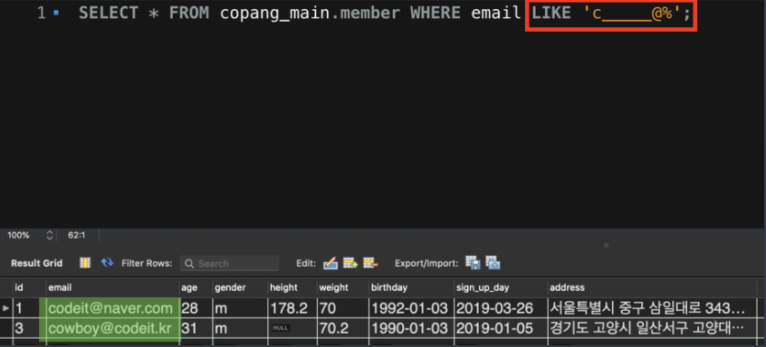

  지금 **LIKE 뒤의 'c_____@%'** 부분이 이해되시나요? 지금 언더바가 소문자 c 뒤에 5개가 있는 상태인데요. 이 표현식은 c로 시작하고, 그 뒤에 다섯 글자 그리고 골뱅이 하나, 그 뒤에 임의의 길이를 가진 문자열이 있는 문자열 패턴을 나타냅니다. 그리고 이 패턴에 해당하는 문자열인 codeit@naver.com과 cowboy@codeit.kr을 email 주소로 가진 회원들만 잘 조회됐습니다. 

  자, 앞으로는 더 다양한 방식으로 조건을 걸 수 있겠죠? SQL을 쓸 때는 조건 표현식 하나를 더 알고 모르느냐에 따라서 작업 효율이 천차만별로 달라집니다. 이때까지 배운 표현식들은 모두 암기하고 사용할 수 있도록 하세요. 


- #### DATE 데이터타입 관련 함수

  SQL을 어느 정도 배우고 나서도 많은 분들이 실무에서 SQL을 자유롭게 사용하지 못하는 경우가 많습니다.

  그 주된 이유 중 하나는 바로 SQL에서 제공하는 **함수**를 자유자재로 사용하지 못하기 때문입니다.

  사실 SQL의 핵심 기능들은, 다 배우고 나면 그렇게 어렵지는 않습니다. 하지만 SQL 문을 아무리 잘 쓰더라도 저장된 데이터를 내가 원하는 형태로 변환하기 위해 필요한 함수를 모르면 원하는 작업을 할 수가 없습니다. 그래서 SQL에서 쓸 수 있는 다양한 함수들을 익히는 것도 중요한데요.

  이번 토픽에서는 SQL을 쓸 때, 여러분이 필수적으로 알아야할 함수들을 차근차근 노트로 정리해나갈 예정입니다.

  일단 이번 노트에서는 DATE 타입의 값들을 다루는 대표적인 함수들을 다뤄보겠습니다. 

  우리가 테이블을 다루다 보면 날짜를 나타내는 값들, 정확히 말해 DATE 데이터 타입을 갖는 컬럼의 값들을 다뤄야할 일들이 많습니다. 

  이때 사용할 수 있는 함수들을 배워보겠습니다.

  **1. 연도, 월, 일 추출하기**

  DATE 타입의 값에서 연도(year)만, 혹은 월(month)만, 혹은 일(day)만 추출할 수 있습니다. 어떻게 할 수 있는지 하나씩 살펴볼게요.

  **(1) 1992년에 태어난 회원들만 조회하기**

  ```sql
  SELECT * FROM copang_main.member WHERE YEAR(birthday) = '1992';
  ```

  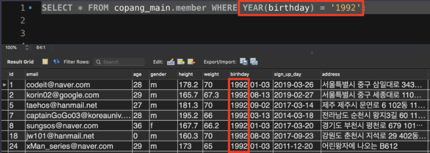

  위 그림에서처럼 **YEAR 함수**를 사용하면 날짜 값에서 연도만 뽑아낼 수 있습니다.

  **(2) 여름(6, 7, 8월)에 가입한 회원들만 조회하기** 

  ```sql
  SELECT * FROM copang_main.member WHERE MONTH(sign_up_day) in (6, 7, 8);
  ```

  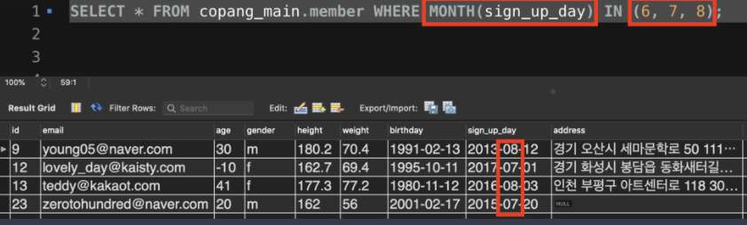

  위 그림처럼 **MONTH 함수**를 사용하면 날짜값에서 월만 뽑아낼 수 있습니다. 지금 그 뒤에는 이전 노트에서 배운 [**IN 조건 표현식**](https://www.codeit.kr/learn/3164/)을 사용해봤습니다. 위 그림을 보니 여름에 가입한 회원들만 잘 조회되네요. 

  **(3) 각 달의 후반부(15일~31일)에 가입했던 회원들만 조회하기**

  ```sql
  SELECT * FROM copang_main.member WHERE DAYOFMONTH(sign_up_day) BETWEEN 15 AND 30;
  ```

  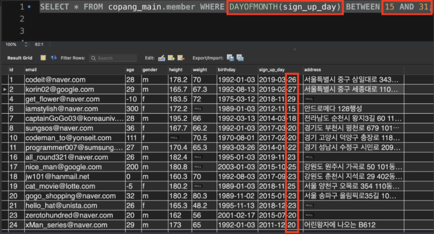

  **DAYOFMONTH 함수**는 날짜값에서 일만 뽑아낼 수 있습니다. 그 뒤에는 이전에 배운 **BETWEEN a AND b 구문**을 사용해봤습니다. 각 달의 후반부(15일~31일) 사이에 가입한 회원들만 잘 조회되네요. 

  **2. 날짜 간의 차이 구하기**

  ```sql
  SELECT email, sign_up_day, DATEDIFF(sign_up_day, '2019-01-01') FROM copang_main.member;
  ```

  날짜 간의 차이를 구하는 함수도 있습니다. DATEDIFF라는 함수인데요. 여기서 DATE는 날짜, DIFF는 Difference의 줄임말로 '차이'라는 뜻입니다.

  **DATEDIFF(날짜 a, 날짜 b)**를 사용하면 '날짜 a - 날짜 b'를 해서 그 차이 일수를 알려줍니다. 예를 들어,

  DATEDIFF(’2018-01-05’, ’2018-01-03’)의 값은 2입니다.

  member 테이블에서 각 회원이 가입한 일자가 2019년 1월 1일을 기준으로 몇 일 이후인지를 알아보겠습니다. 아래 SQL 문을 자세히 살펴보세요.

  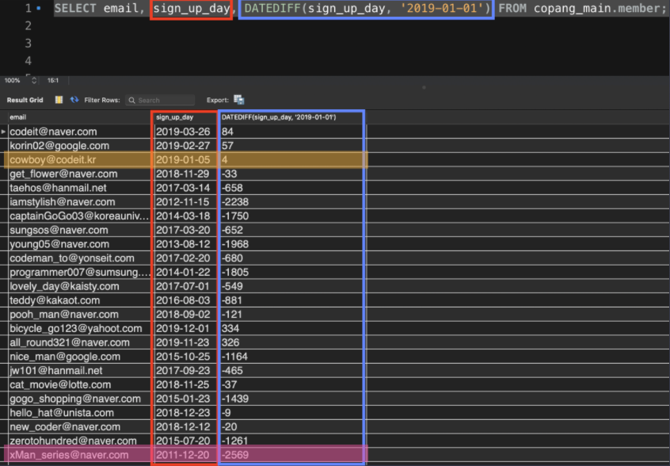

  실행결과에는 총 3개의 컬럼이 보입니다. email, sign_up_day, 그리고 sign_up_day에서 2019년 1월 1일을 뺀 값이 담긴 컬럼, 이렇게 3개인데요. 꼭 테이블에 원래 있던 컬럼이 아니더라도 조회할 때는 이런 식으로 새로운 컬럼을 붙여서 볼 수도 있습니다. 

  지금 보니까 가장 최근에는 cowboy라는 회원이 가입했고, 가입한지 가장 오래된 회원은 2011년에 가입한 xMan_series라는 회원이라는 것을 알 수 있습니다. 

  그리고 이것 말고도 오늘 날짜를 기준으로 살펴보는 것도 가능한데요. 오늘 날짜를 구하는 함수는 **CURDATE()**입니다.

  ```sql
  SELECT email, sign_up_day, DATEDIFF(sign_up_day,CURDATE()) FROM copang_main.member;
  ```

  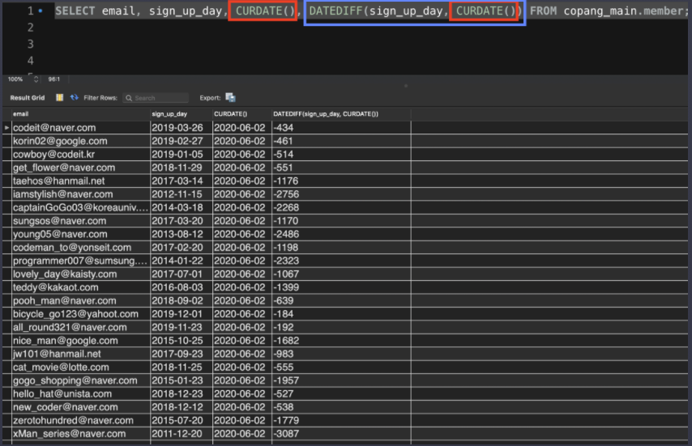

  이 노트가 작성된 날짜는 2020년 6월 2일입니다. 위 그림을 보니 오늘 날짜와의 차이도 잘 출력되었죠? 

  이번엔 회원들이 몇 살이었을 때 코팡에 가입했는지를 알아볼까요? **가입일(sign_up_day)-생일(birthday)** 값을, 1년이 365일이니까 365로 나눠주면 각 회원이 몇 살일 때, 코팡에 가입했는지 알 수 있습니다. 

  ```sql
  SELECT email, sign_up_day, DATEDIFF(sign_up_day, birthday) FROM copang_main.member;
  ```

  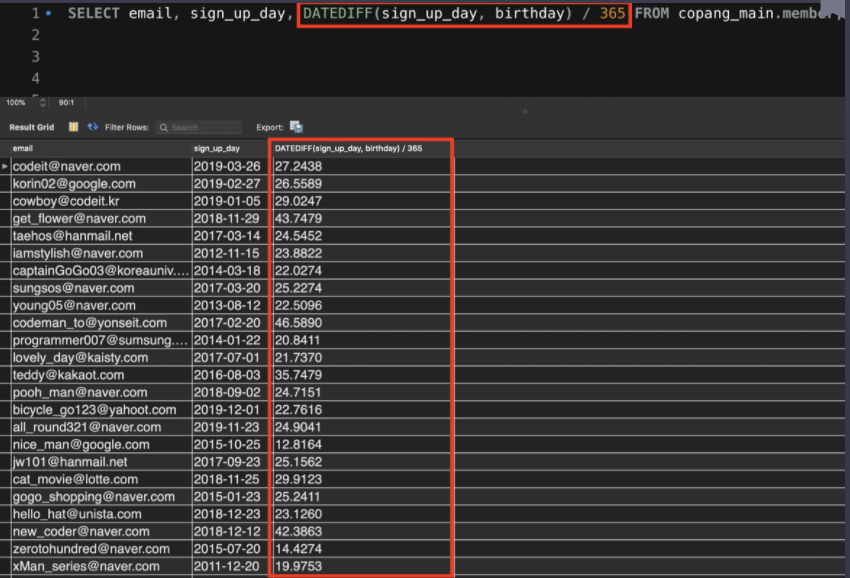

  결과를 보니까 많은 회원들이 20대, 30대일 때 많이 가입을 했네요. 

  **3. 날짜 더하기 빼기** 

  ```sql
  SELECT email, sign_up_day, DATE_ADD(sign_up_day, INTERVAL 300 DAY) FROM copang_main.member;
  ```

  

  ```sql
  SELECT email, sign_up_day, DATE_SUB(sign_up_day, INTERVAL 300 DAY) FROM copang_main.member;
  ```

  날짜에서 며칠을 더하고 빼는 것도 가능한데요. 더하는 함수는 **DATE_ADD()**, 빼는 함수는 **DATE_SUB()**입니다. 

  예를 들어, 가입일(sign_up_day) 기준으로 300일 이후의 날짜를 구하려면 이렇게 쓰면 됩니다. 

  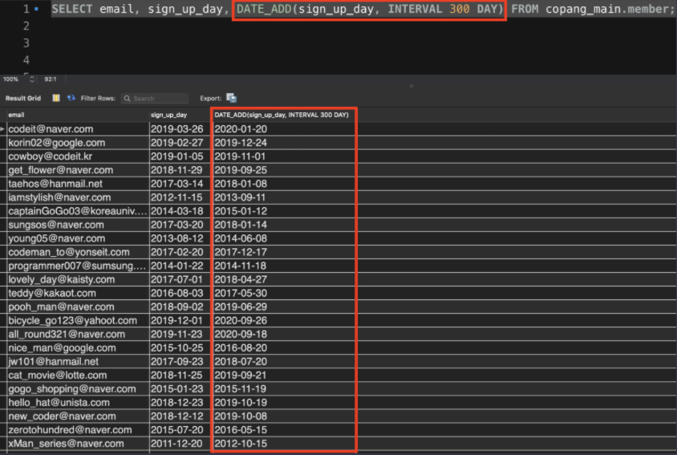

  지금 **DATE_ADD(sign_up_day, INTERVAL 300 DAY)**라고 적힌 부분은 sign_up_day 컬럼의 값에 300일을 더한 날짜를 나타냅니다. 

  만약 가입일(sign_up_day) 기준 250일 이전의 날짜를 구하고 싶으면 이렇게 쓰면 됩니다.

  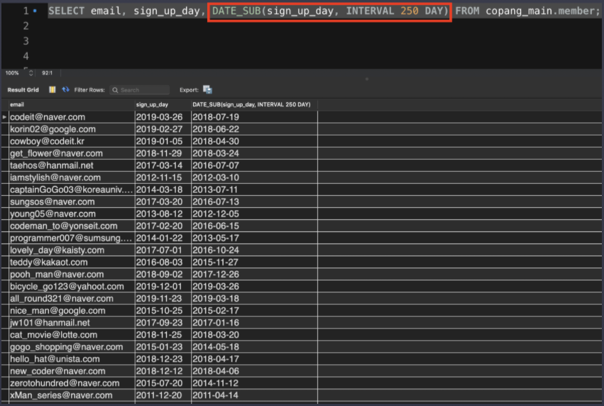

  특정 날짜에서 몇 일 후, 몇 일 전 날짜를 구해야할 때 이 함수들을 쓰면 유용하겠죠? 

  **4. UNIX Timestamp 값** 

  지금 member 테이블에서 날짜를 나타내는 컬럼(birthday, sign_up_day)은 있지만, 시간을 별도로 나타내는 컬럼은 없습니다. 날짜뿐만 아니라 시간까지 포함하는 컬럼이라면 DATETIME이라는 데이터 타입을 사용해야하는데요. DATETIME 타입의 컬럼에는 보통 '2018-12-31 23:54:59’ 이런 식으로 값들이 저장되어 있습니다.

  그런데 문제는 어떤 테이블에는 날짜와 시간이 이렇게 예쁜 형식으로 적혀있는게 아니라, 1553526000 이런 식으로 상당히 큰 숫자값이 적혀있는 경우들이 꽤 많다는 겁니다. 이것 또한 날짜와 시간을 나타내는 값인데요. 이런 형식의 날짜시간 값을 UNIX Timestamp라고 합니다. UNIX Timestamp는 특정 날짜의 특정 시간을, **1970년 1월 1일을 기준으로, 총 몇 초가 지났는지로 나타낸 값입니다.** 

  정확히 어떤 건지 보여드리겠습니다. DATE 타입의 값을 Unix Timestamp로 바꿔주는 함수가 있는데요. sign_up_day 컬럼의 날짜값을 한번 Unix Timestamp로 변환해보겠습니다.

  ```sql
  SELECT email, sign_up_day,UNIX_TIMESTAMP(sign_up_day) FROM copang_main.member;
  ```

  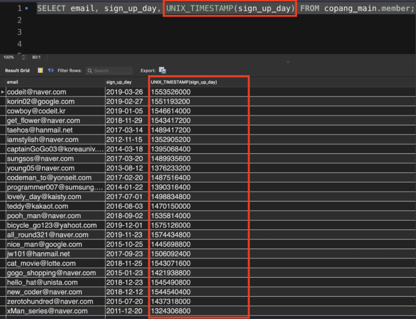

  UNIX_TIMESTAMP라는 함수를 쓰면 되는데요. 지금 빨간 박스 안에 상당히 큰 숫자값들이 보입니다. 이 값들은 모두 각 날짜가 1970년 1월 1일을 기준으로 몇 초가 지난 것인지를 나타냅니다. 실무에서 여러분은 깔끔한 형식의 날짜 또는 시간뿐만 아니라 이런 Unix Timestamp를 보게될 수도 있습니다.

  만약 여러분이 테이블에서 이런 Unix timestamp를 보게 된다면 이걸 사람이 읽을 수 있는 날짜 형태로 바꿔서 보면 되는데요.

  그럴 때는 FROM_UNIXTIME 함수를 사용하면 됩니다. 

  ```sql
  SELECT email, sign_up_day,FROM_UNIXTIME(UNIX_TIMESTAMP(sign_up_day)) FROM copang_main.member;
  ```

  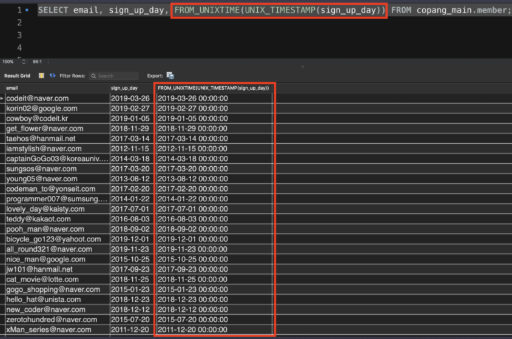

  Unix timestamp를 다시 집어넣었더니 원래 날짜가 그대로 잘 나왔습니다. 대신 이번엔 시간 정보도 포함해서(00:00:00) 출력되었네요. 

  혹시 날짜와 시간을 나타내는 컬럼이라고 하는**데 뭔가 큰 숫자가 들어있다면, Unix timestamp가 아닌지 의심해보세요. 그리고 방금 배운 함수로 DATETIME 형식으로 변환해서 보시면 됩니다.**

  자, 이때까지 DATE 타입의 값들을 다룰 수 있는 유용한 함수들을 알아보았습니다. 이밖에도 '시간을 나타내는 TIME 타입', 방금 설명했던 '날짜, 시간을 함께 나타내는 DATETIME 타입', 그리고 이것들과 관련된 또다른 함수들도 많습니다. 혹시 이런 내용들에 관해 더 자세하게 알고 싶은 분들은 아래 MySQL 공식 매뉴얼을 참조하세요.

  날짜, 시간 관련 데이터 타입 : https://dev.mysql.com/doc/refman/8.0/en/date-and-time-types.html

  날짜, 시간 관련 함수 : https://dev.mysql.com/doc/refman/8.0/en/date-and-time-functions.html

  그리고 MySQL이 아닌 다른 DBMS를 쓰는 분들은 이 페이지 내용을 보고 그대로 따라하시면 안 되고, 여러분이 쓰시는 DBMS의 매뉴얼 페이지를 참조해서 원하는 함수를 찾아야합니다. 이번 토픽에서 SQL의 기초 개념과 기본 함수들을 배우고, 여러분이 매 상황마다 필요한 함수들을 잘 검색하는 능력을 기른다면 여러분의 데이터 분석 능력은 급속도로 좋아질 겁니다. 


- #### 여러개의 조건 걸기

  성별이 남자면서 주소가 서울?

  ```sql
  SELECT * FROM copang_main.member WHERE gender = 'm' AND address LIKE '서울%' ;
  ```

  여기서 나이 25세 이상 29세 이하의 조건을 추가하면? 

  ```sql
  SELECT * FROM copang_main.member WHERE gender = 'm' AND address LIKE '서울%' ;
  ```

  or은 앞 뒤 조건 중 하나라도 만족하는 것을 찾아줌. 

  봄 또는 가울에 코팡에 가입한 회원. 

  ```sql
  SELECT * FROM copang_main.member 
  WHERE 
  MONTH(sign_up_day) BETWEEN 3 AND 5
  OR MONTH(sign_up_day)  BETWEEN 9 AND 11;
  ```

  남자 중에 키 180이상, 여자 중에서 키 170 이상 조회해 보기. 

  괄호를 잘 활용하기. 줄 바꿈이 자유로우니깐 이래야 가독성이 좋음. 

  ```sql
  SELECT * FROM copang_main.member WHERE 
  (gender = 'm' AND height > 180) OR (gender ='f' AND height>170);
  ```


- #### 여러 조건을 걸 때 주의할 점

  이때까지 SQL 문에서 조건을 거는 다양한 방법을 배웠습니다. 그런데 조건을 걸 때 흔히 하기 쉬운 두 가지 실수가 있는데요. 한번 살펴볼게요. 

  **1. OR를 사용할 때의 주의사항**

  이런 SQL 문이 있다고 해봅시다.

  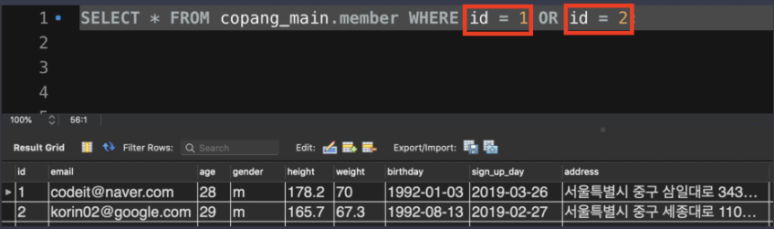

  이 SQL 문과 그 실행결과는 잘 이해되시죠? 

  그런데 이 SQL 문을 간혹 이렇게 적으시는 분들이 있습니다. 

  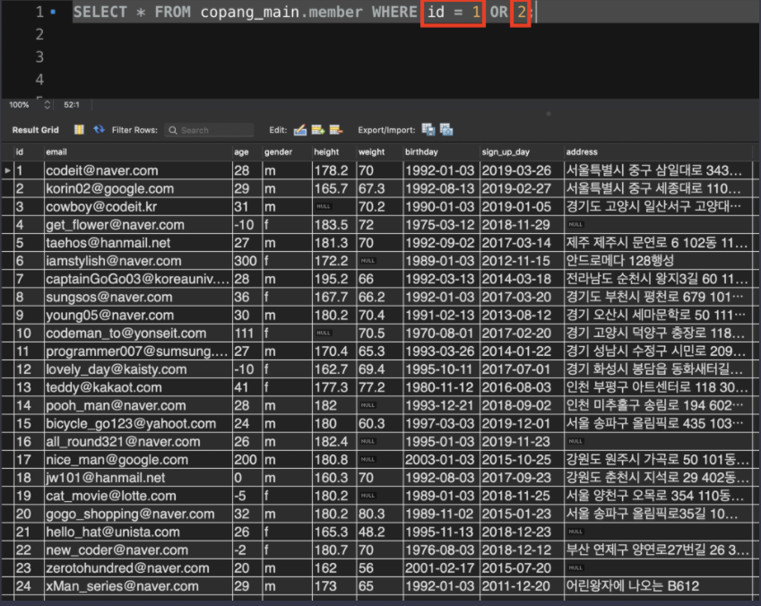

  **WHERE id = 1 OR id = 2** 라고 적었어야할 부분에, **WHERE id = 1 OR 2** 라고 적어버리는 실수인데요. 이렇게 쓰면 지금 그림에 보이는 것처럼 테이블의 모든 row가 출력되어 버립니다. 왜 그럴까요?

  지금 실수로 쓴 **WHERE id = 1 OR 2**를 분해해서 보면 크게

  (1) id = 1 이 TRUE

  (2) 2

  이 두 부분으로 나눌 수 있습니다.

  문제는 (2) 부분입니다. MySQL에서는 0을 False, 0 이외의 숫자는 모두 **True**로 간주합니다. 따라서 (2) 부분은 항상 True가 되어버립니다. 

  즉, **WHERE id = 1 OR 2는 곧**

  **WHERE id = 1 OR TRUE**

  **와 같은 뜻이라는 건데요.** 이렇게 되면 결국 어떤 row든 다 이 조건을 만족하게 되버립니다. 그래서 위 그림에 보이는 것처럼 모든 row가 출력되는 거죠. 

  OR을 사용할 때, 이런 실수를 하지 않도록 조심하세요

  **2. AND와 OR 간의 우선순위** 

  이번에는 AND와 OR을 함께 사용할 때 흔히 하기 쉬운 실수를 알아보겠습니다. 아래의 SQL문을 보세요.

  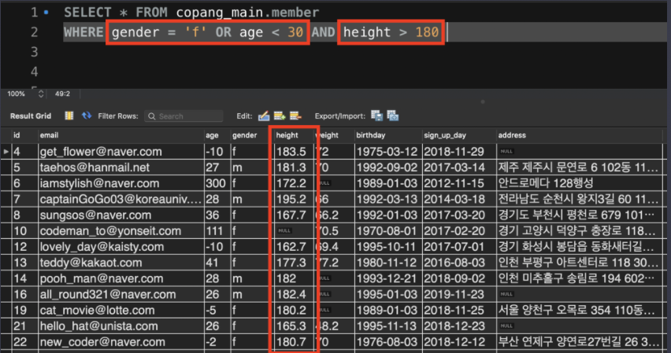

  저는 지금

  (1) 성별이 여자이거나(OR) 나이가 30세 미만 

  ‘이면서’(AND)

  (2) 키는 180 이상인 회원들을

  조회하려고 합니다. 그런데 지금 실행 결과를 보면 height 컬럼의 값이 180 이하인 회원들도 많이 보입니다. (2) 키는 180 이상이라는 조건을 만족하는 row들이 조회되어야 하는데 어떻게 된 걸까요? 

  이런 결과가 출력된 이유는, SQL 문이 실행될 때, **AND가 OR보다 우선순위가 더 높기 때문입니다.** 즉, AND가 OR보다 먼저 실행된다는 거죠. 

  그래서 제가 쓴 위의 SQL 문은 사실 아래 그림처럼 

  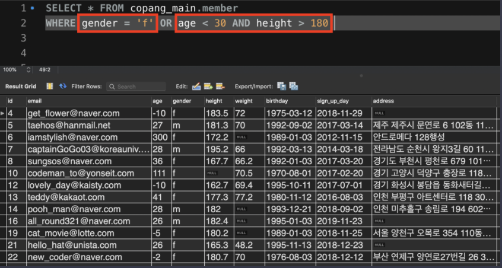

  이렇게 

  (1) 성별이 여자이거나(OR)

  (2) 나이가 30세 미만이면서(AND) 키가 180 이상인 회원들을

  조회하는 것으로 해석되는 겁니다.

  AND가 OR보다 우선순위가 높다는 사실을 모르면 이런 실수를 하기 쉬운데요. 그럼 매번 이런 우선순위 정보를 기억해야할까요? 그럴 필요는 없습니다.

  이런 우선순위를 신경쓰는 것보다는 **사용자가 그냥 ‘먼저 실행되기를 원하는 조건’을 괄호로 씌워주는 게 좋습니다.** 그 이유는 괄호는 AND보다도 우선순위가 높기 때문입니다.

  그러니까 만약 원래 제가 의도했던 결과를 얻으려면 아래 그림처럼 

  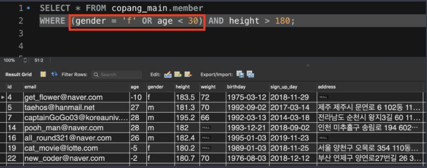

  먼저 실행되기를 원하는 부분에 괄호를 씌워주면 됩니다. 실행 결과를 보니 제가 의도한 결과가 잘 출력되었네요. 이렇게 조건에 괄호를 씌워주면 AND와 OR 사이의 우선순위를 신경쓰지 않아도 되고, 나중에 SQL 문을 다시 읽었을 때도 이해하기 편하다는 장점이 있습니다. 여러 조건을 걸 때는 이렇게 조건 단위로 괄호를 씌워주는 습관을 들이시면 좋습니다.


- #### 문자열 패턴 매칭 조건을 사용할 때 주의할 점. 

  우리는 문자열 패턴 매칭 조건에 관해서 아래 3가지를 배웠습니다. 

  - **LIKE : 문자열 패턴 매칭 조건을 걸기 위해 사용되는 키워드** 
  - **% : 임의의 길의를 가진 문자열(0자도 포함)** 
  - **_ : 한 자리의 문자**

  혹시 이 3가지가 뭔지 기억이 안 나시면 이전 내용들을 복습하고 와주세요. 

  그런데 문자열 패턴 매칭 조건을 걸 때는 2가지 주의할 점이 있습니다. 하나씩 살펴볼게요. 

  **1. 이스케이핑(escaping) 문제**

  예를 들어 이 test라는 테이블을 잠깐 봅시다. 

  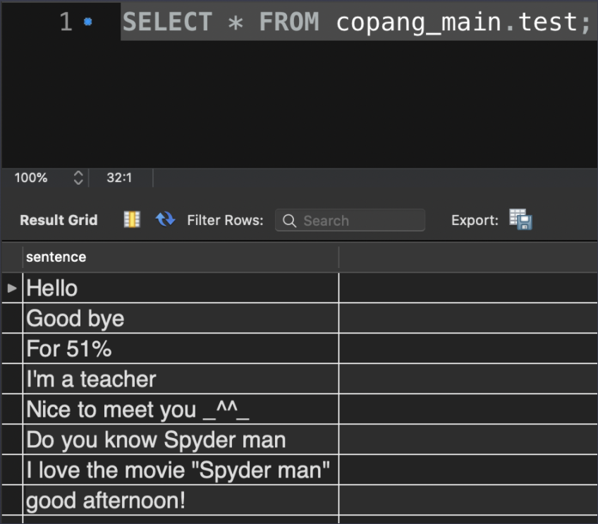

  test 테이블 안에는 **sentence**라는 컬럼 하나가 있는데요. 

  각 row의 값들을 보면 

  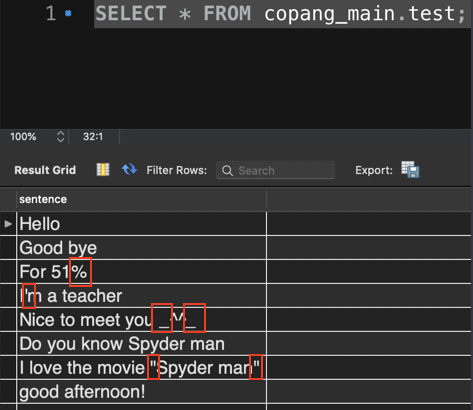

  위 그림의 빨간 박스 표시처럼

  **%** 

  **'** 

  **_** 

  **"** 

  와 같은 문자들이 있습니다. 그런데 이런 문자들은 일반적인 문자임과 동시에 '어떤 것이 문자열이라는 것을 나타내거나(' / "), 문자열의 특정 패턴을 나타내는' 표현식(%, _)들인데요.

  잠깐 이 테이블에서 sentence 컬럼에 퍼센트 기호(%)가 포함된 row를 찾아야한다고 해봅시다. 

  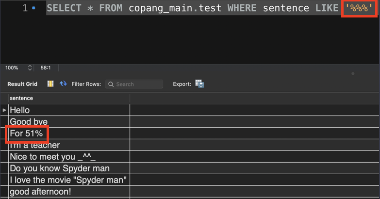

  우리가 이전에 배운대로 먼저 %를 써주고 그 앞 뒤로 임의의 길이의 문자열을 나타내는 %를 또 써준 뒤, 실행했습니다. 하지만 위 결과를 보니 우리가 예상했던 ‘For 51%’만 나온 게 아니라 전체 row가 조회되어버렸습니다. 그 이유는 바로 정가운데 %가 우리가 원하는 **'문자로서의 %'**가 아니라 **'LIKE에서 쓰이는 표현식'**으로 간주되어, ‘임의의 길이를 가진 문자열’을 나타내는 것으로 해석되었기 때문입니다.

  그렇다면 이런 표현식이 아니라 '문자로서의 %'를 나타내려면 어떻게 해야 할까요?

  이렇게 써주면 됩니다. 

  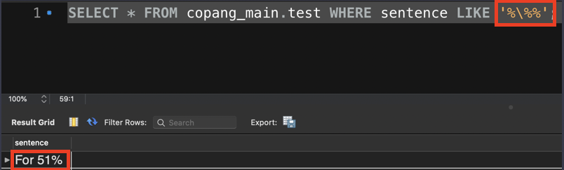

  위 그림을 보면 가운데 % 앞에 **역슬래쉬(백슬래쉬, backslash) 기호**를 붙여주니까, 우리가 원하는 대로 'For 51%'만 조회됐습니다. 가운데 %가 '문자로서의 %'로 해석이 잘 된 겁니다.

  방금 한 것처럼 원래 특정 의미('임의의 길이를 가진 문자열')를 나타내던 문자(%)를 그 특정 의미가 아니라, 일반적인 문자처럼 취급하는 행위를 **이스케이핑(escaping)**이라고 합니다. 이스케이핑은 IT 분야에서 자주 등장하는 단어인데요. **어떤 문자가 그것에 부여된 특정한 의미, 기능으로 해석되는 게 아니라 그냥 단순한 문자 하나로 해석되도록 하는 것을 이스케이핑이라고 하는 거죠.**

  MySQL에서 이스케이핑을 하는 방법은 해당 문자 앞에 역슬래쉬를 붙여주는 겁니다. 다른 것들로도 실험해보겠습니다. 

  **(1) ' (작은따옴표) 이스케이핑** 

  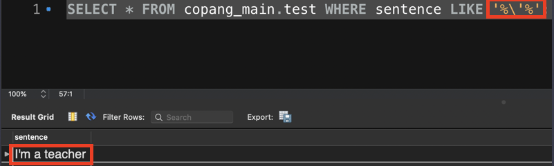

  **(2) _(언더바) 이스케이핑**

  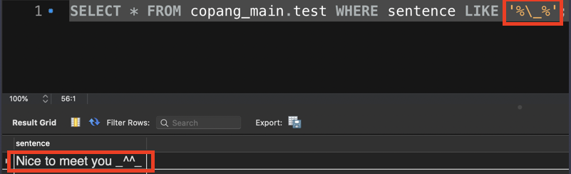

  **(3) “(큰따옴표) 이스케이핑**

  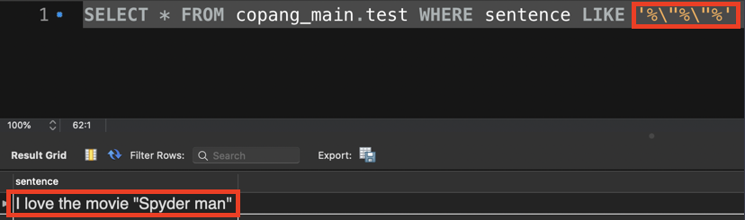

  자, 이제 이스케이핑이 뭔지 알겠죠? 이미 특수한 기능(의미)을 갖고 있는 문자를, 그 특수한 기능(의미)이 아닌, 문자 그대로 해석하고 싶을 때는 이렇게 이스케이핑을 해주면 됩니다. 

  **2. 대소문자 구분 문제**

  자, 방금 전 사용한 테이블에서 이번에는 **소문자 g**가 포함된 값들을 찾아보겠습니다. 

  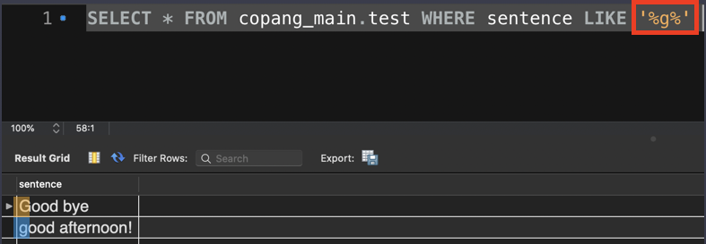

  그런데 뭔가 이상합니다. 저는 분명히 조건식에 **소문자 g**를 썼는데 **대문자 G**가 포함되어 있는 row도 함께 조회가 되어버렸네요. 

  왜 그런 걸까요? 이것은 MySQL의 기본 설정 때문입니다. 

  잠깐 이 테이블에 적용된 기본 설정을 보는 방법을 알려드릴게요.

  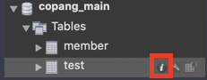

  위 그림의 **i 표시**를 클릭하면 test 테이블에 적용된 설정들을 볼 수 있습니다. 

  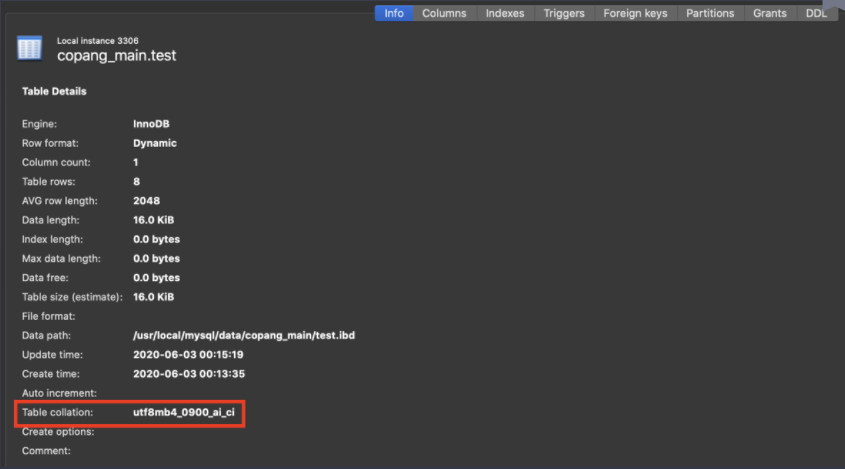

  여러 항목들 중에서 **Table collation** 항목을 봅시다. 이 항목은 문자열이 서로 동일한지를 비교할 때 적용되는 설정을 나타내는데요. 그 뒤에 **utf8mb4_0900_ai_ci** 라는 값이 써있습니다. 이 단어의 의미를 모두 당장 설명하기는 힘듭니다. 하지만 여기서 **ci** 부분의 의미는 알아야합니다. **ci**는 **case-insensitive**의 약자로 문자열이 동일한지 확인할 때, 대소문자를 구별하지 않겠다는 뜻입니다. 

  바로 이 설정 때문에 아까 대소문자가 달라도 알파벳만 같으면 같다고 판단이 되버린 겁니다. 만약 이 설정을 다른 걸로 변경하면 대소문자 구분을 하도록 바꿀 수도 있습니다. 하지만 실무에서는 여러분이 데이터베이스 관리자가 아니라면 MySQL 설정을 맘대로 바꿔서는 안 되고, 애초에 그럴 수 있는 권한도 없을 겁니다. 

  따라서 어떤 설정에서든 대소문자 구분을 할 수 있는 방법이 필요한데요. 사실 설정에 상관없이 늘 대소문자를 구분하도록 할 수 있습니다. 아래 SQL 문을 봅시다.

  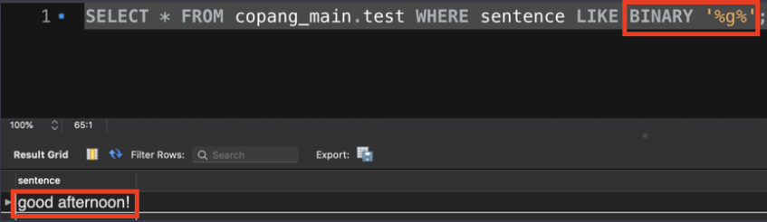

  지금 '%g%' 앞에 **BINARY**라는 단어를 붙였죠? 실행 결과를 보니 소문자 g가 포함된 문자열만 잘 조회되었네요. BINARY란 ‘이진의, 0과 1로 된’이라는 뜻을 가집니다. 혹시 ‘컴퓨터에서 숫자, 문자 등 모든 것들은 0 또는 1로 표현된다’라는 말은 들어보신 적 있나요? **BINARY를 붙여준다는 것은 해당 0과 1이 정확히 일치하는 것을 찾으라는 뜻**입니다. 소문자 g와 대문자 G는 같은 알파벳이긴 하지만, 컴퓨터에서 0과 1의 조합으로 저장될 때 다른 값으로 저장됩니다. 그리고 BINARY를 붙이는 건 단지 알파벳 비교 뿐만 아니라 대소문자 구분까지 할 수 있도록 0과 1을 보는 수준까지 문자열 비교를 하라는 뜻인 거죠. 

  이번엔 대문자 G와 BINARY를 함께 써볼까요?

  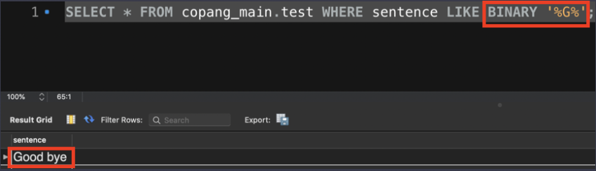

  이번에도 역시 대문자 G가 있는 문자열만 잘 조회됩니다. 

  이 대소문자 구분 문제는 문자열 패턴 조건을 사용하시는 많은 분들이 처음에 당황해하는 부분입니다. MySQL 설정에 상관없이 대소문자를 명확하게 구분하고 싶다면 **BINARY**를 잘 활용해보세요. 

  

- #### 데이터 정렬해서 보기

  **SQL에서 정렬이란, 'row들을', '특정 컬럼을 기준으로', '순서대로 출력'.**

  현재 멤버 테이블을 'height'컬럼을 기준으로 정렬하기. 

  오름차순 정렬 *키가 작은 사람부터 시작해서 큰 사람으로*

  ```sql
  SELECT * FROM copang_main.member 
  ORDER BY height; 
  ```
	원래는 ASC를 써줘야 하는데, default값이라 생략한 것. 
  
  그런데, 그래도 나중에 보면 헷갈릴 수 있어서, **ASC**를 써 주는 것이 좋음. 
  
  ```sql
  SELECT * FROM copang_main.member 
  ORDER BY height ASC; 
  ```
  
  정렬된것을 보면, NULL부터 나오고 있음. 정렬할때, 이런식으로 NULL은 가장 작은 값으로 나타남. 다만, ***정렬을 할 때, NULL이 어떻게 취급되는지는 DBMS에 따라 다름.*** 애초에 제외하고 작업하는게 더 좋음. 
  
  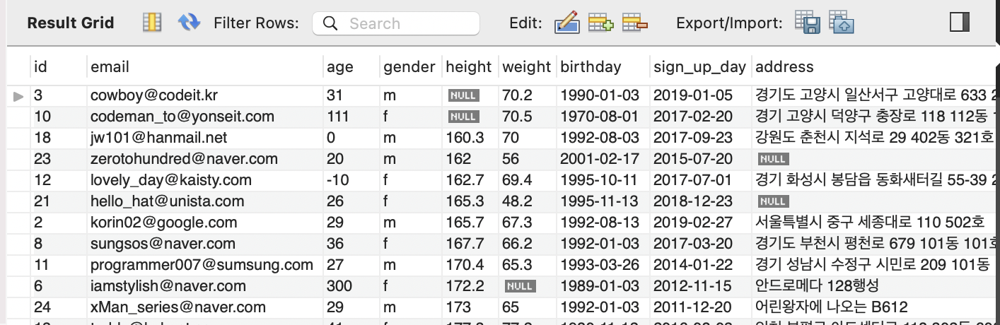
  
  내림차순은? *키가 큰 사람부터 시작해서 작은사람으로*
  
  ```sql
  SELECT * FROM copang_main.member 
  ORDER BY height DESC; 
  ```
  
  이번에는 조건을 걸고 정렬. 
  
  **SQL에서 WHERE는 ORDER앞에 나와야 함.** 
  
  ```sql
  SELECT * FROM copang_main.member
  WHERE gender = 'm'
  	AND weight >= 70
  ORDER BY height ASC; 
  ```
  
  정렬을 할때, 기준을 여러 개를 둘 수도 있음. 
  
  *전체 회원들에 대해서 가장 최근 가입한 회원부터 내림차순으로 정렬한다면? 그런데 만약 같은 연도에 가입한 회원들은 이메일을 기준으로 오름 차순으로 정렬해 보자.* 
  아래처럼 쓰는 규칙 자체가, 일단 YEAR로 내림차순 정렬을 하고, 
  
  그 안에서 같은 연도인 애들은 email로 오름차순으로 정렬하라는 뜻. 
  
  SQL의 문법이니 딴지걸지 말자. 
  
  ```sql
  SELECT * FROM copang_main.member
  ORDER BY YEAR(sign_up_day) DESC, email ASC;
  ```
  
  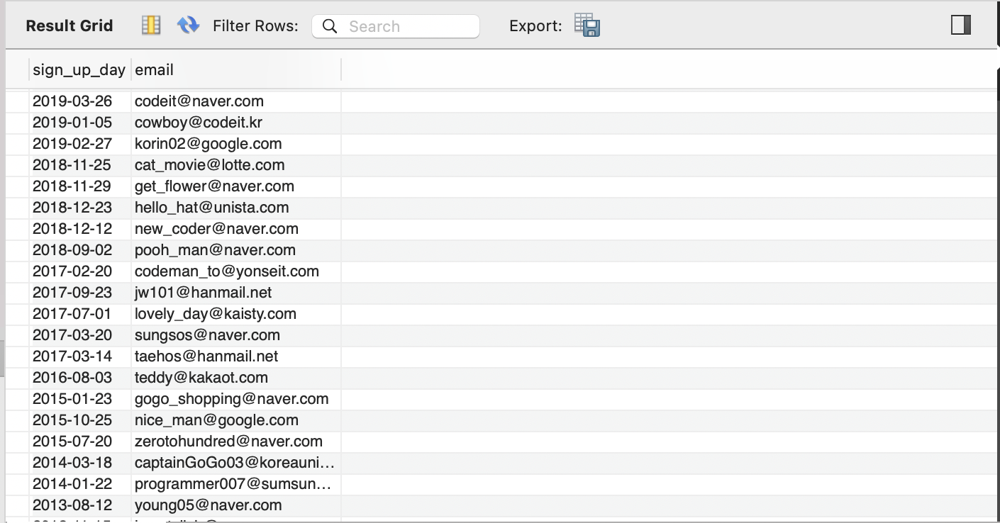


- #### 각 절의작성 순서를 꼭 지켜주세요

  이전 영상에서 저는 **'SQL 문법상 WHERE는 ORDER BY 앞에 나와야한다.'**는 말을 했었습니다. 

  어떤 종류의 SQL 문이든 그 작성 방식에는 정해진 구조와 형식이 있습니다. 특히, 어떤 절이 다른 절보다 먼저 나와야 한다는 '순서의 법칙'은 아주 엄격하게 지켜줘야 하죠. 만약 이 순서를 지키지 않으면 SQL 문을 실행했을 때 에러가 납니다.

  예를 들어 같은 WHERE 절과 ORDER BY 절이더라도 그 순서를 지키면 다음과 같이 잘 실행되지만,

  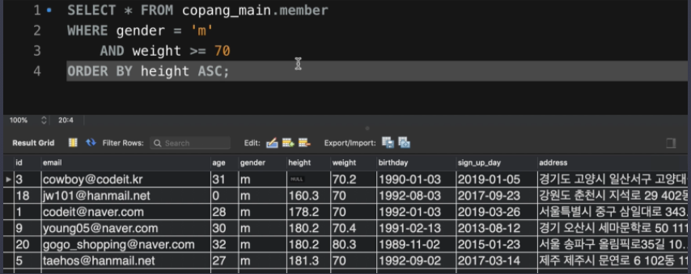

  아래 그림처럼 그 순서를 지키지 않으면

  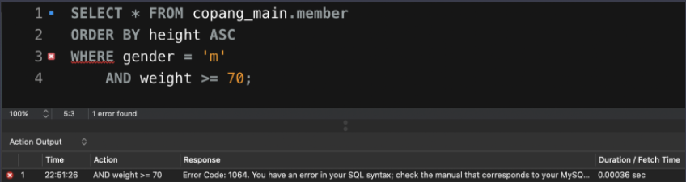

  실행했을 때 에러가 발생합니다.

  사실 SQL을 배울 때는 WHERE 절, ORDER BY 절 등의 의미를 아는 것 뿐만 아니라 각 절들 간의 작성 순서를 아는 것도 중요합니다. 하지만 이런 순서를 꼭 의식적으로 외울 필요는 없고, 배우다 보면 자연스럽게 익숙해지실 거니까 너무 걱정하지 마세요. 

  혹시 MySQL에서 SELECT 문 내의 각 절들 간의 작성 순서를 정확히 알고 싶은 분은 [이 링크](https://dev.mysql.com/doc/refman/8.0/en/select.html)를 참조하시면 됩니다.


- #### 정렬할 때 주의할 점

  이전 영상에서 정렬에 대해 잘 배우셨나요? 그런데 정렬을 할 때는 주의해야할 점이 있습니다. 그건 바로 정렬 기준의 데이터 타입이

  (1) **숫자형**(INT 등)인 경우와,

  (2) **문자열형**(TEXT 등)인지에 따라

  정렬 결과가 달라진다는 점입니다. 

  아래 그림을 보면 ordering_test라는 테이블에서 data 컬럼을 기준으로 오름차순 정렬을 하고 있습니다. 

  

  결과를 보니 크기가 작은 수부터 큰 순으로 잘 정렬되었네요. 

  잠깐 이 data 컬럼의 타입을 한번 볼까요? 

  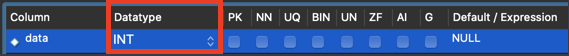

  정수형을 나타내는 INT가 지정되어 있네요. 자, **이 데이터 타입을 한번 INT에서 TEXT로 바꿔보겠습니다.** 

  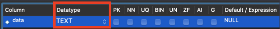

  바꾸고나서 

  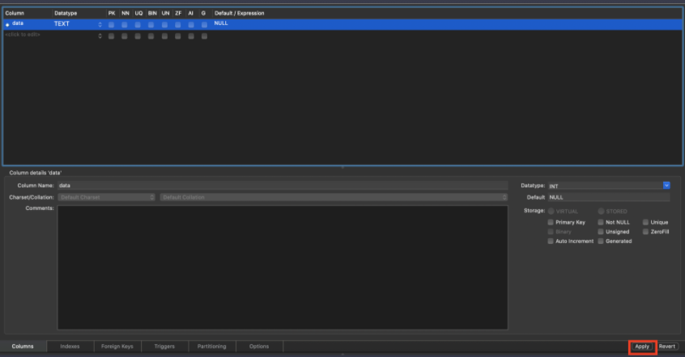

  Apply 버튼을 눌러서 적용할게요. 

  그 다음 다시 정렬을 해보면 

  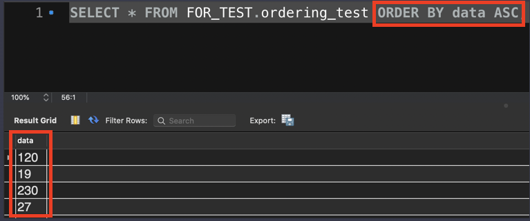

  이번에는 이전과 다른 결과가 나왔죠? 

  왜 그런 걸까요? 그건 INT 타입과 TEXT 타입의 정렬 방식이 다르기 때문입니다.

  **INT 타입의 값은 숫자의 대소(크고 작음)를 기준으로 정렬이 수행되지만,**

  **TEXT 타입의 값은 숫자의 대소가 아니라 한 문자, 한 문자씩 그 문자 순서를 비교해서 정렬이 수행됩니다.** 

  예를 들어 지금 ’120’이 ’19’보다 먼저 나오게 된 것은, 일단 맨 앞의 1을 비교했더니 같았지만, 그 바로 뒷 자리는 문자 2가 문자 9보다 문자 순서상 더 앞에 있는 것이기 때문에 '120'이 더 먼저 나온 겁니다. 그리고 '230'과 '27'을 보면 앞 자리의 2는 같지만 그 다음은 3과 7로, 7이 문자 순서상 더 뒤이기 때문에 27이 더 뒤에 나온 겁니다. TEXT 타입처럼 문자열을 나타내는 데이터 타입들이 정렬 기준으로 사용될 때는 이런 원리가 적용됩니다. 

  그러니까 **숫자값이 담긴 컬럼을 정렬 기준으로 할 때는 그 컬럼의 데이터 타입이 숫자형인지, 문자열형인지를 잘 살펴봐야 하죠.** 

  그런데 이미 TEXT 타입인 컬럼에 있는 숫자값들을, 그냥 INT 등의 숫자형 타입으로 보고 정렬할 수는 없을까요? 가능합니다. 정렬할 때 그 컬럼의 값들의 데이터 타입을 일시적으로 변경해주면 되는데요. 

  이걸 하기 위해서는 **CAST**라는 함수를 써야합니다. CAST는 ‘틀을 만들다', '틀을 정하다'라는 뜻을 가진 영어 단어인데요. 보통 프로그래밍 세계에서 어떤 변수의 데이터 타입을 바꿀 때 사용되는 단어입니다. SQL에서도 같은 의미로 사용되는데요.

  지금 아래 그림의 SQL문을 보면 **CAST(data AS signed)**라는 표현식이 있죠? 이 부분이 바로 data 컬럼에 존재하는 값들의 데이터 타입을 일시적으로 **signed**라는 데이터 타입으로 변환하라는 뜻입니다. 

  **signed**는 처음 보는 데이터 타입인데요. **signed**는 양수와 음수를 포함한 모든 정수를 나타낼 수 있는 데이터 타입입니다. 

  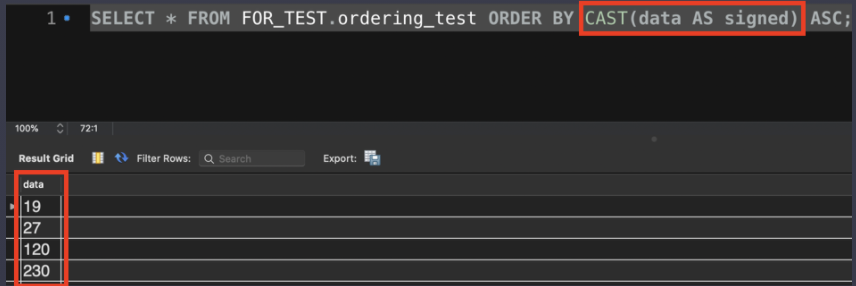

  이 SQL 문을 실행해보면, 이렇게 data 컬럼의 타입이 INT였을 때와 같은 결과가 나옵니다. 방금 말한대로 data 컬럼의 값들이 일시적으로 signed 타입으로 변환되어 해석되었기 때문입니다.

  만약 어떤 컬럼의 숫자값들이 TEXT 같은 문자열 타입으로 저장돼있지만, 정렬 기준으로 쓸 때는 숫자형으로 사용하고 싶다면 CAST 함수를 쓰면 되겠죠?

  참고로 만약 문자열 타입으로 저장된 숫자값에 소수점이 포함되어 있다면 **signed** 대신 **decimal**(소수점이 있는 수를 나타내는 타입)을 적어주고 사용하면 됩니다. 이건 여러분이 직접 실험해보시기를 추천합니다.


- #### 데이터 일부만 추려보기

  정렬된 데이터에서 일부만 추려 보려면?

  ```sql
  SELECT * FROM copang_main.member 
  ORDER BY sign_up_day DESC;
  ```

  여기서 가장 최근에 가입한 회원 10명만 추려서 보려면?

  ```sql
  SELECT * FROM copang_main.member 
  ORDER BY sign_up_day DESC
  LIMIT 10;
  ```

  그럼 가장 최근에 가입한 회원 중에서 9번째, 10번째는?

  *LIMIT 8, 2;* 8번째 row부터 시작해서, 딱 2개의 row만 추리라는 뜻. 

  **여기서 주의해야 할 부분은 row는 0번째 부터 시작한다는 점.** 

  ```
  SELECT * FROM copang_main.member 
  ORDER BY sign_up_day DESC
  LIMIT 8, 2;
  ```


- LIMIT와 Pagination

  이전 영상에서는 **ORDER BY**를 사용해 정렬한 row들을, **LIMIT**을 써서 일부만 추리는 법을 배웠습니다. 이 기능은 여러분이 ‘주간 TOP 10 상품’ 같은 정보를 뽑아내야할 때 사용하면 정말 유용하겠죠? 

  그런데 이 **LIMIT의 개념은 마케터, 데이터 분석가들 뿐만 아니라 개발자들에게도 중요한 개념입니다.** 잠깐 아래 그림을 보세요. 웹사이트를 돌아다니다 보면 사이트 화면 하단에서 이런 그림을 자주 보실 수 있을 겁니다.

  

  주로 검색 결과창이나, 게시판 페이지에서 볼 수 있는 이미지인데요. 우리는 1, 2, 3 버튼을 눌러가면서 한 페이지씩 그 내용들을 살펴보곤 하죠?

  매 페이지에는 아래와 같은 식으로 서로 다른 내용들이 담겨있습니다.

  - 1페이지 : 1~10 번까지의 내용
  - 2페이지 : 11~20 번까지의 내용
  - 3페이지 : 21~30 번까지의 내용
  - 4페이지 : 31~40 번까지의 내용 ...

  우리가 새로운 페이지를 누르면 그때마다, 10개의 새로운 내용들을 로드(load)할 텐데요. 이런 걸 전문 용어로 '**페이지네이션(Pagination)**'이라고 합니다. 전체 결과를 한번에 로드하는 게 아니라 이렇게 페이지 단위로 쪼개서 그때그때 요청이 있을 때마다 부분 결과를 조금씩 로드하는 방식을 말하죠. 

  꼭 위 그림 같은 디자인이 아니더라도, 아래와 같은 디자인도 Pagination에서 자주 사용됩니다. 

  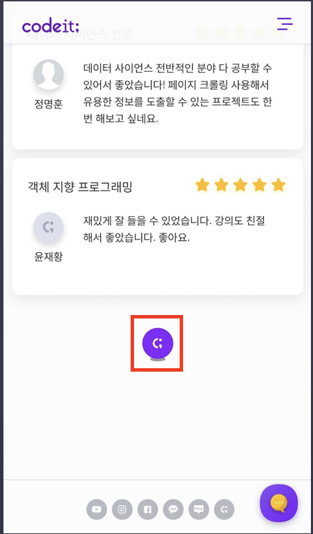

  이 그림은 [코드잇(codeit)의 수강 후기](https://www.codeit.kr/reviews) 모바일 페이지입니다. 사용자가 후기를 더 보기 위해 스크롤을 아래로 어느 정도 이상 내리면, 로딩 중이라는 걸 나타내는 빨간색 박스 안의 아이콘이 잠깐 등장하고, 곧이어 새로운 후기들이 로드됩니다. 아마 많은 모바일 웹, 앱에서 이런 식의 무한 로딩식 페이지를 보셨을 텐데요. 이것도 Pagination과 그 원리는 같겠죠?

  우리가 배운 LIMIT과 이 Pagination은 서로 관계가 깊습니다. 우리가 1, 2, 3 ... 페이지를 순서대로 누를 때마다 그 서버에서 어떤 SQL 문이 실행될지 생각해봅시다. 

  1페이지 : SELECT * FROM db.search_result ~ ORDER BY registration_date DESC **LIMIT 0, 10**

  2페이지 : SELECT * FROM db.search_result ~ ORDER BY registration_date DESC **LIMIT 10, 10**

  3페이지 : SELECT * FROM db.search_result ~ ORDER BY registration_date DESC **LIMIT 20, 10**

  4페이지 : SELECT * FROM db.search_result ~ ORDER BY registration_date DESC **LIMIT 30, 10**

  ...

  만약 우리가 보는 내용이 어떤 테이블에 담겨있다고 한다면 이런 식의 SQL 문이 실행되겠죠?

  (*이는 설명을 위한 가정일 뿐이고, 개발 실무에서는 효율적인 Pagination을 구현하기 위해 훨씬 다양한 기법들이 추가됩니다) 

  이런 Pagination은 개발자들에게도 중요한 주제라는 사실을 알고 계시면 좋습니다. 대신 실제 서비스에 구현된 Pagination은 위 예시처럼 간단하지만은 않습니다. 실제 서비스에서는 저장된 row 수가 너무나도 많기 때문에 각 페이지당 내용을 최대한 빠르게 로드하기 위한 추가적인 기법들이 필요한데요. 이 부분까지는 다루지 않겠습니다. 다만, 우리가 늘 사용하던 인터페이스에 이런 근본적인 원리가 숨어있었다는 사실만큼은 꼭 기억하세요! 

