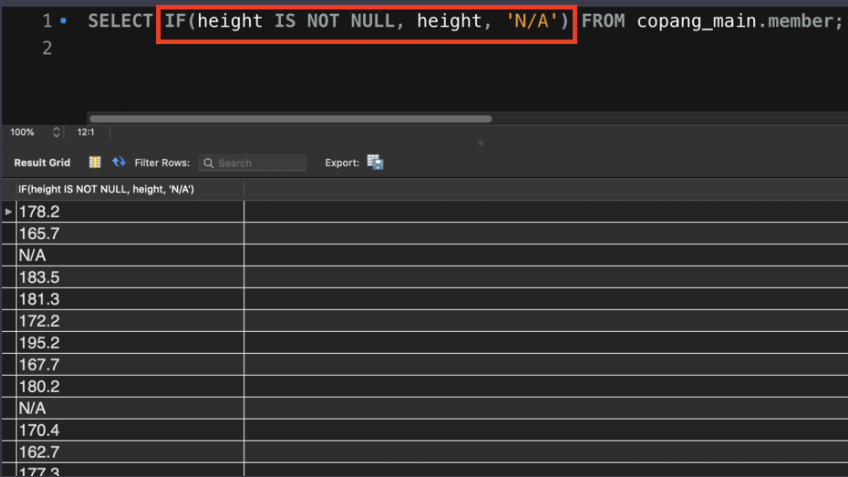
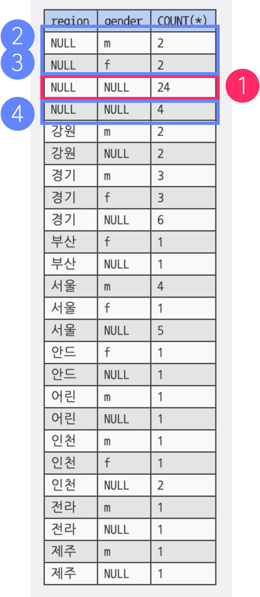
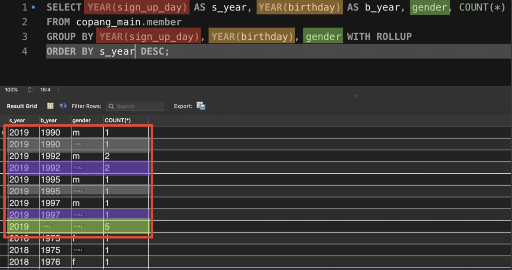

# Basic Concept 3

- #### 데이터의 특성 구하기

  데이터의 특성을 분석해보자. 

  총 row수는 몇개일까? 

  ```sql
  SELECT COUNT(email) FROM copang_main.member;
  ```

  *여기서 중요한 것은 COUNT는 NULL의 갯수는 제외하고 셈.*

  

  테이블의 정확한 row수를 보고 싶을 때는?

  ```sql
  SELECT COUNT(height) FROM copang_main.member;
  ```

  회원들의 키 중에서 가장 큰 키는?

  ```sql
  SELECT MAX(height) FROM copang_main.member;
  ```

  몸무게 가장 적은 사람은?

  ```sql
  SELECT MIN(weight) FROM copang_main.member;
  ```

  회원들의 평균 몸무게는?

  그런데 평균을 구할 때 중요한 것이 있음. **NULL은?** 

  AVG는 NULL을 제외하고 계산함. 

  ```sql
  SELECT AVG(weight) FROM copang_main.member;
  ```

- #### 집계 함수와 산술 함수

  이전 영상에서는 한 컬럼의 

  개수(**COUNT**)

  최댓값(**MAX**)

  최솟값(**MIN**)

  평균값(**AVG**)

  을 구하는 함수들을 배웠습니다. 이 함수들처럼 **어떤 컬럼의 값들을 대상으로 원하는 특징값을 구해주는 함수**를 **Aggregate Function**, 우리말로는 **집계 함수**라고 합니다. 집계 함수에는 이전 영상에서 배운 것 말고도 

  모든 값의 합을 구하는 **SUM** 함수, 

  모든 값의 표준편차를 구하는 **STD** 함수 등이 있습니다. 각각 다음과 같습니다.

  **1. SUM 함수 - 합계**

  

  **2. STD 함수 - 표준편차**

  

  그런데 SQL에는 집계 함수 말고도, 단순한 산술 연산을 해주는 **Mathematical Function**들도 있습니다. 우리 말로 **'산술 함수'**라고 할 수 있는데요. 산술 함수에는 다음과 같은 것들이 있습니다.

  **ABS 함수 - 절대값을 구하는 함수**

  **SQRT 함수 - 제곱근을 구하는 함수** 

  **CEIL 함수 - 올림 함수**

  

  **3. FLOOR 함수 - 내림 함수**

  

  **4. ROUND 함수 - 반올림 함수**

  

  이것 말고도 또 다양한 산술 함수들이 있는데요. 그밖의 다양한 산술 함수들이 궁금하신 분들은 [이 링크](https://dev.mysql.com/doc/refman/8.0/en/mathematical-functions.html)를 참조하세요. 

  그렇다면 집계 함수와 산술 함수는 정확히 어떤 차이점이 있을까요? 둘의 차이점은

  ***(1) 집계 함수는 특정 컬럼의 여러 row의 값들을 동시에 고려해서 실행되는 함수이고***

  ***(2) 산술 함수는 특정 컬럼의 각 row의 값마다 실행되는 함수***

  라는 점입니다.

  예를 들어 집계 함수인 **MAX** 함수를 생각해보세요. 특정 컬럼의 값 중에서 최댓값을 구하려면 당연히 여러 row의 값들을 동시에 고려해야겠죠?

  하지만 **ABS**, **ROUND** 같은 산술 함수들은 그렇지 않습니다. 이 함수들은 그냥 특정 컬럼의 각 row의 값들에 대해 **각각** 실행될 뿐입니다.

  이 둘이 어떤 차이가 있는지 잘 아시겠죠? 데이터 분석을 할 때 숫자값을 자유롭게 다루려면 이 집계 함수와 산술 함수를 많이 알면 알수록 좋습니다. 특히 이번 토픽에서 배운 함수들을 잘 익혀둔다면 도움이 되겠죠? 


- #### NULL을 다루는 방법

  어떤 데이터를 분석해도, NULL은 자주 볼 수 있음. 

  

  adressd에 **NULL이 있는 Row들만 조회해 보자.**

  ```sql
  SELECT * FROM copang_main.member WHERE address IS NULL;
  ```

  adress에 **NULL이 없는 Row들만 조회하기** 

  ```sql
  SELECT * FROM copang_main.member WHERE address IS NOT NULL;
  ```

  height, address, weight 중에 하나라도 NULL이 있는 row들을 조회하려면? 

  ```sql
  SELECT * FROM copang_main.member 
  WHERE address IS NULL 
  	OR height IS NULL 
    OR weight IS NULL ;
  ```

  **NULL을 다른 값으로 바꿔주자.**

  **COALESCE** : 예를 들어 

  ```sql
  COALESCE(height, '####')
  ```

  라고 쓰면, height컬럼을 첫번째 부터 살펴본 다음에, 그 값이 있으면, 그대로 돌려주고 NULL이면, 뒤에 있는 값으로 바꿔주는 함수. 

  ```sql
  SELECT 
  	COALESCE(height, '####'),
      COALESCE(weight, '----'),
      COALESCE(height, '@@@')
  FROM copang_main.member ;
  ```

- #### NULL을 다른 값으로 변환하는 다양한 함수. 

  이전 영상 중에서 테이블에 존재하는 NULL을 다른 직군의 사람들도 잘 이해할 수 있도록 다른 표현으로 변환하는 방법을 배웠던 거, 기억나시죠? 그때는 **COALESCE 함수**를 사용했었는데요. MySQL에서 NULL을 다른 값으로 변환할 수 있는 방법에는 COALESCE 함수 말고 다른 것들도 있습니다.

  NULL을 다른 값으로 변환하는 방법들, 한번 정리해볼게요.

  **1. COALESCE 함수** 

  우리가 배웠던 COALESCE 함수입니다. 

  

  이전에 배웠던 것처럼 COALESCE 함수는 괄호 속 인자 중에서 가장 첫 번째로 NULL이 아닌 값을 반환합니다. 지금 저는 height 컬럼의 NULL들을 ‘N/A’라는 문자열로 교체했는데요. N/A는 Not Available, Not Applicable의 줄임말로 테이블에서 어떤 값이 없거나 표현할 수 없는 값일 때를 사용되는 단어입니다. 엑셀에서도 자주 등장하는 단어라 아무래도 NULL보다는 사람들이 좀더 많이 아는 단어일 겁니다. 

  그런데 COALESCE를 이렇게도 써볼 수 있습니다. 

  

  이번엔 COALESCE 함수 안에 **weight \* 2.3**이라는 식이 추가되었습니다. 지금 저는 사람의 키가 보통 몸무게에 2.3 을 곱한 값이라고 가정한 건데요. 만약 height 컬럼이 NULL이면, 해당 row의 weight 컬럼의 값을 갖고 키를 추론해본 겁니다. height 컬럼도 NULL이고, **weight 컬럼도 NULL인 row라면 ‘N/A’**가 출력됐을 겁니다. 결과를 보니까 다행히도 지금 height 컬럼과 weight 컬럼이 모두 NULL인 row는 없는 것 같네요. 

  만약 데이터 분석을 할 때 단 하나의 NULL도 허용할 수 없는 상황이라면, 이렇게 나름의 가정을 하고 NULL을 적절한 값으로 변환하는 것도 좋은 방법 중 하나입니다. 

  **2. IFNULL 함수**

  IFNULL 함수는 첫 번째 인자가 NULL인 경우에는, 두 번째 인자를 표시하고 NULL이 아니면 해당 값을 그대로 표현합니다. 아래 그림을 보시면 바로 이해되실 겁니다. 

  

  그러니까 height 컬럼이 NULL이면 'N/A'를 출력하고, NULL이 아니면 height 컬럼의 값을 그대로 출력하죠.

  **3. IF 함수**

  IF 함수는 가장 첫 번째 인자로 어떤 조건식이 옵니다. 만약 그 조건식의 결과가 True라면 두 번째 인자를 리턴하고, False라면 세 번째 인자를 리턴합니다. 아래 그림을 보면 바로 이해되실 텐데요.

  

  지금 height IS NOT NULL이 True인 경우, 그러니까 height 컬럼에 값이 있는 경우에는 그 값이 그대로 출력되고, False인 경우 그러니까 height 컬럼이 NULL인 경우는 'N/A'이 출력되는 겁니다.

  **4. CASE 함수** 

  CASE 함수는 이전에 배웠는데요. 아래 SQL 문처럼 CASE 함수로도 NULL을 적절한 값으로 변환해서 나타낼 수 있습니다. 아래 그림은 따로 설명하지 않아도 되겠죠?

  

- #### NULL에 관해 알아야 하는 사실들

  이전 영상에서는 NULL을 어떻게 다뤄야하는지 배웠습니다. 

  그런데 NULL에 관해서 꼭 알아두어야할 사실 두 가지가 있는데요.

  하나씩 설명할게요. 

  **1. IS NULL 과 = NULL은 다릅니다.**

  간혹 IS NULL을 써야할 자리에 = NULL이라고 쓰는 실수를 하는 분들이 있습니다. 그러니까 이렇게 써야할 SQL 문을 

  

  이렇게 써버리는 거죠.

  

  이런 실수를 하면, 위 그림에서 보이는 것처럼 아무 row도 출력되지 않습니다. 

  **NULL은 어떤 값이 아니기 때문에 애초에 등호(=)를 사용해서 어떤 값과 비교할 수 있는 대상이 아닙니다.** 그래서 = NULL은 절대 True일 수가 없죠. 그래서 IS NULL이라는 키워드가 별도로 마련된 겁니다. 앞으로 NULL인지를 확인할 때는 = NULL을 쓰면 안 되고, 반드시 **IS NULL**을 써야한다는 점을 꼭 기억하셔야 합니다.

  그럼 당연히 != NULL, <> NULL 같은 것도 쓸 수 없겠죠? 이 표현은 이전 영상에서 배운대로 **IS NOT NULL**이라고 나타내야 하는 겁니다. 

  이 부분은 NULL을 처음 배우는 분들히 흔히들 하는 실수니까 주의하세요.

  **2. NULL에는 어떤 연산을 해도 결국 NULL이다.**

  잠깐 member 테이블 전체를 조회해볼게요. 

  

  cowboy@codeit.kr이라는 회원의 height 컬럼에 NULL이 들어있죠? 만약 height 컬럼에 +3을 해서 조회한다면 이 NULL은 어떻게 보일까요?

  

  가장 오른쪽을 보면, 각 row의 height 컬럼의 값에 3을 더한 값이 담긴 새 컬럼이 추가돼서 보이네요. 그런데 지금 가장 오른쪽의 빨간색 박스를 보면 원래 height 컬럼이 NULL이었던 곳은 여전히 NULL인 것을 알 수 있는데요.

  사실 NULL에는 뭘 더하든, 빼든, 곱하든, 나누든지 간에 항상 NULL입니다. NULL이라는 것 자체가 값이 없음을 나타내는데 그것에 어떤 처리를 해봤자 결국 또 NULL일 수밖에 없는 거죠. 오히려 어떤 값이 도출되는 게 더 이상하겠죠? 이 사실은 곧 다른 영상에서도 다시 등장하니까 잘 기억하세요. 


- #### 이상한 값을 제외하고 싶다면?

  전체 회원의 평균 나이

  ```sql
  SELECT AVG(age) FROM copang_main.member;
  ```

  근데 생각해보면, 코팡은 2~30대를 타겟으로하는데, 평균나이가 43세가 나옴. 이상한가 잘 봐야돼. 

  음수값이나, 200, 300이런 값들이 있어서 그런 것. 

  

  ```sql
  SELECT * FROM copang_main.member WHERE age BETWEEN 5 AND 100;
  SELECT AVG(age) FROM copang_main.member WHERE age BETWEEN 5 AND 100;
  ```

  그럼 이제 address를 봐보자. 

  이상한 값들이 있음. 

  

  ```sql
  SELECT * FROM copang_main.member WHERE address NOT LIKE '%호';
  ```

  


- #### 실전 데이터 분석은 만만치 않아요!

  이전 영상들에서 우리는

  **(1) 컬럼의 값이 NULL이거나**

  **(2) 아예 이상한 값인 경우들을**

  살펴봤습니다.

  지금 여러분은 SQL을 배우는 단계이기 때문에, 코드잇에서 준비한 '학습용 데이터'를 사용하고 있는데요.

  실제로는 이렇게 NULL이 있거나, 이상한 값이 있는 경우가 그렇게 많지는 않습니다. 

  잠깐 어떤 서비스의 회원가입을 예로 들자면,

  실제 서비스에서는

  - 사용자로부터 반드시 획득해야하는 정보에 대해서는, 사용자가 꼭 입력을 해야만 
  - 그리고 입력된 값이 유효해야만(예를 들어, 나이 값이라면 0 이상 100이하여야 한다는 조건 등)

  회원가입이 승인되도록, 개발자들이 이미 프로그램 코드 상에서 방어를 해주기 때문입니다.

  하지만 생긴 지 오래된 서비스이거나, 시간이 촉박한 상황에서 급하게 만들어져 꼼꼼하게 개발되지 않은 서비스인 경우에는 고객으로부터 수집된 데이터가 완벽하지 않을 수도 있습니다.

  따라서 여러분 또한 불완전한 데이터(NULL, 이상한 값)를 가지고도 유의미한 인사이트(insight)를 도출할 수 있어야 합니다. 그리고 이전 영상들에서 배운 'NULL과 이상한 값을 적절하게 처리하는 방법'은 꼭 알아야하는 내용이구요. 

  여러분이 회사에서 

  - 불완전한 데이터 속에서도 유의미한 인사이트를 끌어내고 동시에 
  - 더 완벽한 데이터 수집을 위한 피드백을 개발팀에 전달할 수 있게 된다면 

  누구에게나 인정받는 사람이 될 수 있겠죠?


- #### 컬럼끼리 계산하기

  각 회원들의 BMI지수를 구해보자(*height를 100으로 나눈 것은, BMI를 구할 때 키는 M 단위여야 하기 때문* ). 

  

  ```sql
  SELECT email, height, weight ,  weight / ( (height/100) * (height/100) ) FROM copang_main.member
  ```

  **중요한 것은 위처럼 컬럼끼리 산술계산이 가능하다는 것.** 

  아래와 같은 연산들이 모두 가능함. 

  

  여기서 알아야 할 또 하나의 것은, 연산을 하는 두 컬럼중에 하나라도 NULL이 있는 row는 계산되지 않는다는 것. 결과도 무조건 NULL이 됨. 

  


- #### 컬럼에 alias 붙이기

  위에서 보면, BMI를 구했는데, 그 BMI를 계산한 컬럼의 이름이 계산 식이 그대로 나와서 보기 좋지 않음. 

  

  ```sql
  SELECT email, height, weight ,  weight / ( (height/100) * (height/100) ) AS BMI FROM copang_main.member
  ```

  ```sql
  SELECT email, height AS 키, weight AS 몸무게,  weight / ( (height/100) * (height/100) ) AS BMI FROM copang_main.member
  
  ```

  그런데 사실 **AS** 없이 스페이스 한칸만 붙여도, 가능함. 

  ```sql
  SELECT email, height 키, weight 몸무게,  weight / ( (height/100) * (height/100) ) AS BMI FROM copang_main.member
  ```

  다만 되도록이면 AS를 쓰는 것이 가독성이 좋음. 

  **CONCAT은 합치는 함수**

  ```sql
  SELECT email, height AS 키, weight AS 몸무게,  weight / ( (height/100) * (height/100) ) AS BMI FROM copang_main.member
  ```

  CONCAT은 연결하다 라는 뜻. 괄호안에 있는 것들을 이어서, 하나로 만들어줌. 

  ```sql
  SELECT email, CONCAT(height, 'cm', ', ', 'weight', 'kg') AS '키와 몸무게',
  weight / ( (height/100) * (height/100) ) AS BMI FROM copang_main.member
  ```

  


- #### 칼럼 변환해서 보기

  

  ```sql
  SELECT email, CONCAT(height, 'cm', ', ', 'weight', 'kg') AS '키와 몸무게',
  weight / ( (height/100) * (height/100) ) AS BMI,
  
  CASE 
  	WHEN weight IS NULL OR height IS NULL THEN '비만여부 알 수 없음'
      WHEN weight / ((height/100)*(height/100)) >= 25 THEN '과체중 또는 비만'
      WHEN weight / ((height/100)*(height/100)) >= 18.5
  		AND weight/((height/100)*(height/100)) < 25
          THEN 정상
  	ELSE '저체중'
  END
  
  FROM copang_main.member
  ```

  

  OBESITY CHECK 로 컬럼 명 바꿔보자. 

  이렇게 긴 경우에는 case문 전체에 괄호를 씌워주고 하는 것이 좋음. 

  ```sql
  SELECT email, CONCAT(height, 'cm', ', ', 'weight', 'kg') AS '키와 몸무게',
  weight / ( (height/100) * (height/100) ) AS BMI,
  
  (CASE 
  	WHEN weight IS NULL OR height IS NULL THEN '비만여부 알 수 없음'
      WHEN weight / ((height/100)*(height/100)) >= 25 THEN '과체중 또는 비만'
      WHEN weight / ((height/100)*(height/100)) >= 18.5
  		AND weight/((height/100)*(height/100)) < 25
          THEN '정상'
  	ELSE '저체중'
  END) AS 'obesity_check'
  
  FROM copang_main.member
  
  ```

  여기서 이 컬럼을 기준으로 정렬까지 하면?

  ```sql
  SELECT email, CONCAT(height, 'cm', ', ', 'weight', 'kg') AS '키와 몸무게',
  weight / ( (height/100) * (height/100) ) AS BMI,
  
  (CASE 
  	WHEN weight IS NULL OR height IS NULL THEN '비만여부 알 수 없음'
      WHEN weight / ((height/100)*(height/100)) >= 25 THEN '과체중 또는 비만'
      WHEN weight / ((height/100)*(height/100)) >= 18.5
  		AND weight/((height/100)*(height/100)) < 25
          THEN '정상'
  	ELSE '저체중'
  END) AS 'obesity_check'
  
  FROM copang_main.member 
  ORDER BY obesity_check ASC;
  
  ```

  

- ####  CASE 함수의 종류

  이전 영상에서는 특정 값을 원하는 방식으로 변환해서 표현하게 해주는 CASE 함수를 배웠는데요.

  그런데 사실 CASE 함수에는 크게 2종류가 있습니다. **단순 CASE 함수**와 **검색 CASE 함수**가 있는데요. 하나씩 살펴볼게요.

  **1. 단순 CASE 함수**

  ```sql
  CASE 컬럼 이름 
    WHEN 값 THEN 값 
    WHEN 값 THEN 값
    WHEN 값 THEN 값
    ELSE 값
  END
  ```

  이런 식으로 작성된 CASE 함수를 단순 CASE 함수라고 하는데요. 바로 예시를 보여드릴게요. 

  

  지금 age 컬럼의 값이 

  29면 ‘스물 아홉 살’, 30이면 ‘서른 살’ 이라고 표현되도록 했습니다. 결과를 보니 잘 작동하죠?

  그리고 CASE 함수 중에서 ELSE age는 나머지 경우에는 모두 age 컬럼에 있던 값을 그대로 보여달라는 뜻입니다. 

  이렇게 CASE 문 바로 뒤에 컬럼 이름을 쓰고, 그 컬럼의 값과 어떤 값이 같은지(=)를 비교하는 CASE 함수를 **단순 CASE 함수**라고 합니다.

  **2. 검색 CASE 함수**

  

  위 그림처럼 우리가 이전 영상에서 배운 것이 바로 검색 CASE 함수입니다. 지금 CASE 함수의 형식을 보면 다음과 같죠?

  ```sql
  CASE 
    WHEN 조건1 THEN 값
    WHEN 조건2 THEN 값 
    WHEN 조건3 THEN 값 
    ELSE 값
  END 
  ```

  이전에 설명한 대로 이런 CASE 함수에서는 일단 TRUE인 조건을 만나게되면 거기에 있는 THEN 뒤의 값을 돌려주고, CASE 함수는 종료됩니다. 

  그럼 검색 CASE 함수는 단순 CASE 함수와 어떤 점이 다를까요? 일반적으로 단순 CASE 함수에서는 등호 연산(=) 밖에 할 수 없다는 단점이 있습니다. 하지만 검색 CASE 함수에서는 사용자가 직접 원하는 대로 조건을 설정할 수 있기 때문에 좀더 다양한 형태의 조건을 걸 수 있다는 장점이 있구요. 위 사진을 보면 BMI 값의 범위를 확인하는 조건들을 사용한 것을 볼 수 있는데요. 이건 등호 연산만 할 수 있는 단순 CASE 함수에서는 불가능한 일입니다.

  대부분 검색 CASE 함수를 사용하는 경우가 많지만, 여러분이 실무에서 보게될 기존 SQL 문에 단순 CASE 함수가 쓰여있을 수도 있기 때문에 알려드렸습니다.  

  

- #### alias를 붙이고 바로 쓸 수 없는 이유

  이전 영상에서는 컬럼 이름에 **alias**를 붙이는 방법을 배웠습니다. 이번 노트에서는 alias에 관해 알아두면 좋을 2가지 내용을 설명하겠습니다. 하나씩 설명할게요.

  **1. 띄어쓰기(스페이스)가 포함된 alias에는 따옴표를 붙여줘야 합니다.**

  만약 컬럼에 스페이스가 포함된 alias를 붙이고 싶다면, 작은 따옴표나 큰 따옴표를 붙여서 alias 부분을 확실하게 표현해주어야 합니다. 아래 그림을 보면 저는 name 컬럼에 '상품 이름'이라는 alias를 붙일 때, 작은따옴표를 붙였습니다. 

  

  이렇게 하지 않으면 스페이스를 기준으로 구문 해석이 이루어지는 SQL 특성상 에러가 발생하니까 주의하세요.   

  **2. SELECT 절에서 설정한 alias를 바로 사용할 수 없는 문제**

  이전 영상에서 봤던 장면을 잠깐 다시 보겠습니다.

  

  이전 영상에서 저는 height 컬럼과 weight 컬럼을 갖고 BMI 값을 계산했습니다. 

  그런데 이 SQL 문을 계속 보고 있다보면 한 가지 의문이 듭니다.

  지금 저는 SELECT 절 뒤에서 **weight / ((height/100) \* (height/100)) 에, BMI 라는 alias를 붙였죠?**

  그럼 그냥 CASE 함수 안에서도 저렇게 긴 BMI 공식을 표시할 필요없이 바로 BMI라고 쓰면 안 될까요?

  길다란 공식 부분을 모두 BMI라고 수정하고 다시 실행해보겠습니다.

  

  그런데 실행이 되지 않습니다.

  실행 결과창을 보면 

  

  BMI 라는 컬럼이 Unknown이라고 뜨네요. 

  **왜 이 부분이 작동하지 않는 걸까요? 이건 SQL 문의 실행원리에 대해 잘 알아야 이해할 수 있습니다. 일단 쉽게 설명드리면 BMI는 우리가 SELECT 절 안에서 설정한 alias입니다. 그런데 BMI 컬럼이 Unknown이라고 뜨는 건 CASE 함수가 실행될 때는 BMI라는 alias가 아직 인식되지 않은 상태라고 봐야 합니다.** 

  하지만 CASE 문에서 매번 이렇게 똑같은, 그리고 긴 표현을 쓰는 건 보기에 안 좋을 것 같은데요. 이 문제를 해결할 수 있는 방법이 있습니다. 

  하지만 그 방법은 우리가 마지막 챕터까지 모두 배워야 이해할 수 있습니다. 

  마지막 토픽까지 열심히 들으시고, [이 문제에 대한 해결책을 설명한 노트](https://www.codeit.kr/learn/3244/)에서 답을 찾아보세요. 


- #### 고유값만 보기

  각 로우마다 다양한 값들이 있고, 중복되는 값들도 많음. unique만 보고 싶은 경우. 

  ```sql
  SELECT DISTINCT(gender) FROM copang_main.member;
  ```

  고유한 값들만 보여달라는 것. 

  

  주소는 고유값으로 봐도 의미가 없음. 어차피 주소는 다 다르니깐, 다 출력됨. 

  **만약, 서울/경기/인천 처럼 주요 지역들의 고윳값을 보고 싶다면?**

  substring으로 앞의 1, 2번을 뽑아내는 것. 

  ```sql
  SELECT DISTINCT(SUBSTRING(address, 1, 2)) FROM copang_main.member;
  ```

  *SUBSTRING은 문자열을 추측하는 함수. address컬럼의 가장 첫번째부터 시작해서 2글자를 뽑아 달라는 것.* 

  

- #### 고유값의 갯수 구하기

  우리는 이전에 row의 개수를 구하는 COUNT 함수를 배웠습니다. 

  그런데 **COUNT 함수는 바로 이전 영상에서 배운 DISTINCT와도 함께 쓸 수 있습니다.** 

  아래 SQL 문을 보세요. 

  

  **COUNT(DISTINCT(gender))** 이 부분은 gender 컬럼에 존재하는 고유값의 개수를 구해줍니다. 

  회원의 성별은 결국 여자 아니면 남자죠? 이렇게 지금 **고유값의 개수가 두 개**라서 2가 출력된 겁니다. 

  이번엔 회원들이 사는 주요 지역의 고유값 개수를 봅시다. 

  

  '서울', '경기' 처럼 주요 지역을 나타내는 단어 종류가 총 9개 있다는 것을 알 수 있습니다. 

  특정 컬럼에 존재하는 고유값의 개수를 이렇게 구할 수 있다는 사실을 잘 기억하세요. 

- #### 문자열 관련 함수들

  이전 영상에서는 address 컬럼의 값 중 주요 지역 부분만 추출하기 위해 **SUBSTRING** 함수를 사용했습니다. 이번 노트에서는 SUBSTRING 함수처럼 문자열을 처리하는 주요 함수들을 살펴봅시다. 

  **1. LENGTH 함수**

  LENGTH 함수는 문자열의 길이를 구해줍니다.

  

  **2. UPPER, LOWER 함수**

  UPPER는 문자열을 모두 대문자로 바꿔서 보여주는 함수이고, LOWER는 문자열을 모두 소문자로 바꿔서 보여주는 함수입니다.

  

  

  **3. LPAD, RPAD 함수**

  이 두 함수는 문자열의 왼쪽 또는 오른쪽을 특정 문자열로 채워주는 함수입니다.

  LPAD는 LEFT(왼쪽) + PADDING(채우기)의 줄임말, RPAD는 RIGHT(오른쪽) + PADDING(채우기)의 줄임말인데요.

  예를 들어 **LPAD(age, 10, ’0’)**는 age 컬럼의 값을, 왼쪽에 문자 0을 붙여서 총 10자리로 만드는 함수입니다. 보통 어떤 숫자의 자릿수를 맞출 때 자주 사용하는 함수입니다. 아래 그림을 보면 무슨 뜻인지 바로 이해할 수 있습니다.

  

  그런데 age 컬럼의 데이터 타입은 숫자를 나타내는 INT 형이었죠? 어떻게 숫자를 문자열 함수의 인자로 넣었는데 잘 작동한 걸까요? 비록 숫자이더라도 문자열 함수 안에 인자로 넣어주면 그 값이 자동으로 문자열로 형 변환이 되어 계산됩니다. 참고하세요.

  RPAD 함수는 아래 그림처럼 LPAD 함수와 반대로 문자열의 오른쪽을 채워주는 함수입니다.

  

  **4. TRIM, LTRIM, RTRIM 함수**

  *아래의 예시는 [이 trim_test.csv 파일](https://bakey-api.codeit.kr/api/files/resource?root=static&seqId=3196&directory=trim_test.csv&name=trim_test.csv)을 다운로드받고 임포트해서 테이블로 만든 후 직접 실습해보세요.

  이 함수들은 문자열에 존재하는 공백을 제거하는 함수들입니다.

  지금 trim_test 라는 테이블의 word 라는 컬럼에 있는 값들을 사용해서 하나씩 보여드릴게요. 

  

  세 가지 함수를 사용한 결과를 보여드릴게요. 

  **(1) LTRIM : 왼쪽 공백 삭제**

  

  **(2) RTRIM : 오른쪽 공백 삭제**

  

  **(3) TRIM : 왼쪽, 오른쪽 양쪽 다 공백 삭제**

  

  LTRIM 함수는 왼쪽의 공백만, RTIM 함수는 오른쪽의 공백만, TRIM 함수는 왼쪽, 오른쪽 양쪽 모두의 공백을 제거해서 보여줍니다. 이때 이런 함수들이 문자열 내부에 존재하는 공백을 없애는 건 아니라는 사실에 주의하세요. 숫자값 뿐만 아니라 문자열 값도 테이블에서 자주 다루게 될테니 이런 함수들을 잘 숙지하고 있으면 좋겠죠? 

- #### 그룹핑해서 보기(GROUPING) 1

  ```sql
  SELECT gender FROM copang_main.member GROUP BY gender;
  ```

  

  사실 이 m과 f안에 모든 Row가 들어있는 것. 

  

  겉으로 볼때는 평범해 보이지만, 각각의 row는 각각 하나의 그룹을 나타내는 것. 

  화면에 보이는 이미지를 확실히 담아 놓을 것. 

  **그룹핑 된 상태에서는 이제부터는 함수들이 각각 작동하게 됨.** 

  

  이제 남성과 여성의 평균키를 봐보자. 

  ```sql
  SELECT gender, COUNT(*), AVG(height) FROM copang_main.member GROUP BY gender;
  ```

  

  각 성별에서 가장 몸무게 가벼운 사람은?

  ```sql
  SELECT MIN(weight) FROM copang_main.member GROUP BY gender;
  ```

  결국 그룹핑을 하고 나서 쓰는 함수들이 중요한 것. 그룹해놓은 이후에, 집계함수들은 그룹핑을 통해 생성된 각 그룹의 수치적인 특성들을 구해준다. 

  

- #### GROUP BY 안썼을 때는? - 전체가 하나의 그룹이였던 것. 

  이전 영상에서 배운 **그루핑(Grouping)**의 개념, 잘 이해하셨나요? 그루핑은 SQL에서 데이터를 분석할 때 아주 중요한 개념이기 때문에 확실하게 이해하고 넘어가셔야 합니다. 특히 GROUP BY를 써서 그루핑을 하고 난 후에, 생성된 각 그룹(하나의 row로 표현되었던)에 대해서 AVG, MIN 등의 집계 함수(Aggregate Function)가 각각 동작했던 아래와 같은 화면 속 이미지를 잘 기억하셔야 합니다.

  예를 들어, 그루핑을 하고 나서 집계 함수 중 하나인 COUNT 함수를 사용하면

  

  아래와 같이 각 그룹의 row 수가 잘 출력됩니다.

  

  이 원리를 잘 이해하시는 게 중요합니다.

  그루핑을 더 잘 이해하기 위해서는, GROUP BY를 안 썼을 때는 전체 테이블이 그냥 하나의 그룹이라고 생각하시면 좋습니다. 이전에 맨 처음 집계 함수들을 배웠을 때는 아래 이미지들과 같이 GROUP BY를 쓰지 않았는데요.

  **1. MAX 함수**

  

  **2. COUNT 함수**

  

  **3. AVG 함수**

  

  위 그림들처럼 GROUP BY를 쓰지 않을 때는 테이블의 전체 row가 하나의 그룹이었고, 그 하나의 그룹에 이 집계 함수가 작동했던 겁니다. 하지만 GROUP BY를 써서 그루핑이 되고 나면 각 그룹에 대해서 집계 함수가 작동하게 되는 거구요.

  이런 관점에서 GROUP BY의 개념을 생각하면, 더 쉽게 이해할 수 있습니다. 


- #### 그룹핑해서 보기 2

  지역으로 그룹핑을 하고 싶은데, address로 그대로 그룹핑을 하면, row 하나마다 고유하게 하나의 그룹이 생김. 그래서, 인천/경기 이런식으로 그룹핑을 하고 싶다면?

  ```sql
  SELECT 
  	SUBSTRING(address, 1, 2)  as region,
      COUNT(*)
  FROM copang_main.member 
  GROUP BY SUBSTRING(address, 1, 2);
  ```

  그런데 사실 그룹핑은 여러개의 컬럼을 써도 됨. 

  


- #### 그룹핑해서 보기 3

  > 근데 여기서 한가지 이슈가 있음. 사실은 실행 방식 자체가, HAVING이 SELECT보다 먼저 실행됨. 그래서, 사실은 HAVING에서 alias를 못쓰는게 정상인데, 여기서는 사용함. 
  >
  > 현우의 답변은, 
  >
  > 만든놈이 알아서 잘 짰겠지. 

  이 중에 특정 그룹만 보고 싶다면 어떻게 할까?

  **having**은 해당 그룹을 선별하는 것. 

  ```sql
  SELECT 
  	SUBSTRING(address, 1, 2)  as region,
    gender,
    COUNT(*)
  FROM copang_main.member 
  GROUP BY 
  	SUBSTRING(address, 1, 2), 
    gender
  HAVING region ='서울';
  
  ```

  HAVING에도 조건을 추가할 수 있음. 

  ```sql
  SELECT 
  	SUBSTRING(address, 1, 2) as region,
    gender,
    COUNT(*)
  FROM copang_main.member 
  GROUP BY 
  	SUBSTRING(address, 1, 2), 
      gender
  HAVING 
  	region ='서울' 
    AND gender='m';
  ```

  그런데 왜 where는 안쓰지? 

  **HAVING을 WHERE로 바꾸면, 오류가 남**

  **WHERE는 ROW를 필터링 할때, HAVING은 그룹핑 된 애들을 가지고 다시 필터링 할때 사용하는 것. 잊지말자.**

  이번에는 REGION컬럼이 NULL인 그룹들은 제외해보자. 

  ```sql
  SELECT 
  	SUBSTRING(address, 1, 2)  as region,
      gender,
      COUNT(*)
  FROM copang_main.member 
  GROUP BY 
  	SUBSTRING(address, 1, 2), 
      gender
  HAVING 
  	region ='서울' 
      AND gender='m';
  
  ```

  좀 더 정리된 형식으로 보고 싶음. 

  ```sql
  SELECT 
  	SUBSTRING(address, 1, 2)  as region,
      gender,
      COUNT(*)
  FROM copang_main.member 
  GROUP BY 
  	SUBSTRING(address, 1, 2), 
    gender
  HAVING 
  	region IS NOT NULL 
    AND gender='m'
  ORDER BY 
  	region ASC, 
    gender DESC;
  ```

- #### GROUP BY를 쓸 때, 지켜야 하는 규칙

  잠깐 이전 영상에서 사용했던 SQL 문을 다시 보겠습니다. 

  

  지금 

  1. **주요 지역(SUBSTRING(address, 1, 2) → region)**
  2. **성별(gender)**

  의 조합(서울-남성, 서울-여성, 경기-남성, 경기-여성 등)을 기준으로 

  그루핑이 이루어졌습니다. 

  그런데 이렇게 GROUP BY를 사용할 때는 지켜야하는 중요한 규칙이 하나 있는데요. 

  그건 바로 GROUP BY를 사용할 때는, **SELECT 절에는** 

  **(1)** **GROUP BY** **뒤에서 사용한 컬럼들 또는**

  **(2) COUNT, MAX 등과 같은 집계 함수만** 

  **쓸 수 있다는 규칙입니다. 이건 거꾸로 말해** **GROUP BY** **뒤에 쓰지 않은 컬럼 이름을 SELECT 뒤에 쓸 수는 없다는 말입니다.** 

  왜 그런 걸까요?

  지금 위 그림에서 주황색, 초록색으로 구분된 각 그룹은 단순한 row 하나가 아닙니다. 지금 하나의 row는 하나의 그룹을 의미하기 때문에 그 안에 여러 row들이 포함된 걸로 생각해야 맞습니다.

  **그런데 GROUP BY 뒤에 쓰지 않은, 그러니까 그루핑 기준으로 사용하지 않은 컬럼명을** 

  **SELECT 절 뒤에 써서 조회하려고 하면,** 

  **각 그룹의 row들 중에서 해당 컬럼의 값을** 

  **어느 row에서 가져와야할지 결정할 수가 없습니다.** 

  예를 들어, 위 SQL 문에서 제가 그루핑 기준으로 사용하지 않은 age라는 컬럼명을 SELECT 문 뒤에 붙이면 어떻게 될까요? 

  

  각 그룹에 속한 여러 row들에서 어떤 row의 age 컬럼의 값을 출력해야하는지 결정할 수가 없습니다. 그래서 이 SQL 문을 실행하면 다음과 같은 에러 메시지를 볼 수 있습니다. 

  **Error Code: 1055. Expression #3 of SELECT list is not in GROUP BY clause and contains nonaggregated column 'copang_main.member.age' which is not functionally dependent on columns in GROUP BY clause; this is incompatible with sql_mode=only_full_group_by**

  이 에러 메시지의 내용을 요약하면, 그루핑 기준으로 사용되지 않은 컬럼(nonaggregated column)이 SELECT 절에 존재하면 안 된다는 뜻입니다. 

  age 컬럼은 그루핑 기준으로 쓰지 않았는데 SELECT 뒤에 써서 그 값을 조회하려고 하니 에러가 난 겁니다. 

  GROUP BY를 사용할 때는 이 사용 규칙을 반드시 기억하셔야 합니다.

  그런데 위 규칙을 보면 **(2)** **COUNT, MAX 등과 같은 집계 함수****는 사용할 수 있다**는 내용도 있는데요.

  그러니까 이런 사용법은 가능합니다. 

  

  SELECT 절 뒤에 age를 바로 쓰는 건 안 되지만, AVG(age)처럼 집계 함수의 인자로 사용하는 건 괜찮습니다. 왜냐하면 이렇게 하면 각 그룹에서 특정 row의 age 값을 보여주는 게 아니라 그냥 각 그룹 내 모든 row들의 age 컬럼의 값의 평균값을 구하면 되기 때문입니다. 즉, 그루핑 기준으로 사용하지 않은 컬럼이라도 SELECT 절 뒤에서 집계 함수의 인자로는 사용할 수 있는 겁니다. 

  자, 이때까지의 내용을 정리하자면, 

  (1) **GROUP BY** 절 뒤에 쓴 컬럼 이름들만, **SELECT** 절 뒤에도 쓸 수 있다.

  (2) 대신 SELECT 절 뒤에서 **집계 함수**에 그 외의 컬럼 이름을 인자로 넣는 것은 허용된다.

  입니다.

  GROUP BY에 관한 이 규칙을 확실하게 이해하고 넘어가세요.


- #### SELECT 문의 실행 순서

  우리가 이때까지 배웠던 SELECT 문의 각 절들을 정리해보겠습니다.

  각 절들을, **더 앞에 나와야 하는 순서대로 써보겠습니다.** 

  1. SELECT 
  2. FROM
  3. WHERE
  4. GROUP BY
  5. HAVING 
  6. ORDER BY
  7. LIMIT 

  각 절의 용도가 뭔지는 다 기억하셔야 합니다. 그런데 이런 작성 순서만큼이나 중요한 사실이 하나 있습니다.

  이 사실은 여러분의 SQL 해석 능력을 한층 업그레이드해줄 사실인데요.

  그것은 바로 각 절들이 위에 쓴 순서대로 실행되는 것이 아니라

  사실은 아래의 순서대로 해석 및 실행된다는 사실입니다. 

  1. **FROM**
  2. **WHERE** 
  3. **GROUP BY**
  4. **HAVING** 
  5. **SELECT**
  6. **ORDER BY**
  7. **LIMIT** 

  어떤 식으로 해석 및 실행되는지를 하나씩 차례대로 살펴보면 다음과 같습니다.

  1. FROM : 어느 테이블을 대상으로 할 것인지를 먼저 결정합니다. 
  2. WHERE : 해당 테이블에서 특정 조건(들)을 만족하는 row들만 선별합니다. 
  3. GROUP BY : row들을 그루핑 기준대로 그루핑합니다. 하나의 그룹은 하나의 row로 표현됩니다.
  4. HAVING : 그루핑 작업 후 생성된 여러 그룹들 중에서, 특정 조건(들)을 만족하는 그룹들만 선별합니다. 
  5. SELECT : 모든 컬럼 또는 특정 컬럼들을 조회합니다. SELECT 절에서 컬럼 이름에 alias를 붙인 게 있다면, 이 이후 단계(ORDER BY, LIMIT)부터는 해당 alias를 사용할 수 있습니다.
  6. ORDER BY : 각 row를 특정 기준에 따라서 정렬합니다. 
  7. LIMIT : 이전 단계까지 조회된 row들 중 일부 row들만을 추립니다. 

  어떤가요? SQL 문의 실행 흐름이 잘 느껴지시나요?

  이 실행 흐름을 보면, 이전 영상에서 제가 강조했던 WHERE 절과 HAVING 절의 차이도 잘 이해되실 겁니다.

  앞으로 여러분이 이 실행 순서만 잘 기억한다면 아무리 어려운 SQL 문을 봐도 어떤 결과가 리턴될지 쉽게 파악할 수 있을 겁니다.

  여러분은 실무에서 아마도 길고 복잡한 SQL 문들을 만나게 될 겁니다. 그런데 이 실행 순서를 확실히 숙지하고 있지 않으면, SQL 문이 조금만 복잡해져도 길을 잃게 됩니다.

  SQL 문의 실행 순서, 확실하게 암기하세요!


- #### 그룹핑해서 보기 4

  ```sql
  SELECT 
  	SUBSTRING(address, 1, 2)  as region,
      gender,
      COUNT(*)
  FROM copang_main.member 
  GROUP BY 
  	SUBSTRING(address, 1, 2), 
      gender
  HAVING 
  	region IS NOT NULL 
  ORDER BY 
  	region ASC, 
      gender DESC;
  ```

  

  경기도에 사는 총 회원수, 서울에 사는 총 회원수가 궁금하지 않아? 

  그 키워드가 바로 **ROLLUP**

  ```sql
  SELECT 
  	SUBSTRING(address, 1, 2)  as region,
      gender,
      COUNT(*)
  FROM copang_main.member 
  GROUP BY 
  	SUBSTRING(address, 1, 2), 
    gender
  WITH ROLLUP
  HAVING 
  	region IS NOT NULL 
  ORDER BY 
  	region ASC, 
      gender DESC;
  ```

  

  새로 생긴 row는 gender는 고려하지 않고, region만을 고려하는 COUNT값을 보여주고 있음. 

  즉 얘네들은 일종의 부분총계를 담고 있음. 이게 **WITH ROLLUP**의 기능. 

  ***지금 보면, region과 gender의 조합을 기준으로 그룹핑을 했음. 지금처럼 하면, 먼저 써준 region컬럼이 gender컬럼 보다 상위 기준. 이런 상태에서 WITH ROLLUP을 사용하면 상위기준인 region 안에서 각 그룹들을 합친 값들을 보여줌.*** 

  

  

*영상의 SQL 문을 다시 볼까요?*


```sql
SELECT SUBSTRING(address, 1, 2) as region, gender, COUNT(*)
FROM member
GROUP BY SUBSTRING(address, 1, 2), gender WITH ROLLUP
HAVING region IS NOT NULL
ORDER BY region ASC, gender DESC;
```

이 SQL 문을 실행기에서 직접 실행해보세요. 


그럼 영상의 내용대로 부분 총계들이 잘 보일 겁니다. 

**그런데 사실 이 결과는 부분 총계 row가 하나 빠져있는 상태입니다.** 

​	원래의 SQL 문에서 **HAVING region IS NOT NULL** 부분을 제거하고 다시 실행해보세요. 그럼 아래와 같은 결과가 나오는데요.





위 결과 중에서 **빨간색 1번 표시가 있는 row**를 보세요. 해당 row는 region 컬럼과 gender 컬럼을 고려하지 않은 부분 총계, 그러니까 전체 총계를 나타내는 row입니다. **원래는 이 row까지 보였여야 맞는 겁니다.** 

그럼 아까는 왜 이 row가 안 보였던 걸까요? 

그건 바로 

```sql
SELECT SUBSTRING(address, 1, 2) as region, gender, COUNT(*)
FROM member
GROUP BY SUBSTRING(address, 1, 2), gender WITH ROLLUP
HAVING region IS NOT NULL
ORDER BY region ASC, gender DESC;
```

에서 **HAVING region IS NOT NULL** 절 때문입니다. 회원 중에서는 address 컬럼이 NULL인 회원들도 있었습니다. 그럼 당연히 그 회원들은 region도 NULL이겠죠? 이런 회원들이 있는 그룹은 결과에서 제외하기 위해 이 HAVING 절을 추가한 건데요. 

그래서 이전 결과에서는 위 그림의 파란색 2, 3, 4번 row들(region 컬럼에 원래 값이 없고 NULL인 row들)이 제외되었던 겁니다. 

**그런데 여기서 문제는, 그 과정에서 의도치 않게 빨간색 1번 row(부분 총계 row)도 함께 제외되어 버렸다는 점입니다. 제가 제외하고 싶었던 NULL은 그 NULL이 아니었는데 말이죠.**

정리하면,	


빨간색 1번 - region 컬럼과 gender 컬럼을 그루핑 기준에서 제외한 부분 총계(=전체 총계)

*파란색 2번* - address 컬럼이 원래 NULL이고 gender 컬럼의 값이 m인 그룹

*파란색 3번* - address 컬럼이 원래 NULL이고 gender 컬럼의 값이 f인 그룹 

*파란색 4번* - **(2번 + 3번)** 그룹(=region 컬럼이 NULL이고 gender 컬럼을 고려하지 않은 그룹의 부분 총계)

이런 상태인데요. 

그런데 저는

(1) 원래 region 컬럼이 NULL인 row들은 아예 제외하고(=파란색 2,3,4번은 아예 제외하고)

(2) 부분 총계는 빠짐없이 모두 보고 싶습니다.(=빨간색 1번은 보고 싶습니다)


**HAVING region IS NOT NULL 절을 쓰자니 (2)를 만족하지 못하고,** 

**쓰지 않으면 (1)을 만족하지 못합니다. 어떻게 해야할까요?**

'원래의 NULL'   vs   '부분 총계임을 나타내기 위해 사용된 NULL'

이 둘을 구분할 수 있는 방법이 있다면 좋을 것 같은데요. 

그 방법은 다음 노트에 나와있습니다. 다음 노트에서 **GROUPING 함수**를 설명한 부분을 자세히 읽어보시고 해결책을 스스로 생각해보세요.

> 약간 이해가 어렵긴 한데, 지금 우리가  HAVING region IS NOT NULL을 해놨기 때문에, 지역은  NULL이면서 gender는 M, F, 그리고 둘의 합계 총계인 위의 2, 3, 4번은 없어진 게 맞음. 그런데 문제는 원래 NOT NULL을 굳이 안해놓으면 전체 총계도 NULL, NULL이라고 해서 나옴. 위에서 1번인  NULL, NULL은 두 기준을 모두 고려 안한 24개의 총계를 보여주는 것. 그런데, 실제 NULL값을 없애려다가 같이 없어짐. 

- #### WITH ROLLUP에 관해 더 알아보기

  이전 영상에서는 각 그룹의 부분 총계를 구해주는 **WITH ROLLUP 구문**을 배웠습니다. 

  이번 노트에서는 이 WITH ROLLUP에 관한 2가지 사실을 알아볼게요. 

  **1. GROUP BY 뒤 기준들의 순서에 따라 WITH ROLLUP 의 결과도 달라집니다.**

  일단 member 테이블의 row들을 총 3가지 컬럼을 기준으로 그루핑해보겠습니다. 

  1. 생일의 연도
  2. 가입일자의 연도
  3. 성별

  아래 SQL 문을 볼까요?

  

  날짜에서 연도를 추출하기 위해 YEAR 함수를 사용했고, 생일 연도에는 b_year, 가입 연도에는 s_year 라는 alias를 붙였네요.

  지금 3가지 기준을 갖고 그루핑한 결과 중 일부를 빨간색 박스로 표시했는데요. 

  잠깐 회색과 보라색 영역에 주목하세요.

  이 영역들은 모두 생일 연도와 가입 연도의 조합을 기준으로 했을 때의 각 그룹 내에서, 딱히 성별은 구별하지 않은 부분 총계를 나타내고 있습니다. gender 컬럼에 NULL이 써있는 거 보이시죠? 혹시 이 말이 이해되지 않으시면 이전 영상을 다시 보고 와주세요.

  그리고 마지막 연두색 부분은 생일 연도가 1992인 경우에 해당하는 모든 row의 수, 그러니까 가입 연도와 성별을 따지지 않은, 방금 전보다 조금 더 광범위한 수준의 부분 총계를 나타내는 부분입니다. 이렇게 그루핑 기준이 여러 개일 때는 **WITH ROLLUP이 점차적으로 넓은 범위의 부분 총계를 보여줍니다.** 

  여기까지는 잘 이해되시죠?

  그리고 결과의 맨 아랫부분을 살펴보면 

  

  모든 컬럼이 NULL인, 그러니까 세 가지 기준을 모두 고려하지 않은 부분 총계를 보여주고 있습니다. **그런데 이 말은 곧 전체 총계**라는 뜻입니다. 그루핑 기준 중 어떤 기준도 딱히 따지지 않은 결과니까요. 빨간색 박스 안의 row는 지금 이 테이블의 총 row 수인 24를 보여주고 있습니다.

  여기서 추가적으로 알아야할 중요한 사실은 바로,

  **WITH ROLLUP**이 GROUP BY 뒤에 나오는 그루핑 기준의 등장 순서에 **맞춰서** 계층적인 부분 총계를 보여준다는 점입니다.

  **이 말은 GROUP BY 뒤에 나오는 그루핑 기준의 등장 순서에 따라 WITH ROLLUP이 출력하는 결과가 달라진다는 뜻인데요.** 

  그럼 한번 GROUP BY 뒤에서 생일 연도(b_year)와 가입 연도(s_year)의 순서를 바꾸고, SELECT 뒤에서도 순서를 바꿔보겠습니다.

  그리고 정렬 순서도 가입 연도를 기준으로 내림차순하는 것으로 변경할게요. 그리고 실행하면,

  

  아까와 또다른 형식의 부분 총계들을 볼 수 있습니다.

  지금 연두색 부분을 보면 이번에는 생일 연도가 아닌 가입 연도를 기준으로 한 중간 규모의 부분 총계가 보입니다.

  ***WITH ROLLUP**이 GROUP BY 뒤의 그루핑 기준들의 등장 순서에 맞춰서 부분 총계를 보여준다는 말, 무슨 뜻인지 아시겠죠?*

  **2. NULL임을 나타내기 위해 쓰인 NULL vs. 부분 총계을 나타내기 위해 쓰인 NULL**

  방금 전 SQL 문을 수정해볼게요. 그루핑 기준으로 생일 연도(b_year) 대신 회원이 사는 주요 지역명을 넣어볼게요. 실행 결과를 보면,

  

  우리의 예상대로 부분 총계들이 잘 보입니다.

  그런데 지금 자세히 보면 그림에 보이는 주황색 NULL은 부분 총계를 나타내는 row가 아닙니다. 그냥 **애초에 region 컬럼에 NULL이 들어있던 row들의 그룹**을 나타내고 있는 것 뿐인데요.

  부분 총계는(가입 연도가 2019년이고 남성 회원이며, 주요 지역을 따지지 않은 부분 총계)를 나타내는 것은 하늘색 NULL입니다.

  자, 여기서 한 가지 문제가 있다는 걸 눈치채셨을 겁니다.

  우리가 NULL을 보았을 때

  (1) 이게 원래 있는 NULL을 나타내는 건지,

  (2) 부분 총계임을 나타내기 위해 쓰인 NULL인 건지

  구분할 수가 없다는 거죠. 그런데 이 둘을 구분할 수 있게 해주는 함수가 있는데요. 바로 **GROUPING**이라는 함수입니다.

  SQL 문을 아래와 같이 수정해볼게요. **각 그루핑 기준을 GROUPING이라는 함수의 인자로 넣은 3개의 컬럼**들을 추가했습니다. 

  

  **GROUPING 함수는 그 인자를 그루핑 기준에서 고려하지 않은 부분 총계인 경우에 1을 리턴하고 그렇지 않은 경우 0을 리턴합니다.** 현재 보이는 노란색 박스와 연두색 박스들을 보면 어떤 말인지 이해하실 수 있을 겁니다.

  그리고 방금 전 문제도 해결된 것이 보입니다. 지금 같은 NULL이더라도 원래 NULL이 있던 곳은 0이 출력되었고(분홍색 둥근 사각형), 부분 총계를 나타내기 위해 NULL이 쓰인 곳은 1이 출력되었습니다.(연두색 둥근 사각형) 

  정리하면, GROUPING 함수는,

  (1) 실제로 NULL을 나타내기 위해 쓰인 NULL인 경우에는 0,

  (2) 부분 총계를 나타내기 위해 표시된 NULL은 1

  을 리턴해서 둘을 구분하게 해주는 함수입니다.

  현재 결과의 마지막 줄을 보면 

  

  이렇게 전체 총계를 나타내는 row에서는 모든 GROUPING 함수가 1을 리턴했다는 것을 알 수 있습니다. 전체 총계는 모든 그루핑 기준들을 무시한 채 계산된 값이기 때문에 당연한 결과죠?

  만약 WITH ROLLUP을 썼을 때, 이 NULL이

  (1) 실제로 NULL을 나타내기 위해서 쓰인 건지,

  (2) 부분 총계를 나타내기 위해 쓰인 건지

  구분하고 싶다면 GROUPING 함수를 사용해보세요. 