# Basic Concept 4

- #### 여러 테이블을 다루는 실무환경

  이전 챕터까지 우리는 코드잇의 쇼핑몰 사이트인 '코팡'에서 쓰일 

  - **copang_main**이라는 데이터베이스의
  - **member** 테이블

  을 갖고 SQL을 배웠습니다. 

  하지만, 실전에서 여러분은 최소 열 개, 많으면 수 십, 수 백 개의 테이블을 다뤄야할 수도 있습니다. 게다가 이 때 테이블 하나씩을 별도로 다룰 수 있어야할 뿐만 아니라, 테이블 간의 연관 관계를 파악하고 여러 테이블을 하나로 합쳐서 볼 수 있어야 합니다.

  여러 테이블을 합쳐서 하나의 테이블인 것처럼 보는 행위를 '**조인(join)**'이라고 하는데요. 실무에서는 이 조인을 잘해야 제대로된 데이터 분석을 할 수 있습니다. 조인은 그 사람이 SQL을 얼마나 잘 쓰는지 판단하는 척도 중 하나일만큼 정말 중요한 개념인데요.

  조인이 구체적으로 무엇인지는 곧 다음 영상에서 설명하겠습니다. 일단 다음 노트의 내용을 따라해서 원래 있던 member 테이블 이외에 또다른 여러 테이블들을 추가하세요. 

  참고로, 이번 챕터는 여러분이 이전 챕터들에서 배운 내용을 모두 완벽하게 이해했다고 가정하고 진행됩니다. 혹시 이전 챕터 내용들 중에서 아직 확실하게 이해하지 못한 내용이 있다면 다시 복습하고, 이 챕터를 들으시기 바랍니다. 


- #### 다음 학습을 위한 사전 작업

  이번 챕터에서 여러 테이블을 하나로 합치는 조인(join)을 배울 거라고 했죠? 그럼 일단 여러 테이블들이 있어야할 겁니다. 이번 챕터에서 사용할 테이블들을 생성해볼게요. 이전 노트에서 CSV 파일을 임포트해서 테이블을 생성한 적이 있었는데 기억나시나요? [**해당 노트**](https://www.codeit.kr/learn/3150/)**의 내용을 참조**해서 여러분 스스로 아래의 CSV 파일 4개를 각각 테이블로 만들어보세요.

  [**item-data.csv**](https://bakey-api.codeit.kr/files/3208/VuwziB?name=item-data.csv) **-> item 테이블**

  [**item-new-data.csv**](https://bakey-api.codeit.kr/files/3208/V5d5iv?name=item-new-data.csv) **-> item_new 테이블**

  [**stock-data.csv**](https://bakey-api.codeit.kr/files/3208/QGA2Df?name=stock-data.csv) **-> stock 테이블**

  [**review-data.csv**](https://bakey-api.codeit.kr/files/3208/RBNoGJ?name=review-data.csv) **-> reivew 테이블**

  각 테이블에 대해 간단히 설명하자면 다음과 같습니다.

  **item 테이블 : '코팡'의 상품 정보**

  **item_new 테이블 : (나중 영상에서 설명하겠습니다)** 

  **stock 테이블 : '코팡'의 각 상품 재고 정보**

  **review 테이블 : 고객들이 상품 구매 후 남긴 리뷰 정보**

  각 테이블은 다음 영상들에서도 등장하니까 그때 또 자세히 설명할게요.

  **4개의 테이블을 생성하고 나면,**

  각 테이블의

  (1) id 컬럼을 Primary Key로 설정하고, Auto Increment 설정을 해주세요. 

  (2) 그리고 날짜를 나타내는 컬럼이 있다면 그 컬럼의 데이터 타입을 DATE으로 변경해주세요.

  아래 그림들처럼 말이죠. 

  **1. item 테이블**

  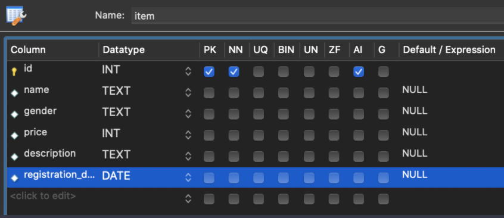

  **2. item_new 테이블**(item 테이블과 컬럼 구조가 같은, **같은 종류의 테이블**입니다.) 

  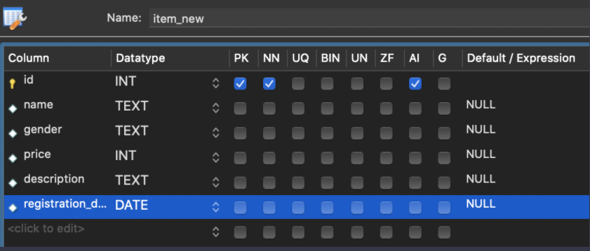

  **3. stock 테이블** 

  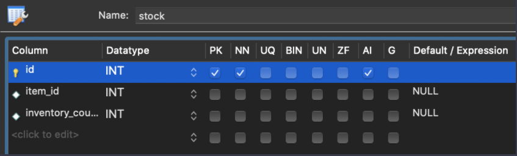

  **4. review 테이블**

  

  그리고 각 테이블의 컬럼 속성을 수정하고 나서는 **Apply 버튼**을 누르는 것, 잊지 마세요! 4개의 테이블이 잘 생성된 분은 다음 영상으로 넘어가시면 됩니다.

  *혹시 이렇게 해도 프로그램 에러 발생 등으로 인해 작업을 수행할 수 없는 경우에는, 아래 보이는 SQL 문들을 그대로 Workbench에 복사-붙여넣기해서 실행해주세요. 그럼 똑같은 테이블들이 생성됩니다.

  ```sql
  CREATE TABLE `review` (
    `id` int NOT NULL AUTO_INCREMENT,
    `mem_id` int DEFAULT NULL,
    `item_id` int DEFAULT NULL,
    `star` int DEFAULT NULL,
    `comment` text,
    PRIMARY KEY (`id`)
  ) ENGINE=InnoDB DEFAULT CHARSET=utf8mb4 COLLATE=utf8mb4_0900_ai_ci;
  
  INSERT INTO `review` (`id`, `mem_id`, `item_id`, `star`, `comment`) VALUES 
  (1,1,1,5,'착용감이 너무 좋아요, 요새 맨날 이것만 입고 다닙니다.'),
  (2,1,2,2,'그럭저럭 입을만 하긴 한데 밴딩이 너무 조여요 ㅜㅜ'),
  (3,1,6,5,'한 번 사보고 촉감이 너무 좋아서 10장 구매했습니다~'),
  (4,1,14,4,'두툼한 느낌이 좋기는 한데 실내에서는 땀이 좀 나네요..'),
  (5,2,4,3,'그냥 입을만한 정도에요.'),
  (6,2,8,5,'디자인도 최고고, 착용감도 진짜 좋아요.'),(7,2,9,5,'이거 입고 요새 맨날 헬스장 다닙니다 ㅎㅎ'),(8,2,13,3,'뭔가 일단 사서 입고 있기는 한데 디자인이 이미지보다 좀더 튀네요. '),(9,2,22,4,'뭔가 스타일리쉬한 느낌이라 요새 자주 입고 다녀요. '),(10,3,4,5,'기본템으로 좋은 것 같아서 여러장 샀네요~!'),(11,3,9,5,'땀을 잘 흡수해줘서 좋아요, 가족들 전부 한장씩 사서 줬어요 ㅋㅋ'),(12,3,15,3,'자수 모양이 이쁘긴 한데 좀 올드한 느낌이네요..'),(13,4,2,1,'이거 진짜 날씬한 사람만 입을 수 있는 건가요? 남편이 고무줄이 너무 조인다고 해요.'),(14,4,8,4,'처음에는 좀 너무 큰 사이즈 느낌이었는데 오히려 지금은 잘 산 것 같아요.'),(15,4,22,5,'이거 입고 모임 나가면 어디서 샀냐고 다 물어봐요, 좋아요!!'),(16,4,26,4,'봄가을에 입으면 딱 좋을 듯요 ^^'),(17,6,1,4,'적당히 입고 다니기 좋네요'),(18,6,2,0,'절대 사지마세요.. 남친 선물로 줬는데 허리가 너무 조인다고 해요..'),(19,6,3,5,'딱 스탠다드 런닝 느낌이에요. 남동생 선물로 여러 장 샀네요!'),(20,6,6,1,'이거 왜 세탁하고 나니까 청색이 너무 옅어져버리죠? 이염돼서 다른 옷도 다 망했어요 ㅜ'),(21,6,19,4,'요새 출근할 때 이거만 입고 다닙니다, 정말 예쁘네요~'),(22,6,21,2,'디자인이 조금 애매하네요. 그래도 가끔 입기에는 괜찮네요'),(23,10,1,5,'편하게 입고 다니기에 좋네요. '),(24,10,9,4,'요즘엔 헬스장에서 주는 옷 말고 이거 입고 다녀요. 통기성이 좋네요~'),(25,10,14,5,'가을용으로는 좀 더울 것 같고 겨울에 입으면 좋을 듯 하네요!'),(26,10,19,5,'이 옷은 이제 제 favorite이 될 것 같아요~ 데이트할 때마다 입으려고 해요'),(27,10,20,3,'사진으로 볼 때는 몰랐는데 받아보니 생각보다 좀 올드한 스타일인 것 같네요 ㅜ'),(28,10,23,4,'뭔가 독특한 안감과 겉감 때문에 개성있는 분위기를 연출할 수 있네요~'),(29,10,24,5,'밴딩이 진짜 편하고 길이도 적당해서 좋아요~'),(30,10,25,5,'이거 입고 사진 찍으니까 진짜 이쁘게 나와요!!! 다른 패턴도 또 나왔으면 ㅜ'),(31,10,29,5,'뭔가 사람들이 카라 어디로 떼먹었냐고 물어봐서 웃겨요 ㅋㅋㅋ'),(32,13,1,4,'딱 기본템으로 좋네요, 제 동생도 이쁘다 해서 하나 선물해줬습니다~'),(33,13,4,3,'뭔가 괜찮긴 한데 길이가 좀 짧은 감이 있어요.. 천을 덧대야할 것 같은 느낌..'),(34,13,9,5,'속옷 대신 입고 다녀도 될 정도로 가볍고 좋아요'),(35,13,18,5,'이쁘네요! '),(36,13,20,2,'괜찮긴 한데 물이 금새 빠졌네요..'),(37,13,30,0,'이거 사지 마세요.. 포켓 하나가 단추 떨어져서 왔어요..'),(38,16,1,5,'색깔이 너무 튀지도 않고 딱 좋아요'),(39,16,2,2,'이거 밴딩이 너무 쎄요.. 조절할 수 있도록 해주세요.  '),(40,16,3,4,'괜찮네요, 친구도 이거 샀더라구요 ㅋㅋ'),(41,16,5,3,'난해한 디자인.. 난 모르겠다, 그냥 입고 다닐게요. 착용감은 괜찮아요'),(42,16,7,5,'입기 괜찮네요. 적당한 핏이에요.'),(43,16,12,4,'좋아요, 따뜻하면서 시원해요?! '),(44,16,22,5,'이런 느낌으로 또다른 디자인해서 코트 판매해주세요! 도시적인 느낌 너무 좋아여'),(45,18,1,4,'질감이 괜찮네요, 패턴 제가 따로 입혀서 입고 다니고 있어요'),(46,18,4,3,'이거 뭐야 옷이, 기장 체크하고 살걸..'),(47,19,1,5,'좋아요~! 계절별로 하나씩 이런 느낌의 옷 있으면 좋겠어요, 두께감만 다르게 해서요'),(48,19,15,2,'이거 사놓고 입지도 못할 듯.. 너무 통이 작아서..'),(49,19,20,4,'입기에 괜찮은 듯~굿!'),(50,19,28,2,'괜찮긴 한데 단추 부분이 부실한 듯..'),(51,19,30,4,'괜찮은데 세탁하니까 사이즈가 좀 준 듯?'),(52,20,4,4,'나쁘지 않은 듯~!'),(53,20,9,5,'이거 진짜 좋네요. 내구성도 좋고 땀도 잘 흡수되고~'),(54,20,21,2,'도트 크기가 너무 큰 거 아닌가요.. 여친 주려고 샀는데 반품해야겠어요.'),(55,20,27,3,'엄마 사드렸는데, 옷이 너무 힘이 없는 듯..');
  
  
  
  CREATE TABLE `item` (
    `id` int NOT NULL AUTO_INCREMENT,
    `name` text,
    `gender` text,
    `price` int DEFAULT NULL,
    `description` text,
    `registration_date` date DEFAULT NULL,
    PRIMARY KEY (`id`)
  ) ENGINE=InnoDB DEFAULT CHARSET=utf8mb4 COLLATE=utf8mb4_0900_ai_ci;
  
  INSERT INTO `item` (`id`, `name`, `gender`, `price`, `description`, `registration_date`) VALUES 
  (1,'남녀 공용 오버핏 반팔 라운드 티셔츠','u',22000,'캐쥬얼한 무드를 연출할 수 있는 오버핏 반팔 티셔츠입니다, 깔끔한 라운드넥 디자인이라 데일리룩으로 꾸준히 입을 수 있어요!','2018-03-21'),
  (2,'남성용 밴딩 린넨 와이드 팬츠','m',33000,'매 시즌 사랑받았던, 여름에 꼭 필요한 핫한 밴딩 와이드 팬츠입니다. 베이직한 디자인과 컬러로 누구나 부담없이 이쁘게 입을 수 있습니다','2019-08-11'),
  (3,'남성용 순면 러닝','m',9000,'속옷 전문기업의 봉제 기술로 세탁 후에도 깔끔하게 유지됩니다. 봉제선이 최소화되어 편안한 착용감이 있습니다.','2018-04-15'),
  (4,'무지 7부 반팔 티셔츠','u',13000,'유니크한 디테일과 편안한 핏을 위해 최적의 소재를 사용해 만든 젊은 컨셉의 티셔츠입니다. 건강한 식물성 소재로 피부에 닿는 감촉이 부드럽습니다. ','2019-05-14'),
  (5,'브루너 반팔 티셔츠','m',20000,'뉴욕 스트릿의 감성이 살아나는 패턴이 있는 티셔츠입니다. 나만의 개성을 티셔츠로 드러내보세요.','2019-05-14'),(6,'남성용 스판 베이직 워싱 청바지','m',27000,'고퀄리티 상품, 쫀쫀한 스판데님으로 편안한 착용감을 느낄 수 있습니다, 한 두번 롤업해서 입어보는 것도 좋아요~!','2019-05-14'),(7,'남성용 슬렌더 데님','m',50000,'텐션 좋은 원단으로 만든 한정판 청바지, 베이스 워싱으로 은은한 슬림핏을 선사하는 바지입니다. 팬츠 밑단의 엣지 스타일로 트렌디한 디자인을 보실 수 있습니다.','2019-06-21'),(8,'프린팅 오버핏 맨투맨 ','u',35000,'레터링 프린팅으로 포인트를 준 오버핏 캐주얼 맨투맨입니다. 심플한 디자인이 다른 아이템과 잘 매치될 수 있게 해줍니다. 유행을 타지 않아 매년 입을 수 있는 아이템~!','2019-07-12'),(9,'냉감 반팔 티셔츠','u',15000,'아무리 땀흘려도 냄새나지 않는 티셔츠, 운동할 때 뭐입을지 고민하신 분들 많죠? 이 티셔츠 몇 장 사셔서 그런 고민 모두 날려버리세요. ','2019-08-17'),(10,'베어 프린팅 맨투맨 티셔츠','m',52000,'가을에 입으면 좋은 큐티한 상품, 평상복으로도 입을 수 있고, 데이트할 때도 입을 수 있어요! 귀여운 베어의 감성을 입어보세요. ','2019-07-12'),(11,'남성용 캐주얼 긴팔 남방','m',37000,'면 혼방 소재로 부드럽가 편안한 촉감을 느낄 수 있습니다. 트렌디함과 단정함을 모두 느낄 수 있습니다. ','2019-05-14'),(12,'남성용 오버핏 체크셔츠','m',45000,'늦가을부터 겨울까지 챙기면 좋을 베이직한 아이템, 톤 다운된 컬러로 세련된 캐주얼룩을 완성해봅시다.','2019-06-12'),(13,'남성용 스트라이프 셔츠','m',23000,'가끔 특별한 느낌을 주고 싶은 날에는? 스트라이프 디자인으로 주목받는 사람이 되어보세요. 세련미를 풍기는 사람이 되어봅시다. ','2019-07-12'),(14,'뉴밸루 후드집업 ','u',43000,'두툼한 느낌으로 나를 안아주는 후드집업, 집 근처에서도 센스있는 패션을 유지하고 싶다면 뉴밸루 후드집업입니다. 디자인과 실용성 모두 놓치고 싶지 않다면 선택하세요!','2019-03-04'),(15,'자수 반팔 티셔츠','f',52000,'여기저기 뛰어다니는 귀여운 고양이 감성, 오늘만큼은 귀여워지고 싶다면? 장인의 손길로 한땀한땀 새겨진 무늬가 있는 자수 반팔 티셔츠를 추천합니다. ','2019-07-12'),(16,'무지 티셔츠','f',30000,'원단이 주는 맨질맨질한 느낌이 좋습니다. 찰랑거리는 시원한 터치감으로 입지 않은 것처럼 편한 느낌을 줍니다. 누구나 편하게 입을 수 있는 무지 티셔츠~! ','2019-04-14'),(17,'밴딩 롤업 배기 팬츠','f',43000,'허리 사이즈에 상관없이 편하게 입을 수 있는 밴딩 스타일, 힙하면서도 꾸안꾸 스타일을 줄 수 있는 아이템입니다, 원하는 길이만큼 롤업하고 나가면 당신은 멋쟁이~!','2019-07-12'),(18,'박시 후드티 원피스 티셔츠','f',21000,'가볍게 입을 수 있지만 스타일리쉬한 느낌을 주는 원피스 티셔츠, 적당한 두께감으로 다양한 날씨에서 착용 가능합니다. ','2019-06-02'),(19,'플라워 벨티드 더블 자켓','f',71000,'누구보다도 화려해지고 싶은 날이 한번씩 있죠? 꽃이 온몸을 덮는 패턴으로 나의 존재감을 보여주세요. 라인감을 살려주는 디자인으로 당당함을 UP!','2019-07-03'),(20,'스타일리쉬 루즈 청자켓','f',39000,'과감한 프린팅과 찢김 무늬로 나만의 개성을 과시할 수 있습니다. 부담없는 연한 청색으로 은은함도 더했습니다. 아무리 빨아도 색 변화가 없을 거에요~!','2019-07-12'),(21,'여성용 도트 쉬폰 자켓','f',22000,'전통적인 게 가장 아름다운 법, 규칙적인 프린팅과 부드러운 촉감을 가진 쉬폰 자켓을 입어보세요. 발랄하고 스타일이 느껴지는 분위기를 연출할 수 있습니다. ','2019-05-14'),(22,'체크무늬 그린 롱코트','u',110000,'초록색과 검정색의 조화로운 색감으로 도회적인 느낌을 줄 수 있습니다. 오리털 안감으로 부족하지 않은 따뜻함을 느끼게 해줍니다. ','2019-09-14'),(23,'라이트 트렌치 코트','f',63000,'겉은 솔리드, 안은 체크면 두 가지 스타일로 되어 있습니다. 밑단이 분리되어 있는 패턴으로 착장 시 깔끔한 느낌을 줍니다. ','2019-08-19'),(24,'맵시 롱치마','f',40000,'허리 밴딩 타입으로 어떤 코디에도 자연스럽게 어울립니다. 몸에 감기는 시원한 재질로 여름에도 편하게 입을 수 있어요.','2019-05-14'),(25,'민들레 롱 스커트','f',25000,'화사한 민들레 패턴으로 꾸며진 롱 스커트~! 야외에서 사진 찍을 때 예쁜 샷을 선물해줄 스커트입니다. 약간의 늘어남이 있는 소재라 착용감도 좋습니다. ','2019-05-14'),(26,'블레이저 싱글 자켓','u',37000,'댄디하고 클래식한 느낌을 주는 남녀 공용 자켓입니다. 심플함만으로 매력을 선사하는 자켓으로 누구나 하나씩 갖고 있어야하는 기본아이템이죠!','2019-03-04'),(27,'여성 린넨 자켓','f',29000,'유행 타지 않는 아이템, 린넨 자켓! 여유감 있는 폼과 기장으로 안정감 있는 핏을 연출할 수 있습니다. 간단한 롤업으로 세련미를 줄 수도 있구요. ','2019-07-12'),(28,'후드 하프 코트','f',45000,'어머님들이 사랑하는 아이템, 세련된 분위기와 편안함을 함께 보여줄 수 있는 코트입니다. 생각보다 두꺼운 안감이 안정적인 보온 효과를 줍니다. ','2019-03-04'),(29,'여성용 노카라 자켓','f',67000,'평범한 자켓은 가라! 불필요한 카라를 없애고 오로지 실용성과 담백함만을 담은 자켓입니다. 업무 중에 입기에도 적합한 착용감을 제공합니다. ','2019-06-12'),(30,'여성용 투포켓 자켓','f',42000,'청청 패션의 끝을 장식해주는 아이템, 제대로된 청색 아이템을 찾는 다면 이 아이템을 추천합니다. ','2019-07-12');
  
  
  
  CREATE TABLE `stock` (
    `id` int NOT NULL AUTO_INCREMENT,
    `item_id` int DEFAULT NULL,
    `inventory_count` int DEFAULT NULL,
    PRIMARY KEY (`id`)
  ) ENGINE=InnoDB AUTO_INCREMENT=19 DEFAULT CHARSET=utf8mb4 COLLATE=utf8mb4_0900_ai_ci;
  
  INSERT INTO `stock` (`id`, `item_id`, `inventory_count`) VALUES (1,1,320),(2,2,200),(3,4,213),(4,5,230),(5,6,103),(6,9,120),(7,14,185),(8,15,195),(9,18,210),(10,19,522),(11,20,360),(12,21,245),(13,22,49),(14,23,52),(15,25,397),(16,26,275),(17,27,103),(18,30,234);
  
  
  
  CREATE TABLE `item_new` (
    `id` int NOT NULL AUTO_INCREMENT,
    `name` text,
    `gender` text,
    `price` int DEFAULT NULL,
    `description` text,
    `registration_date` date DEFAULT NULL,
    PRIMARY KEY (`id`)
  ) ENGINE=InnoDB DEFAULT CHARSET=utf8mb4 COLLATE=utf8mb4_0900_ai_ci;
  
  INSERT INTO `item_new` (`id`, `name`, `gender`, `price`, `description`, `registration_date`) VALUES (2,'남성용 밴딩 린넨 와이드 팬츠','m',33000,'매 시즌 사랑받았던, 여름에 꼭 필요한 핫한 밴딩 와이드 팬츠입니다. 베이직한 디자인과 컬러로 누구나 부담없이 이쁘게 입을 수 있습니다','2019-08-11'),(3,'남성용 순면 러닝','m',9000,'속옷 전문기업의 봉제 기술로 세탁 후에도 깔끔하게 유지됩니다. 봉제선이 최소화되어 편안한 착용감이 있습니다.','2018-04-15'),(4,'무지 7부 반팔 티셔츠','u',13000,'유니크한 디테일과 편안한 핏을 위해 최적의 소재를 사용해 만든 젊은 컨셉의 티셔츠입니다. 건강한 식물성 소재로 피부에 닿는 감촉이 부드럽습니다. ','2019-05-14'),(5,'브루너 반팔 티셔츠','m',20000,'뉴욕 스트릿의 감성이 살아나는 패턴이 있는 티셔츠입니다. 나만의 개성을 티셔츠로 드러내보세요.','2019-05-14'),(7,'남성용 슬렌더 데님','m',50000,'텐션 좋은 원단으로 만든 한정판 청바지, 베이스 워싱으로 은은한 슬림핏을 선사하는 바지입니다. 팬츠 밑단의 엣지 스타일로 트렌디한 디자인을 보실 수 있습니다.','2019-06-21'),(8,'프린팅 오버핏 맨투맨 ','u',35000,'레터링 프린팅으로 포인트를 준 오버핏 캐주얼 맨투맨입니다. 심플한 디자인이 다른 아이템과 잘 매치될 수 있게 해줍니다. 유행을 타지 않아 매년 입을 수 있는 아이템~!','2019-07-12'),(9,'냉감 반팔 티셔츠','u',15000,'아무리 땀흘려도 냄새나지 않는 티셔츠, 운동할 때 뭐입을지 고민하신 분들 많죠? 이 티셔츠 몇 장 사셔서 그런 고민 모두 날려버리세요. ','2019-08-17'),(10,'베어 프린팅 맨투맨 티셔츠','m',52000,'가을에 입으면 좋은 큐티한 상품, 평상복으로도 입을 수 있고, 데이트할 때도 입을 수 있어요! 귀여운 베어의 감성을 입어보세요. ','2019-07-12'),(11,'남성용 캐주얼 긴팔 남방','m',37000,'면 혼방 소재로 부드럽가 편안한 촉감을 느낄 수 있습니다. 트렌디함과 단정함을 모두 느낄 수 있습니다. ','2019-05-14'),(12,'남성용 오버핏 체크셔츠','m',45000,'늦가을부터 겨울까지 챙기면 좋을 베이직한 아이템, 톤 다운된 컬러로 세련된 캐주얼룩을 완성해봅시다.','2019-06-12'),(13,'남성용 스트라이프 셔츠','m',23000,'가끔 특별한 느낌을 주고 싶은 날에는? 스트라이프 디자인으로 주목받는 사람이 되어보세요. 세련미를 풍기는 사람이 되어봅시다. ','2019-07-12'),(15,'자수 반팔 티셔츠','f',52000,'여기저기 뛰어다니는 귀여운 고양이 감성, 오늘만큼은 귀여워지고 싶다면? 장인의 손길로 한땀한땀 새겨진 무늬가 있는 자수 반팔 티셔츠를 추천합니다. ','2019-07-12'),(17,'밴딩 롤업 배기 팬츠','f',43000,'허리 사이즈에 상관없이 편하게 입을 수 있는 밴딩 스타일, 힙하면서도 꾸안꾸 스타일을 줄 수 있는 아이템입니다, 원하는 길이만큼 롤업하고 나가면 당신은 멋쟁이~!','2019-07-12'),(19,'플라워 벨티드 더블 자켓','f',71000,'누구보다도 화려해지고 싶은 날이 한번씩 있죠? 꽃이 온몸을 덮는 패턴으로 나의 존재감을 보여주세요. 라인감을 살려주는 디자인으로 당당함을 UP!','2019-07-03'),(20,'스타일리쉬 루즈 청자켓','f',39000,'과감한 프린팅과 찢김 무늬로 나만의 개성을 과시할 수 있습니다. 부담없는 연한 청색으로 은은함도 더했습니다. 아무리 빨아도 색 변화가 없을 거에요~!','2019-07-12'),(21,'여성용 도트 쉬폰 자켓','f',22000,'전통적인 게 가장 아름다운 법, 규칙적인 프린팅과 부드러운 촉감을 가진 쉬폰 자켓을 입어보세요. 발랄하고 스타일이 느껴지는 분위기를 연출할 수 있습니다. ','2019-05-14'),(24,'맵시 롱치마','f',40000,'허리 밴딩 타입으로 어떤 코디에도 자연스럽게 어울립니다. 몸에 감기는 시원한 재질로 여름에도 편하게 입을 수 있어요.','2019-05-14'),(25,'민들레 롱 스커트','f',25000,'화사한 민들레 패턴으로 꾸며진 롱 스커트~! 야외에서 사진 찍을 때 예쁜 샷을 선물해줄 스커트입니다. 약간의 늘어남이 있는 소재라 착용감도 좋습니다. ','2019-05-14'),(27,'여성 린넨 자켓','f',29000,'유행 타지 않는 아이템, 린넨 자켓! 여유감 있는 폼과 기장으로 안정감 있는 핏을 연출할 수 있습니다. 간단한 롤업으로 세련미를 줄 수도 있구요. ','2019-07-12'),(29,'여성용 노카라 자켓','f',67000,'평범한 자켓은 가라! 불필요한 카라를 없애고 오로지 실용성과 담백함만을 담은 자켓입니다. 업무 중에 입기에도 적합한 착용감을 제공합니다. ','2019-06-12'),(30,'여성용 투포켓 자켓','f',42000,'청청 패션의 끝을 장식해주는 아이템, 제대로된 청색 아이템을 찾는 다면 이 아이템을 추천합니다. ','2019-07-12'),(31,'신상 남자 슬랙스','m',35000,'완벽한 핏으로 하체를 더 길게 보여주는 상품, 사무실이든 야외에서든 편하게 입을 수 있는 재질입니다. ','2020-01-12'),(32,'New 반팔티 남녀공용','u',35000,'루즈한 사이즈로 어디서나 편하게 입을 수 있는 아이템, 남녀노소 부담없는 기본 아이템으로 활용할 수 있습니다. ','2020-02-21'),(33,'새로운 루즈핏 니트 베스트','m',55000,'셔츠 위에 루즈핏으로 입을 수 있는 베스트입니다. 자켓을 입기에는 애매하고 그렇다고 셔츠만 입기에는 부족할 때, 이 니트 베스트를 선택하세요. ','2020-03-12'),(34,'최고 신상 피크닉 맨투맨','m',25000,'소풍갈 때 입기에 좋은 맨투맨입니다. 신인 디자이너들의 개성이 옷의 모든 부분에 반영된 맨투맨으로 당신의 개성을 뽐내보세요. ','2020-03-21'),(35,'남녀 공용 오버핏 후드티','u',47000,'큼직한 사이즈의 후드티입니다. 매끈한 느낌의 안감과 대조적인 털 느낌의 바깥 재질이 큰 매력으로 다가오는 후드티입니다.','2020-03-09'),(36,'뉴스타일 포켓 블라우스','f',21000,'봄에 어울리는 은은한 컬러의 아이템, 묵직한 무게감으로 봄의 꽃샘추위를 이겨낼 수 있습니다. 아우터 대신으로 입어도 좋은 아이템입니다. ','2020-03-08'),(37,'히든 버튼 남방','f',56000,'거추장스러운 단추를 모두 안으로 옮긴 아이템입니다. 하지만 입을 때의 불편함을 없앨 수 있도록 디자인되었습니다. 산뜻한 이미지를 연출하고 싶을 때 착용하세요. ','2020-05-15'),(38,'신상품 베이지 롱 가디건','u',58000,'양털 소재의 가벼운 느낌의 가디건입니다. 보온성과 통기성을 최대한 유지하기 위한 여러 기술들이 적용된 의상으로 대부분의 평범한 날씨에 입을 수 있습니다.','2020-04-07');
  ```


- #### 테이블 간의 연결고리

  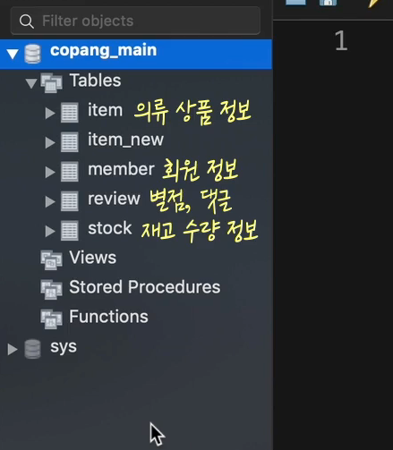

  서로 다른 두 테이블의 컬럼간에 관계가 존재하는 경우에 대해 살펴볼 것. 

  **item table**

  *id, 상품이름, 성별(male, female, unisex), 가격, 상품 설명, 상품 등록 일자*

  **stock table**

  *id, 상품 id, 상품 재고 수* 

  Item_id 는 상품을 고유하게 식별할 수 있는 고유 번호가 들어가야함. 즉, stock table의 item_id컬럼에는 item table의 id컬럼의 값이 들어가는 것. 

  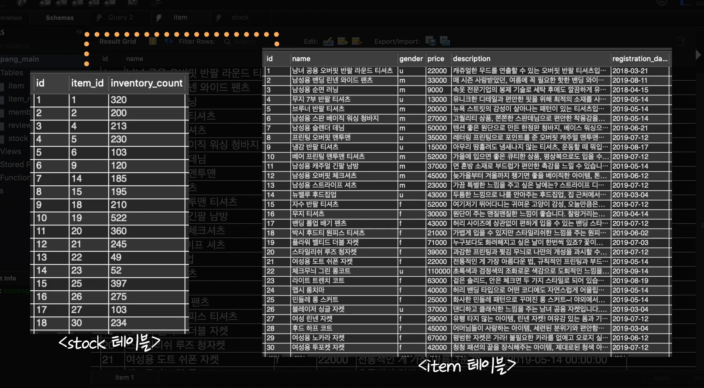

  이런 상황에서는 stock table의 item_id컬럼에는 무조건 Item 테이블에 있는 id들만 들어가야 함. 엉뚱한 값들이 들어가는 것을 막아야 함. 

  이걸 막기 위한 설정이 있음. 

- #### Foreign Key의 개념

  이전 영상에서는 **stock 테이블의 item_id 컬럼**과 **item 테이블의 id 컬럼**이 갖는 관계를 설명했습니다. 

  잠깐 stock 테이블에 있는 row를 하나 선택해볼까요?

  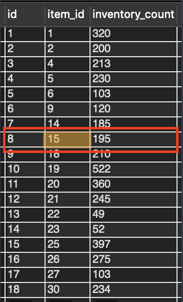

  row 하나를 선택해서 보면 재고 수(inventory_count)가 195개라는 걸 알 수 있습니다. 

  그런데 어떤 상품의 재고수를 나타내는 건지 바로는 알 수 없습니다. 일단 item_id 컬럼의 값인 **15**를 보고,

  item 테이블을 간 다음에 

  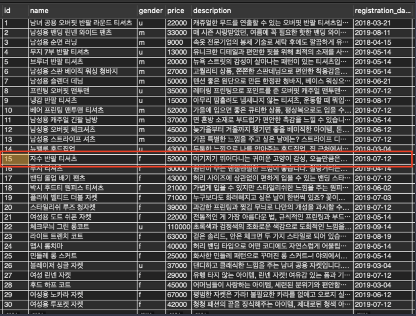

  이렇게 id 컬럼의 값이 15인 row를 찾으면 됩니다. 방금 재고 수 정보는 ‘자수 반팔 티셔츠’라는 상품의 재고 수였네요. 

  지금 두 테이블 간의 관계를 한 문장으로 표현하면,

  **‘stock 테이블의 item_id 컬럼이 item 테이블의 id 컬럼을 참조하는 관계’**

  라고 할 수 있습니다. 

  그리고 지금 item_id 컬럼처럼, '다른 테이블의 특정 row를 식별할 수 있게 해주는 컬럼'을 **Foreign Key**라고 합니다. 

  Foreign Key는 우리말로 **외래키**라고도 합니다.

  바로 이럴 때

  **(1) 참조를 하는 테이블인 stock 테이블을 ‘자식 테이블’**

  **(2) 참조를 당하는 테이블인 item 테이블을 ‘부모 테이블’**

  이라고 합니다. 

  아래 그림을 잠깐 볼까요?

  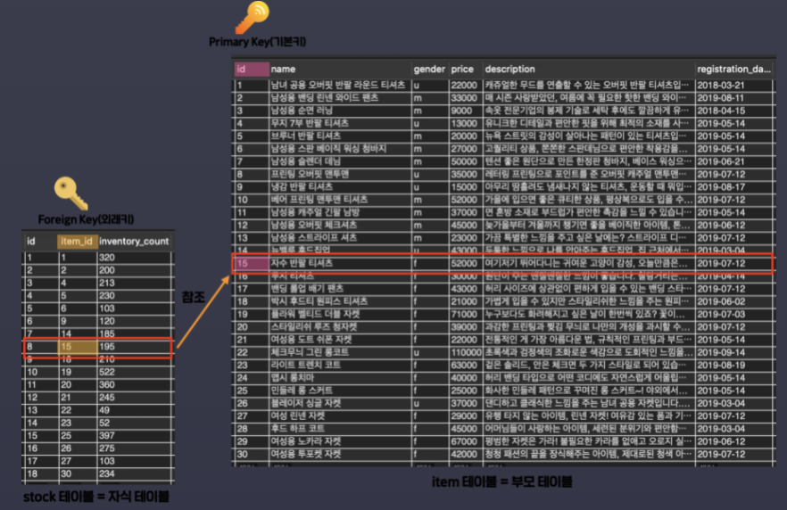

  이때까지 제가 설명한 내용이 한눈에 잘 보이는데요. 지금 자식 테이블의 Foreign Key가 부모 테이블의 Primary Key를 참조하고 있죠? **Foreign Key는 다른 테이블의 특정 row를 식별할 수 있어야 하기 때문에 주로 다른 테이블의 Primary Key를 참조할 때가 많습니다.** 

  이제 Foreign Key가 뭔지 아시겠죠?


- #### Foreign Key 설정하기

  Item_id에 엉뚱한 값이 들어가는 것을 막으려면, **foreign key**를 설정해 줘야 함. 

  **foreign key란 다른 테이블의 특정 Row를 식별할 수 있게 해주는 컬럼을 의미함.** 

  *이 item_id를 foreign_key라고 부르는 것.* 

  Item_id컬럼이 foreign_key라는 것을 설정해야 함. 

  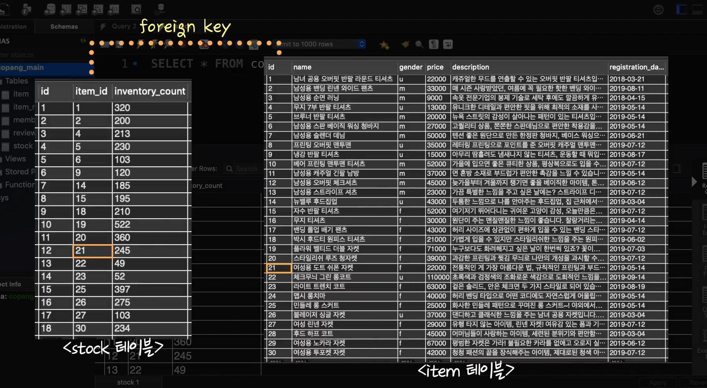

  workbench에서 테이블 컬럼 보는 창의 하단으로 가면 아래처럼 foreign key라는 텝이 있음. 

  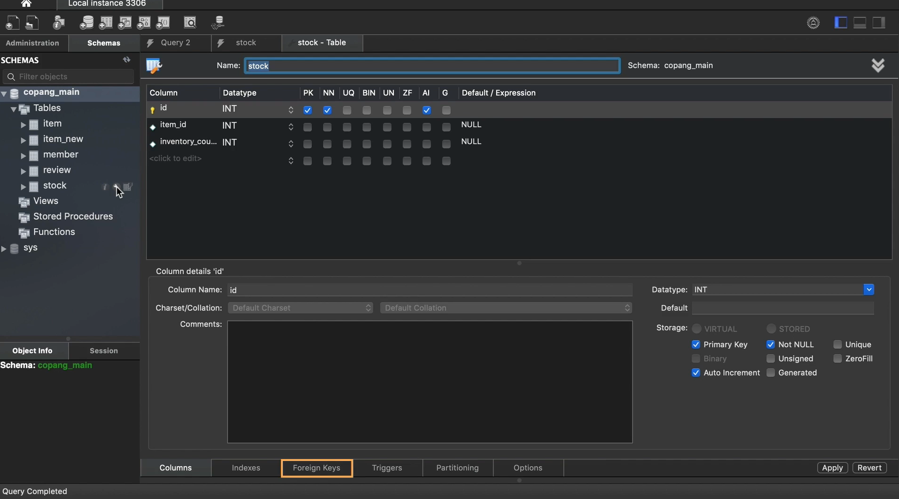

  이 foreign_key자체에 이름을 설정해 줘야함. 더블클릭 하면 됨. 

  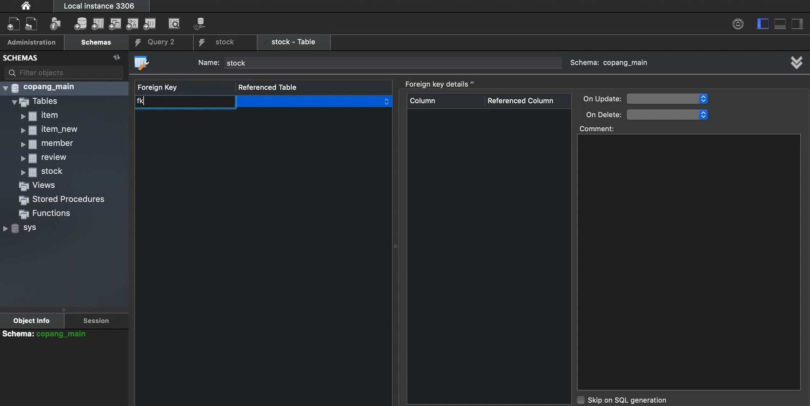

  이름은 아무렇게나 써도 되긴 하지만, 그냥 일정 규칙이 있으면 더 알아보기 쉽겠지. 

  **fk_stock_item => stock테이블에서 Item테이블을 참조하는 Foreign Key라는 의미로 지어보자.** 

  그리고 옆에 Referenced Table설정해야지. 참조 당하는 테이블. 

  아래처럼 다 설정 해주면 되지. 

  

  

  그럼 이런걸 설정하면 뭐가 좋은 걸까? 

  이렇게 해놓으면 좋은게, 나중에 item_id에 item테이블의 Id에 없는 이상한 값이 삽입되려고 할 때, MySQL이 에러를 발생시켜 줌. 

  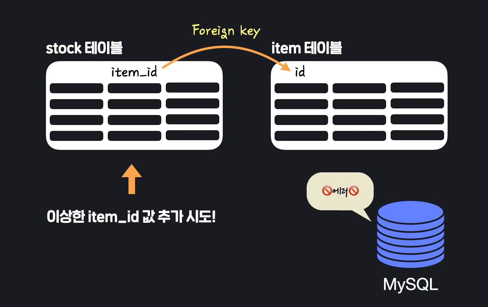


- #### 다른 종류의 테이블 조인하기1

  item테이블과 stock테이블을 조인해보자. 

  ```sql
  SELECT 
  		item.id,
      item.name,
      stock.item_id,
      stock.inventory_count
  FROM item LEFT OUTER JOIN stock
  ON item.id = stock.item_id
  ```

  **item** LEFT OUTER JOIN **stock**

  item table을 기준으로 stock table을 합치라는 뜻. 어떻게 합치라는겨? 그게 ON에 써 있는 것. 

  **두 테이블의 item.id와 stock.item_id를 비교해서, 서로 값이 같은 것끼리 가로 방향으로 합치라는 것.** 

  그러면 뒷부분에서 이미 새로운 테이블이 생성되 있는 것. 그 중에서, item.id, item.name, stock.item_id, stock.inventory_count 이렇게 4개를 가져 오라는 것. 

  **총 4개의 컬럼이 보이는데, 왼쪽 2개가 Item테이블에 있던 컬럼, 오른쪽 2개가 stock테이블에 있던 컬럼.** 

  당연하지만, 모든 Row에서 id/item_id 두 컬럼 값이 같음. 

  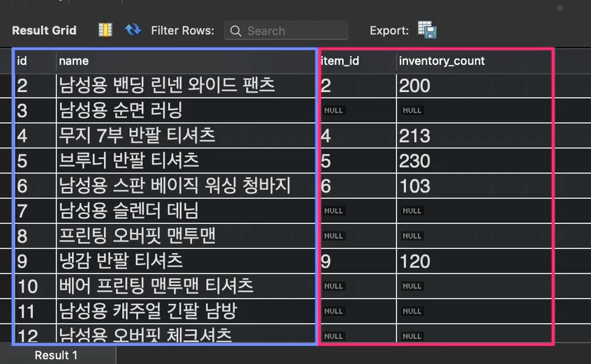

  **그런데 여기서 Item_id가 NULL인 애들이 많이 보임.** 이건 지금, Item 테이블의 id컬럼에 있는 값들 중에서 stock테이블에는 존재하지 않았던 것들임.  

  LEFT OUTER JOIN은 왼쪽에 쓴 item테이블이 기준이니깐, 거기에 없으면 **NULL**로 나오겠지. 

  즉 다시 보자면, item table과 stock table이 있을 때, 

  item테이블을 기준으로 한 후에, 왼쪽에 쓴 기준을 잡고 stock테이블에 값이 있는 애들을 갖다 붙인 것. 

  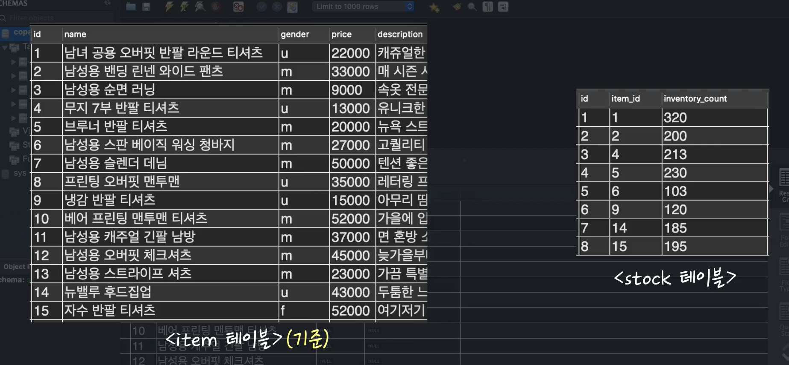

  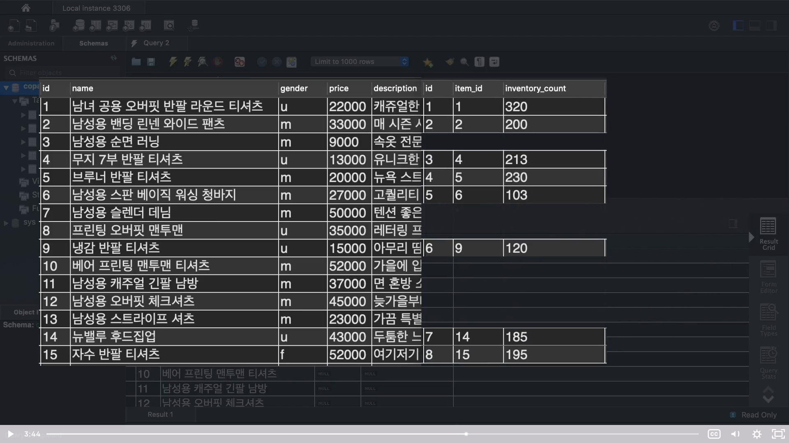근데 당연하게도, Left Outer Join이 있으면, Right Outer Join도 있겠지. 사실 똑같은데, 이거는 오른쪽에 쓴 애가 기준인 것. 

  ```sql
  SELECT 
  	item.id,
      item.name,
      stock.item_id,
      stock.inventory_count
  FROM item RIGHT OUTER JOIN stock
  ON item.id = stock.item_id
  ```

  

  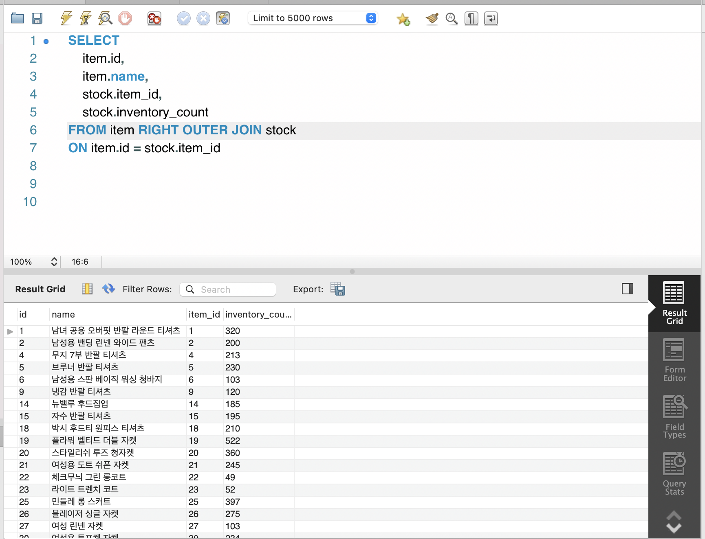

  이걸 보면, 지금 기준 자체가 STOCK table로 변했음. stock table에 있는 애들만 기준으로 잡히고, 그 있는 애들만 가지고 item table에서 있는 애들이 옆으로 와서 붙은 것. 

  애초에 stock table의 item_id는 foreign key 설정이 되어 있어서, Item테이블의 Id컬럼에 있는 애들만 붙을 수 있음. 그래서, 다른게 붙을 수가 없지. NULL이 없지. 

  

  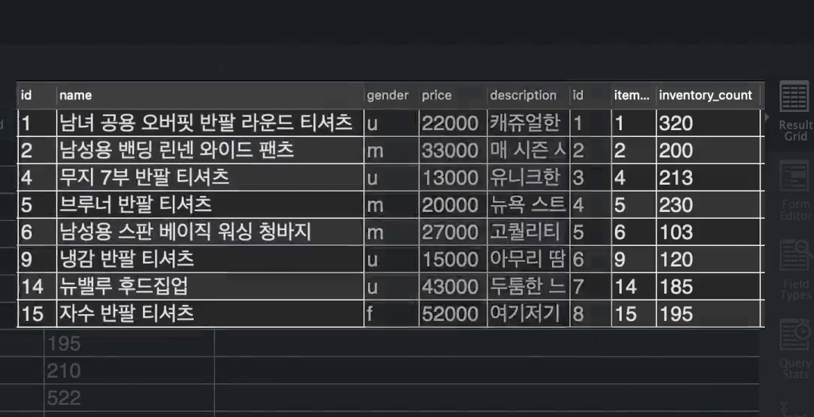

  