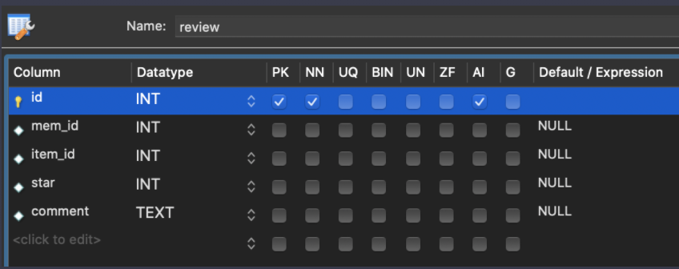
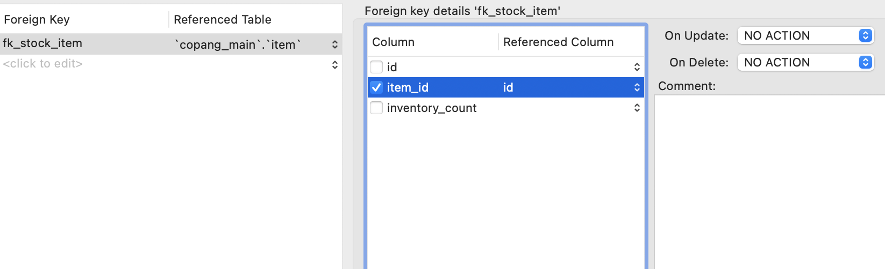
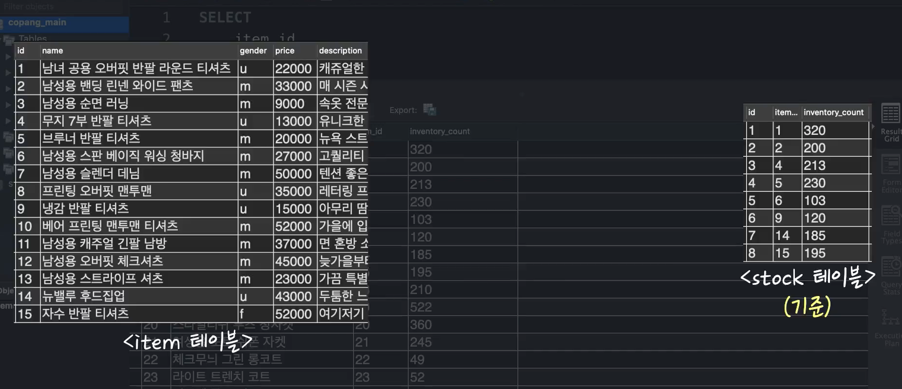
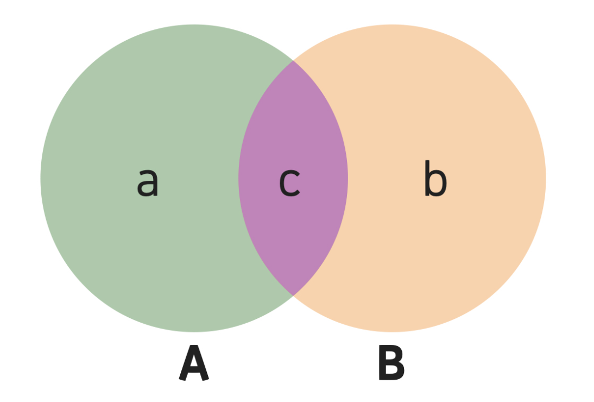
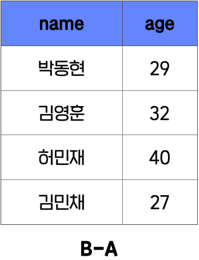
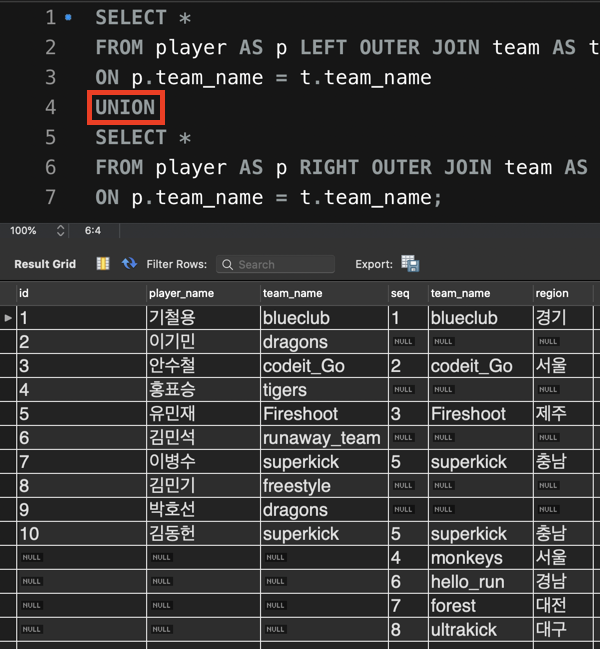

# Basic Concept 4

- #### 여러 테이블을 다루는 실무환경

  이전 챕터까지 우리는 코드잇의 쇼핑몰 사이트인 '코팡'에서 쓰일 

  - **copang_main**이라는 데이터베이스의
  - **member** 테이블

  을 갖고 SQL을 배웠습니다. 

  하지만, 실전에서 여러분은 최소 열 개, 많으면 수 십, 수 백 개의 테이블을 다뤄야할 수도 있습니다. 게다가 이 때 테이블 하나씩을 별도로 다룰 수 있어야할 뿐만 아니라, 테이블 간의 연관 관계를 파악하고 여러 테이블을 하나로 합쳐서 볼 수 있어야 합니다.

  여러 테이블을 합쳐서 하나의 테이블인 것처럼 보는 행위를 '**조인(join)**'이라고 하는데요. 실무에서는 이 조인을 잘해야 제대로된 데이터 분석을 할 수 있습니다. 조인은 그 사람이 SQL을 얼마나 잘 쓰는지 판단하는 척도 중 하나일만큼 정말 중요한 개념인데요.

  조인이 구체적으로 무엇인지는 곧 다음 영상에서 설명하겠습니다. 일단 다음 노트의 내용을 따라해서 원래 있던 member 테이블 이외에 또다른 여러 테이블들을 추가하세요. 

  참고로, 이번 챕터는 여러분이 이전 챕터들에서 배운 내용을 모두 완벽하게 이해했다고 가정하고 진행됩니다. 혹시 이전 챕터 내용들 중에서 아직 확실하게 이해하지 못한 내용이 있다면 다시 복습하고, 이 챕터를 들으시기 바랍니다. 


- #### 다음 학습을 위한 사전 작업

  이번 챕터에서 여러 테이블을 하나로 합치는 조인(join)을 배울 거라고 했죠? 그럼 일단 여러 테이블들이 있어야할 겁니다. 이번 챕터에서 사용할 테이블들을 생성해볼게요. 이전 노트에서 CSV 파일을 임포트해서 테이블을 생성한 적이 있었는데 기억나시나요? [**해당 노트**](https://www.codeit.kr/learn/3150/)**의 내용을 참조**해서 여러분 스스로 아래의 CSV 파일 4개를 각각 테이블로 만들어보세요.

  [**item-data.csv**](https://bakey-api.codeit.kr/files/3208/VuwziB?name=item-data.csv) **-> item 테이블**

  [**item-new-data.csv**](https://bakey-api.codeit.kr/files/3208/V5d5iv?name=item-new-data.csv) **-> item_new 테이블**

  [**stock-data.csv**](https://bakey-api.codeit.kr/files/3208/QGA2Df?name=stock-data.csv) **-> stock 테이블**

  [**review-data.csv**](https://bakey-api.codeit.kr/files/3208/RBNoGJ?name=review-data.csv) **-> reivew 테이블**

  각 테이블에 대해 간단히 설명하자면 다음과 같습니다.

  **item 테이블 : '코팡'의 상품 정보**

  **item_new 테이블 : (나중 영상에서 설명하겠습니다)** 

  **stock 테이블 : '코팡'의 각 상품 재고 정보**

  **review 테이블 : 고객들이 상품 구매 후 남긴 리뷰 정보**

  각 테이블은 다음 영상들에서도 등장하니까 그때 또 자세히 설명할게요.

  **4개의 테이블을 생성하고 나면,**

  각 테이블의

  (1) id 컬럼을 Primary Key로 설정하고, Auto Increment 설정을 해주세요. 

  (2) 그리고 날짜를 나타내는 컬럼이 있다면 그 컬럼의 데이터 타입을 DATE으로 변경해주세요.

  아래 그림들처럼 말이죠. 

  **1. item 테이블**

  

  **2. item_new 테이블**(item 테이블과 컬럼 구조가 같은, **같은 종류의 테이블**입니다.) 

  

  **3. stock 테이블** 

  

  **4. review 테이블**

  

  그리고 각 테이블의 컬럼 속성을 수정하고 나서는 **Apply 버튼**을 누르는 것, 잊지 마세요! 4개의 테이블이 잘 생성된 분은 다음 영상으로 넘어가시면 됩니다.

  *혹시 이렇게 해도 프로그램 에러 발생 등으로 인해 작업을 수행할 수 없는 경우에는, 아래 보이는 SQL 문들을 그대로 Workbench에 복사-붙여넣기해서 실행해주세요. 그럼 똑같은 테이블들이 생성됩니다.

  ```sql
  CREATE TABLE `review` (
    `id` int NOT NULL AUTO_INCREMENT,
    `mem_id` int DEFAULT NULL,
    `item_id` int DEFAULT NULL,
    `star` int DEFAULT NULL,
    `comment` text,
    PRIMARY KEY (`id`)
  ) ENGINE=InnoDB DEFAULT CHARSET=utf8mb4 COLLATE=utf8mb4_0900_ai_ci;
  
  INSERT INTO `review` (`id`, `mem_id`, `item_id`, `star`, `comment`) VALUES 
  (1,1,1,5,'착용감이 너무 좋아요, 요새 맨날 이것만 입고 다닙니다.'),
  (2,1,2,2,'그럭저럭 입을만 하긴 한데 밴딩이 너무 조여요 ㅜㅜ'),
  (3,1,6,5,'한 번 사보고 촉감이 너무 좋아서 10장 구매했습니다~'),
  (4,1,14,4,'두툼한 느낌이 좋기는 한데 실내에서는 땀이 좀 나네요..'),
  (5,2,4,3,'그냥 입을만한 정도에요.'),
  (6,2,8,5,'디자인도 최고고, 착용감도 진짜 좋아요.'),(7,2,9,5,'이거 입고 요새 맨날 헬스장 다닙니다 ㅎㅎ'),(8,2,13,3,'뭔가 일단 사서 입고 있기는 한데 디자인이 이미지보다 좀더 튀네요. '),(9,2,22,4,'뭔가 스타일리쉬한 느낌이라 요새 자주 입고 다녀요. '),(10,3,4,5,'기본템으로 좋은 것 같아서 여러장 샀네요~!'),(11,3,9,5,'땀을 잘 흡수해줘서 좋아요, 가족들 전부 한장씩 사서 줬어요 ㅋㅋ'),(12,3,15,3,'자수 모양이 이쁘긴 한데 좀 올드한 느낌이네요..'),(13,4,2,1,'이거 진짜 날씬한 사람만 입을 수 있는 건가요? 남편이 고무줄이 너무 조인다고 해요.'),(14,4,8,4,'처음에는 좀 너무 큰 사이즈 느낌이었는데 오히려 지금은 잘 산 것 같아요.'),(15,4,22,5,'이거 입고 모임 나가면 어디서 샀냐고 다 물어봐요, 좋아요!!'),(16,4,26,4,'봄가을에 입으면 딱 좋을 듯요 ^^'),(17,6,1,4,'적당히 입고 다니기 좋네요'),(18,6,2,0,'절대 사지마세요.. 남친 선물로 줬는데 허리가 너무 조인다고 해요..'),(19,6,3,5,'딱 스탠다드 런닝 느낌이에요. 남동생 선물로 여러 장 샀네요!'),(20,6,6,1,'이거 왜 세탁하고 나니까 청색이 너무 옅어져버리죠? 이염돼서 다른 옷도 다 망했어요 ㅜ'),(21,6,19,4,'요새 출근할 때 이거만 입고 다닙니다, 정말 예쁘네요~'),(22,6,21,2,'디자인이 조금 애매하네요. 그래도 가끔 입기에는 괜찮네요'),(23,10,1,5,'편하게 입고 다니기에 좋네요. '),(24,10,9,4,'요즘엔 헬스장에서 주는 옷 말고 이거 입고 다녀요. 통기성이 좋네요~'),(25,10,14,5,'가을용으로는 좀 더울 것 같고 겨울에 입으면 좋을 듯 하네요!'),(26,10,19,5,'이 옷은 이제 제 favorite이 될 것 같아요~ 데이트할 때마다 입으려고 해요'),(27,10,20,3,'사진으로 볼 때는 몰랐는데 받아보니 생각보다 좀 올드한 스타일인 것 같네요 ㅜ'),(28,10,23,4,'뭔가 독특한 안감과 겉감 때문에 개성있는 분위기를 연출할 수 있네요~'),(29,10,24,5,'밴딩이 진짜 편하고 길이도 적당해서 좋아요~'),(30,10,25,5,'이거 입고 사진 찍으니까 진짜 이쁘게 나와요!!! 다른 패턴도 또 나왔으면 ㅜ'),(31,10,29,5,'뭔가 사람들이 카라 어디로 떼먹었냐고 물어봐서 웃겨요 ㅋㅋㅋ'),(32,13,1,4,'딱 기본템으로 좋네요, 제 동생도 이쁘다 해서 하나 선물해줬습니다~'),(33,13,4,3,'뭔가 괜찮긴 한데 길이가 좀 짧은 감이 있어요.. 천을 덧대야할 것 같은 느낌..'),(34,13,9,5,'속옷 대신 입고 다녀도 될 정도로 가볍고 좋아요'),(35,13,18,5,'이쁘네요! '),(36,13,20,2,'괜찮긴 한데 물이 금새 빠졌네요..'),(37,13,30,0,'이거 사지 마세요.. 포켓 하나가 단추 떨어져서 왔어요..'),(38,16,1,5,'색깔이 너무 튀지도 않고 딱 좋아요'),(39,16,2,2,'이거 밴딩이 너무 쎄요.. 조절할 수 있도록 해주세요.  '),(40,16,3,4,'괜찮네요, 친구도 이거 샀더라구요 ㅋㅋ'),(41,16,5,3,'난해한 디자인.. 난 모르겠다, 그냥 입고 다닐게요. 착용감은 괜찮아요'),(42,16,7,5,'입기 괜찮네요. 적당한 핏이에요.'),(43,16,12,4,'좋아요, 따뜻하면서 시원해요?! '),(44,16,22,5,'이런 느낌으로 또다른 디자인해서 코트 판매해주세요! 도시적인 느낌 너무 좋아여'),(45,18,1,4,'질감이 괜찮네요, 패턴 제가 따로 입혀서 입고 다니고 있어요'),(46,18,4,3,'이거 뭐야 옷이, 기장 체크하고 살걸..'),(47,19,1,5,'좋아요~! 계절별로 하나씩 이런 느낌의 옷 있으면 좋겠어요, 두께감만 다르게 해서요'),(48,19,15,2,'이거 사놓고 입지도 못할 듯.. 너무 통이 작아서..'),(49,19,20,4,'입기에 괜찮은 듯~굿!'),(50,19,28,2,'괜찮긴 한데 단추 부분이 부실한 듯..'),(51,19,30,4,'괜찮은데 세탁하니까 사이즈가 좀 준 듯?'),(52,20,4,4,'나쁘지 않은 듯~!'),(53,20,9,5,'이거 진짜 좋네요. 내구성도 좋고 땀도 잘 흡수되고~'),(54,20,21,2,'도트 크기가 너무 큰 거 아닌가요.. 여친 주려고 샀는데 반품해야겠어요.'),(55,20,27,3,'엄마 사드렸는데, 옷이 너무 힘이 없는 듯..');
  
  
  
  CREATE TABLE `item` (
    `id` int NOT NULL AUTO_INCREMENT,
    `name` text,
    `gender` text,
    `price` int DEFAULT NULL,
    `description` text,
    `registration_date` date DEFAULT NULL,
    PRIMARY KEY (`id`)
  ) ENGINE=InnoDB DEFAULT CHARSET=utf8mb4 COLLATE=utf8mb4_0900_ai_ci;
  
  INSERT INTO `item` (`id`, `name`, `gender`, `price`, `description`, `registration_date`) VALUES 
  (1,'남녀 공용 오버핏 반팔 라운드 티셔츠','u',22000,'캐쥬얼한 무드를 연출할 수 있는 오버핏 반팔 티셔츠입니다, 깔끔한 라운드넥 디자인이라 데일리룩으로 꾸준히 입을 수 있어요!','2018-03-21'),
  (2,'남성용 밴딩 린넨 와이드 팬츠','m',33000,'매 시즌 사랑받았던, 여름에 꼭 필요한 핫한 밴딩 와이드 팬츠입니다. 베이직한 디자인과 컬러로 누구나 부담없이 이쁘게 입을 수 있습니다','2019-08-11'),
  (3,'남성용 순면 러닝','m',9000,'속옷 전문기업의 봉제 기술로 세탁 후에도 깔끔하게 유지됩니다. 봉제선이 최소화되어 편안한 착용감이 있습니다.','2018-04-15'),
  (4,'무지 7부 반팔 티셔츠','u',13000,'유니크한 디테일과 편안한 핏을 위해 최적의 소재를 사용해 만든 젊은 컨셉의 티셔츠입니다. 건강한 식물성 소재로 피부에 닿는 감촉이 부드럽습니다. ','2019-05-14'),
  (5,'브루너 반팔 티셔츠','m',20000,'뉴욕 스트릿의 감성이 살아나는 패턴이 있는 티셔츠입니다. 나만의 개성을 티셔츠로 드러내보세요.','2019-05-14'),(6,'남성용 스판 베이직 워싱 청바지','m',27000,'고퀄리티 상품, 쫀쫀한 스판데님으로 편안한 착용감을 느낄 수 있습니다, 한 두번 롤업해서 입어보는 것도 좋아요~!','2019-05-14'),(7,'남성용 슬렌더 데님','m',50000,'텐션 좋은 원단으로 만든 한정판 청바지, 베이스 워싱으로 은은한 슬림핏을 선사하는 바지입니다. 팬츠 밑단의 엣지 스타일로 트렌디한 디자인을 보실 수 있습니다.','2019-06-21'),(8,'프린팅 오버핏 맨투맨 ','u',35000,'레터링 프린팅으로 포인트를 준 오버핏 캐주얼 맨투맨입니다. 심플한 디자인이 다른 아이템과 잘 매치될 수 있게 해줍니다. 유행을 타지 않아 매년 입을 수 있는 아이템~!','2019-07-12'),(9,'냉감 반팔 티셔츠','u',15000,'아무리 땀흘려도 냄새나지 않는 티셔츠, 운동할 때 뭐입을지 고민하신 분들 많죠? 이 티셔츠 몇 장 사셔서 그런 고민 모두 날려버리세요. ','2019-08-17'),(10,'베어 프린팅 맨투맨 티셔츠','m',52000,'가을에 입으면 좋은 큐티한 상품, 평상복으로도 입을 수 있고, 데이트할 때도 입을 수 있어요! 귀여운 베어의 감성을 입어보세요. ','2019-07-12'),(11,'남성용 캐주얼 긴팔 남방','m',37000,'면 혼방 소재로 부드럽가 편안한 촉감을 느낄 수 있습니다. 트렌디함과 단정함을 모두 느낄 수 있습니다. ','2019-05-14'),(12,'남성용 오버핏 체크셔츠','m',45000,'늦가을부터 겨울까지 챙기면 좋을 베이직한 아이템, 톤 다운된 컬러로 세련된 캐주얼룩을 완성해봅시다.','2019-06-12'),(13,'남성용 스트라이프 셔츠','m',23000,'가끔 특별한 느낌을 주고 싶은 날에는? 스트라이프 디자인으로 주목받는 사람이 되어보세요. 세련미를 풍기는 사람이 되어봅시다. ','2019-07-12'),(14,'뉴밸루 후드집업 ','u',43000,'두툼한 느낌으로 나를 안아주는 후드집업, 집 근처에서도 센스있는 패션을 유지하고 싶다면 뉴밸루 후드집업입니다. 디자인과 실용성 모두 놓치고 싶지 않다면 선택하세요!','2019-03-04'),(15,'자수 반팔 티셔츠','f',52000,'여기저기 뛰어다니는 귀여운 고양이 감성, 오늘만큼은 귀여워지고 싶다면? 장인의 손길로 한땀한땀 새겨진 무늬가 있는 자수 반팔 티셔츠를 추천합니다. ','2019-07-12'),(16,'무지 티셔츠','f',30000,'원단이 주는 맨질맨질한 느낌이 좋습니다. 찰랑거리는 시원한 터치감으로 입지 않은 것처럼 편한 느낌을 줍니다. 누구나 편하게 입을 수 있는 무지 티셔츠~! ','2019-04-14'),(17,'밴딩 롤업 배기 팬츠','f',43000,'허리 사이즈에 상관없이 편하게 입을 수 있는 밴딩 스타일, 힙하면서도 꾸안꾸 스타일을 줄 수 있는 아이템입니다, 원하는 길이만큼 롤업하고 나가면 당신은 멋쟁이~!','2019-07-12'),(18,'박시 후드티 원피스 티셔츠','f',21000,'가볍게 입을 수 있지만 스타일리쉬한 느낌을 주는 원피스 티셔츠, 적당한 두께감으로 다양한 날씨에서 착용 가능합니다. ','2019-06-02'),(19,'플라워 벨티드 더블 자켓','f',71000,'누구보다도 화려해지고 싶은 날이 한번씩 있죠? 꽃이 온몸을 덮는 패턴으로 나의 존재감을 보여주세요. 라인감을 살려주는 디자인으로 당당함을 UP!','2019-07-03'),(20,'스타일리쉬 루즈 청자켓','f',39000,'과감한 프린팅과 찢김 무늬로 나만의 개성을 과시할 수 있습니다. 부담없는 연한 청색으로 은은함도 더했습니다. 아무리 빨아도 색 변화가 없을 거에요~!','2019-07-12'),(21,'여성용 도트 쉬폰 자켓','f',22000,'전통적인 게 가장 아름다운 법, 규칙적인 프린팅과 부드러운 촉감을 가진 쉬폰 자켓을 입어보세요. 발랄하고 스타일이 느껴지는 분위기를 연출할 수 있습니다. ','2019-05-14'),(22,'체크무늬 그린 롱코트','u',110000,'초록색과 검정색의 조화로운 색감으로 도회적인 느낌을 줄 수 있습니다. 오리털 안감으로 부족하지 않은 따뜻함을 느끼게 해줍니다. ','2019-09-14'),(23,'라이트 트렌치 코트','f',63000,'겉은 솔리드, 안은 체크면 두 가지 스타일로 되어 있습니다. 밑단이 분리되어 있는 패턴으로 착장 시 깔끔한 느낌을 줍니다. ','2019-08-19'),(24,'맵시 롱치마','f',40000,'허리 밴딩 타입으로 어떤 코디에도 자연스럽게 어울립니다. 몸에 감기는 시원한 재질로 여름에도 편하게 입을 수 있어요.','2019-05-14'),(25,'민들레 롱 스커트','f',25000,'화사한 민들레 패턴으로 꾸며진 롱 스커트~! 야외에서 사진 찍을 때 예쁜 샷을 선물해줄 스커트입니다. 약간의 늘어남이 있는 소재라 착용감도 좋습니다. ','2019-05-14'),(26,'블레이저 싱글 자켓','u',37000,'댄디하고 클래식한 느낌을 주는 남녀 공용 자켓입니다. 심플함만으로 매력을 선사하는 자켓으로 누구나 하나씩 갖고 있어야하는 기본아이템이죠!','2019-03-04'),(27,'여성 린넨 자켓','f',29000,'유행 타지 않는 아이템, 린넨 자켓! 여유감 있는 폼과 기장으로 안정감 있는 핏을 연출할 수 있습니다. 간단한 롤업으로 세련미를 줄 수도 있구요. ','2019-07-12'),(28,'후드 하프 코트','f',45000,'어머님들이 사랑하는 아이템, 세련된 분위기와 편안함을 함께 보여줄 수 있는 코트입니다. 생각보다 두꺼운 안감이 안정적인 보온 효과를 줍니다. ','2019-03-04'),(29,'여성용 노카라 자켓','f',67000,'평범한 자켓은 가라! 불필요한 카라를 없애고 오로지 실용성과 담백함만을 담은 자켓입니다. 업무 중에 입기에도 적합한 착용감을 제공합니다. ','2019-06-12'),(30,'여성용 투포켓 자켓','f',42000,'청청 패션의 끝을 장식해주는 아이템, 제대로된 청색 아이템을 찾는 다면 이 아이템을 추천합니다. ','2019-07-12');
  
  
  
  CREATE TABLE `stock` (
    `id` int NOT NULL AUTO_INCREMENT,
    `item_id` int DEFAULT NULL,
    `inventory_count` int DEFAULT NULL,
    PRIMARY KEY (`id`)
  ) ENGINE=InnoDB AUTO_INCREMENT=19 DEFAULT CHARSET=utf8mb4 COLLATE=utf8mb4_0900_ai_ci;
  
  INSERT INTO `stock` (`id`, `item_id`, `inventory_count`) VALUES (1,1,320),(2,2,200),(3,4,213),(4,5,230),(5,6,103),(6,9,120),(7,14,185),(8,15,195),(9,18,210),(10,19,522),(11,20,360),(12,21,245),(13,22,49),(14,23,52),(15,25,397),(16,26,275),(17,27,103),(18,30,234);
  
  
  
  CREATE TABLE `item_new` (
    `id` int NOT NULL AUTO_INCREMENT,
    `name` text,
    `gender` text,
    `price` int DEFAULT NULL,
    `description` text,
    `registration_date` date DEFAULT NULL,
    PRIMARY KEY (`id`)
  ) ENGINE=InnoDB DEFAULT CHARSET=utf8mb4 COLLATE=utf8mb4_0900_ai_ci;
  
  INSERT INTO `item_new` (`id`, `name`, `gender`, `price`, `description`, `registration_date`) VALUES (2,'남성용 밴딩 린넨 와이드 팬츠','m',33000,'매 시즌 사랑받았던, 여름에 꼭 필요한 핫한 밴딩 와이드 팬츠입니다. 베이직한 디자인과 컬러로 누구나 부담없이 이쁘게 입을 수 있습니다','2019-08-11'),(3,'남성용 순면 러닝','m',9000,'속옷 전문기업의 봉제 기술로 세탁 후에도 깔끔하게 유지됩니다. 봉제선이 최소화되어 편안한 착용감이 있습니다.','2018-04-15'),(4,'무지 7부 반팔 티셔츠','u',13000,'유니크한 디테일과 편안한 핏을 위해 최적의 소재를 사용해 만든 젊은 컨셉의 티셔츠입니다. 건강한 식물성 소재로 피부에 닿는 감촉이 부드럽습니다. ','2019-05-14'),(5,'브루너 반팔 티셔츠','m',20000,'뉴욕 스트릿의 감성이 살아나는 패턴이 있는 티셔츠입니다. 나만의 개성을 티셔츠로 드러내보세요.','2019-05-14'),(7,'남성용 슬렌더 데님','m',50000,'텐션 좋은 원단으로 만든 한정판 청바지, 베이스 워싱으로 은은한 슬림핏을 선사하는 바지입니다. 팬츠 밑단의 엣지 스타일로 트렌디한 디자인을 보실 수 있습니다.','2019-06-21'),(8,'프린팅 오버핏 맨투맨 ','u',35000,'레터링 프린팅으로 포인트를 준 오버핏 캐주얼 맨투맨입니다. 심플한 디자인이 다른 아이템과 잘 매치될 수 있게 해줍니다. 유행을 타지 않아 매년 입을 수 있는 아이템~!','2019-07-12'),(9,'냉감 반팔 티셔츠','u',15000,'아무리 땀흘려도 냄새나지 않는 티셔츠, 운동할 때 뭐입을지 고민하신 분들 많죠? 이 티셔츠 몇 장 사셔서 그런 고민 모두 날려버리세요. ','2019-08-17'),(10,'베어 프린팅 맨투맨 티셔츠','m',52000,'가을에 입으면 좋은 큐티한 상품, 평상복으로도 입을 수 있고, 데이트할 때도 입을 수 있어요! 귀여운 베어의 감성을 입어보세요. ','2019-07-12'),(11,'남성용 캐주얼 긴팔 남방','m',37000,'면 혼방 소재로 부드럽가 편안한 촉감을 느낄 수 있습니다. 트렌디함과 단정함을 모두 느낄 수 있습니다. ','2019-05-14'),(12,'남성용 오버핏 체크셔츠','m',45000,'늦가을부터 겨울까지 챙기면 좋을 베이직한 아이템, 톤 다운된 컬러로 세련된 캐주얼룩을 완성해봅시다.','2019-06-12'),(13,'남성용 스트라이프 셔츠','m',23000,'가끔 특별한 느낌을 주고 싶은 날에는? 스트라이프 디자인으로 주목받는 사람이 되어보세요. 세련미를 풍기는 사람이 되어봅시다. ','2019-07-12'),(15,'자수 반팔 티셔츠','f',52000,'여기저기 뛰어다니는 귀여운 고양이 감성, 오늘만큼은 귀여워지고 싶다면? 장인의 손길로 한땀한땀 새겨진 무늬가 있는 자수 반팔 티셔츠를 추천합니다. ','2019-07-12'),(17,'밴딩 롤업 배기 팬츠','f',43000,'허리 사이즈에 상관없이 편하게 입을 수 있는 밴딩 스타일, 힙하면서도 꾸안꾸 스타일을 줄 수 있는 아이템입니다, 원하는 길이만큼 롤업하고 나가면 당신은 멋쟁이~!','2019-07-12'),(19,'플라워 벨티드 더블 자켓','f',71000,'누구보다도 화려해지고 싶은 날이 한번씩 있죠? 꽃이 온몸을 덮는 패턴으로 나의 존재감을 보여주세요. 라인감을 살려주는 디자인으로 당당함을 UP!','2019-07-03'),(20,'스타일리쉬 루즈 청자켓','f',39000,'과감한 프린팅과 찢김 무늬로 나만의 개성을 과시할 수 있습니다. 부담없는 연한 청색으로 은은함도 더했습니다. 아무리 빨아도 색 변화가 없을 거에요~!','2019-07-12'),(21,'여성용 도트 쉬폰 자켓','f',22000,'전통적인 게 가장 아름다운 법, 규칙적인 프린팅과 부드러운 촉감을 가진 쉬폰 자켓을 입어보세요. 발랄하고 스타일이 느껴지는 분위기를 연출할 수 있습니다. ','2019-05-14'),(24,'맵시 롱치마','f',40000,'허리 밴딩 타입으로 어떤 코디에도 자연스럽게 어울립니다. 몸에 감기는 시원한 재질로 여름에도 편하게 입을 수 있어요.','2019-05-14'),(25,'민들레 롱 스커트','f',25000,'화사한 민들레 패턴으로 꾸며진 롱 스커트~! 야외에서 사진 찍을 때 예쁜 샷을 선물해줄 스커트입니다. 약간의 늘어남이 있는 소재라 착용감도 좋습니다. ','2019-05-14'),(27,'여성 린넨 자켓','f',29000,'유행 타지 않는 아이템, 린넨 자켓! 여유감 있는 폼과 기장으로 안정감 있는 핏을 연출할 수 있습니다. 간단한 롤업으로 세련미를 줄 수도 있구요. ','2019-07-12'),(29,'여성용 노카라 자켓','f',67000,'평범한 자켓은 가라! 불필요한 카라를 없애고 오로지 실용성과 담백함만을 담은 자켓입니다. 업무 중에 입기에도 적합한 착용감을 제공합니다. ','2019-06-12'),(30,'여성용 투포켓 자켓','f',42000,'청청 패션의 끝을 장식해주는 아이템, 제대로된 청색 아이템을 찾는 다면 이 아이템을 추천합니다. ','2019-07-12'),(31,'신상 남자 슬랙스','m',35000,'완벽한 핏으로 하체를 더 길게 보여주는 상품, 사무실이든 야외에서든 편하게 입을 수 있는 재질입니다. ','2020-01-12'),(32,'New 반팔티 남녀공용','u',35000,'루즈한 사이즈로 어디서나 편하게 입을 수 있는 아이템, 남녀노소 부담없는 기본 아이템으로 활용할 수 있습니다. ','2020-02-21'),(33,'새로운 루즈핏 니트 베스트','m',55000,'셔츠 위에 루즈핏으로 입을 수 있는 베스트입니다. 자켓을 입기에는 애매하고 그렇다고 셔츠만 입기에는 부족할 때, 이 니트 베스트를 선택하세요. ','2020-03-12'),(34,'최고 신상 피크닉 맨투맨','m',25000,'소풍갈 때 입기에 좋은 맨투맨입니다. 신인 디자이너들의 개성이 옷의 모든 부분에 반영된 맨투맨으로 당신의 개성을 뽐내보세요. ','2020-03-21'),(35,'남녀 공용 오버핏 후드티','u',47000,'큼직한 사이즈의 후드티입니다. 매끈한 느낌의 안감과 대조적인 털 느낌의 바깥 재질이 큰 매력으로 다가오는 후드티입니다.','2020-03-09'),(36,'뉴스타일 포켓 블라우스','f',21000,'봄에 어울리는 은은한 컬러의 아이템, 묵직한 무게감으로 봄의 꽃샘추위를 이겨낼 수 있습니다. 아우터 대신으로 입어도 좋은 아이템입니다. ','2020-03-08'),(37,'히든 버튼 남방','f',56000,'거추장스러운 단추를 모두 안으로 옮긴 아이템입니다. 하지만 입을 때의 불편함을 없앨 수 있도록 디자인되었습니다. 산뜻한 이미지를 연출하고 싶을 때 착용하세요. ','2020-05-15'),(38,'신상품 베이지 롱 가디건','u',58000,'양털 소재의 가벼운 느낌의 가디건입니다. 보온성과 통기성을 최대한 유지하기 위한 여러 기술들이 적용된 의상으로 대부분의 평범한 날씨에 입을 수 있습니다.','2020-04-07');
  ```


- #### 테이블 간의 연결고리

  

  서로 다른 두 테이블의 컬럼간에 관계가 존재하는 경우에 대해 살펴볼 것. 

  **item table**

  *id, 상품이름, 성별(male, female, unisex), 가격, 상품 설명, 상품 등록 일자*

  **stock table**

  *id, 상품 id, 상품 재고 수* 

  Item_id 는 상품을 고유하게 식별할 수 있는 고유 번호가 들어가야함. 즉, stock table의 item_id컬럼에는 item table의 id컬럼의 값이 들어가는 것. 

  

  이런 상황에서는 stock table의 item_id컬럼에는 무조건 Item 테이블에 있는 id들만 들어가야 함. 엉뚱한 값들이 들어가는 것을 막아야 함. 

  이걸 막기 위한 설정이 있음. 

- #### Foreign Key의 개념

  이전 영상에서는 **stock 테이블의 item_id 컬럼**과 **item 테이블의 id 컬럼**이 갖는 관계를 설명했습니다. 

  잠깐 stock 테이블에 있는 row를 하나 선택해볼까요?

  

  row 하나를 선택해서 보면 재고 수(inventory_count)가 195개라는 걸 알 수 있습니다. 

  그런데 어떤 상품의 재고수를 나타내는 건지 바로는 알 수 없습니다. 일단 item_id 컬럼의 값인 **15**를 보고,

  item 테이블을 간 다음에 

  

  이렇게 id 컬럼의 값이 15인 row를 찾으면 됩니다. 방금 재고 수 정보는 ‘자수 반팔 티셔츠’라는 상품의 재고 수였네요. 

  지금 두 테이블 간의 관계를 한 문장으로 표현하면,

  **‘stock 테이블의 item_id 컬럼이 item 테이블의 id 컬럼을 참조하는 관계’**

  라고 할 수 있습니다. 

  그리고 지금 item_id 컬럼처럼, *'다른 테이블의 특정 row를 식별할 수 있게 해주는 컬럼'*을 **Foreign Key**라고 합니다. 

  Foreign Key는 우리말로 **외래키**라고도 합니다.

  바로 이럴 때

  **(1) 참조를 하는 테이블인 stock 테이블을 ‘자식 테이블’**

  **(2) 참조를 당하는 테이블인 item 테이블을 ‘부모 테이블’**

  이라고 합니다. 

  아래 그림을 잠깐 볼까요?

  

  이때까지 제가 설명한 내용이 한눈에 잘 보이는데요. 지금 자식 테이블의 Foreign Key가 부모 테이블의 Primary Key를 참조하고 있죠? **Foreign Key는 다른 테이블의 특정 row를 식별할 수 있어야 하기 때문에 주로 다른 테이블의 Primary Key를 참조할 때가 많습니다.** 

  이제 Foreign Key가 뭔지 아시겠죠?


- #### Foreign Key 설정하기

  Item_id에 엉뚱한 값이 들어가는 것을 막으려면, **foreign key**를 설정해 줘야 함. 

  **foreign key란 다른 테이블의 특정 Row를 식별할 수 있게 해주는 컬럼을 의미함.** 

  *이 item_id를 foreign_key라고 부르는 것.* 

  Item_id컬럼이 foreign_key라는 것을 설정해야 함. 

  

  workbench에서 테이블 컬럼 보는 창의 하단으로 가면 아래처럼 foreign key라는 텝이 있음. 

  

  이 foreign_key자체에 이름을 설정해 줘야함. 더블클릭 하면 됨. 

  

  이름은 아무렇게나 써도 되긴 하지만, 그냥 일정 규칙이 있으면 더 알아보기 쉽겠지. 

  **fk_stock_item => stock테이블에서 Item테이블을 참조하는 Foreign Key라는 의미로 지어보자.** 

  그리고 옆에 Referenced Table설정해야지. 참조 당하는 테이블. 

  아래처럼 다 설정 해주면 되지. 

  

  

  그럼 이런걸 설정하면 뭐가 좋은 걸까? 

  이렇게 해놓으면 좋은게, 나중에 item_id에 item테이블의 Id에 없는 이상한 값이 삽입되려고 할 때, MySQL이 에러를 발생시켜 줌. 

  


- #### 다른 종류의 테이블 조인하기1

  item테이블과 stock테이블을 조인해보자. 

  ```sql
  SELECT 
  		item.id,
      item.name,
      stock.item_id,
      stock.inventory_count
  FROM item LEFT OUTER JOIN stock
  ON item.id = stock.item_id
  ```

  **item** LEFT OUTER JOIN **stock**

  item table을 기준으로 stock table을 합치라는 뜻. 어떻게 합치라는겨? 그게 ON에 써 있는 것. 

  **두 테이블의 item.id와 stock.item_id를 비교해서, 서로 값이 같은 것끼리 가로 방향으로 합치라는 것.** 

  그러면 뒷부분에서 이미 새로운 테이블이 생성되 있는 것. 그 중에서, item.id, item.name, stock.item_id, stock.inventory_count 이렇게 4개를 가져 오라는 것. 

  **총 4개의 컬럼이 보이는데, 왼쪽 2개가 Item테이블에 있던 컬럼, 오른쪽 2개가 stock테이블에 있던 컬럼.** 

  당연하지만, 모든 Row에서 id/item_id 두 컬럼 값이 같음. 

  

  **그런데 여기서 Item_id가 NULL인 애들이 많이 보임.** 이건 지금, Item 테이블의 id컬럼에 있는 값들 중에서 stock테이블에는 존재하지 않았던 것들임.  

  LEFT OUTER JOIN은 왼쪽에 쓴 item테이블이 기준이니깐, 거기에 없으면 **NULL**로 나오겠지. 

  즉 다시 보자면, item table과 stock table이 있을 때, 

  item테이블을 기준으로 한 후에, 왼쪽에 쓴 기준을 잡고 stock테이블에 값이 있는 애들을 갖다 붙인 것. 

  

  근데 당연하게도, Left Outer Join이 있으면, Right Outer Join도 있겠지. 사실 똑같은데, 이거는 오른쪽에 쓴 애가 기준인 것. 

  ```sql
  SELECT 
  	item.id,
      item.name,
      stock.item_id,
      stock.inventory_count
  FROM item RIGHT OUTER JOIN stock
  ON item.id = stock.item_id
  ```

  

  

  이걸 보면, 지금 기준 자체가 STOCK table로 변했음. stock table에 있는 애들만 기준으로 잡히고, 그 있는 애들만 가지고 item table에서 있는 애들이 옆으로 와서 붙은 것. 

  애초에 stock table의 item_id는 foreign key 설정이 되어 있어서, Item테이블의 Id컬럼에 있는 애들만 붙을 수 있음. 그래서, 다른게 붙을 수가 없지. NULL이 없지. 

  

  

  


- #### JOIN할 때 테이블에 alias 붙이기. 

  **컬럼이 아닌 테이블에도 alias를 붙일 수가 있음.** 아래 보이는 Item테이블과 stock테이블에 alias를 붙여 보자. 

  

  ```sql
  SELECT 
  	i.id,
      i.name,
      s.item_id,
      s.inventory_count
  FROM item AS i RIGHT OUTER JOIN stock AS s
  ON i.id = s.item_id
  ```

  **join을 할때는 이렇게 table에 alias를 자주 붙임.**

  이것도 물론 그냥 AS대신 space만 써줘도 되긴 함. 


- #### 컬럼의 alias와 테이블의 alias

  SQL 문 안에서 우리는

  **컬럼 이름**에도 alias를 붙일 수 있고, 

  **테이블 이름**에도 alias를 붙일 수 있습니다.

  그리고 둘다 원래 이름 뒤에 AS를 쓰거나, 스페이스 하나를 띄우고 그 뒤에 alias를 쓰면 된다는 점이 같은데요. 

  하지만 두 종류의 alias는 약간의 용도 차이가 있습니다. 

  **일단 컬럼의 alias는 각 컬럼 이름이 실제로 우리에게 그 alias로 변환되어서 보여지게 하기 위한 용도로 쓰입니다.** 

  이와 달리 테이블의 alias는 조회 결과에서 보기 위한 게 아니라 SQL 문의 전체 길이를 줄여서 가독성을 높이기 위해 사용됩니다. 그리고 특히 조인(join)을 할 때, 만약 서로 다른 테이블에 같은 이름의 컬럼이 존재한다면, SQL 문 안에서 그 컬럼을 가리킬 때 **무슨 테이블의** 컬럼인지를 더 짧게 표현해주기 위해서도 사용되구요.

  예를 들어, 우리가 배운 member 테이블과 item 테이블에는 둘다 gender라는 컬럼이 있었습니다.

  이때

  (1) 전자는 회원의 성별을 나타내기 위한 컬럼이고,

  (2) 후자는 상품이 여성용인지 남성용인지, 혹은 남녀공용인지를 나타내기 위한 컬럼인데

  우연히도 컬럼 이름이 같은 건데요. 만약 SELECT 절에서 gender 컬럼을 쓰려면 어느 테이블의 컬럼인지를 쉽게 나타내기 위해 테이블에 alias를 붙여주면 좋습니다.

  만약 member 테이블에 m, item 테이블에 i라는 alias를 붙였다면

  (1)은 member.gender 대신 m.gender

  (2)는 item.gender 대신 i.gender

  라고 써주면 됩니다. 

  그리고 테이블에 alias를 붙였을 때는 주의할 점이 하나 있습니다.

  우리는 FROM 절에서 테이블에 alias를 붙이는데요. 이렇게 한번 alias를 붙였으면, 다른 모든 절에서 그 테이블은 그 alias로만 나타내야 한다는 점입니다. 만약 다른 절에서 alias가 아닌 **원래의 테이블 이름을 사용하면 오히려 에러가 나게** 됩니다. 

  

  

  컬럼의 alias와 테이블의 alias, 어떻게 쓰고, 각각 왜 필요한 건지 이제 잘 아시겠죠?


- #### 다른 종류의 테이블 조인하기2

  이번에는 INNER JOIN을 배워보자. 

  아래 상태에서 Item table과 stock table을 Inner join하면?

  

  item테이블의 id와 stock table의 item_id 컬럼 값이 같은 row들만 추려서 합침. 

  

  **사실 OUTER JOIN이랑 똑같아. 그런데, INNER JOIN은 기준이 되는 테이블이 따로 없음.** 

  집합으로 치면, 그냥 두 테이블 간의 **교집합.** 

  아래를 보면, 그냥 ON에 써있는 것을 기준으로 두 테이블 모두 있는 것만 합치는 것. **OUTER JOIN**은 한쪽을 기준을 잡고 합집합에 가깝지.  

  ```sql
  SELECT 
  	i.id,
    i.name,
    s.item_id,
    s.inventory_count
  FROM item AS i INNER JOIN stock AS s
  ON i.id = s.item_id
  ```

  지금 보면, RIGHT OUTER JOIN일 때와 결과가 같지. 사실 당연한게, 애초에 기준이 되는 stock table의 item_id 자체가 item테이블의 Id랑 같은 경우만 있는 거니깐. 

- #### Foreign Key가 아닌 컬럼을 기준으로도 조인을 하기도 합니다. 

  이전 영상에서 item 테이블과 stock 테이블을

  **RIGHT OUTER JOIN**한 결과와 **INNER JOIN**한 결과가 같았습니다. 그 이유는 stock 테이블은 당연히 item 테이블에 존재하는 상품의 재고 수를 담고 있고, item 테이블에 있지 않은 엉뚱한 상품의 재고 수를 담고 있지는 않기 때문에 그랬는데요. 즉, stock 테이블의 item_id 컬럼이 item 테이블의 id 컬럼을 참조하는 **Foreign Key**였기 때문입니다. 이렇게 Foreign Key를 기준으로 조인하면 하나의 OUTER JOIN(LEFT 또는 RIGHT)의 결과와 INNER JOIN의 결과가 같을 수밖에 없습니다.

  하지만 꼭 Foreign Key를 기준으로 조인을 해야만 하는 건 아닙니다. Foreign Key가 아닌 컬럼을 기준으로 해서 조인할 수도 있는데요. 그리고 이렇게 하면 보통

  **(1) LEFT OUTER JOIN** 

  **(2) RIGHT OUTER JOIN**

  **(3) INNER JOIN** 

  세 가지 조인의 결과가 모두 달라집니다.

  잠깐 다음 두 테이블을 볼까요?

  

  지금 왼쪽의 player 테이블은 축구 선수의 이름과 그 소속팀을 나타내는 테이블이고, 오른쪽의 team 테이블은 각 축구팀이 어느 지역에 속하는지를 나타내는 테이블입니다. 지금 player 테이블의 team 컬럼과 team 테이블의 team_name 컬럼이 서로 연관된 컬럼이라는 게 한 눈에 보이네요.

  하지만 player 테이블의 team 컬럼의 값이 반드시 team 테이블의 team_name 컬럼에 존재하는 것은 아닙니다. 지금 보면 dragons, tigers, runaway_team, freestyle이라는 팀은 team 테이블에 없습니다. 그러니까 두 테이블 사이에는 **Foreign Key 관계가 없는 겁니다.** 그래도 조인은 할 수 있는데요. 

  Workbench에서 각 테이블의 모습은 다음과 같습니다.

  

  **player 테이블**

  

  **team 테이블**

  player 테이블의 team 컬럼과, team 테이블의 team_name 컬럼을 기준으로 해서 두 테이블로 이때까지 배운 3가지 조인을 해보겠습니다.

  **1. LEFT OUTER JOIN**

  

  결과를 보니 지금 선수들의 소속팀 중에 아직 지역 정보가 없는 팀들도 있네요. 지금 SELECT 절 뒤의 컬럼 순서는 여러분의 이해를 돕기 위해 제가 적절하게 조정했습니다.

  **2. RIGHT OUTER JOIN**

  

  지금 superkick이라는 팀에 속한 선수가 2명 있습니다. 그리고 아직 그 소속 선수들의 정보가 player 테이블에 없는 팀도 있네요.

  **3. INNER JOIN**

  

  선수 정보와 팀 정보가 둘다 존재하는 것들이 잘 조회됩니다. **위의 두 OUTER JOIN과는 전혀 다른 결과죠?**

  자, 정리해볼게요.

  이전 영상에서 item 테이블과 stock 테이블을 조인할 때는 RIGHT OUTER JOIN과 INNER JOIN의 결과가 같았지만, 지금 player 테이블과 team 테이블을 조인할 때는 결과가 다르죠?

  다시 한번 말하자면, 이전 영상의

  **stock 테이블의 경우 그 item_id 컬럼이 item 테이블의 id 컬럼을 참조하는 Foreign Key(외래키)였습니다.** 즉, item_id 컬럼의 값이 id 컬럼에 반드시 존재할 수밖에 없는 관계였죠.

  하지만 player 테이블의 team 컬럼과 team 테이블의 team_name 컬럼은 그런 관계는 아니었구요.

  조인을 할 때 보통 Foreign Key를 기준으로 하는 것은 맞지만, 그렇다고 꼭 Foreign Key만을 기준으로 해야하는 것은 아닙니다. 방금처럼 꼭 Foreign Key가 존재하지 않더라도 **서로 같은 의미를 나타내는 컬럼들(team 컬럼, team_name 컬럼)**을 기준으로 조인하기도 하죠.

  꼭 Foreign Key가 아니더라도 서로 연관있는 컬럼을 기준으로 조인을 하는 경우도 많습니다. 이 사실을 꼭 기억하세요.

  **중요**

  INNER JOIN시 아래처럼 가능함. 

  ```sql
  SELECT 
  	MAX(copang_report.price) 
  	AS max_price, AVG(copang_report.star) AS avg_star, 	
  	COUNT(DISTINCT(copang_report.email)) AS distinct_email_count 
  
  FROM (SELECT price, star, email FROM item AS i INNER JOIN review AS r ON r.item_id = i.id INNER JOIN member AS m ON r.mem_id = m.id) AS copang_report;
  ```

  

- #### 결합연산과 집합연산

  이때까지

  **(1) LEFT OUTER JOIN / RIHGT OUTER JOIN** 

  **(2) INNER JOIN**

  을 배웠습니다.

  하지만 이것들은 테이블을 합치는 작업의 일부분에 불과합니다. 이번 노트에서는 테이블을 합치는 작업들을 좀더 체계적인 관점에서 배워보겠습니다.

  이 노트의 내용을 제대로 이해한다면 여러분의 SQL 사용 능력은 한층 업그레이드될 겁니다. 잘 집중해주세요.

  테이블을 합치는 작업을 앞으로 '연산'이라고 표현하겠습니다. 자, 시작해볼게요.

  테이블을 합치는 연산은 크게 **결합 연산과 집합 연산**으로 나눌 수 있습니다.

  **결합** 연산은 테이블을 **가로 방향**으로 합치는 것에 관한 연산이고,

  **집합** 연산은 테이블을 **세로 방향**으로 합치는 것에 관한 연산입니다.

  그럼 우리가 배운 조인은 이 둘 중 무엇에 해당할까요? **조인은 결합 연산에 해당**합니다. 조인의 과정을 하나씩 생각해보세요.

  *조인은 두 테이블의 각 컬럼을 기준으로 해서 같은 값을 가진 row들을 가로 방향으로 이어붙이는 작업이었죠? 따라서 조인은 결합 연산에 해당합니다.*

  그렇다면 테이블을 세로 방향으로 합치는 것에 관한 연산인 **집합 연산은 뭘까요?** 

  여러분이 학교에서 수학 시간에 배웠던 집합 개념을 잠깐 떠올려보세요.

  아래와 같은 그림을 그려가며 배웠던 적이 있었을 텐데요.

  

  이 그림과 같은 **A 집합**, **B 집합**이 있다고 할 때

  - c 를 A와 B의 **교**집합 : **A** **∩ B**
  - a 를 A의 **차**집합 : **A - B**
  - b 를 B의 **차**집합 : **B - A**
  - (a+b+c) 를 A와 B의 **합**집합 : **A U B**

  이라는 것을 배우셨을 겁니다.

  집합 연산은 테이블 하나를 집합 하나로 보고, 그 안의 각 row를 하나의 원소로 간주하고 진행되는 연산입니다. 예시를 통해 이해해볼게요.

  자, 이제 다음과 같이 '회원 정보를 담은 member 테이블' 두 개가 있다고 해봅시다. 

   

  

  두 테이블은 컬럼 구조가 같습니다. 그러니까 두 테이블은 같은 종류의 테이블이라고 할 수 있습니다.

  자, 중요한 사실 하나를 알려드릴게요. **집합 연산은 같은 종류의 테이블들끼리만 가능합니다.** 

  왜 그럴까요? 테이블의 row 하나하나를 집합에서 말하는 하나의 원소라고 생각해보세요. 만약 같은 종류의 테이블이 아니면 row의 컬럼 구조가 다르기 때문에 각 원소가 서로 동질한 원소라고 할 수 없고, 그럼 애초에 집합 연산을 수행할 수 없습니다.

  지금

  **member_A 테이블을 A 집합, member_B 테이블을 B 집합이라고 생각했을 때, 집합 관점에서 각 영역을 표현하면 다음과 같습니다.**

  **(1)** **A ∩ B**

  

  **(2) A - B**

  

  **(3) B - A**

  

  **(4) A U B**

  

  각 영역의 결과가 왜 위와 같이 표현되는지 이해되시나요? 방금 전에 말했듯이 두 테이블의 각 row를 하나의 원소로 보고 생각하면 이해하기 쉽습니다.

  **SQL에서도 이런 집합 연산이 가능합니다.** 바로 이런 식으로 말이죠.

  **(1) A ∩ B** (INTERSECT 연산자 사용)

  SELECT * FROM member_A 

  **INTERSECT** 

  SELECT * FROM member_B

  

  **(2) A - B** (MINUS 연산자 또는 EXCEPT 연산자 사용)

  SELECT * FROM member_A 

  **MINUS**

  SELECT * FROM member_B

  

  **(3) B - A** (MINUS 연산자 또는 EXCEPT 연산자 사용)

  SELECT * FROM member_B

  **MINUS**

  SELECT * FROM member_A

  

  **(4) A U B** (UNION 연산자 사용)

  SELECT * FROM member_A

  **UNION**

  SELECT * FROM member_B

  

  (*합집합을 나타낼 때, 두 집합이 공통적으로 갖고 있는 원소(교집합에 속하는 원소들)는 중복을 제거하고 하나만 표시됩니다. 같은 원리로 UNION 연산자도 두 테이블에 공통적으로 존재하는 row는 하나만 결과에 표시하는데요. 다음 영상과 노트에서 한 번 더 나오는 내용이니까 잘 기억해두세요)  

  이런 식으로 두 테이블 간에 집합 연산을 할 수 있고 그 결과는 각각 위에서 본 그림과 같습니다.

  하지만 안타까운 점이 하나 있습니다. 그건 바로 위의 3가지 집합 연산자들(**INTERSECT, MINUS, UNION**) 중에서 *MySQL에서는 버전 8.0 기준으로 **UNION** 연산자만 지원한다는 점인데요.*(다른 DBMS인 오라클에서는 3가지 연산자 모두를 지원합니다.)

  그럼 MySQL에서는 INTERSECT, MINUS 연산은 포기해야하는 걸까요? 비록 이런 집합 연산자를 바로 사용할 수는 없지만 우리가 배운, 결합 연산에 해당하는 조인을 사용해서 간접적으로 원하는 결과를 얻을 수 있는데요. 그 방법을 다음 영상에서 살펴보겠습니다.

  그 전에 일단 여러분께서는 이 노트의 내용을 완벽하게 이해해주세요!


- #### 같은 종류의 테이블 조인하기

  지금까지는, item table 과 stock 테이블 처럼 서로 다른 테이블을 조인했음. 그렇게 서로 떨어져 있던 정보들을 한눈에 쉽게 볼 수 있었음. 그런데 꼭 다른 종류의 테이블이 아닌, 같은 종류의 테이블끼리 조인하는 것도 가능함. 

  예를 들어 코팡에 지금 상품 정보 테이블이 Item에 있는데, 한 팀에서 최근에 상품 정보를 다시 정리했다고 해보자. 그 정보를 Item_new에 저장했음. 

  그럼 이제, Item이 아닌, item_new테이블을 사용하고 싶지. 

  *근데 여기서 한가지 불안한게 있지.* 

  **(1) 기존 Item에 있던 애들이 싹다 Item_new에 있을까?**

  

  **누락된 상품 정보가 있으면 절대 안되지.** 

  아래 같은 쿼리문을 쓰면, 왼쪽에는 있지만 오른쪽에는 없는 Row들을 볼 수가 있지. 

  

  ```sql
  SELECT 
  	old.id AS old_id,
    old.name AS old_name,
    new.id AS new_id,
    new.name AS new_item
  FROM copang_main.`item` AS old LEFT OUTER JOIN copang_main.`item-new` AS new
  ON old.id = new.id;
  ```

  

  위에서 빨간 박스가 old에는 있지만, new에는 빠져 있는 애들. 

  **(2) 그렇다면, old table에는 없지만, new table에는 있는 것은 뭐가 있을까?** 

  ```sql
  SELECT 
  	old.id AS old_id,
      old.name AS old_name,
      new.id AS new_id,
      new.name AS new_item
  FROM copang_main.`item` AS old RIGHT OUTER JOIN copang_main.`item-new` AS new
  ON old.id = new.id;
  ```

  

  여기서 새롭게 추가된 것들만 보려면 어떻게 해야 할까? 

  ```sql
  SELECT 
  	old.id AS old_id,
      old.name AS old_name,
      new.id AS new_id,
      new.name AS new_item
  FROM copang_main.`item` AS old RIGHT OUTER JOIN copang_main.`item-new` AS new
  ON old.id = new.id
  WHERE old.id IS NULL;
  ```

  **(3) 이번에는 old table과 new table에 둘다 정보가 있는 상품만 봐보자.** 

  당연히 그냥 INNER JOIN쓰면 되지. 

  ````sql
  SELECT 
  	old.id AS old_id,
      old.name AS old_name,
      new.id AS new_id,
      new.name AS new_item
  FROM copang_main.`item` AS old INNER JOIN copang_main.`item-new` AS new
  ON old.id = new.id;
  ````

  **(4) 이번에는 그냥 두 테이블을 모두 합쳐보자.** 

  UNION은 이럴 때, 두 테이블은 합쳐줌. 겹치는 Row는 한번만 보여줌. 

  ```sql
  SELECT * FROM copang_main.item
  UNION
  SELECT * FROM copang_main.`item-new`;
  ```

  두 테이블이 하나로 통일되서 보임. 컬럼이 같을 때만 보이네. 

  

- #### ON대신 USING을 쓸 수도 있어요

  우리는 이때까지 join의 조건을 설정할 때 **ON** 절을 사용했습니다.

  그런데 조인 조건을 나타낼 때 다른 방법을 쓰는 것도 가능합니다.

  **만약 조인 조건으로 쓰인 두 컬럼의 이름이 같으면 ON 대신 USING을 쓰는 경우도 있습니다.**

  잠깐 아래 SQL 문을 볼까요? 지금 item 테이블과 item_new 테이블을 INNER JOIN하고 있고, 그 조인 조건은 **ON old.id = new.id** 입니다.

  

  이제 조인 조건을 나타낼 때 ON이 아니라 USING을 사용한 SQL 문을 살펴볼게요.

  

  **USING**이라는 부분이 보입니다. 지금 저는 item 테이블의 **id** 컬럼과 item_new 테이블의 **id** 컬럼을 기준으로 조인하고 있는데요. **두 컬럼의 이름이 같죠? 이렇게 두 테이블에서 조인 조건으로 사용되는 컬럼들의 이름이 같으면 그냥 USING이라고 쓰고 그 안에 컬럼 이름을 쓰는 것도 허용됩니다.**

  그러니까 지금 이 상황에서는 **ON old.id = new.id** 와 **USING(id)**의 의미는 같은 겁니다.

  혹시 앞으로 조인을 하는 SQL 문에서 ON 대신 USING을 발견하더라도 당황하지 마세요.


- #### UNION더 알아보기

  > UNION은 두 테이블(혹은 조회하는 컬럼)이 구조가 완전히 동일할때, 합집합을 구해준다. 모든 요소의 값이 동일하면 같은 원소로 취급하고 하나라도 다르면 다른 원소로 취급한다. 
  >
  > 이때, 모든 요소(모든 컬럼과 대응값)가 완전히 동일할 때는 UNION은 중복을 삭제하지만,  UNION ALL은 중복 삭제하지 않고 모두 보여준다. 

  이전 영상 후반에서 두 테이블의 합집합을 구해주는 집합 연산자인 **UNION**을 배웠습니다. UNION에 관해서 알아두면 좋은 2가지 사실이 있는데요. 하나씩 살펴볼게요. 

  **1. 서로 다른 종류의 테이블도, 조회하는 컬럼을 일치시키면 집합 연산이 가능합니다.** 

  다음과 같은 두 테이블이 있습니다. 

  **Summer_Olympic_Medal** : 국가별 하계 올림픽 메달 수 테이블

  **Winter_Olympic_Medal** : 국가별 동계 올림픽 메달 수 테이블 

  

  

  **Summer_Olympic_Medal 테이블**

  이 테이블에는 **id(Primary Key), nation(국가), count(메달 수), year(올림픽 개최 연도)** 컬럼이 있습니다. 

  

  

  **Winter_Olympic_Medal 테이블** 

  이 테이블에는 **id(Primary Key), nation(국가), count(메달 수), location(올림픽 개최 도시), first_rank_count(메달 획득 1위 국가의 메달 수)** 컬럼이 있습니다. 

  

  저는 두 테이블을 **UNION 연산**해서 각 국가의 메달 획득 수를 한 눈에 보고 싶습니다. 

  하지만 이전에 배웠던 것처럼 컬럼 구조가 같은 테이블끼리만 UNION 연산을 할 수 있는데요. 

  지금 상태에서 바로 UNION 연산을 하면 

  

  

  이렇게 에러가 나는 것을 볼 수 있습니다. 에러 메시지를 보면 *두 테이블의 컬럼 수가 다르다는 메시지가 보입니다.* 컬럼 구조가 달라서 UNION 연산이 실패한 거죠.

  하지만 **방법이 있습니다. SELECT 절 뒤의 \* 부분을 두 테이블이 공통적으로 갖고 있는 컬럼 이름들로 바꿔주면 됩니다.** 

  위 그림에서 *(별표) 부분들을 두 테이블의 공통 컬럼들인 **id, nation, count**로 바꿔주고 실행하면,

  

  이렇게 두 테이블의 해당 컬럼들만을 대상으로 UNION 연산이 된 것을 볼 수 있습니다. 방금 본 것처럼 두 테이블의 원래 컬럼 구조가 달라도, **두 테이블이 공통적으로 갖고 있는 컬럼들만 조회한 경우에는 UNION 같은 집합 연산을 수행할 수 있다는 사실, 잘 기억하세요.** 

  (총 컬럼의 수와, 각 컬럼의 데이터 타입만 일치하면 UNION 연산이 가능합니다)

  **2. UNION 과 UNION ALL** 

  그런데 합집합을 구해주는 UNION에는 특징이 하나 있습니다. 

  그건 바로, UNION은 두 테이블이 공통적으로 갖고 있는 원소들, 그러니까 두 테이블의 교집합에 해당하는 영역의 row들은 **중복을 제거하고, 그냥 딱 하나의 row만 보여준다**는 겁니다. 이것이 UNION의 특징인데요. 

  방금 전 두 올림픽 메달 테이블을 잠깐 볼까요? 

  

  지금 보니까 C 국가는 2016 하계 올림픽에서 9개의 메달을, 어떤 동계 올림픽에서도 9개의 메달을 획득했네요. 우연히도 획득한 메달 수가 같군요. 이 둘은 별개의 데이터입니다. 하지만 우리는 지금 빨간색 박스 영역까지의 컬럼들만을 조회했기 때문에 UNION은 이 두 row를 서로 같은 것으로 판단합니다.

  그리고 UNION 연산자는 방금 전 말한대로 중복을 제거하고 하나의 row만 보여줄 겁니다. UNION 연산의 결과를 보면, 

  

  겹치는 두 개의 row 중 하나만 표시했다는 것을 알 수 있습니다. 

  그런데 이렇게 보는 것은 정확한 결과가 아닙니다. 정보가 누락되어 버렸는데요. 이 상황에서는 겹치는 row도 다 그대로 보여주는 것이 맞습니다. 

  이럴 때는 **UNION** 말고 **UNION ALL**이라는 연산자를 사용하면 됩니다. **UNION ALL은 UNION처럼 두 테이블의 합집합을 보여준다는 점은 같습니다. 하지만 겹치는 것을 중복 제거하지 않고, 겹치는 것들을 그대로 둘다 보여준다는 차이점이 있죠.** 이번에는 UNION 대신 UNION ALL 연산을 해보겠습니다. 

  

  결과를 보니 두 테이블 간 겹치는 row들이 둘다 잘 보입니다. 이제 누락되는 정보는 없네요. 

  방금 본 것처럼 UNION 연산과 UNION ALL 연산은 둘다 합집합을 구하되, 전자는 중복을 제거해서 보여주고, 후자는 그런 작업없이 두 테이블을 합친 결과를 그대로 보여준다는 차이가 있습니다. 

  만약 중복을 제거하고 깔끔하게 보는 것이 중요한 경우에는 UNION 연산자를 사용하고, 중복을 제거하게 되면 정보 누락이 발생할 수 있는 경우에는 UNION ALL 연산자를 사용하면 되겠죠? 여러분의 상황에 따라 적합한 연산자를 사용하시면 됩니다. 


- #### 서로 다른 3개의 테이블 조인하기

  사실은 더 많은 수의 테이블을 조인할 수 있음. 그리고, 그럴수록 더 의미있는 정보를 찾아내기도 좋겠지. 

  일단 리뷰 테이블에는 pk인 Id와, 어떤 회원이 남긴 리뷰인지 식별하게 해주는 mem_id가 있음. mem_id는 member테이블의 Id와 관련되어 있겠지. 그리고, 어떤 상품에 관한 리뷰인지 식별할 수 있게 해주는 item_id컬럼도 있음(item테이블의 id컬럼과 관련). 그리고 별점을 나타내는 Star, 댓글을 나타내는 comment 컬럼이 있음. 

  일단 리뷰 테이블에서 2개의 Foreign Key를 설정 가능. Foreign Key를 만들고 join을 해도 되지만, 만들지 않아도 join을 할 수 있음. 

   

  이번에는 Foreign key만들고 바로 join을 해보자. 

  ```sql
  SELECT 
  	i.name, i.id, 
      r.item_id, r.star, r.comment, r.mem_id,
      m.id, m.email 
  FROM  
  	item AS i 
      LEFT OUTER JOIN review AS r
  		ON r.item_id = i.id
  	LEFT OUTER JOIN member AS m
  		ON r.mem_id = m.id
  ```

  

  

  

- #### 세 테이블의 조인 과정

  **item**, **review**, **member** 이 세 테이블의 조인 과정에 관해서 알아야할 두 가지 사실을 설명해드리겠습니다.

  **1. 두 개의 테이블을 참조하는 review 테이블**

  잠깐 이전 영상에서 등장한 **review** 테이블을 살펴볼까요?

  

  review 테이블의 각 컬럼에 대해 다시 한번 정리해보겠습니다. 

  **id** 컬럼 : Primary Key

  **mem_id** 컬럼 : member 테이블의 id 컬럼을 참조하는 컬럼(어느 회원이 남긴 리뷰인지 확인 가능)

  **item_id** 컬럼 : item 테이블의 id 컬럼을 참조하는 컬럼(무슨 상품에 관해 남긴 리뷰인지 확인 가능)

  **star** 컬럼 : 회원이 준 별점

  **comment** 컬럼 : 회원이 남긴 댓글 

  이렇게 5개의 컬럼들이 있습니다. 

  여기서 중요한 사실은

  **review 테이블이 member 테이블도 참조하고 있고, item 테이블도 참조하고 있다는 점입니다.** 아래와 같이 말이죠.

  (1) review(mem_id 컬럼) -> member(id 컬럼)

  (2) review(item_id 컬럼) -> item(id 컬럼) 

  그러니까

  리뷰 하나가 있을 때, 누가 남겼는지 알고 싶으면 mem_id 컬럼을 통해 member 테이블을 참조하고, 어떤 상품에 관한 리뷰인지 알고 싶으면 item_id 컬럼을 통해 item 테이블을 참조하면 됩니다.

  그리고 이것들을 한번에 보려면 이전 영상처럼 세 테이블을 모두 조인하면 되구요.

  실무에서 방금 본 review 테이블처럼, 한 개 이상의 다른 테이블을 참조하는 테이블을 만나게 되더라도 당황하지 마세요.

  **2. 1:1 관계 , 1:n 관계**

  이전 영상에서 했던 세 테이블의 조인 결과를 보면, 아래 그림과 같습니다.

  

  그런데 지금 가장 왼쪽에 동일한 상품 이름이 여러 번 등장하는 것을 볼 수 있죠? 왜 그런 걸까요? 

  이 부분이 자연스럽게 이해되지 않는 분들을 위해 설명하겠습니다. 

  현재 각 테이블은 다음 개체의 정보들을 나타내고 있습니다. 

  **item - 상품 / review - 리뷰 / member - 회원**

  여기서 잠깐, **'상품' 과 '리뷰'의 관계**를 생각해봅시다. **하나의 상품에는, 여러 개의 리뷰가** 달릴 수 있는데요. 이런 걸 **1:n 관계**라고 합니다. 그래서 item 테이블을 기준으로 review 테이블을 LEFT OUTER JOIN하면 하나의 상품에 여러 개의 리뷰를 연결해서 표현해줘야 합니다. 그래서 위 그림처럼 하나의 상품에 대해서, 그 id 값과 일치하는 item_id 값을 가진 리뷰라면 모두 연결이 되어, 동일한 상품 이름이 여러 번 표시된 것입니다.

  이 모습은 [이전 영상](https://www.codeit.kr/learn/courses/sql-database/3212)에서 우리가 item 테이블과 stock 테이블을 조인했을 때와는 조금 다른 모습인데요. 그 때는 **하나의 상품이, 한 건의 재고 수 정보를 갖는 1:1 관계였기 때문에** 동일한 상품 이름이 여러 번 등장하는 일은 없었습니다. 하지만 **'상품'과 '리뷰'처럼 1:n 관계인 경우에는 조인을 할 때 1:n 중 1에 해당하는 테이블의 row는 위 그림처럼 조인 결과에서 여러 번 중복 등장할 수 있게 되는 겁니다.**

  왜 위 그림처럼 같은 상품 이름이 여러 번 등장했는지 아시겠죠?


- #### 의미있는 데이터 추출하기1

  결과테이블에서 유의미한 결과를 추출해 보자. 

  **보니깐, GROUP BY를 쓸때 나한테 나오는 오류는 99%가 SELECT 뒤 추출하는 컬럼의 문제.** 

  **그룹마다 하나씩만 나오게 할 수 있는 컬럼이 아니면 오류남.** 

  

  *코팡의 상품들 중에서, 별점의 평균값을 기준으로 했을 때, 여성 회원들이 가장 좋은 평가를 해준 상품은 무엇일까?* 

  A. 일단 member table의 gender가 f인 컬럼들만 추려보자. 

  ```sql
  SELECT 
  	*
  FROM  
  	item AS i 
      LEFT OUTER JOIN review AS r
  		ON r.item_id = i.id
  	LEFT OUTER JOIN member AS m
  		ON r.mem_id = m.id
  WHERE m.gender = 'f'
  ```

  ```sql
  SELECT 
  	i.id,
      i.name,
      AVG(r.star)
  FROM  
  	item AS i 
      LEFT OUTER JOIN review AS r
  		ON r.item_id = i.id
  	LEFT OUTER JOIN member AS m
  		ON r.mem_id = m.id
  WHERE m.gender = 'f'
  GROUP BY i.id
  ORDER BY AVG(r.star) DESC
  ```

  


- #### 의미있는 데이터 추출하기2

  근데 만점을 받은 상품이 너무 많아. 별점 평균 뿐만 아니라, 리뷰의 갯수도 같이 확인해보자. 

  ```sql
  SELECT 
  	i.id,
      i.name,
      AVG(r.star),
      COUNT(*)
  FROM  
  	item AS i 
      LEFT OUTER JOIN review AS r
  		ON r.item_id = i.id
  	LEFT OUTER JOIN member AS m
  		ON r.mem_id = m.id
  WHERE m.gender = 'f'
  GROUP BY i.id
  ORDER BY AVG(r.star) DESC
  ```

  여기서 그냥 COUNT(*)하면 어떤 일이 벌어질까?

  일단, SELECT은 보고싶은것만 정하는 거고 JOIN을 하면서 1 :n 관계로 묶인 표가 생긴 거야. 그리고, GROUP BY를 하면 그 그룹마다 ROW들이 각각 들어가 있는거고. 

  그러면 COUNT(*)를 하면 각각 그룹에 들어가있는 REVIEW의 수를 세는 거랑 똑같지 뭐. 

  

  잘 보면 5점인 애들은 싹다 1명만 평가했어. 1명인데 평균 5점이라고 해서, 인기 많다고 생각하기가 어려움. 이런 것을 방지하기 위해, GROUP BY 하고  ROW의 갯수를 살펴보는 습관을 갖는게 중요함. 

  그럼 이제, 리뷰수가 2개 이상인 곳만 보고 싶다고 해보자. 

  거기다가 + 로 같은 별점 평균 값이라면, COUNT가 높은 것을 위로 올리자. 

  ```sql
  SELECT 
  	i.id,
      i.name,
      AVG(r.star),
      COUNT(*)
  FROM  
  	item AS i 
      LEFT OUTER JOIN review AS r
  		ON r.item_id = i.id
  	LEFT OUTER JOIN member AS m
  		ON r.mem_id = m.id
  WHERE m.gender = 'f' 
  GROUP BY i.id 
  HAVING COUNT(*) >= 2
  ORDER BY AVG(r.star), COUNT(*) DESC
  ```

  

  

  이번에는 남성 회원들이 가장 좋게 평가한 상품을 알고 싶다면?

  ```sql
  SELECT 
  	i.id,
      i.name,
      AVG(r.star),
      COUNT(*)
  FROM  
  	item AS i 
      LEFT OUTER JOIN review AS r
  		ON r.item_id = i.id
  	LEFT OUTER JOIN member AS m
  		ON r.mem_id = m.id
  WHERE m.gender = 'm' 
  GROUP BY i.id 
  HAVING COUNT(*) >= 2
  ORDER BY AVG(r.star), COUNT(*) DESC
  ```

  

  꼴지 상품의 리뷰를 살펴보자. 

  ```sql
  SELECT * FROM copang_main.review WHERE item_id = 2;
  ```

  


- #### 다른 종류의 조인들

  이때까지 배운 내용을 한번 정리해볼까요?

  두 테이블을 서로 합치는 연산에는 크게 두 가지 종류가 있다고 했습니다. 

  첫 번째는 두 테이블을 가로 방향으로 합치는 것에 관한 **결합** 연산, 

  두 번째는 두 테이블을 세로 방향으로 합치는 것에 관한 **집합** 연산 

  이라고 했는데요. 

  **결합 연산** 중에서는 LEFT OUTER JOIN, RIGHT OUTER JOIN, INNER JOIN 

  **집합 연산** 중에서는 INTERSECT, MINUS, UNION, UNION ALL

  을 배웠습니다. 이때 집합 연산 중 INTERSECT, MINUS 연산자는 MySQL에서 지원하지 않아서, 조인을 통해 간접적으로 원하는 결과를 얻었던 거, 기억나시죠? 

  이번 노트에서는 우리가 배우지 않았던 조인 종류들을 배워보겠습니다. 이전에 배운 것들에 비해 실무적으로 활용도는 떨어지지만, 알아두고 있으면 좋은 내용이라서 소개하겠습니다. 혹시라도 현장에서 일을 하다가 이번 노트에서 나온 조인을 들었는데 모르는 상태면 안 될 테니까요. 

  하나씩 순서대로 소개하겠습니다. 

  **1. NATURAL JOIN**

  아래와 같이 축구 선수 정보가 담긴 player 테이블과 축구팀 정보가 담긴 team 테이블이 있다고 해봅시다. 

  

  지금 두 테이블에는 team_name이라는, 같은 이름의 컬럼이 있는데요. 이 두 컬럼을 기준으로 조인을 하면 축구 선수가 속한 축구팀과 축구팀의 기반 지역을 한눈에 볼 수 있을 것 같습니다. 두 테이블을 INNER JOIN 해보겠습니다. 

  

  우리가 예상한 대로 조인이 잘 됩니다. 

  그런데 이런 식의 조인도 가능합니다. 

  

  저는 **INNER JOIN이라고 쓴 부분을 NATURAL JOIN으로 바꾸었고, 조인 조건을 나타내는 3N 절을 아예 삭제해버렸는데요.** NATURAL JOIN이 뭘까요? *NATURAL JOIN은 두 테이블에서 같은 이름의 컬럼을 찾아서 자동으로 그것들을 조인 조건을 설정하고, INNER JOIN을 해주는 조인입니다.* 우리말로는 자연 조인이라고도 하는데요.

  이때까지 조인을 할 때마다 조인 조건을 설정했던 것과는 달리 NATURAL JOIN은 조인 조건을 자동으로 설정해주기 때문에 ON 절을 쓸 필요가 없습니다. 단어 뜻 그대로 별도의 조인 조건 설정 없이, **자연**스럽게 진행되는 조인인 거죠. 

  사실 두 테이블에 같은 이름의 컬럼이 있더라도 NATURAL JOIN을 쓰기보다는 우리가 배운 조인을 쓰고 ON 절에 조인 조건을 명시해주는 것이 좋습니다. NATURAL JOIN을 해버리면 SQL 문을 보더라도, **테이블 구조를 모르는 사람이라면 어떤 컬럼들을 기준으로 조인이 될지 알 수 없으니까요.** 하지만 NATURAL JOIN이 사용된 SQL 문을 만나게 되면, 해석할 수 있어야하기 때문에 알려드리는 겁니다. 

  ***자연 조인은 테이블간에 동일한 형식을 갖는 공통 컬럼이 반드시 하나만 존재해야 한다. 두개가 존재해서, 뭘 기준으로 잡아야 되는지 모를것 같으면 바로 에러***

  **2. CROSS JOIN** 

  CROSS JOIN은 한 테이블의 하나의 row에 다른 테이블의 모든 row들을 매칭하고, 그 다음 row에서도 또, 다른 테이블의 모든 row들을 매칭하는 것을 반복함으로써 두 테이블의 row들의 모든 조합을 보여주는 조인입니다. 잠깐 아래 그림을 보세요.

  

  지금 member 테이블과 stock 테이블을 CROSS JOIN 했습니다. 그랬더니

  codeit@naver.com 회원을 나타내는 row에 stock 테이블의 모든 row들이 매칭되어서 표시되었죠? 그리고 그 아래에는 또 그 다음 회원에 대해서 같은 작업을 한 결과가 표시되고, 그 다음에는 또 그런 결과가 표시되는 식으로 해서 두 테이블의 row들의 모든 조합이 표시됩니다. 테이블 하나를 잠깐 하나의 집합이라고 생각해봅시다. 그럼 각 row는 하나의 원소가 되겠죠? 방금처럼 두 집합의 모든 원소들의 조합을 나타내는 것을 수학의 집합 이론에서는 카르테시안 곱(**Cartesian Product**)이라고 하는데요. CROSS JOIN은 두 테이블의 Cartesian Product를 구하는 조인인 겁니다. 

  이 CROSS JOIN은 어떤 경우에 사용할 수 있을까요? 예를 들어, 여러 종류의 의류들 중에서도 상의들의 정보가 담긴 테이블, 하의들의 정보가 담긴 테이블이 있다고 해봅시다. 이때, 옷을 입을 때의 상-하의 조합들을 한눈에 보고싶은 경우에 CROSS JOIN을 사용하면 되겠죠? 하지만 일반적인 경우에는 잘 쓸 일이 없는 종류의 조인이기는 합니다. 

  **3. SELF JOIN** 

  SELF JOIN은 조인 방식에 있어서 새로운 조인은 아닙니다. SELF JOIN은 셀프라는 단어의 뜻 그대로 테이블이 자기 자신과 조인을 하는 경우를 말합니다. SELF JOIN이라고 해서 헷갈릴 필요는 없습니다. 그냥 서로 별개인 두 테이블을 조인하는 것처럼 생각하시면 되는데요. 어떤 경우에 이런 조인이 필요할까요? 아래 그림을 보세요. 

  

  지금 저는 member 테이블을 SELF JOIN 하고 있습니다. 지금 같은 테이블이기 때문에 그 이름 구별을 하기 위해서 각각 다른 alias(m1, m2)를 주었습니다. 그리고 두 테이블의 age 컬럼을 조인 기준으로 해서 LEFT OUTER JOIN을 했죠? 그 결과를 보니 어떤가요. 

  지금 각 회원마다 자신과 동갑인 다른 회원들(본인 포함)이 함께 출력되는 것을 알 수 있습니다. 예를 들어 codeit@naver.com 회원이 지금 28살인데 동갑인 회원으로 captainGOGO03@~, pooh_man@~ 회원이 있다는 것을 알 수 있네요. 이렇게 SELF JOIN을 통해 하나의 테이블 안에서 다양한 정보들을 추출해볼 수 있습니다.

  또다른 예시를 살펴볼까요?

  

  지금 보면 employee라는 테이블에 id(Primary key), name(직원의 이름), department(소속 부서), boss(직속 상사의 id 값) 컬럼이 있습니다. 지금 boss 컬럼의 값들은 결국 같은 테이블의 id 컬럼에 있는 값들 중 하나인데요. 어떤 직원의 직속 상사도 당연히 그 회사의 직원일 테니까 당연한 겁니다.

  이 상태에서 잠깐 SELF JOIN을 해볼게요. 

  

  employee 테이블의 boss 컬럼과 id 컬럼을 기준으로 LEFT OUTER JOIN인 SELF JOIN을 했더니 각 직원 옆에 직속 상사 정보도 함께 뜨죠? 

  이 결과에서 같은 방식으로 한번 더 SELF JOIN을 해볼게요. 

  

  LEFT OUTER JOIN인 SELF JOIN을 한번 더 하니까, 한 직원의, 직속 상사의, 직속 상사까지도 볼 수가 있습니다. 결과를 보니 경영관리부의 '서종민'이라는 분이 CEO인 것 같네요. 직속 상사 정보가 없고, 다른 직원들 입장에서 가장 멀리 있는 직속 상사인 걸 보니까 말이죠. 

  방금 본 것처럼 SELF JOIN은 조인 방식에 있어서 뭔가 새로운 조인은 아닙니다. 다만, 조인 대상이 같은 테이블을 마치 별도의 테이블인 것처럼 간주하고 진행된다는 점에서 특색이 있는 조인인데요. 

  방금 보신 것처럼 SELF JOIN을 하면 하나의 테이블에 담긴 데이터를 다양한 관점에서 바라볼 수 있게 됩니다. 

  **4. FULL OUTER JOIN** 

  FULL OUTER JOIN은 뭘까요? 우리는 LEFT OUTER JOIN과, RIGHT OUTER JOIN을 배웠습니다. 둘다 왼쪽이나 오른쪽에 있는 테이블 하나를 기준으로 두고 상대 테이블을 조인하는 거였죠? 

  **FULL OUTER JOIN은 두 테이블의 LEFT OUTER JOIN 결과와 RIGHT OUTER JOIN 결과를 합치는 조인**입니다. 대신, 이때 두 결과에 모두 존재하는 row들(두 테이블에 공통으로 존재하던 row들)은 한번만 표현해주죠.

  

  위에서 Natural Join을 배울 때 봤던 이 두 테이블을 FULL OUTER JOIN 해보겠습니다. 

  

  위 SQL 문, 이해되시나요? 지금 하늘색 영역이 LEFT OUTER JOIN 부분이고, 그 결과입니다. 그리고 빨간색 영역이 RIGHT OUTER JOIN 부분이고, 그 결과이구요. 이 둘을 UNION ALL한 결과인데요. 두 결과가 그대로 잘 합쳐졌습니다. 그런데 지금 이 결과를 보면 

  

  서로 겹치는 row들이 보입니다. id 컬럼을 보면 개수가 2개인 row들이 보이는데요. 이런 중복 row들은 제거하고 하나만 보이도록 해볼게요. 어떻게 하면 될까요? [이전 노트에서 배운대로](https://www.codeit.kr/learn/3256) UNION ALL 대신 UNION을 사용하시면 됩니다. 

  

  그럼 이렇게 중복이 제거된 결과가 나타납니다. 이 결과가 바로 FULL OUTER JOIN의 결과인데요. 앞으로 FULL OUTER JOIN이라는 말을 들으면 방금 전 설명을 기억하세요. 

  참고로, Oracle이라는 DBMS에서는 FULL OUTER JOIN을 바로 할 수 있도록 해주는 연산자가 내장되어 있습니다. 그래서 

  For Oracle Code

  ```sql
  SELECT * 
  FROM player AS p FULL OUTER JOIN team AS t
  ON p.team_name = t.team_name;
  ```

  이라고만 써도, 위와 같은 결과를 볼 수 있습니다. 

  **5. Non-Equi 조인** 

  자, 마지막으로 이때까지 우리가 살펴봤던 조인과는 전혀 다른 성격의 조인을 살펴보겠습니다. 이때까지 우리는 조인 조건을 설정할 때 두 컬럼의 값이 같은지를 기준으로 했습니다. **즉, 조인 조건에 항상 등호(=)를 사용해왔죠.** 

  그런 조인들은 **Equi 조인**이라고 합니다. Equi는 Equality Condition의 줄임말로 동등 조건을 의미합니다. 이때까지 우리가 해온 조인은 모두 동등 조건을 판단하는 Equi 조인이었습니다. 

  하지만 동등 조건이 아닌 다른 종류의 조건을 사용해서 조인을 할 수도 있는데요. 이런 조인을 **Non-Equi 조인**이라고 합니다. 바로 그 예를 보여드릴게요. 

  

  지금 저는 member 테이블과 item 테이블을 LEFT OUTER JOIN 했습니다. 그런데 ON 뒤의 조인 조건을 보니 뭔가 좀 이상하죠? **등호가 아니라 부등호(<)가 들어있는데요.** 

  실행결과를 보면 member 테이블의 sign_up_day(회원의 사이트 가입일)보다 더 이후인 registration_date(상품이 사이트에 등록된 날)을 가진 item들이 연결되었습니다. 이 결과를 보면, 특정 회원이 가입한 이후에 사이트에 올라온 상품들이 무엇인지 확인할 수 있는데요. 좀더 스크롤을 내려볼게요.

  

  지금 가장 최근에 가입한 두 회원 이후로는 새롭게 사이트에 올라온 상품들은 없는 상태라는 걸 알 수 있습니다. 2019년 11월 23일 이후로는 사이트에 새롭게 올라온 상품들이 없네요. 

  **Non-Equi 조인**이 뭔지 잘 이해되시나요? 사실 Non-Equi 조인은 Equi 조인만큼 보편적으로 사용되지는 않지만 방금 본 것처럼 특정 조건에서는 충분히 유용하게 사용될 수 있는 조인이기 때문에 알아두시는 게 좋습니다. 그리고 Non-Equi 조인에서는 방금 본 부등호 말고도 다양한 조건 표현식이 사용될 수 있는데요. 이 부분은 Non-Equi 조인이라고 검색해서 직접 찾아보시길 추천합니다.

  이제 Non-Equi 조인이라는 게 있다는 걸 알게 됐으니까, 나중에 ON절에서 등호(=)가 없는 조건 표현식을 보더라도 당황하지 마세요! 

