# Basic Concept 4

- #### 서브쿼리란?

  서브쿼리란 SQL문 안에 부품처럼 들어가는 SELECT문을 의미한다. 

  ```sql
  SELECT 
  	i.id, 
  	i.name, 
    AVG(star) AS avg_star
  FROM item AS i LEFT OUTER JOIN review AS r
  ON r.item_id = i.id
  GROUP BY i.id, i.name
  ORDER BY avg_star DESC;
  ```

  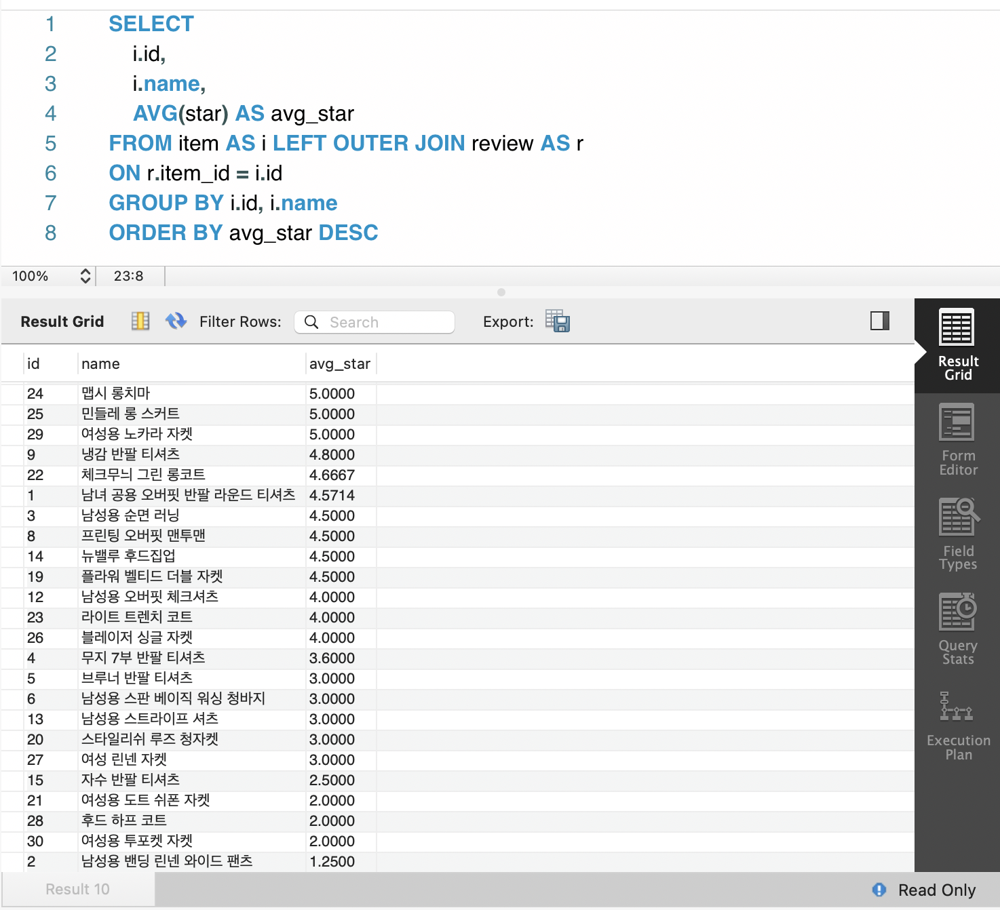

  이제 여기서 평균보다 낮은 애들만 찾고 싶어. 근데 우리가 전체 상품의 평점을 어떻게 알지?...###에 뭘 써야 되는지를 알 수가 없어. 

  ```sql
  SELECT 
  	i.id, 
  	i.name,
      AVG(star) AS avg_star
  FROM item AS i LEFT OUTER JOIN review AS r
  ON r.item_id = i.id
  GROUP BY i.id, i.name
  HAVING avg_star < ##########
  ORDER BY avg_star DESC
  ```

  새 쿼리를 열고 일단 그거부터 구해. 

  ```sql
  SELECT AVG(star) FROM copang_main.review
  ```

  3.7273이 나옴. 

  그러면 그것을 다시 대입하면, 

  ```sql
  SELECT 
  	i.id, 
  	i.name,
    AVG(star) AS avg_star
  FROM item AS i LEFT OUTER JOIN review AS r
  ON r.item_id = i.id
  GROUP BY i.id, i.name
  HAVING avg_star < 3.7273
  ORDER BY avg_star DESC
  ```

  다시 정리하면, 우리는 지금 단계에서는 다른 쿼리창을 키고 3.7273을 구했음. 근데 꼭 그래야 하는 것은 아님. 

  ```sql
  SELECT 
  	i.id, 
  	i.name,
      AVG(star) AS avg_star
  FROM item AS i LEFT OUTER JOIN review AS r
  ON r.item_id = i.id
  GROUP BY i.id, i.name
  HAVING avg_star < (SELECT AVG(star) FROM copang_main.review)
  ORDER BY avg_star DESC
  ```

  위처럼 그 쿼리 자체를 넣으면 돼. 이런 query를 서브쿼리라고 함. 

  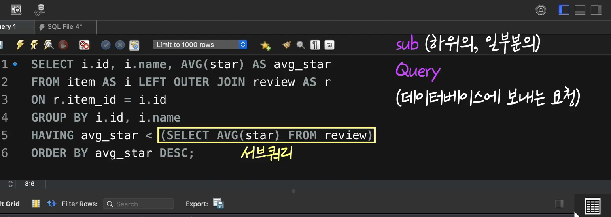

  이런 서브쿼리를 쓸때는 반드시, 괄호를 넣어야 함. 


- #### 서브쿼리에 관한 이야기

  서브쿼리는 **SQL 문 안에 부품처럼 들어있는 “SELECT 문”**이라고 했습니다.

  (참고로 우리는 이번 챕터에서 여러 종류의 SQL 문 중 SELECT 문을 배웠습니다, SELECT 문은 우리가 배운 것처럼 데이터 조회 및 분석을 위한 SQL 문인데요.

  이밖에도 데이터 삽입, 갱신, 삭제를 위한 SQL 문들도 있습니다. 이런 SQL 문들은 곧이은 다른 토픽에서 배우게 될 겁니다. 우리가 아직 배우지 않은 종류의 SQL 문 안에도 서브쿼리가 그 일부로 들어갈 수 있습니다, 참고하세요)

  이전 영상에서 쓴 SQL 문을 다시 볼까요? 

  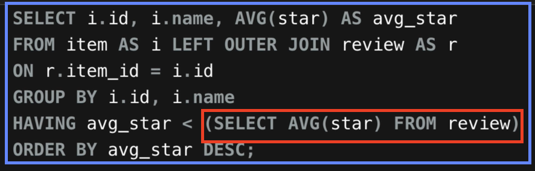

  지금 전체 SQL 문을 파란 박스, 서브쿼리를 빨간색 박스로 표시했는데요. 이 때 서브쿼리를 포함하는 전체 SQL 문을 **outer query(외부 쿼리)**, 서브쿼리를 **inner query(내부 쿼리)**라고 하기도 합니다. 

  이전 영상에서 서브쿼리를 사용했을 때 어땠나요? 쿼리 창을 새로 켤 필요없이, 하나의 쿼리 창에서 **하나의 SQL 문만으로도** 원하는 결과를 얻을 수 있었죠? 이렇게 적재적소에 서브쿼리를 사용하면 여러분이 원하는 결과를 좀더 편하게 얻을 수 있습니다. 위 그림을 보면 지금 서브쿼리가 **HAVING 절**에서 사용됐는데요. 서브쿼리는 **HAVING 절** 뿐만 아니라 **SELECT 절, WHERE 절, FROM 절 등에서도** 사용할 수 있습니다. 

  서브쿼리의 다양한 사용법을 이번 챕터에서 하나씩 배워봅시다.


- #### SELECT 절에 있는 서브쿼리

  SELECT절에 서브쿼리가 없다는 것은 원래의 테이블에는 없던 새로운 컬럼을 추가해서 보겠다는 뜻. 

  item table

  ```Sql
  SELECT id, name, price FROM copang_main.item;
  ```

  여기서 가장 비싼 상품 가격을 추가해보자. 서브쿼리로 만들어 졌어도 Alias를 붙일 수 있음. 

  ```Sql
  SELECT 
  	id, 
  	name, 
    price,
    (SELECT MAX(price) FROM item) AS 'MAX PRICE'
  FROM copang_main.item;
  ```

  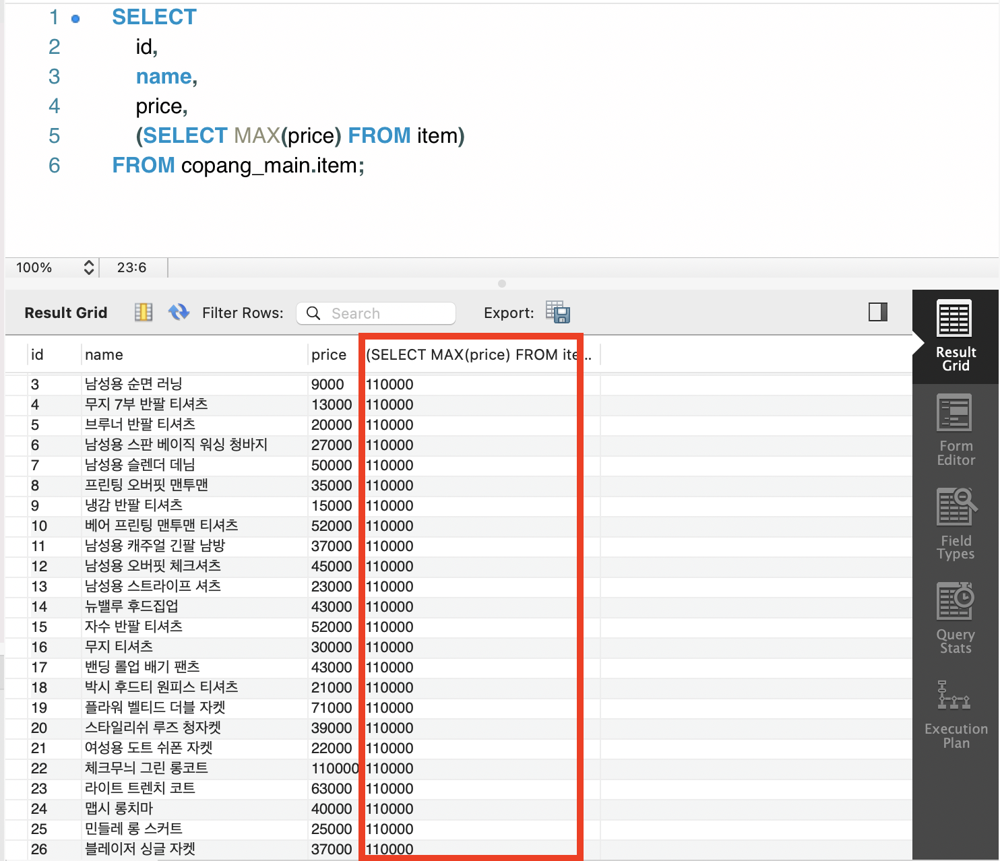

  평균 가격도 보이게 하려면? 

  ```sql
  SELECT 
  	id, 
  	name, 
      price,
      (SELECT MAX(price) FROM item) AS 'MAX PRICE',
      (SELECT AVG(price) FROM item) AS 'AVERAGE PRICE'
  FROM copang_main.item;
  ```

  **이 처럼 SELECT절에 서브쿼리 쓸때는, 위처럼 특정 컬럼의 특징을 찾아주는 query를 자주 씀.** 


- #### WHERE 절에 있는 서브쿼리

  ```sql
  SELECT 
  	id, 
  	name, 
      price,
      (SELECT AVG(price) FROM item) AS 'AVERAGE PRICE'
  FROM copang_main.item
  WHERE price > (SELECT AVG(price) FROM item);
  ```

  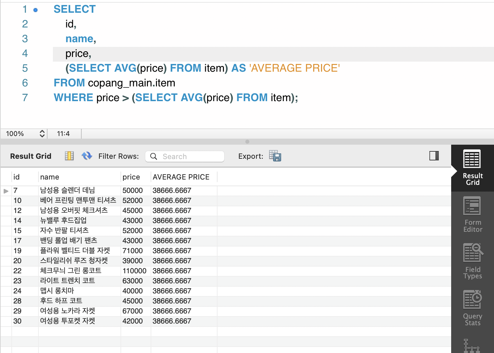

  가장 비싼 상품 확인은?

  ```sql
  SELECT 
  	id, 
  	name, 
      price,
      (SELECT AVG(price) FROM item) AS 'AVERAGE PRICE'
  FROM copang_main.item
  WHERE price =  (SELECT MAX(price) FROM item);
  ```

  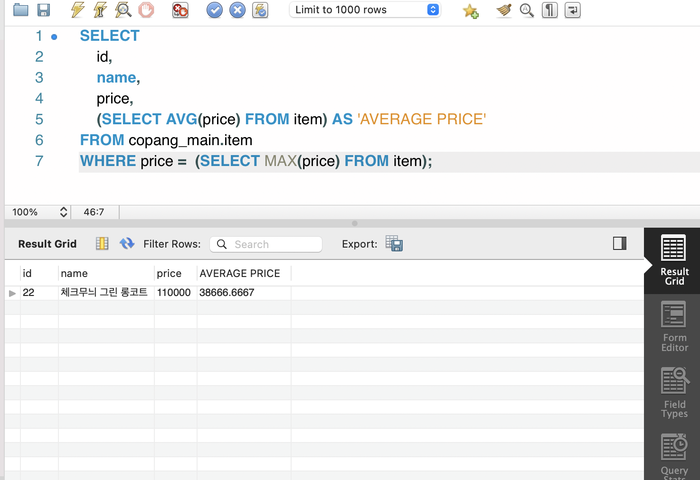


- #### WHERE 절에 있는 서브쿼리2

  이전에 봤던 서브쿼리는 모두, 평균값/최댓값 등 값 하나를 리턴하는 서브쿼리였음. 하지만, 서브쿼리에 값 하나만 리턴하는 것만 있는 것은 아님. **생각해보면, 서브쿼리도 결국 하나의 SELECT문**. 

  **Q. 코팡의 상품 중에서 리뷰가 최소 3개 이상 달린 상품들의 정보만 보고 싶다면 어떻게 할까?**

  join으로 할꺼였으면, 아래처럼 해야지 

  ```Sql
  SELECT 
  	i.id, 
    COUNT(*)
  FROM item AS i
  LEFT OUTER JOIN review AS r
  ON i.id = r.item_id
  GROUP BY i.id HAVING COUNT(*)>3
  ```

  **그런데 사실 서브쿼리로도 해결할 수 있음.**

  ```sql
  SELECT * FROM item
  WHERE id IN 
  (
  SELECT item_id
  FROM review
  GROUP BY item_id HAVING COUNT(*) >= 3
  )
  ```

   IN은 앞에서도 나왔음. 하단의 서브쿼리는 리뷰 3개 이상 id들을 리턴해주고, 그것을 가져가는 거지. 

  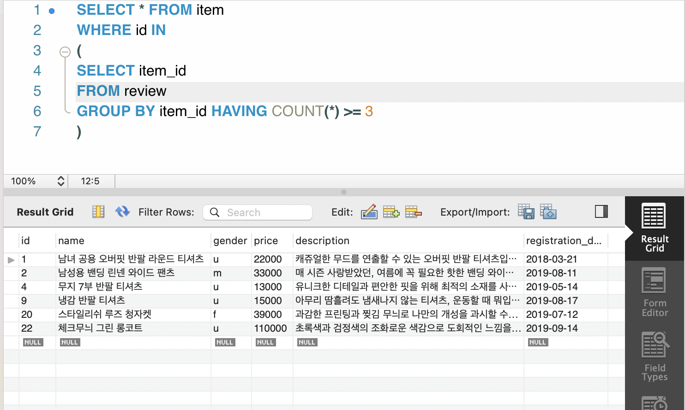


- #### ANY(SOME), ALL

  이전 영상에서는 **하나의 column에 여러 개의 row들이 있는 결과**를 리턴하는 서브쿼리를 배웠습니다. 그리고 그런 서브쿼리 앞에 아래 그림처럼

  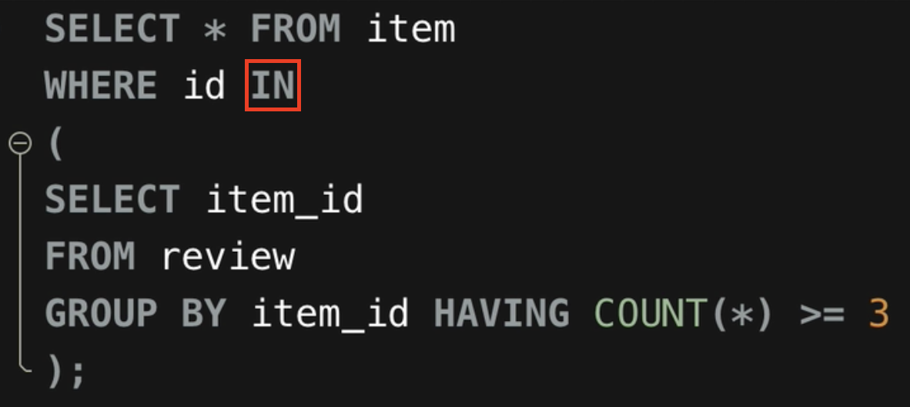

  **IN**을 붙여서 유용하게 사용했는데요. IN 말고도 이런 서브쿼리와 함께 유용하게 사용되는 다른 키워드들도 있습니다. 

  바로 **ANY**와 **ALL**이라는 것인데요. 하나씩 배워볼게요.

  **1. ANY의 의미**

  아래 그림을 잠깐 보겠습니다.

  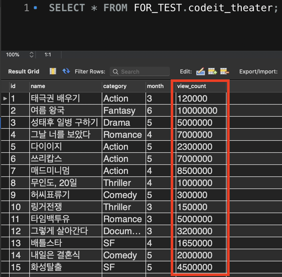

  지금 **codeit_theater**라는 테이블에는 **id(Primary Key), name(영화 이름), category(영화 장르), month(개봉 월), view_count(총 관객 수)** 컬럼이 있습니다.

  이 중에서 category의 값이 'Action'인 영화(액션 영화)들의 view_count 컬럼을 볼까요? 

  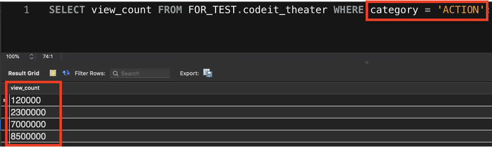

  각 액션 영화의 관객 수가 잘 보입니다. 이전 영상에서 봤던 것처럼, **하나의 column에 여러 개의 row들이 있는 결과**죠? 이 SELECT 문을 서브쿼리로 사용해보겠습니다. 아래 그림의 노란색 부분이 이 SQL 문을 서브쿼리로 사용한 곳입니다.

  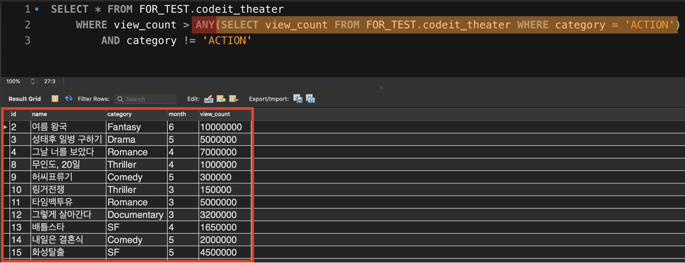

  그런데 지금 WHERE 절을 자세히 보면 서브쿼리 앞에 **ANY**라는 키워드가 붙어있습니다.

  간단하게 나타내보자면,

  ```
  WHERE view_count > ANY(서브쿼리) 
  ```

  이런 식으로 조건이 설정되어 있는데요. 여기서 ANY는 무슨 뜻일까요?

  이 조건은 view_count 컬럼의 값이, 방금 전에 봤던 이 결과(서브쿼리가 리턴한 결과) 

  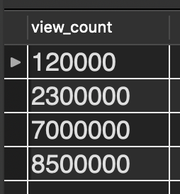

  에 있는 값(120000, 2300000, 7000000, 8500000) 중 **단 하나의(ANY)** 값보다도 크다면 True를 리턴합니다. 이 말은 곧, 4개의 값 중에서도 최소값인 120000보다**만** 큰 값이라면 조건을 만족하게 된다는 뜻이죠.

  

  이 서브쿼리가 사용된 전체 SQL 문의 실행 결과를 다시 보면, view_count가 120000보다 큰 영화들이, 그 중에서도 액션 영화를 제외하고(AND category != 'Action') 조회되었습니다. 

  **ANY**는 우리말로 '~중 하나라도'라는 뜻을 가지는 영어 단어입니다. ANY가 WHERE 절에서 사용될 때는, 서브쿼리의 결과에 있는 각 row의 값들 중 **하나라도 조건을 만족하는 경우가 있으면 True를 리턴한다**는 뜻입니다. ANY와 같은 기능을 하는 **SOME**도 있는데요. 아래 그림처럼 ANY 대신 SOME을 사용해도

  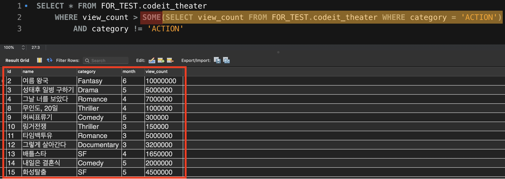

  ANY 때와 같은 결과를 출력하는 걸 알 수 있습니다. **SOME**은 '어떤 하나의~' 라는 뜻을 가진 영어 단어죠? SOME도 **서브쿼리의 결과에 있는 각 row의 값들 중 하나라도 조건을 만족**하면 True를 리턴합니다. ANY와 SOME은 같은 기능을 하니까 원하는 것을 골라서 사용하시면 됩니다.

  **2. ALL의 의미**

  이번에는 ALL이라는 키워드의 의미를 배워보겠습니다. 방금 전 봤던 SQL 문에서 SOME 부분만 ALL로 바꾸고 실행해보겠습니다.

  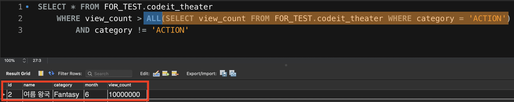

  이번엔 다른 결과가 출력됐는데요. ALL은 '모든~' 이라는 뜻을 갖고 있죠? 그래서 ALL은 모든 경우에 대해서 해당 조건이 성립해야 True를 리턴합니다. 서브쿼리의 실행 결과를 다시 보겠습니다.

  

  ALL이 쓰였다면 **view_count 컬럼의 값이 여기 이 4가지 모든 값보다 커야 True가 된다**는 뜻이죠. 이 말은 곧, 여기서 최댓값인 8500000보다 커야 True가 된다는 뜻인데요.

  

  결과를 다시 자세히 보면 view_count가 8500000보다 많은 10000000인 ‘여름 왕국’만 결과에 있습니다. ALL이 어떤 기능을 하는지 아시겠죠? 

  자, 이번 노트에서는 **하나의 column에 여러 row가 있는 결과를 리턴하는 서브쿼리**에 붙일 수 있는 **ANY(SOME)**와 **ALL**을 배웠습니다. 이 세 가지 단어의 의미를 잘 기억해두시고 필요할 때 유용하게 사용해보세요. 


- #### 과제

  저는 코팡에서 2020년을 기준으로 생각했을 때, 꽤 오래 전에 등록되었지만 아직까지도 리뷰가 달리고 있는 스테디 셀러 상품들의 리뷰들을 살펴보려고 하는데요. review 테이블에서

  (1) '2018년 12월 31일' 이전에 코팡 사이트에 등록된 상품들에 관한 리뷰들만 추려보겠습니다.

  (2) 그리고 이때 review 테이블의 모든 컬럼들을 조회하세요.

  *조인 말고 서브쿼리를 사용해서 문제를 해결해보세요.

  ```sql
  SELECT * 
  FROM review 
  WHERE review.item_id IN
  (SELECT item.id FROM item WHERE item.registration_date <= '2018-12-31')
  ```

  | id   | mem_id | item_id | star | comment                                                      |
  | ---- | ------ | ------- | ---- | ------------------------------------------------------------ |
  | 1    | 1      | 1       | 5    | 착용감이 너무 좋아요, 요새 맨날 이것만 입고 다닙니다.        |
  | 17   | 6      | 1       | 4    | 적당히 입고 다니기 좋네요                                    |
  | 19   | 6      | 3       | 5    | 딱 스탠다드 런닝 느낌이에요. 남동생 선물로 여러 장 샀네요!   |
  | 23   | 10     | 1       | 5    | 편하게 입고 다니기에 좋네요.                                 |
  | 32   | 13     | 1       | 4    | 딱 기본템으로 좋네요, 제 동생도 이쁘다 해서 하나 선물해줬습니다~ |
  | 38   | 16     | 1       | 5    | 색깔이 너무 튀지도 않고 딱 좋아요                            |
  | 40   | 16     | 3       | 4    | 괜찮네요, 친구도 이거 샀더라구요 ㅋㅋ                        |
  | 45   | 18     | 1       | 4    | 질감이 괜찮네요, 패턴 제가 따로 입혀서 입고 다니고 있어요    |
  | 47   | 19     | 1       | 5    | 좋아요~! 계절별로 하나씩 이런 느낌의 옷 있으면 좋겠어요, 두께감만 다르게 해서요 |


- #### FROM 절에 있는 서브쿼리

  지금까지 하나의 값을 리턴하거나, 하나의 컬럼에 해당되는 값을 리턴하는 서브쿼리를 사용했음. 그런데 그 외에도, 아래처럼 여러개의 컬럼에 여러개의 값이 리턴되는 형태로도 활용이 가능함.  

  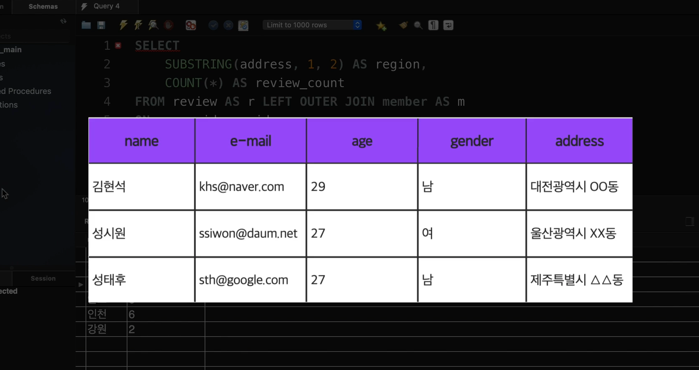

  ```sql
  SELECT 
  	SUBSTRING(address, 1, 2) AS region, 
      COUNT(*) AS review_count
  FROM review AS r LEFT OUTER JOIN member AS m
  ON r.mem_id = m.id 
  GROUP BY SUBSTRING(address, 1, 2);
  ```

  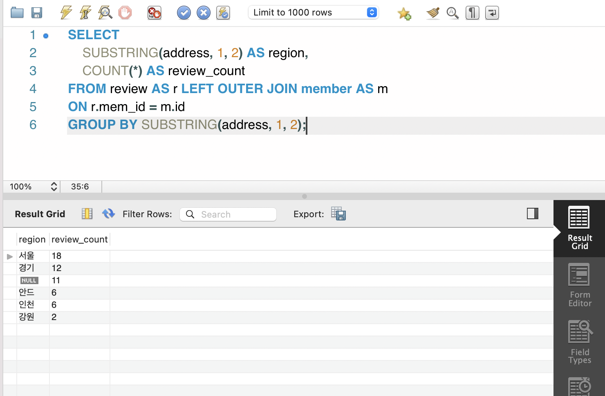

  *굳이 따지자면, 위의 코드는 지역 별, 리뷰의 갯수겠지.* 

  근데 위에 보면, region컬럼에 있는 Null과 안드는 제외시켜야겠지. 

  ```sql
  SELECT 
  	SUBSTRING(address, 1, 2) AS region, 
      COUNT(*) AS review_count
  FROM review AS r LEFT OUTER JOIN member AS m
  ON r.mem_id = m.id 
  GROUP BY SUBSTRING(address, 1, 2)
  HAVING region IS NOT NULL
  	AND region != '안드';
  ```

  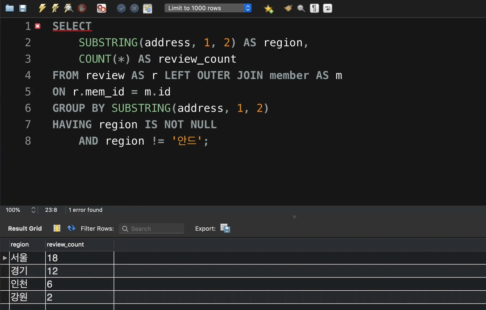

  이제 이 SQL문을 하나의 서브쿼리로 만들어 보자. 

  ```sql
  SELECT 
  	AVG(review_count)
  FROM 
  (SELECT 
  	SUBSTRING(address, 1, 2) AS region, 
      COUNT(*) AS review_count
  FROM review AS r LEFT OUTER JOIN member AS m
  ON r.mem_id = m.id 
  GROUP BY SUBSTRING(address, 1, 2)
  HAVING region IS NOT NULL
  	AND region != '안드');
  ```

  이렇게 하려고 했더니 에러가 남. 

  **Error Code: 1248. Every derived table must have its own alias**

  지금 ()안 처럼 서브쿼리로 탄생한 테이블을 **derived table**이라고 부름. 

  이런 Derived테이블 자체에 반드시 alias가 붙어 있어야 함. 

  *아래처럼*

  ```sql
  SELECT 
  	AVG(review_count)
  FROM 
  (SELECT 
  	SUBSTRING(address, 1, 2) AS region, 
      COUNT(*) AS review_count
  FROM review AS r LEFT OUTER JOIN member AS m
  ON r.mem_id = m.id 
  GROUP BY SUBSTRING(address, 1, 2)
  HAVING region IS NOT NULL
  	AND region != '안드') AS review_count_summary;
  ```

  최대, 최소 리뷰 갯수까지 구하면?

  ```sql
  SELECT 
  	AVG(review_count),
      MAX(review_count),
      MIN(review_count)
  FROM 
  
  (SELECT 
  	SUBSTRING(address, 1, 2) AS region, 
      COUNT(*) AS review_count
  FROM review AS r LEFT OUTER JOIN member AS m
  ON r.mem_id = m.id 
  GROUP BY SUBSTRING(address, 1, 2)
  HAVING region IS NOT NULL
  	AND region != '안드') AS review_count_summary;
  ```

  

