# Basic Concept 4

- #### 서브쿼리란?

  > SELECT, WHERE, FROM, HAVING 절에 들어가는 경우만 배우면 되는 듯. + 상관/비상관/EXISTS/NOT EXISTS

  서브쿼리란 SQL문 안에 부품처럼 들어가는 SELECT문을 의미한다. 

  ```sql
  SELECT 
  	i.id, 
  	i.name, 
    AVG(star) AS avg_star
  FROM item AS i LEFT OUTER JOIN review AS r
  ON r.item_id = i.id
  GROUP BY i.id, i.name
  ORDER BY avg_star DESC;
  ```

  

  이제 여기서 평균보다 낮은 애들만 찾고 싶어. 근데 우리가 전체 상품의 평점을 어떻게 알지?...###에 뭘 써야 되는지를 알 수가 없어. 

  ```sql
  SELECT 
  	i.id, 
  	i.name,
    AVG(star) AS avg_star
  FROM item AS i LEFT OUTER JOIN review AS r
  ON r.item_id = i.id
  GROUP BY i.id, i.name
  HAVING avg_star < ##########
  ORDER BY avg_star DESC
  ```

  새 쿼리를 열고 일단 그거부터 구해. 

  ```sql
  SELECT AVG(star) FROM copang_main.review
  ```

  3.7273이 나옴. 

  그러면 그것을 다시 대입하면, 

  ```sql
  SELECT 
  	i.id, 
  	i.name,
    AVG(star) AS avg_star
  FROM item AS i LEFT OUTER JOIN review AS r
  ON r.item_id = i.id
  GROUP BY i.id, i.name
  HAVING avg_star < 3.7273
  ORDER BY avg_star DESC
  ```

  다시 정리하면, 우리는 지금 단계에서는 다른 쿼리창을 키고 3.7273을 구했음. 근데 꼭 그래야 하는 것은 아님. 

  ```sql
  SELECT 
  	i.id, 
  	i.name,
    AVG(star) AS avg_star
  FROM item AS i LEFT OUTER JOIN review AS r
  ON r.item_id = i.id
  GROUP BY i.id, i.name
  HAVING avg_star < (SELECT AVG(star) FROM copang_main.review)
  ORDER BY avg_star DESC
  ```

  위처럼 그 쿼리 자체를 넣으면 돼. 이런 query를 서브쿼리라고 함. 

  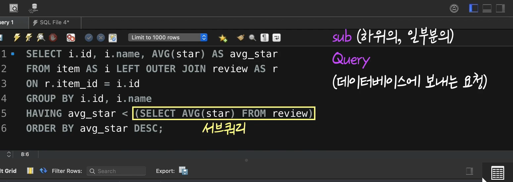

  이런 서브쿼리를 쓸때는 반드시, 괄호를 넣어야 함. 


- #### 서브쿼리에 관한 이야기

  서브쿼리는 **SQL 문 안에 부품처럼 들어있는 “SELECT 문”**이라고 했습니다.

  (참고로 우리는 이번 챕터에서 여러 종류의 SQL 문 중 SELECT 문을 배웠습니다, SELECT 문은 우리가 배운 것처럼 데이터 조회 및 분석을 위한 SQL 문인데요.

  이밖에도 데이터 삽입, 갱신, 삭제를 위한 SQL 문들도 있습니다. 이런 SQL 문들은 곧이은 다른 토픽에서 배우게 될 겁니다. 우리가 아직 배우지 않은 종류의 SQL 문 안에도 서브쿼리가 그 일부로 들어갈 수 있습니다, 참고하세요)

  이전 영상에서 쓴 SQL 문을 다시 볼까요? 

  

  지금 전체 SQL 문을 파란 박스, 서브쿼리를 빨간색 박스로 표시했는데요. 이 때 서브쿼리를 포함하는 전체 SQL 문을 **outer query(외부 쿼리)**, 서브쿼리를 **inner query(내부 쿼리)**라고 하기도 합니다. 

  이전 영상에서 서브쿼리를 사용했을 때 어땠나요? 쿼리 창을 새로 켤 필요없이, 하나의 쿼리 창에서 **하나의 SQL 문만으로도** 원하는 결과를 얻을 수 있었죠? 이렇게 적재적소에 서브쿼리를 사용하면 여러분이 원하는 결과를 좀더 편하게 얻을 수 있습니다. 위 그림을 보면 지금 서브쿼리가 **HAVING 절**에서 사용됐는데요. 서브쿼리는 **HAVING 절** 뿐만 아니라 **SELECT 절, WHERE 절, FROM 절 등에서도** 사용할 수 있습니다. 

  서브쿼리의 다양한 사용법을 이번 챕터에서 하나씩 배워봅시다.


- #### SELECT 절에 있는 서브쿼리

  SELECT절에 서브쿼리가 없다는 것은 원래의 테이블에는 없던 새로운 컬럼을 추가해서 보겠다는 뜻. 

  item table

  ```Sql
  SELECT id, name, price FROM copang_main.item;
  ```

  여기서 가장 비싼 상품 가격을 추가해보자. 서브쿼리로 만들어 졌어도 Alias를 붙일 수 있음. 

  ```Sql
  SELECT 
  	id, 
  	name, 
    price,
   	(SELECT MAX(price) FROM item) AS 'MAX PRICE'
  FROM copang_main.item;
  ```

  

  평균 가격도 보이게 하려면? 

  ```sql
  SELECT 
  	id, 
  	name, 
      price,
      (SELECT MAX(price) FROM item) AS 'MAX PRICE',
      (SELECT AVG(price) FROM item) AS 'AVERAGE PRICE'
  FROM copang_main.item;
  ```

  **이 처럼 SELECT절에 서브쿼리 쓸때는, 위처럼 특정 컬럼의 특징을 찾아주는 query를 자주 씀.** 


- #### WHERE 절에 있는 서브쿼리

  ```sql
  SELECT 
  	id, 
  	name, 
    price,
    (SELECT AVG(price) FROM item) AS 'AVERAGE PRICE'
  FROM copang_main.item
  WHERE price > (SELECT AVG(price) FROM item);
  ```

  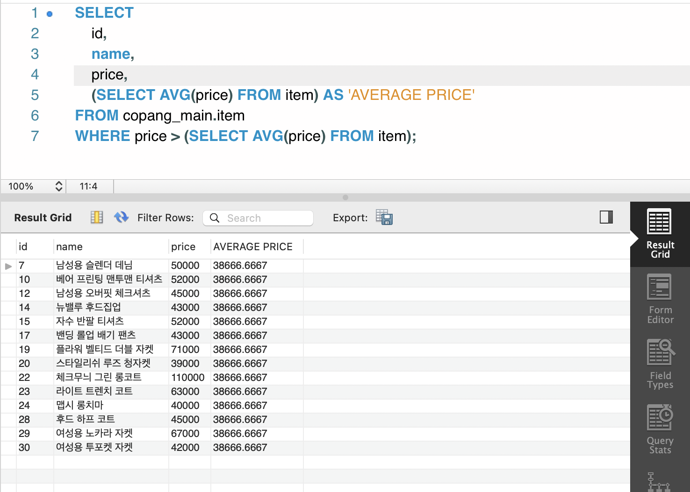

  가장 비싼 상품 확인은?

  ```sql
  SELECT 
  	id, 
  	name, 
      price,
      (SELECT AVG(price) FROM item) AS 'AVERAGE PRICE'
  FROM copang_main.item
  WHERE price =  (SELECT MAX(price) FROM item);
  ```

  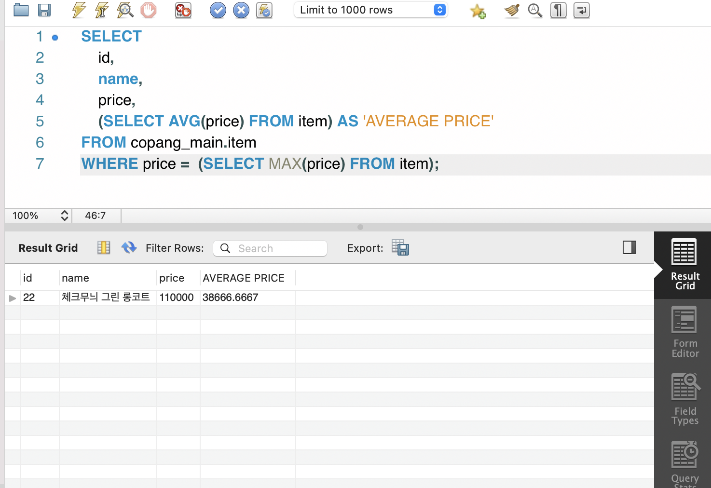


- #### WHERE 절에 있는 서브쿼리2

  이전에 봤던 서브쿼리는 모두, 평균값/최댓값 등 값 하나를 리턴하는 서브쿼리였음. 하지만, 서브쿼리에 값 하나만 리턴하는 것만 있는 것은 아님. **생각해보면, 서브쿼리도 결국 하나의 SELECT문**. 

  **Q. 코팡의 상품 중에서 리뷰가 최소 3개 이상 달린 상품들의 정보만 보고 싶다면 어떻게 할까?**

  join으로 할꺼였으면, 아래처럼 해야지 

  ```Sql
  SELECT 
  	i.id, 
    COUNT(*)
  FROM item AS i
  LEFT OUTER JOIN review AS r
  ON i.id = r.item_id
  GROUP BY i.id HAVING COUNT(*)>3
  ```

  **그런데 사실 서브쿼리로도 해결할 수 있음.**

  ```sql
  SELECT * FROM item
  WHERE id IN 
  (
  SELECT item_id
  FROM review
  GROUP BY item_id HAVING COUNT(*) >= 3
  )
  ```

   IN은 앞에서도 나왔음. 하단의 서브쿼리는 리뷰 3개 이상 id들을 리턴해주고, 그것을 가져가는 거지. 

  


- #### ANY(SOME), ALL

  이전 영상에서는 **하나의 column에 여러 개의 row들이 있는 결과**를 리턴하는 서브쿼리를 배웠습니다. 그리고 그런 서브쿼리 앞에 아래 그림처럼

  

  **IN**을 붙여서 유용하게 사용했는데요. IN 말고도 이런 서브쿼리와 함께 유용하게 사용되는 다른 키워드들도 있습니다. 

  바로 **ANY**와 **ALL**이라는 것인데요. 하나씩 배워볼게요.

  **1. ANY의 의미**

  아래 그림을 잠깐 보겠습니다.

  

  지금 **codeit_theater**라는 테이블에는 **id(Primary Key), name(영화 이름), category(영화 장르), month(개봉 월), view_count(총 관객 수)** 컬럼이 있습니다.

  이 중에서 category의 값이 'Action'인 영화(액션 영화)들의 view_count 컬럼을 볼까요? 

  

  각 액션 영화의 관객 수가 잘 보입니다. 이전 영상에서 봤던 것처럼, **하나의 column에 여러 개의 row들이 있는 결과**죠? 이 SELECT 문을 서브쿼리로 사용해보겠습니다. 아래 그림의 노란색 부분이 이 SQL 문을 서브쿼리로 사용한 곳입니다.

  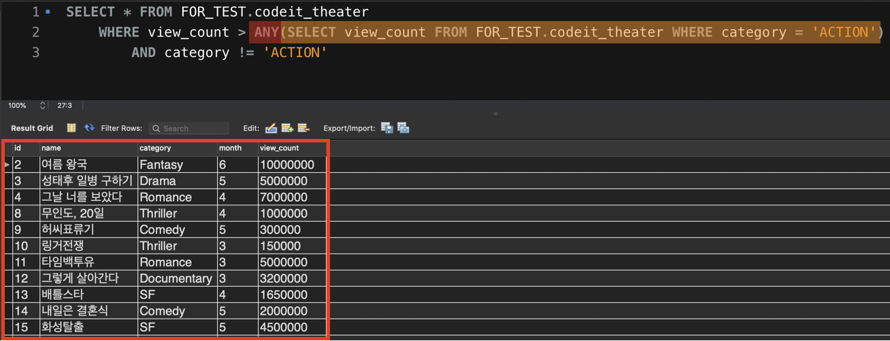

  그런데 지금 WHERE 절을 자세히 보면 서브쿼리 앞에 **ANY**라는 키워드가 붙어있습니다.

  간단하게 나타내보자면,

  ```
  WHERE view_count > ANY(서브쿼리) 
  ```

  이런 식으로 조건이 설정되어 있는데요. 여기서 ANY는 무슨 뜻일까요?

  이 조건은 view_count 컬럼의 값이, 방금 전에 봤던 이 결과(서브쿼리가 리턴한 결과) 

  

  에 있는 값(120000, 2300000, 7000000, 8500000) 중 **단 하나의(ANY)** 값보다도 크다면 True를 리턴합니다. 이 말은 곧, 4개의 값 중에서도 최소값인 120000보다**만** 큰 값이라면 조건을 만족하게 된다는 뜻이죠.

  

  이 서브쿼리가 사용된 전체 SQL 문의 실행 결과를 다시 보면, view_count가 120000보다 큰 영화들이, 그 중에서도 액션 영화를 제외하고(AND category != 'Action') 조회되었습니다. 

  **ANY**는 우리말로 '~중 하나라도'라는 뜻을 가지는 영어 단어입니다. ANY가 WHERE 절에서 사용될 때는, 서브쿼리의 결과에 있는 각 row의 값들 중 **하나라도 조건을 만족하는 경우가 있으면 True를 리턴한다**는 뜻입니다. ANY와 같은 기능을 하는 **SOME**도 있는데요. 아래 그림처럼 ANY 대신 SOME을 사용해도

  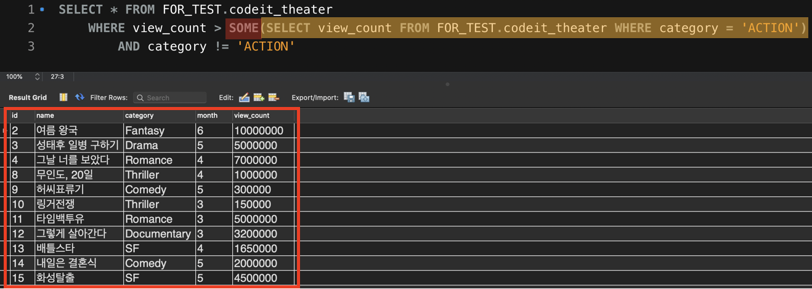

  ANY 때와 같은 결과를 출력하는 걸 알 수 있습니다. **SOME**은 '어떤 하나의~' 라는 뜻을 가진 영어 단어죠? SOME도 **서브쿼리의 결과에 있는 각 row의 값들 중 하나라도 조건을 만족**하면 True를 리턴합니다. ANY와 SOME은 같은 기능을 하니까 원하는 것을 골라서 사용하시면 됩니다.

  **2. ALL의 의미**

  이번에는 ALL이라는 키워드의 의미를 배워보겠습니다. 방금 전 봤던 SQL 문에서 SOME 부분만 ALL로 바꾸고 실행해보겠습니다.

  

  이번엔 다른 결과가 출력됐는데요. ALL은 '모든~' 이라는 뜻을 갖고 있죠? 그래서 ALL은 모든 경우에 대해서 해당 조건이 성립해야 True를 리턴합니다. 서브쿼리의 실행 결과를 다시 보겠습니다.

  

  ALL이 쓰였다면 **view_count 컬럼의 값이 여기 이 4가지 모든 값보다 커야 True가 된다**는 뜻이죠. 이 말은 곧, 여기서 최댓값인 8500000보다 커야 True가 된다는 뜻인데요.

  

  결과를 다시 자세히 보면 view_count가 8500000보다 많은 10000000인 ‘여름 왕국’만 결과에 있습니다. ALL이 어떤 기능을 하는지 아시겠죠? 

  자, 이번 노트에서는 **하나의 column에 여러 row가 있는 결과를 리턴하는 서브쿼리**에 붙일 수 있는 **ANY(SOME)**와 **ALL**을 배웠습니다. 이 세 가지 단어의 의미를 잘 기억해두시고 필요할 때 유용하게 사용해보세요. 


- #### 과제

  저는 코팡에서 2020년을 기준으로 생각했을 때, 꽤 오래 전에 등록되었지만 아직까지도 리뷰가 달리고 있는 스테디 셀러 상품들의 리뷰들을 살펴보려고 하는데요. review 테이블에서

  (1) '2018년 12월 31일' 이전에 코팡 사이트에 등록된 상품들에 관한 리뷰들만 추려보겠습니다.

  (2) 그리고 이때 review 테이블의 모든 컬럼들을 조회하세요.

  *조인 말고 서브쿼리를 사용해서 문제를 해결해보세요.

  ```sql
  SELECT * 
  FROM review 
  WHERE review.item_id IN
  (SELECT item.id FROM item WHERE item.registration_date <= '2018-12-31')
  ```

  | id   | mem_id | item_id | star | comment                                                      |
  | ---- | ------ | ------- | ---- | ------------------------------------------------------------ |
  | 1    | 1      | 1       | 5    | 착용감이 너무 좋아요, 요새 맨날 이것만 입고 다닙니다.        |
  | 17   | 6      | 1       | 4    | 적당히 입고 다니기 좋네요                                    |
  | 19   | 6      | 3       | 5    | 딱 스탠다드 런닝 느낌이에요. 남동생 선물로 여러 장 샀네요!   |
  | 23   | 10     | 1       | 5    | 편하게 입고 다니기에 좋네요.                                 |
  | 32   | 13     | 1       | 4    | 딱 기본템으로 좋네요, 제 동생도 이쁘다 해서 하나 선물해줬습니다~ |
  | 38   | 16     | 1       | 5    | 색깔이 너무 튀지도 않고 딱 좋아요                            |
  | 40   | 16     | 3       | 4    | 괜찮네요, 친구도 이거 샀더라구요 ㅋㅋ                        |
  | 45   | 18     | 1       | 4    | 질감이 괜찮네요, 패턴 제가 따로 입혀서 입고 다니고 있어요    |
  | 47   | 19     | 1       | 5    | 좋아요~! 계절별로 하나씩 이런 느낌의 옷 있으면 좋겠어요, 두께감만 다르게 해서요 |


- #### FROM 절에 있는 서브쿼리

  **FROM절 뒤에는 원래도 테이블 자체가 들어가는 곳 이잖아. 여기에 서브쿼리로 뽑아낸 테이블 자체를 쓸 수 있다는 것.** 매우 편함.  

  지금까지 하나의 값을 리턴하거나, 하나의 컬럼에 해당되는 값을 리턴하는 서브쿼리를 사용했음. 그런데 그 외에도, 아래처럼 여러개의 컬럼에 여러개의 값이 리턴되는 형태로도 활용이 가능함.  

  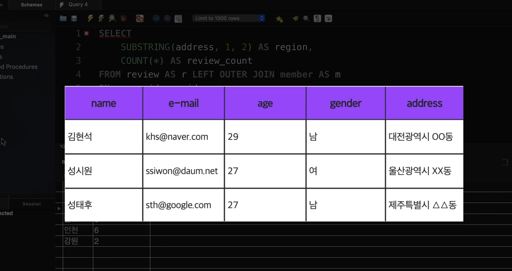

  ```sql
  SELECT 
  	SUBSTRING(address, 1, 2) AS region, 
    COUNT(*) AS review_count
  FROM review AS r LEFT OUTER JOIN member AS m
  ON r.mem_id = m.id 
  GROUP BY SUBSTRING(address, 1, 2);
  ```

  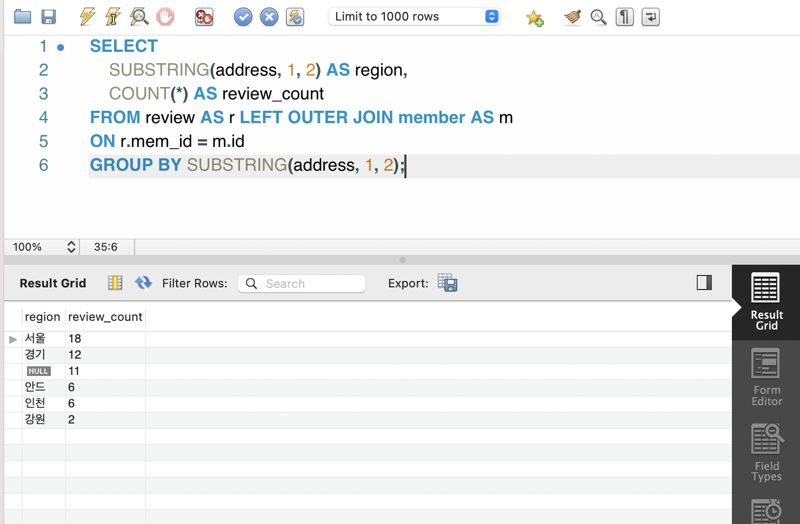

  *굳이 따지자면, 위의 코드는 지역 별, 리뷰의 갯수겠지.* 

  근데 위에 보면, region컬럼에 있는 Null과 안드는 제외시켜야겠지. 

  ```sql
  SELECT 
  	SUBSTRING(address, 1, 2) AS region, 
      COUNT(*) AS review_count
  FROM review AS r LEFT OUTER JOIN member AS m
  ON r.mem_id = m.id 
  GROUP BY SUBSTRING(address, 1, 2)
  HAVING region IS NOT NULL
  	AND region != '안드';
  ```

  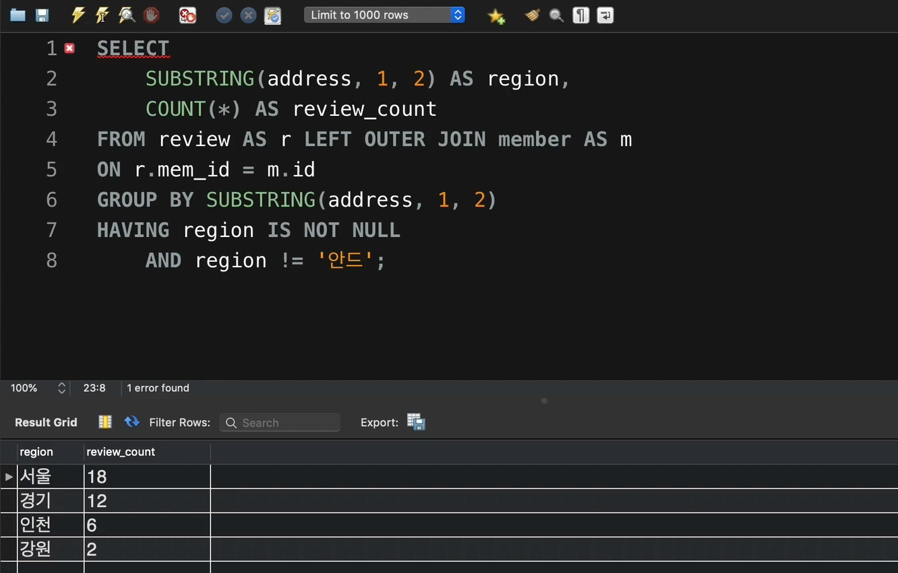

  이제 이 SQL문을 하나의 서브쿼리로 만들어 보자. 

  ```sql
  SELECT 
  	AVG(review_count)
  FROM 
  (SELECT 
  	SUBSTRING(address, 1, 2) AS region, 
      COUNT(*) AS review_count
  FROM review AS r LEFT OUTER JOIN member AS m
  ON r.mem_id = m.id 
  GROUP BY SUBSTRING(address, 1, 2)
  HAVING region IS NOT NULL
  	AND region != '안드');
  ```

  이렇게 하려고 했더니 에러가 남. 

  **Error Code: 1248. Every derived table must have its own alias**

  지금 ()안 처럼 서브쿼리로 탄생한 테이블을 **derived table**이라고 부름. 

  이런 **Derived테이블 자체에 반드시 alias가 붙어 있어야 함.** 

  *아래처럼*

  ```sql
  SELECT 
  	AVG(review_count)
  FROM 
  (SELECT 
  	SUBSTRING(address, 1, 2) AS region, 
      COUNT(*) AS review_count
  FROM review AS r LEFT OUTER JOIN member AS m
  ON r.mem_id = m.id 
  GROUP BY SUBSTRING(address, 1, 2)
  HAVING region IS NOT NULL
  	AND region != '안드') AS review_count_summary;
  ```

  최대, 최소 리뷰 갯수까지 구하면?

  ```sql
  SELECT 
  	AVG(review_count),
      MAX(review_count),
      MIN(review_count)
  FROM 
  
  (SELECT 
  	SUBSTRING(address, 1, 2) AS region, 
      COUNT(*) AS review_count
  FROM review AS r LEFT OUTER JOIN member AS m
  ON r.mem_id = m.id 
  GROUP BY SUBSTRING(address, 1, 2)
  HAVING region IS NOT NULL
  	AND region != '안드') AS review_count_summary;
  ```

  

- #### 서브쿼리 종류 총정리

  이때까지 다양한 서브쿼리에 대해서 배워봤는데요. 

  서브쿼리는 그것이 리턴하는 결과의 형태에 따라 여러 종류로 나눌 수 있습니다. 이때 다양한 종류가 있지만 실무적으로 유용한 3가지 종류를 정리하면 다음과 같습니다. 모두 우리가 배운 내용들입니다. 하나씩 설명할게요. 

  **1. 단일값을 리턴하는 서브쿼리**

  예)

  

  하나의 값, 즉, 단일값을 리턴하는 서브쿼리입니다. 단일값은 수학, 물리 분야에서 **스칼라(scalar)**라고도 하는데요. 그래서 이런 서브쿼리를 **스칼라 서브쿼리**라고도 합니다. 이런 스칼라 서브쿼리는 SELECT 절에서 **하나의 컬럼**처럼, WHERE 절에서 **=, > 등의 조건 표현식과 비교하는 값으로** 쓸 수 있겠죠? 

  **2. 하나의 column에 여러 row들이 있는 형태의 결과를 리턴하는 서브쿼리** 

  예)

  

  하나의 column에, 여러 row가 있는 형태의 결과를 리턴하는 서브쿼리입니다. 이런 서브쿼리는 **IN, ANY(SOME), ALL** 등의 키워드와 함께 쓸 수 있다고 했던 거, 기억나시죠? 

  **3. 하나의 테이블 형태의 결과(여러 column, 여러 row)를 리턴하는 서브쿼리** 

  예) 

  

  테이블 형태의 값을 리턴하는 서브쿼리입니다. 이런 서브쿼리로 일시적으로 탄생한 테이블을 **derived table**이라고 한다고 했죠?(Oracle에서는 inline view라고도 합니다) 이런 서브쿼리로 생겨난 derived table은 마치 원래 있던 테이블인 것처럼 사용하면 됩니다. 대신, **derived table에는 alias를 붙여줘야 한다는 규칙이 있습니다.** 

  자, 서브쿼리를 그 리턴 결과의 종류에 따라 나눠보았는데요. 서브쿼리가 리턴하는 결과의 형태를 잘 예측해야, 에러없이 서브쿼리를 활용할 수 있습니다. 그 정도 수준이 되려면 다양한 상황에서 서브쿼리를 쓰는 연습을 해봐야겠죠? 그리고 각 종류의 서브쿼리와 어떤 키워드들을 함께 쓸 수 있는지도 잘 기억하고 있는 게 좋습니다.


- #### EXISTS, NOT EXISTS와 상관 서브쿼리

  이전 노트에서는 서브쿼리가 어떤 형식(column, row 수 기준)의 결과를 리턴하는지에 따라 그 종류를 나눠봤습니다. 

  그런데 서브쿼리를 그 리턴 결과가 아닌 다른 측면에서도 분류해볼 수 있는데요. 

  서브쿼리를 다른 방식으로 분류하는 방법은,

  서브쿼리를 

  (1) **비상관 서브쿼리**와

  (2) **상관 서브쿼리**로

  분류하는 것입니다. 이 내용은 좀 어려우니까 집중해서 읽어보세요.

  비상관 서브쿼리가 뭘까요? 잠깐 이전 영상에서 배운 SQL 문을 보고 설명해드릴게요. 

  

  위 그림을 보시면 WHERE 절에서 서브쿼리가 사용되고 있는데요. 이 서브쿼리는 지금 **그 자체만으로도 실행이 가능한 서브쿼리**입니다. 따라서 이 서브쿼리만 빼서 아래 그림처럼 별도로 실행을 해봐도 

  

  잘 실행됩니다. 이것은 **이 서브쿼리가 그것을 둘러싼 outer query와 별개로, 독립적으로 실행되기 때문에** 그런 겁니다. 이렇게 outer query와 상관 관계가 없는 서브쿼리를 **비상관 서브쿼리**라고 합니다. **이때까지 우리가 배운 서브쿼리들이 모두 비상관 서브쿼리에 해당합니다.** 

  그렇다면 상관 서브쿼리는 무엇일까요? 상관 서브쿼리는 우리가 지금 새롭게 배워야할 종류의 서브쿼리입니다. **상관 서브쿼리란 outer query와 상관 관계가 있는 서브쿼리를 말하는데요.** 아래 예시와 함께 설명할게요. 

  

  지금 이 그림을 보면 WHERE 절에 서브쿼리가 하나 쓰였습니다. 그리고 그 앞에 EXISTS라는 처음 보는 단어가 있는데요. EXISTS의 의미는 곧 바로 설명할게요. 일단 지금 서브쿼리의 뒷 부분을 보면 **item**이라는 테이블 이름이 있다는 것을 알 수 있습니다. 그런데 여기서 **신기한 사실은 item 테이블의 이름이 서브쿼리의 FROM 절에 있는 게 아니라 outer query에 있다는 점인데요. 주황색 강조 처리된 두 개의 item이라는 테이블 이름을 보세요.** 

  지금 서브쿼리가 필요로 하는 item 테이블이 outer query에 적혀있기 때문에 이 서브쿼리는 방금 전 '비상관 서브쿼리' 때와는 달리 단독으로 실행되지 못합니다. 잠깐 이 서브쿼리만 별도로 빼서 실행해보면, 

  

  **방금 전의 비상관 서브쿼리와는 달리 실행에 실패합니다.** item이라는 테이블 이름이 지금 FROM 절에 없기 때문에 당연한 겁니다. 

  이렇게 **서브쿼리가 outer query에 적힌 테이블 이름 등과 상관 관계를 갖고 있어서 그 단독으로는 실행되지 못하는 서브쿼리를 상관 서브쿼리라고 합니다.** 

  그렇다면 지금 

  

  이 SQL 문 전체는 무슨 뜻일까요? 하나씩 해석해볼게요. 

  이 SQL 문의 최종 조회 결과를 하나의 바구니라고 생각해봅시다.

  그리고 시작할게요. 

  (1) 일단 item 테이블의 첫 번째 row를 생각합시다. 

  (2) 그 row의 id(**item.id**) 값과 같은 값을 item_id(**review.item_id**) 컬럼에 가진 review 테이블의 row(가/들이) 있는지 조회합니다. 

  (3) 만약에 존재하면(EXISTS의 의미가 바로 이것입니다!, exist는 우리말로 '존재하다'라는 뜻입니다)

  (4) WHERE 절은 True가 되고, (1)에서 생각했던 item 테이블의 row는 최종 조회 결과 바구니에 담깁니다.

  이제 item 테이블의 두 번째 row에 대해서 (2) ~ (4)의 과정을 반복합니다. → 세 번째 row에 대해서 (2) ~ (4)의 과정을 반복합니다.

  → item 테이블의 마지막 row까지 (2) ~ (4)의 과정을 반복합니다. 

  이렇게 되면 **item 테이블 중에서 그 id 컬럼 값이 review 테이블의 item_id 컬럼에 존재하는 row들만 추려지겠죠?** 이 말을 조금 바꿔서 말하면 **상품들 중에서 리뷰가 달린 상품들만 조회**한 것입니다. 상관 서브쿼리가 뭔지 조금 감이 오시나요?

  이것과 정 반대로 아직 리뷰가 달리지 않은 상품들만 조회하는 방법도 있습니다. 아래 그림과 같이 EXISTS 대신 **NOT EXISTS**를 사용하면 됩니다. 

  

  NOT EXISTS는 EXISTS와 정반대 의미로, 위에서 설명한 단계들에서 ‘(3)번 만약에 존재한다면’을 ‘**(3)번 만약에 존재하지 않는다면**’으로 바꾸고 생각하시면 됩니다. NOT EXISTS를 사용하니 리뷰가 달리지 않은 상품들만 잘 조회되었습니다. 

  상관 서브쿼리가 뭔지, 상관 서브쿼리에서 사용되는 EXISTS, NOT EXISTS의 의미가 뭔지 이해되시나요? 

  *직접 해보니깐, 아래 두 식은 똑같은 결과가 나옴.* 즉 exists/not exists subquery에서 select에는 뭘 쓰는지 상관없이 고르는 것 같음.  

  ```Sql
  SELECT * FROM item
  	WHERE NOT EXISTS 
      (SELECT * FROM review WHERE review.item_id = item.id)
  ```

  ```sql
  SELECT * FROM item
  	WHERE NOT EXISTS 
      (SELECT item_id FROM review WHERE review.item_id = item.id)
  ```

  *Item_id뿐만이 아니라, SELECT절에 뭘 써도 다 실행이 됨.* 

  예시 하나 더, 

  ```sql
  SELECT * FROM member WHERE NOT EXISTS ( SELECT * FROM review WHERE review.mem_id = member.id );
  ```

  

  EXIST, NOT EXISTS는 상관 서브쿼리와 함께 자주 사용되는 키워드이기 때문에 그 의미를 잘 기억해두시는 게 좋습니다. 

  하지만 **상관 서브쿼리라고 해서 꼭 EXISTS, NOT EXISTS 같은 키워드를 써야만 하는 건 아닙니다.** 잠깐 아래 그림을 보세요. 상관 서브쿼리로 이런 것도 할 수 있습니다.

  지금 저는 member 테이블을 조회하면서, 같은 해에 태어난 회원들 중 **가장 작은 키**를 가진 회원의 키 정보를 담은 컬럼을 오른쪽 끝에 추가해서 보려고 하는데요. 방금 전에 배운 상관 서브쿼리의 해석 방법대로 아래 SQL 문을 해석해보세요.

  ```sql
  SELECT *,
  (SELECT MIN(height) 
  FROM member AS m2 WHERE birthday IS NOT NULL AND height IS NOT NULL
  AND YEAR(m1.birthday) = YEAR(m2.birthday)) AS min_height_in_the_year
  FROM member AS m1
  ORDER BY min_height_in_the_year
  ```

  

  > 이게 순서가 뻔한게, m1을 기준으로 첫번째 Row를 가져옴,. 그 다음에 subquery가 실행된 결과로 하나가 딱 나오고. 이게 반복되는 것. 

  지금 보면 member 테이블 하나를 갖고 마치 이전에 배운 [SELF JOIN 같은 작업](https://www.codeit.kr/learn/3230)을 처리하고 있다는 걸 알 수 있습니다.

  혹시 해석이 바로 안 되시는 분들을 위해 이미지에 있는 번호대로 하나씩 설명해드릴게요.

  1번 : 일단 birthday 컬럼과 height 컬럼에 둘다 값이 있는 회원들만 대상으로 해야하기 때문에 이런 조건을 걸었습니다. 

  그 다음 member 테이블의 첫 번째 row를 생각합시다. 

  2번 : 그 row에 대해서 같은 **YEAR(birthday) ('생일연도')** 값을 가진 row(를/들을) 찾습니다.

  3번 : 그 다음 해당 row(의/들의) height 컬럼의 최솟값을 구합니다. 

  member 테이블의 두 번째 row를 생각하고, 2~3번을 수행합니다. 

  member 테이블의 세 번째 row를 생각하고 ,2~3번을 수행합니다. 

  … 

  이런 식으로 구하다 보면 특정 회원과 같은 해에 태어난 사람들 중 가장 작은 키를 가진 사람의 키를 마지막 컬럼에서 볼 수 있습니다. 

  위 결과를 보면 같은 해에 태어난 회원들은 min_height_in_the_year라는 컬럼에서 모두 같은 값을 갖고 있는 것을 확인할 수 있습니다.

  자, 상관 서브쿼리는 처음 배울 때는 조금 어려울 수도 있는 개념입니다. 위 내용을 이해될 때까지 반복해서 읽어보세요. 

  참고로 비상관 서브쿼리는 영어로 **Non-correlated Subquery**, 상관 서브쿼리는 영어로 **Correlated Subquery**라고 합니다.


- #### 서브쿼리 VS 조인

  자, 이제 우리는 서브쿼리(Subquery)에 대해서 어느 정도 배웠습니다. 그런데 여기서 잠시 고민해볼 문제가 하나 있는데요. 예시를 들어서 설명할게요.

  잠깐 아래 SQL 문을 보세요.

  

  이 SQL 문은 지금 3개의 컬럼을 조회하고 있습니다.

  (1) item 테이블의 id 컬럼,

  (2) item 테이블의 name 컬럼,

  (3) stock 테이블의 inventory_count 컬럼

  이렇게 3개입니다.

  item 테이블은 코팡의 상품 정보 테이블, stock 테이블은 각 상품의 재고 정보 테이블이었던 거, 기억나시죠?

  지금 보면 마지막 **3번째 컬럼은 서브쿼리로 표현되었다는 걸 알 수 있습니다.** 그리고 좀더 생각해보면 이건 [이전 노트](https://www.codeit.kr/learn/3239/)에서 배운 상관 서브쿼리(Correlated Subquery)입니다. 상관 서브쿼리를 해석하는 방법, 기억나시나요? 지금 3번째 컬럼을 나타내는 서브쿼리를 해석해볼게요.

  (a) 일단 item 테이블의 첫 번째 row를 생각합니다.

  (b) 그 row의 **id** 컬럼의 값과 같은 값을 **item_id** 컬럼에 가진 stock 테이블의 row를 찾습니다.

  (c) 찾은 stock 테이블의 row의 **inventory_count** 컬럼의 값을 리턴합니다.

  그리고 item 테이블의 두 번째 row, 세 번째 row.. 순으로 (b), (c)의 단계를 반복하면 되는데요. 이렇게 하면 item 테이블의 각 상품에 알맞은 재고 수(inventory_count) 값을 매칭시킬 수 있습니다.

  그런데 사실 위 결과는 우리가 챕터 5에서 배웠던 **조인(join)만으로도 충분히 해결할 수 있습니다.** 아래 SQL 문을 보면,

  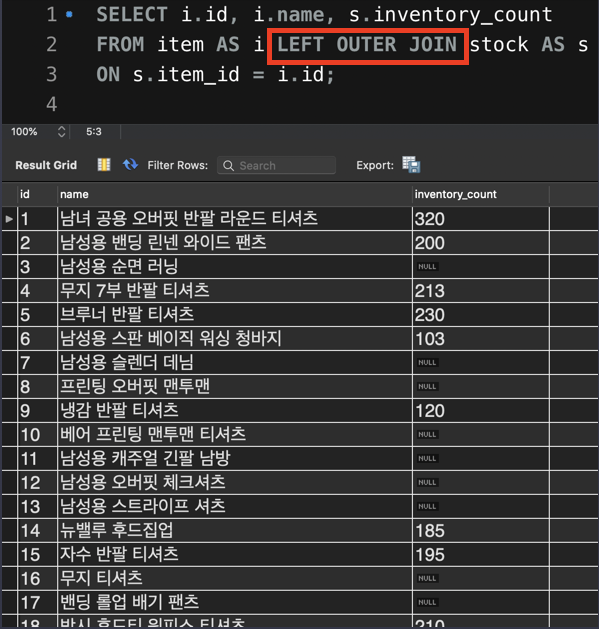

  조인을 통해서도 똑같은 결과를 조회할 수 있습니다.

  그럼 과연 **상관 서브쿼리**와 **조인**, 이 둘 중에서 무엇을 써야할까요? 정답은 없습니다. 데이터를 분석할 때는 여러분이 더 익숙하고 직관적으로 이해할 수 있는 것을 선택하면 되는데요.

  하지만 만약 테이블에 아주 많은 수의 row들이 있을 때는 이 두 가지 방법 간에 속도 차이가 날 수도 있습니다. 특히 SQL 문으로 데이터 조회 코드를 짜는 개발자의 경우에는 이런 부분까지도 신경써야 하죠. 지금 중요한 내용은 아니니까 자세한 설명은 생략할게요.  

  일단은 SQL에서 같은 결과를 얻기 위해서 여러 방법을 활용할 수 있다는 사실을 기억하고 넘어가시면 좋습니다.


- #### 서브쿼리로 더 간결해진 CASE 함수 내부

  자, 이제 SQL 문을 쓸 때 서브쿼리를 어떻게 활용할 수 있을지 감이 오셨나요? 

  그럼 잠깐 우리가 이전 챕터에서 해결하지 못했던 내용을 이제 한번 해결해봅시다. 예전에 우리는 [챕터 4의 'alias를 붙이고 바로 쓸 수 없는 이유'라는 노트](https://www.codeit.kr/learn/3191/)를 잠깐 다시 살펴보고 오세요. 이때 우리는

  SELECT 절에서 어떤 컬럼에 붙인 **alias**를, **같은 SELECT 절 안에서 재사용하지 못한 문제**가 있었는데요. 그러니까 이렇게

  

  SELECT 절 안에서 설정했던 **BMI**라는 alias를,

  

  동일한 SELECT 절에서 재활용하지 못했습니다. 그래서 어쩔 수 없이 가독성이 좋지 않은 SQL 문을 작성할 수 밖에 없었죠. 

  하지만 이제 서브쿼리를 배웠으니 그 문제를 해결할 수 있습니다. 아래 그림을 보세요.

  

  지금 BMI라는 alias를 붙인 SELECT 문을 서브쿼리로 만들었습니다. 이 서브쿼리는 FROM 뒤에 있으니까 derived table로 인식되겠죠? 지금 그 derived table에 **subquery_for_BMI**라는 alias를 붙인 상태네요.

  이제 **subquery_for_BMI**는 마치 원래 존재하던 테이블인 것처럼 자유롭게 사용할 수 있습니다. 그래서 지금 보면 outer query에서 BMI라는 단어를 자유롭게 사용하는 것을 볼 수 있습니다.

  이렇게 쓰면 마치, 이미 BMI라는 컬럼이 있는 테이블에서 조회를 하는 것과 같기 때문에 이전과는 달리 에러가 발생하지 않습니다. 서브쿼리를 배웠더니 읽기 쉬운 SQL 문을 작성하는데 도움이 되는군요! 


- #### 서브쿼리 중첩과 그 문제점

  사실 서브쿼리 안에 서브쿼리를 또 쓰는 것 또한 가능함. 이것을 서브쿼리를 중첩한다 라고 말함. 

  

  ```sql
  SELECT 
  	i.id,
  	i.name,
      AVG(star) AS avg_star,
      COUNT(*) AS count_star
  FROM item AS i LEFT OUTER JOIN review AS r ON r.item_id = i.id
  	LEFT OUTER JOIN member AS m on r.mem_id = m.id 
  WHERE m.gender = 'f'
  GROUP BY i.id, i.name
  HAVING COUNT(*) >= 2
  ORDER BY AVG(star) DESC, COUNT(*) DESC;
  ```

  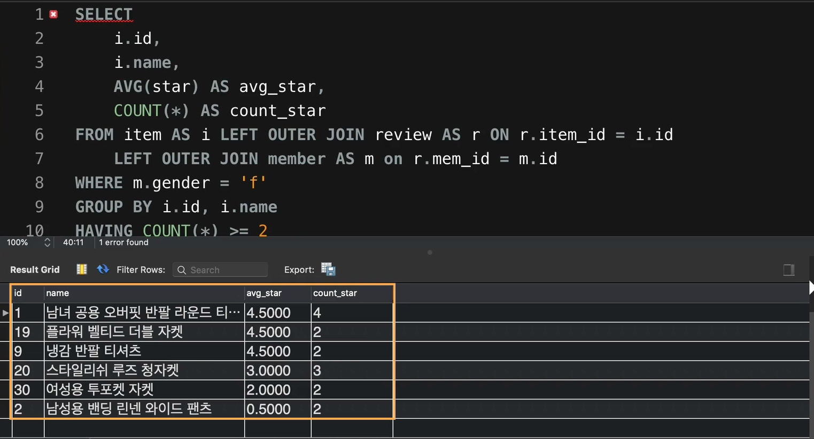

  여기서 별점의 평균이 가장 큰 값만 조회하고 싶다면 어떻게 해야 할까? 

  ```sql
  SELECT 
  	i.id,
  	i.name,
      AVG(star) AS avg_star,
      COUNT(*) AS count_star
  FROM item AS i LEFT OUTER JOIN review AS r ON r.item_id = i.id
  	LEFT OUTER JOIN member AS m on r.mem_id = m.id 
  WHERE m.gender = 'f'
  GROUP BY i.id, i.name
  HAVING COUNT(*) >= 2 AND avg_star = 
  (
  	SELECT 
  		MAX(avg_star)
  	FROM  (
      SELECT i.id, i.name, AVG(star) AS avg_star, COUNT(*) AS count_star
      FROM item AS i LEFT OUTER JOIN review AS r ON r.item_id = i.id
  		LEFT OUTER JOIN member AS m on r.mem_id = m.id 
  	WHERE m.gender = 'f'
  	GROUP BY i.id, i.name
  	HAVING COUNT(*) >= 2
  	ORDER BY AVG(star) DESC, COUNT(*) DESC
  ) AS final
  )
  ORDER BY AVG(star) DESC, COUNT(*) DESC;
  ```

  

  **계속 중첩되어 있음**. 문제의 답을 잘 구했음. 그런데, 너무 길어. 가독성이 떨어짐. 중복되는 부분도 많음.  

  꼭 중첩해야만 문제를 해결할 수 있는 것은 아님. 

- #### 데이터분석가의 자산, 뷰 

  지금 위에서 보면, 1번과 4번이 중복되잖아. 테이블을 저장해 두면 중복할 필요가 없음. 이럴 때는 SQL에서 VIEW라는 것을 사용해야 함

  

  뒤의 중첩 부분에서 아랫 부분을 복사함. 

  ```sql
  SELECT i.id, i.name, AVG(star) AS avg_star, COUNT(*) AS count_star
      FROM item AS i LEFT OUTER JOIN review AS r ON r.item_id = i.id
  		LEFT OUTER JOIN member AS m on r.mem_id = m.id 
  	WHERE m.gender = 'f'
  	GROUP BY i.id, i.name
  	HAVING COUNT(*) >= 2
  	ORDER BY AVG(star) DESC, COUNT(*) DESC
  ```

  새로운 쿼리 창을 열고, **CREATE VIEW**

  ```sql
  CREATE VIEW three_tables_joined AS 
  SELECT i.id, i.name, AVG(star) AS avg_star, COUNT(*) AS count_star
      FROM item AS i LEFT OUTER JOIN review AS r ON r.item_id = i.id
  		LEFT OUTER JOIN member AS m on r.mem_id = m.id 
  	WHERE m.gender = 'f'
  	GROUP BY i.id, i.name
  	HAVING COUNT(*) >= 2
  	ORDER BY AVG(star) DESC, COUNT(*) DESC
  ```

  view도 Sql에 저장되는 테이블임. 

  CREATE VIEW했으면 새로고침 누르고, 왼쪽에서 view로 가면 테이블이 있음. 

  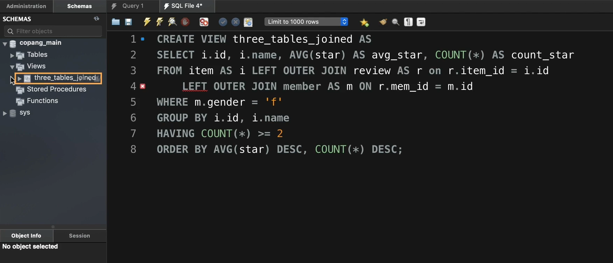

  이제는 마치 원래부터 존재했던 테이블처럼 사용하면 됨. 

  이제 다시 별점의 평균값이 가장 높은 상품들을 조회해 보자. 

  ```sql
  SELECT * FROM three_tables_joined 
  WHERE avg_star = (SELECT MAX(avg_star) FROM three_tables_joined)
  ```

  

  이번에는 이 중에서도 리뷰가 가장 많은 것만 봐보자. 

  ```sql
  SELECT * FROM three_tables_joined 
  WHERE 
  avg_star = (
  	SELECT MAX(avg_star) FROM three_tables_joined
  )
  AND
  count_star = (SELECT MAX(count_star) FROM three_tables_joined)
  ```

  **자주 쓰는 테이블에 있다면 적절한 이름으로 View를 저장해 둘 것.** 데이터분석가의 귀중한 자산. 

- #### 뷰에 관해 알아야 할 사실

  이전 영상에서 **뷰(View)**를 ‘**가상 테이블**’이라고도 한다고 말했습니다. 그럼 뷰와 그냥 테이블은 무슨 차이가 있는 걸까요? 

  가장 큰 차이는 **뷰는 테이블과 달리 데이터가 물리적으로 컴퓨터에 저장되어 있는 건 아니라는 점입니다.** 

  테이블은 우리가 표 형식으로 보는 데이터들이 실제로 컴퓨터에 저장되어 있습니다. 

  그런데 뷰는 표 형식으로 내용을 본다는 점에서는 테이블과 같지만, 테이블처럼 그 내용이 실제로 컴퓨터에 일일이 저장되어 있는 건 아니라는 점이 다릅니다. 그 대신 뷰는, 우리가 뷰를 사용할 때, DBMS가 그 뷰를 생성하는 SQL 문을 재실행하는 방식으로 가상의 테이블을 만들어주는 겁니다. 잠깐 아래 그림으로 설명해보자면,

  

  우리가 three_tables_joined 라는 뷰를 사용할 때마다 **AS 다음에 있는 빨간 박스 안의 SELECT 문이 재실행된다는 뜻입니다.** 

  즉, 뷰라는 건, 테이블처럼 컴퓨터에서 데이터 크기만큼의 물리적인 용량을 차지하고 있는 것은 아니라는 뜻입니다. (요즘에는 자주 사용하는 뷰인 경우, 테이블처럼 데이터가 물리적으로 저장되도록 하는 기능도 있는데요. 중요한 내용은 아니니까 넘어갈게요)

  뷰는 데이터베이스에 저장된 데이터를 분석해야할 때 매우 유용한 개념이자 기능입니다. 뷰의 장점들을 하나씩 살펴보겠습니다. 

  **첫 번째, 뷰는 사용자에게 높은 편의성을 제공해줍니다.** 이전 영상에서 본 것처럼 여러 테이블을 조인하는 SQL문을 매번 필요할 때마다 사용하는 것은 정말 번거로운 일입니다. 하지만 이런 복잡한 SQL문을 뷰로 한번 저장해두면 계속 재활용할 수 있어서 정말 편리하죠. 이건 이미 실감해봤으니까 바로 넘어갈게요. 

  **두 번째, 각 직무별 데이터 수요에 알맞은, 다양한 구조의 데이터 분석 기반을 구축해둘 수 있습니다.** 같은 테이블들이 존재하는 상황에서도, 직무에 따라, 상황에 따라, 필요로 하는 데이터의 종류와 그 구조가 사람마다 다를 수 있는데요. 뷰를 사용하면 각자에게 적합한 구조로 데이터들을 준비해둘 수 있기 때문에 회사 입장에서도 기존의 테이블 구조를 건드리지 않고, 풍부한 데이터 분석 기반을 준비할 수 있게 됩니다.

  **세 번째, 뷰는 데이터 보안을 제공합니다.** 이 부분이 상당히 중요한데요. 예를 들어, 회사에서 직원들에 관한 정보를 담고 있는 **employee**라는 테이블이 있고 이 테이블에는 굉장히 민감한 정보가 담긴 컬럼들이 있다고 가정합시다. 예를 들어, **주민등록번호**나 **주소**, **연봉** 등과 같은 정보 말이죠. 그런데 회사 내의 데이터 분석가가 어떤 분석을 하기 위해 이 **employee** 테이블이 필요할 수도 있습니다. 하지만 아무리 데이터 분석을 해야한다고 해도 중요한 정보를 분석가가 마음대로 볼 수 있게 하는 것은 옳지 않습니다. 이때 분석가에게 민감 정보가 담긴 컬럼을 제외하고 보여줄 수 있는 방법도 바로 뷰입니다. 

  예를 들어, **employee** 테이블에 **id, name, age, department, registration_number(주민등록번호), annual_salary(연봉)** 컬럼이 있다고 가정했을 때, 이 테이블을 바로 데이터 분석가가 사용할 수 있도록 하면 안 됩니다. 

  이런 상황에서는 

  > **CREATE VIEW emp_view AS SELECT id, name, age, department FROM employee;**

  같은 SQL 문을 실행해서 테이블과 비슷한 이름의 뷰를 만드는 게 좋습니다. 

  특정 column들 뿐만 아니라 특정 row들을 공개하지 않는 것도 가능합니다. 예를 들어 **department**의 값이 '**secret**'인 직원들의 정보를 공개하지 않아야 한다고 가정해본다면, 이런 뷰를 만들면 되겠죠? 

  > **CREATE VIEW emp_view2 AS SELECT id, name, age, department FROM employee WHERE department != 'secret';**

  이렇게 WHERE 절로 조건을 붙여서, 특정 row들만 보여주는 뷰를 만드는 것도 가능합니다.  

  이런 SQL 문을 사용해서, 공개 가능한 정보만 있는 뷰를 만들고 난 후에는, 

  데이터 분석가가 **employee** 테이블에 직접적인 접근을 하지 못하도록 막고(DBMS에서 '사용자별 권한 관리' 기능을 통해 할 수 있습니다), **emp_view 뷰에만 접근할 수 있도록 하면 됩니다.** 

  나중에 여러분이 회사에서 데이터 분석을 해야할 때는 테이블 자체보다는 이러한 뷰를 제공받을 가능성이 더 높습니다. 실제 서비스에서 사용되는 테이블에는 보통, 아무나 접근해서 작업을 할 수 없도록 보안 정책이 철저하게 구축되어 있을 겁니다. 하지만 그렇다고 그런 권한을 가진 사람이 데이터 분석 직무를 맡게 되는 것도 아니죠. 바로 이런 현실적인 문제를 해결하는 수단이 뷰가 되는 겁니다. 뷰가 어떻게 쓰이는지 감이 오시죠? 

  혹시 나중에 실무에서 '테이블을 직접 다루는 게 아니구나'라고 실망하지 마세요. 만약 제공받은 뷰로 부족함을 느낀다면 테이블에 직접 접근할 수 있는 개발자 분 등에게 요청해서 원하는 구조의 뷰를 제공받으면 됩니다.


- #### 실무에서 여러분이 첫 번째로 해야 할 일

  이번 토픽에서는 데이터베이스에 저장된 데이터를 분석하기 위해 SELECT로 시작하는 SQL 문을 어떻게 사용해야하는지 자세히 배워봤습니다.

  (데이터 조회/분석 이외에 데이터 삽입, 갱신, 삭제 등을 위한 SQL 문은 다음 토픽에서 배웁니다, 데이터 조회/분석 뿐만 아니라 해당 기능까지도 필요하신 분들은 곧 출시될 다음 토픽을 기다려주세요)

  그런데 여러분이 어떤 회사에 데이터 분석 직군으로 입사했다고 해도 바로 SELECT 문을 사용할 수 있는 건 아닙니다. 일단 이 회사의 데이터가 어떻게 관리되고 있는지부터 파악을 해야하기 때문이죠. 

  회사의 데이터 저장 상태를 파악할 때는 기존 직원 분들의 설명을 듣고, 문서화된 자료를 읽는 것이 가장 좋습니다. 그리고 그것과 동시에 데이터베이스 현황을 간단하게 파악할 수 있는 SQL 문을 알고 직접 적용해보는 게 좋은데요. 

  데이터베이스의 현황을 파악하려면 일단 기본적으로

  회사의 서버에

  **(1) 어떤 데이터베이스들이 있는지**

  **(2) 각 데이터베이스 안에 어떤 테이블들이 있는지**

  **(3) 각 테이블의 컬럼 구조는 어떻게 되는지** 

  **(4) 테이블들 간의 Foreign Key 관계는 어떤지** 

  등을 조사해야합니다. DBMS로 MySQL을 사용하는 곳이라면 각 작업을 어떻게 할 수 있을지 간단히 보여드릴게요. 

  **1. 존재하는 데이터베이스들 파악**

  

  일단 현재 DBMS 상에 존재하는 데이터베이스들을 파악해야 합니다. 지금 위 결과에서는 

  **copang_main** / **FOR_TEST** 이것들이 사용자가 만든 데이터베이스이고, 

  나머지 **information_schema** / **mysql** / **performance_schema** / **sys**가 MySQL이라는 DBMS의 구동을 위해 원래부터 존재하는 기본 데이터베이스들입니다. 개발자 분들의 경우, 이 기본 데이터베이스들을 참조하시면 DBMS에 관해 깊은 공부를 하실 수 있을 겁니다.

  **2. 한 데이터베이스 안의 테이블(뷰도 포함)들 파악**

  

  한 데이터베이스 안에 어떤 테이블, 어떤 뷰들이 있는지 파악하는 것도 중요합니다. 지금 보면 테이블들은 **BASE TABLE**이라고 표시되어 있고, 뷰는 **VIEW**라고 표시되어 있습니다. 이전에도 말했다시피 실무에서 여러분은 테이블에 직접 접근할 수는 없고, 뷰만 받게 되실 수도 있습니다.

  **3. 한 테이블의 컬럼 구조 파악**

  한 테이블을 살펴보려면 **SELECT \* FROM 테이블 이름;** 을 실행해도 되겠지만 간단하게 컬럼 구조만 살펴볼 수 있게 해주는 SQL 문도 있습니다. 

  

  지금 **item** 이라는 테이블의 컬럼 구조를 파악하기 위해 **DESCRIBE**라는 키워드를 사용했습니다. 각 컬럼의 이름(Field)과 데이터 타입(Type), Not Null 속성 유무(Null), Primary Key 여부(Key) 등이 표시되어 있습니다. **DESCRIBE**를 사용하면 테이블의 컬럼 구조만 깔끔하게 파악할 수 있어서 좋습니다.

  **4. Foreign Key(외래키) 파악**

  

  테이블들 간의 관계를 파악하려면 데이터베이스에 존재하는 **Foreign Key**들을 파악해야합니다. 위 SQL 문은 MySQL가 직접 관리하는 기본 데이터베이스에서 Foreign Key 관련 정보를 꺼내오는 SQL 문인데요. Foreign Key 관련 정보를 조회하는 SQL 문은 DBMS의 기본 데이터베이스에서 그 정보를 가져오는 것이기 때문에 DBMS마다 그 차이가 큽니다. 본인이 사용하는 DBMS에 맞는 SQL 문을 스스로 검색해보세요. 

  그런데 Foreign Key를 파악할 때는 한 가지 문제가 있습니다. 그건 바로 두 테이블의 각 컬럼 간에 **Foreign Key 관계가 성립한다고 해도 관리자가 그것을 Foreign Key로 설정하지 않는 경우도 많다**는 건데요. 관리자의 실수때문에 그런 것일 수도 있고, 데이터베이스의 성능을 고려해서 의도적으로 그렇게 하는 경우도 있습니다. 개발자가 아닌 분에게는 너무 어려운 내용이기 때문에 설명은 생략하겠습니다. 일단, **Foreign Key 관계가 논리적으로 성립해도 실제로 DBMS 상에서 설정되어 있지 않은 경우도 많다는 걸 기억하세요.**

  따라서 Foreign Key들을 정확하게 파악하려면, 해당 회사의 데이터베이스를 설계한 분의 설명을 듣거나, 본인이 직접 데이터의 관계 및 흐름을 파악해서 스스로 파악할 수밖에 없습니다.

  자, 이때까지 데이터베이스 현황을 간단하게 파악하는 방법들을 배웠습니다. 그런데 이런 방법들보다도 훨씬 효율적인 방법이 하나 더 있습니다. 그건 바로 그 회사에서 이미 사용되고 있는 기존의 SQL 문들을 자세하게 살펴보는 것입니다. 그럼 이 회사에서 필요로 하는 데이터의 성격은 어떤 것인지, 필요한 데이터들은 주로 어느 테이블에 있는지 등과 같은 정보를 빠르게 파악할 수 있을 겁니다. 

  데이터베이스 현황 파악이 어느 정도 끝나면, 이번 토픽에서 배운 SELECT 문으로 본격적인 실력 발휘를 하시면 되겠죠?