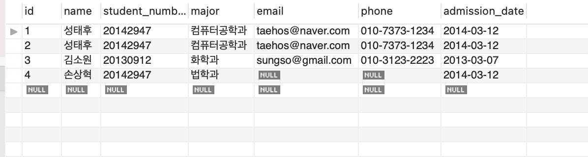

# 2. Make DataBase And Tables

- #### 데이터베이스 생성하기

  요즘은 대학교 수업마다 리뷰 남기고 함. 이런 평가 시스템을 위한 데이터베이스를 만들어 보자. 

  ```sql
  CREATE DATABASE course_rating;
  ```

  새로고침 하면, course_rating이라는 데이터 베이스가 새로 생김. 

  

  그런데 여기서 만약 똑같은 SQL문을 한번 더 실행하면? 

  오류가 나게 됨. 이미 course_rating이라는 데이터베이스가 존재하고 있다는 에러가 뜸. 

  그런데 이런 에러를 볼 필요 없이, 같은 이름의 DBMS가 존재하는지 확인할 수 있음. 

  ```sql
  CREATE DATABASE IF NOT EXISTS course_rating;
  ```

  > 존재할 경우 아래와 같이 알려줌. 
  >
  > 1 row(s) affected, 1 warning(s): 1007 Can't create database 'course_rating'; database exists

  이제 table을 추가해보자. 

  아래 빨간 박스를 누르면, 테이블 추가 가능. 단, 스키마 리스트에서 스키마를 추가하라는 alert가 나옴. 

  여기서 **Schema**라는 것은 **DataBase**라고 생각하면 됨. 

  

  DBMS 자체가 여러 데이터베이스를 한꺼번에 다룰 수 있기 때문에, 어떤 데이터베이스에서 작업을 하고 있는지를 지정을 해줘야하는 것. 

  사용할 데이터베이스를 선택하는 것은 별게 아님. 사용할 데이터베이스를 왼쪽 리스트에서 더블클릭 해주면 됨. 

  그런데, 그냥 SQL문을 이용해서, 사용할 데이터베이스를 선택해 줘도 됨. 

  아래 명령을 실행하면, DBMS에게 지금부터 해당 데이터베이스를 사용하고 작업중이라는 것을 알려주는 것. 

  ```sql
  USE course_rating;
  ```

- #### 사용할 데이터베이스 지정하기

  이전 영상에서는 **course_rating 데이터베이스**를 사용하겠다고 지정하기 위해 

  ```sql
  USE course_rating;
  ```

  이라는 SQL 문을 썼습니다. 

  보통 실무에서 하나의 데이터베이스 서버(우리는 MySQL 서버에 접속한 상태죠?) 안에는 여러 개의 데이터베이스를 두고 사용합니다. 그래서 데이터베이스 서버에 처음 접속하고 난 후에는, 가장 먼저 **어느 데이터베이스에서 작업을 할 것인지**를 지정해줘야 하는데요. 

  이렇게 하면 DBMS가 그 데이터베이스를 **‘작업 중인 데이터베이스’**로 인식하게 되고, 그 후부터는 그렇게 지정된 데이터베이스 안에 있는 존재를 SQL 문에서 가리킬 때, 데이터베이스 이름을 적어주지 않아도 된다는 장점이 있습니다. 

  예를 들어 **A**라는 데이터베이스와 **B**라는 데이터베이스가 있다고 해봅시다. 

  그리고 A 데이터베이스에 **animal**이라는 테이블이 있고, B 데이터베이스에 **banana**라는 테이블이 있다고 할게요. 

  이때 

  ```
  USE A; 
  ```

  를 실행하고 나면, **animal 테이블**의 내용을 조회하고 싶을 때 

  ```
  SELECT * FROM A.animal; 
  ```

  처럼 굳이 데이터베이스 이름을 붙이지 않고, 

  ```
  SELECT * FROM animal; 
  ```

  이라고만 써도 잘 조회됩니다. 이미 **A 데이터베이스**를 사용하는 것으로 DBMS가 인식하고 있기 때문입니다. 

  그리고 혹시라도 착각하시면 안 되는 부분은, 

  ```
  USE A;
  ```

  *를 실행했다고 해서 **B 데이터베이스**에 있는 테이블을 조회할 수 없는 건 아닙니다.* 

  ```
  SELECT * FROM B.banana; 
  ```

  라고 쓰면 **B 데이터베이스 안의 banana 테이블**을 조회할 수 있습니다. 대신 이때는 어느 데이터베이스의 것인지를 분명하게 표시해줘야 하죠. 

  USE 문을 써도 다른 데이터베이스 안의 것들을 언제든지 조회할 수 있다는 점을 잘 기억하세요.

  나중에 USE가 쓰인 SQL 문을 봤을 때 이제 어떤 의미인지 파악할 수 있겠죠?


- #### 테이블 생성하기

  이번에는 course_rating데이터 베이스 안에서 테이블 하나를 만들어보자. 

  아래와 같은 컬럼들을 만들 것. 

  그런데 아래에서, 주황 박스는 무엇을 의미할까? 각 컬럼 내부 값들의 최대 길이를 의미함. 

  **알맞은 데이터타입과, 길이를 정해줘야 메모리와 용량을 효율적으로 사용할 수 있음.** 

  

  id컬럼을 보면, 속성이 여러개가 선택되어 있음. 

  ***Pk**는 당연히 id컬럼이 Primary Key라는 것을 의미함.*

  **NN**는 Not Null을 의미함. Null이 있으면 안됨.  

  **AI**는 Auto Increment로서 점점 증가하는 숫자를 MySQL이 자동으로 넣어 줌. 

  **위처럼 컬럼들 직접 추가하고, 하단의 apply누르면 끝.**

   

- #### 컬럼의 데이터 타입에 관하여

  이전 영상에서 테이블을 생성할 때, 각 컬럼마다 저장될 값에 알맞은 **데이터 타입(Data type)**을 설정했는데요. 

  각 컬럼에 적절한 데이터 타입을 잘 설정하는 일은 아주 중요합니다.

  *데이터 타입을 잘 설정해야 저장 용량을 효율적으로 활용할 수 있고, 나중에 row 수가 많아졌을 때는 성능에 영향을 미치기도 하기 때문이죠..* 

  사용할 수 있는 데이터 타입은 DBMS마다 조금씩 차이가 있는데요.

  일단 MySQL의 데이터 타입들을 살펴보겠습니다.

  MySQL의 데이터 타입 중 일반적으로 쓰이는 것들은 다음 세 가지 카테고리로 분류할 수 있습니다.

  **Numeric types(숫자형 타입)**

  **Date and Time types(날짜 및 시간 타입)**

  **String types(문자열 타입)**

  이밖에도 여러 카테고리가 더 있지만, 당장 알 필요는 없습니다. 위의 세 가지 카테고리에 속한 주요 데이터 타입들을 살펴보겠습니다.

  **1. Numeric types(숫자형 타입)**

  숫자를 나타내기 위해서 사용되는 데이터 타입입니다.

  숫자형 타입은 다시 **정수형 타입**과 **실수형 타입**으로 나눌 수 있는데요. 하나씩 살펴볼게요.

  **(1) 정수형 타입** 

  말 그대로 정수값을 저장하는 타입입니다. 여기에 해당하는 타입들은 그것이 나타낼 수 있는 정수값의 범위에 차이가 있습니다.

  **1) TINYINT** 

  : 작은 범위의 정수들을 저장할 때 쓰는 데이터 타입입니다. TINYINT에서 INT는 Integer(정수)의 줄임말인데요. 최소 -128 ~ 최대 127 까지의 정수를 저장할 수 있는 타입입니다. 이때 SINGED와 UNSIGNED라는 개념을 알아야하는데요. SIGNED는 ‘양수, 0, 음수’를 나타내고, UNSIGNED는 ‘0과 양수’를 나타냅니다. TINYINT 뒤에 둘 중 무엇을 붙이느냐에 따라 아래와 같이 나타낼 수 있는 숫자의 범위가 달라집니다.

  TINYINT SIGNED : -128 ~ 127 

  TINYINT UNSIGNED : 0 ~ 255

  이런 원리는 다른 정수형 타입에도 똑같이 적용됩니다. 참고로, TINYINT라고만 썼을 때는 SIGNED가 붙은 것으로 자동 해석됩니다. 

  **2) SMALLINT**

  : TINYINT 보다 좀더 큰 범위의 정수를 나타낼 때 쓰는 데이터 타입입니다. SINGED와 UNSIGNED에 따라 저장할 수 있는 수의 범위는 다음과 같습니다. 

  SMALLINT SIGNED : -32768 ~ 32767 

  SMALLINT UNSIGNED : 0 ~ 65535

  **3) MEDIUMINT** 

  : 더 넓은 범위를 나타내는 데이터 타입니다. 

  MEDIUMINT SIGNED : -8388608 ~ 8388607

  MEDIUMINT UNSIGNED : 0 ~ 16777215

  **4) INT** 

  : 더 넓은 범위를 나타내는 데이터 타입입니다.

  INT SIGNED : -2147483648 ~ 2147483647

  INT UNSIGNED : 0 ~ 4294967295

  **5) BIGINT** 

  : 아주 큰 범위의 정수를 저장하는 데이터 타입입니다. 

  BIGINT SIGNED : -9223372036854775808 ~ 9223372036854775807

  BIGINT UNSIGNED : 0 ~ 18446744073709551615

  BIGINT 데이터 타입을 사용한다면 아무리 큰 정수라도 잘 저장할 수 있겠죠? 

  **(2) 실수형 타입**

  우리는 정수뿐만 아니라 소수점이 붙어있는 수를 사용하기도 합니다. 이런 수를 저장하기 위한 타입을 실수형 타입이라고 하는데요. 키(180.489cm)나 몸무게(73.45kg), 온도(36.76도)처럼 정밀한 값이 요구되는 컬럼에는 실수형 타입을 지정해야 합니다.

  실수형 타입은 그 타입마다

  얼마나 넓은 범위의 수를 나타낼 수 있는지 뿐만 아니라

  소수점 뒤에 얼마나 많은 개수의 자리수가 존재할 수 있는지, 그러니까 하나의 값을 얼마나 정밀하게 표현할 수 있는지가 다른데요. 하나씩 살펴볼게요. 

  **1) DECIMAL**

  :일반적으로 자주 쓰이는 실수형 타입 중 하나로 보통 DECIMAL(M, D)의 형식으로 나타냅니다. 여기서 M은 최대로 쓸 수 있는 전체 숫자의 자리수이고, D는 최대로 쓸 수 있는 소수점 뒤에 있는 자리의 수를 의미합니다. 예를 들어

  DECIMAL (5, 2)라면 -999.99 부터 999.99 까지의 실수를 나타낼 수 있는 거죠.

  M은 최대 65, D는 30까지의 값을 가질 수 있습니다. 

  그리고 DECIMAL이라는 단어 대신 DEC, NUMERIC, FIXED를 써도 됩니다. 

  **2) FLOAT**

  :

  -3.402823466E+38 ~ -1.175494351E-38,

  0, 

  1.175494351E-38 ~ 3.402823466E+38

  범위의 실수들을 나타낼 수 있는 데이터 타입입니다. 참고로

  -3.402823466E+38 은 (-3.402823466) X (10의 38제곱) 을 의미하고 

  -1.175494351E-38 은 (-1.175494351) X (10의 38제곱 분의 1) 을 의미합니다.

  **3) DOUBLE** 

  :

  -1.7976931348623157E+308 ~ -2.2250738585072014E-308, 

  0, 

  2.2250738585072014E-308 ~ 1.7976931348623157E+308

  범위의 실수들을 나타낼 수 있는 데이터 타입입니다. FLOAT에 비해 더 넓은 범위의 수를 나타낼 수 있을 뿐만 아니라, 그 정밀도 또한 더 높은 타입입니다.(소수점 뒤에 최대로 허용가능한 자리수가 더 많음)

  **2. 날짜 및 시간 타입(Date and Time Types)**

  데이터베이스에서는 날짜 및 시간 정보를 다뤄야하는 경우가 정말 많습니다. 이런 정보를 다루는 데이터 타입들을 알아볼게요. 

  **(1) DATE** 

  : 날짜를 저장하는 데이터 타입입니다. 날짜는 ’2020-03-26’ 이런 형식의 연, 월, 일 순으로 값을 나타냅니다. 

  **(2) DATETIME**

  : 날짜와 시간을 저장하는 데이터 타입입니다. ’2020-03-26 09:30:27’ 이런 식으로 연, 월, 일, 시, 분, 초를 나타냅니다. 

  **(3) TIMESTAMP**

  : 날짜와 시간을 저장하는 데이터 타입입니다. ’2020-03-26 09:30:27’ 이런 식으로 연, 월, 일, 시, 분, 초를 나타냅니다. 그럼 DATETIME 타입과는 어떤 점이 다를까요? **TIMESTAMP 타입은 타임 존(time_zone)** 정보도 함께 저장한다는 점이 다릅니다. 무슨 말인지 간단한 테스트를 통해 바로 보여드릴게요. 아래와 같이 DATETIME 타입의 컬럼(DT 컬럼) 하나와, TIMESTAMP 타입의 컬럼(TS 컬럼) 하나가 있는 테이블을 만들게요. 

  

  이렇게 test라는 테이블을 만들고, 

  

  이 SQL 문을 실행해서 row 하나를 추가할게요. 이 문장은 앞으로 배우게 될 INSERT 문으로 테이블에 row를 추가하는 SQL 문입니다.

  저는 두 컬럼에 같은 날짜/시간 값을 넣어줬습니다. 

  확인해보면, 

  

  동일한 날짜/시간 값이 저장된 것을 확인할 수 있습니다. 

  자, 이제 두 타입의 차이점을 알아볼게요.

  그 전에 **UTC**라는 개념을 알아야 합니다. 전세계에 여러 **시간대(타임존, time-zone)**가 존재한다는 사실은 알고 계시죠? 각각의 시간대는 UTC를 기준으로 나타낼 수 있는데요. **UTC(Coordinated Universal Time)**는 국제 사회에서 통용되는 표준 시간 체계로 '국제 표준시'라고도 합니다. UTC는 영국 런던을 기준으로 하는데요. 우리나라는 런던을 기준으로 시간이 9시간 더 빠르기 때문에, 우리나라의 시간을 표현할 때는 **UTC+9**라고 표현합니다.

  그러니까 위에서 제가 저장한 날짜 시간 값은 이미 **UTC+9**에 해당하는 값인 거죠.

  이 상태에서 MySQL 서버의 시간대 설정을 한번 바꿔보겠습니다. 

  

  이걸 실행하면, 시간대가 **UTC-11**로 바뀝니다. 지구상에서 이 시간대에는 [니우에](https://ko.wikipedia.org/wiki/니우에)라는 나라가 존재합니다. 

  다시 test 테이블을 조회해보면

  

  DT 컬럼의 값은 그대로인데, TS 컬럼의 값은 원래 시간보다 **20시간 이전인 값**으로 바뀌어 있는 것을 알 수 있습니다.

  원래 **UTC+9**인 시간대에서 **UTC-11**인 시간대로 바뀌었기 때문에 +9와 -11의 차이대로 20시간 차이가 나는 겁니다. 

  이렇게 Datetime 타입과 Timestamp 타입은 타임 존 정보 저장 여부에서 차이가 있습니다.

  > 즉, UTC바꿨을때 바뀌는 이유는 현재 내가 저장했던 값 자체가, UTC+9기준으로 저장이 됬던건데, UTC-11로 기준 시간을 바꿔버리니깐, 그거에 맞춰서 해당되는 시간으로 바꾼 것.

  만약 타임 존 정보를 굳이 함께 저장할 필요가 없다면 Datetime 타입을, 타임 존 정보도 함께 저장하고 싶다면 Timestamp 타입을 설정하면 되겠죠? 

  **(4) TIME** 

  : 시간을 나타내는 데이터 타입입니다. ’09:27:31’ 형식으로 ‘시:분:초’를 나타냅니다. 

  **3. 문자열 타입(String type)** 

  문자열을 저장하기 위한 타입입니다. 이름, 댓글, 구매후기 등 문자열 형태의 데이터는 정말 다양하죠? 아래와 같은 타입들이 있습니다. 

  **(1) CHAR**

  : 문자열을 나타내는 기본 타입으로 Character의 줄임말입니다. CHAR(30), 이런 형식으로 나타내는데요. 괄호 안의 숫자는 문자를 최대 몇 자까지 저장할 수 있는지를 나타냅니다. 30이라고 써있으면 최대 30자의 문자열을 저장할 수 있다는 뜻입니다. CHAR 타입의 괄호 안에는 0부터 255까지의 숫자를 적을 수 있습니다. 

  **(2) VARCHAR**

  : VARCHAR도 VARCHAR(30) 이런 식으로 문자열의 최대 길이를 지정할 수 있는 문자열 타입입니다. 괄호 안에 최소 0부터 최대 65,535 (2**16** − 1)를 쓸 수 있습니다. 그런데 VARCHAR는 CHAR보다 허용되는 최대 저장 길이가 더 크다는 점 말고 다른 차이점도 있습니다.

  그건 바로 **CHAR는 고정 길이 타입**이고, **VARCHAR는 가변 길이 타입**이라는 점입니다. 사실 VARCHAR라는 단어 자체가 Character Varing의 줄임말로 가변 문자열을 나타냅니다. 쉽게 설명하자면, CHAR(10), VARCHAR(10)이 있을 때,

  CHAR(10)은 어떤 길이의 문자열이 저장되더라도 항상 그 값이 10만큼의 저장 용량을 차지합니다. 하지만 VARCHAR(10)의 경우 만약 값이 ‘Hello’ 이런 5자라면 저장 용량도 5만큼 차지합니다. **저장 용량이 설정된 최대 길이에 맞게 고정되는 게 아니라 실제 저장된 값에 맞게 최적화되는 거죠.** 대신 VARCHAR 타입으로 값이 저장될 때는 해당 값의 사이즈를 나타내는 부분(1byte 또는 2byte)이 저장 용량에 추가됩니다.

  **어쨋든 저장용량은 추가되니깐, Pros and cons는 있는 것.** 

  따라서 값의 길이가 크게 변하지 않을 컬럼에는 CHAR 타입을 사용하고, 길이가 들쑥날쑥할 컬럼에는 VARCHAR 타입을 쓰는 게 좋습니다. 

  **(3) TEXT**

  문자열을 저장하는 데이터 타입으로 최대 65535 자까지 저장할 수 있습니다. 이외에도 16,777,215 (2**24** − 1) 자까지 저장할 수 있는 MEDIUMTEXT, 4,294,967,295(2**32** − 1) 자까지 저장할 수 있는 LONGTEXT 타입이 있습니다. 

  VARCHAR 타입과 TEXT 계열의 타입은 내부 구현에서 일부 차이가 있는데요. 당장 이해하기에는 어려운 내용이기 때문에 생략하겠습니다. 일단은 **정말 길이가 긴 문자열을 저장하려면 TEXT 계열의 타입을 써야하는구나 정도만 기억해주세요.**

  자, 이때까지 MySQL의 주요 데이터 타입(Data type)들을 살펴봤는데요. 각 컬럼에 적합한 데이터 타입을 설정하기 위해서는 각 DBMS의 매뉴얼 페이지로 각 데이터 타입에 대해 정확하게 공부해야 합니다. 하지만 기초 단계에서는 이 정도만 알아도 충분하니까 위의 내용들을 잘 기억하고 넘어가주세요.


- #### CREATE TABLE 문 설명

  apply할때 나왔던 SQL문을 자세히 살펴보자. 

  

  ()안에 각 컬럼들이 써 있고, 그 각 컬럼에는 데이터타입과 속성들이 보임. 

  **id**는 INT속성의 NOT NULL속성, AUTO INCREMENT속성으로 써놨음. 

  *`name VARCHAR(20) NULL` 컬럼의 이름 데이터타입, 속성.* **NULL은 이 컬럼에 NULL이 있어도 괜찮다는 뜻.** 사실 NULL은 써주지 않아도, Default Value라서 그대로 적용 됨. 

  그리고 마지막줄은 ID컬럼을 이 테이블의 PK로 설정해 주겠다는 뜻.  

  사실은 그냥 아래처럼 써줘도 됨. 

  

  ```Sql
  INSERT INTO student (id, name, student_number, major, email, phone, addmission_date)
  VALUES (1, '성태후', 20142947, '컴퓨터공학과', 'taehos@naver.com', '010-7373-1234', '2014-03-12');
  
  ```

- #### 백틱과 따옴표 이야기

  이전 영상에서 본 **CREATE TABLE 문**을 다시 자세하게 보겠습니다.

  

  이건 Workbench가 자동으로 생성해줬던 CREATE TABLE 문인데요. 지금 **데이터베이스 이름**(course_rating), **테이블 이름**(student), **컬럼 이름**(id) 등에 모두 ** `  기호가 앞뒤로 붙어있는 것을 볼 수 있습니다. **`** 기호의 정식 명칭은 **백틱(backtick)**인데요. 

  DBMS에서는 데이터베이스, 테이블, 컬럼 등과 같은 구성요소를 보통 **object(객체)**라고 합니다. 그리고 이런 object에 붙여준 이름을 **identifier(식별자)**라고 하는데요. MySQL에서 **백틱은 해당 단어가 identifier임을 나타내는 기호**입니다.

  그런데 사실 아래 이미지처럼 

  

  식별자에 굳이 백틱을 쓰지 않아도 SQL 문은 잘 실행됩니다. 

  그럼 굳이 왜 백틱을 쓰는 걸까요? 

  *첫 번째, 백틱을 쓰면 어느 단어가 사용자가 직접 이름을 지은 부분인지를 보다 확실하게 나타내줄 수 있기 때문입니다.* 

  *두 번째, **이미 SQL 문법에 정해진 키워드로 이름을 짓고 싶을 때는 백틱을 쓰는 것이 필수입니다.(근데 이렇게 하면 좋은게 아니지)*** 

  예를 들어 SELECT라는 이름의 테이블을 만든다고 해볼게요. SELECT는 MySQL에 이미 존재하는 키워드죠?

  만약 백틱을 쓰지 않으면 아래의 SQL 문은 문법 오류가 있어서 아예 실행되지 않습니다. 

  

  하지만 백틱을 쓰면 

  

  이 SQL 문은 잘 실행되고, SELECT 라는 이름의 테이블이 잘 생성됩니다. 

  하지만 굳이 SQL 문법에 이미 존재하는 키워드로 이름을 짓는 것은 나중에 혼동의 위험성이 있기 때문에 하지 않는 것이 좋습니다. 지금은 백틱의 기능을 보여드리기 위해 예시를 든 것뿐입니다. 

  앞으로 여러분이 SQL 문을 쓸 때 식별자라고 해서 꼭 백틱을 쓸 필요는 없습니다. 하지만 백틱이 있는 SQL 문을 봤을 때 당황하지 말라고 알려드리는 겁니다. 

  이 백틱(`)을 보니 생김새가 비슷한 작은따옴표(‘), 큰따옴표(“)도 생각나지 않으시나요? 

  작은따옴표와 큰따옴표의 용도는 간단합니다. 문자열 값을 나타낼 때 작은따옴표 또는 큰따옴표로 감싸주면 됩니다. 예를 들어, CHAR 또는 VARCHAR 타입의 컬럼에 들어갈 값은 항상 작은따옴표 또는 큰따옴표로 감싸줘야 하는데요. 저는 앞으로 문자열 값을 모두 작은따옴표로 감싸주겠습니다. 

  방금 배운 각 기호들의 용도를 잘 기억하시고, 다음 영상들에서 보게 되더라도 당황하지 마세요.

  **요약하자면, 사용자가 지어준 이름(Identifier)은 백틱, 문자열은 작은/큰 따옴표**. 


- #### 테이블에 row 추가하기1

  이제 테이블에 로우를 하나씩 추가해보자. 

  ```sql
  INSERT INTO student (id, name, student_number, major, email, phone, addmission_date)
  VALUES (1, '성태후', 20142947, '컴퓨터공학과', 'taehos@naver.com', '010-7373-1234', '2014-03-12');
  ```

  문제 없이 추가됨. 

  그런데 여기서, 새로운 쿼리창 하나 열고 한명 더 추가해보자. 

  컬럼 이름 들어간 부분 삭제해줌. 

  **아래처럼, 모든 컬럼에 값을 넣을 꺼면, 앞에 컬럼 이름 쓰는 부분 생략해도 됨.** 

  ```sql
  INSERT INTO student 
  VALUES 
  (3, '김소원', 20130912, '화학과', 
  'sungso@gmail.com', '010-3123-2223', '2013-03-07');
  
  ```

  

- #### 테이블에 row 추가하기2

  이전에 추가했던 것은 모든 Value값들이 존재했음. 이번에는, 그 중 일부만 넣을 때를 해보자. 

  ```Sql
  INSERT INTO student 
  (id, name, student_number, major, admission_date)
  VALUES 
  (4, '손상혁', 20142947, '법학과',  '2014-03-12');
  
  
  ```

  너무 당연하지만, 값을 주지 않은 컬럼은 NULL로 나오게 됨. 

  

  ```sql
  INSERT INTO student 
  (name, student_number, major, admission_date)
  VALUES 
  ('이미영', 20142947, '법학과',  '2014-03-12');
  ```

  이번에는 Id도 값을 안줬음. 근데, 자동으로 추가되어 있음. 당연하지, auto increment속성 해 놨으니깐!

  참고로 

  ```sql
  # 여기에 정답을 써주세요
  INSERT INTO food_menu
  (menu, price, ingredient) VALUES ('라볶이', 5000, '라면, 떡, 양파..');
  
  INSERT INTO food_menu
  (menu, price, ingredient) VALUES ('치즈김밥', 3000, '치즈, 김, 단무지..');
  
  INSERT INTO food_menu
  (menu, price, ingredient) VALUES ('돈까스', 8000, '국내산 돼지고기, 양배추..');
  INSERT INTO food_menu
  (menu, price, ingredient) VALUES ('오므라이스', 7000, '계란, 당근..');
  
  
  ```

  위와 같은 코드를 한번에 쓸 수도 있음. 

  ```sql
  INSERT INTO food_menu (menu, price, ingredient) VALUES 
  ('라볶이', 5000, '라면, 떡, 양파..'), ('치즈김밥', 3000, '치즈, 김, 단무지..'), ('돈까스', 8000, '국내산 돼지고기, 양배추..'), ('오므라이스', 7000, '계란, 당근..');
  ```

  


- #### 테이블의 Row 갱신하기

  이번에는 테이블의 row를 수정(갱신)하는 방법을 알아볼 것. 

  소원이가 전공을 화학과에서 멀티미디어 학과로 바꿨다면? 

  

  ```sql
  UPDATE student SET major='멀티미디어학과' WHERE id=2;
  ```

  여기서 WHERE가 없다면? 

  ```sql
  UPDATE student SET major='멀티미디어학과' WHERE id=2;
  ```

  **테이블의 모든 전공이 다 멀티미디어학과가 되는 것.** 

  만약 김소원이 이름도 차소원으로 개명했다면?

  매우 쉬웜 

  ```sql
  UPDATE student SET major='멀티미디어학과' WHERE id=2;
  ```

- #### 컬럼의 기존 값을 기준으로 갱신하기

  아래와 같이 초등학교 1학년 반 하나의 기말고사 성적을 나타내는 **final_exam_result 테이블**이 있다고 합시다. 

  

  지금 **name 컬럼**에는 학생의 이름, **score 컬럼**에는 학생의 점수가 저장돼있는데요. 

  그런데 이때, 기말고사 문제 중 배점 3점짜리 문제 하나에 오류가 있어서 모두 정답 처리를 했다고 해봅시다. 

  그럼 모든 학생의 점수에 **+3점**을 해줘야겠죠? 이럴 때는 테이블을 어떻게 갱신해야할까요? 

  이런 식으로 

  ```
  UPDATE final_exam_result SET score = 100 WHERE id = 1;
  UPDATE final_exam_result SET score = 63 WHERE id = 2;
  UPDATE final_exam_result SET score = 18 WHERE id = 3;
  ```

  …

  여러 줄의 UPDATE 문을 실행해야 할까요?

  이것도 가능하지만 이렇게 하는 건 너무 번거로울 겁니다. 사실 UPDATE 문을 사용할 때는 기존 값을 그대로 활용하는 방법이 있습니다. 

  이렇게 말이죠. 

  

  이렇게만 써주면 **모든 row의 score 컬럼의 값이 기존 값보다 3이 더 큰 값으로 갱신되는데요.** 

  위 UPDATE 문을 실행하고 다시 테이블을 조회해보면 

  

  모든 학생들의 점수가 기존보다 3점 증가한 것을 확인할 수 있습니다. 

  UPDATE 문으로 갱신을 할 때는 방금 본 **SET score = score + 3** 처럼 컬럼의 이름을 활용해서, 기존 값을 기반으로 갱신하는 경우도 많습니다. 잘, 기억해두세요!


- #### 테이블의 row 삭제하기

  ```sql
  DELETE FROM student WHERE id =4; 
  ```

  **근데 삭제할 때도, update처럼, Where를 안쓰면 테이블의 모든 row가 삭제되버림.** 


- #### 물리삭제 vs 논리삭제

  이전 영상에서는 테이블에서 기존 row를 삭제하는 방법을 배웠습니다. 그런데 **row의 삭제**에 관해서는 실무적으로 중요한 주제 한 가지가 있습니다. 

  그것은 바로 어떤 row를 삭제하는 방법에는 크게 2가지 방법이 있다는 사실입니다.

  그 2가지 방법은 바로 **'물리 삭제’**와 **‘논리 삭제'**인데요. 

  우리가 배웠던 것처럼, 데이터를 삭제해야할 때 그냥 row를 바로 삭제해버리는 것을 ‘**물리 삭제**’라고 합니다. 

  반면에 ‘**논리 삭제**’는 삭제해야할 row를 삭제하지 않고, **‘삭제 여부’를 나타내는 별도의 컬럼을 두고, 거기에 ‘삭제되었음’을 나타내는 값을 넣는 것**을 말하죠.

  예를 들어, 어떤 쇼핑몰에서 각 고객의 주문 내역을 저장하고 있는 아래와 같은 **order 테이블**이 있다고 합시다. 

  

  이 테이블에서는 row 하나가 주문 내역 하나를 나타내는데요. 

  그런데 이때 2번 주문을 한 고객이 주문을 취소했다고 해봅시다. 그래서 주문 내역을 삭제하려고 할 때, 만약  ‘물리 삭제’를 한다면 

  ```sql
  DELETE FROM order WHERE id = 2; 
  ```

  를 실행해서 아래 그림처럼 2번 row를 삭제하면 됩니다. 

  

  하지만 만약 ‘논리 삭제’를 한다면 아래 그림과 같이 테이블에 **is_cancelled 같은 컬럼**을 추가하고 해당 컬럼에 주문이 취소되었음을 나타내는 Y(es)라는 값을 넣어주면 되는데요.(is_cancelled, is_deleted 등 사용할 수 있는 컬럼 이름은 다양합니다)

  

  그러니까 ‘논리 삭제’를 할 때는 DELETE 문을 쓰는 게 아니라

  ```sql
  UPDATE order SET is_cancelled = ‘Y’;
  ```

  처럼 UPDATE 문을 써야 하는거죠. 

  결국 '물리 삭제'와 '논리 삭제'는 정책상의 차이를 나타내는 분류라고 할 수 있습니다.

  그렇다면 이렇게 논리 삭제를 하는 이유는 무엇일까요? 다양한 이유가 있을 수 있습니다. 

  위의 예시와 같은 경우를 보자면, 비록 사용자가 주문을 취소했다고 해도 해당 주문은 사용자의 취향, 기호 등이 반영된 소중한 데이터입니다. 즉, 기업 입장에서는 고객 분석을 위해 필요한 소중한 데이터라는 거죠. 그래서 설사 소비자는 주문을 취소(삭제)했다고 하더라도 기업은 해당 데이터를 계속 보관하고 있는 겁니다. 

  뿐만 아니라 이런 논리 삭제는 향후에 범죄 수사 등에 도움이 될 수도 있습니다. 예를 들어, 어떤 사람이 SNS 사이트에 가입해서 게시판에서 남을 비방하는 유언비어 게시물을 여러 개 남기는 등의 행위를 하고 바로 해당 사이트를 탈퇴해버렸다고 합시다. 그런데 만약 이때 해당 회원 정보를 '물리 삭제’ 해버리면 이제 그 행위를 어떤 계정이 했는지 찾을 수 없게 됩니다. 하지만 논리 삭제를 했다면, 관련 계정을 바로 찾을 수 있겠죠? 

  하지만 이런 논리 삭제도 약간의 단점은 있는데요. 

  먼저, 나중에 삭제되지 않고 유효한 row들만 조회해야할 때는 

  ```sql
  SELECT * FROM WHERE is_cancelled != ‘Y’;
  SELECT * FROM WHERE is_deleted != ‘Y’;
  ```

  처럼 WHERE 절에 별도의 조건을 추가해줘야해서 번거롭다는 단점이 있습니다.

  그리고 실제로 row를 삭제하는 것이 아니기 때문에 아무리 삭제를 해도 데이터베이스 내의 저장용량은 줄어들지 않는다는 단점도 있습니다. 

  이런 단점을 보완하기 위해 기본 정책은 논리 삭제로 두되, 

  - 이미 데이터 분석에 활용되었거나
  - 고객이 동의한 데이터 보유기간이 지난 row들은

  정기적으로 물리 삭제하는 방법을 활용하기도 합니다. 

  나중에 실무에서 여러분의 회사에서는 어떤 식으로 삭제 정책을 운영하고 있는지 한번 살펴보세요. 