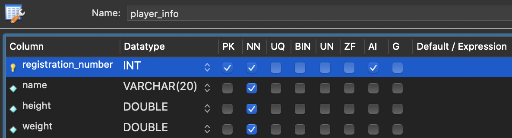

# 2. Make DataBase And Tables


- #### 컬럼 정보를 한눈에 보여주는 DESCRIBE

  이번 챕터에서는 **테이블의 컬럼 구조, 각 컬럼의 데이터 타입 및 속성을 수정하는 법**을 배울 겁니다.

  그런데 그 전에 한 가지 알아둬야할 SQL 문이 있습니다. 바로 **DESCRIBE** 문인데요. 이걸 쓰면 테이블의 컬럼 정보를 한 눈에 볼 수 있습니다. 예를 들어 아래와 같은 컬럼들을 가진 테이블이 있다고 합시다. 이 테이블의 이름은 **undergraduate**인데요.

  

  위 이미지는 undergraduate 테이블의 컬럼 구조를 Workbench에서 확인한 화면입니다. 하지만 이런 화면이 아니라 SQL 문을 실행해서 테이블의 컬럼 구조를 확인할 수도 있는데요. 방금 말한 DESCRIBE 문을 쓰면 됩니다.

  이렇게 DESCRIBE 뒤에 확인하고 싶은 테이블 이름을 쓰면 

  

  이런 식으로 해당 테이블의 컬럼 구조, 각 컬럼의 데이터 타입, 속성을 볼 수 있습니다.

  **Field** : 컬럼의 이름 

  **Type** : 컬럼의 데이터 타입

  **Null** : 컬럼의 Null 속성 유무

  **Key** : Primary Key, Unique 속성 여부(Unique 속성은 곧 배웁니다)

  **Default** : 컬럼의 기본값(기본값 속성은 곧 배웁니다)

  **Extra** : AUTO_INCREMENT 등의 기타 속성

  DESCRIBE를 그냥 DESC라고 줄여서 써도 됩니다. 

  

  앞으로 배울 각 영상과, 각 과제의 SQL 실행기 입력창에는 마지막에 DESCRIBE 문이 써있을 겁니다. DESCRIBE 문의 의미를 잘 기억하고 있으세요!


- #### 컬럼 추가와 컬럼의 이름 변경

  현재의 Student Table에 Gender컬럼을 추가해 보자. 

  ```sql
  ALTER TABLE student ADD gender CHAR(1) NULL;
  ```

  이 SQL문을 실행하고, student table을 다시 조회해보면, **Gender** 컬럼이 생겨있음. 

  

  컬럼의 이름을 바꿔보자. 

  ```sql
  ALTER TABLE student
  	RENAME COLUMN student_number TO registration_number;
  ```

  


- #### 컬럼 삭제와 데이터 타입 변경

  - **삭제**
  
  ```sql
  ALTER TABLE student
  	DROP COLUMN admission_date;
  ```
  
  - **수정**
  
    그리고, MAJOR컬럼에 저장된 값들을 바꿔보자. 현재 Major컬럼은 **Varchar** 이걸 이제, int로 변경해 보고 싶음. 
  
    ```sql
    ALTER TABLE student
    	MODIFY major INT;
    ```
  
    그대로 하면 에러가 남. 왜 그럴까? 원래 있던 값들이 문자열이잖아. 이 상태에서는 당연히 에러가 나겠지. 
  
    그래서, 원래 값들을 먼저 정수로 바꿔준 다음에 type을 바꿔줘야 함. 
  
    ```sql
    UPDATE student SET major = 10 WHERE major='컴퓨터공학과';
    UPDATE student SET major = 12 WHERE major='멀티미디어학과';
    UPDATE student SET major = 7 WHERE major='법학과';
    ```
  
    이걸로 일단 값들 바꿔줌. 
  
    그리고 다시 위에서 MODIFY실행. 
  
- #### 혹시 UPDATE가 안되는 분이라면?

  혹시 이전 영상에서 전공 과목 이름을 전공 코드로 갱신하는 작업이 자신의 Workbench에서는 잘 안되는 분 있으신가요? 

  그런 분들은 아마 이렇게 오류가 나셨을 텐데요.

  

  Response 탭에서 에러 메시지를 보면

  **Error Code: 1175. You are using safe update mode and you tried to update a table without a WHERE that uses a KEY column. To disable safe mode, toggle the option in Preferences -> SQL Editor and reconnect.**

  이런 내용을 볼 수 있을 겁니다. 첫 번째 문장을 해석하면, 

  ‘safe update 모드를 사용 중일 때는, KEY column을 사용해서 테이블을 갱신해야 한다.'는 뜻입니다. 여기서 KEY column이란 Primary Key를 의미하는데요.

  safe update 모드란, 말 그대로 '안전한 갱신’을 보장하기 위한 모드로

  ```sql
  UPDATE student SET major = 10; 
  ```

  처럼 모든 row의 특정 컬럼을 갱신해버리는 SQL 문이나, 

  ```sql
  UPDATE student SET major = 10 WHERE major = ‘컴퓨터공학과’;
  ```

  처럼 WHERE 절에 Primary Key가 사용되지 않은 UPDATE 문이 실행되지 않도록 합니다. 

  이것은 UPDATE 문을 주의깊게 사용하지 않았을 때 발생할 수 있는 위험한 결과를 방지하기 위한, DBMS 상의 모드인데요. 만약 이 모드가 켜져있는 분이라면, 이전 영상에서 했던 SQL 문이 실행되지 않았을 겁니다. 

  이 모드를 끄려면 위 에러 메시지의 두 번째 문장인 

  **‘To disable safe mode, toggle the option in Preferences -> SQL Editor and reconnect.’** 

  의 내용대로 수행하면 되는데요. safe update  모드를 한번 꺼보겠습니다. 

  

  화면 좌측 상단의 **MySQLWorkbench > Preferences** 를 클릭하고

  

  나오는 창에서 **SQL Editor**라는 부분을 선택합니다.

  

  그 다음 화면을 아래로 스크롤해보면

  이렇게 **Safe Updates** 라고 써진 부분에 체크가 되어있는 걸 볼 수 있습니다. 

   

  체크를 해제하고 OK 버튼을 누른 후

  

  화면 좌측 상단에서 현재의 접속을 나타내는 탭에서 **X** 버튼을 눌러서 접속을 끊으세요. 

  

  그 다음 MySQL 서버에 다시 접속하고 

  

  영상에서 본 UPDATE 문들을 실행해보면 이제는 잘 실행되는 것을 알 수 있습니다. 

  방금 배운 safe update 모드처럼 DBMS에는 SQL의 실행에 직접적으로 영향을 미치는 모드들이 많습니다. 그런 모드들에 대해 굳이 지금 배울 필요는 없지만, 이렇게 DBMS의 특정 모드가 어떻게 설정되어있느냐에 따라 같은 SQL 문이라도 그 실행 결과가 달라질 수 있다는 점은 기억해두세요. 


- #### 컬럼에 NOT NULL속성 주기

  아래 세 컬럼에 NULL이 있으면 안된다고 해보자. 

  ```sql
  ALTER TABLE student MODIFY name VARCHAR(20) NOT NULL;
  ALTER TABLE student MODIFY registration_number INT NOT NULL;
  ALTER TABLE student MODIFY major INT NOT NULL;
  ```

  컬럼의 속성을 변경할때는 위처럼 원래의 데이터타입들을 쓰고, 뒤에다가 NOT NULL을 같이 써주면 됨. 

  뭐 당연히 VARCHAR(30)이런식으로 변경도 됨. 

  그럼 이제 잘 바뀌었는지 확인하기 위해서 값이 없는 row를 추가해 보자. 

  ```sql
  INSERT INTO student (email, phone, gender)
  	VALUES ('abc@naver.com', '010-4041-8578', 'm')
  ```

  > Error Code: 1364. Field 'major' doesn't have a default value

  

- #### 컬럼에 Default 속성 주기

  위에서 에러에 디폴트 값이 없다고 나오는데 이게 뭘까?

  컬럼에는 **기본값**이라는 것을 설정할 수 있음. 

  위에 보면, 3 컬럼은 Defult에 NULL이라고 써있음. 이 얘기는 이 세 컬럼에 값을 주지 않으면, NULL이 나온다는 뜻. 

  3개는 어차피 NOT NULL속성이 아니기 때문에, 기본값이 NULL인 것. 

  현재는 NOT NULL컬럼들은 기본값이 설정이 안되있어서, 값을 안주고 ROW를 추가하려고 하면 안됬던 것. 

  얘네들도 기본값을 설정할 수 있음. 

  **Major에 기본값을 줘보자. 예를 들어서, 아직 전공이 없는 상태를 101이라고 한다고 해보자.** 

  ```sql
  ALTER TABLE student MODIFY major INT NOT NULL DEFAULT 101;
  ```

  

  이 상태에서 row 하나를 추가해 보자. 

  ```sql
  INSERT INTO student (name, registration_number)
  VALUES ('구지섭', 2012100249)
  ```

  

  값을 주지 않더라도 값이 알아서 들어가 있음. 


- #### DATETIME, TIMESTAMP 타입의 컬럼에 값을 넣는 2가지 방식

  테이블에는 어떤 row가 추가되거나 갱신되었을 때 그 추가 혹은 갱신 시각을 저장해야할 때가 있습니다. 예를 들어, 

  \- 게시글 업로드 시각,

  \- 댓글이 달린 시각, 

  \- 댓글을 수정한 시각 

  등의 정보가 그 예인데요. 이런 정보를 저장하는 컬럼에 현재 시간 값을 넣어줄 때는 크게 두 가지 방법이 있습니다. 하나씩 살펴볼게요. 

  **1. NOW() 함수 사용하기** 

  SQL 문 안에서 **NOW()**라는 함수를 사용하는 방법입니다. 예를 들어, 어떤 SNS에서 사용자가 업로드한 게시물 정보를 저장한 **post 테이블**이 아래와 같이 있다고 해봅시다. 

  

  각 컬럼에 대해 간단히 설명하면, 

  **id** : PRIMARY KEY 역할을 하는 컬럼

  **title** : 게시물의 제목

  **content** : 게시물의 내용

  **upload_time** : 게시물 최초 업로드 시각

  **recent_modified_time** : 게시물 최근 갱신 시각

  인데요. 

  자, 이 테이블에 게시물 하나를 추가한다고 해봅시다. 이렇게 쓰면 되겠죠?

  

  지금 upload_time 컬럼, recent_modified_time 컬럼에 **NOW()라는 함수의 리턴값**을 넣었습니다. 테이블을 조회해보면, 

  

  두 컬럼 모두 현재 시각이 잘 들어간 것을 볼 수 있습니다. 

  

  만약 이 포스트의 내용을 다시 갱신한다고 해봅시다. 그럼 UDDATE 문을 사용하면 되겠죠? 

  content 컬럼을 갱신할 때 동시에, recent_modified_time 컬럼의 값도 NOW 함수의 리턴값으로 갱신해주면 됩니다. 실행하면 

  

  recent_modified_time 컬럼의 값이 잘 갱신됩니다. 

  지금 upload_time 컬럼의 값에서 약 7분 이후의 값인데요. 최초 업로드 후 약 7분 후에 게시물이 다시 수정된 겁니다. 이렇게 NOW라는 함수를 쓰면 현재 시간을 편하게 구할 수 있습니다. 그런데 이 방법 말고 컬럼에 현재 시간 값을 넣는 다른 방법도 있습니다. 

  **2. 컬럼에 DEFAULT CURRENT_TIMESTAMP / ON UPDATE CURRENT_TIMESTAMP 속성 설정하기** 

  **DATETIME 타입** 또는 **TIMESTAMP 타입**의 컬럼에는 

  **DEFAULT CURRENT_TIMESTAMP** 라는 속성과,

  **ON UPDATE CURRENT_TIMESTAMP** 라는 속성을 줄 수 있습니다. 

  ***DEFAULT CURRENT_TIMESTAMP*** 속성은 테이블에 새 row를 추가할 때 따로 그 컬럼에 값을 주지 않아도 현재 시간이 설정되도록 하는 속성입니다. 

  그리고 ***ON UPDATE CURRENT_TIMESTAMP*** 속성은 기존 row에서 단 하나의 컬럼이라도 갱신되면 갱신될 때의 시간이 설정되도록 하는 속성인데요.

  정확히 어떤 속성들인지 직접 보여드릴게요. 

  일단 post 테이블의 upload_time 컬럼과 recent_modified_time 컬럼에 위에서 말한 두 속성을 추가해보겠습니다. 

  

  이 SQL 문을 보면 

   **upload time 컬럼에는 DEFAULT CURRENT_TIMESTAMP 속성만 줬고,** 

   **recent_modified_tiem 컬럼에는 DEFAULT CURRENT_TIMESTAMP 속성과 ON UPDATE CURRENT_TIMESTAMP 속성을 둘다 줬습니다.** 

   이제 테이블에 새로운 row를 추가해볼까요? 아래와 같이 새 row를 추가하겠습니다. 

  

  **그런데 지금 title, content 컬럼에만 값을 주고, upload_time, recent_modified_time 컬럼에는 값을 주지 않았습니다. 이 사실이 아주 중요한데요.**

  다시 post 테이블을 보면 

  

  새로운 row가 잘 추가된 것을 볼 수 있습니다. 

  **그리고 upload_time, recent_modified_time 컬럼에는 별도로 값을 주지 않았는데도 현재 시간이 값으로 잘 들어갔네요.** 

  **두 컬럼에 DEFAULT CURRENT_TIMESTAMP 속성을 줬기 때문입니다.** 

  그리고 이 row의 content 컬럼값을 갱신할게요. 

  

  그런데 지금 최근 갱신 시각을 나타내는 recent_modified_time 컬럼에는 따로 값을 지정하지 않았는데요. 과연 어떤 결과가 나올까요? 이 SQL 문을 실행하고 다시 post 테이블을 보면

  

  2번 row의 content 컬럼의 값이 잘 갱신되었고, recent_modified_time 컬럼도 잘 갱신된 것을 알 수 있습니다. **recent_modified_time 컬럼에 값을 주지 않았는데도 이렇게 최근 갱신 시각이 잘 들어가게 된 것은, 아까 recent_modified_time 컬럼에 ON UPDATE CURRENT_TIMESTAMP라는 속성을 주었기 때문입니다.** 

  자, 어떤가요? 두 속성의 의미를 이제 잘 아시겠죠? 

  이때까지 컬럼의 데이터 타입이 DATETIME 또는 TIMESTAMP 타입일 때 날짜/시간 값을 넣을 수 있는 두 가지 방법을 배웠습니다. 

  만약 각 row마다 시간값에 관한 처리를 다르게 해줘야하는 경우라면 (예를 들어, 어떤 row는 현재 시간에서 +3시간, 어떤 row는 현재 시간에서 -5시간을 해줘야하는 경우) NOW 함수를 쓰는 게 좋을 겁니다.

  하지만 그럴 필요가 없는 상황이고, 굳이 날짜/시간 값을 별도로 신경쓰기가 싫다면 해당 컬럼에 `DEFAULT CURRENT_TIMESTAMP` 속성, `ON UPDATE CURRENT_TIMESTAMP` 속성을 설정해서 DBMS가 알아서 관리하도록 하는게 좋겠죠?


- #### 컬럼에 UNIQUE 속성 주기

  컬럼에 UQ 속성을 설정하면, 그 컬럼에 같은 값을 가진 또 다른 row가 추가되는 것을 막을 수 있음. 

  예를 들어 학번은 겹치면 안됨. 

  ```sql
  ALTER TABLE student MODIFY registration_number INT NOT NULL UNIQUE;
  ```

  

  ```sql
  INSERT INTO student (name, registration_number)
  	VALUES ('최태웅', '2012100249')
  ```

  기존에 있는 학번으로 넣으려니깐, 아래와 같은 에러가 뜸. 

  > Error Code: 1062. Duplicate entry '2012100249' for key 'student.registration_number'


- #### PRIMARY KEY와 UNIQUE 속성의 차이

  이전 영상에서는 **Unique**라는 속성에 대해 배웠습니다. 어떤 컬럼의 값이 각 row마다 달라야할 때 이 Unique 속성을 줘야한다고 했는데요. 

  그런데 이것과 비슷한 말을 이미 들은 적 있지 않나요?

  바로 **Primary Key**도 이런 성질을 갖고 있었죠? **Primary Key는 테이블에서 특정 row 하나를 식별할 수 있도록 해주는 컬럼**이라고 했습니다.

  그리고 이를 위해 Primary Key에 해당하는 컬럼은 각 row마다 다른 값을 가져야한다고 했었죠. 

  그럼 이 Priamry Key와 Unique 속성은 어떤 차이가 있을까요? 둘 사이에는 미세한 차이가 있는데요.

  ***일단 Primary Key는 테이블당 오직 하나만 존재할 수 있습니다. 이에 반해 Unique 속성은 각각의 컬럼들이 가질 수 있는 속성이기 때문에 한 테이블에 여러 개의 Unique 속성들이 존재할 수 있죠.*** 

  그리고 ***중요한 차이점 하나는 Primary Key는 NULL을 가질 수 없지만, Unique는 NULL을 허용한다는 점입니다.*** Primary Key는 애초에 그 목적이 테이블에서 하나의 row를 식별하기 위해 사용되는 컬럼입니다. 하지만 Primary Key에 NULL이 있어버리면, 특정 row를 검색해야할 때 등호(=) 연산을 수행할 수 없기 때문에 NULL을 허용하지 않는 것으로 추측됩니다. 

  Primary Key에 NULL이 있는 row가 존재한다면, 

  ```sql
  SELECT * FROM member WHERE email = '이메일 주소';
  ```

  이런 식의 SQL 문을 실행할 때 그 row는 찾을 수가 없게 됩니다. 아이디 부분에 NULL을 넣는다고 해도 안 됩니다.

  왜냐하면 **WHERE NULL = NULL** 은 True를 리턴하지 않기 때문입니다. SQL에서 NULL은 어떤 값이 아니라 ‘값이 없는 상태'를 의미하는 단어일 뿐입니다. 그래서 같은 NULL 끼리 비교해도 같다는 결과가 나오지 않습니다.

  물론 

  ```sql
  SELECT * FROM member WHERE id IS NULL; 
  ```

  과 같이 NULL 여부를 확인할 수 있는 별도의 SQL 문을 사용할 수는 있습니다만 단지 NULL이 있는 해당 row 하나만을 위해 이렇게 별도로 해야한다는 건 바람직하지 않습니다. 

  이런 이유 때문에 Primary Key에서는 NULL이 허용되지 않는 거죠.

  이 뿐만 아니라 Primary Key는 다른 테이블의 Foreign Key에 의해 참조될 수도 있는 컬럼입니다.

  (Foreign Key를 처음 들으시는 분은 [토픽 1의 내용](https://www.codeit.kr/learn/courses/sql-database-for-developers/3209)을 참조하세요.)

  그리고 보통은 이런 Foreign Key를 기준으로 두 테이블을 조인하는 경우가 많은데요. 이때 부모 테이블의 Primary Key가 NULL이라면 그 row를 참조해야하는 자식 테이블의 row들과 제대로 조인될 수가 없습니다. 

  왜냐하면 조인을 할 때도 

  ```sql
  SELECT * FROM table_a INNER JOIN table_b 
  ON tabel_a.referenced_col = table_b.referencing_col; 
  ```

  이런 식으로 ON 절에 등호를 붙여서 조인 기준을 설정하는 것이 일반적이기 때문입니다. 이 경우에도 NULL = NULL 은 True를 리턴하지 않기 때문에 NULL이 있는 row끼리는 조인이 되지 않습니다. 

  정리하면, Primary Key는 그 존재 목적과 실무적인 이유 등으로 인해 당연히 **NULL이 들어가면 안 되는 것입니다.** 

  이에 반해, Unique 속성은 각 row마다 각자 다른 값을 가지도록 강제하는 것입니다. 그리고 이때 각 row마다 해당 컬럼의 값이 다르다면, NULL도 unique하다고 인정되기 때문에 Unique 속성이 있는 컬럼에는 NULL이 허용되는 것이죠.

  물론 이러한 내용들은 약간의 의견 차이가 있을 수 있으나 방금 설명드린 내용이 대부분의 DBMS에서 구현된 Primary Key와 Unique 속성 간의 차이입니다. 

  어쨌든 이 둘은 서로 비슷해보이지만 이런 미세한 차이가 존재한다는 점을 잘 기억해주세요.


- #### 테이블에 CONTRAINT 걸기1

  하나의 테이블에는 시간이 흐르면서 계속해서 Row들이 추가되게 됨. 이때 row에 이상한 row들이 추가되는 것을 막아야 함. 예를 들어, 꼭 있어야 하는 값이 없거나 이상한 값이 추가되는 것을 막아야함. 

  테이블에 **CONTRAINT** 즉, **제약사항**을 줄 수 있음. 

  

  Registration_number의 앞 4자리에는 입학년도가 들어가게 됨. 요즘 학생 같으면 보통은 다 20xx년도 겠지. 

  그러면 예를 들어 이 컬럼에 30,000,000보다 큰 값은 들어가면 안된다고 해보자. 

  st_rule라는 이름의 제약을 건다는 뜻. 뒤에 CHECK 부분이 이 st_rule의 내용. 제약사항. 

  ```sql
  ALTER TABLE student
  	ADD CONSTRAINT st_rule CHECK (registration_number < 30000000);
  ```

  그러고 제약사항인 row를 추가해 보자. 

  ```sql
  ALTER TABLE student
  	ADD CONSTRAINT st_rule CHECK (registration_number < 30000000);
  ```

  그러면 당연히 에러가 뜸. 

  > Error Code: 3819. Check constraint 'st_rule' is violated.

  조건을 삭제할 수도 있음. 해당 constrinat를 삭제하는 것. 

  ```sql
  ALTER TABLE student
  	DROP CONSTRAINT st_rule; 
  ```

   

- #### 테이블에 CONTRAINT 걸기2

  두개 이상의 조건이 담긴 제약사항을 만들어 보자. 

  이메일 값에 @가 표시되어야 한다. 그리고, gender는 m/f 둘 중 하나. 

  ```sql
  ALTER TABLE student
  	ADD CONSTRAINT st_rule 
      CHECK (email LIKE '%@%'  AND gender IN ('m', 'f')); 
  ```

  ```sql
  INSERT INTO student (name, registration_number, email, gender)
  	VALUES('김준성', 20130827, '^hi g', 'm')
  ```

  >Error Code: 3819. Check constraint 'st_rule' is violated.

  ```sql
  INSERT INTO student (name, registration_number, email, gender)
  	VALUES('김준성', 20130827, 'a@naver.com', 'z')
  ```

  > Error Code: 3819. Check constraint 'st_rule' is violated.


- #### 그 밖의 컬럼 관련 작업들

  이때까지 컬럼을 추가/삭제하거나 기존 컬럼의 이름, 데이터 타입, 속성 등을 변경하는 법을 배웠는데요. 그 밖에 알아야할 컬럼 관련 작업들을 배워보겠습니다. 

  지금 아래와 같이 한 축구팀의 선수 정보를 관리하는 **player_info 테이블**이 있다고 해봅시다.

  

  각 컬럼에 대해 설명하자면,

  **role** : 선수의 역할(공격수, 수비수 등)

  **name** : 선수의 이름

  **id** : PRIMARY KEY

  입니다. 이 테이블의 컬럼 구조를 좀더 보기 좋게 만들어가면서 새로운 내용들을 배워봅시다. 

  **1. 컬럼 가장 앞으로 당기기**

  지금 보면 Primary Key 역할을 하는 id 컬럼이 가장 뒤에 있어서 보기가 어색하네요. 이 컬럼을 가장 앞으로 옮기고 싶은데 어떻게 하면 좋을까요? 

  이렇게 써주면 됩니다. 

  

  우리가 배웠던 MODIFY 문이죠? id 컬럼 정보의 맨 뒤에 FIRST라고 써주면, 해당 테이블의 가장 첫 번째 컬럼이 됩니다. player_info 테이블을 다시 조회해보면, 

  

  id 컬럼이 가장 첫번째 컬럼이 된 것을 알 수 있습니다. 이런 식으로 테이블에서는 보통 Primary Key에 해당하는 컬럼을 가장 앞에 두는 것이 일반적입니다. 

  **2. 컬럼 간의 순서 바꾸기**

  그런데 지금 보면 선수 역할을 나타내는 role 컬럼이 선수 이름을 나타내는 name 컬럼보다 이후에 나오는 것이 더 자연스러울 것 같네요. role 컬럼을 name 컬럼 이후에 위치하도록 하려면 이렇게 써주면 됩니다. 

  

  이번에도 MODIFY를 썼는데요. 그리고 가장 마지막에 **AFTER name**이라고 썼습니다. 표현 그대로 name 컬럼 바로 다음으로 위치를 바꾸라는 말인데요. 이 SQL 문을 실행하고 다시 보면

  

  컬럼의 순서가 잘 바뀐 것을 알 수 있습니다. 

  **3. 컬럼의 이름과 컬럼의 데이터 타입 및 속성 동시에 수정하기**

  우리는 이전 영상에서 

  컬럼의 이름을 수정할 때는 **RENAME COLUMN A TO B** 절을, 

  컬럼의 타입 및 속성을 수정할 때는 **MODIFY** 절을 사용한다고 배웠습니다. 

  그런데 이 두 가지 성격의 작업을 한번에 수행해주는 절이 있습니다. 바로 **CHANGE** 인데요. 

  현재 테이블에서 role이라는 컬럼을 

  **a. 그 이름을 position으로 바꾸고**

  **b. 동시에 그 데이터 타입을 CHAR(5)에서 VARCHAR(2)로, 그 속성도 NULL에서 NOT NULL로 바꾸겠습니다.** 

  이렇게 써주면 됩니다. 

  

  지금 맨 앞에 CHANGE라고 썼고 그 뒤에는 기존 컬럼의 이름인 role, 그 다음에는 새로운 이름(position)과 새로운 데이터 타입(VARCHAR(2)), 새로운 속성(NOT NULL)을 썼습니다. 실행하고 다시 컬럼 구조를 보면, 

  

  role 컬럼이 새로운 데이터 타입과 속성을 가진 position이라는 컬럼으로 바뀐 것을 볼 수 있습니다. 

  이렇게 컬럼의 이름과, 데이터 타입 및 속성을 동시에 바꾸고 싶을 때는 CHANGE 절을 사용하면 편리합니다. 

  **4. 여러 작업 동시에 수행하기**

  ALTER TABLE 문 뒤에는 컬럼에 관한 작업을 하는 절들을 여러 개 두는 것이 가능합니다. 

  아래의 작업들을 동시에 수행해볼게요. 

  **a. id 컬럼의 이름을 registraion_number로 수정**

  **b. name 컬럼의 데이터 타입을 VARCHAR(20)로, 속성을 NOT NULL로 수정**

  **c. position 컬럼을 테이블에서 삭제**

  **d. 새로운 컬럼 2개(height(키), weight(몸무게)) 추가**

  

  지금 4가지 작업을 동시에 수행하는 ALTER TABLE 문을 완성했는데요. 각 작업마다 굳이 매번 ALTER TABLE을 써줄 필요 없이 위 이미지처럼 여러 가지 작업을 하나의 ALTER TABLE 문 안에서 한번에 수행하는 것도 가능합니다. 

  이 SQL 문을 실행하면 

  

  이렇게 컬럼 구조가 잘 수정된 것을 확인할 수 있습니다. 

  참고로, 위 SQL 문 중에서 a 작업과 b 작업을 하는 절을 CHANGE 절로 아래와 같이 쓸 수도 있습니다. 

  

  컬럼의 이름만 바꾸거나, 

  컬럼의 데이터 타입 및 속성만 바꿀 때도 

  이런 식으로 CHANGE 절로 다 처리할 수 있습니다. 

  자, 이때까지 테이블의 컬럼 구조, 컬럼의 이름/데이터 타입/속성들을 변경하는 방법에 대해서 아주 자세하게 배워보았습니다. 이정도만 알고 있어도 앞으로 여러분이 기존 테이블의 구조를 손대야할 때 아무런 어려움 없이 수정할 수 있게될 겁니다. 


- #### 테이블 이름 변경, 복사본 만들기, 삭제

  테이블 자체를 다루는 방법 3가지

  위에서 했던 것은 Column을 바꾸는 방법. 

  **1. 테이블 이름 바꾸기**

  ```sql
  RENAME TABLE student TO undergraduate;
  ```

  

  2. **테이블 복사하기**

  ```sql
  CREATE TABLE copy_of_undergraduate AS SELECT * from undergraduate; 
  ```

  

  *혹시 기존 테이블에 직접 작업하기 어려울 때는, 똑같은 다른 테이블을 만들어서 실험해보면 좋음.* 

  3. **테이블 삭제하기**

  ```sql
  DROP TABLE copy_of_undergraduate;
  ```

  

- #### 테이블 컬럼 구조만 복사하기

  이전에는 테이블 하나를 그대로 복제함. 이번에는 데이터를 제외하고 구조만 복제해 보자. 

  ```sql
  CREATE TABLE copy_of_undergraduate LIKE undergraduate;
  ```

  

  *LIKE ~와 같은*

   만약 이 상태에서 다시 undergraduate테이블에 있는 Rows를 가져오고 싶다면?

  ```sql
  INSERT INTO copy_of_undergraduate SELECT * FROM undergraduate;
  ```

  

  **당연하지만, 이렇게 넣을때는 두 컬럼의 구조가 일치해야 함.**

  그런데 이 중에, 특정 조건의 Row만 가져오고 싶다면?

  ```sql
  INSERT INTO copy_of_undergraduate
  	SELECT * FROM undergraduate WHERE major=101;
  ```

  


- #### INSERT INTO 문과 서브쿼리

  이전 영상에서 배운 SQL 문을 다시 볼게요. 

  

  빨간 박스 안의 SELECT 문이 돌려주는 row들을 그대로 copy_of_undergraduate 테이블에 추가해주는 SQL 문인데요. 

  지금 SELECT 문이 전체 SQL 문의 일부분으로 활용되고 있죠? 이렇게 전체 SQL 문에서 하나의 부품처럼 사용되는 SELECT 문을 서브쿼리(Subquery)라고 합니다. 사실 서브쿼리는 토픽 1에서 배웠는데요. 토픽 1을 듣지 않은 분이라면 [이 영상](https://www.codeit.kr/learn/courses/sql-database-for-developers/3231)을 참고하세요.

  토픽 1에서는 SELECT 문 안에 또 SELECT 문이 있는 경우만 봤었는데요. 위 이미지처럼 INSERT INTO 문에서 서브쿼리를 사용하는 것도 가능합니다. 

  서브쿼리는 이런 식으로도 활용할 수 있습니다. 만약 undergraduate 테이블에 학년을 나타내는 grade 컬럼이 있다고 가정하면,

  ```sql
  INSERT INTO freshman SELECT * FROM undergraduate WHERE grade = 1; #1학년 테이블 
  INSERT INTO sophomore SELECT * FROM undergraduate WHERE grade = 2; #2학년 테이블 
  INSERT INTO junior SELECT * FROM undergraduate WHERE grade = 3; #3학년 테이블 
  INSERT INTO senior SELECT * FROM undergraduate WHERE grade = 4; #4학년 테이블
  ```

  이런 식으로 학년별 테이블을 새롭게 만들 수도 있습니다. 기존 테이블은 건드리지 않고, 기존 테이블의 특정 row들만으로 새 테이블을 만들어야할 때 사용하면 꽤 유용하겠죠? 

  이런 식으로 SELECT 문이 아닌 다른 종류의 SQL 문에서도 서브쿼리를 사용할 수 있다는 사실을 잘 기억하세요.


- ####  TRUNCATE으로 데이터 한 번에 날리기

  이전 영상에서는 어떤 테이블과 같은 컬럼 구조를 가진 테이블을 하나 더 생성하는 방법을 배웠습니다. 

  그런데 이런 작업 말고, 기존 테이블의 데이터를 그냥 전부 다 삭제하고, 같은 테이블에서 다시 시작하고 싶을 때가 있을 수 있습니다. 

  이럴 때 물론 DELETE 문을 사용해도 되지만 다른 방법도 있습니다. 바로 **TRUNCATE** 문이라는 걸 쓰면 되는데요. 

  현재 한 초등학교 반의 기말고사 성적을 나타내는 **final_exam_result** 테이블이 있다고 합시다. 

  

  만약 이 테이블의 모든 row들을 삭제해버리고 싶다면 

  ```sql
  DELETE FROM final_exam_result; 
  ```

  라고 쓰고 실행해도 되지만 

  이렇게 써도 됩니다. 

  

  이 SQL 문을 실행하고

  

  다시 테이블을 조회해보면, **테이블의 뼈대는 그대로 남아있지만 모든 row들이 삭제된 것을 알 수 있습니다.** 

  이렇게 테이블의 모든 row를 삭제해야할 때는 `TRUNCATE` 문을 쓸 수도 있다는 점을 기억하세요. 

  (`DELETE FROM final_exam_result;` 와 `TRUNCATE final_exam_result;` 는 그 실행 결과는 같지만 내부적으로 이루어지는 동작은 차이가 있습니다. 지금 단계에서 중요한 내용은 아니니 일단 둘을 혼용해서 쓸 수 있다는 사실을 기억하세요) 


