# 2. Make DataBase And Tables 

- #### Course테이블과 Review 테이블 만들기

  ```sql
  CREATE TABLE course_rating.course (
  	id INT NOT NULL AUTO_INCREMENT,
      title VARCHAR(30) NULL,
      semester VARCHAR(6) NULL,
      maximum INT NULL,
      professor VARCHAR(10) NULL,
      PRIMARY KEY(id)
  );
  ```

  ```sql
  CREATE TABLE course_rating.review (
  	id INT NOT NULL AUTO_INCREMENT,
      course_id INT NULL,
  	star INT NULL,
      comment VARCHAR(500) NULL,
      PRIMARY KEY(id)
  )
  
  ```

  

- #### Course 테이블과 Review 테이블 채워넣기

  ```sql
  INSERT INTO course (title, semester, maximum, professor) VALUES ('프로그래밍 기초:파이썬', '1-1', 70, '강명훈');
  INSERT INTO course (title, semester, maximum, professor) VALUES ('자료구조와 알고리즘', '2-1', 60, '성태희');
  INSERT INTO course (title, semester, maximum, professor) VALUES ('컴퓨터 개론', '1-1', 100, '손동민');
  INSERT INTO course (title, semester, maximum, professor) VALUES ('데이터 사이언스 입문', '3-1', 60, '최지욱');
  INSERT INTO course (title, semester, maximum, professor) VALUES ('객체 지향 프로그래밍', '3-2', 50, '김현수');
  INSERT INTO course (title, semester, maximum, professor) VALUES ('머신러닝', '3-2', 40, '하우재');
  INSERT INTO course (title, semester, maximum, professor) VALUES ('웹의 기본', '2-2', 50, '강소원');
  INSERT INTO course (title, semester, maximum, professor) VALUES ('유닉스 시스템', '3-1', 40, '이규리');
  INSERT INTO course (title, semester, maximum, professor) VALUES ('SQL 기초와 활용', '4-1', 40, '민종훈');
  
  ```

  

  ```sql
  INSERT INTO review (course_id, star, comment) VALUES (1, 5, '이렇게 파이썬을 쉽게 배울 수 있다니 교수님 감사합니다!');
  INSERT INTO review (course_id, star, comment) VALUES (1, 5, '요새 대세는 파이썬 것 같아요, 이번 수업으로 확실하게 마스터했습니다~');
  INSERT INTO review (course_id, star, comment) VALUES (1, 4, '과제가 너무 많아서 힘들었지만 그만큼 많은 것들을 배웠습니다');
  INSERT INTO review (course_id, star, comment) VALUES (1, 5, '이 수업 듣고 이제 저는 개발자가 되기로 결심했습니다.');
  INSERT INTO review (course_id, star, comment) VALUES (2, 5, '어려운 내용을 쉽게 가르쳐주셔서 감사합니다');
  INSERT INTO review (course_id, star, comment) VALUES (2, 3, '음, 뭔가 어려운 부분들이 아직 이해되지 않았어요');
  INSERT INTO review (course_id, star, comment) VALUES (2, 4, '배운 내용을 계속 반복하면 원하는 자료구조를 코드로 스스로 짤 수 있을 것 같아요');
  INSERT INTO review (course_id, star, comment) VALUES (3, 5, '와, 컴퓨터 공학과 오길 잘했다는 느낌이 들어요~');
  INSERT INTO review (course_id, star, comment) VALUES (3, 5, '정말 초보자를 위한 최고의 수업인 것 같아요, 후배들한테도 강추하려고 합니다');
  INSERT INTO review (course_id, star, comment) VALUES (3, 3, '재밌긴 한데 저는 원래 어느 정도 알고 있던 내용들이라 ㅎㅎ');
  INSERT INTO review (course_id, star, comment) VALUES (3, 5, '교수님의 재미있는 입담에 시간가는 줄 모르고 들을 수 있습니다, 나중에 취업 방향 정할 때도 큰 도움이 될 것 같아요');
  INSERT INTO review (course_id, star, comment) VALUES (3, 4, '처음에는 어쩔 수 없이 선택한 강의인데 듣고나니 너무 좋네요');
  INSERT INTO review (course_id, star, comment) VALUES (3, 5, '이제 제가 뭘 공부해야할지 감이 확 오네요~');
  INSERT INTO review (course_id, star, comment) VALUES (4, 5, '데이터 사이언스 너무 재미있어요! 이 수업에서 교수님이 추천해주신 책으로 열심히 독학 중입니다');
  INSERT INTO review (course_id, star, comment) VALUES (4, 3, '수식에 대한 설명이 좀 불친절한 거 빼곤 괜찮았어요, 제가 수학이 약해서 그런가봐요 흑');
  INSERT INTO review (course_id, star, comment) VALUES (4, 5, '이 수업이 그렇게 좋다고 해서 들어봤는데 대만족입니다');
  INSERT INTO review (course_id, star, comment) VALUES (5, 4, '나쁘지 않네요, 그런데 실습이 좀 부족해서 아직 확실히 감은 안 온 것 같아요');
  INSERT INTO review (course_id, star, comment) VALUES (5, 3, '객체가 뭔지 알게된 것이 참 좋은 것 같아요, 그런데 수업 자료가 조금 부실한 느낌은 있었네요');
  INSERT INTO review (course_id, star, comment) VALUES (5, 5, '객체 지향 프로그래밍의 의미를 확실하게 이해했어요, 좋은 수업 감사합니다 교수님');
  INSERT INTO review (course_id, star, comment) VALUES (5, 5, '교수님이 내주신 과제랑 비슷한 문제가 인턴 면접 문제로 나왔어요, 바로 손쉽게 풀 수 있었습니다. 강추합니다~');
  INSERT INTO review (course_id, star, comment) VALUES (6, 5, '머신러닝 정말 제대로 배워보고 싶었는데 이 수업을 통해 제대로 기반을 다졌습니다.');
  INSERT INTO review (course_id, star, comment) VALUES (6, 5, '선배들이 다 이 수업 들으라고 했는데 이유를 알겠네요, 학비가 전혀 아깝지 않은 수업이었어요');
  INSERT INTO review (course_id, star, comment) VALUES (6, 3, '내용은 좋은데 시간에 비해 너무 많은 양을 다루시려고 한 것 같아요, 뒷 부분이 너무 술술 넘어간 느낌이었어요');
  INSERT INTO review (course_id, star, comment) VALUES (6, 4, '머신러닝 너무 재밌네요, 이 교수님 딥러닝 수업도 곧 개설된다고 하는데 4학년 때 바로 들을 겁니다');
  INSERT INTO review (course_id, star, comment) VALUES (6, 5, '이 수업 이후로 저는 이제 데이터 사이언티스트로 진로를 정했습니다!');
  INSERT INTO review (course_id, star, comment) VALUES (7, 5, '웹 프로그래밍을 앞으로 하고 싶은 분은 꼭 들으세요, 웹이 생각보다 기초잡기가 어려운데 이만한 수업이 없습니다~');
  INSERT INTO review (course_id, star, comment) VALUES (7, 3, '교수님 너무 과제가 많아요ㅜ 스스로 공부도 좋지만 바로 알려주시면 안 될까요? 수업은 참 좋았어요');
  INSERT INTO review (course_id, star, comment) VALUES (7, 4, '웹의 기본을 충실히 다뤄주는 수업입니다. 그런데 웹에서 보안 관련된 부분도 배우고 싶은데 아쉽네요.');
  INSERT INTO review (course_id, star, comment) VALUES (8, 5, '유닉스라는 게 굉장히 중요한 운영체제라는 걸 알게 됐습니다.');
  INSERT INTO review (course_id, star, comment) VALUES (8, 3, '컴퓨터의 역사에 대해서 쭉 훑을 수 있어서 좋았습니다!, 그런데 당장 취업에 도움이 될지는 모르겠어요');
  INSERT INTO review (course_id, star, comment) VALUES (8, 5, '우리가 배우는 컴퓨터에 대해서 그 역사를 유명인들과 함께 스토리텔링 식으로 듣다보니 정말 재밌습니다~');
  INSERT INTO review (course_id, star, comment) VALUES (8, 4, '뭔가 기초적인 커맨드만 배워서 살짝 아쉬운 감은 있지만 그래도 꽤 유용한 수업입니다');
  INSERT INTO review (course_id, star, comment) VALUES (9, 5, '정말 깔끔하고 충실한 강좌입니다, 이 수업 듣고 책 한권 본 후에 관련 자격증 시험 봤는데 한 번에 붙었습니다!');
  INSERT INTO review (course_id, star, comment) VALUES (9, 5, '교수님이 저희를 위해 정말 심혈을 기울이신 게 느껴져요, 좋은 강의였습니다');
  INSERT INTO review (course_id, star, comment) VALUES (9, 5, 'SQL 뭔가 쉬운 듯 어려운 듯 그랬었는데 이 수업으로 한방에 정리했어요~');
  INSERT INTO review (course_id, star, comment) VALUES (9, 5, '강추! 강추! 강추!입니다 꼭 들으세요, 어차피 SQL 무조건 한번은 배워야하는데 이 강의 하나로 충분합니다~');
  ```

  지금 위 두 테이블은 사실 관련이 있음. 

  review의 course_id는 course의 Id와 관련이 있음. 


- #### Foreign Key가 필요한 이유

  **Foreign Key**란 한 테이블의 컬럼 중에서 **다른 테이블의 특정 컬럼을 식별할 수 있는 컬럼**을 말합니다. Foreign Key는 우리말로 **외래키**라고도 합니다.

  Foreign Key에 대해서는 토픽 1에서 간단하게 배운적이 있는데요. 혹시 토픽 1을 듣고 오지 않은 분들은 [이 레슨](https://www.codeit.kr/learn/courses/sql-database-for-developers/3209)을 참고하세요.

  이전 영상에서 완성한 **course 테이블**과 **review 테이블**을 잠깐 살펴볼까요? 

  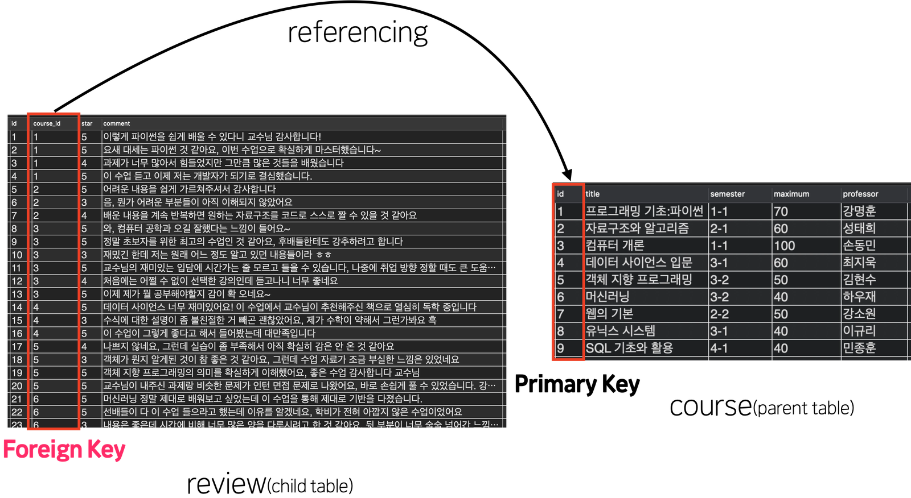

  지금 왼쪽이 강의평가들이 저장돼있는 **review 테이블**, 오른쪽이 수업(강의) 정보들이 저장돼있는 **course 테이블**인데요. 

  review 테이블 중에서 특정 row가 나타내는 강의평가가 **어느 수업에 대한 것인지**를 알려면 

  **(1) review 테이블의 course_id 컬럼의 값을 보고** 

  **(2) course 테이블로 가서 그 값을 id 컬럼의 값으로 가진 row를 찾으면 됩니다.** 

  예를 들어,

  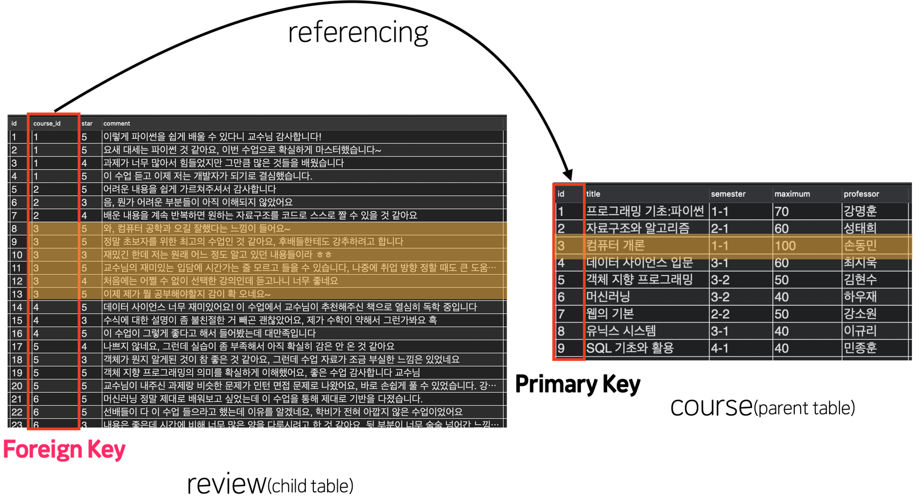

  위 그림처럼 course_id 값이 3인 강의평가들은 ‘컴퓨터 개론’ 수업에 대한 평가들인 것을 알 수 있는데요. 

  지금 review 테이블의 course_id 컬럼이, 다른 테이블인 course 테이블의 특정 row 하나를 식별하는데 쓰이고 있죠? **이렇게 한 테이블 내에서 다른 테이블의 특정 row를 식별하게 해주는 컬럼이 Foreign Key인 겁니다.**

  그리고 이런 경우를 두고 Foreign Key로 다른 테이블의 Primary Key를 **참조(reference)**한다라고 표현하죠. 

  Foreign Key가 존재할 때 Foreign Key가 있는 테이블을 **'자식 테이블(child table)'**이나 **'참조하는 테이블(referencing table)'**이라고 하고 

  Foreign Key에 의해 참조당하는 테이블을 '**부모 테이블(parent table)'**, **'참조당하는 테이블(referenced table)'**이라고 합니다. 

  만약 DBMS 상에서 한 테이블의 컬럼을, '**이것이 다른 테이블의 컬럼을 참조하는 Foreign Key다**'라고 설정해놓으면 **‘*참조 무결성(Referential Integrity)*'**이라는 것을 지킬 수 있습니다. 

  ‘참조 무결성’이란 이런 것입니다. 

  방금 전에 본 것처럼 ‘컴퓨터 개론’ 수업에 달린 강의평가들이 있는 상황을 생각해봅시다. 

  만약 course 테이블에서 ‘컴퓨터 개론’ 수업을 나타내는 row를 삭제하면 어떻게 될까요? 

  그럼 그 row를 참조하던 review 테이블의 강의평가 row들은 ‘부모 잃은' row들이 되어버립니다. course_id 값이 3이지만 어떤 수업에 대한 강의평가인지를 알 수가 없게 되는 거죠. 

  또는 ‘컴퓨터 개론' 수업의 id 컬럼의 값이 3에서 갑자기 엉뚱한 15, 1000으로 바뀌는 것도 문제입니다. 마찬가지로 그 row를 참조하던 강의평가 row들은 참조할 row가 사라져서 어느 수업에 대한 강의평가인지를 알 수 없게 됩니다. 

  이건 모두 ‘참조 무결성’이 훼손되었기 때문에 생긴 결과인데요. ‘참조 무결성’이란 두 테이블 간에 위와 같은 참조 관계가 있을 때 각 데이터 간에 유지되어야 하는 정확성과 일관성을 의미합니다. 그러니까 **‘course_id 값이 3인 강의평가들은 있는데 정작 course 테이블에는 id 값이 3인 수업이 없다?!’**라는 건 ‘참조 무결성’이 훼손된 사례인 거죠.

  이런 ‘참조 무결성’을 지키기 위한 수단이 특정 컬럼을 Foreign Key로 설정하는 것인데요. 이번 챕터에서는 review 테이블의 course_id 컬럼을 Foreign Key로 설정하고 두 테이블 간의 ‘참조 무결성’을 어떻게 지킬 수 있는지 배워보겠습니다. 


- #### FOREIGN KEY 설정하기

  Foreign Key는 테이블 간의 참조 무결성을 지키기 위해 필요하다. 

  그러나, 개념적으로 Foreign Key가 존재한다고 해서, 참조무결성이 지켜지고 있다는 소리는 아님. 이 컬럼이 FK라고 설정을 해줘야함. 

  앞에 설정하는거까지는 앞에서 다 했음. 이번에는 하단의 빨간박스 부분이 중요함. 

  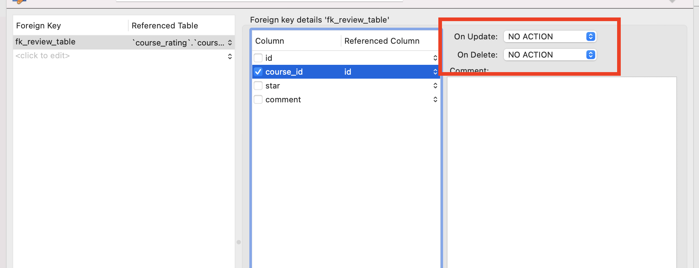

  각각 눌러보면 총 4가지의 선택지가 있음. 

  일단 여기서는 `RESTRICT` 선택해보자. 

  이제 **APPLY**누르면 아래와 같은 SQL문이 나옴. 

  ```Sql
  ALTER TABLE `course_rating`.`review` 
  ADD INDEX `fk_review_table_idx` (`course_id` ASC) VISIBLE;
  ;
  ALTER TABLE `course_rating`.`review` 
  ADD CONSTRAINT `fk_review_table`
    FOREIGN KEY (`course_id`)
    REFERENCES `course_rating`.`course` (`id`)
    ON DELETE RESTRICT
    ON UPDATE RESTRICT;
  ```

  이 중에 아랫부분을 복사해서 다시 쿼리창으로 가보자. 

  ```sql
  ALTER TABLE `course_rating`.`review` 
  ADD CONSTRAINT `fk_review_table`
    FOREIGN KEY (`course_id`)
    REFERENCES `course_rating`.`course` (`id`)
    ON DELETE RESTRICT
    ON UPDATE RESTRICT;
  ```

  `ADD CONSTRAINT`라는 SQL문이 있음. 테이블에 제약사항을 줄때 하는 것. 사실 테이블 입장에서는 Foreign Key도 제약사항 중 하나일 뿐. 

  그래서 위에서 foreign key설정할때 붙였던 이름 '**fk_review_table**'은 그냥 제약사항의 이름이였던 것. 

  아래처럼 FOREIGN KEY빼고, ADD만 써도 생성은 가능함. 다만, MySQL이 자동으로 이름을 붙여 주는 것. 이름을 붙여주는게 나중에 더 편함. 

  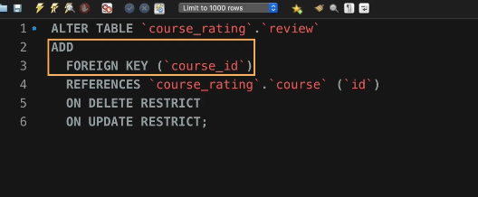


- #### SHOW CREATE TABLE 문으로 현재 테이블을 어떻게 만들 수 있는지 보기

  이번 챕터에서는 Foreign Key를 설정할 때 알아야하는 내용들을 배울 겁니다. 그런데 그전에 알아둬야할 SQL 문이 있는데요. 

  바로 **SHOW CREATE TABLE** 문입니다. 

  이 SQL 문은 특정 테이블을 지금 바로 생성한다고 할 때 작성해야할 CREATE TABLE 문이 뭔지를 보여주는데요.

  **이전 영상에서 Foreign Key를 설정한 직후의 review 테이블**을 CREATE TABLE 문으로 바로 생성하려면 어떻게 할 수 있는지 살펴볼게요. 

  아래와 같이 실행하면,

  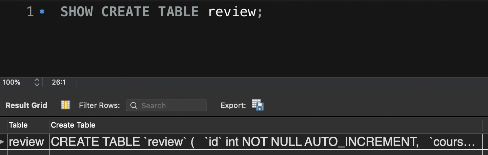

  표 모양의 결과가 출력됩니다. 이 결과에서 **Create Table** 쪽의 칸을 클릭하고, 마우스 오른쪽 버튼을 누릅니다.

  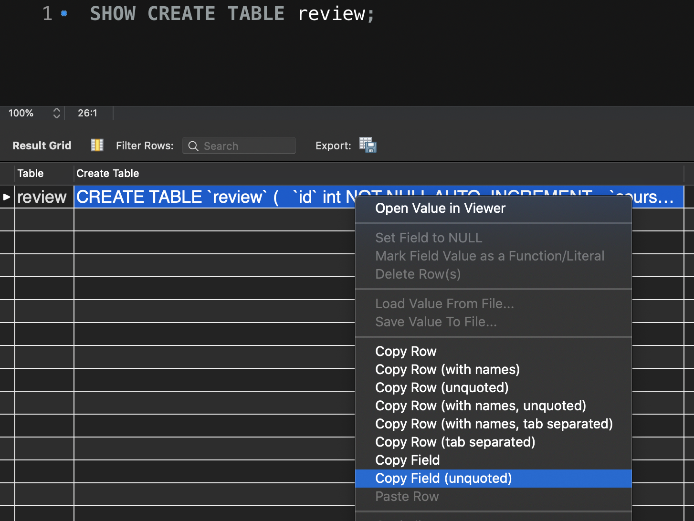

  그럼 뜨게 되는 여러 항목들 중에 **Copy Field(unquoted)**를 클릭하세요. 그 다음 그 위에 잠깐 붙여넣기를 해보면 

  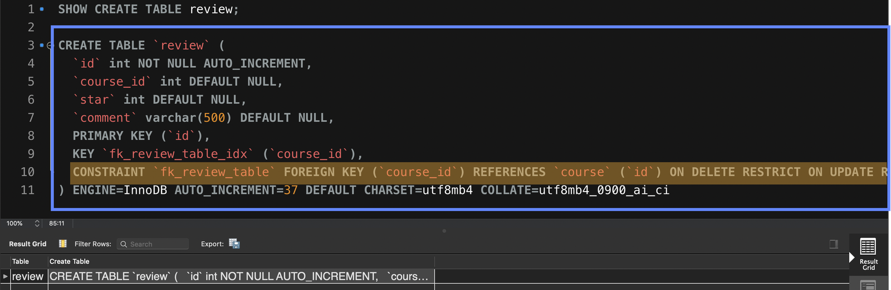

  하늘색 박스처럼 **현재 상태의 review 테이블을 만들려면 CREATE TABLE 문을 어떻게 써야하는지** 바로 알 수 있습니다. 

  ```sql
  CREATE TABLE `review` (
    `id` int NOT NULL AUTO_INCREMENT,
    `course_id` int DEFAULT NULL,
    `star` int DEFAULT NULL,
    `comment` varchar(500) DEFAULT NULL,
    PRIMARY KEY (`id`),
    KEY `fk_review_table` (`course_id`),
    CONSTRAINT `fk_review_table` FOREIGN KEY (`course_id`) REFERENCES `course` (`id`) ON DELETE RESTRICT ON UPDATE RESTRICT
  ) ENGINE=InnoDB AUTO_INCREMENT=39 DEFAULT CHARSET=utf8mb4 COLLATE=utf8mb4_0900_ai_ci
  ```

  특히 이 중에서도 오렌지색 부분이 **Foreign Key에 대한 정보를 담고 있는데요.** 

  저는 기존에 있던 review 테이블에 Foreign Key 설정을 추가하기 위해 ALTER TABLE 문을 썼지만,

  만약 review 테이블을 처음에 만들 때부터 Foreign Key 설정을 해주려면 이런 식의 문법을 쓰면 되는 겁니다.

  맨 앞에 ADD가 빠진 것만 빼고는 ALTER TABLE 문 때와 문법은 똑같습니다.

  앞으로 여러분이

  (1) 영상의 내용을 실행기에서 따라하시거나,

  (2) 과제를 채점할 때 이 SHOW CREATE TABLE 문이 사용될 겁니다. 

  그 중에서도 특히 Foreign Key 설정에 관한 부분을 집중해서 보시면 됩니다. SHOW CREATE TABLE은 실무에서도 유용하게 사용되는 SQL 문이니까 사용법과 그 실행 결과의 의미를 잘 기억하세요.


- #### FOREIGN KEY로 보장되는 참조 무결성

  Foreign Key는 자식테이블의 부모테이블에 대한 참조 무결성을 지키기 위해 사용되어짐. 그런데 어떻게 참조무결성이 지켜질까? 

  자식테이블인 review테이블에 새로운 Row하나를 추가해보자. 

  ```sql
  INSERT INTO review (course_id, star, comment) VALUES (10, 5, 'Very Good')
  ```

  그런데 사실 10은 course테이블에 없는 숫자. 왜냐면 10 이라는 숫자는 course의 id중에 없기 때문. 

  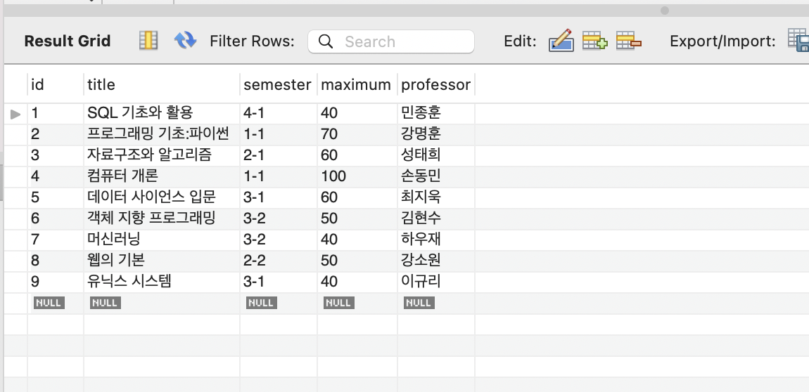

  이제 이 상태에서 위의 query문이 들어가면 참조무결성이 깨지게 됨. 당연히 에러가 뜸. 

  > Error Code: 1452. **Cannot add or update a child row**: a foreign key constraint fails (`course_rating`.`review`, CONSTRAINT `fk_review_table` FOREIGN KEY (`course_id`) REFERENCES `course` (`id`) ON DELETE RESTRICT ON UPDATE RESTRICT)

  이런 제약사항때문에, 이제 존재하지 않는 수업이 추가될 수가 없는 것. 

  아래처럼 존재하는 수업은 당연히 들어가짐. 

  ```sql
  INSERT INTO review (course_id, star, comment) VALUES (8, 5, 'Very Good')
  ```

  

- #### 부모 테이블의 row가 삭제될 때 - RESTRICT 정책

  그럼 부모테이블에서 하나가 삭제되면? 거기 연결되어 있는 자식테이블은 어떻게 해? 

  코스 5가 삭제되면, 5를 참조하던 애들은 어떻게 되냐는 뜻. 

  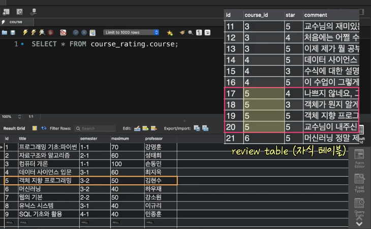

  부모 테이블에서 row가 삭제될때, 그것을 참조하던 자식 테이블이 어떻게 되야 하냐에 따른 정답은 없음. 

  어떻게 자식 테이블이 처리될지 크게 3가지의 정책이 있음. 

  **이게 ON DELETE에 써 있던 정책**

  1. **Restrict**  = **No Action**정책과 동일

     자신을 참조하는 자식 테이블의 row가 하나라도 있는 경우 애초에 삭제 자체가 불가능함. 자식 테이블이 어떻게 될지 고민할 게 없이 삭제 자체가 불가능한 것. 

     ```sql
     DELETE FROM course WHERE id=5;
     ```

     > Error Code: 1451. Cannot delete or update a parent row: a foreign key constraint fails (`course_rating`.`review`, CONSTRAINT `fk_review_table` FOREIGN KEY (`course_id`) REFERENCES `course` (`id`) ON DELETE RESTRICT ON UPDATE RESTRICT)

     꼭 삭제하고 싶다면, 일단 그 row를 참조하고 있는 자식테이블을 다 수정해야 함. 

  2. **CASCADE** 

     영단어의 뜻이, *폭포수처럼 떨어지다, 연쇄작용을 일으키다.* 

     해당 정책은 부모테이블을 삭제할 때 삭제가 잘 됨. 그런데 그것을 참조하고 있던 자식테이블도 같이 삭제가 됨. 

     *이 정책은 데이터 그냥 날려버린다는 것을 유의하고 사용할 것.* 

  3. **SET NULL**

     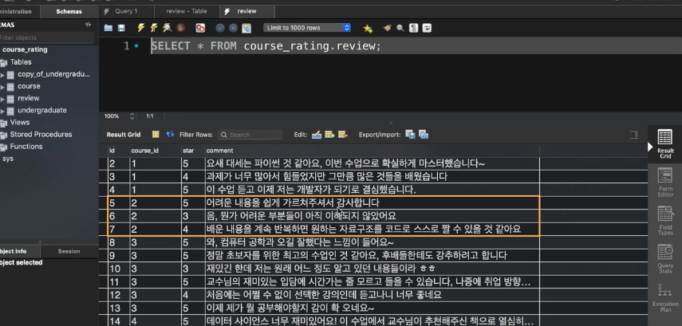

     위에서 course 테이블로 가서 2번 수업을 삭제해보자. 

     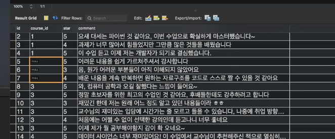

     원래 2값이 있던 자리에  NULL이 들어가 있음. 

     즉, 부모테이블이 삭제됬을 때, 그것을 참조하던 자식테이블의 foreign_key컬럼의 값을 모두 **NULL**로 바꿔주는 정책. 

     **부모잃은 자식으로 만드는 것.** 


- #### 부모 테이블의 Row에서 컬럼이 갱신될때는? ON UPDATE

  지금까지는 삭제에 대해서만 했음. 그런데, 참조당하는 컬럼의 값이 갱신될때는 어떻게 될까? 

  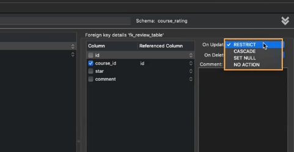

  의미도 그냥 다 똑같음. 

  1. **RESTRICT**는 수정이 불가능함. 

     ```sql
     UPDATE course SET id=100 WHERE id = 1; 
     ```

     > Error Code: 1451. Cannot delete or update a parent row: a foreign key constraint fails (`course_rating`.`review`, CONSTRAINT `fk_review_table` FOREIGN KEY (`course_id`) REFERENCES `course` (`id`) ON DELETE CASCADE ON UPDATE RESTRICT)

  2. **CASCADE**는 수정하면, 자식들의 값들도 같이 변경됨(ON DELETE랑 다름). 
  3. **SET NULL**은 NULL로 바뀜. 


- #### 논리적 Foreign Key, 물리적 Foreign Key

  이때까지 **Foriegn Key의 의미와 필요성, Foreign Key로 참조무결성을 지키고자할 때 설정할 수 있는 정책들**을 배워보았습니다. 

  실무에서는 

  주문 테이블 - 배송 테이블, 

  회원 테이블 - 댓글 테이블, 

  부서 테이블 - 직원 테이블 등 

  처럼

  많은 테이블들이 Foreign Key를 매개로 해서 관계를 맺고 있고, 여러 테이블들을 하나로 합치는 조인(Join)을 이 Foreign Key 기준으로 하는 것이 일반적이기 때문에, 현재 데이터베이스에 존재하는 Foreign Key들을 잘 파악하는 것이 중요하죠. 혹시 조인이 무엇인지 모르는 분들은 [이 영상](https://www.codeit.kr/learn/courses/sql-database-for-developers/3212)을 참고하세요.

  그런데 실무에서 데이터베이스의 테이블을 살펴보다보면 

  **어떤 테이블의 특정 컬럼이 Foreign Key로 설정되어야할 것 같은데** 

  **Foreign Key로 설정되지 않은 경우**를 보게될 수도 있습니다. 

  사실 여러분도 어느정도 짐작하셨겠지만, 어떤 테이블의 한 컬럼이 

  논리적으로 다른 테이블의 컬럼을 참조(reference)해야해서 개념상 Foreign Key에 해당하는 것과, 

  실제로 해당 컬럼을 Foreign Key로 설정해서 두 테이블 간의 참조 무결성을 지킬 수 있게되는 것은 별개의 개념입니다. 

  그래서 보통 이 둘을 나누어서 개념상, 논리적으로 성립하는 Foreign Key를 **논리적(Logical) Foreign Key**라고 하고, 

  DBMS 상에서 실제로 특정 컬럼을 Foreign Key로 설정해서 두 테이블 간의 참조 무결성을 보장할 수 있게 됐을 때, 그 컬럼을 **물리적(Physical) Foreign Key**라고 합니다. 

  데이터베이스에 들어갈 여러 테이블들을 설계하다보면 당연히 여러 논리적 Foreign Key들이 생길 수밖에 없습니다. 하지만 *실무에서는 논리적 Foreign Key라고 해서 꼭 그것을 물리적 Foreign Key로 설정하는 것은 아닙니다.* 물리적 Foreign Key로 설정한다면 참조 무결성이 보장되니까 좋을텐데 왜 설정하지 않는 걸까요? 그건 바로 다음과 같은 문제들 때문입니다.

  **1. 성능 문제** 

  실제 서비스에 의해 사용되고 있는 데이터베이스의 테이블들은 단 1초 내에도 수많은 조회(SELECT), 추가(INSERT), 갱신(UPDATE), 삭제(DELETE) 작업이 일어나고 있을 수 있습니다. 이럴 때 SQL 문 하나하나가 얼마나 빨리 실행되는지가 사용자의 만족도에 큰 영향을 미치게 될 텐데요. 

  **물리적 Foreign Key가 있는 자식 테이블의 경우에는 INSERT, UPDATE 문 등이 실행될 때 약간의 속도 저하가 발생할 가능성이 있습니다.** 왜냐하면 INSERT, UPDATE 문이 실행될 때 혹시라도 참조 무결성을 깨뜨리는 변화가 발생하지는 않을지 추가적으로 검증해줘야 하기 때문입니다. 즉, 물리적 Foreign Key를 설정하게 되면, 데이터의 참조 무결성을 보장해주는 대신, 성능 부분에서는 약간의 양보가 필요한 거죠. 

  만약 데이터의 참조 무결성보다는 일단 당장 빠른 성능이 중요하다면 물리적 Foreign Key를 굳이 설정하지 않기도 합니다. 그리고 이렇게 일단은 INSERT, UPDATE 문 등이 보다 더 빠르게 실행되도록 하고, 참조 무결성을 어기는 데이터들은 정기적으로 별도 확인 후에 삭제해주는 방식을 택하기도 하죠. 

  **2. 레거시(Legacy) 데이터의 참조 무결성이 이미 깨진 상태라면?** 

  IT 세계에는 레거시(Legacy)라고 하는 용어가 있습니다. Legacy는 ‘유물, 유산’ 이런 뜻을 가지는 단어인데요. IT 세계에서는 프로그램의 기존 코드, 기존 데이터 등을 나타낼 때 사용하는 말입니다. 

  데이터베이스 쪽 분야에서는 레거시 데이터라는 말을 흔히 쓰는데요. 어떤 회사에 개발자로 입사했을 때, 이미 그 회사에 쌓여있던 데이터라고 생각하시면 됩니다. 만약 여러분이 이런 레거시 데이터들을 살펴봤는데 그 회사가 그동안 물리적 Foreign Key 없이 데이터를 쌓아와서 참조 무결성을 어기는 row들이 생겨버린 상황이라고 해봅시다. 

  이런 경우에 어떤 선택을 해야할까요? 일단 참조 무결성을 어기는 row들을 과감하게 지워버린 후에 물리적 Foreign Key를 설정하는 방법이 있을 겁니다. 하지만 만약 참조 무결성을 어기는 row들의 수가 많고, 그것들도 소중한 데이터라서 함부로 삭제할 수 없는 상황이라면 어떻게 해야할까요? 

  물론 여러분이 입사한 이후부터는 참조 무결성을 지키면서 데이터를 저장하도록 할 수는 있습니다. 하지만 아무리 그 뒤로 참조 무결성을 지킨다고 해도 이미 레거시 데이터 때문에 전체적인 차원에서의 참조 무결성은 깨져버린 상태입니다. 

  바로 이런 현실적인 이유 때문에 그냥 물리적 Foreign Key없이, 참조 무결성을 지키는 것을 포기하고 서비스를 운영하는 곳들도 생겨나게 됩니다. 참조 무결성이 깨지더라도 일단 소중한 데이터들을 삭제하지는 말자는 생각인 거죠.

  위에서 본 이유 등으로 인해 실무에서는 **논리적 Foreign Key를 굳이 물리적 Foreign Key로 설정하지 않는 경우도 많습니다.** 여러분이 혹시 실무에서 이런 현상을 발생하게 되더라도 당황하지 마시라고 알려드리는 건데요. 

  하지만 분명한 것은 데이터의 **참조 무결성(Referential Integrity)**을 완벽하게 지켜야하는 서비스(은행, 학적 관리 서비스 등)에서는 논리적 Foreign Key를 반드시 물리적 Foreign Key로 설정해야합니다. 100%의 정확성이 요구되는 서비스에서 참조 무결성이 깨져버린다면, 상상하고 싶지 않은 최악의 상황을 만나게 되기 때문입니다. 

  논리적 Foreign Key와 물리적 Foreign Key가 뭔지 이제 잘 아시겠죠?


- #### Foreign Key를 삭제하는 방법

  이번 노트에서는 Foreign Key를 삭제하는 방법을 배워보겠습니다. 한번 설정한 Foreign Key는 

  필요가 없어진 경우에는 삭제할 수도 있고, 삭제하고 다른 Foreign Key를 걸 수도 있습니다. 

  Foreign Key를 삭제하려면 일단 테이블에 어떤 Foreign Key가 있는지를 확인해야겠죠? 

  [이 노트](https://www.codeit.kr/learn/3314)에서 배웠던 대로 **SHOW CREATE TABLE** 문을 사용하면 되는데요. 

  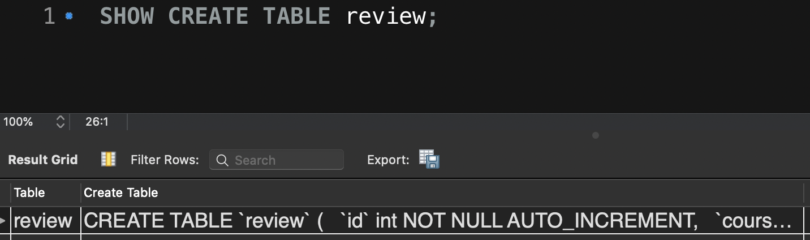

  review 테이블의 CREATE TABLE 문을 확인해보면 이런 결과가 출력되는데요. 여기서 CREATE TABLE 컬럼의 값을 복사해서 살펴보면 

  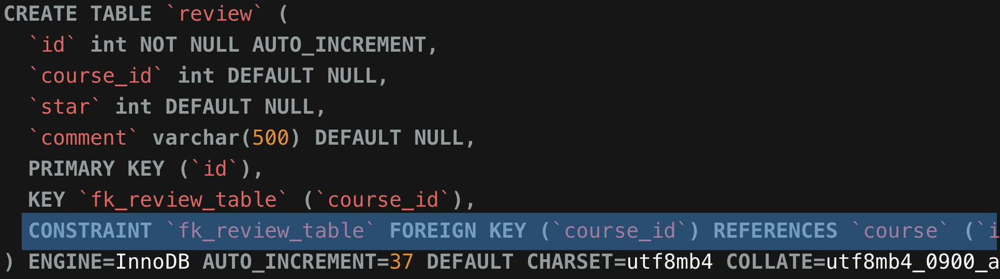

  위와 같이 **이 테이블에 ‘fk_reveiw_table’이라는 Foreign Key 제약사항이 걸려있는 것**을 볼 수 있습니다. 이렇게 Foreign Key 이름을 확인하시면 됩니다.

  그리고 Foreign Key를 삭제하려면 이렇게 쓰면 됩니다. 

  

  이때까지 우리는 테이블을 삭제할 때, 컬럼을 삭제할 때 매번 **DROP**이라는 단어를 썼었죠? Foreign Key의 경우도 마찬가지입니다. DROP FOREIGN KEY라고 써주고 그 뒤에 Foreign Key의 이름을 적어주면 테이블의 Foreign Key를 삭제할 수 있습니다. 


- #### 데이터베이스의 설계사항 스키마

  우리는 이때까지 데이터베이스 안에 존재하는 

  - 각 테이블의 컬럼 구조, 각 컬럼의 데이터 타입과 속성
  - 테이블 간의 관계를 나타내는 Foreign Key

  등에 대해서 배웠습니다. 

  그런데 이렇게 

  데이터베이스에 어떤 테이블들이 있고, 

  각 테이블의 컬럼 구조와 각 컬럼의 데이터 타입 및 속성이 어떻게 되고, 

  테이블 간의 관계는 어떻게 되는지 등과 같은,

  **데이터베이스에 관한 모든 설계사항**을 스키마(Schema)라고 하는데요.

  스키마는 실무에서 정말 자주 사용되는 용어 중 하나입니다. 

  스키마는

  ‘스키마는 만드셨나요?’,

  ‘이번에 앱이 업데이트되면 스키마에 큰 변화가 있을 것 같습니다.’,

  ‘스키마가 우리 비지니스 상황에 최적화되지 않은 것 같아요.’ 같은 문장들에서 자주 활용되곤 하죠.. 

  어떤 데이터베이스를 새롭게 구축해야할 때는 가장 처음 이런 '스카마'를 짜야합니다.

  그리고 스키마를 짜는 것을 '데이터베이스 모델링' 또는 '데이터베이스 디자인' 이라고 합니다.

  데이터베이스라는 건 결국 첫 설계가 

  향후에 환경 변화에 맞춰 데이터베이스를 수정할 때 얼마나 더 유연하고 편하게 할 수 있는지에 큰 영향을 미치게 됩니다. 

  즉, 처음부터 스키마를 잘 짜는게 중요하죠. 

  사실, 스키마에는 크게 2가지 종류가 있습니다. 

  첫 번째는 **개념적 스키마(Conceptual Schema)**로. 방금 설명한 내용이 개념적 스키마에 해당하는 내용입니다. 하나의 조직, 하나의 기관, 하나의 서비스 등에서 필요로 하는 데이터베이스 설계사항을 의미하죠. 보통 스키마라고 하면 이 개념적 스키마를 의미합니다.

  두 번째는 **물리적 스키마(Physical Schema)**입니다. 물리적 스키마는 전혀 다른 의미의 스키마인데요. 물리적 스키마는 데이터를 실제로 컴퓨터의 저장장치에 어떤 방식으로 저장할지를 결정하는 스키마입니다. 예를 들어, 만약 member 라는 테이블이 있고 그 안에 id, name, age 등의 컬럼이 있을 때 각 컬럼의 값들을 어떤 방식으로 저장할지에 관한 설계사항이죠. 그래서 물리적 스키마는 저장 스키마(Storage Schema), 내부 스키마(Internal Schema)라고도 합니다. 

  사실 물리적 스키마는 일반 개발자나, 사용자가 다룰 일이 없습니다. **MySQL, Oracle과 같은 DBMS를 만드는 개발자들이 다루는 개념**이죠. 똑같은 개념적 스키마더라도 DBMS에 따라 그 물리적 스키마는 전혀 달라지겠죠? 같은 데이터라도 컴퓨터에 실제로 어떻게 저장할지는 DBMS에 따라 다르니까요. 바로 이 물리적 스키마 부분에서 각 DBMS만의 장단점, 특성들이 드러나게 되는 것입니다.

  스키마라는 게 뭔지 이제 감이 오시죠? 그냥 일반적으로는 스키마가 개념적 스키마를 의미한다는 것만 잘 기억하시면 됩니다.

  그런데 이때까지 설명한 내용은 모두 스키마에 관한 일반론적인 설명입니다. 아쉽게도 스키마라는 단어의 의미에 혼동을 주는 요소가 하나 있습니다. 그건 바로 각 DBMS들의 사용 설명서를 읽어보면, 제각각 스키마라는 단어를 조금씩 다르게 사용하고 있다는 겁니다. 

  일단 MySQL에서는 스키마를 그냥 Database와 같은 의미로 혼용하고 있습니다. 이 내용은 [이전 영상](https://www.codeit.kr/learn/3260)에서도 한번 언급한 적이 있습니다. 

  Oracle에서 스키마는 하나의 사용자가 만든 각종 객체(테이블, 뷰 등)의 집합을 의미합니다. MySQL에서의 의미와 뭔가 비슷하면서도 다른 느낌을 주는데요. 

  일단 당장 중요한 내용들은 아니기 때문에 넘어가겠습니다. 

  여러분은 스키마라는 단어를 위에서 설명한 ‘데이터베이스 설계사항’으로 이해하시고, 혹시라도 다른 의미로 사용되는 것 같은 경우에는 특정 DBMS에서만 가지는 의미가 아닐지 한번 직접 찾아보시는 게 좋습니다. 


- #### Foreign Key로 빠르게 파악하는 테이블 간의 관계

  이번 토픽의 첫 번째 영상에서 저는 대학교에서 자주 쓰이는 **'강의평가 데이터베이스'**를 만들 거라고 했습니다. 이번 노트에서 이때까지의 내용을 마무리해보겠습니다. 

  이전 챕터에서 만든 **undergraduate 테이블**과 이번 챕터에서 만든 **course 테이블, review 테이블** 간의 관계를 마저 완성한다면 이렇게 되겠죠?

  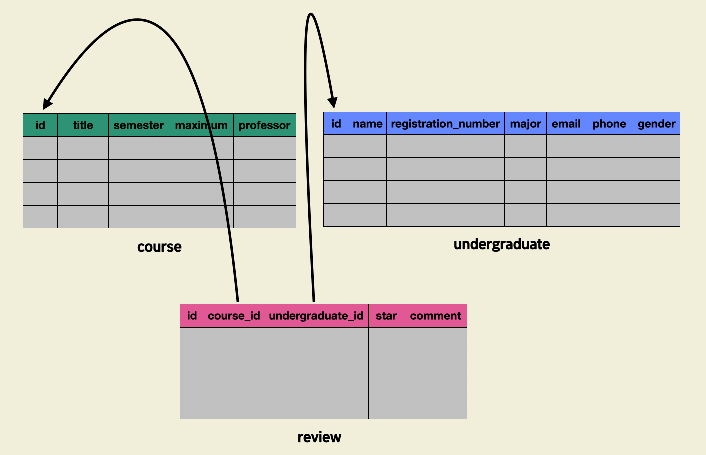

  지금 review 테이블에 undergraduate_id라는 컬럼을 추가했고 다음과 같은

  **(1) course_id 컬럼 → course 테이블의 id 컬럼**

  **(2) undergraduate_id 컬럼 → undergraduate 테이블의 id 컬럼**

  참조 관계가 성립하도록 **물리적 Foreign Key**를 설정하면 '강의평가 데이터베이스'의 기본적인 틀은 짤 수 있을 것 같네요.

  이렇게 하면 review 테이블에 있는 각 강의평가들이 

  (1) 어느 수업에 대해서 

  (2) 대학생 누구로부터 

  달린 건지를 파악할 수 있게 되고, 각 참조 관계마다 테이블 간의 **‘참조 무결성’**을 보장할 수 있게 될 겁니다. 

  만약 이 상태에서 각 교수님의 정보를 저장하는 **professor**라는 테이블을 추가한다고 해봅시다. 그럼 이렇게 될 겁니다. 

  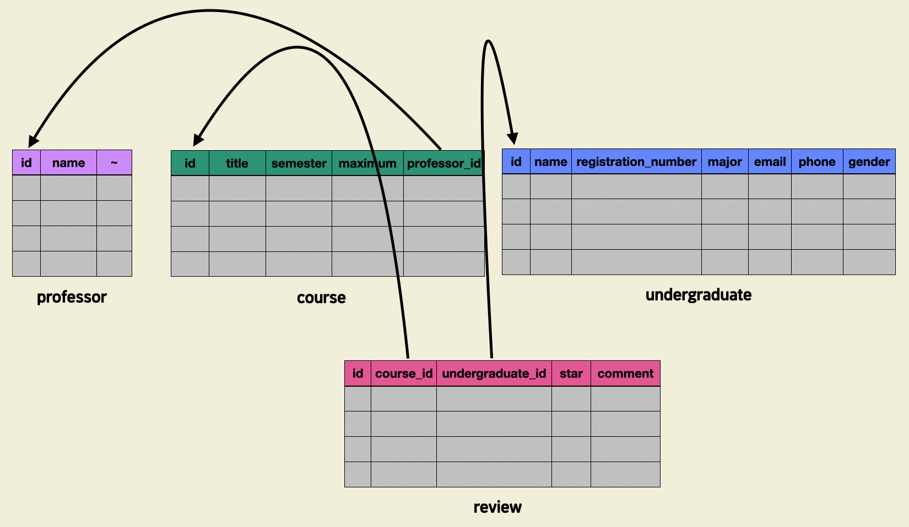

  (1) **professor 테이블**을 추가했고,

  (2) course 테이블의 professor 컬럼의 이름을 professor_id로 바꾸었습니다. 

  (3) 그리고 professor_id 컬럼을 professor 테이블의 id 컬럼을 참조하는 Foreign Key로 설정했는데요. 

  이런 식으로 테이블이 추가될수록, 기존 테이블의 구조가 변형되고, Foreign Key의 수도 늘어나게 될 것입니다. 그런데 이 말을 거꾸로 하면 

  각 Foreign Key가 무슨 테이블에 있고(FROM), 어느 테이블의 어느 컬럼을 참조하는지(REFERENCE TO)를 파악하면 테이블 간의 관계, 나아가 데이터 저장 현황을 빠르게 파악할 수 있다는 뜻이겠죠?. 

  데이터베이스에 존재하는 물리적 Foreign Key들을 조회하는 방법은 DBMS마다 조금씩 다릅니다. MySQL의 경우는 토픽 1의 [‘실무에서 첫 번째로 여러분이 해야할 일’ 노트](https://www.codeit.kr/learn/courses/sql-database-for-developers/3250)의 뒷 부분을 참조하시면 그 방법을 알 수 있습니다. 

  만약 물리적 Foreign Key로 별도로 설정하지 않아서, 논리적 Foreign Key만 존재하는 상황이라면 해당 데이터베이스의 스키마에 관한 문서, 도면, 파일 등을 참고하는 게 좋습니다. 비록 물리적 Foreign Key로 설정하지 않았더라도 논리적 Foreign Key는 스키마를 짜는 데이터베이스 모델링 단계에서 모두 고려되기 때문입니다. 

  만약 여러분이 이미 운영 중인 데이터베이스를 맡게된다면 이런 Foreign Key들을 빨리 파악하는 것이 중요합니다. 

  데이터베이스에 데이터가 어떤 식으로 저장되고 있는지 파악했다면, 그 후로는 이번 토픽에서 배운 내용을 활용해서 데이터를 더 잘 저장하고 관리할 수 있을 겁니다. 데이터를 조회 및 분석할 때 좋은 결과를 얻기 위해서는, 애초에 필요한 데이터를 잘 저장하고 관리할 수 있어야 합니다. 이번 토픽에서 그런 능력들을 많이 키우셨기를 바랍니다.

  

