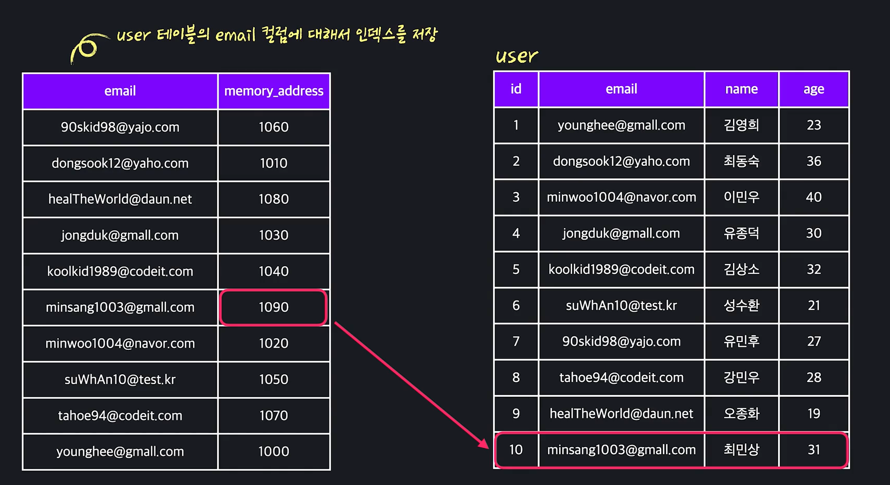

# 3. Data Modeling_3

- #### 물리적 모델링의 범위

  물리적 모델링은 실제로 만들 데이터베이스에 가장 가깝게 데이터 모델을 만드는 과정입니다.

  근데 사실 데이터베이스를 구축할 때는 생각보다 훨씬 많은 결정들을 해야 되는데요.

  각 요소들의 이름은 어떻게 짓고, 컬럼들의 데이터 타입은 어떻게 정하고 이런 내용 뿐만 아니라,

  어떤 DBMS를 사용할 건지, 보안은 어떻게 해결할 건지, 마스터 권한은 누구에게 있고, 데이터베이스를 몇 개로 나눠서 사용할 건지, 캐시(cache)는 어떻게 사용할 건지...테이블의 구조와 관계와는 동떨어져있다고 느낄만한 내용을 모두 계획해야 합니다.

  물론 다 중요한 내용들이긴 한데요. 이런 내용들은 데이터베이스뿐만 아니라, 데이터베이스와 소통하는 다른 여러 소프트웨어 요소들이 이루는 하나의 **시스템**을 어떻게 디자인할 건지와도 굉장히 밀접하게 연관이 있습니다.

  그렇기 때문에 이번 토픽에서 장황하게 모든 걸 설명드리는 것보다는 추후에 "시스템 디자인"이라는 주제로 따로 다루도록 하겠습니다.

  그렇다고 해서 여기서 아무것도 안 다룰 거는 아니고요. 이번 챕터에서는 물리적 모델링 중에서도 온전히 SQL 또는 ORM 같이 **코드로 정할 수 있는 내용**들, 시스템 디자인적인 요소들을 배제한 내용들 위주로 알아보겠습니다.

- #### 네이밍

  **물리적 모델링** : 데이터베이스에 실제로 저장하는 내용에 최대한 가깝게 데이터 모델을 만드는 과정. 

  일단 데이터를 컴퓨터에 저장하려면 이름을 지어야지(*네이밍*).

  

  1. 단수/복수 단어 중 어떤 것을 사용할지 정하기

     

     보통 단수단어 쓰는 사람들은, 복수단어에는 일관성이 떨어지는 경우가 많다고 생각함. 테이블 만들 때 마다, 이런 생각 안해도 되서 더 편리하다고 주장함. 

     

     

     복수형 단어들을 선호하는 사람들은 실제로 테이블에 저장되는 개체들이 하나가 아니기 때문에 복수형 단어 써야 한다고 말함. 

     

     **다만 컬럼 이름은 대부분 단수를 사용하는 것을 선호함.** 

     

  2. **대문자/띄어쓰기 어떻게 처리할지 정하기**

     아래처럼 다양한 방식이 존재함. 

     

  ​	

  3. **줄임말 정하기 **
  
     줄임말 너무 안쓰면 타자를 치는게 너무 비효율적 인 경우가 생기고, 줄임말을 너무 많이 사용하면 직관적으로 이해하기 힘든 경우가 있음. 
  
     

​	사실 네이밍은 어떤 규칙을 정하는지 보다, 정해진 규칙을 잘 따르는 것이 중요하다. **최악은 여러개의 기준이 섞이는 것.** 

​		

- #### 데이터타입

  각 컬럼에 어떤 데이터를저 저장할지를 정해야 함. 

  데이터타입을 고르는게 중요한 이유는 많음. 

  **가장 대표적으로는** 애초에 컬럼의 데이터타입을 정하면 사용자는 어찌됬든 그것을 지켜야 함. 그래서 어느정도까지는 정확성을 지키게 해주는 역할을 함. 

  

  예를 들어 AGE컬럼의 값을 INTEGER라고 해놓으면 적어도 거기에 이메일 값을 저장하거나, 날짜를 저장하고 그런거는 막아주지. 

  

  두번째는 데이터베이스에서 지원하는 연산들을 사용하기 편하기 때문. 

  애초에 생각해보면, 모든 데이터타입은 그냥 TEXT로 저장이 가능함. 그러나 그렇게 하면, 다양한 연산이나 함수들을 사용할 수 없음. 

  **INTERGER**나, **DATE**이런것들 >, <, /, +, - 이런거거를 못쓰고 너무 복잡하면 데이터베이스의 활용도가 떨어질 수 밖에 없음. 

  데이터베이스라는게 저장된게 많을 수록 연산이 느려짐. 

  고로 데이터베이스를 사용하면서 똑같은 데이터를 저장하되, 용량은 가장 작게 사용하는게 좋음. 컬럼 데이터타입을 잘 고르면 이 효과를 낼 수 있음.  

  

  INTEGER를 예로 들면, 아래 범위 내의 정수를 저장하는데, 그 중에 무슨 숫자인지와 상관없이 4 바이트를 사용하게 됨. 

  

  

  고로, TINY INT를 사용하는게 낫겠지. 이게 엄청 큰 차이를 줌. 많아질수록 큰 차이가 나게 됨. 

  

  고로 각 테이블에 들어갈 성질을 잘 파악한 후, 효율적인 데이터타입을 써주는 것이 효율적임. 

- #### 데이터 타입 정리

  각 컬럼에 적절한 데이터 타입을 잘 설정하는 일은 아주 중요합니다.

  데이터 타입을 잘 설정해야 저장 용량을 효율적으로 활용할 수 있고, 나중에 row 수가 많아졌을 때는 성능에 영향을 미치기도 하기 때문이죠.. 

  사용할 수 있는 데이터 타입은 DBMS마다 조금씩 차이가 있는데요.

  일단 MySQL의 데이터 타입들을 살펴보겠습니다.

  MySQL의 데이터 타입 중 일반적으로 쓰이는 것들은 다음 세 가지 카테고리로 분류할 수 있습니다.

  **Numeric types(숫자형 타입)**

  **Date and Time types(날짜 및 시간 타입)**

  **String types(문자열 타입)**

  이밖에도 여러 카테고리가 더 있지만, 당장 알 필요는 없습니다. 위의 세 가지 카테고리에 속한 주요 데이터 타입들을 살펴보겠습니다.

  **1. Numeric types(숫자형 타입)**

  숫자를 나타내기 위해서 사용되는 데이터 타입입니다.

  숫자형 타입은 다시 **정수형 타입**과 **실수형 타입**으로 나눌 수 있는데요. 하나씩 살펴볼게요.

  **(1) 정수형 타입** 

  말 그대로 정수값을 저장하는 타입입니다. 여기에 해당하는 타입들은 그것이 나타낼 수 있는 정수값의 범위에 차이가 있습니다.

  **1) TINYINT** 

  : 작은 범위의 정수들을 저장할 때 쓰는 데이터 타입입니다. TINYINT에서 INT는 Integer(정수)의 줄임말인데요. 최소 -128 ~ 최대 127 까지의 정수를 저장할 수 있는 타입입니다. 이때 SINGED와 UNSIGNED라는 개념을 알아야하는데요. SIGNED는 ‘양수, 0, 음수’를 나타내고, UNSIGNED는 ‘0과 양수’를 나타냅니다. TINYINT 뒤에 둘 중 무엇을 붙이느냐에 따라 아래와 같이 나타낼 수 있는 숫자의 범위가 달라집니다.

  TINYINT SIGNED : *-128 ~ 127* 

  TINYINT UNSIGNED : *0 ~ 255*

  이런 원리는 다른 정수형 타입에도 똑같이 적용됩니다. 참고로, TINYINT라고만 썼을 때는 SIGNED가 붙은 것으로 자동 해석됩니다. 

  **2) SMALLINT**

  : TINYINT 보다 좀더 큰 범위의 정수를 나타낼 때 쓰는 데이터 타입입니다. SINGED와 UNSIGNED에 따라 저장할 수 있는 수의 범위는 다음과 같습니다. 

  SMALLINT SIGNED : *-32768 ~ 32767* 

  SMALLINT UNSIGNED : *0 ~ 65535*

  **3) MEDIUMINT** 

  : 더 넓은 범위를 나타내는 데이터 타입니다. 

  MEDIUMINT SIGNED : *-8388608 ~ 8388607*

  MEDIUMINT UNSIGNED : *0 ~ 16777215*

  **4) INT** 

  : 더 넓은 범위를 나타내는 데이터 타입입니다.

  INT SIGNED : *-2147483648 ~ 2147483647*

  INT UNSIGNED : *0 ~ 4294967295*

  **5) BIGINT** 

  : 아주 큰 범위의 정수를 저장하는 데이터 타입입니다. 

  BIGINT SIGNED : *-9223372036854775808 ~ 9223372036854775807*

  BIGINT UNSIGNED : *0 ~ 18446744073709551615*

  BIGINT 데이터 타입을 사용한다면 아무리 큰 정수라도 잘 저장할 수 있겠죠? 

  **(2) 실수형 타입**

  우리는 정수뿐만 아니라 소수점이 붙어있는 수를 사용하기도 합니다. 이런 수를 저장하기 위한 타입을 실수형 타입이라고 하는데요. 키(180.489cm)나 몸무게(73.45kg), 온도(36.76도)처럼 정밀한 값이 요구되는 컬럼에는 실수형 타입을 지정해야 합니다.

  실수형 타입은 그 타입마다

  얼마나 넓은 범위의 수를 나타낼 수 있는지 뿐만 아니라

  소수점 뒤에 얼마나 많은 개수의 자리수가 존재할 수 있는지, 그러니까 하나의 값을 얼마나 정밀하게 표현할 수 있는지가 다른데요. 하나씩 살펴볼게요. 

  **1) DECIMAL**

  :일반적으로 자주 쓰이는 실수형 타입 중 하나로 보통 DECIMAL(M, D)의 형식으로 나타냅니다. 여기서 M은 최대로 쓸 수 있는 전체 숫자의 자리수이고, D는 최대로 쓸 수 있는 소수점 뒤에 있는 자리의 수를 의미합니다. 예를 들어

  DECIMAL (5, 2)라면 -999.99 부터 999.99 까지의 실수를 나타낼 수 있는 거죠.

  M은 최대 65, D는 30까지의 값을 가질 수 있습니다. 

  그리고 DECIMAL이라는 단어 대신 DEC, NUMERIC, FIXED를 써도 됩니다. 

  **2) FLOAT**

  :

  -3.402823466E+38 ~ -1.175494351E-38,

  0, 

  1.175494351E-38 ~ 3.402823466E+38

  범위의 실수들을 나타낼 수 있는 데이터 타입입니다. 참고로

  -3.402823466E+38 은 (-3.402823466) X (10의 38제곱) 을 의미하고 

  -1.175494351E-38 은 (-1.175494351) X (10의 38제곱 분의 1) 을 의미합니다.

  **3) DOUBLE** 

  :

  -1.7976931348623157E+308 ~ -2.2250738585072014E-308, 

  0, 

  2.2250738585072014E-308 ~ 1.7976931348623157E+308

  범위의 실수들을 나타낼 수 있는 데이터 타입입니다. FLOAT에 비해 더 넓은 범위의 수를 나타낼 수 있을 뿐만 아니라, 그 정밀도 또한 더 높은 타입입니다.(소수점 뒤에 최대로 허용가능한 자리수가 더 많음)

  **2. 날짜 및 시간 타입(Date and Time Types)**

  데이터베이스에서는 날짜 및 시간 정보를 다뤄야하는 경우가 정말 많습니다. 이런 정보를 다루는 데이터 타입들을 알아볼게요. 

  **(1) DATE** 

  : 날짜를 저장하는 데이터 타입입니다. 날짜는 ’2020-03-26’ 이런 형식의 연, 월, 일 순으로 값을 나타냅니다. 

  **(2) DATETIME**

  : 날짜와 시간을 저장하는 데이터 타입입니다. ’2020-03-26 09:30:27’ 이런 식으로 연, 월, 일, 시, 분, 초를 나타냅니다. 

  **(3) TIMESTAMP**

  : 날짜와 시간을 저장하는 데이터 타입입니다. ’2020-03-26 09:30:27’ 이런 식으로 연, 월, 일, 시, 분, 초를 나타냅니다. 그럼 DATETIME 타입과는 어떤 점이 다를까요? TIMESTAMP 타입은 타임 존(time_zone) 정보도 함께 저장한다는 점이 다릅니다. 무슨 말인지 간단한 테스트를 통해 바로 보여드릴게요. 아래와 같이 DATETIME 타입의 컬럼(DT 컬럼) 하나와, TIMESTAMP 타입의 컬럼(TS 컬럼) 하나가 있는 테이블을 만들게요. 

  

  이렇게 test라는 테이블을 만들고, 

  

  이 SQL 문을 실행해서 row 하나를 추가할게요. 이 문장은 앞으로 배우게 될 INSERT 문으로 테이블에 row를 추가하는 SQL 문입니다.

  저는 두 컬럼에 같은 날짜/시간 값을 넣어줬습니다. 

  확인해보면, 

  

  동일한 날짜/시간 값이 저장된 것을 확인할 수 있습니다. 

  자, 이제 두 타입의 차이점을 알아볼게요.

  그 전에 **UTC**라는 개념을 알아야 합니다. 전세계에 여러 **시간대(타임존, time-zone)**가 존재한다는 사실은 알고 계시죠? 각각의 시간대는 UTC를 기준으로 나타낼 수 있는데요. **UTC(Coordinated Universal Time)**는 국제 사회에서 통용되는 표준 시간 체계로 '국제 표준시'라고도 합니다. UTC는 영국 런던을 기준으로 하는데요. 우리나라는 런던을 기준으로 시간이 9시간 더 빠르기 때문에, 우리나라의 시간을 표현할 때는 **UTC+9**라고 표현합니다.

  그러니까 위에서 제가 저장한 날짜 시간 값은 이미 **UTC+9**에 해당하는 값인 거죠.

  이 상태에서 MySQL 서버의 시간대 설정을 한번 바꿔보겠습니다. 

  

  이걸 실행하면, 시간대가 **UTC-11**로 바뀝니다. 지구상에서 이 시간대에는 [니우에](https://ko.wikipedia.org/wiki/니우에)라는 나라가 존재합니다. 

  다시 test 테이블을 조회해보면

  

  DT 컬럼의 값은 그대로인데, TS 컬럼의 값은 원래 시간보다 **20시간 이전인 값**으로 바뀌어 있는 것을 알 수 있습니다.

  원래 **UTC+9**인 시간대에서 **UTC-11**인 시간대로 바뀌었기 때문에 +9와 -11의 차이대로 20시간 차이가 나는 겁니다. 

  이렇게 Datetime 타입과 Timestamp 타입은 타임 존 정보 저장 여부에서 차이가 있습니다.

  만약 타임 존 정보를 굳이 함께 저장할 필요가 없다면 Datetime 타입을, 타임 존 정보도 함께 저장하고 싶다면 Timestamp 타입을 설정하면 되겠죠? 

  **(4) TIME** 

  : 시간을 나타내는 데이터 타입입니다. ’09:27:31’ 형식으로 ‘시:분:초’를 나타냅니다. 

  **3. 문자열 타입(String type)** 

  문자열을 저장하기 위한 타입입니다. 이름, 댓글, 구매후기 등 문자열 형태의 데이터는 정말 다양하죠? 아래와 같은 타입들이 있습니다. 

  **(1) CHAR**

  : 문자열을 나타내는 기본 타입으로 Character의 줄임말입니다. CHAR(30), 이런 형식으로 나타내는데요. 괄호 안의 숫자는 문자를 최대 몇 자까지 저장할 수 있는지를 나타냅니다. 30이라고 써있으면 최대 30자의 문자열을 저장할 수 있다는 뜻입니다. CHAR 타입의 괄호 안에는 0부터 255까지의 숫자를 적을 수 있습니다. 

  **(2) VARCHAR**

  : VARCHAR도 VARCHAR(30) 이런 식으로 문자열의 최대 길이를 지정할 수 있는 문자열 타입입니다. 괄호 안에 최소 0부터 최대 65,535 (2**^16** − 1)를 쓸 수 있습니다. 그런데 VARCHAR는 CHAR보다 허용되는 최대 저장 길이가 더 크다는 점 말고 다른 차이점도 있습니다.

  그건 바로 **CHAR는 고정 길이 타입**이고, **VARCHAR는 가변 길이 타입**이라는 점입니다. 사실 VARCHAR라는 단어 자체가 Character Varing의 줄임말로 가변 문자열을 나타냅니다. 쉽게 설명하자면, CHAR(10), VARCHAR(10)이 있을 때,

  CHAR(10)은 어떤 길이의 문자열이 저장되더라도 항상 그 값이 10만큼의 저장 용량을 차지합니다. 하지만 VARCHAR(10)의 경우 만약 값이 ‘Hello’ 이런 5자라면 저장 용량도 5만큼 차지합니다. **저장 용량이 설정된 최대 길이에 맞게 고정되는 게 아니라 실제 저장된 값에 맞게 최적화되는 거죠.** 대신 VARCHAR 타입으로 값이 저장될 때는 해당 값의 사이즈를 나타내는 부분(1byte 또는 2byte)이 저장 용량에 추가됩니다.

  따라서 값의 길이가 크게 변하지 않을 컬럼에는 CHAR 타입을 사용하고, 길이가 들쑥날쑥할 컬럼에는 VARCHAR 타입을 쓰는 게 좋습니다. 

  **(3) TEXT**

  문자열을 저장하는 데이터 타입으로 최대 65535 자까지 저장할 수 있습니다. 이외에도 16,777,215 (2**24** − 1) 자까지 저장할 수 있는 MEDIUMTEXT, 4,294,967,295(2**32** − 1) 자까지 저장할 수 있는 LONGTEXT 타입이 있습니다. 

  VARCHAR 타입과 TEXT 계열의 타입은 내부 구현에서 일부 차이가 있는데요. 당장 이해하기에는 어려운 내용이기 때문에 생략하겠습니다. 일단은 정말 길이가 긴 문자열을 저장하려면 TEXT 계열의 타입을 써야하는구나 정도만 기억해주세요.

  자, 이때까지 MySQL의 주요 데이터 타입(Data type)들을 살펴봤는데요. 각 컬럼에 적합한 데이터 타입을 설정하기 위해서는 각 DBMS의 매뉴얼 페이지로 각 데이터 타입에 대해 정확하게 공부해야 합니다. 하지만 기초 단계에서는 이 정도만 알아도 충분하니까 위의 내용들을 잘 기억하고 넘어가주세요.

- #### 제약조건

  데이터베이스를 사용할 때는 정확성을 지키기 위해서 항상 특정 조건을 만족시키는 데이터 값들만 저장하고 싶은 경우들이 종종 있습니다.

  예를 들어 테이블에 성별을 저장하는 컬럼이 있다고 하면 여기 저장하는 값은 항상 `'m'` 또는 `'f'`여야 한다거나, 이메일을 저장하는 컬럼에 저장되는 값은 항상 문자열 `"@"`가 있어야 한다거나, 고유 학생 번호는 다른 학생과 겹치면 안 되며, 항상 8자리 정수여야 한다든지...이런 경우들이 있는 거죠.

  이렇게 특정 컬럼이 항상 만족해야 되는 조건들을 데이터 모델링에서는 제약 조건, 영어로는 constraint이라고 부릅니다.

  다행히도 대부분의 DBMS들은 테이블들에 제약 조건들을 걸게 해주는 기능이 있습니다. 데이터 타입도 일종의 제약 조건이고요. "겹치는 값이 없어야 한다", "값이 특정 범위, 길이, 또는 값이어야 한다". 이런 내용들을 미리 정해놓고, 어기는 값을 저장하려고 시도하면 자체적으로 오류를 내서 원하지 않는 값이 저장되는 걸 미리 막아주죠.

  정확히 각 DBMS마다 이걸 어떻게 설정할 수 있는지는 SQL 데이터베이스 관리 토픽에 나와있으니까 이 부분은 꼭 복습, 또는 학습하시길 바랍니다.

  물리적 모델링 범위에서는 이런 제약 조건들을 실제 데이터베이스에 걸어주는 게 아니라 찾아내야 합니다. 이 단계에서는 비즈니스 룰을 사용하거나, 저장하려는 데이터의 성질을 파악해서 각 테이블, 또는 컬럼에 대한 제약 조건들을 찾아냅니다.

  제약 조건은 ERM에 표현하기 힘들기 때문에, 따로 종이나 메모 같은 곳이 이 내용들을 하나씩 적어준 후, 실제로 데이터베이스에 계획된 내용을 반영할 때 SQL 또는 ORM을 사용하면 됩니다.

- #### 선형 vs 이진 탐색

  뒤죽박죽 섞여있는 배열에서 2을 찾아보자. 

  

  일반적으로는 앞에서 부터 뒤까지 모든 원소를 하나씩 확인하겠지. 

  이렇게 앞에서부터 뒤까지 하나씩 확인해 보는 방법은 선형탐색, **Linear Search**라고 부름. 

  

  데이터가 뒤죽박죽 저장되어 있다면, 선형탐색만이 유일한 방법. 

  그런데 만약에 오름차순으로 정리되어 있다면? 

  

  가장 먼저, 가운데 5를 확인. 이것보다는 아래 있다는 것을 확인. 

  그리고 다시 중간으로 감. 2로 가겠지. 무조건 이 뒤에 있겠지. 

  그럼 3, 4중에 하나. 그럼 이중에 중간을 확인. 다만, 배열 요소가 짝수개여서 중간 요소가 없을 때는, 중간 지점에서 하나 앞 원소를 사용한다. 

  

  **그럼 3이지. 원하는 값을 찾음.** 

  이렇게 데이터가 오름/내림 차순일때는 계속 남은 원소의 중간으로 가서 **up/down**을 찾는 과정을 반복. 

  

  이진탐색이 보통은 선형탐색보다 훨씬 더 빠름. 

  다만, 이진탐색은 데이터가 정렬되어 있을 때만 사용할 수 있지. 

  

- #### 인데스 개념

  > **인덱스라는게 내가 기존의 알던 인덱스가 아님. 이진탐색을 사용하기 위해서 특정 컬럼의 값들을 순서대로 저장해 놓고, 거기다가 원래 테이블의 해당 row를 찾을 수 있는 주소값을 저장해 놓은 표 자체를 여기서는 인덱스라고 부름.** 

  **책**을 예시로 사용하자. 책에서 특정 단어가 있는 페이지 찾고 싶을 때는 어떤 방법을 사용할까?

  '단풍잎'이라는 단어를 찾고 싶으면, 가장 첫번째 방법은 일단 첫페이지부터 다 보면서 단풍잎 단어 찾아야지

  

  데이터 베이스도 마찬가지. 아래와 같은 이메일을 찾고 싶으면 위에부터 봐야지. 

  

  근데 책이나 긴 논문 등에는 보통 **색인 Index**이라는것이 있음. 

  

  여기서 단어 단풍잎 찾는 거는 엄청 쉽지. 어차피 가나다순으로 정리되 있거든. 

  이것도 똑같이 인덱스의 중간부터 확인해. ㅅ으로 시작하지. 그럼 ㄷ은 ㅅ보다 앞에 있거든. 그 뒤 다 제끼고 앞으로 가서 또 중간으로 가는거 반복하는거지. 

  인덱스라는 것 자체가 특정 순서로 정리되어 있길래 이진탐색을 이용해서 빠르게 찾을 수 있음. 

  실제로 데이터베이스도 마찬가지임. 

  이메일을 찾을때도, 테이블과 별개로 이메일을 알파벳 숫서로 저장해놓고, 이진탐색으로 찾으면 되지. 그리고, 해당 유저 row를 찾을 수 있는 데이터 메모리 주소 같은 것을 저장해. 

  

  **이제 이진탐색으로 찾아가면 되지.**

  원하는 조건의 컬럼을 더 빨리 찾기 위해서, 특정 컬럼의 값들을 정렬해서 저장해 놓은 것을 **인덱스**라고 말함. 

- #### Clustered vs Non-Vlustered 인덱스

  **Clustered Index**

  clustered는 테이블 자체를 특정 컬럼에 대해서 알파벳 순 등으로 저장하는 것. 그래서, 특정 이메일을 찾을때는 이 순서를 이용해서 찾으면 됨. clustered index는 일반적으로 조회속도가 굉장히 빠르다는 장점이 있음. 하지만, 데이터 자체를 순서대로 저장했기 때문에 clustered index는 하나박에 못만듬. 예를 들어, 지금 이메일 순서대로 저장해놓고, **이름 순서로도 저장하고 그런게 안된다는 것** 

  책으로 따지자면, 뒤에 따로 색인을 만들어 놓는 것이 아니라, 애초부터 사전 처럼 알파벳 순으로 저장을 해 놓는 개념. 

  

  애초에 순서를 email 순으로 해놨기 때문에 특정 email 찾는 것은 빠르나, 특정 이름을 검색하고 싶다면, 선형탐색을 사용할 수 밖에 없음. 

  **Non-Clustered Index**

  *테이블 자체는 그대로 놔두고 다른 곳에 순서를 저장하는 것.* 지난 레슨 처럼.

  새로운 테이블에 특정 컬럼을 수서대로 저장하고, 그 옆에 각각 원래 row의 주솟값을 저장하는 것. 

  Non-Clustered Index는 실제 테이블과 무관하게 저장하기 때문에, 갯수의 제한이 없음. 

  

   그 어떤 컬럼에 대해서도 **Non-Clustered Index**를 만들 수 있다. 

  실제 테이블과는 다른 테이블에 저장되있기 때문에 아무래도, clustered index보다는 데이터 찾는게 조금 느림. 

  

- #### 인덱스 정리

  **선형 vs 이진 탐색**

  선형과 이진 탐색은 원하는 데이터를 찾는 가장 기본적인 두 가지 방법입니다.

  **선형 탐색**

  이렇게 하나의 숫자 배열이 있다고 합시다. 여기서 2를 찾고 싶습니다.

  

  선형 탐색은 그냥 가장 첫 원소부터 시작해서, 가장 마지막 원소까지 순서대로 하나씩 확인해보면서 2를 찾는 탐색법입니다.

  **이진 탐색**

  이번에는 숫자 배열이 오름차순으로 정렬돼있다고 합시다.

  

  여기서 3을 찾고 싶으면 어떻게 찾을 수 있을까요? 물론  선형 탐색을 사용해서 가장 앞부터 뒤까지 모든 원소를 확인해볼 수 있는데요. 배열이 정렬돼있기 때문에 조금 더 효율적인 방법을 사용할 수 있습니다.

  배열의 중간 원소를 확인합니다.

  5입니다.

  이 원소가 5이라는 사실을 통해서, 우리는 한 가지 확신을 얻을 수 있습니다. 바로 이 배열이 원소를 오름차순으로 저장하고 있기 때문에, 이 5 뒤에 있는 원소들에는 **절대로 3**이 있을 수 없다는 점이죠. 그렇기 때문에 이 뒤에 부분은 볼 필요가 없습니다. 다음에는 3이 있을 수도 있는 부분에서 또 3을 찾아봅니다. 이번에도 남은 범위의 중간 원소를 확인합니다.

  2입니다.

  자 이번에는 같은 논리로 3은 절대 2 앞에 있지 않을 것이라는 확신을 할 수 있습니다. 그렇기 때문에 지금 표시된 이 부분에서 다시 3을 찾으면 됩니다. 또 3가 있을 수도 있는 범위의 중간 숫자를 확인합니다.

  3입니다.

  원하는 값을 찾았습니다

  이렇게 데이터가 특정 순서대로 정렬돼 있을 때는, 계속 남은 범위의 중간 원소를 확인해봄으로써, 탐색 범위를 배번 반씩 줄여나갈 수 있습니다. 이 방법을 이진 탐색이라고 부르는데요. 이진 탐색은 선형 탐색보다 훨씬 더 효율적으로 주어진 조건의 데이터를 찾을 수 있습니다.

  **선형 vs 이진 탐색 차이**

  좀 전문적으로 얘기하면 선형 탐색은 데이터를 O(n)*O*(*n*)으로, 이진 탐색은 데이터를 O(lg(n))*O*(*l**g*(*n*))으로 찾는다고 하는데요. 이 차이는 1024개의 정렬된 데이터가 있을 때 선형 탐색을 쓰면 최대 1024번 만에 데이터를 찾아낼 수 있는 반면, 이진 탐색은 한 번 탐색할 때마다 남은 데이터의 반을 배제할 수 있기 때문에 최대 11번 만에 원하는 데이터를 찾아낼 수 있죠.

  **인덱스**

  인덱스는 "*데이터가 정렬돼있으면 원하는 데이터를 더 빠르게 찾을 수 있다*"라는 특성을 데이터베이스에 적용한 개념입니다.

  우리는 일상 생활에서도 인덱스를 접할 수 있는데요. 좀 어려운 책들을 보면, 가장 뒤에 색인이나 인덱스라고 불리는 부분이 있습니다. 이 색인이나 인덱스에는 특정 개념들과, 그 개념들이 소개된 책의 페이지가 개념을 기준으로 정렬된 상태로 표기돼있는데요. 그럼 저희는 원하는 개념을 이진 탐색을 통해 찾고, 그 개념이 소개된 페이지로 쉽게 넘어갈 수 있습니다.

  데이터베이스 인덱스 개념도 똑같습니다.

  원래는 특정 컬럼 값을 갖는 로우를 찾고 싶을 때는 선형 탐색과 같이 모든 로우를 순서대로 돌면서 원하는 값을 찾아야하는데요.

  인덱스는 테이블의 특정 컬럼들을 정렬된 상태로 저장합니다. 각 컬럼 값에 해당하는 로우의 주소와 함께요.

  

  그럼 특정 이메일을 갖는 유저 로우를 찾고 싶다면, 인덱스에서 이진 탐색을 통해 빠르게 해당 이메일을 찾은 후, 같이 저장된 주소로 그 이메일을 갖는 로우를 찾아낼 수 있는 거죠. 책의 인덱스와 다른 게 하나도 없죠.

  **Clustered 인덱스**

  Clustered 인덱스는 데이터베이스에 저장돼있는 데이터 자체를 특정 순서대로 저장하는 인덱스입니다. 예를 들어 이 user 테이블에서 이메일 column에 대한 clustered 인덱스를 만든다고 할게요. 그럼 데이터베이스 테이블 안의 내용이 실제로 email의 알파벳 순서대로 저장이 됩니다. a에서 시작해서 쭉 z까지 이메일들이 순서대로 저장이 됩니다.

  

  이메일이 순서대로 저장돼있으니까 특정 이메일을 찾을 때는 이 순서를 이용해서 데이터를 찾을 수 있죠.

  Clustered 인덱스는 일반적으로 조회 속도가 굉장히 빠르다는 장점이 있습니다. 하지만 데이터를 특정 순서대로 저장했기 때문에 Clustered 인덱스는 하나밖에 만들 수 없습니다. 지금은 데이터를 이미 이메일 순서대로 정렬해놨는데, 여기서 이메일 순서로도 정렬돼있으면서, 동시에 이름 순서대로 정렬할 수는 없죠.

  책으로 비유를 하면, 책 가장 뒤에 따로 인덱스를 만들어놓는 게 아니라, 영한 사전 같이 애초부터 단어들을 알파벳 순서대로 저장하는 겁니다.

  이렇게 하면 찾고 싶은 영어 단어는 빠르게 찾을 수 있겠지만, 이미 알파벳 순서대로 책을 만들어놨기 때문에, 사전 안에서 특정 한글 단어를 찾고 싶을 때는 선형 탐색을 사용해야 합니다.

  **Non-clustered 인덱스**

  Non-Clustered 인덱스는 로우들이 실제 저장된 순서 자체는 건들지 않고, 위에서 얘기했던 거처럼 아예 데이터베이스 다른 곳에 컬럼 값들의 순서를 저장하는 방법입니다.

  

  이메일에 대한 non-clustered 인덱스를 만들면 데이터베이스의 다른 곳에 이런 식의 데이터를 저장하는 거죠. 각 이메일에 대해서 해당 row의 유저가 저장된 주소를 저장합니다. 그래서 원하는 이메일을 찾았을 때, 주소를 사용해서 바로 원하는 유저 row를 찾을 수 있죠.

  Non-Clustered 인덱스는 실제 테이블과 무관하게 **순서**를 저장하기 때문에 개수의 제한이 없습니다. 그 어떤 column에 대해서도 non-clustered 인덱스를 만들 수 있습니다.

  아무래도 실제 테이블과 다른 곳에 저장돼있기 때문에 데이터를 찾는 게 clustered 인덱스보다 조금 느리다는 단점을 갖고 있습니다.

  Non-clustered 인덱스는 얘기했던 것과 같이 책의 색인, 또는 인덱스랑 비슷합니다. 책 내용은 그대로 유지하면서, 따로 개념들을 정렬해놔서, 언제든지 원하는 개념을 빠르게 찾을 수 있도록 하죠.

- #### 인덱스 중복되는 값들

  지금까지 본 인덱스 예시에서는 중복되는 값이 없는 경우만 살펴봤는데요. 컬럼에 중복되는 값들이 있어도 인덱스는 충분히 잘 작동할 수 있습니다.

  이번에도 책의 인덱스를 비유로 사용할게요. 책을 생각해보면 특정 개념들이 무조건 한 페이지에만 나오지는 않습니다. 예를 들면 "단풍잎"이라는 개념이 세 개, 네 개, 또는 열 개의 페이지에도 소개될 수 있는 거죠. 그럼 이때 책의 인덱스에서는 이 10개의 페이지를 모두 저장합니다. 그럼 저희는 이 열 페이지를 하나씩 돌면서 저희가 원하는 내용을 찾을 수 있는 거죠.

  데이터베이스의 인덱스도 마찬가지입니다. 그림으로 표현하자면 이런 식으로 저장되는 거죠.

  브랜드가 구짜, 나이코인 제품들, 오디도스인 제품들, 쇼넬 등 브랜드 이름이 이렇게 있고, 각 브랜드의 제품 로우에 대한 주소들이 이렇게 저장돼있습니다.

  

  이때 특정 브랜드인 제품 로우들을 찾고 싶을 때는 이진 탐색을 통해서 브랜드를 찾고 **가장 위에 있는 주소부터 시작해서 하나씩 아래로 가면서 해당 로우들에 접근하면 되는 거죠.** 예를 들어 브랜드가 나이코인 제품들을 찾고 싶으면 주소가 1080인 제품부터 1030, 1040에 순차적으로 접근할 수 있습니다.

  만약 브랜드가 나이코면서, 다른 조건도 만족하는 로우를 찾고 싶다면 이 주소들 중에서 원하는 로우를 찾을 수 있습니다. 이 로우 주소들은 어떤 특정 순서로 정렬된 것이 아니기 때문에 브랜드가 나이코인 제품들 중에서 또 다른 조건도 만족하는 데이터를 찾고 싶을 때는 네모 쳐진 제품들을 일일이 확인해보는 선형 탐색을 사용해야 합니다.

- #### Composite 인덱스

  