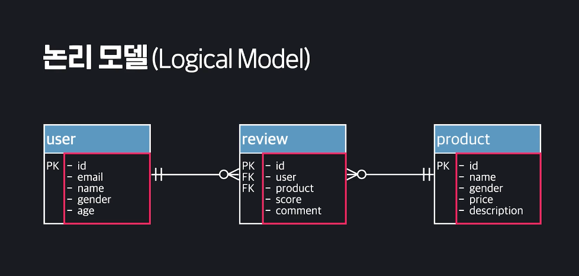
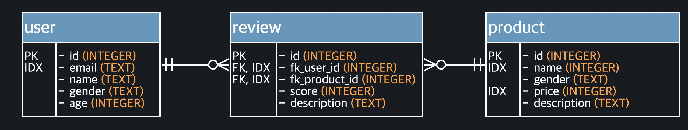
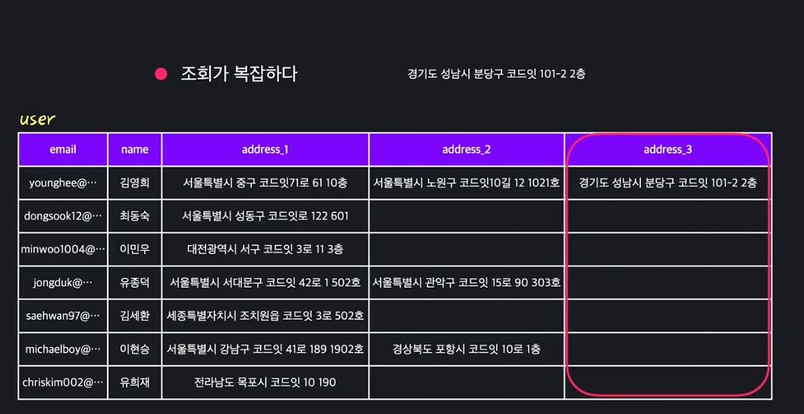
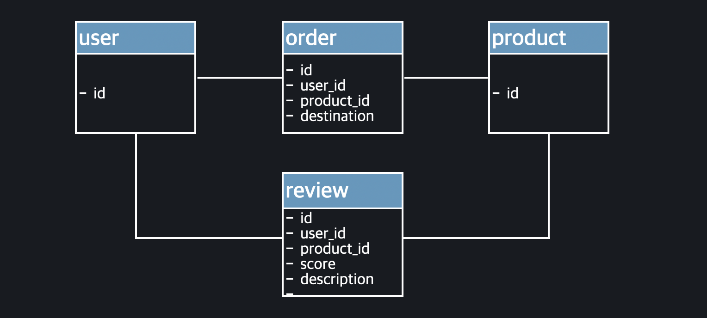
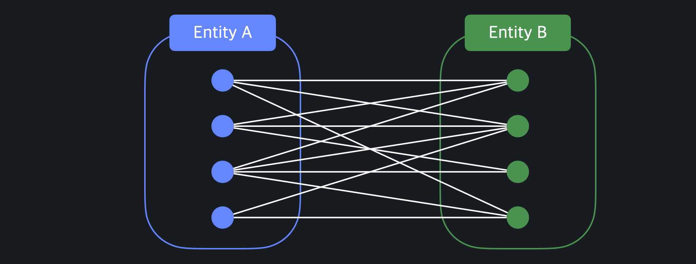

# 3. Data Modeling_1

- #### 데이터모델링

  데이터 입장에서는 데이터를 CRUD하기 전에, 전반적인 계획부터 해야 함. 

  아래같은 데이터베이스가 있다는 것은 이미 누군가가 데이터베이스를 만들고, 테이블을 만들고 구조를 짜 놓은 것. 

  똑같은 데이트베이스에도 그것을 저장하고 다루는 경우의 수는 수 없이 많음. 

  

  테이블 내부를 보더라도, 각 컬럼마다 타입, 제약조건 등이 정해져 있음. 

  

  위와 같은 결정들을 해 나가는 과정을 **데이터모델링** 이라고 부름. 

  데이터 모델링은 다시 크게 2가지로 나뉨. 

  첫번째는 테이블과 컬럼을 어떻게 나누고, 컬럼들 사이의 연결관계는 어떻게 되고 이와 같은 개념적인 구조를 정하는 것을 논리적 모델링 이라고 부름. 

  그리고, 개념적인 결정들을 바탕으로 실제 컴퓨터에 데이터베이스를 구축하기 위한 세부사항들, 예를 들어 컬럼의 이름/데이터 타입/제약 조건 등을 정하는 것을 물리적 모델링이라고 부름. 

  **이 두가지를 잘 해야, 성능좋고 미래에 쉽게 확장가능한 데이터베이스를 구축할 수 있음.**

   

  정답은 없지만 가이드라인은 있음. 

- #### 데이터 모델

  데이터 모델이란 데이터를 사용하려는 목적에 맞게 정리하고 체계화 해놓은 모형. 

  

  데이터 자체는 처음에 아무 형식도 없음. 

  **데이터 모델링**이라는게 이렇게 정리되지 않은 데이터를 인간이 이해할 수 있는 데이터로 만들어 내는 과정. 

  즉, ***데이터 모델을 만들어 내는 과정***

  

  일단 기본적으로 알아야 하는 개념이 있음. 

  1. **Entity(개체)**

     저장하고 싶은 데이터의 대상. 학생/수업/교수에 대한 정보를 저장하고 싶다면, 학생/수업/교수가 바로 Entity. 

     학생1명, 수업1개, 교수1명 이렇게 실제 대상 하나하나를 뜻함. 

     **학생 1명**이 아닌, **학생** 이렇게 일반화 해서 얘기할때는 ***Entity Type***이라고 함. 이건 Table전체를 의미함. 

     사실 다른 개념이긴 한데, 대부분 사람들이 Entity와 Entity Type을 그냥 섞어서 혼용해서 부름. 그래서 그냥 여기서도, Entity를 그냥 개체 하나와 종류 모두 섞어서 사용할 것. 

     

  2. **Attribute(속성)**

     Entity에 대해서 실제로 저장하려는 내용. 쉽게 말하자면 Table의 Column을 의미함. 

     학생 > 학번/이름/성별/입학년도/전공

     수업 > 시간/이름/과/지도교수 

     이런 데이터를 저장하려고 한다면, 이런 것 하나하나가 각각 Entity의 Attribute를 의미하게 되는 것. 

     

  3. **Relationship(관계)**

     우리가 저장하는 Entity들은 보통 다른 Entity들과 연결되어 있음. 

     학생은 수업을 듣고, 교수는 수업을 가르침. 이런 것들이 Entity들 사이의 관계

     

  4. **Constraint(제약조건)**

     Entity/Attribute/Relation에는 제약조건이라는 것이 있음. 

     예를 들어, 학번은 서로 겹치면 안된다던지, 모든 수업은 최소 1명의 규칙을 갖는다던지. 이런식으로 각각의 규칙들이 있음. 

     

  데이터 모델링의 목적은 저장하고자 하는 데이터에서 Entity, Attribute, Relationship, Constraint를 파악하고, 이것을 가지고 데이터베이스를 구축할 떄 기반이 될 모델을 만들어 내는 것. 

  

- #### Relational 모델

  데이터를 row/column으로 이루어진 테이블을 가지고 표현한 모델을 **Relational Model, 관계형 모델**이라고 부름.  

  

  **Relational Model에서의 Relation은 테이블들 사이에서 맺어지는 연결 관계를 의미하는 것이 아님.** 

  ***Relation은 Table을 나타내는 수학적인 표현일 뿐.*** 

  *하나의 테이블이 하나의 Relation으로 표현한 것. Relational Model은 데이터를 relation, 즉 테이블로 정리해서 표현한 모델.* 	

  

  그리고, 테이블들 사이에는 Foreign Key를 통해서 관계를 만들어 줄 수 있음. 이렇게 맺어지는 관계는 Relationship이라고 말하는 것. **헷갈림 주의** 

  

  

  Relational 모델은 그냥 데이터를 테이블단위로 정리해서, 표현한 모델을 의미하고, Foreign Key를 사용해서 이 테이블간의 관계를 만들 수 있다는 것을 알면 됨. 

  **그런데 몇점 단점은 있음.**

  1. Row가 있음. 

     데이터 구조를 정할때 우리는 Entity, Attribute, Relationship에 대해 알고 싶은 것. row는 개별 데이터 하나하나를 의미함. 로우는 데이터를 실제로 저장할때는 없어서는 안되지만, **데이터의 구조를 정할때는 별로 의미가 없음.** row가 하나도 없어도 큰 문제가 없음. 

     

  2. Table들 사이의 관계를 한눈에 알 수가 없음. 

     테이블들의 관계라면 Foreign Key를 말하는 것. FK를 저장하고 있는 테이블을 Child Table, Foreign Key를 통해 참조되는 테이블을 **Parent Table**이라고 하는데

     관계를 알아보려면 Child Table에서 FK를 찾고 이걸로 다른 테이블 확인하고 해야함. 관계의 특징 이런거 알아내는데 한계가 있음. 

     

  **그래서 우리가 데이터 자체를 나타낼 때, Relational Model을 많이 사용하기는 하지만, 모델링을 할 때는 구조를 한눈에 파악할 수 있는 다른 모델을 같이 사용함.** 

- #### Entity-Relationship(ERM) 모델

  개체와 관계를 중심으로 모델링 하는 것. 

  하나의 Entity를 그냥 네모로 표현하고, 이름을 써줌. 그리고, 그 네모 안에 해당 Entity에 대해서 우리가 사용할 Attribute들을 써준다. 

  그리고 Entity사이의 관계를 선으로 표현. 그 선 위에 이 관계가 어떤 관계인지를 써준다. 

  예를 들어, 유저가 상품에 대해 리뷰를 쓰는 거라면, 그 위에 **gives**라고 표기.

  더 나가서,  선의 양끝에 Entity사이의 관계를 더 많이 표현. 

  

  다양한 선 끝이 가능함. 

  **이 기호들이 각각 관계들의 특성을 설명하는 것. 각 관계의 특징에 따라서 모델링의 방법 자체가 변하기 때문에 이 특징을 아는 것이 매우 중요함. **

   

  ERM을 만들어 놓으면 그걸 가지고, 그대로 Relational 모델로 바꿀 수 있음. 매우 간단함. 

- #### 데이터 모델 스팩트럼

  데이터모델은 얼마나 자세하게 설명됬냐에 따라 3종류로 구분됨. 

  가장 추상적인 모델은 개념모델 **Conceptual Model** 

  개념모델은 주로, 큼지막한 Entity와 간단한 관계를 표현함. Attribute는 파악하지 않고 대략적인 구조를 파악할 때 사용. 

  

  그 다음 조금 더 구체적인 논리모델 **Logical Model**

  여기서는 Entity뿐만이 아니라 Attribute들까지 표현. 그리고 이 중에서 PK, FK가 무엇인지까지 표시. 

  

  마지막으로 가장 구체적인 물리모델 **Physical Model**

  실제로 이 모델을 가지고 DB구축 가능할 정도로 자세한 정보가 담김. 

  

  

- #### 데이터 모델 정리

  **데이터 모델**

  **데이터 모델**이란, 다양한 데이터 요소들을 이해하고 사용하기 편한 형태로 정리해놓은 모형을 의미합니다.

  1. 우리가 데이터를 저장하려고 하는 대상: **Entity**(개체)
  2. Entity에 대해서 저장하려고 하는 특징: **Attribute**(속성)
  3. Entity들 사이 생기는 연결점: **Relationship**(관계)
  4. 여러 데이터 요소들에 있는 규칙: **Constraint**(제약 조건)

  이 네 가지 요소들을 파악한 후, 이 내용들을 발전시켜 데이터 모델들을 만드는 과정을 **데이터 모델링**이라고 부릅니다.

  **릴레이셔널 모델**

  우리에게 가장 익숙하고 가장 널리 사용되는 모델은 **릴레이셔널 모델**입니다. 릴레이션은 데이터를 로우와 컬럼으로 정리한 테이블, 또는 표를 의미하는데요. Entity는 **테이블**, attribute은 **컬럼**, relationship은 foreign key를 사용해서 정리해놓은 모형입니다.

  이렇게요.

  

  릴레이셔널 모델을 모델링한다는 건, 정확히 어떤 테이블을 만들고, 이 테이블들을 또 어떤 컬럼들로 나누고, foreign key를 어떻게 만들지를 정해나가는 겁니다.

  **ERM**

  릴레이셔널 모델이 실제로 사용하기에는 굉장히 편리하긴 한데요. 모델링을 할 때는 로우에 대해서 신경을 쓰지 않기 때문에 데이터를 조금 다른 형태로 표현하는 모델을 같이 사용합니다. 바로 Entity-Relationship 모델, 줄여서 ERM이라는 모델입니다.

  ERM에서는 Entity를 하나의 네모로, attribute을 네모 안에 문자열로, 그리고 relationship을 선으로 표현합니다. 그리고 나중에 배우겠지만 이 선들의 끝을 어떻게 표현하는지에 따라 관계의 특징을 표현할 수 있습니다.

  위에서 봤던 릴레이셔널 모델을 똑같이 ERM으로는 이렇게 나타낼 수 있습니다. 

  ERM에서는 로우를 매번 표현해주지 않아도 되고, 선과 선의 끝점들을 통해서 Entity들 사이 관계를 조금 더 자세하게 표현할 수 있습니다. 정확히 어떤 내용을 저장할 수 있는지는 다음 챕터에서 자세하게 알아보겠습니다.

  ##### **데이터 모델 스펙트럼**

  데이터 모델은 얼마나 자세하게 표현됐는지에 따라 세 가지로 분류됩니다.

  **개념 모델**

  가장 추상적인 내용을 담고 있는 모델을 개념 모델이라고 부릅니다. 대략적으로 Entity들과 Entity들 사이에 있는 관계 정도만 표현합니다.

  

  **논리 모델**

  그 다음에는 논리 모델이 있습니다. 개념 모델보다는 조금 더 자세한 내용을 담고 있는데요. Entity들이 갖는 Attribute들과 primary key, Entity들 사이 관계를 표현해줄 foreign key, 이런 내용까지 표현합니다.

  

  **물리 모델**

  마지막으로는 물리 모델이 있습니다. 물리 모델은 실제로 데이터베이스를 구축할 때 필요한 내용에 최대한 가까운 내용을 담고 있는 모델입니다. 각 컬럼의 데이터 타입, 요소들의 이름, 나중에 배울 인덱스라는 걸 어디에 만들어줄 건지...이런 내용까지 표현하죠.

  

  **어떤 모델을 사용해야 될까?**

  각 모델들은 각각의 장단점들이 있는데요. 자신이 현재 하고 있는 작업에 적합한 모델을 만들어나가면 됩니다.

  예를 들어 경영진이 새로운 기능을 추가하려고 사용할 데이터를 파악 및 정리할 때는 개념 모델을 써도 충분하고, 이 내용을 개발자나 데이터베이스 관리자가 구체화 시킬 때는 논리 모델을 사용하고, 마지막에 이걸 실제로 데이터베이스에 저장할 때는 물리 모델을 만들어서 내용을 그대로 반영할 수 있는 거죠.

- #### 좋은 데이터베이스

  

  **같은 데이터를 저장하고 있어도, 데이터모델링을 어떻게 했느냐에 따라 데이터베이스가 좋을 수도 있고, 나쁠 수도 있다.** 

  하나의 예시를 통해 봐보자. 

  한 유저가 여러 배달 주소를 가지고 있는 상황. 지금은 구조 자체가 주소를 나타내는 컬럼이 하나밖에 없어서, 하나를 추가할때마다, 유저테이블의 남은 컬럼도 계속 복사되면서 row를 중복해서 추가해야 함. 

  

  여기서 만약에 김영희 이름 바꾸고 싶으면? 

  저거를 싹다 바꿔야 함. 세 로우를 모두 업데이트 해야 함. 그리고 혹시라도 바꾸다가 하나라도 빼먹으면? 그럼 또 데이터가 이상해 지는 것. 

  데이터를 이런식으로 모델링하면, 한번만 하면 되는 연산을 여러번 해서 불필요하게 느려지면서 동시에 데이터의 정확성도 보장하기가 어려워짐. 

  *그럼 만약, 새로운 주소를 추가할때마다 Row가 아닌 Column을 늘리면?*

  중복되는 값은 사라졌는데, 주소가 무한히 늘어나면, 또 애매해짐. 한명이 주소를 늘리면 테이블의 구조 자체가 바뀌어버림. 그리고 이런식으로 계속 늘리면 컬럼 수만큼 주소 가지고 있지 않은 사람은 NULL값만 계속 늘어남. 

  

  ***그럼 만약 이 테이블을 두개의 테이블로 나눠서 표현하면?***

  

  **이래서 모델링이 엄청 중요한 것.** 

## 논리적 모델링

- #### 비지니스 룰

  모델링의 시작은 저장하고 싶은 Entity, Attribute, Relationship 파악으로 부터 시작한다. 

  **해당 사업의 규칙(비지니스 룰)으로 정리해야 함.**

  단지 사업 뿐만이 아니라 특정 조직이 운영되기 위해 따라야 하는 정책, 절차 원칙들에 대한 간단명료한 설명을 의미함. 

  

  

  예를 들어 쿠팡의 비지니스 룰은?

  

  **각 비지니스 룰은, 이 서비스를 설계한 사람들이 정한 규칙**

  그냥 웹사이트 라고 생각하면, 이 웹페이지에서 제공하는 모든 기능에 대한 규칙을 의미함. 

  사업 자체의 핵심 로직이기 때문에 이 비지니스 룰에 대해서 명확히 이해하는 것이 매우 중요함. 

  이것을 이해하고 이 내용들을 바탕으로 사용할 **Attribute, Entity, Relationship**을 정해 가는 것. 

- #### Entity, Attribute, Relationship

  비지니스 룰을 가지고, E, A, R을 어떻게 찾을까?

  가장 기본적인 원칙을 봐보자. 

  

  지난 번에 했던 첫번째 비지니스 룰을 보자면, 

  명사는 유저/상품, 동사는 주문이 있음. 

  

  그럼 일단 User와 Product라는 Entity, 그리고 order라는 Relationship을 찾은 것. 

  

  그 다음줄도 하나씩 봐보면, 

  

  

  

  

  

  **Business Rule이 구체적이지 않거나 누락되면 문제가 생기겠지.** 그래서

  

  이제 여기에서, Id나 foreign_key같은 거는 개발자가 알아서 추가 해 줘야함. 

  

  다만, 이렇게 만들어도 초안일 뿐, 최종본은 아님. 

  왜냐면 예를 들어 email이 있으면, 이것도 어떨때는 Entity가 될 수도 있고, Attribute로 만들어 질 수도 있겠지. 이게 상황마다 달라. 

  즉, Attribute/Relationship들의 특성, 그리고 정해진 약속들에 따라서 모델링이 바뀔 수 있음. 

  

- #### 여러 값을 갖는 Attribute

  이번에는 지난번에 했던 3가지 원칙 중 마지막 원칙에 대한 예외적인 경우를 살펴보자. 

  

  세 번째 규칙의 예외는 값으로 표현할 수 있는 명사일 지라도, Attribute가 아니라, Entity로 만드는 경우가 있음. 

  그 경우는 바로, Entity안에 똑같은 종류의 여러 Attribute를 저장해야 하는 경우. 

  예를 들어 한 유저가 여러 개의 주소를 가질 수 있는 경우

  

  한 유저가 여러개의 주소를 가질 수 있는 경우, 테이블로 아래와 같이 나타내야 함. 

  

  그럼 유저마다 address갯수가 다 다름. 

  1. Null 이 너무 많이 생기게 됨. 

     

  2. 컬럼을 몇개를 만들어야 하는지가 애매함. 유저가 컬럼 무한대로 가진다면, 무한대개로 필요한가? 그 유저가 주소 추가하면 테이블의 구조 자체가 변해야 함. 

     

  3. 조회가 복잡함. 특정 주소를 검색하려면, 모든 Column의 모든 row를 다 훑어야 함. 조회가 비효율적이고 지저분함. 

     

  

  이런 이유들 때문에, 이런 경우 주소는 하나의 값으로 표현되는 경우 일 지라도, 하나의 Entity로 빼는게 자연스러움. 

  아래 처럼 해놓고, Foreign Key, user_id를 만드는 것이 자연스럽지. 

  

  이걸 ERM으로 나타내자면, 기존의 하나의 Entity를 두개로 나누고, 그 사이에 선을 추가한 꼴. 

  

- #### 모델링 기본기 정리

  **비즈니스 룰**

  비즈니스 룰은 "특정 조직이 운영되기 위해 따라야 하는 정책, 절차, 원칙에 대한 간단 명료한 설명"입니다.

  예를 들어 온라인 쇼핑몰 코팡의 비즈니스 룰에 대해서 생각해볼게요. 코팡 사이트를 운영할 때 아래와 같은 정책들을 정해볼 수 있을 겁니다.

  - 유저는 상품을 주문할 수 있다. 하나의 주문에는 최대 10개의 상품까지만 가능하다.
  - 동일한 주문 내역은 한 번의 배달로, 3일안에 유저가 지정한 배송지에 전달돼야 한다. 만약 그렇지 못할 시 유저에게 최대한 빨리 알려줘야 한다.
  - 유저는 상품에 대한 평가를 줄 수 있다. 평가는 두 종류의 데이터: 1~5 사이 자연수의 별점, 그리고 유저에게 받은 200자 이내 줄 글을 통해 할 수 있다.

  훨씬 더 많은 비즈니스 룰이 있겠지만, 일단은 여기까지만 볼게요.

  비지니스 룰은 데이터 모델링의 핵심 기반이 되기 때문에, 비즈니스 룰을 만드는 기획자는 최대한 간단명료하게 만드는 게, 개발자는 만들어진 비지니스 룰을 정확하게 이해하는 게 중요합니다.

  **Entity, Relationship, Attribute 후보 찾기**

  비지니스 룰이 있을 때, Entity, Attribute, Relationship을 찾는 가장 기본적인 원칙에 대해서 알아보겠습니다.

  1. 모든 명사는 Entity 후보입니다.
  2. 모든 동사는 Relationship 후보입니다.
  3. 하나의 "값"으로 표현할 수 있는 명사는 attribute의 후보입니다.

  이 세 가지 기본 원칙을 사용해서 비즈니스 룰에서 ERM **초안**을 만들어냅니다. 위에서 본 비즈니스 룰이 있다면, 이렇게 ERM을 만들 수 있습니다.

  

  **Attribute 후보 찾기 예외 경우**

  위에서 배운 세 가지 기본 원칙은 절대적인 건 아니고요. 모델링을 하기 위한 시작점입니다. 다른 내용으로 넘어가기 전에 먼저 중요한 예외 경우에 대해서 알아보겠습니다.

  바로 세 번째 원칙인 "하나의 값으로 표현할 수 있는 명사는 attribute 후보입니다"의 예외 경우인데요. 하나의 값으로 표현할 수 있더라도, 하나의 entity가 여러 개의 값을 가져야 하는 경우입니다. 테이블로 표현하면 이런 경우죠.

  

  한 유저가 여러 개의 주소를 가질 수 있기 때문에 주소에 해당하는 컬럼 또는 attribute이 여러 개로 나눠졌습니다.

  이렇게 모델링하게 되면,

  1. NULL이 많이 생길 수 있게 된다
  2. 컬럼을 몇 개를 만들어야 되는지 애매해진다
  3. 조회가 비효율적이게 된다

  라는 문제점들이 있습니다. 그렇기 때문에 이런 경우 이렇게:

  

  주소를 컬럼이 아니라, 새로운 테이블(Entity)로 만듭니다. 이렇게 하면 방금 본 세 가지의 문제점이 생기지 않으며, 깔끔하게 모델링을 할 수 있게 됩니다.

- #### 카디널리티

  

  - **일대일**

    하나의 A에 대해서 B도 하나밖에 없고, 반대로 하나의 B에 대해서도 A가 하나밖에 없다는 뜻. 

    이거 설명할때, 제일 많이 사용하는 것이 법적 부부관계. 

    혹은 주민등록번호. 시민 1명은 1개의 주민등록번호만 부여받음. 

    

  - **일대다** 

    **한개의 A가 여러개의 B를 가질 수 있는 관계를 의미함(생각보다 헷갈리기 쉬움).** 

    하나의 A에 대해서는 여러개의 B가 있을 수 있고, 하나의 B에 대해서는 하나의 A만 있을 수 있는 것. 

    

    예를 들어 한 유저는 여러개의 리뷰를 달 수 있지만, 한 리뷰는 무조건 한명이 쓴 것. 

    

  - **다대다**

    하나의 A에 대해서 여러개의 B가 있을 수 있고, 반대로 하나의 B에 대해서도 여러개의 A가 있을 수 있다는 것. 

    예를들어 찜하기 기능. 하나의 유저는 여러개 상품에 찜을 할 수 있고, 하나의 상품도 여러개의 사람이 찜을 했을 수 있음. 

    

    혹은 학생과 수업의 관계. 하나의 학생은 여러개의 수업 들을 수 있고, 하나의 수업도 여러명의 학생이 들을 수 있음. 

  카디널리티는 비지니스 로직과 룰에 따라 다르지. 넷플릭스는 하나의 유저가 여러개의 프로필 가능하고, 페이스북은 하나의 프로필이 가능함. 

  **고로 비지니스룰을 정확히 파악하고, 이것을 바탕으로 카디널리티를 파악해야 함.** 

- #### 카디널리티 ERM에서 표현하기

  카디널리티 ERM에서 표현하기. Crow's Foot 표현법

  **ERM에서 Relationship은 선으로 표현하고, 카디널리티는 선 끝에 특정 표시를 해서 표현함.** 

  한 Entity는 1 혹은 다. 

  

  즉 두 관계가 일대일이면,

  

  

  

  지금 한 내용은 **한 개의 Entity가 다른 Entity와 최대 몇가가지 연결될 수 있는지에 대한 내용.** 

  그런데, 각 Entity마다 최소 몇개 까지 연결될 수 있는지도 중요함. 

  

  예를 들어 유저가 하나의 리뷰도 안남겼으면, 유저는 하나의 리뷰도 안 연결되있어도 되는데, 리뷰가 존재하면 항상 어떤 유저가 연결되어 있어야 함. 

  이렇게 특정 관계에서 연결된 Entity가 하나도 없어도 되는데, 아니면 최소한 하나는 연결되어 있어야 하는지의 특성도 나타낼 수 있음. 

  

  최소 연결될 수 있는 숫자는, 최대 연결될 수 있는 숫자보다 선 안쪽에 표현함. 

  

  리뷰와 유저의 관계를 생각해보면 아래처럼 되겠지. 

  

  그럼 최대 카디널리티랑 합쳐서 보면? 아래처럼 표현되는 것. 

  

  이 해석이 어려움. 

  **해석할때는 반대편을 보면 됨.** 

   User는 최소 0개, 최대 N개의 리뷰를 가질 수 있다는 뜻. 

  Review는 최소 1개의 리뷰를 가지게 되고, 최대 1개는 가져야 한다는 것. 

  

  

  모든 경우의수 고려해보면, 4개 중에 하나가 됨. 

  

  이걸 사용해서, ERM의 카디널리티까지 표현하면, 

  

- #### 카디널리티와 ERM 정리

  **카디널리티**

  카디널리티는 두 entity type 사이 관계에서 한 종류의 entity가 다른 종류의 entity 몇 개에 대해서 관계를 맺을 수 있는지를 나타내는 개념입니다. 아래에서 배울 내용들에서는 두 Entity Type, A와 B가 이렇게 있다고 가정하겠습니다.

  **1:1 관계**

  첫 번째 관계는 1:1 (일대일) 관계입니다. 일대일 관계는 A entity 하나가 B entity 하나에만 연결될 수 있고, 마찬가지로 B entity 하나도 A entity 하나에만 연결될 수 있는 관계를 의미합니다. 이렇게요.

  

  1:1 관계로는 법적 부부 관계, 시민과 주민등록증 관계가 있습니다.

  **1:N 관계**

  두 번째 관계는 1:N (일대다) 관계입니다. 일대다 관계는 A entity 하나가 B entity 여러 개에 연결될 수 있고, 반대로 B entity는 A entity 하나에만 연결될 수 있는 관계를 의미합니다. 이렇게요.

  

  1:N 관계로는 쇼핑몰 사이트에서 유저와 평가의 관계, 선생님과 수업의 관계가 있습니다.

  **M:N 관계**

  세 번째 관계는 M:N (다대다) 관계입니다. 다대다 관계는 A entity 하나가 B entity 여러 개에 연결될 수 있고, 마찬가지로 B entity 하나도 A entity 여러 개에 연결될 수 있는 관계를 의미합니다. 이렇게요.

  

  M:N 관계로 대표적으로는 유저와 상품 사이 찜하기 관계, 학생과 수업의 수강 관계가 있습니다.

  **최소 카디널리티**

  1:1, 1:N, M:N 관계는 각각 한 entity가 다른 entity에 대해서 **최대** 몇 개가 연결될 수 있는지를 표현한 겁니다.

  하지만, 특정 관계에서 각 entity가 하나도 없어도 되는지, 아니면 최소한 하나가 있어야 하는지를 나타내는 **최소** 카디널리티도 중요한 내용인데요.

  예를 들어 유저와 평가 entity가 있다고 할게요.

  유저가 아무 평가를 남기지 않았으면 한 유저에 대해서 하나의 평가가 없어도 되잖아요? 반면, 평가는 꼭 하나의 유저가 있어야만 합니다. 이런 내용이 최소 카디널리티입니다.

  **카디널리티 정하기**

  카디널리티는 '어떤' entity를 사용하는 지보다, entity를 '어떻게' 사용하고 싶은지에 따라 결정됩니다. 그리고 해당 회사의 비즈니스 룰을 사용해서 알아내죠.

  예를 들어서 유저와 프로필 entity가 있다고 할게요. 그럼 이때 단순히 유저와 프로필이라는 entity만 가지고는 둘 사이에 어떤 카디널리티가 있어야 되는지 판단할 수 없습니다.

  페이스북을 생각해보면 유저는 항상 **하나**의 프로필만을 갖습니다. 페이스북과 같이 프로필을 구현하고 싶으면 유저와 프로필 사이에는 1:1 관계가 있는 겁니다.

  반면 넷플릭스는 한 유저가 여러 개의 프로필을 가질 수 있습니다. 하나의 프로필마다 설정과 시청 히스토리가 따로 저장되고, 추천되는 콘텐츠도 다릅니다. 넷플릭스에서는 유저와 프로필은 1:N 관계가 있다고 할 수 있습니다.

  페이스북이나 넷플릭스가 아니라 또 다른 서비스에서는 여러 유저가 여러 개의 프로필을 가질 수 있게하는 기능을 사용하고 싶을 수도 있습니다. 이런 경우에는 M:N 관계가 있는 거죠.

  비즈니스 룰을 **정확하게** 파악한 후 이걸 바탕으로 카디널리티를 찾아낼 수 있습니다.

  **카디널리티 ERM에서 표현하기**

  ERM의 장점 중 하나는 entity들 사이의 카디널리티를 표현할 수 있다는 점입니다.

  관계에서 "일"에 해당하는 entity 쪽에는 1의 의미로 수직선을 사용해서 표현하고요. "다"에 해당하는 entity 쪽에는  여러 개라는 의미로 선 세 개를 사용해서 표현합니다.

  

  각각 1:1, 1:N, M:N 관계를 이렇게 표현할 수 있죠.

  

  최소 카디널리티는 최대 카디널리티보다 선 안 쪽에 표시합니다. 한 관계에서 한 개도 없어도 되는 Entity면, 0을 의미하는 동그라미를, 적어도 한 개가 꼭 있어야만 하는 Entity면 1을 의미하는 수직선을 사용합니다.

  

  위에서 배운 내용들을 정리하면, 이런 식으로 ERM에서 카디널리티를 표현할 수 있습니다.

  

  각 기호가 뭘 의미하는지만 알면, 다양한 관계들에 대해서 훨씬 더 자세하게 파악할 수 있죠?

  **ERD**

  이렇게 해서 표현한 ERM을 가끔씩 Entity Relationship Diagram, 줄여서 ERD라고 표현하기도 하는데요. 저희는 그냥 항상 ERM이라는 표현을 사용하도록 하겠습니다.

- #### 일대일, 일대다 관계 모델링

  일단 일대일 관계가 있을때는, 두 Entity중 하나, 혹은 두 Entity모두에 Foreign Key를 추가해서 모델링 할 수 있음. 

  아래처럼 연결해 주면 되는 것. 

  

  카드가 없어도 되면, 어떤 유저의 card_id는 null이 됨. NULL은 최대한 피해야 하기 때문에(FK에서도), 카드가 없어도 되면, foreign key를 유저에 넣지 않음. 반면, 카드는 무조건 카드 주인이 있기 때문에, card에 fk를 넣으면 됨. null이 있을 수가 없으니깐 애초에. 

  **즉, NULL이 나올 것이 확실하거나 가능성이 높은 곳 보다는, 그 반대편에 주로 넣게 됨.** 

  

  위 상황을 ERM으로 표현하면, 아래와 같음. *Foreign Key는 빨간색 동그라미를 치는 것 같음.* 

  

  일대다인 경우를 생각해보자. 

  이 경우는 오히려 쉬움. 관계에서 **다**에 해당되는 Entity에 Foreign Key를 추가하면 됨. 

  이게 이렇게 밖에 할 수가 없는게, user가 추가됬는지 아직 리뷰 안썼으면? 그럼 애초에 추가가 안되잖아. user에 foreign_key를 추가하는게 말이 안되지. review의 user_id에 추가 해야지 당연히. 

  

  

  **ERM에서 표현하며 다음과 같다.**

   

- #### 다대다 관계 모델링, M:N

  찜하기로 예를 들어 보자. 한 유저는 여러개의 상품을 찜할 수 있고, 한 상품도 여러명의 user가 찜할 수 있음. 

  

  테이블을 사용해서 저장해보자. 애초에 테이블로 어떻게 저장할지에 달려있겠지. 

  일단 같은 attribute를 여러 컬럼으로 만드는 것 자체가 안좋은 모델링. 

  

  근데 이거는 product테이블을 바꿔도 마찬가지

  

  **즉 다대다 관계에서는 이미 있는 두개의 table만 사용해서는 애초에 자연스러운 표현 자체가 불가능함.**

   

  이걸 해결하기 위해 연결테이블을 사용함. **관계를 저장하기 위한 테이블**

  테이블을 새로 만들고, 이 관계 하나 하나를 저장하는 것. 

  

  

  아래가 연결테이블 예시

  

  이 연결 테이블은 user/product 테이블 둘다와 일대 다 관계가 있음. 

  

  

  앞에서 배울때, 명사를 entity로 만든다고 했었는데, 다대다 관계에서는 **찜하다**라는 동사도 Entity가 된다는 점을 기억할 것. 

  

- #### 관계 모델링 정리

  **1:1 관계 모델링**

  두 Entity 사이에 1:1 관계가 있을 때는 둘 중 하나, 또는 둘 다에 foreign key를 추가해서 모델링할 수 있습니다.

  예를 들어 코팡에서 한 명의 유저는 하나의 결제용 카드만 등록할 수 있다고 할게요.

  

  각각 user와 card entity가 있는데요. 이때는 foreign key를 추가해서 연결 관계를 표현하면 됩니다. card entity에 user id를 넣는 거죠.

  테이블로 표현하면 이렇게 됩니다.

  

  card 테이블에 있는 user id를 사용해서 특정 카드가 어떤 유저 것인지를 알아낼 수 있고, user 테이블의 id를 사용해서 특정 유저의 카드 로우도 찾아낼 수 있습니다.

  여기서 user가 항상 card가 있어야만 할 때는 user 테이블에 foreign key를 넣어도 되지만, 만약 card가 있어도 되고 없어도 되면 card 테이블에 넣습니다.

  

  card가 없어도 되면, 어떤 user 로우들은 card_id가 NULL이 되는데요. NULL은 항상 최대한 피해야 되기 때문에 foreign key를 user에 넣지 않습니다. 근데 애초에 그게 아니여도, 유저가 카드 없어도 되는 경우에 유저로 등록했는데, 카드에 있는 user_id에 없으면 등록이 안되잖아(보통 오류 나게 설정되어 있음, 당연한거지). 

  반면, 지금 같은 경우 card는 무조건 user, 즉 주인 유져가 있어야 하기 때문에, 여기에 foreign key를 넣으면 NULL이 생기는 걸 방지할 수 있습니다.

  ERM에서 표현하면 이렇게 할 수 있겠죠?

  

  **1:N 관계 모델링**

  그 다음에는 두 Entity들 사이에 1:N 관계가 있는 경우를 생각해보겠습니다.

  user와 review Entity 사이관계를 생각해보겠습니다. 한 유저는 여러 개의 평가들을 가질 수 있지만, 하나의 평가은 하나의 유저만 가질 수 있습니다.

  

  Entity와 Entity 사이에 1:N 관계가 있을 때는 항상 다, 즉 관계에서 다수 쪽에 해당하는 entity에 foreign key를 만들어줍니다. 그러니까 review entity에 어떤 user의 review인지를 알 수 있는 user id attribute을 추가하는 거죠.

  

  이렇게 하면 어떤 review 로우가 있어도, 어떤 유저의 평가인지를 찾아낼 수 있고, 반대로 user 로우가 있을 때, id를 사용해서 user가 준 모든 review 로우들을 찾아낼 수 있습니다.

  1:N 관계에서 **다수**인 review가 아니라 **일**에 해당하는 user에 foreign key를 넣으면 어떻게 될까요?

  

  이때는 유저는 여러 개의 review를 가질 수 있기 때문에, review 컬럼을 엄청나게 많이 늘려야 되는 경우가 발생합니다. 같은 attribute인데 여러 컬럼이 있는 건 안 좋다고 전에 얘기했잖아요? 그렇기 때문에 1:N 관계를 모델링할 때는 항상 다수에 해당하는 entity 또는 테이블에 foreign key를 저장합니다.

  ERM에서 표현하면 이렇게 할 수 있습니다.

  

  **M:N 관계 모델링**

  M:N 관계는 두 entity 또는 테이블만 사용해서 자연스럽게 표현할 수 없습니다. 그렇기 때문에 관계를 저장하기 위한 테이블인 연결 테이블 (junction table)이란 걸 사용합니다.

  코팡의 유저는 여러 개의 상품을 찜하기 할 수 있고, 상품도 여러 유저에게 찜받을 수 있다고 할게요.

  

  유저와 상품 entity 또는 테이블이 있고요. 그 사이에는 이 둘 사이의 관계를 저장하기 위한 연결 테이블인 favorite 테이블을 만들어줍니다.

  

  관계를 어떻게 저장할 수 있을까요? 전에 했던 것과 똑같이 foreign key를 사용해서입니다. 유저를 특정 지을 수 있는 user_id, 그리고 하나는 상품을 특정지을 product_id를 저장합니다.

  이렇게 하면 유저와 상품 테이블은 그대로 유지하되, 둘 사이에 생기는 모든 관계를 저장하고 찾을 수 있습니다.

  유저 4가 찜한 모든 상품을 알고 싶으면, 연결 테이블에서 user_id foreign key가 4인 데이터를 찾아서, 찜한 product_id들을 구할 수 있고요. 반대로 상품 2에 대해서 찜하기를 한 모든 유저를 찾고 싶으면, 연결 table에서 product_id가 2인 데이터를 찾아서 찜한 user를 찾을 수 있습니다.

  연결 테이블은 유저 테이블과도 1:N 관계가 있고, 상품 테이블과도 1:N 관계가 있잖아요? 이런 식으로 M:N 관계에 있는 데이터는 **두 개의 1:N 관계**를 만들어서 모델링 할 수 있습니다.

  

  이전에 비지니스 룰을 기반으로 Entity, Attribute, Relationship을 정할 때 Entity는 보통 명사로 만든다고 했었죠? 하지만 M:N 관계에서는 찜하다라는 **동사**로도 만들 수 있기 때문에 카디널리티를 제대로 파악하는 게 중요합니다.

- #### ERM 활용

  ERM은 데이터베이스 구조를 **만들어낼** 때 뿐만 아니라, 이미 사용하고 있는 데이터베이스를 **파악하는데** 사용할 수 있습니다.

  예를 들어 지금은 굉장히 단순하긴 하지만, 이렇게 코팡 데이터베이스를 ERM을 사용해서 표현했다고 할게요.

  

  이 ERM만 있으면, 쿠팡이라는 조직이 어떤 데이터를 저장하고, 이 데이터가 어떤 흐름에 의해서 움직이는지를 파악할 수 있습니다. 그리고 데이터의 흐름을 통해 쿠팡이라는 사이트를 직접적으로 사용하지 않고도, 코팡의 기능들을 손쉽게 파악할 수 있죠. 유저는 수많은 리뷰를 가질 수 있고, 상품도 여러 개의 리뷰를 가질 수 있잖아요? 그럼 사이트 안에서는 유저가 상품에 대한 리뷰를 남길 수 있다는 걸 알 수 있고요. 마찬가지로, 위 내용을 발전시켜 조금 더 완성도 높은 데이터 모델을 만들어내면, 그것을 보는 거만으로도 찜하기 등의 Entity와 관계들을 통해서 회사에 대한 전반적인 내용을 알 수 있습니다. 그러니까 business rule과 기능을 사용해서 ERM을 만들어냈던 거처럼 반대로 ERM을 business rule을 역으로 파악할 수도 있죠.

  확실히 이런 식으로 그냥 데이터를 수많은 테이블들로 표현한 거보다는 데이터베이스에 저장된 내용들에 대해서 훨씬 더 직관적이게 파악할 수 있죠?

  그렇기 때문에, 데이터베이스를 새롭게 만들거나 수정할 때 뿐만 아니라, 데이터베이스를 누군가한테 설명하거나, 아니면 스스로 조직이 활용하는 데이터에 대해서 파악하고 싶을 때도 ERM을 만들어서 활용할 수 있습니다.

#### 

