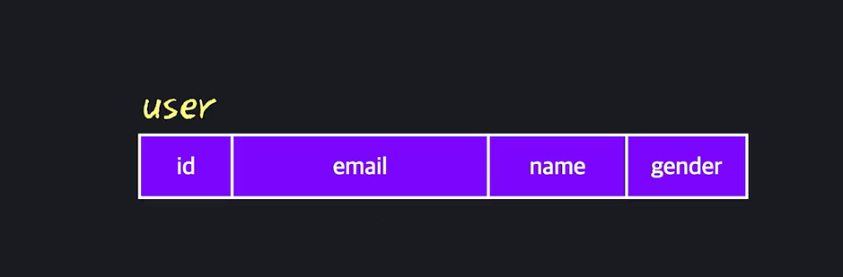

# 3. Data Modeling_1

- #### 데이터모델링

  데이터 입장에서는 데이터를 CRUD하기 전에, 전반적인 계획부터 해야 함. 

  아래같은 데이터베이스가 있다는 것은 이미 누군가가 데이터베이스를 만들고, 테이블을 만들고 구조를 짜 놓은 것. 

  똑같은 데이트베이스에도 그것을 저장하고 다루는 경우의 수는 수 없이 많음. 

  

  테이블 내부를 보더라도, 각 컬럼마다 타입, 제약조건 등이 정해져 있음. 

  

  위와 같은 결정들을 해 나가는 과정을 **데이터모델링** 이라고 부름. 

  데이터 모델링은 다시 크게 2가지로 나뉨. 

  첫번째는 테이블과 컬럼을 어떻게 나누고, 컬럼들 사이의 연결관계는 어떻게 되고 이와 같은 개념적인 구조를 정하는 것을 논리적 모델링 이라고 부름. 

  그리고, 개념적인 결정들을 바탕으로 실제 컴퓨터에 데이터베이스를 구축하기 위한 세부사항들, 예를 들어 컬럼의 이름/데이터 타입/제약 조건 등을 정하는 것을 물리적 모델링이라고 부름. 

  **이 두가지를 잘 해야, 성능좋고 미래에 쉽게 확장가능한 데이터베이스를 구축할 수 있음.**

   

  정답은 없지만 가이드라인은 있음. 

- #### 데이터 모델

  데이터 모델이란 데이터를 사용하려는 목적에 맞게 정리하고 체계화 해놓은 모형. 

  

  데이터 자체는 처음에 아무 형식도 없음. 

  **데이터 모델링**이라는게 이렇게 정리되지 않은 데이터를 인간이 이해할 수 있는 데이터로 만들어 내는 과정. 

  즉, ***데이터 모델을 만들어 내는 과정***

  

  일단 기본적으로 알아야 하는 개념이 있음. 

  1. **Entity(개체)**

     저장하고 싶은 데이터의 대상. 학생/수업/교수에 대한 정보를 저장하고 싶다면, 학생/수업/교수가 바로 Entity. 

     학생1명, 수업1개, 교수1명 이렇게 실제 대상 하나하나를 뜻함. 

     **학생 1명**이 아닌, **학생** 이렇게 일반화 해서 얘기할때는 ***Entity Type***이라고 함. 이건 Table전체를 의미함. 

     사실 다른 개념이긴 한데, 대부분 사람들이 Entity와 Entity Type을 그냥 섞어서 혼용해서 부름. 그래서 그냥 여기서도, Entity를 그냥 개체 하나와 종류 모두 섞어서 사용할 것. 

     

  2. **Attribute(속성)**

     Entity에 대해서 실제로 저장하려는 내용. 쉽게 말하자면 Table의 Column을 의미함. 

     학생 > 학번/이름/성별/입학년도/전공

     수업 > 시간/이름/과/지도교수 

     이런 데이터를 저장하려고 한다면, 이런 것 하나하나가 각각 Entity의 Attribute를 의미하게 되는 것. 

     

  3. **Relationship(관계)**

     우리가 저장하는 Entity들은 보통 다른 Entity들과 연결되어 있음. 

     학생은 수업을 듣고, 교수는 수업을 가르침. 이런 것들이 Entity들 사이의 관계

     

  4. **Constraint(제약조건)**

     Entity/Attribute/Relation에는 제약조건이라는 것이 있음. 

     예를 들어, 학번은 서로 겹치면 안된다던지, 모든 수업은 최소 1명의 규칙을 갖는다던지. 이런식으로 각각의 규칙들이 있음. 

     

  데이터 모델링의 목적은 저장하고자 하는 데이터에서 Entity, Attribute, Relationship, Constraint를 파악하고, 이것을 가지고 데이터베이스를 구축할 떄 기반이 될 모델을 만들어 내는 것. 

  

- #### Relational 모델

  데이터를 row/column으로 이루어진 테이블을 가지고 표현한 모델을 **Relational Model, 관계형 모델**이라고 부름.  

  

  **Relational Model에서의 Relation은 테이블들 사이에서 맺어지는 연결 관계를 의미하는 것이 아님.** 

  ***Relation은 Table을 나타내는 수학적인 표현일 뿐.*** 

  *하나의 테이블이 하나의 Relation으로 표현한 것. Relational Model은 데이터를 relation, 즉 테이블로 정리해서 표현한 모델.* 	

  

  그리고, 테이블들 사이에는 Foreign Key를 통해서 관계를 만들어 줄 수 있음. 이렇게 맺어지는 관계는 Relationship이라고 말하는 것. **헷갈림 주의** 

  

  

  Relational 모델은 그냥 데이터를 테이블단위로 정리해서, 표현한 모델을 의미하고, Foreign Key를 사용해서 이 테이블간의 관계를 만들 수 있다는 것을 알면 됨. 

  **그런데 몇점 단점은 있음.**

  1. Row가 있음. 

     데이터 구조를 정할때 우리는 Entity, Attribute, Relationship에 대해 알고 싶은 것. row는 개별 데이터 하나하나를 의미함. 로우는 데이터를 실제로 저장할때는 없어서는 안되지만, **데이터의 구조를 정할때는 별로 의미가 없음.** row가 하나도 없어도 큰 문제가 없음. 

     

  2. Table들 사이의 관계를 한눈에 알 수가 없음. 

     테이블들의 관계라면 Foreign Key를 말하는 것. FK를 저장하고 있는 테이블을 Child Table, Foreign Key를 통해 참조되는 테이블을 **Parent Table**이라고 하는데

     관계를 알아보려면 Child Table에서 FK를 찾고 이걸로 다른 테이블 확인하고 해야함. 관계의 특징 이런거 알아내는데 한계가 있음. 

     

  **그래서 우리가 데이터 자체를 나타낼 때, Relational Model을 많이 사용하기는 하지만, 모델링을 할 때는 구조를 한눈에 파악할 수 있는 다른 모델을 같이 사용함.** 

- #### Entity-Relationship(ERM) 모델

  개체와 관계를 중심으로 모델링 하는 것. 

  하나의 Entity를 그냥 네모로 표현하고, 이름을 써줌. 그리고, 그 네모 안에 해당 Entity에 대해서 우리가 사용할 Attribute들을 써준다. 

  그리고 Entity사이의 관계를 선으로 표현. 그 선 위에 이 관계가 어떤 관계인지를 써준다. 

  예를 들어, 유저가 상품에 대해 리뷰를 쓰는 거라면, 그 위에 **gives**라고 표기.

  더 나가서,  선의 양끝에 Entity사이의 관계를 더 많이 표현. 

  

  다양한 선 끝이 가능함. 

  **이 기호들이 각각 관계들의 특성을 설명하는 것. 각 관계의 특징에 따라서 모델링의 방법 자체가 변하기 때문에 이 특징을 아는 것이 매우 중요함. **

   

  ERM을 만들어 놓으면 그걸 가지고, 그대로 Relational 모델로 바꿀 수 있음. 매우 간단함. 

- #### 데이터 모델 스팩트럼

  데이터모델은 얼마나 자세하게 설명됬냐에 따라 3종류로 구분됨. 

  가장 추상적인 모델은 개념모델 **Conceptual Model** 

  개념모델은 주로, 큼지막한 Entity와 간단한 관계를 표현함. Attribute는 파악하지 않고 대략적인 구조를 파악할 때 사용. 

  

  그 다음 조금 더 구체적인 논리모델 **Logical Model**

  여기서는 Entity뿐만이 아니라 Attribute들까지 표현. 그리고 이 중에서 PK, FK가 무엇인지까지 표시. 

  

  마지막으로 가장 구체적인 물리모델 **Physical Model**

  실제로 이 모델을 가지고 DB구축 가능할 정도로 자세한 정보가 담김. 

  

  

- #### 데이터 모델 정리

  **데이터 모델**

  **데이터 모델**이란, 다양한 데이터 요소들을 이해하고 사용하기 편한 형태로 정리해놓은 모형을 의미합니다.

  1. 우리가 데이터를 저장하려고 하는 대상: **Entity**(개체)
  2. Entity에 대해서 저장하려고 하는 특징: **Attribute**(속성)
  3. Entity들 사이 생기는 연결점: **Relationship**(관계)
  4. 여러 데이터 요소들에 있는 규칙: **Constraint**(제약 조건)

  이 네 가지 요소들을 파악한 후, 이 내용들을 발전시켜 데이터 모델들을 만드는 과정을 **데이터 모델링**이라고 부릅니다.

  **릴레이셔널 모델**

  우리에게 가장 익숙하고 가장 널리 사용되는 모델은 **릴레이셔널 모델**입니다. 릴레이션은 데이터를 로우와 컬럼으로 정리한 테이블, 또는 표를 의미하는데요. Entity는 **테이블**, attribute은 **컬럼**, relationship은 foreign key를 사용해서 정리해놓은 모형입니다.

  이렇게요.

  

  릴레이셔널 모델을 모델링한다는 건, 정확히 어떤 테이블을 만들고, 이 테이블들을 또 어떤 컬럼들로 나누고, foreign key를 어떻게 만들지를 정해나가는 겁니다.

  **ERM**

  릴레이셔널 모델이 실제로 사용하기에는 굉장히 편리하긴 한데요. 모델링을 할 때는 로우에 대해서 신경을 쓰지 않기 때문에 데이터를 조금 다른 형태로 표현하는 모델을 같이 사용합니다. 바로 Entity-Relationship 모델, 줄여서 ERM이라는 모델입니다.

  ERM에서는 Entity를 하나의 네모로, attribute을 네모 안에 문자열로, 그리고 relationship을 선으로 표현합니다. 그리고 나중에 배우겠지만 이 선들의 끝을 어떻게 표현하는지에 따라 관계의 특징을 표현할 수 있습니다.

  위에서 봤던 릴레이셔널 모델을 똑같이 ERM으로는 이렇게 나타낼 수 있습니다. 

  ERM에서는 로우를 매번 표현해주지 않아도 되고, 선과 선의 끝점들을 통해서 Entity들 사이 관계를 조금 더 자세하게 표현할 수 있습니다. 정확히 어떤 내용을 저장할 수 있는지는 다음 챕터에서 자세하게 알아보겠습니다.

  ##### **데이터 모델 스펙트럼**

  데이터 모델은 얼마나 자세하게 표현됐는지에 따라 세 가지로 분류됩니다.

  **개념 모델**

  가장 추상적인 내용을 담고 있는 모델을 개념 모델이라고 부릅니다. 대략적으로 Entity들과 Entity들 사이에 있는 관계 정도만 표현합니다.

  

  **논리 모델**

  그 다음에는 논리 모델이 있습니다. 개념 모델보다는 조금 더 자세한 내용을 담고 있는데요. Entity들이 갖는 Attribute들과 primary key, Entity들 사이 관계를 표현해줄 foreign key, 이런 내용까지 표현합니다.

  

  **물리 모델**

  마지막으로는 물리 모델이 있습니다. 물리 모델은 실제로 데이터베이스를 구축할 때 필요한 내용에 최대한 가까운 내용을 담고 있는 모델입니다. 각 컬럼의 데이터 타입, 요소들의 이름, 나중에 배울 인덱스라는 걸 어디에 만들어줄 건지...이런 내용까지 표현하죠.

  

  **어떤 모델을 사용해야 될까?**

  각 모델들은 각각의 장단점들이 있는데요. 자신이 현재 하고 있는 작업에 적합한 모델을 만들어나가면 됩니다.

  예를 들어 경영진이 새로운 기능을 추가하려고 사용할 데이터를 파악 및 정리할 때는 개념 모델을 써도 충분하고, 이 내용을 개발자나 데이터베이스 관리자가 구체화 시킬 때는 논리 모델을 사용하고, 마지막에 이걸 실제로 데이터베이스에 저장할 때는 물리 모델을 만들어서 내용을 그대로 반영할 수 있는 거죠.

- #### 좋은 데이터베이스

  

  **같은 데이터를 저장하고 있어도, 데이터모델링을 어떻게 했느냐에 따라 데이터베이스가 좋을 수도 있고, 나쁠 수도 있다.** 

  하나의 예시를 통해 봐보자. 

  한 유저가 여러 배달 주소를 가지고 있는 상황. 지금은 구조 자체가 주소를 나타내는 컬럼이 하나밖에 없어서, 하나를 추가할때마다, 유저테이블의 남은 컬럼도 계속 복사되면서 row를 중복해서 추가해야 함. 

  

  여기서 만약에 김영희 이름 바꾸고 싶으면? 

  저거를 싹다 바꿔야 함. 세 로우를 모두 업데이트 해야 함. 그리고 혹시라도 바꾸다가 하나라도 빼먹으면? 그럼 또 데이터가 이상해 지는 것. 

  데이터를 이런식으로 모델링하면, 한번만 하면 되는 연산을 여러번 해서 불필요하게 느려지면서 동시에 데이터의 정확성도 보장하기가 어려워짐. 

  *그럼 만약, 새로운 주소를 추가할때마다 Row가 아닌 Column을 늘리면?*

  중복되는 값은 사라졌는데, 주소가 무한히 늘어나면, 또 애매해짐. 한명이 주소를 늘리면 테이블의 구조 자체가 바뀌어버림. 그리고 이런식으로 계속 늘리면 컬럼 수만큼 주소 가지고 있지 않은 사람은 NULL값만 계속 늘어남. 

  

  ***그럼 만약 이 테이블을 두개의 테이블로 나눠서 표현하면?***

  

  **이래서 모델링이 엄청 중요한 것.** 

## 논리적 모델링

- #### 비지니스 룰

  모델링의 시작은 저장하고 싶은 Entity, Attribute, Relationship 파악으로 부터 시작한다. 

  **해당 사업의 규칙(비지니스 룰)으로 정리해야 함.**

  단지 사업 뿐만이 아니라 특정 조직이 운영되기 위해 따라야 하는 정책, 절차 원칙들에 대한 간단명료한 설명을 의미함. 

  

  

  예를 들어 쿠팡의 비지니스 룰은?

  

  **각 비지니스 룰은, 이 서비스를 설계한 사람들이 정한 규칙**

  그냥 웹사이트 라고 생각하면, 이 웹페이지에서 제공하는 모든 기능에 대한 규칙을 의미함. 

  사업 자체의 핵심 로직이기 때문에 이 비지니스 룰에 대해서 명확히 이해하는 것이 매우 중요함. 

  이것을 이해하고 이 내용들을 바탕으로 사용할 **Attribute, Entity, Relationship**을 정해 가는 것. 

- #### Entity, Attribute, Relationship

  비지니스 룰을 가지고, E, A, R을 어떻게 찾을까?

  가장 기본적인 원칙을 봐보자. 

  

  지난 번에 했던 첫번째 비지니스 룰을 보자면, 

  명사는 유저/상품, 동사는 주문이 있음. 

  

  그럼 일단 User와 Product라는 Entity, 그리고 order라는 Relationship을 찾은 것. 

  

  그 다음줄도 하나씩 봐보면, 

  

  

  

  

  

  **Business Rule이 구체적이지 않거나 누락되면 문제가 생기겠지.** 그래서

  

  이제 여기에서, Id나 foreign_key같은 거는 개발자가 알아서 추가 해 줘야함. 

  

  다만, 이렇게 만들어도 초안일 뿐, 최종본은 아님. 

  왜냐면 예를 들어 email이 있으면, 이것도 어떨때는 Entity가 될 수도 있고, Attribute로 만들어 질 수도 있겠지. 이게 상황마다 달라. 

  즉, Attribute/Relationship들의 특성, 그리고 정해진 약속들에 따라서 모델링이 바뀔 수 있음. 

  