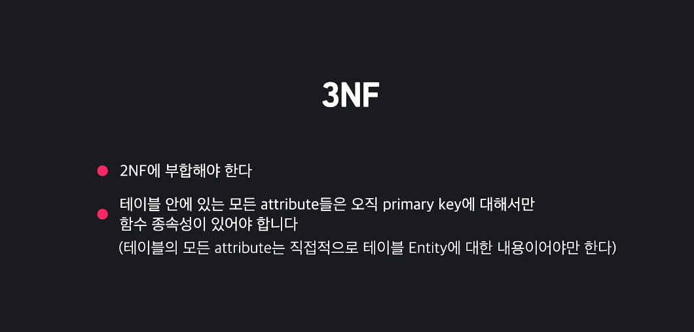

# 3. Data Modeling_2

- #### 데이터베이스 이상 현상

  

  아래와 같은 테이블이 있다고 해보자. 

  1. **삽입이상**

     테이블에 회사 이름과 전화번호만 저장하고 싶음. 유저의 이름과 취미는 모르는 상태. 

     아래 같은 테이블 상태에서 유저 만들지 않고, 회사 정보만 따로 저장할 수가 없음. 

     

     없는 칸을 null이나 다른 데이터로 채워넣어야 함. 이런 현상을 **삽입이상**이라고 함. 

     

  2. **업데이트 이상**

     중복된 값들 중 일부만 수정하여, 데이터가 불일치 하게 되는 모순이 발생하는 현상. 

     테이블에서 코팡의 전화번호가 바뀌었는데, 이때는 코팡의 모든 row를 다 찾아서 일일이 교체 해야함. 하지만, 여기서 실수하면 어디선가 불일치가 나겠지. 

     

  3. **삭제 이상**

     데이터가 필요가 없어서 삭제 하려고 하는데, 꼭 필요한 데이터까지 연쇄삭제 되는 경우. 김영희 유저가 탈퇴해서 데이터를 삭제하고 싶은데, 문제는 테이블에서 삼송을 다니는 유저가 김영희 뿐이였음. 삼송에 대한 데이터는 남겨놓고 싶어도 삭제되는 경우가 발생함. 

     지우고 싶지 않은 데이터까지 지우는 경우. 

     

  결국 데이터 이상현상(anomaly)가 발생하는 **가장 큰 원인은**

  **데이터 모델링이 제대로 되지 않았기 때문**이라는 것을 알 수 있음. 

- #### 정규화

  데이터 모델링을 아무리 정교하게 한다고 해도, 데이터의 구조가 복잡해질수록(즉, 테이블과 컬럼이 많아질수록) 실수로 모델링을 잘못 하거나, 애초에 그 모델링이 좋은지 나쁜지 판단하는 것 조차 어려워짐. 

  이를 위해 한 수학자가 방법을 생각해냈음. 

  

  테이블 안에 있는 컬럼이, 해당 테이블 안에 있는게 맞는지를 알아내서 문제가 있는 컬럼을 다른 테이블로 옮기거나 새로운 테이블을 만들어서 거기로 옮김. 

  

  

  

  정규형은 사실 이 외에도 많지만, 높은 정규형은 데이터베이스를 연구하는 사람이 아니면 볼일이 없음. 

  **대부분은 제 3 정규형에 부합하기만, 하면 잘 정규화된 데이터베이스라고 말함.** 

  

  

  데이터 베이스를 고치는 작업은 번거롭기 때문에, 데이터베이스를 만든 후 실제 데이터베이스에 반영하기 전에 적용하는게 좋다. 

  

  그리고 정규화는 relation모델을 이용해서 배우는게 더 좋음. 

- #### 1NF

  제 1 정규형. 

  **테이블 안 모든 로우의 모든 컬럼 값들은 나눌 수 없는 단일 값이여야 한다.**

  유저는 여러개의 전화번호를 가질 수 있음. 그런 경우 쉼표를 사용해서 저장했음. **이게 바로 부합하지 않는 것.** 

  전화번호 가지고 오거나 수정하고 싶을때, 데이터베이스를 엄청 복잡하게 사용해야 함. 

  

   그럼 제 1 정규형에 부합하지 않는 테이블은 어떻게 부합하게 만들어 줄까? 

  컬럼 수를 늘려?

  

  위처럼 컬럼 수를 늘리면, **1NF에 부합하기는 해도 좋은 모델링은 아니라**는 것을 알 수 있음. 

  앞에서 이미 했지, 해당 attribute분리해서 새로운 테이블로 만들어 주고 관계를 foreign key로 저장하는 것. 

  

- #### 1NF 상세

  **1NF: 나눌 수 없는 단일 값**

  테이블이 1NF를 지키기 위해서는 안에 있는 모든 값이 나눌 수 없는 단일 값이어야 한다고 했습니다.

  영상에서 본 것처럼 아래 테이블은 1NF를 지키고 있지 않습니다. 한 address 컬럼이 여러 개의 주소들을 저장하고 있기 때문이죠.

  

  이 경우에는 이렇게 address 컬럼을 분리해서 새로운 테이블로 만들어야 한다고 했는데요.

  

  아래와 같이 하나의 컬럼을 여러 개로 나누는 것보다 훨씬 더 깔끔한 방법이라고 했었죠?

  

  지난 챕터에서는 이렇게 같은 내용을 저장하는 컬럼이 여러 개가 있을 때는:

  1. NULL이 많이 생길 수 있게 된다
  2. 컬럼을 몇 개를 만들어야 되는지 애매해진다
  3. 조회가 비효율적이게 된다

  이 세 가지 문제점이 생긴다고 했습니다.

  **1NF: 확대 해석**

  사실 1NF를 단순하게 의미 그대로 해석한다면, 컬럼을 여러 개로 나누는 것도 테이블이 1NF를 지키게 바꾸는 게 맞긴한데요.

  1NF를 확대해서 해석 한다면, 컬럼을 늘리는 방법은 1NF를 지킨다고 볼 수 없습니다.

  어떤 데이터베이스 학자들은 "나눌 수 없는 단일 값"을 테이블 안에 있는 모든 값들이 **무조건 하나**의 값만 가져야 된다는 의미로 해석합니다.

  1NF를 지키기 위해서 단순히 테이블의 컬럼을 늘리게 된다면 **구조적**으로 NULL이 많이 생기게 되는 문제가 발생하잖아요? NULL은 아무 값도 없는, 즉 0개의 값을 저장하는 건데요. 0개는 단일 값, 즉 하나의 값에 해당하지 않기 때문에 컬럼을 늘리는 것과 같이 구조적으로 NULL이 많이 발생할 수 있는 테이블들이 1NF에 부합한다고 볼 수 없다고 주장합니다.

  **컬럼에 서로 같은 여러 값이 저장돼있을 때**

  1NF를 어떻게 해석하는지와 상관 없이 위 경우에서 단순히 **같은 데이터를 저장하는 컬럼을 늘려서** 1NF를 지키려고 하는 방법은 좋지 않은 모델링입니다. 컬럼을 따로 테이블로 분리해야 되죠.

  **컬럼에 서로 다른 여러 값이 저장돼있을 때**

  영상에서 따로 언급하지는 않았지만, 1NF를 지키지 않는 경우는 **같은 종류의 값 여러 개**를 저장하고 있는 경우뿐만 아니라, **서로 다른 종류의 값 여러 개**를 저장하고 있는 경우도 있습니다.

  예시를 볼게요.

  

  생각해보면 사람의 이름은 **나눌 수 없는 단일 값**이 아닙니다.

  특히 외국의 경우 성을 의미하는 라스트 네임, 이름을 의미하는 퍼스트 네임에 이어 중간 이름의 미들 네임도 있는데요. 그럼 이 경우 아래와 같은 테이블에서 name이라는 컬럼은 세 개의 값으로 **나눌 수 있기 때문**에 1NF를 지키고 있지 않습니다.

  

  특히 이 컬럼을 많이 업데이트해야 되는 경우 1NF를 지키지 않는다는 사실이 좀 불편할 수 있겠죠? 각각 퍼스트, 미들, 레스트 네임을 수정할 때 전체를 수정해야 되니까요.

  이런 경우에는 테이블을 따로 나눌 필요는 없고요. 그냥 컬럼을 여러 개로 나누면 됩니다. 각각 라스트, 퍼스트, 미들 네임에 해당하는 컬럼을 만들어주면 되는 거죠.

  **나눌 수 없는 단일 값 기준**

  그렇다면 **나눌 수 없는 단일 값**이라는 기준을 어떻게 정할까요?

  사실 길이가 2 이상인 모든 문자열은 더 작은 문자로 나눌 수 있고 (예: "cat" —> "c", "a", "t") 소수도 소수 부분과 (0.1234) 정수 부분 (5678)으로 나눌 수 있는데요. 이걸 다 따로 저장할 수는 없겠죠?

  이런 문제점들 때문에 "나눌 수 없는 단일 값"이라는 표현 자체가 **불완전**하다는 의견도 많이 있긴합니다.

  그 의미가 항상 명확하진 않을 수 있어도, 컬럼 값을 사용할 때 **온전히 그 단위 자체**로 사용하는지, 저장하는 값들을 **일부분만 사용할 수도 있는지**를 판단하고 그걸 바탕으로 모델링해야 합니다.

  **정리**

  핵심만 정리해보면 1NF를 지키지 않는 경우는 크게 두 가지가 있습니다.

  1. 한 컬럼에 **같은 종류의 값**을 여러 개 저장하고 있을 때

  - 이때는 해당 컬럼을 하나의 테이블로 분리해서 모델링합니다.

  1. 한 컬럼에 **서로 다른 종류의 값**을 여러 개 저장하고 있을 때

  - 이때는 한 컬럼을 여러 개로 분리해서 모델링합니다.

- #### 함수종속성

  테이블 안 attribute안에서 생기는 관계. 

  

  **y가 x값에 따라 결정될 때, y는 x에 대해 함수종속성이 있다** 라고 말함. 

  

  그런데, y를 안다고 해서, x가 다 결정되는 것은 아님. 예를 들어서, y=1일때, x는 0일 수도 있고, 1 일수도 있음. 이럴 때, x는 y에 대해 함수 종속성이 없는 거지. 

  

  **이제 이 개념을 테이블에서 적용하자면,** 

  유저의 이메일은 중복될 수 없기 때문에, 하나의 유저를 특정지을 때 사용할 수 있음. 고로, 유저의 이메일만 알고 있으면 이걸 이용해서 유저의 **name, age, gender**값이 결정된다고 할 수 있음. 

  즉, 이런 관계가 있을때, **name/age/gender값은 email에 함수종속성이 있다고 말하는 것. **

  

  그러나, name, age, gender에 따라 나머지 값이 결정되지는 않음. 

  어떤 유저의 나이를 안다고 해서 gender를 알 수 있는 것이 아니고, name/age를 동시에 안다고 하더라도 gender를 알 수 있는 것은 아님. 애초의 고유의 값임을 확신할 수 없기 때문. 

  

  다른 예시를 보자면, 사이즈와 price는 어떤 상품이냐에 따라 결정되지. 아래의 경우에는 size/price가 product_id(*product_id가 사이즈별로 다르다는 가정*)에 따라 결정된다고 할 수 있음. 

  

  함수종속성은 반드시 하나의 컬럼에 대해서만 있어야 하는 것은 아니다. 한 유저는 하나의 상품에 대해서 1개의 평가만 줄 수 있음. 

  

  **즉 컬럼들 사이의 함수종속성이라는 것은, x를 알때, y를 확실히 알 수 있는 경우를 의미함.** 

  함수종속성에는 이행성 이라는 속성이 있음. 

  아래 표를 보면, brand/brand_country는 둘다 product에 대한 함수 종속성이 있음. 그런데 여기서 특징이 약간 다르지. 

  brand는 product에 의해 결정되고, brand_country는 brand에 의해 결정되지. 그래서 굳이 따지자면, brand_country는 brand에 따른 함수 종속성이 있다고 봐야지. 

  

  하나 이상의 attribute를 건너서 함수 종속성이 있는 경우에 **함수 종속성이 넘어갔다. 즉 이행됬다** 고 해서, brand_country는 product에 대해 **이행적 함수 종속성이 있다**고 말함. 

- #### Candidate Key

  **하나의 row를 특정지을 수 있는 attribute들의 최소 집합을 의미함.**

  아래 테이블에서 하나의 리뷰 로우는 한명의 유저가 하가지 상품에 대해 주는 평가. 

  즉, 정확히 어떤 유저인지와 어떤 상품인지를 알 수 있으면 하나의 리뷰 row를 특정지을 수 있음. 

  즉, 이 두개의 attribute의 집합이 이 table의 candidate key가 되는 것. 

  

  당연하지만, id attribute를 사용해도 하나의 row를 특정지을 수 있기 때문에, id attribute도 candidate key지. 

  하나의 테이블에도 여러개의 candidate key가 있을 수 있지. 다만, primary key는 하나만 있을 수 있음. id는 candidate key면서 primary key. 

  

  candidate key는 row를 특정짓는데 사용하는 최소집합이라고 했음. 즉, 최소집합이라는 것은 그 집합에 row를 특정짓는데 사용하지 않은 attribute는 넣지 않는 다는 것. 

  즉, user_id/product_id/score 이 세개가 있어도 당연히 review row를 특정지을 수 있음. score는 근데 없어도 되. 고로, 이 3 attribute들의 집합은 candidate key가 아니라는 것. 

  

  Candidate key에 포함된 모든 attribute들은 **prime attribute**라고 말함. 

  즉 , id/user_id/product_id 3가지가 prime attribute인 것. 

  

  score와 description은 non-attribute에 속함. 

- #### 2NF

  제 2 정규형

  

  예시를 봐보자. 

  user_id와 product_id가 있으면, 하나의 review row를 찾아낼 수 있음. 즉, user_id/product_id는 candidate key임. 

  

  유저 age/price는 하나의 row를 나타내는데 특정될 수 없기 때문에, non-prime attribute임. 

  

  그런데 여기서, age는 user_id에 대한 내용이고, price는 product_id에 대한 내용. 즉, age와 price는 user_id/product_id 각각에 대해 함수종속성이 있음. 

  

  즉, 제 2 정규형을 지키고 있지 않은 것. 

  그럼 어떻게 바꿀까?

  그냥 **candidate key**의 일부분에만 의존하는 **non-prime attribute key**를 따로 분리해 주면됨. 

  age는 user테이블로, price는 product테이블로 옮겨주면 됨. 

  

  옮겨줄 테이블이 없을 때에는, 새로운 테이블을 만들어서 거기에 저장해 주면 됨. 

- #### 3NF

  

  예시를 보자. 코팡의 이벤트 당첨 테이블. 

  

  winner와 age는 **non-prime attribute key**임. 그런데 여기서 age는 winner에 대해 종속적임. **즉 여기서 이미 2NF에 부합하긴 하지** 

  제 3정규형에 부합하기 위해서는, 모든 attribute들이 직접적으로 당첨정보에 대한 내용이여야 함. 즉, **모든 attribute들이 직접적으로 primary key에 대해서 함수종속성이 있어야 함.**

  지금 보면, 모든 attribute들이 id에 대해서 함수종속성이 있긴 함. 즉, id를 찾으면 해당 컬럼의 값을 찾을 수 있음. 그런데, 몇몇개는 이행적임.  

  **제3정규형에 부합하려면 일너 이행적 함수종속성도 없어야 함.** 즉, 다른 attribute를 건너서 종속하고 있으면 안된다는 것. 

  

  

  테이블이 위처럼 되야 제3정규형에 부합되는 것. 

- #### 정규화 정리 및 과정 상세

  이번 레슨에서는 주어진 테이블을 정규화해보면서 이번 챕터에서 배운 내용을 정리해보겠습니다. 정규화는 단순히 이번 레슨에서 배운 내용들 뿐만 아니라, 저번 챕터에서 배운 내용들도 사용하니까요. 헷갈리시는 내용이 있다면 꼭 앞 레슨들에서 해당 개념을 복습하고 오시는 걸 추천드립니다.

  온라인 쇼핑몰 코팡에서 사용하는 상품 (product) 테이블을 예시로 사용하겠습니다. 테이블 구조는 아래와 같습니다.

  

  충분히 만들어낼 수 있을 거 같은 테이블인데요. 이제 이 테이블을 정규화해보겠습니다. 아래 내용을 확인하기 전에 먼저 직접 해보시는 걸 추천드립니다.

  #### 1NF

  테이블이 1NF에 부합하기 위해서는 테이블 안에 있는 모든 값이 **나눌 수 없는 단일 값**이어야 합니다.

  첫 번째 로우의 keywords 컬럼을 살펴보면 여름, 반팔, 스포츠이 저장돼있습니다. 하나가 아니라 여러 개의 키워드들이 저장되고 있잖아요? 그렇기 때문에 현재 테이블은 1NF에 부합하지 않습니다.

  테이블을 1NF에 부합하게 만들기 위해서는 keywords 컬럼을 테이블로 분리해야겠죠?

  

  그리고 그 다음에는 두 테이블 사이 관계를 모델링해야 합니다.

  비즈니스 룰을 사용해서 관계의 카디널리티를 파악합니다.

  하나의 제품은 여러 개의 키워드를 가질 수 있습니다. 마찬가지로 하나의 키워드는 여러 제품에서 사용될 수 있습니다.

  두 테이블 사이에는 M:N (다대다) 관계가 있습니다. M:N 관계는 연결 테이블을 사용해서 모델링합니다. 연결 테이블을 추가하면 테이블들을 이렇게 만들어줄 수 있습니다.

  

  1NF에 부합하지 않는 테이블 하나에서 1NF에 부합하는 테이블 세 개를 만들어냈습니다.

  #### 2NF

  

  다음에는 테이블이 2NF에 부합하게끔 정규화하겠습니다.

  현재 테이블은 1NF에 부합하고 있기 때문에 2NF에 부합하기 위해서는 candidate key의 일부분에만 의존하는 non-prime attribute은 없어야 합니다.

  

  **candidate key 찾기**

  이걸 알아내기 위해서는 candidate key와 non-prime attribute을 파악해야합니다. id는 attribute 하나만으로 모든 상품을 특정지을 수 있기 때문에 (일부분이란 개념이 없기 때문에) 생각하지 않고요, 여러 attribute의 조합으로 만들어지는 candidate key에 대해서만 생각하겠습니다.

  이 테이블에서는 상품 이름 name, 브랜드 이름 brand, 그리고 크기 size, 이 세 attribute이 있으면 하나의 상품을 특정 지을 수 있습니다. 다르게 표현하면 ***{name, brand, size}*** 이게 하나의 candidate key가 되는 거죠.

  그리고 candidate key에 포함되지 않는 다른 모든 attribute는 (***{brand_country, in_stock, price, designer, designer_country}***) 모두 non-prime attribute입니다.

  

  **non-prime attribute들의 함수 종속성 찾기**

  그럼 테이블이 2NF에 부합하기 위해서는 각각 name, brand, size attribute들 각각, 또는 여기서 두 개의 attribute의 조합에 대한 함수 종속성이 있는 non-prime attribute이 있으면 안 됩니다.

  각 non-prime attribute의 함수 종속성을 확인해봅시다. 이렇게 정리할 수 있을 거 같은데요.

  

  브랜드 국가는 브랜드에 대해서,

  가격, 디자이너, 디자이너 국적은 제품 이름과 브랜드에 대해서,

  재고는 제품 이름, 브랜드, 크기에 대해서 함수 종속성이 있죠.

  

  **테이블 분리하기**

  2NF에 부합하게 만들기 위해서는 product 테이블을, 모든 non-prime attribute이 candidate key의 전체에만 함수 종속성이 있는 세 개의 테이블로 분리해야 합니다.

  

  그리고 이 테이블들 사이 관계를 모델링합니다.

  비즈니스 룰을 사용해서 관계의 카디널리티를 파악합니다.

  콜라보 제품은 고려하지 않고 상품은 딱 하나의 브랜드만 가질 수 있습니다. 반면 브랜드는 수많은 상품을 가질 수 있죠.

  brand와 product 사이에는 1:N 관계가 있습니다. 다수에 해당하는 product 테이블에  foreign key를 넣어줘서 관계를 모델링 합니다.

  상품은 여러 개의 크기와 제고를 가질 수 있습니다. 특정 크기와 제고는 항상 하나의 상품에만 대한 내용입니다.

  product와 product_size_stock은 1:N 관계가 있습니다. 다수에 해당하는 product_size_stock 테이블에 foreign key를 넣어줘서 관계를 모델링합니다.

  

  2NF에 부합하지 않는 하나의 테이블을 2NF에 부합하는 세 개의 테이블로 나눠줬습니다.

  **3NF**

  

  다음에는 테이블이 3NF에 부합하게끔 정규화하겠습니다. 이미 2NF에 부합하는 테이블이 3NF에 부합하기 위해서는 테이블 안 모든 attribute은 primary key에 대해 직접적인 함수 종속성이 있어야합니다. 이행적 함수 종속성도 있으면 안 되죠..

  **이행적 함수 종속성 파악**

  테이블을 살펴보면 name, brand_id, price, designer, 모두 한 상품에 대한 내용입니다. 직접적으로 id에 대한 함수 종속성이 있습니다. 하지만 디자이너 국적은 직접적으로는 어떤 상품인지가 아니라, 어떤 디자이너인지에 따라 결정되는 값입니다. 함수 종속성이 이행적인 거죠.

  

  3NF를 어기고 있습니다.

  **테이블 분리**

  이걸 해결하기 위해서는 designer에 대한 컬럼들을 따로 테이블로 분리해야 합니다.

  

  그리고 이 테이블들 사이 관계를 모델링합니다.

  비즈니스 룰을 사용해서 관계의 카디널리티를 파악합니다.

  하나의 상품은 하나의 디자이너만 있을 수 있고, 한 명의 디자이너는 여러 제품을 디자인할 수 있습니다.

  디자이너와 상품은 1:N 관계가 있습니다. 다수에 해당하는 product 테이블에 foreign key를 넣어줘서 관계를 모델링합니다.

  

  **정리**

  

  이번 레슨에서는 정규화되지 않은 위에 있는 테이블을 3NF에 부합하게끔 바꾸는 과정을 살펴봤습니다.

  정규화 되지 않은 하나의 테이블을 3NF에 부합하는 6개의 테이블로 나눠줬죠.

  

  3NF까지 정규화를 하고 나면, 중복되는 데이터 등 모델링 실수로 생기는 데이터베이스 이상 현상을 웬만해서는 다 예방할 수 있습니다.

  일반적으로 3NF에 부합하는 데이터베이스를 보고 "정규화된 데이터베이스"라고 부릅니다.

  더 높은 정규형들은  데이터베이스를 학문적으로 공부하는 학자, 또는 연구원들 이외에는 크게 관심을 갖지 않는데요. 저희도 이번 챕터에서는 여기까지만 알아보도록 하겠습니다.

- #### 비정규화

  **비정규화**

  비정규화는 정규형에 부합하는 테이블을 정규형을 지키지 않게 바꾸는 걸 의미합니다.

  다양한 정규형은 테이블이, 좋은지, 안 좋은지 판단할 수 있는 일종의 기준이라고 했는데요. 기껏 열심히 잘 만든 테이블을 왜 더 안 좋게 만들까요?

  바로 성능 개선을 위해서입니다.

  정규형을 지키기 위한 가장 기본적인 해법은 하나의 테이블을 여러 개로 나누거나 겁니다. 데이터베이스에서 원하는 데이터를 찾을 때는 조인(join)을 사용해서 다양한 테이블들에 있는 데이터를 합쳐야 하는 경우가 많습니다.

  정규화로 인해서 데이터가 이곳저곳 너무 많이 퍼져있으면, 퍼져있는 데이터를 다시 모을 때 속도가 느려질 수 있습니다. 비정규화를 하면 이런 정보들은 한 테이블에 저장할 수 있기 때문에 조금 더 빠르게 조회를 할 수 있죠.

  쉽게 생각하면, 아래와 같이 데이터베이스가 정규화가 안 됐을 때는 모든 데이터가 한 테이블에 있기 때문에 오히려 조회가 더 빨리 실행될 수 있는 반면,

  

  이렇게 정규화가 된 데이터베이스에서 원하는 데이터를 조회할 때는 여러 테이블들을 합쳐야되기 때문에 오히려 더 오래 걸릴 수도 있는 거죠.

  

  하지만 이번 챕터에서 다뤘듯이, 정규형에 부합하지 않는 테이블들은 삽입, 업데이트, 삭제 이상 현상들이 생기는 등 문제점들이 많이 있습니다. 비정규화를 고려할 때는 항상 이 문제점들에 대해서 인지를 하고 있어야 합니다.

  1. **데이터가 너무 퍼져있어서 조회 성능 문제가 심각한 수준으로 일어나는 게 확실하고**
  2. **테이블을 삽입, 업데이트, 삭제하는 것보다 조회하는 용도로만 사용하고 있을 때**

  이 두 경우에만 고려할 수 있습니다.